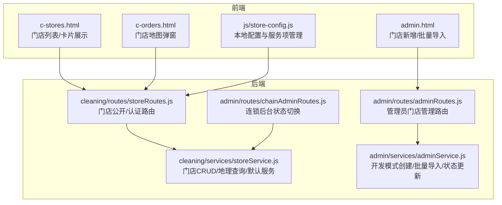
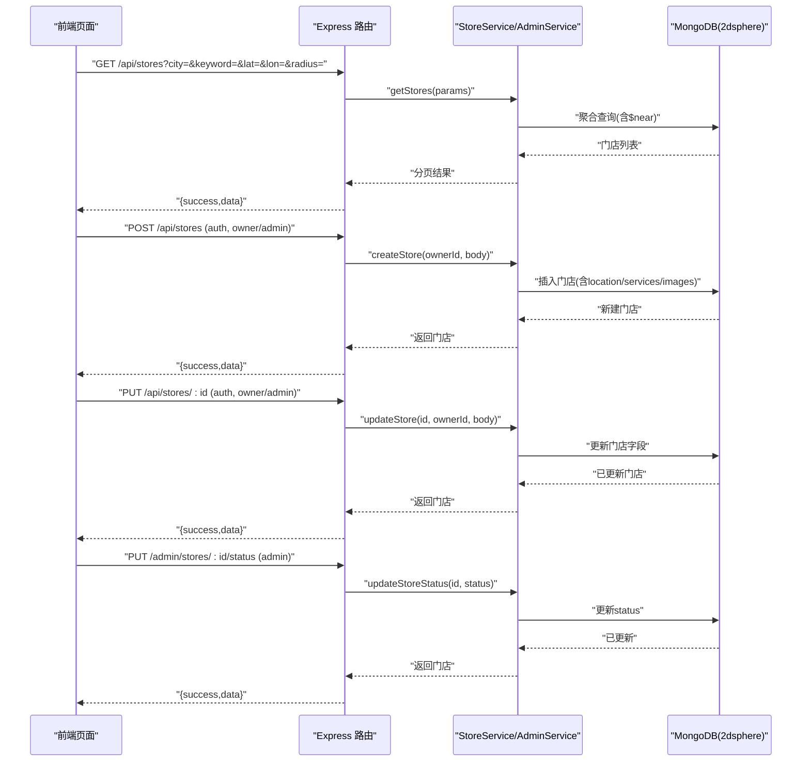
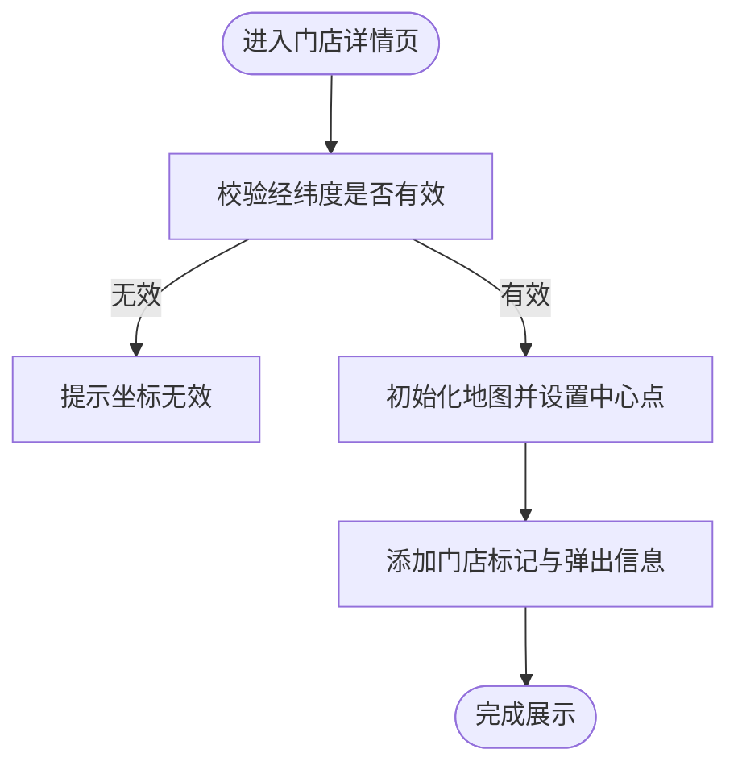
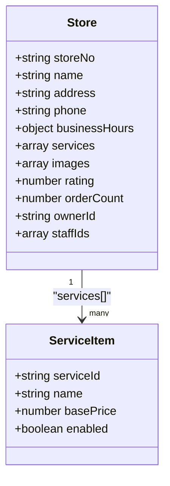
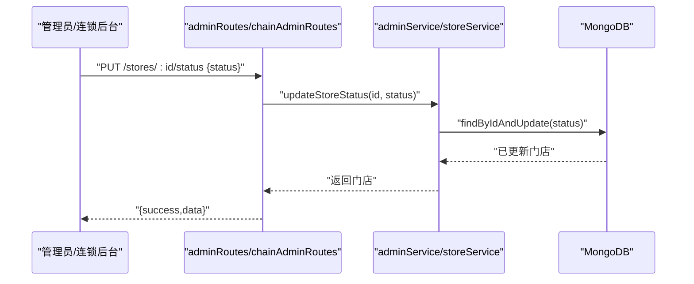
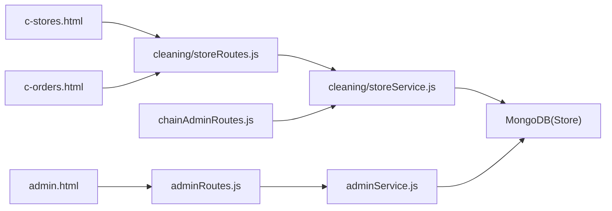

# 门店基本信息管理

<cite>
**本文引用的文件**   
- [storeRoutes.js](file://backend/modules/cleaning/routes/storeRoutes.js)
- [storeService.js](file://backend/modules/cleaning/services/storeService.js)
- [adminRoutes.js](file://backend/modules/admin/routes/adminRoutes.js)
- [adminService.js](file://backend/modules/admin/services/adminService.js)
- [chainAdminRoutes.js](file://backend/modules/admin/routes/chainAdminRoutes.js)
- [index.html](file://index.html)
- [c-stores.html](file://c-stores.html)
- [c-orders.html](file://c-orders.html)
- [store-config.js](file://js/store-config.js)
</cite>

## 目录
1. [简介](#简介)
2. [项目结构](#项目结构)
3. [核心组件](#核心组件)
4. [架构总览](#架构总览)
5. [详细组件分析](#详细组件分析)
6. [依赖关系分析](#依赖关系分析)
7. [性能与扩展性](#性能与扩展性)
8. [故障排查指南](#故障排查指南)
9. [结论](#结论)
10. [附录：接口清单](#附录接口清单)

## 简介
本文件围绕“门店基本信息管理”进行系统化说明，覆盖以下能力：
- 门店基础信息维护：名称、地址、联系方式等字段的增删改查
- 地理位置设置：经纬度坐标录入与地图定位展示
- 营业时间配置：常规营业时段与节假日特殊安排
- 服务项目管理：干洗、水洗、熨烫、皮革护理等服务类型及价格配置
- 门店图片上传与管理：多张图片的上传、预览与排序（前端能力）
- 门店状态管理：启用/禁用的快速切换操作

## 项目结构
后端采用 Express + Mongoose 的分层设计：路由层负责 HTTP 请求解析与鉴权，服务层封装业务逻辑与数据访问；前端提供门店列表、详情、地图展示与批量导入等交互。

图示来源
- [storeRoutes.js:1-194](file://backend/modules/cleaning/routes/storeRoutes.js#L1-L194)
- [storeService.js:1-376](file://backend/modules/cleaning/services/storeService.js#L1-L376)
- [adminRoutes.js:96-238](file://backend/modules/admin/routes/adminRoutes.js#L96-L238)
- [adminService.js:475-628](file://backend/modules/admin/services/adminService.js#L475-L628)
- [chainAdminRoutes.js:1022-1059](file://backend/modules/admin/routes/chainAdminRoutes.js#L1022-L1059)
- [index.html:850-1049](file://index.html#L850-L1049)
- [c-stores.html:263-286](file://c-stores.html#L263-L286)
- [c-orders.html:1484-1570](file://c-orders.html#L1484-L1570)
- [store-config.js:41-77](file://js/store-config.js#L41-L77)

章节来源
- [storeRoutes.js:1-194](file://backend/modules/cleaning/routes/storeRoutes.js#L1-L194)
- [storeService.js:1-376](file://backend/modules/cleaning/services/storeService.js#L1-L376)
- [adminRoutes.js:96-238](file://backend/modules/admin/routes/adminRoutes.js#L96-L238)
- [adminService.js:475-628](file://backend/modules/admin/services/adminService.js#L475-L628)
- [chainAdminRoutes.js:1022-1059](file://backend/modules/admin/routes/chainAdminRoutes.js#L1022-L1059)
- [index.html:850-1049](file://index.html#L850-L1049)
- [c-stores.html:263-286](file://c-stores.html#L263-L286)
- [c-orders.html:1484-1570](file://c-orders.html#L1484-L1570)
- [store-config.js:41-77](file://js/store-config.js#L41-L77)

## 核心组件
- 门店模型与索引
  - 支持地理位置 Point 字段与 2dsphere 索引，便于近邻搜索
  - 包含门店编号、名称、地址、城市/区域、电话、营业时间、服务项目、图片数组、描述、评分、订单数、所有者ID、员工ID集合、连锁相关字段与时间戳
- 服务层 StoreService
  - 提供门店列表（支持按城市/区域/关键词/经纬度半径筛选）、详情、服务列表、创建、更新、老板门店列表等
  - 内置默认服务集（干洗、水洗、熨烫、皮革护理、皮草护理）
- 管理员服务 AdminService
  - 开发模式下直接创建门店、批量导入门店、更新门店状态
- 路由层
  - cleaning 模块暴露公开与认证两类门店接口
  - admin 模块提供管理员对门店的增删改查与状态控制
  - chainAdmin 模块提供连锁后台的状态切换

章节来源
- [storeService.js:8-48](file://backend/modules/cleaning/services/storeService.js#L8-L48)
- [storeService.js:55-144](file://backend/modules/cleaning/services/storeService.js#L55-L144)
- [storeService.js:356-364](file://backend/modules/cleaning/services/storeService.js#L356-L364)
- [adminService.js:497-539](file://backend/modules/admin/services/adminService.js#L497-L539)
- [adminService.js:546-628](file://backend/modules/admin/services/adminService.js#L546-L628)
- [storeRoutes.js:18-100](file://backend/modules/cleaning/routes/storeRoutes.js#L18-L100)
- [adminRoutes.js:117-155](file://backend/modules/admin/routes/adminRoutes.js#L117-L155)
- [chainAdminRoutes.js:1041-1048](file://backend/modules/admin/routes/chainAdminRoutes.js#L1041-L1048)

## 架构总览
下图展示了从前端到后端的完整调用链路，包括公开查询、认证修改、管理员与连锁后台的状态控制。

图示来源
- [storeRoutes.js:18-86](file://backend/modules/cleaning/routes/storeRoutes.js#L18-L86)
- [storeService.js:55-157](file://backend/modules/cleaning/services/storeService.js#L55-L157)
- [adminRoutes.js:117-155](file://backend/modules/admin/routes/adminRoutes.js#L117-L155)
- [adminService.js:475-492](file://backend/modules/admin/services/adminService.js#L475-L492)

## 详细组件分析

### 门店基础信息维护（增删改查）
- 创建门店
  - 公开接口：POST /api/stores（需认证，角色 admin/store_owner）
  - 管理员接口：POST /admin/stores（开发模式直写，生产模式委托 storeService）
  - 必填字段：名称、电话、地址；可选：城市、区域、位置、营业时间、描述、图片
- 更新门店
  - PUT /api/stores/:id（需认证，角色 admin/store_owner）
  - 支持更新任意可写字段（如 location、businessHours、services、images、description 等）
- 获取门店列表
  - GET /api/stores（支持 city/district/keyword/latitude/longitude/radius 过滤）
- 获取门店详情
  - GET /api/stores/:id
- 删除门店
  - 当前代码未暴露显式删除接口；如需删除，可在管理员侧扩展或采用软删除策略

章节来源
- [storeRoutes.js:66-86](file://backend/modules/cleaning/routes/storeRoutes.js#L66-L86)
- [storeRoutes.js:18-43](file://backend/modules/cleaning/routes/storeRoutes.js#L18-L43)
- [storeService.js:125-157](file://backend/modules/cleaning/services/storeService.js#L125-L157)
- [adminRoutes.js:134-155](file://backend/modules/admin/routes/adminRoutes.js#L134-L155)
- [adminRoutes.js:209-222](file://backend/modules/admin/routes/adminRoutes.js#L209-L222)

### 地理位置设置（经纬度与地图定位）
- 数据结构
  - location 为 GeoJSON Point，coordinates 顺序为 [经度, 纬度]
  - 建立 2dsphere 索引以支持空间查询
- 近邻搜索
  - 通过 latitude/longitude/radius 参数实现“附近门店”查询
- 前端地图展示
  - c-orders.html 中根据经纬度打开地图弹窗并渲染标记
  - index.html 提供门店新增表单（含城市/区域/营业时间等），可与地图选点联动（由前端集成）

图示来源
- [storeService.js:14-46](file://backend/modules/cleaning/services/storeService.js#L14-L46)
- [storeService.js:69-94](file://backend/modules/cleaning/services/storeService.js#L69-L94)
- [c-orders.html:1484-1570](file://c-orders.html#L1484-L1570)
- [index.html:850-949](file://index.html#L850-L949)

章节来源
- [storeService.js:14-46](file://backend/modules/cleaning/services/storeService.js#L14-L46)
- [storeService.js:69-94](file://backend/modules/cleaning/services/storeService.js#L69-L94)
- [c-orders.html:1484-1570](file://c-orders.html#L1484-L1570)
- [index.html:850-949](file://index.html#L850-L949)

### 营业时间配置（常规时间与节假日）
- 数据结构
  - businessHours.open/close 为字符串时间
  - holidays 为节假日日期数组（用于特殊安排）
- 前端录入
  - admin.html 新增/编辑表单提供开始/结束时间输入
- 默认值与兼容
  - 服务层在创建时写入默认营业时间；批量导入也提供默认值兜底

章节来源
- [storeService.js:19-23](file://backend/modules/cleaning/services/storeService.js#L19-L23)
- [adminService.js:512-516](file://backend/modules/admin/services/adminService.js#L512-L516)
- [adminService.js:580-584](file://backend/modules/admin/services/adminService.js#L580-L584)
- [index.html:916-927](file://index.html#L916-L927)

### 服务项目管理（类型与价格）
- 默认服务集
  - 干洗、水洗、熨烫、皮革护理、皮草护理，均带 basePrice 与 enabled 开关
- 获取门店服务
  - GET /api/stores/:id/services 返回启用的服务列表
- 前端配置
  - js/store-config.js 提供本地配置读写与合并默认值，便于离线/演示场景下管理服务项
- 价格与促销
  - 服务项包含价格字段；促销信息可通过前端配置扩展（非本文件重点）

图示来源
- [storeService.js:24-29](file://backend/modules/cleaning/services/storeService.js#L24-L29)
- [storeService.js:356-364](file://backend/modules/cleaning/services/storeService.js#L356-L364)
- [storeRoutes.js:49-56](file://backend/modules/cleaning/routes/storeRoutes.js#L49-L56)
- [store-config.js:41-77](file://js/store-config.js#L41-L77)

章节来源
- [storeService.js:24-29](file://backend/modules/cleaning/services/storeService.js#L24-L29)
- [storeService.js:356-364](file://backend/modules/cleaning/services/storeService.js#L356-L364)
- [storeRoutes.js:49-56](file://backend/modules/cleaning/routes/storeRoutes.js#L49-L56)
- [store-config.js:41-77](file://js/store-config.js#L41-L77)

### 门店图片上传与管理（多图片、预览、排序）
- 数据模型
  - images 为字符串数组，通常存储图片 URL 或资源标识
- 前端能力
  - 现有前端页面未提供专门的“门店图片上传/排序”界面；但模型与接口已预留 images 字段
  - 建议在前端新增图片选择器、预览区与拖拽排序，并在更新门店时提交 images 数组
- 上传流程建议
  - 前端选择多张图片 -> 压缩/校验大小与类型 -> 上传至对象存储 -> 获得URL列表 -> 提交 PUT /api/stores/:id 更新 images

章节来源
- [storeService.js:31](file://backend/modules/cleaning/services/storeService.js#L31)
- [storeService.js:125-144](file://backend/modules/cleaning/services/storeService.js#L125-L144)
- [storeRoutes.js:79-86](file://backend/modules/cleaning/routes/storeRoutes.js#L79-L86)

### 门店状态管理（启用/禁用）
- 管理员接口
  - PUT /admin/stores/:id/status 更新门店状态
- 连锁后台接口
  - PUT /chain-admin/stores/:id/status 基于连锁归属校验后更新状态
- 状态枚举
  - active/inactive/suspended（服务层定义）

图示来源
- [adminRoutes.js:117-131](file://backend/modules/admin/routes/adminRoutes.js#L117-L131)
- [adminService.js:475-492](file://backend/modules/admin/services/adminService.js#L475-L492)
- [chainAdminRoutes.js:1041-1048](file://backend/modules/admin/routes/chainAdminRoutes.js#L1041-L1048)
- [storeService.js:30](file://backend/modules/cleaning/services/storeService.js#L30)

章节来源
- [adminRoutes.js:117-131](file://backend/modules/admin/routes/adminRoutes.js#L117-L131)
- [adminService.js:475-492](file://backend/modules/admin/services/adminService.js#L475-L492)
- [chainAdminRoutes.js:1041-1048](file://backend/modules/admin/routes/chainAdminRoutes.js#L1041-L1048)
- [storeService.js:30](file://backend/modules/cleaning/services/storeService.js#L30)

## 依赖关系分析
- 路由到服务
  - cleaning/routes/storeRoutes.js 依赖 cleaning/services/storeService.js
  - admin/routes/adminRoutes.js 依赖 admin/services/adminService.js，并在部分路径动态引入 storeService
  - admin/routes/chainAdminRoutes.js 直接操作 Store 模型更新状态
- 服务到数据库
  - storeService 使用 Mongoose Model Store，并建立 2dsphere 索引
  - adminService 在开发模式下直接创建 Store 文档
- 前端到后端
  - admin.html 发起新增/批量导入请求
  - c-stores.html 展示门店列表与基本属性
  - c-orders.html 使用经纬度渲染地图

图示来源
- [storeRoutes.js:1-10](file://backend/modules/cleaning/routes/storeRoutes.js#L1-L10)
- [storeService.js:1-48](file://backend/modules/cleaning/services/storeService.js#L1-L48)
- [adminRoutes.js:1-14](file://backend/modules/admin/routes/adminRoutes.js#L1-L14)
- [adminService.js:475-539](file://backend/modules/admin/services/adminService.js#L475-L539)
- [chainAdminRoutes.js:1022-1059](file://backend/modules/admin/routes/chainAdminRoutes.js#L1022-L1059)
- [index.html:850-949](file://index.html#L850-L949)
- [c-stores.html:263-286](file://c-stores.html#L263-L286)
- [c-orders.html:1484-1570](file://c-orders.html#L1484-L1570)

章节来源
- [storeRoutes.js:1-10](file://backend/modules/cleaning/routes/storeRoutes.js#L1-L10)
- [storeService.js:1-48](file://backend/modules/cleaning/services/storeService.js#L1-L48)
- [adminRoutes.js:1-14](file://backend/modules/admin/routes/adminRoutes.js#L1-L14)
- [adminService.js:475-539](file://backend/modules/admin/services/adminService.js#L475-L539)
- [chainAdminRoutes.js:1022-1059](file://backend/modules/admin/routes/chainAdminRoutes.js#L1022-L1059)
- [index.html:850-949](file://index.html#L850-L949)
- [c-stores.html:263-286](file://c-stores.html#L263-L286)
- [c-orders.html:1484-1570](file://c-orders.html#L1484-L1570)

## 性能与扩展性
- 空间查询优化
  - 使用 2dsphere 索引与 $near 查询，建议在高频查询维度上建立复合索引（如 status+city）
- 分页与投影
  - 列表查询使用 skip/limit 与 lean() 提升性能；避免返回敏感字段（如 staffIds）
- 默认服务与配置
  - 默认服务集减少重复初始化成本；可按门店差异化配置
- 可扩展点
  - 增加图片上传专用接口与排序接口
  - 增加节假日模板与自动应用规则
  - 增加软删除与审计日志

[本节为通用指导，不直接分析具体文件]

## 故障排查指南
- 地图无法显示
  - 检查经纬度是否为数字且在中国范围内；确认前端弹窗容器存在并已渲染
- 附近门店无结果
  - 确认 location 字段为 GeoJSON Point 且已建立 2dsphere 索引；检查 radius 单位换算（km->m）
- 更新门店失败
  - 检查权限（owner/admin）；确认门店存在且未被并发修改
- 批量导入失败
  - 检查必填字段（名称、电话、地址）；查看错误行号与原因

章节来源
- [c-orders.html:1484-1570](file://c-orders.html#L1484-L1570)
- [storeService.js:69-94](file://backend/modules/cleaning/services/storeService.js#L69-L94)
- [storeService.js:149-157](file://backend/modules/cleaning/services/storeService.js#L149-L157)
- [adminService.js:546-628](file://backend/modules/admin/services/adminService.js#L546-L628)

## 结论
本系统已具备完整的门店基础信息管理闭环：支持门店信息的增删改查、地理位置与地图展示、营业时间与节假日配置、服务项目的默认与个性化设置、以及门店状态的统一管控。后续可在图片上传与排序、节假日模板化、软删除与审计等方面进一步增强体验与可运维性。

[本节为总结性内容，不直接分析具体文件]

## 附录：接口清单
- 公开接口
  - GET /api/stores：门店列表（支持分页、城市/区域/关键词、经纬度半径）
  - GET /api/stores/:id：门店详情
  - GET /api/stores/:id/services：门店服务列表（仅启用）
- 认证接口
  - POST /api/stores：创建门店（admin/store_owner）
  - PUT /api/stores/:id：更新门店（admin/store_owner）
  - GET /api/stores/owner/my：我的门店（admin/store_owner）
- 管理员接口
  - GET /admin/stores：门店列表（分页、关键词、状态）
  - PUT /admin/stores/:id/status：更新门店状态（admin）
  - POST /admin/stores：创建门店（开发模式直写）
  - POST /admin/stores/import：批量导入门店
  - PUT /admin/stores/:id：更新门店（admin）
  - GET /admin/stores/:id：门店详情（admin）
- 连锁后台接口
  - PUT /chain-admin/stores/:id/status：更新门店状态（连锁管理员）

章节来源
- [storeRoutes.js:18-100](file://backend/modules/cleaning/routes/storeRoutes.js#L18-L100)
- [adminRoutes.js:96-238](file://backend/modules/admin/routes/adminRoutes.js#L96-L238)
- [chainAdminRoutes.js:1041-1048](file://backend/modules/admin/routes/chainAdminRoutes.js#L1041-L1048)