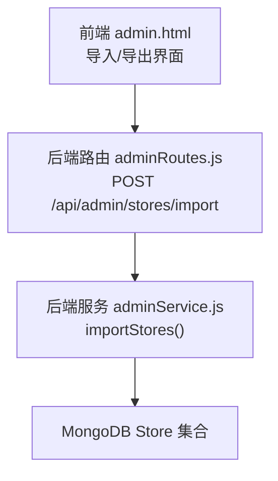
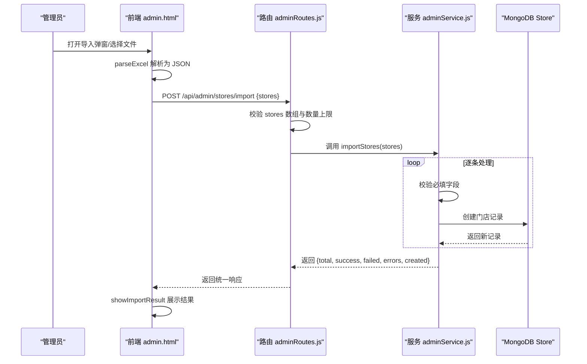
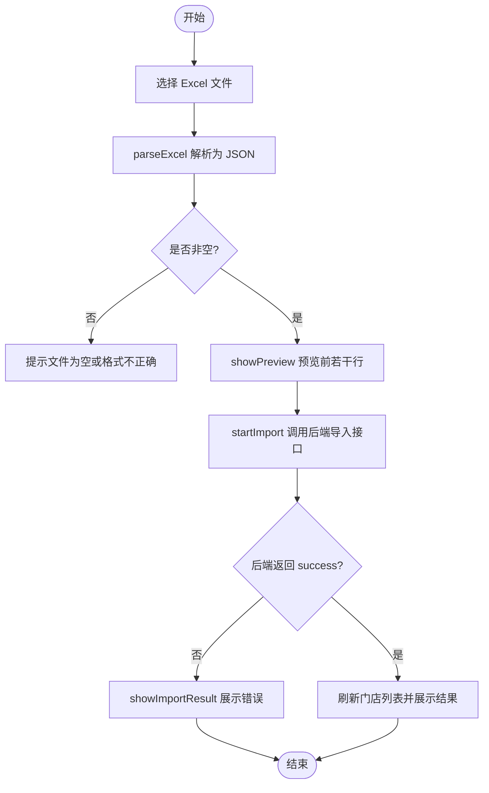
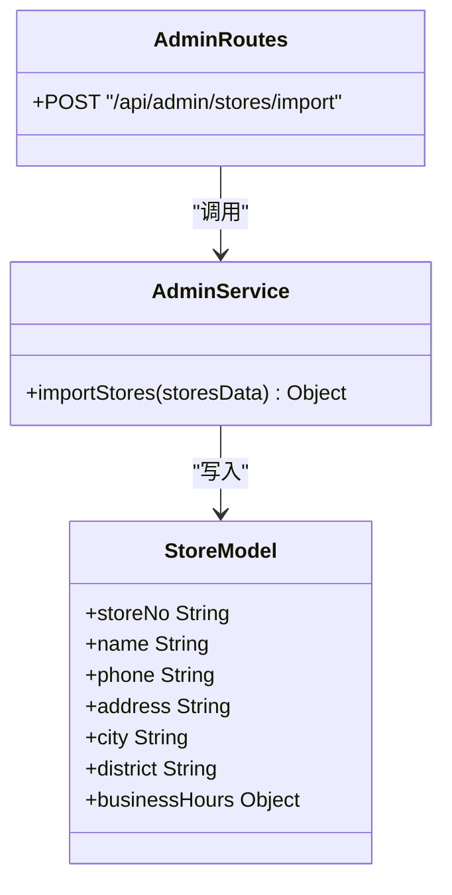
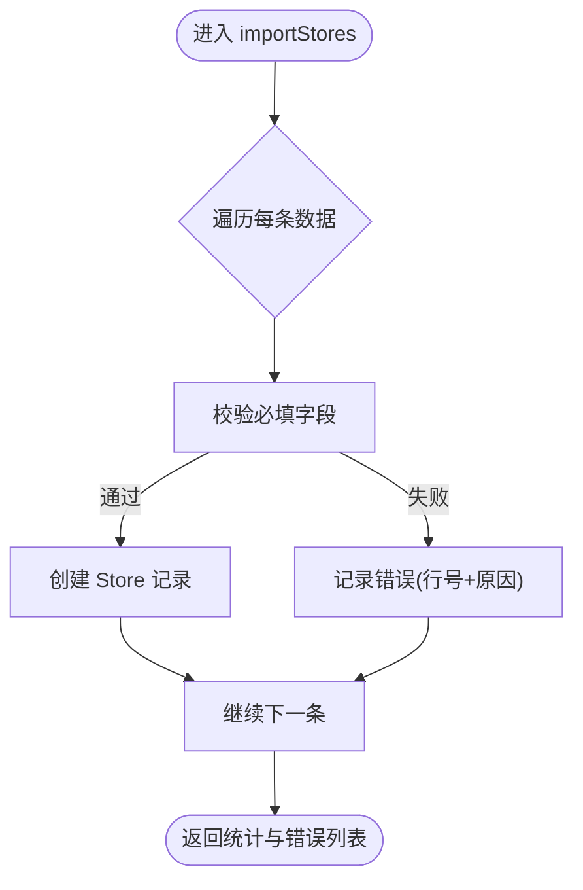
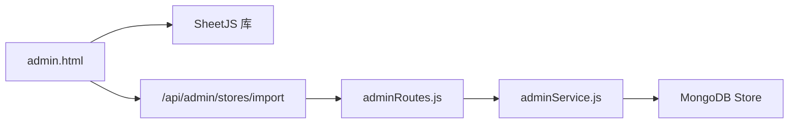

# 门店数据导入导出

<cite>
**本文引用的文件**   
- [admin.html](file://admin.html)
- [adminRoutes.js](file://backend/modules/admin/routes/adminRoutes.js)
- [adminService.js](file://backend/modules/admin/services/adminService.js)
</cite>

## 目录
1. [简介](#简介)
2. [项目结构](#项目结构)
3. [核心组件](#核心组件)
4. [架构总览](#架构总览)
5. [详细组件分析](#详细组件分析)
6. [依赖关系分析](#依赖关系分析)
7. [性能与容量](#性能与容量)
8. [故障排查指南](#故障排查指南)
9. [结论](#结论)
10. [附录](#附录)

## 简介
本文件面向“门店数据导入导出”功能，覆盖以下要点：
- Excel 批量导入：模板下载、字段映射、数据校验、错误处理与结果反馈
- 数据导出：按条件筛选并生成 Excel
- 更新策略：新增与更新的智能判断（当前实现为新增）
- 进度监控与日志：前端交互状态与后端日志记录
- 数据安全：事务回滚现状说明与改进建议

## 项目结构
该功能涉及前端管理页面与后端管理员模块的路由与服务：
- 前端：admin.html 提供导入/导出 UI、Excel 解析、预览与结果展示
- 后端路由：adminRoutes.js 暴露 /api/admin/stores/import 接口
- 后端服务：adminService.js 实现 importStores 业务逻辑与 Store 模型定义

图示来源
- [admin.html:2894-3042](file://admin.html#L2894-L3042)
- [adminRoutes.js:157-206](file://backend/modules/admin/routes/adminRoutes.js#L157-L206)
- [adminService.js:546-628](file://backend/modules/admin/services/adminService.js#L546-L628)

章节来源
- [admin.html:2894-3042](file://admin.html#L2894-L3042)
- [adminRoutes.js:157-206](file://backend/modules/admin/routes/adminRoutes.js#L157-L206)
- [adminService.js:546-628](file://backend/modules/admin/services/adminService.js#L546-L628)

## 核心组件
- 前端导入流程
  - 模板下载：downloadImportTemplate 生成示例 Excel
  - 文件选择与解析：handleFileSelect + parseExcel（SheetJS）
  - 预览：showPreview 显示前若干行
  - 提交导入：startImport 调用后端 /api/admin/stores/import
  - 结果展示：showImportResult 汇总成功/失败与错误明细
- 后端导入接口
  - 路由层：adminRoutes.js 校验请求体与数量限制，调用服务层
  - 服务层：adminService.js importStores 逐条校验与写入，返回统计与错误列表
- 数据模型
  - Store 模型包含 storeNo、name、phone、address、city、district、businessHours 等字段

章节来源
- [admin.html:2946-3042](file://admin.html#L2946-L3042)
- [adminRoutes.js:157-206](file://backend/modules/admin/routes/adminRoutes.js#L157-L206)
- [adminService.js:96-126](file://backend/modules/admin/services/adminService.js#L96-L126)
- [adminService.js:546-628](file://backend/modules/admin/services/adminService.js#L546-L628)

## 架构总览
下图展示了从用户点击“批量导入”到数据落库的完整链路。

图示来源
- [admin.html:2967-3042](file://admin.html#L2967-L3042)
- [adminRoutes.js:157-206](file://backend/modules/admin/routes/adminRoutes.js#L157-L206)
- [adminService.js:546-628](file://backend/modules/admin/services/adminService.js#L546-L628)

## 详细组件分析

### 前端导入与导出
- 模板下载
  - 通过 downloadImportTemplate 生成包含示例行的 Excel，列名包括：门店名称、联系电话、门店地址、城市、区域、营业开始时间、营业结束时间、门店描述
- 文件解析与预览
  - handleFileSelect 触发 parseExcel，使用 SheetJS 将首个工作表转为 JSON
  - showPreview 动态渲染表头与前若干行数据，便于确认格式
- 提交导入
  - startImport 获取认证令牌后，以 application/json 形式发送 { stores } 至后端
  - 成功后刷新门店列表并展示导入结果
- 结果反馈
  - showImportResult 汇总 total/success/failed/errors，并在 UI 中列出每行错误信息
- 数据导出
  - 导出按钮 exportData('stores') 已存在；当前实现为占位提示，未实际生成 Excel

图示来源
- [admin.html:2870-3042](file://admin.html#L2870-L3042)

章节来源
- [admin.html:2946-3042](file://admin.html#L2946-L3042)
- [admin.html:6054-6060](file://admin.html#L6054-L6060)

### 后端导入接口与服务
- 路由层
  - 校验请求体 stores 是否为非空数组，且不超过单次上限
  - 调用 adminService.importStores 并返回统一响应
- 服务层
  - 逐条校验必填字段（门店名称、电话、地址）
  - 自动生成门店编号前缀并按顺序拼接序号
  - 构造 Store 对象并持久化，收集成功与失败明细
  - 返回统计信息与错误列表
- 数据模型
  - Store 模型包含 storeNo、name、phone、address、city、district、businessHours 等字段

图示来源
- [adminRoutes.js:157-206](file://backend/modules/admin/routes/adminRoutes.js#L157-L206)
- [adminService.js:546-628](file://backend/modules/admin/services/adminService.js#L546-L628)
- [adminService.js:96-126](file://backend/modules/admin/services/adminService.js#L96-L126)

章节来源
- [adminRoutes.js:157-206](file://backend/modules/admin/routes/adminRoutes.js#L157-L206)
- [adminService.js:546-628](file://backend/modules/admin/services/adminService.js#L546-L628)
- [adminService.js:96-126](file://backend/modules/admin/services/adminService.js#L96-L126)

### 字段映射规则
- 前端模板列名与后端期望字段映射如下：
  - 门店名称 -> name
  - 联系电话 -> phone
  - 门店地址 -> address
  - 城市 -> city
  - 区域 -> district
  - 营业开始时间 -> businessHours.open
  - 营业结束时间 -> businessHours.close
  - 门店描述 -> description
- 服务端在创建时补充默认值（如坐标、服务项、评分、订单计数、状态等），并自动生成 storeNo

章节来源
- [admin.html:2946-2965](file://admin.html#L2946-L2965)
- [adminService.js:569-599](file://backend/modules/admin/services/adminService.js#L569-L599)

### 数据验证与错误处理
- 前端
  - 文件为空或解析失败时直接提示
  - 预览仅展示前若干行，避免大文件卡顿
- 后端
  - 路由层校验 stores 数组与数量上限
  - 服务层逐条校验必填字段，失败记录行号与错误原因
  - 所有异常均被捕获并记录日志，返回统一错误结构

图示来源
- [adminService.js:546-628](file://backend/modules/admin/services/adminService.js#L546-L628)

章节来源
- [adminRoutes.js:157-206](file://backend/modules/admin/routes/adminRoutes.js#L157-L206)
- [adminService.js:546-628](file://backend/modules/admin/services/adminService.js#L546-L628)

### 数据导出功能
- 前端已提供“导出门店数据”按钮（exportData('stores')）
- 当前实现为占位提示，未实际生成 Excel 文件
- 建议在后续版本接入后端导出接口或前端基于 SheetJS 生成

章节来源
- [admin.html:1670-1676](file://admin.html#L1670-L1676)
- [admin.html:6054-6060](file://admin.html#L6054-L6060)

### 数据更新策略（新增/更新智能判断）
- 当前 importStores 仅执行新增操作，未根据门店编号进行去重或更新
- 如需支持“新增或更新”，可在服务层增加：
  - 依据 storeNo 查询是否存在
  - 存在则更新关键字段，不存在则新建
  - 返回新增/更新统计

章节来源
- [adminService.js:546-628](file://backend/modules/admin/services/adminService.js#L546-L628)

### 导入进度监控与批量操作日志
- 前端
  - 导入过程中禁用按钮并显示加载态
  - 完成后展示成功/失败总数与错误明细
- 后端
  - 关键步骤输出日志（成功/失败/完成统计）
  - 错误包含行号与具体原因，便于定位问题

章节来源
- [admin.html:2967-3042](file://admin.html#L2967-L3042)
- [adminService.js:607-627](file://backend/modules/admin/services/adminService.js#L607-L627)

### 事务回滚与一致性保障
- 当前实现为逐条插入，单条失败不影响其他记录，但不会整体回滚
- 若需强一致，可引入数据库事务包裹整批写入，任一失败则全部回滚
- 折中方案：分批提交（如每 N 条一次事务），降低锁竞争与内存占用

章节来源
- [adminService.js:546-628](file://backend/modules/admin/services/adminService.js#L546-L628)

## 依赖关系分析
- 前端依赖
  - SheetJS（xlsx.full.min.js）用于解析与生成 Excel
  - 本地 API 地址 http://localhost:3000
- 后端依赖
  - Express 路由与中间件（鉴权、角色校验）
  - Mongoose 模型与 MongoDB 存储

图示来源
- [admin.html:11-12](file://admin.html#L11-L12)
- [admin.html:2992-2998](file://admin.html#L2992-L2998)
- [adminRoutes.js:157-206](file://backend/modules/admin/routes/adminRoutes.js#L157-L206)
- [adminService.js:546-628](file://backend/modules/admin/services/adminService.js#L546-L628)

章节来源
- [admin.html:11-12](file://admin.html#L11-L12)
- [admin.html:2992-2998](file://admin.html#L2992-L2998)
- [adminRoutes.js:157-206](file://backend/modules/admin/routes/adminRoutes.js#L157-L206)
- [adminService.js:546-628](file://backend/modules/admin/services/adminService.js#L546-L628)

## 性能与容量
- 单次导入上限：100 条（路由层校验）
- 前端预览限制：仅展示前若干行，避免大文件导致 UI 卡顿
- 建议优化
  - 后端分页/分片写入，减少单次事务大小
  - 对必填字段与手机号等做正则预校验，降低无效入库
  - 对重复 storeNo 做幂等处理，避免重复创建

章节来源
- [adminRoutes.js:171-178](file://backend/modules/admin/routes/adminRoutes.js#L171-L178)
- [admin.html:2931-2943](file://admin.html#L2931-L2943)

## 故障排查指南
- 常见问题
  - 文件为空或格式不正确：检查 Excel 是否包含有效工作表与列名
  - 必填字段缺失：确保门店名称、电话、地址不为空
  - 超过数量限制：单次导入不超过 100 条
  - 网络或鉴权失败：确认 Token 获取与后端地址配置正确
- 定位方法
  - 查看前端控制台与导入结果面板的错误明细
  - 查看后端日志中的错误堆栈与行号信息

章节来源
- [admin.html:2982-3042](file://admin.html#L2982-L3042)
- [adminRoutes.js:198-206](file://backend/modules/admin/routes/adminRoutes.js#L198-L206)
- [adminService.js:608-627](file://backend/modules/admin/services/adminService.js#L608-L627)

## 结论
- 现有实现已具备完整的 Excel 导入流程：模板下载、解析、预览、提交、结果反馈与错误明细
- 字段映射清晰，必填校验完善，日志记录充分
- 导出功能目前为占位实现，建议尽快落地
- 更新策略尚未支持“新增或更新”，可按需扩展
- 事务回滚未实现，建议根据一致性要求引入事务或分批提交机制

## 附录
- 相关接口
  - POST /api/admin/stores/import
    - 请求体：{ stores: Array }
    - 响应体：{ success, data: { total, success, failed, errors, created }, message }
- 模板列名参考
  - 门店名称、联系电话、门店地址、城市、区域、营业开始时间、营业结束时间、门店描述

章节来源
- [adminRoutes.js:157-206](file://backend/modules/admin/routes/adminRoutes.js#L157-L206)
- [admin.html:2946-2965](file://admin.html#L2946-L2965)