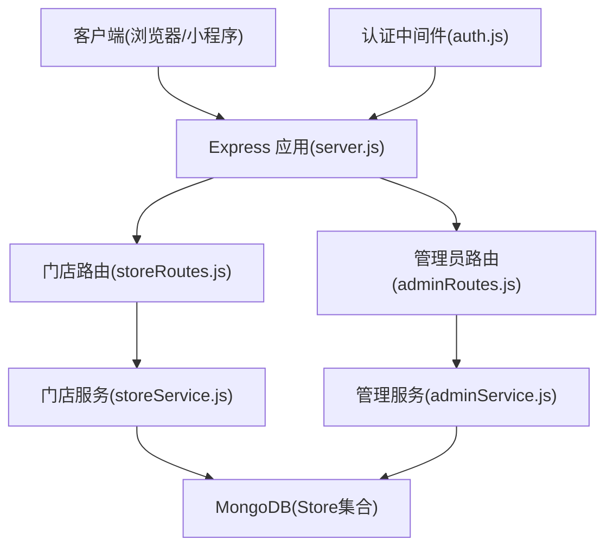
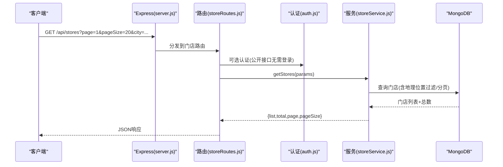
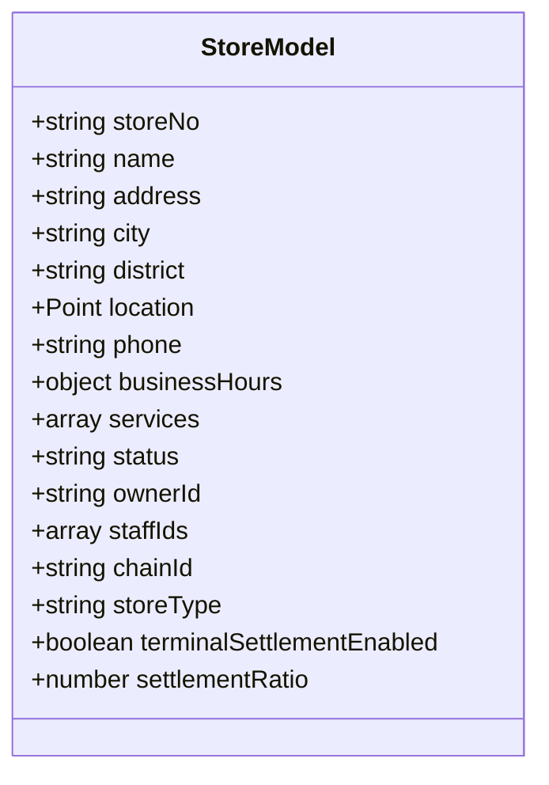
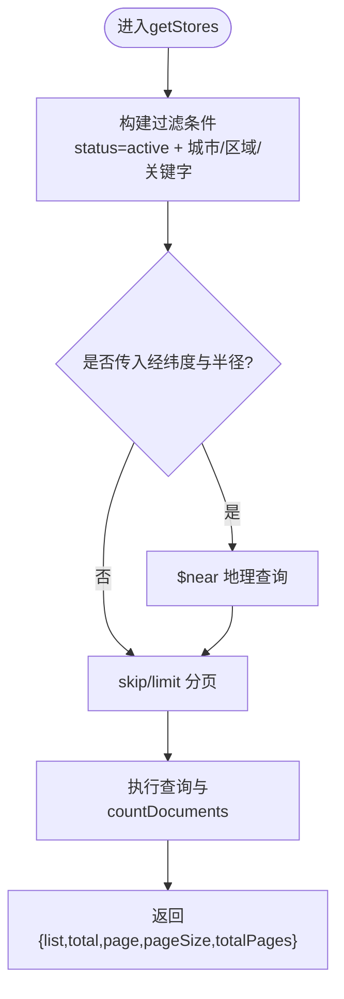
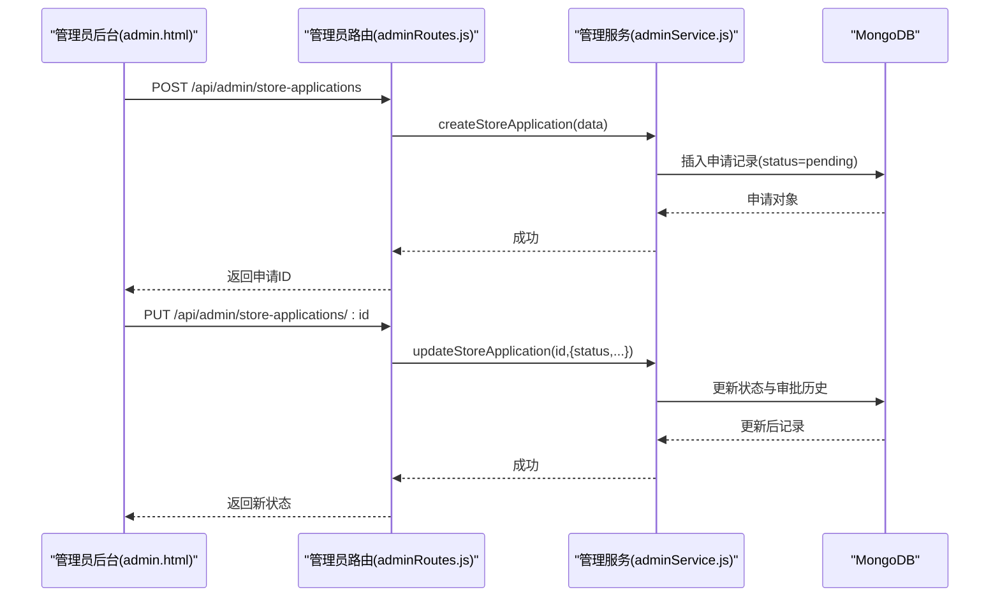
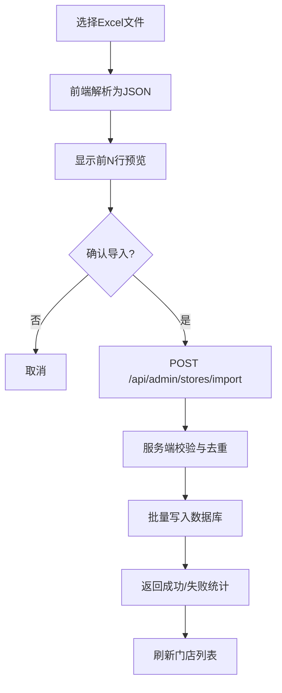
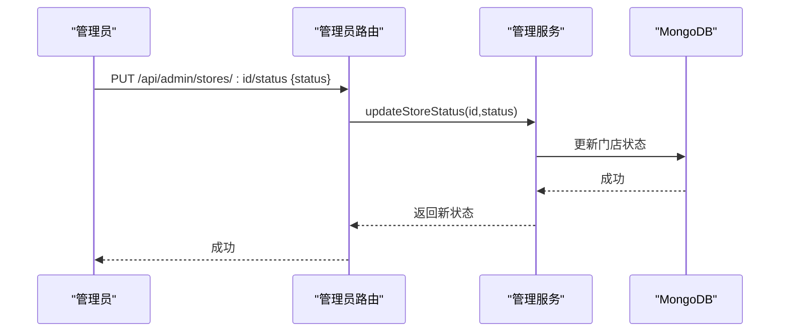
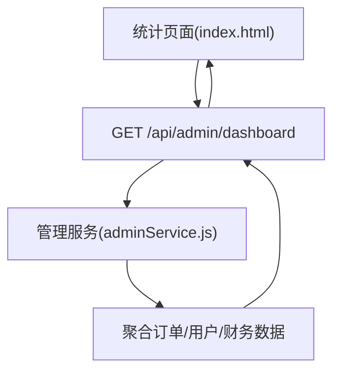
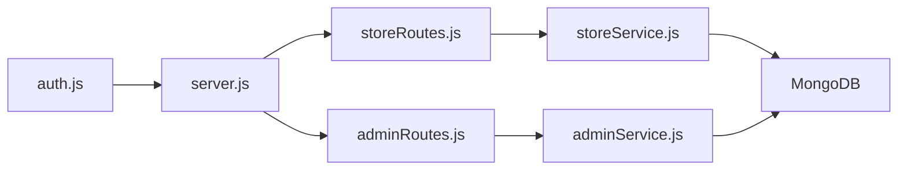

# 门店管理系统

<cite>
**本文引用的文件列表**
- [backend/server.js](file://backend/server.js)
- [backend/modules/cleaning/routes/storeRoutes.js](file://backend/modules/cleaning/routes/storeRoutes.js)
- [backend/modules/cleaning/services/storeService.js](file://backend/modules/cleaning/services/storeService.js)
- [backend/config/database.js](file://backend/config/database.js)
- [backend/modules/common/models/index.js](file://backend/modules/common/models/index.js)
- [backend/modules/admin/routes/adminRoutes.js](file://backend/modules/admin/routes/adminRoutes.js)
- [backend/modules/common/middlewares/auth.js](file://backend/modules/common/middlewares/auth.js)
- [admin.html](file://admin.html)
</cite>

## 目录
1. [简介](#简介)
2. [项目结构](#项目结构)
3. [核心组件](#核心组件)
4. [架构总览](#架构总览)
5. [详细组件分析](#详细组件分析)
6. [依赖关系分析](#依赖关系分析)
7. [性能与扩展性](#性能与扩展性)
8. [故障排查指南](#故障排查指南)
9. [结论](#结论)
10. [附录：接口清单与使用要点](#附录接口清单与使用要点)

## 简介
本系统为干洗连锁/单店的“门店管理子系统”，覆盖门店信息管理、入驻申请审核、批量导入导出、状态管理、数据统计与搜索分页等能力。后端采用 Express + MongoDB（可切换 MySQL），通过模块化路由与服务层组织业务逻辑，前端提供管理员后台与小程序端交互。

## 项目结构
围绕门店管理的核心路径与职责如下：
- 入口与路由挂载：统一在 server.js 中注册各模块路由，其中门店相关路由挂载于 /api/stores 与 /api/admin 等前缀下。
- 门店服务层：storeService.js 定义 Store 模型、地理位置索引、门店 CRUD、员工绑定、默认服务等。
- 管理员后台：adminRoutes.js 暴露门店列表、状态变更、批量导入、入驻申请管理等接口。
- 认证与权限：auth.js 提供鉴权中间件与角色校验，保障门店操作安全。
- 数据模型：common/models/index.js 提供多态模型与枚举定义，便于后续扩展回收/租赁等业务。

图表来源
- [backend/server.js:96-151](file://backend/server.js#L96-L151)
- [backend/modules/cleaning/routes/storeRoutes.js:1-194](file://backend/modules/cleaning/routes/storeRoutes.js#L1-L194)
- [backend/modules/admin/routes/adminRoutes.js:96-333](file://backend/modules/admin/routes/adminRoutes.js#L96-L333)
- [backend/modules/cleaning/services/storeService.js:1-120](file://backend/modules/cleaning/services/storeService.js#L1-L120)
- [backend/modules/common/middlewares/auth.js:1-209](file://backend/modules/common/middlewares/auth.js#L1-L209)

章节来源
- [backend/server.js:96-151](file://backend/server.js#L96-L151)
- [backend/modules/cleaning/routes/storeRoutes.js:1-194](file://backend/modules/cleaning/routes/storeRoutes.js#L1-L194)
- [backend/modules/admin/routes/adminRoutes.js:96-333](file://backend/modules/admin/routes/adminRoutes.js#L96-L333)
- [backend/modules/cleaning/services/storeService.js:1-120](file://backend/modules/cleaning/services/storeService.js#L1-L120)
- [backend/modules/common/middlewares/auth.js:1-209](file://backend/modules/common/middlewares/auth.js#L1-L209)

## 核心组件
- 门店信息模型与地理索引：支持经纬度、城市/区域筛选、关键字模糊匹配、分页与总数统计。
- 门店服务项配置：内置默认服务集，支持启用/禁用与基础价格。
- 门店员工体系：创建员工账户、绑定门店、角色更新与移除。
- 入驻申请流程：提交申请、审批流转、状态跟踪与审计记录。
- 批量导入导出：Excel 解析预览、服务端批量入库、结果反馈。
- 门店状态管理：启用/禁用/暂停，配合管理员权限控制。
- 数据统计与报表：订单量、收入、用户增长、服务热度等可视化展示。

章节来源
- [backend/modules/cleaning/services/storeService.js:8-48](file://backend/modules/cleaning/services/storeService.js#L8-L48)
- [backend/modules/cleaning/services/storeService.js:55-94](file://backend/modules/cleaning/services/storeService.js#L55-L94)
- [backend/modules/cleaning/services/storeService.js:125-157](file://backend/modules/cleaning/services/storeService.js#L125-L157)
- [backend/modules/cleaning/services/storeService.js:180-226](file://backend/modules/cleaning/services/storeService.js#L180-L226)
- [backend/modules/admin/routes/adminRoutes.js:158-206](file://backend/modules/admin/routes/adminRoutes.js#L158-L206)
- [backend/modules/admin/routes/adminRoutes.js:245-333](file://backend/modules/admin/routes/adminRoutes.js#L245-L333)

## 架构总览
从请求到数据的完整链路：
- 客户端发起 HTTP 请求至 Express。
- 路由层根据 URL 分发到对应控制器（如 storeRoutes.js 或 adminRoutes.js）。
- 控制器调用服务层（storeService.js 或 adminService.js）执行业务逻辑。
- 服务层访问数据库（MongoDB），返回结构化结果。
- 认证中间件对受保护接口进行身份与角色校验。

图表来源
- [backend/server.js:96-101](file://backend/server.js#L96-L101)
- [backend/modules/cleaning/routes/storeRoutes.js:18-30](file://backend/modules/cleaning/routes/storeRoutes.js#L18-L30)
- [backend/modules/cleaning/services/storeService.js:55-94](file://backend/modules/cleaning/services/storeService.js#L55-L94)
- [backend/modules/common/middlewares/auth.js:143-185](file://backend/modules/common/middlewares/auth.js#L143-L185)

## 详细组件分析

### 门店信息管理
- 基本信息维护：名称、地址、城市/区域、电话、描述、图片、评分、订单计数、所有者ID、连锁字段等。
- 地理位置设置：使用 GeoJSON Point 存储经纬度，建立 2dsphere 索引以支持近邻查询。
- 营业时间配置：open/close/holidays 字段，用于前台展示与营业判断。
- 服务项目管理：services 数组包含 serviceId/name/basePrice/enabled，支持默认服务初始化与按门店启用/禁用。

图表来源
- [backend/modules/cleaning/services/storeService.js:8-48](file://backend/modules/cleaning/services/storeService.js#L8-L48)

章节来源
- [backend/modules/cleaning/services/storeService.js:8-48](file://backend/modules/cleaning/services/storeService.js#L8-L48)
- [backend/modules/cleaning/services/storeService.js:125-157](file://backend/modules/cleaning/services/storeService.js#L125-L157)
- [backend/modules/cleaning/services/storeService.js:356-364](file://backend/modules/cleaning/services/storeService.js#L356-L364)

### 门店搜索与分页
- 支持按城市、区域、关键字（名称/地址）筛选。
- 支持基于经纬度与半径的地理搜索（单位千米转米）。
- 分页参数 page/pageSize，返回 list、total、totalPages。

图表来源
- [backend/modules/cleaning/services/storeService.js:55-94](file://backend/modules/cleaning/services/storeService.js#L55-L94)

章节来源
- [backend/modules/cleaning/routes/storeRoutes.js:18-30](file://backend/modules/cleaning/routes/storeRoutes.js#L18-L30)
- [backend/modules/cleaning/services/storeService.js:55-94](file://backend/modules/cleaning/services/storeService.js#L55-L94)

### 门店入驻申请与审核流程
- 申请提交：管理员路由提供 POST /api/admin/store-applications 创建申请。
- 申请列表与详情：GET /api/admin/store-applications 与 GET /api/admin/store-applications/:id。
- 状态流转：pending → processing → approved/rejected，并记录审批历史。
- 前端界面：admin.html 提供待审批列表、筛选、查看详情、开始审批、通过/拒绝等操作。

图表来源
- [backend/modules/admin/routes/adminRoutes.js:245-333](file://backend/modules/admin/routes/adminRoutes.js#L245-L333)
- [admin.html:4178-4564](file://admin.html#L4178-L4564)

章节来源
- [backend/modules/admin/routes/adminRoutes.js:245-333](file://backend/modules/admin/routes/adminRoutes.js#L245-L333)
- [admin.html:4178-4564](file://admin.html#L4178-L4564)

### 批量导入导出（Excel）
- 前端解析 Excel：使用 XLSX 读取文件，生成 JSON 预览，限制最大行数。
- 后端批量导入：POST /api/admin/stores/import 接收 stores 数组，逐条入库并返回成功/失败统计。
- 模板下载：提供标准列头示例，确保导入格式一致。

图表来源
- [admin.html:2844-3022](file://admin.html#L2844-L3022)
- [backend/modules/admin/routes/adminRoutes.js:158-206](file://backend/modules/admin/routes/adminRoutes.js#L158-L206)

章节来源
- [admin.html:2844-3022](file://admin.html#L2844-L3022)
- [backend/modules/admin/routes/adminRoutes.js:158-206](file://backend/modules/admin/routes/adminRoutes.js#L158-L206)

### 门店状态管理接口
- 获取门店列表：GET /api/stores（公开）与 GET /api/admin/stores（管理员）。
- 更新门店状态：PUT /api/admin/stores/:id/status，仅管理员可用。
- 启用/禁用/暂停：由 status 字段控制，影响门店可见性与接单能力。

图表来源
- [backend/modules/admin/routes/adminRoutes.js:117-131](file://backend/modules/admin/routes/adminRoutes.js#L117-L131)

章节来源
- [backend/modules/admin/routes/adminRoutes.js:96-131](file://backend/modules/admin/routes/adminRoutes.js#L96-L131)

### 数据统计与报表
- 仪表盘概览：总用户数、总订单数、总营收等关键指标。
- 时间维度：今日/本周/本月/本年，支持导出报表。
- 可视化：收入趋势图、用户来源分布等。

图表来源
- [index.html:1398-1424](file://index.html#L1398-L1424)
- [admin.html:5995-6014](file://admin.html#L5995-L6014)
- [backend/modules/admin/routes/adminRoutes.js:20-33](file://backend/modules/admin/routes/adminRoutes.js#L20-L33)

章节来源
- [index.html:1398-1424](file://index.html#L1398-L1424)
- [admin.html:5995-6014](file://admin.html#L5995-L6014)
- [backend/modules/admin/routes/adminRoutes.js:20-33](file://backend/modules/admin/routes/adminRoutes.js#L20-L33)

## 依赖关系分析
- 路由层依赖服务层：storeRoutes.js 依赖 storeService.js；adminRoutes.js 依赖 adminService.js。
- 服务层依赖数据库：storeService.js 直接操作 Store 集合；adminService.js 聚合多集合数据。
- 认证中间件贯穿受保护接口：auth.js 提供 authMiddleware 与 requireRoles。
- 配置与启动：server.js 加载环境变量、初始化数据库、挂载所有路由。

图表来源
- [backend/server.js:96-151](file://backend/server.js#L96-L151)
- [backend/modules/cleaning/routes/storeRoutes.js:1-194](file://backend/modules/cleaning/routes/storeRoutes.js#L1-L194)
- [backend/modules/admin/routes/adminRoutes.js:1-120](file://backend/modules/admin/routes/adminRoutes.js#L1-L120)
- [backend/modules/cleaning/services/storeService.js:1-120](file://backend/modules/cleaning/services/storeService.js#L1-L120)
- [backend/modules/common/middlewares/auth.js:1-209](file://backend/modules/common/middlewares/auth.js#L1-L209)

章节来源
- [backend/server.js:96-151](file://backend/server.js#L96-L151)
- [backend/modules/cleaning/routes/storeRoutes.js:1-194](file://backend/modules/cleaning/routes/storeRoutes.js#L1-L194)
- [backend/modules/admin/routes/adminRoutes.js:1-120](file://backend/modules/admin/routes/adminRoutes.js#L1-L120)
- [backend/modules/cleaning/services/storeService.js:1-120](file://backend/modules/cleaning/services/storeService.js#L1-L120)
- [backend/modules/common/middlewares/auth.js:1-209](file://backend/modules/common/middlewares/auth.js#L1-L209)

## 性能与扩展性
- 地理查询优化：使用 2dsphere 索引提升近邻检索效率。
- 分页与投影：避免返回敏感字段（如 staffIds），减少传输体积。
- 批量导入限流：单次最多 100 条，防止大事务阻塞。
- 可扩展点：多态模型与枚举定义便于接入回收/租赁等新业务。

[本节为通用指导，不直接分析具体文件]

## 故障排查指南
- 认证失败：检查 Authorization 头是否为 Bearer token，开发模式支持 dev-admin-/dev-chain-/mock_token_ 前缀。
- 权限不足：确认当前用户角色包含所需权限（如 admin、store_owner）。
- 导入失败：核对 Excel 列头与必填字段，关注服务端返回的成功/失败统计。
- 门店不可见：确认门店 status 为 active，且未处于 suspended 或 inactive。

章节来源
- [backend/modules/common/middlewares/auth.js:10-138](file://backend/modules/common/middlewares/auth.js#L10-L138)
- [backend/modules/admin/routes/adminRoutes.js:158-206](file://backend/modules/admin/routes/adminRoutes.js#L158-L206)

## 结论
本门店管理系统以清晰的模块化分层实现门店全生命周期管理：从入驻申请、资质审核、日常运营（信息维护、服务配置、员工管理）、到批量导入导出与状态管控，并提供多维度的数据统计与可视化。通过地理索引与分页优化，兼顾了用户体验与系统性能。

[本节为总结，不直接分析具体文件]

## 附录：接口清单与使用要点

- 门店公开接口
  - GET /api/stores：分页、城市/区域/关键字、地理搜索
  - GET /api/stores/:id：门店详情
  - GET /api/stores/:id/services：门店服务列表

- 门店管理接口（需认证与角色）
  - POST /api/stores：创建门店（admin/store_owner）
  - PUT /api/stores/:id：更新门店信息（admin/store_owner）
  - GET /api/stores/owner/my：我的门店（store_owner）
  - POST /api/stores/:id/staff/create：创建员工账户（admin/store_owner）
  - GET /api/stores/:id/staff/detail：员工详情（admin/store_owner/store_staff）
  - DELETE /api/stores/:id/staff/:staffId：移除员工（admin/store_owner）
  - PUT /api/stores/:id/staff/:staffId/role：更新员工角色（admin/store_owner）

- 管理员后台接口（需 admin 角色）
  - GET /api/admin/stores：门店列表（分页/关键字/状态）
  - PUT /api/admin/stores/:id/status：更新门店状态
  - POST /api/admin/stores/import：批量导入门店
  - GET/POST/PUT /api/admin/store-applications*：入驻申请管理

- 认证与权限
  - 认证中间件：Bearer token 解析与用户信息注入
  - 角色校验：requireRoles('admin','store_owner') 等

章节来源
- [backend/modules/cleaning/routes/storeRoutes.js:18-191](file://backend/modules/cleaning/routes/storeRoutes.js#L18-L191)
- [backend/modules/admin/routes/adminRoutes.js:96-333](file://backend/modules/admin/routes/adminRoutes.js#L96-L333)
- [backend/modules/common/middlewares/auth.js:10-209](file://backend/modules/common/middlewares/auth.js#L10-L209)