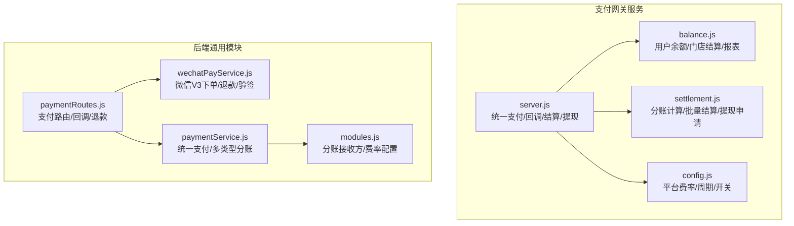
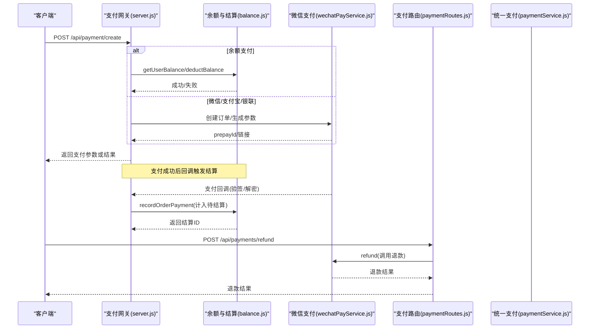
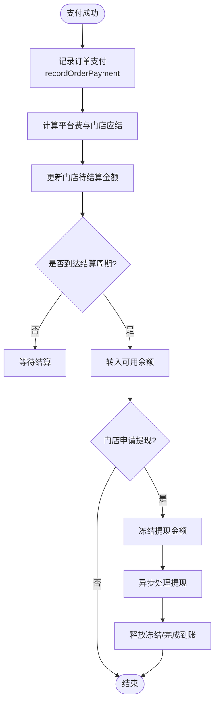
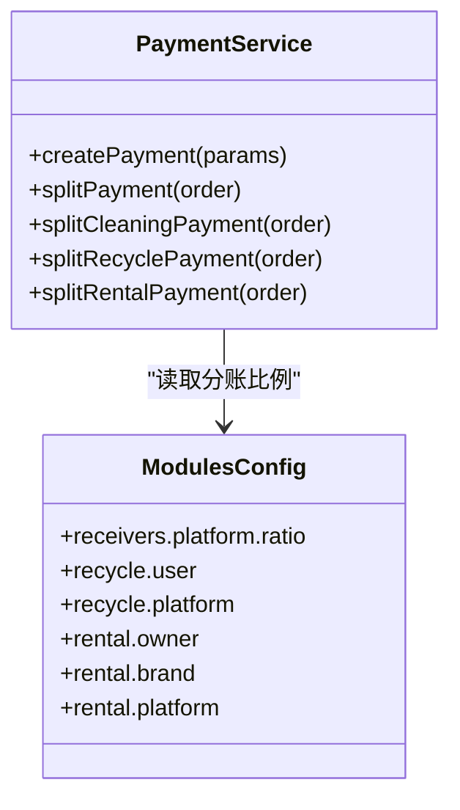
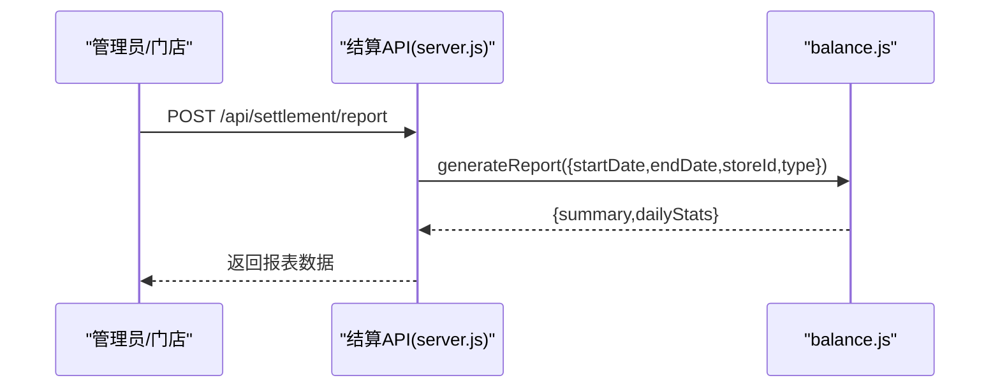
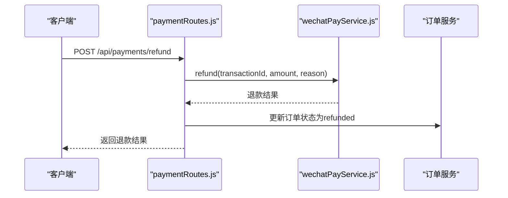
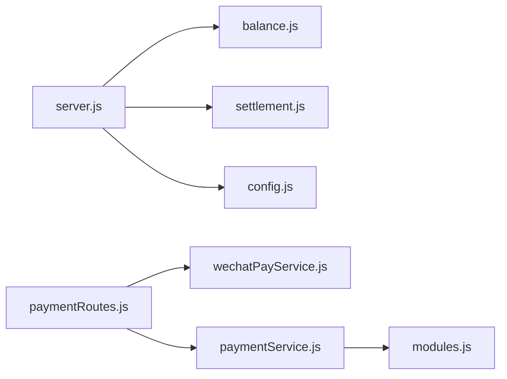

# 分账结算系统

<cite>
**本文引用的文件列表**
- [api/payment-server/server.js](file://api/payment-server/server.js)
- [api/payment-server/balance.js](file://api/payment-server/balance.js)
- [api/payment-server/settlement.js](file://api/payment-server/settlement.js)
- [api/payment-server/config.js](file://api/payment-server/config.js)
- [backend/modules/common/services/wechatPayService.js](file://backend/modules/common/services/wechatPayService.js)
- [backend/modules/common/routes/paymentRoutes.js](file://backend/modules/common/routes/paymentRoutes.js)
- [backend/modules/common/services/paymentService.js](file://backend/modules/common/services/paymentService.js)
- [backend/config/modules.js](file://backend/config/modules.js)
- [api/payment-server/test-payment.js](file://api/payment-server/test-payment.js)
</cite>

## 目录
1. [引言](#引言)
2. [项目结构](#项目结构)
3. [核心组件](#核心组件)
4. [架构总览](#架构总览)
5. [详细组件分析](#详细组件分析)
6. [依赖关系分析](#依赖关系分析)
7. [性能与可靠性](#性能与可靠性)
8. [故障排查指南](#故障排查指南)
9. [结论](#结论)
10. [附录：接口与使用方式](#附录接口与使用方式)

## 引言
本文件系统性地梳理并说明“分账结算系统”的资金流转、分账规则配置、结算周期管理、提现流程、退款分账、异常订单处理、资金对账机制，以及结算数据查询与报表生成能力。同时给出资金安全控制与审计日志的实现要点，帮助开发者快速理解与扩展该子系统。

## 项目结构
支付网关服务位于 api/payment-server，提供统一支付入口、余额账户、门店结算与提现等能力；后端通用模块在 backend/modules/common 下提供微信支付对接、统一支付服务与路由；分账比例与业务费率由 backend/config/modules.js 集中配置。

图表来源
- [api/payment-server/server.js:1-120](file://api/payment-server/server.js#L1-L120)
- [api/payment-server/balance.js:1-120](file://api/payment-server/balance.js#L1-L120)
- [api/payment-server/settlement.js:1-120](file://api/payment-server/settlement.js#L1-L120)
- [api/payment-server/config.js:1-80](file://api/payment-server/config.js#L1-L80)
- [backend/modules/common/services/wechatPayService.js:1-120](file://backend/modules/common/services/wechatPayService.js#L1-L120)
- [backend/modules/common/routes/paymentRoutes.js:1-120](file://backend/modules/common/routes/paymentRoutes.js#L1-L120)
- [backend/modules/common/services/paymentService.js:1-120](file://backend/modules/common/services/paymentService.js#L1-L120)
- [backend/config/modules.js:120-165](file://backend/config/modules.js#L120-L165)

章节来源
- [api/payment-server/server.js:1-120](file://api/payment-server/server.js#L1-L120)
- [backend/modules/common/routes/paymentRoutes.js:1-120](file://backend/modules/common/routes/paymentRoutes.js#L1-L120)
- [backend/config/modules.js:120-165](file://backend/config/modules.js#L120-L165)

## 核心组件
- 支付网关 server.js：统一支付入口、多渠道创建订单、支付状态查询、关闭订单、渠道回调处理（微信/支付宝/银联）、余额充值与查询、门店结算与提现、财务报表生成、健康检查。
- 余额与结算 balance.js：用户余额增减、交易流水记录、门店待结算与可用余额、定期结算到门店、门店提现、结算记录查询、按日统计报表。
- 分账结算 settlement.js：订单分账计算（平台服务费与门店收益）、单笔与批量结算、提现申请与冻结、财务报告汇总。
- 微信支付 wechatPayService.js：JSAPI/App/H5下单、订单查询、关闭、退款、回调签名验证与解密、通知发送。
- 统一支付 paymentService.js：统一创建支付、按订单类型（干洗/回收/租赁）执行分账策略。
- 支付路由 paymentRoutes.js：认证后创建支付、查询、微信回调、退款申请。
- 模块配置 modules.js：分账接收方与比例、回收与租赁分账比例、功能开关。

章节来源
- [api/payment-server/server.js:1-200](file://api/payment-server/server.js#L1-L200)
- [api/payment-server/balance.js:1-200](file://api/payment-server/balance.js#L1-L200)
- [api/payment-server/settlement.js:1-120](file://api/payment-server/settlement.js#L1-L120)
- [backend/modules/common/services/wechatPayService.js:1-120](file://backend/modules/common/services/wechatPayService.js#L1-L120)
- [backend/modules/common/services/paymentService.js:1-120](file://backend/modules/common/services/paymentService.js#L1-L120)
- [backend/modules/common/routes/paymentRoutes.js:1-120](file://backend/modules/common/routes/paymentRoutes.js#L1-L120)
- [backend/config/modules.js:120-165](file://backend/config/modules.js#L120-L165)

## 架构总览
支付网关作为对外统一入口，聚合多渠道支付与结算能力；后端通用模块负责与微信等第三方交互及统一支付编排；分账比例与业务策略通过配置集中管理。

图表来源
- [api/payment-server/server.js:40-174](file://api/payment-server/server.js#L40-L174)
- [api/payment-server/balance.js:240-283](file://api/payment-server/balance.js#L240-L283)
- [backend/modules/common/services/wechatPayService.js:100-164](file://backend/modules/common/services/wechatPayService.js#L100-L164)
- [backend/modules/common/routes/paymentRoutes.js:120-212](file://backend/modules/common/routes/paymentRoutes.js#L120-L212)
- [backend/modules/common/services/paymentService.js:94-173](file://backend/modules/common/services/paymentService.js#L94-L173)

## 详细组件分析

### 资金流转与分账计算
- 平台抽成与门店收益
  - 支付网关在收到支付成功回调后，将订单金额记入门店“待结算”，并按配置的“平台服务费比例”拆分出平台费用与门店应结金额。
  - 分账比例也可通过统一支付服务的分账策略进行二次校验或扩展。
- 分账规则配置
  - 平台服务费比例、结算周期、最低提现金额等在支付网关配置中定义。
  - 后端模块配置定义了各业务类型的分账接收方与比例（如干洗、回收、租赁）。
- 结算周期管理
  - 支持T+7结算，定时或手动触发将“待结算”转入“可用余额”。
- 提现流程
  - 门店发起提现时校验可用余额与限额，冻结对应金额，异步完成提现并释放冻结。

图表来源
- [api/payment-server/server.js:312-350](file://api/payment-server/server.js#L312-L350)
- [api/payment-server/balance.js:240-337](file://api/payment-server/balance.js#L240-L337)
- [api/payment-server/config.js:64-72](file://api/payment-server/config.js#L64-L72)
- [api/payment-server/settlement.js:176-235](file://api/payment-server/settlement.js#L176-L235)

章节来源
- [api/payment-server/server.js:312-350](file://api/payment-server/server.js#L312-L350)
- [api/payment-server/balance.js:240-337](file://api/payment-server/balance.js#L240-L337)
- [api/payment-server/config.js:64-72](file://api/payment-server/config.js#L64-L72)
- [api/payment-server/settlement.js:176-235](file://api/payment-server/settlement.js#L176-L235)
- [backend/config/modules.js:137-163](file://backend/config/modules.js#L137-L163)

### 分账规则配置与多业务类型
- 干洗订单：平台按比例抽取，剩余归门店。
- 回收订单：用户获得货款，平台收取服务费。
- 租赁订单：租金在所有者、品牌方与平台之间按比例分配，押金由平台暂存并在租期结束后处理。
- 配置项集中在 modules.js 的 payment.receivers 与 recycle/rental 字段。

图表来源
- [backend/modules/common/services/paymentService.js:94-173](file://backend/modules/common/services/paymentService.js#L94-L173)
- [backend/config/modules.js:137-163](file://backend/config/modules.js#L137-L163)

章节来源
- [backend/modules/common/services/paymentService.js:94-173](file://backend/modules/common/services/paymentService.js#L94-L173)
- [backend/config/modules.js:137-163](file://backend/config/modules.js#L137-L163)

### 结算记录生成与财务报表
- 结算记录：每次订单支付成功后生成一条结算明细，包含订单号、门店、订单金额、平台费、门店应结、状态与时间戳。
- 财务报表：支持按日期范围、门店维度聚合，输出每日统计与汇总指标。
- 门店财务报告：可汇总结算与提现记录，展示当前余额、冻结余额与可用余额。

图表来源
- [api/payment-server/server.js:569-578](file://api/payment-server/server.js#L569-L578)
- [api/payment-server/balance.js:459-520](file://api/payment-server/balance.js#L459-L520)

章节来源
- [api/payment-server/server.js:569-578](file://api/payment-server/server.js#L569-L578)
- [api/payment-server/balance.js:459-520](file://api/payment-server/balance.js#L459-L520)

### 退款分账与异常订单处理
- 退款流程：通过支付路由发起退款，调用微信退款接口，成功后更新订单状态为已退款。
- 退款分账：当发生退款时，需根据原分账记录逆向调整平台与门店的应收应付，确保账务一致。
- 异常订单：支付回调失败、重复回调、金额不一致等情况需要幂等处理与重试补偿。

图表来源
- [backend/modules/common/routes/paymentRoutes.js:173-212](file://backend/modules/common/routes/paymentRoutes.js#L173-L212)
- [backend/modules/common/services/wechatPayService.js:310-334](file://backend/modules/common/services/wechatPayService.js#L310-L334)

章节来源
- [backend/modules/common/routes/paymentRoutes.js:173-212](file://backend/modules/common/routes/paymentRoutes.js#L173-L212)
- [backend/modules/common/services/wechatPayService.js:310-334](file://backend/modules/common/services/wechatPayService.js#L310-L334)

### 资金对账机制
- 对账依据：以第三方支付渠道的账单为准，结合本地支付订单与结算记录进行核对。
- 差异处理：发现差异时标记异常订单，进入人工审核或自动冲正流程。
- 建议实现：定期对账任务拉取渠道账单，比对本地订单、结算与提现流水，输出差异报告。

[本节为概念性说明，不直接分析具体文件]

### 资金安全控制与审计日志
- 安全控制
  - 回调签名验证与加密解密：微信回调验签与资源解密。
  - 支付密码与风控：前端界面显示安全状态，服务端需接入风控策略与限流。
  - 权限与鉴权：支付路由使用认证中间件保护敏感操作。
- 审计日志
  - 关键操作（创建支付、回调处理、结算、提现、退款）均需落库记录，包含操作人、IP、时间、请求摘要与结果。
  - 建议引入独立审计表与不可变写入策略，便于合规审查。

章节来源
- [backend/modules/common/services/wechatPayService.js:336-375](file://backend/modules/common/services/wechatPayService.js#L336-L375)
- [backend/modules/common/routes/paymentRoutes.js:10-12](file://backend/modules/common/routes/paymentRoutes.js#L10-L12)

## 依赖关系分析
- server.js 依赖 balance.js、settlement.js、config.js 以及各渠道适配器（微信/支付宝/银联）。
- paymentRoutes.js 依赖 wechatPayService.js 与 paymentService.js。
- paymentService.js 依赖 modules.js 的分账配置。
- balance.js 提供用户余额、门店结算与报表能力，被 server.js 在回调与结算流程中调用。

图表来源
- [api/payment-server/server.js:1-120](file://api/payment-server/server.js#L1-L120)
- [backend/modules/common/routes/paymentRoutes.js:1-120](file://backend/modules/common/routes/paymentRoutes.js#L1-L120)
- [backend/modules/common/services/paymentService.js:1-120](file://backend/modules/common/services/paymentService.js#L1-L120)
- [backend/config/modules.js:120-165](file://backend/config/modules.js#L120-L165)

章节来源
- [api/payment-server/server.js:1-120](file://api/payment-server/server.js#L1-L120)
- [backend/modules/common/routes/paymentRoutes.js:1-120](file://backend/modules/common/routes/paymentRoutes.js#L1-L120)
- [backend/modules/common/services/paymentService.js:1-120](file://backend/modules/common/services/paymentService.js#L1-L120)
- [backend/config/modules.js:120-165](file://backend/config/modules.js#L120-L165)

## 性能与可靠性
- 幂等性：支付回调与退款接口需具备幂等处理，避免重复入账或重复退款。
- 事务与一致性：结算与余额更新建议使用数据库事务保证原子性。
- 异步与批处理：批量结算与报表生成采用异步任务与分页聚合，降低主链路延迟。
- 限流与熔断：对第三方渠道调用增加超时、重试与熔断策略。
- 监控与告警：对关键指标（成功率、耗时、差异率）进行监控与告警。

[本节为通用指导，不直接分析具体文件]

## 故障排查指南
- 支付回调失败
  - 检查签名验证与解密逻辑，确认密钥与证书配置正确。
  - 查看回调日志与订单状态，确认是否重复回调导致幂等问题。
- 结算未到账
  - 检查门店“待结算”金额与结算周期是否满足。
  - 确认是否已触发结算任务或手动结算。
- 提现失败
  - 检查可用余额与冻结金额，确认提现限额与银行通道状态。
- 报表数据不一致
  - 核对结算记录与渠道账单，定位差异订单并进行人工复核。

章节来源
- [backend/modules/common/services/wechatPayService.js:336-375](file://backend/modules/common/services/wechatPayService.js#L336-L375)
- [api/payment-server/balance.js:240-337](file://api/payment-server/balance.js#L240-L337)
- [api/payment-server/server.js:312-350](file://api/payment-server/server.js#L312-L350)

## 结论
本分账结算系统围绕“统一支付入口—多渠道回调—分账计算—结算周期—提现—报表”的主线构建，具备清晰的职责划分与可扩展的分账策略。建议在生产环境完善对账、审计与风控能力，并通过自动化测试保障稳定性。

[本节为总结性内容，不直接分析具体文件]

## 附录：接口与使用方式
- 统一支付
  - POST /api/payment/create：创建支付订单（支持微信/支付宝/银联/余额）
  - GET /api/payment/query/:orderId：查询支付状态
  - POST /api/payment/close/:orderId：关闭订单
- 余额账户
  - GET /api/balance/:userId：获取用户余额
  - GET /api/balance/:userId/transactions：用户交易记录
  - POST /api/balance/recharge：余额充值
- 门店结算
  - GET /api/settlement/store/:storeId：门店账户信息
  - GET /api/settlement/store/:storeId/records：结算记录（支持状态与日期过滤）
  - POST /api/settlement/store/:storeId/settle：发起结算（将待结算转入可用余额）
  - POST /api/settlement/store/:storeId/withdraw：门店提现
  - POST /api/settlement/report：生成财务报表（支持日期范围与门店维度）
- 支付路由（后端）
  - POST /api/payments/create：创建支付（含微信JSAPI/App/H5）
  - GET /api/payments/query/:orderId：查询支付状态
  - POST /api/payments/wechat/callback：微信支付回调
  - POST /api/payments/refund：申请退款

章节来源
- [api/payment-server/server.js:40-174](file://api/payment-server/server.js#L40-L174)
- [api/payment-server/server.js:466-578](file://api/payment-server/server.js#L466-L578)
- [backend/modules/common/routes/paymentRoutes.js:12-212](file://backend/modules/common/routes/paymentRoutes.js#L12-L212)

## 附录：测试与示例
- 支付功能测试脚本
  - 运行 test-payment.js 可依次执行健康检查、余额充值、多渠道支付、结算查询与提现等用例，便于快速验证系统连通性与基本流程。

章节来源
- [api/payment-server/test-payment.js:1-120](file://api/payment-server/test-payment.js#L1-L120)
- [api/payment-server/test-payment.js:469-543](file://api/payment-server/test-payment.js#L469-L543)