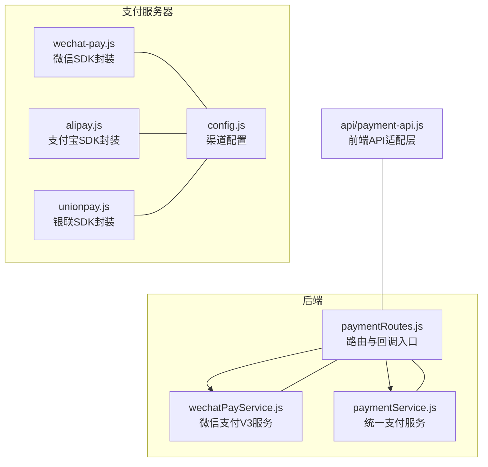
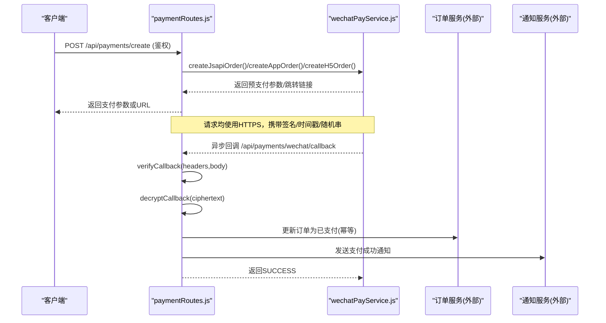
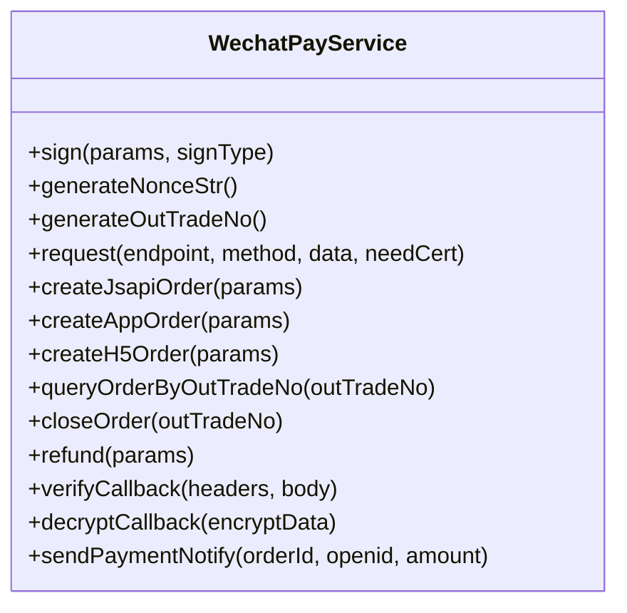
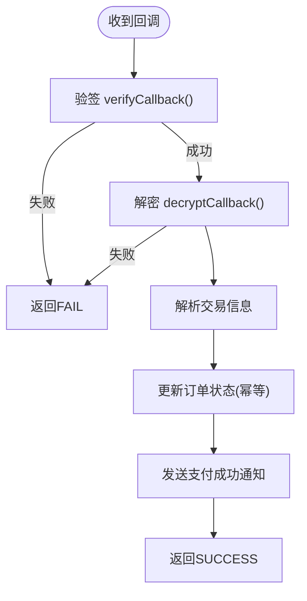
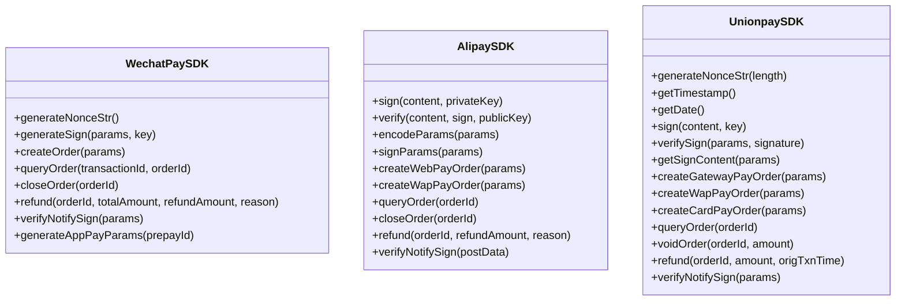
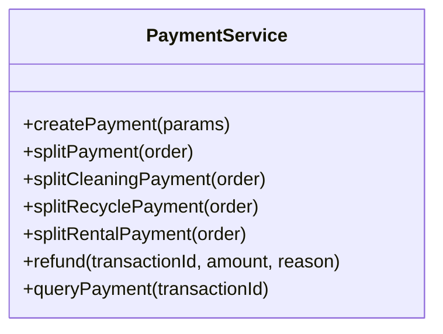
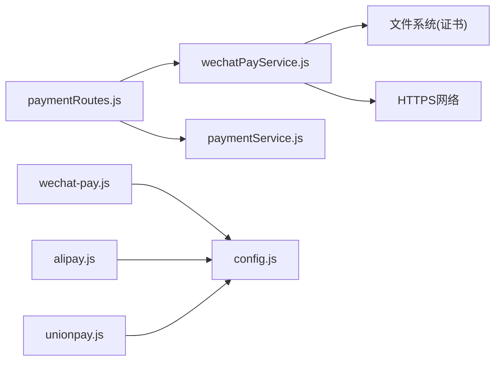

# 支付安全机制

<cite>
**本文引用的文件**   
- [backend/modules/common/routes/paymentRoutes.js](file://backend/modules/common/routes/paymentRoutes.js)
- [backend/modules/common/services/wechatPayService.js](file://backend/modules/common/services/wechatPayService.js)
- [api/payment-server/config.js](file://api/payment-server/config.js)
- [api/payment-server/wechat-pay.js](file://api/payment-server/wechat-pay.js)
- [api/payment-server/alipay.js](file://api/payment-server/alipay.js)
- [api/payment-server/unionpay.js](file://api/payment-server/unionpay.js)
- [backend/modules/common/services/paymentService.js](file://backend/modules/common/services/paymentService.js)
- [api/payment-api.js](file://api/payment-api.js)
</cite>

## 目录
1. [引言](#引言)
2. [项目结构](#项目结构)
3. [核心组件](#核心组件)
4. [架构总览](#架构总览)
5. [详细组件分析](#详细组件分析)
6. [依赖关系分析](#依赖关系分析)
7. [性能与并发控制](#性能与并发控制)
8. [故障排查指南](#故障排查指南)
9. [结论](#结论)
10. [附录：配置项清单](#附录配置项清单)

## 引言
本文件围绕支付链路的安全保障进行系统化说明，覆盖签名验证、防重放攻击、交易加密、用户身份认证、渠道密钥与证书管理、状态同步幂等与并发控制、异常检测与告警、以及安全审计要点。文档以仓库中实际实现为依据，结合可视化图示帮助读者快速理解各模块职责与安全边界。

## 项目结构
支付相关代码主要分布在以下位置：
- 后端统一路由与服务层：负责鉴权、路由分发、回调处理、订单状态更新与通知
- 微信支付服务（V3）：统一下单、查询、关闭、退款、回调验签与解密
- 支付服务器（独立进程）：微信/支付宝/银联的SDK封装与签名/验签逻辑
- 前端API适配层：提供统一的支付方式列表与模拟接口（用于演示与联调）

图表来源
- [backend/modules/common/routes/paymentRoutes.js:1-215](file://backend/modules/common/routes/paymentRoutes.js#L1-L215)
- [backend/modules/common/services/wechatPayService.js:1-396](file://backend/modules/common/services/wechatPayService.js#L1-L396)
- [backend/modules/common/services/paymentService.js:1-185](file://backend/modules/common/services/paymentService.js#L1-L185)
- [api/payment-server/config.js:1-80](file://api/payment-server/config.js#L1-L80)
- [api/payment-server/wechat-pay.js:1-314](file://api/payment-server/wechat-pay.js#L1-L314)
- [api/payment-server/alipay.js:1-336](file://api/payment-server/alipay.js#L1-L336)
- [api/payment-server/unionpay.js:1-501](file://api/payment-server/unionpay.js#L1-L501)
- [api/payment-api.js:1-427](file://api/payment-api.js#L1-L427)

章节来源
- [backend/modules/common/routes/paymentRoutes.js:1-215](file://backend/modules/common/routes/paymentRoutes.js#L1-L215)
- [backend/modules/common/services/wechatPayService.js:1-396](file://backend/modules/common/services/wechatPayService.js#L1-L396)
- [api/payment-server/config.js:1-80](file://api/payment-server/config.js#L1-L80)
- [api/payment-server/wechat-pay.js:1-314](file://api/payment-server/wechat-pay.js#L1-L314)
- [api/payment-server/alipay.js:1-336](file://api/payment-server/alipay.js#L1-L336)
- [api/payment-server/unionpay.js:1-501](file://api/payment-server/unionpay.js#L1-L501)
- [backend/modules/common/services/paymentService.js:1-185](file://backend/modules/common/services/paymentService.js#L1-L185)
- [api/payment-api.js:1-427](file://api/payment-api.js#L1-L427)

## 核心组件
- 统一支付路由 paymentRoutes.js
  - 提供创建支付、查询支付状态、微信支付回调、申请退款等接口
  - 对创建与查询接口启用鉴权中间件，确保调用方身份合法
- 微信支付服务 wechatPayService.js
  - 基于V3 API实现JSAPI/App/H5下单、查询、关闭、退款
  - 回调验签与资源字段解密，支持发送支付成功通知
- 支付服务器 SDK 封装
  - wechat-pay.js：XML签名、统一下单、查询、关闭、退款、小程序参数生成
  - alipay.js：RSA2签名与验签、网页/手机网站支付、查询、关闭、退款、回调验签
  - unionpay.js：SHA256签名、网关/手机网页/银行卡支付、查询、撤销、退款、回调验签
- 统一支付服务 paymentService.js
  - 聚合多支付渠道，提供分账计算与通用查询/退款占位方法
- 前端API适配层 api/payment-api.js
  - 暴露支付方式列表与模拟接口，便于前端集成与测试

章节来源
- [backend/modules/common/routes/paymentRoutes.js:1-215](file://backend/modules/common/routes/paymentRoutes.js#L1-L215)
- [backend/modules/common/services/wechatPayService.js:1-396](file://backend/modules/common/services/wechatPayService.js#L1-L396)
- [api/payment-server/wechat-pay.js:1-314](file://api/payment-server/wechat-pay.js#L1-L314)
- [api/payment-server/alipay.js:1-336](file://api/payment-server/alipay.js#L1-L336)
- [api/payment-server/unionpay.js:1-501](file://api/payment-server/unionpay.js#L1-L501)
- [backend/modules/common/services/paymentService.js:1-185](file://backend/modules/common/services/paymentService.js#L1-L185)
- [api/payment-api.js:1-427](file://api/payment-api.js#L1-L427)

## 架构总览
下图展示从客户端发起支付到渠道回调落库的关键流程，并标注安全校验点。

图表来源
- [backend/modules/common/routes/paymentRoutes.js:13-97](file://backend/modules/common/routes/paymentRoutes.js#L13-L97)
- [backend/modules/common/routes/paymentRoutes.js:120-171](file://backend/modules/common/routes/paymentRoutes.js#L120-L171)
- [backend/modules/common/services/wechatPayService.js:101-164](file://backend/modules/common/services/wechatPayService.js#L101-L164)
- [backend/modules/common/services/wechatPayService.js:338-375](file://backend/modules/common/services/wechatPayService.js#L338-L375)

## 详细组件分析

### 微信支付服务（V3）
- 签名与验签
  - 统一下单：服务端构造请求体，按平台规范生成签名；小程序/App端二次签名由私钥生成
  - 回调验签：读取请求头中的签名、时间戳、随机串，拼接消息后HMAC-SHA256比对
- 数据加密
  - 回调中的资源字段采用AES-GCM解密，需正确加载APIv3密钥
- 订单生命周期
  - 下单（JSAPI/App/H5）、查询、关闭、退款，均通过HTTPS访问官方API
- 通知
  - 支付成功后触发通知服务，推送支付结果给业务系统

图表来源
- [backend/modules/common/services/wechatPayService.js:1-396](file://backend/modules/common/services/wechatPayService.js#L1-L396)

章节来源
- [backend/modules/common/services/wechatPayService.js:1-396](file://backend/modules/common/services/wechatPayService.js#L1-L396)

### 支付路由与回调处理
- 鉴权保护
  - 创建与查询接口通过鉴权中间件，防止未授权调用
- 回调安全
  - 先验签再解密，失败直接拒绝
  - 解析出交易号、金额、付款人等信息后，更新订单状态并发送通知
- 错误处理
  - 统一捕获异常，返回标准错误码与消息

图表来源
- [backend/modules/common/routes/paymentRoutes.js:120-171](file://backend/modules/common/routes/paymentRoutes.js#L120-L171)
- [backend/modules/common/services/wechatPayService.js:338-375](file://backend/modules/common/services/wechatPayService.js#L338-L375)

章节来源
- [backend/modules/common/routes/paymentRoutes.js:1-215](file://backend/modules/common/routes/paymentRoutes.js#L1-L215)

### 支付服务器SDK封装（微信/支付宝/银联）
- 微信SDK（XML）
  - 生成随机串、MD5签名、统一下单、查询、关闭、退款、小程序调起参数
- 支付宝SDK（JSON+RSA2）
  - RSA2签名/验签、网页/手机网站支付、查询、关闭、退款、回调验签
- 银联SDK（表单+SHA256）
  - SHA256签名、网关/手机网页/银行卡支付、查询、撤销、退款、回调验签

图表来源
- [api/payment-server/wechat-pay.js:1-314](file://api/payment-server/wechat-pay.js#L1-L314)
- [api/payment-server/alipay.js:1-336](file://api/payment-server/alipay.js#L1-L336)
- [api/payment-server/unionpay.js:1-501](file://api/payment-server/unionpay.js#L1-L501)

章节来源
- [api/payment-server/wechat-pay.js:1-314](file://api/payment-server/wechat-pay.js#L1-L314)
- [api/payment-server/alipay.js:1-336](file://api/payment-server/alipay.js#L1-L336)
- [api/payment-server/unionpay.js:1-501](file://api/payment-server/unionpay.js#L1-L501)

### 统一支付服务与分账
- 统一入口
  - 根据支付方式路由至对应渠道实现
- 分账策略
  - 干洗/回收/租赁等不同业务类型，按配置比例拆分至门店/品牌/平台/用户等账户
- 查询与退款
  - 提供通用查询与退款占位方法，便于扩展

图表来源
- [backend/modules/common/services/paymentService.js:1-185](file://backend/modules/common/services/paymentService.js#L1-L185)

章节来源
- [backend/modules/common/services/paymentService.js:1-185](file://backend/modules/common/services/paymentService.js#L1-L185)

### 前端API适配层
- 支付方式列表与描述
- 预留真实API调用注释，当前以模拟为主，便于联调
- 余额支付本地校验与扣减（仅演示用途）

章节来源
- [api/payment-api.js:1-427](file://api/payment-api.js#L1-L427)

## 依赖关系分析
- 路由层依赖微信支付服务与统一支付服务
- 微信支付服务依赖操作系统HTTPS与文件系统（证书路径）
- 支付服务器SDK依赖各自渠道网关与签名算法库
- 前端适配层依赖后端路由

图表来源
- [backend/modules/common/routes/paymentRoutes.js:1-215](file://backend/modules/common/routes/paymentRoutes.js#L1-L215)
- [backend/modules/common/services/wechatPayService.js:1-396](file://backend/modules/common/services/wechatPayService.js#L1-L396)
- [api/payment-server/config.js:1-80](file://api/payment-server/config.js#L1-L80)
- [api/payment-server/wechat-pay.js:1-314](file://api/payment-server/wechat-pay.js#L1-L314)
- [api/payment-server/alipay.js:1-336](file://api/payment-server/alipay.js#L1-L336)
- [api/payment-server/unionpay.js:1-501](file://api/payment-server/unionpay.js#L1-L501)

章节来源
- [backend/modules/common/routes/paymentRoutes.js:1-215](file://backend/modules/common/routes/paymentRoutes.js#L1-L215)
- [backend/modules/common/services/wechatPayService.js:1-396](file://backend/modules/common/services/wechatPayService.js#L1-L396)
- [api/payment-server/config.js:1-80](file://api/payment-server/config.js#L1-L80)
- [api/payment-server/wechat-pay.js:1-314](file://api/payment-server/wechat-pay.js#L1-L314)
- [api/payment-server/alipay.js:1-336](file://api/payment-server/alipay.js#L1-L336)
- [api/payment-server/unionpay.js:1-501](file://api/payment-server/unionpay.js#L1-L501)

## 性能与并发控制
- 幂等性
  - 回调处理应基于商户订单号或渠道交易号做幂等写入，避免重复更新订单状态
- 并发控制
  - 同一订单的多次回调或轮询应加锁或分布式锁，保证串行化更新
- 重试与退避
  - 对外部渠道查询/退款失败时，采用指数退避重试，限制最大重试次数
- 超时与限流
  - 对外请求设置合理超时；对回调接口实施速率限制，防止恶意刷量

[本节为通用建议，不直接分析具体文件]

## 故障排查指南
- 回调验签失败
  - 检查请求头是否包含签名、时间戳、随机串
  - 确认服务端使用的API密钥与渠道一致
- 回调解密失败
  - 确认APIv3密钥长度与填充方式符合平台要求
- 证书问题
  - 退款等需要双向SSL的场景，确认证书路径与权限正确
- 日志定位
  - 在关键节点记录入参、签名串、响应体摘要（脱敏），便于回溯

章节来源
- [backend/modules/common/routes/paymentRoutes.js:120-171](file://backend/modules/common/routes/paymentRoutes.js#L120-L171)
- [backend/modules/common/services/wechatPayService.js:338-375](file://backend/modules/common/services/wechatPayService.js#L338-L375)

## 结论
本方案在后端路由层完成鉴权与回调安全校验，在服务层实现多渠道签名/验签与数据加解密，并通过统一支付服务抽象分账与通用能力。生产环境需完善幂等与并发控制、密钥与证书管理、异常检测与告警、以及安全审计与合规措施，以确保支付链路的机密性、完整性与可用性。

[本节为总结性内容，不直接分析具体文件]

## 附录：配置项清单
- 微信支付（V3）
  - appId、mchId、apiKey、serialNo、privateKey、callbackUrl
- 微信支付（支付服务器SDK）
  - miniapp/h5 的 appId、appSecret、mchId、apiKey、notifyUrl、apiBaseUrl
- 支付宝
  - appId、privateKey、alipayPublicKey、gateway、notifyUrl
- 银联
  - merchantId、signCertPath、signCertPwd、notifyUrl、apiUrl
- 平台
  - serviceFeeRate、settlementCycle、minWithdrawAmount

章节来源
- [api/payment-server/config.js:1-80](file://api/payment-server/config.js#L1-L80)
- [backend/modules/common/services/wechatPayService.js:12-19](file://backend/modules/common/services/wechatPayService.js#L12-L19)