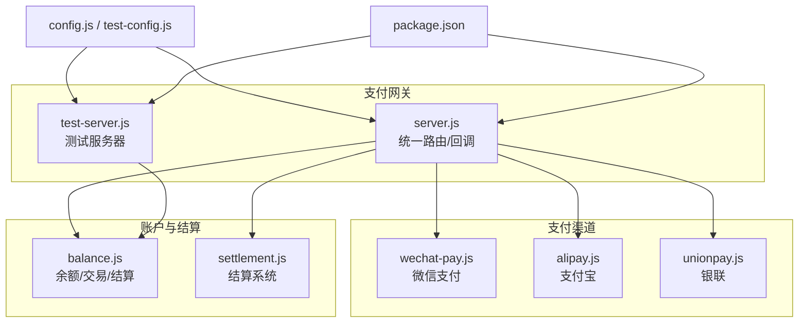
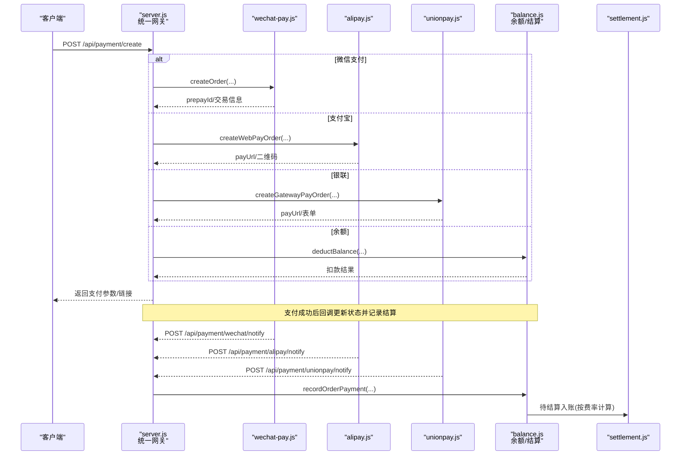
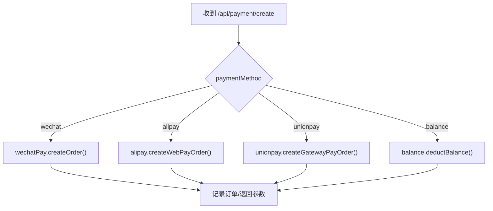
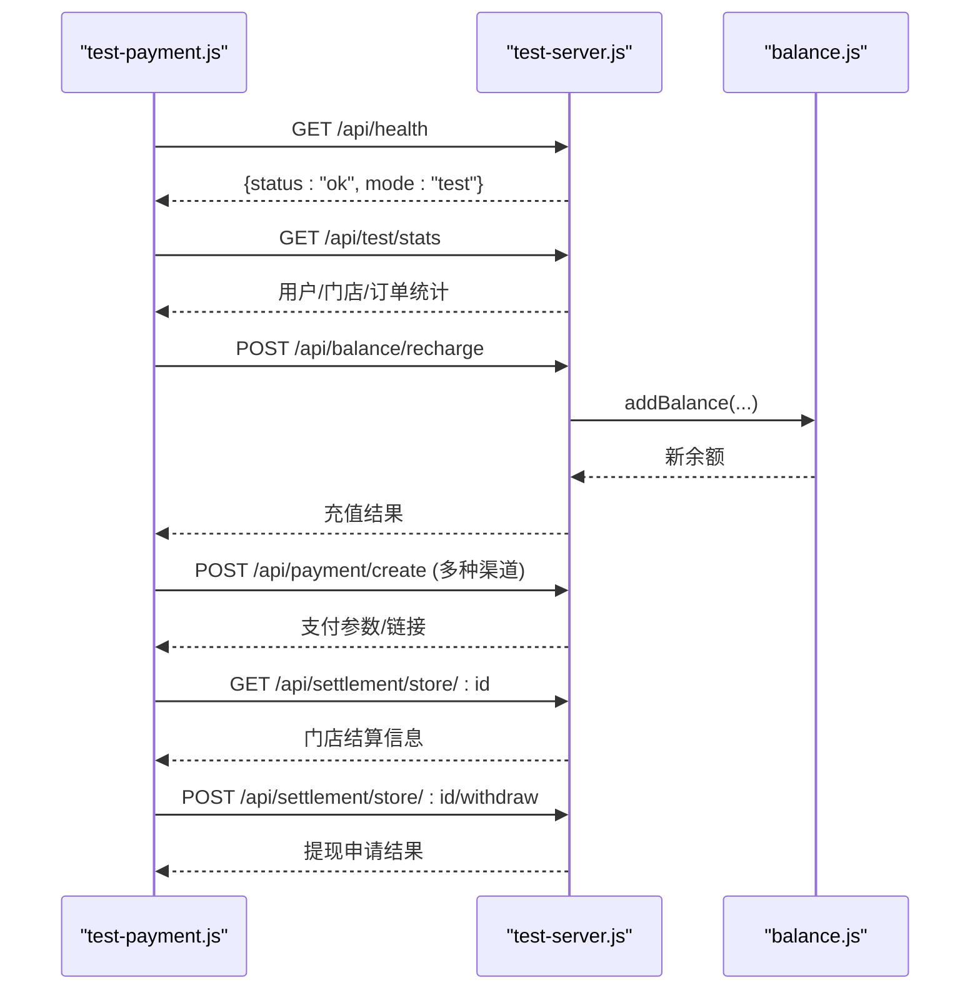
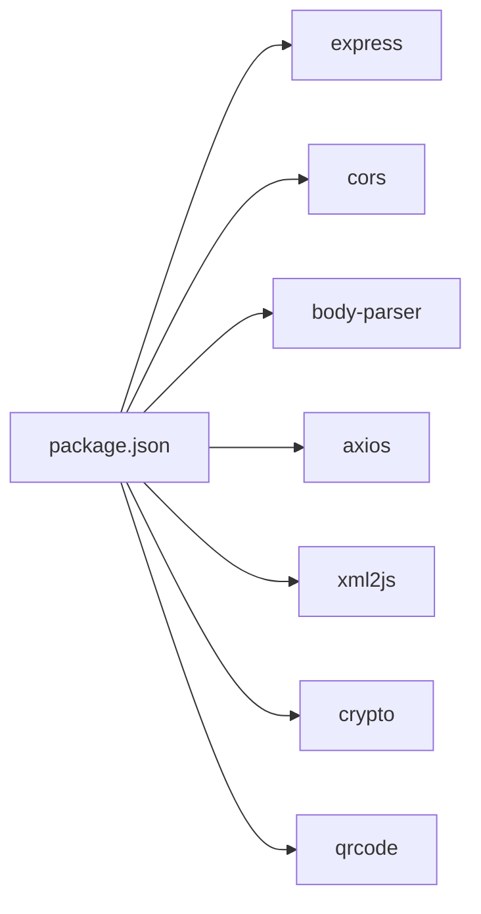

# 支付测试与调试

<cite>
**本文引用的文件**   
- [api/payment-server/README.md](file://api/payment-server/README.md)
- [api/payment-server/START_TEST.md](file://api/payment-server/START_TEST.md)
- [api/payment-server/TEST_GUIDE.md](file://api/payment-server/TEST_GUIDE.md)
- [api/payment-server/server.js](file://api/payment-server/server.js)
- [api/payment-server/test-server.js](file://api/payment-server/test-server.js)
- [api/payment-server/test-payment.js](file://api/payment-server/test-payment.js)
- [api/payment-server/config.js](file://api/payment-server/config.js)
- [api/payment-server/test-config.js](file://api/payment-server/test-config.js)
- [api/payment-server/wechat-pay.js](file://api/payment-server/wechat-pay.js)
- [api/payment-server/alipay.js](file://api/payment-server/alipay.js)
- [api/payment-server/unionpay.js](file://api/payment-server/unionpay.js)
- [api/payment-server/balance.js](file://api/payment-server/balance.js)
- [api/payment-server/settlement.js](file://api/payment-server/settlement.js)
- [api/payment-server/package.json](file://api/payment-server/package.json)
</cite>

## 目录
1. [引言](#引言)
2. [项目结构](#项目结构)
3. [核心组件](#核心组件)
4. [架构总览](#架构总览)
5. [详细组件分析](#详细组件分析)
6. [依赖关系分析](#依赖关系分析)
7. [性能考虑](#性能考虑)
8. [故障排查指南](#故障排查指南)
9. [结论](#结论)
10. [附录](#附录)

## 引言
本文件面向支付系统的测试与调试，覆盖单元测试、集成测试与端到端测试策略；提供测试环境搭建（模拟渠道、测试数据准备、用例编写）；展示支付流程的调试技巧（日志分析、错误追踪、性能监控）；给出常见问题排查方法与解决方案；并包含自动化测试脚本使用指南与持续集成配置建议。

## 项目结构
支付子系统位于 api/payment-server 目录，采用“网关路由 + 多渠道实现 + 余额与结算服务”的分层组织方式：
- server.js：统一入口与路由分发、回调处理、健康检查
- test-server.js：测试模式服务器（内存数据、无需真实密钥）
- wechat-pay.js / alipay.js / unionpay.js：各渠道具体实现
- balance.js：用户余额、交易流水、门店账户与结算逻辑
- settlement.js：资金结算系统（分账、批量结算、提现等）
- config.js / test-config.js：生产与测试配置
- package.json：脚本与依赖
- README.md / START_TEST.md / TEST_GUIDE.md：文档与快速上手

图表来源
- [api/payment-server/server.js:1-624](file://api/payment-server/server.js#L1-L624)
- [api/payment-server/test-server.js:1-475](file://api/payment-server/test-server.js#L1-L475)
- [api/payment-server/config.js:1-80](file://api/payment-server/config.js#L1-L80)
- [api/payment-server/test-config.js:1-69](file://api/payment-server/test-config.js#L1-L69)
- [api/payment-server/package.json:1-26](file://api/payment-server/package.json#L1-L26)

章节来源
- [api/payment-server/README.md:1-481](file://api/payment-server/README.md#L1-L481)
- [api/payment-server/START_TEST.md:1-266](file://api/payment-server/START_TEST.md#L1-L266)
- [api/payment-server/TEST_GUIDE.md:1-457](file://api/payment-server/TEST_GUIDE.md#L1-L457)

## 核心组件
- 统一支付网关（server.js）
  - 统一创建订单接口：POST /api/payment/create
  - 查询/关闭订单：GET /api/payment/query/:orderId, POST /api/payment/close/:orderId
  - 渠道回调：微信/支付宝/银联通知接口
  - 余额与结算：用户余额、充值、门店结算、提现、报表
- 渠道实现
  - 微信支付：统一下单、查询、关闭、退款、签名校验、小程序参数生成
  - 支付宝：网页/手机网站支付、查询、关闭、退款、RSA2验签
  - 银联：网关支付、查询、撤销、退款、表单构建与签名
- 账户与结算（balance.js / settlement.js）
  - 用户余额增减、交易流水
  - 平台服务费计算、待结算金额、T+N结算到可用余额
  - 门店提现申请与冻结/解冻流程
- 测试体系
  - 测试服务器（test-server.js）：内存数据、无需真实密钥
  - 自动化测试（test-payment.js）：覆盖健康检查、充值、多支付方式、结算与提现、批量测试
  - 文档与命令：START_TEST.md、TEST_GUIDE.md、package.json scripts

章节来源
- [api/payment-server/server.js:1-624](file://api/payment-server/server.js#L1-L624)
- [api/payment-server/wechat-pay.js:1-314](file://api/payment-server/wechat-pay.js#L1-L314)
- [api/payment-server/alipay.js:1-336](file://api/payment-server/alipay.js#L1-L336)
- [api/payment-server/unionpay.js:1-501](file://api/payment-server/unionpay.js#L1-L501)
- [api/payment-server/balance.js:1-524](file://api/payment-server/balance.js#L1-L524)
- [api/payment-server/settlement.js:1-389](file://api/payment-server/settlement.js#L1-L389)
- [api/payment-server/test-server.js:1-475](file://api/payment-server/test-server.js#L1-L475)
- [api/payment-server/test-payment.js:1-554](file://api/payment-server/test-payment.js#L1-L554)
- [api/payment-server/package.json:1-26](file://api/payment-server/package.json#L1-L26)

## 架构总览
下图展示了从客户端发起支付到渠道回调落库的全链路，以及余额与结算的联动。

图表来源
- [api/payment-server/server.js:42-174](file://api/payment-server/server.js#L42-L174)
- [api/payment-server/server.js:306-451](file://api/payment-server/server.js#L306-L451)
- [api/payment-server/wechat-pay.js:56-127](file://api/payment-server/wechat-pay.js#L56-L127)
- [api/payment-server/alipay.js:68-104](file://api/payment-server/alipay.js#L68-L104)
- [api/payment-server/unionpay.js:78-123](file://api/payment-server/unionpay.js#L78-L123)
- [api/payment-server/balance.js:244-283](file://api/payment-server/balance.js#L244-L283)
- [api/payment-server/settlement.js:28-43](file://api/payment-server/settlement.js#L28-L43)

## 详细组件分析

### 统一网关（server.js）
- 职责
  - 统一创建订单路由，根据 paymentMethod 分发至对应渠道或余额模块
  - 统一查询/关闭订单，内部调用渠道或本地状态
  - 处理各渠道回调，验证签名后更新订单状态并触发结算
  - 暴露余额与结算相关接口
- 关键路径
  - 创建订单：POST /api/payment/create
  - 查询订单：GET /api/payment/query/:orderId
  - 关闭订单：POST /api/payment/close/:orderId
  - 回调：/api/payment/{channel}/notify
  - 余额：/api/balance/*
  - 结算：/api/settlement/store/*

图表来源
- [api/payment-server/server.js:42-174](file://api/payment-server/server.js#L42-L174)

章节来源
- [api/payment-server/server.js:1-624](file://api/payment-server/server.js#L1-L624)

### 微信支付（wechat-pay.js）
- 能力
  - 统一下单、查询、关闭、退款
  - 签名与验签、XML解析、小程序调起参数生成
- 复杂度
  - 签名 O(n)（n为参数个数），网络请求为外部I/O
- 优化点
  - 可引入缓存/重试机制提升稳定性
  - 对XML解析与HTTP请求做超时与熔断保护

章节来源
- [api/payment-server/wechat-pay.js:1-314](file://api/payment-server/wechat-pay.js#L1-L314)

### 支付宝（alipay.js）
- 能力
  - 网页/手机网站支付、查询、关闭、退款
  - RSA2签名与验签、URL编码
- 复杂度
  - 签名与编码均为线性时间，网络I/O为主
- 优化点
  - 对第三方网关失败进行指数退避重试

章节来源
- [api/payment-server/alipay.js:1-336](file://api/payment-server/alipay.js#L1-L336)

### 银联（unionpay.js）
- 能力
  - 网关支付、查询、撤销、退款
  - 表单构建、SHA256签名、响应解析
- 复杂度
  - 表单构建与签名线性时间，网络I/O为主
- 优化点
  - 对敏感字段加密与证书管理加强

章节来源
- [api/payment-server/unionpay.js:1-501](file://api/payment-server/unionpay.js#L1-L501)

### 余额与结算（balance.js / settlement.js）
- 余额服务（balance.js）
  - 用户余额获取、扣减、充值、交易分页
  - 门店账户：待结算、可用余额、冻结余额、提现
  - 订单完成后记录平台服务费与门店应结金额
- 结算系统（settlement.js）
  - 分账计算、批量结算、提现申请与冻结、财务报告
- 数据结构与复杂度
  - Map存取O(1)，列表过滤与排序O(n log n)
- 优化点
  - 大额结算批处理、事务化更新、幂等控制

章节来源
- [api/payment-server/balance.js:1-524](file://api/payment-server/balance.js#L1-L524)
- [api/payment-server/settlement.js:1-389](file://api/payment-server/settlement.js#L1-L389)

### 测试服务器与自动化测试
- 测试服务器（test-server.js）
  - 内存数据库预置用户与门店数据
  - 模拟各渠道支付，立即成功并计入待结算
  - 提供健康检查与统计接口
- 自动化测试（test-payment.js）
  - 顺序执行：健康检查 → 查看数据 → 充值 → 微信/余额/支付宝/银联 → 结算查询 → 提现 → 批量支付
  - 输出通过率与后续操作指引
- 启动与运行
  - npm run start:test 启动测试服务器
  - npm test 或 node test-payment.js 运行测试

图表来源
- [api/payment-server/test-payment.js:1-554](file://api/payment-server/test-payment.js#L1-L554)
- [api/payment-server/test-server.js:1-475](file://api/payment-server/test-server.js#L1-L475)
- [api/payment-server/balance.js:147-191](file://api/payment-server/balance.js#L147-L191)

章节来源
- [api/payment-server/test-server.js:1-475](file://api/payment-server/test-server.js#L1-L475)
- [api/payment-server/test-payment.js:1-554](file://api/payment-server/test-payment.js#L1-L554)
- [api/payment-server/START_TEST.md:1-266](file://api/payment-server/START_TEST.md#L1-L266)
- [api/payment-server/TEST_GUIDE.md:1-457](file://api/payment-server/TEST_GUIDE.md#L1-L457)

## 依赖关系分析
- 运行时依赖
  - express、cors、body-parser：HTTP服务与中间件
  - axios、xml2js：HTTP请求与XML解析
  - crypto：签名与哈希
  - qrcode：二维码生成（可选）
- 脚本依赖
  - start/start:test/test/dev/dev:test：通过 package.json 统一管理

图表来源
- [api/payment-server/package.json:1-26](file://api/payment-server/package.json#L1-L26)

章节来源
- [api/payment-server/package.json:1-26](file://api/payment-server/package.json#L1-L26)

## 性能考虑
- I/O瓶颈
  - 第三方支付网关与银行通道为外部I/O，需设置合理超时与重试
- 计算开销
  - 签名与编码为线性复杂度，通常不是瓶颈
- 内存占用
  - 测试服务器使用内存Map存储，重启即丢失，不适合持久化场景
- 并发与幂等
  - 回调处理需幂等，避免重复入账
- 建议
  - 引入连接池与限流
  - 对关键路径增加指标采集（耗时、成功率、错误码分布）

[本节为通用指导，不直接分析具体文件]

## 故障排查指南
- 端口冲突
  - 症状：EADDRINUSE
  - 处理：释放端口或更换端口（测试服务器默认3002）
- 连接拒绝
  - 症状：ECONNREFUSED localhost:3002
  - 处理：确认测试服务器已启动，防火墙放行
- 余额不足
  - 症状：余额支付返回不足
  - 处理：先充值或使用其他渠道
- 回调未达
  - 症状：支付成功但本地未更新
  - 处理：检查回调URL可达性、签名验证、日志
- 常见错误定位
  - 查看测试服务器控制台日志
  - 使用 /api/test/stats 汇总最近交易与订单状态
  - 针对具体渠道查看其签名与参数构造

章节来源
- [api/payment-server/START_TEST.md:213-266](file://api/payment-server/START_TEST.md#L213-L266)
- [api/payment-server/TEST_GUIDE.md:326-457](file://api/payment-server/TEST_GUIDE.md#L326-L457)
- [api/payment-server/server.js:306-451](file://api/payment-server/server.js#L306-L451)

## 结论
该支付子系统提供了完善的测试与调试基础：测试服务器免密钥、自动化测试覆盖全链路、余额与结算逻辑清晰。建议在CI中集成自动化测试，结合日志与指标完善问题定位与性能优化。

[本节为总结，不直接分析具体文件]

## 附录

### 测试环境与数据准备
- 安装依赖：npm install
- 启动测试服务器：npm run start:test 或 node test-server.js
- 运行测试：npm test 或 node test-payment.js
- 常用API（示例）
  - 健康检查：GET /api/health
  - 测试统计：GET /api/test/stats
  - 用户余额：GET /api/balance/:userId
  - 余额充值：POST /api/balance/recharge
  - 创建支付：POST /api/payment/create
  - 门店结算：GET /api/settlement/store/:storeId
  - 门店提现：POST /api/settlement/store/:storeId/withdraw

章节来源
- [api/payment-server/START_TEST.md:10-167](file://api/payment-server/START_TEST.md#L10-L167)
- [api/payment-server/TEST_GUIDE.md:61-300](file://api/payment-server/TEST_GUIDE.md#L61-L300)
- [api/payment-server/test-server.js:395-440](file://api/payment-server/test-server.js#L395-L440)

### 自动化测试脚本使用指南
- 入口：test-payment.js
- 步骤
  - 启动测试服务器
  - 执行测试脚本，观察通过率
  - 失败时根据输出定位问题
- 扩展
  - 新增用例：在测试脚本中添加函数并按顺序调用
  - 断言：基于返回JSON的success/data字段判断

章节来源
- [api/payment-server/test-payment.js:1-554](file://api/payment-server/test-payment.js#L1-L554)

### 持续集成配置建议
- 阶段
  - 安装依赖：npm ci
  - 启动测试服务器：node test-server.js（后台）
  - 等待就绪：轮询 /api/health
  - 执行测试：npm test
  - 收集日志与覆盖率（可选）
- 产物
  - 测试结果报告、失败堆栈、关键指标
- 注意
  - 隔离端口与环境变量
  - 失败重试与超时控制

[本节为通用指导，不直接分析具体文件]