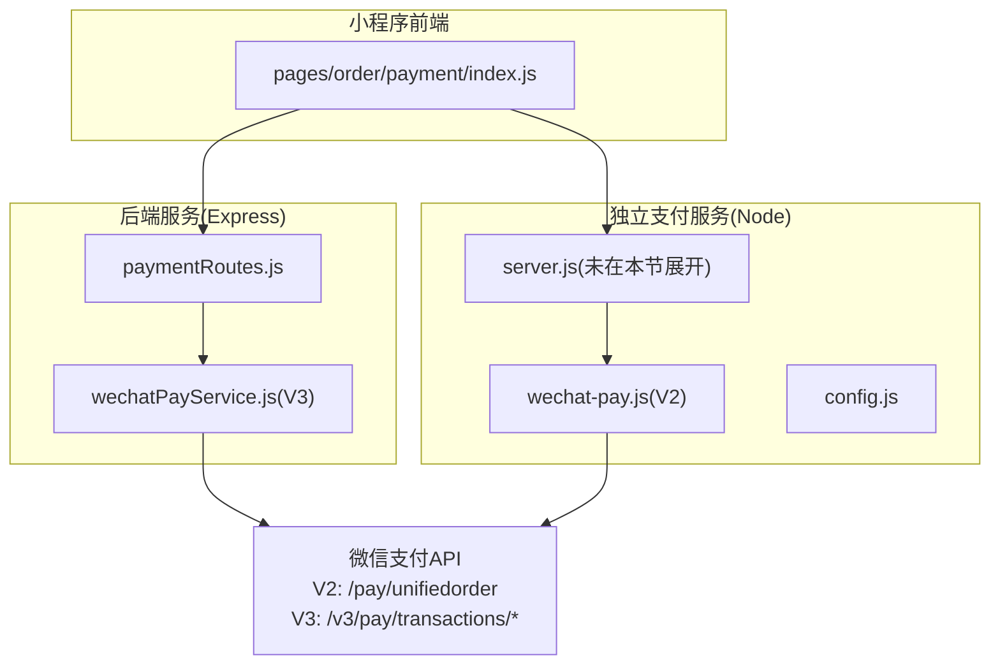
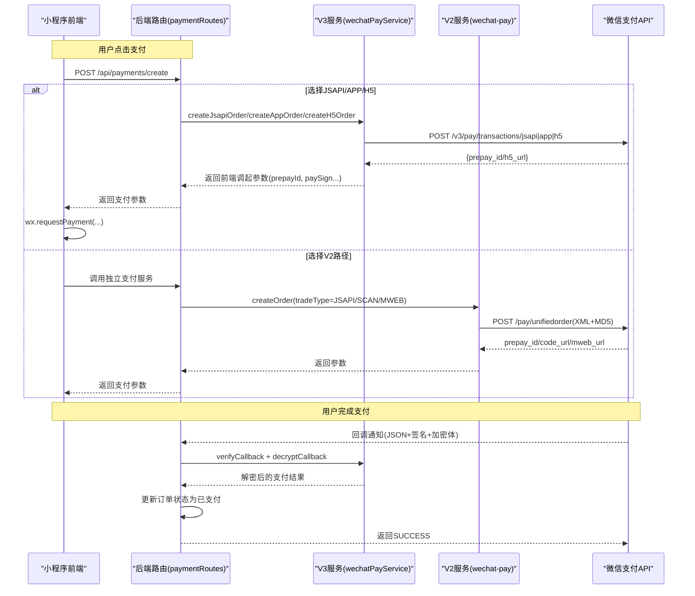
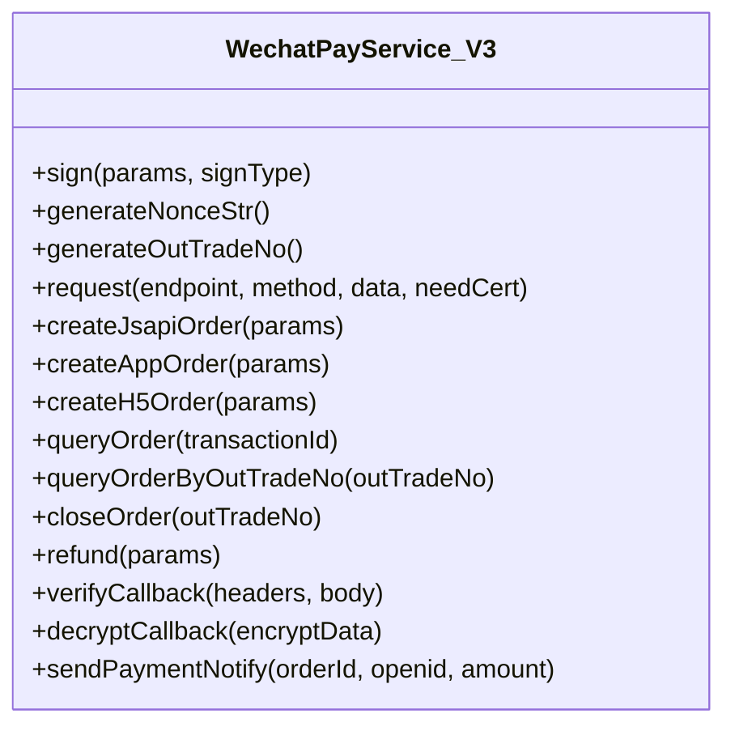
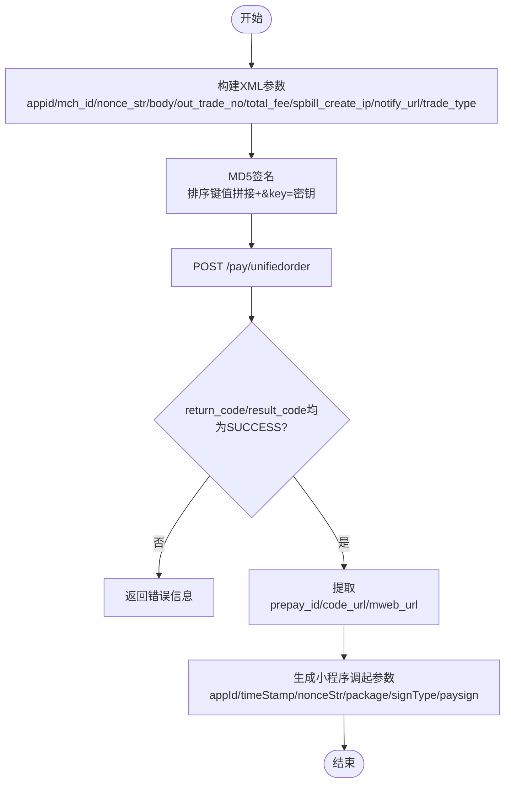
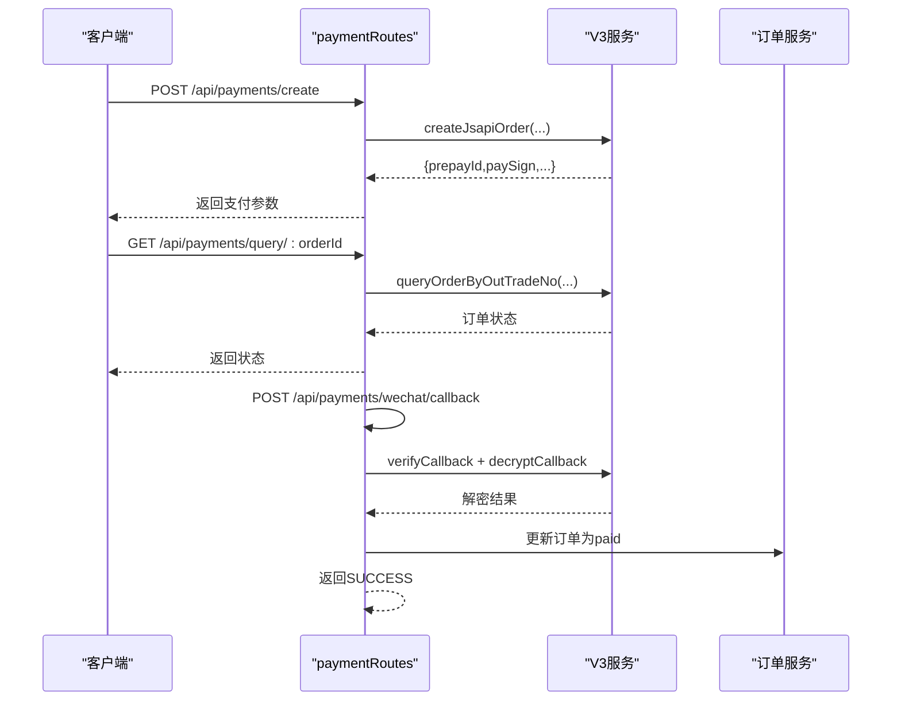
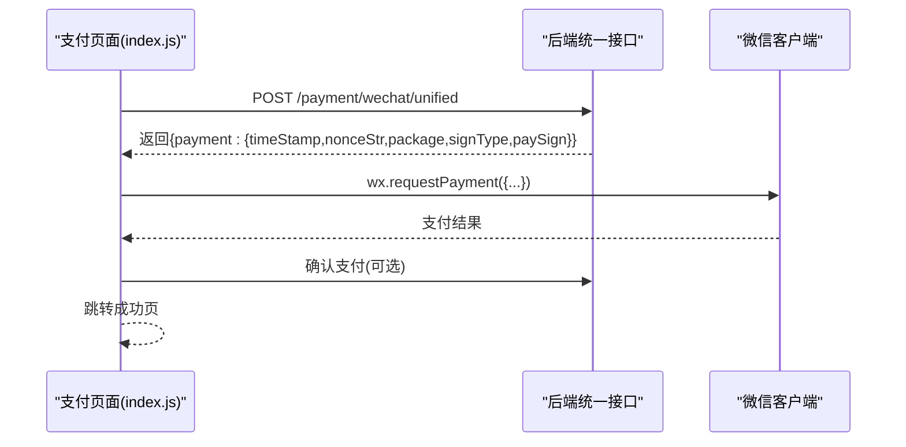
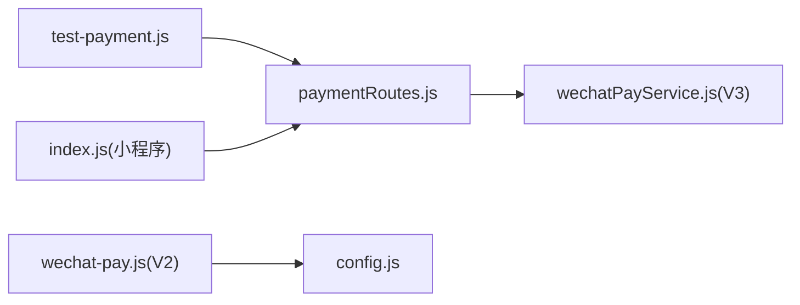

# 微信支付集成

<cite>
**本文引用的文件**   
- [api/payment-server/wechat-pay.js](file://api/payment-server/wechat-pay.js)
- [api/payment-server/config.js](file://api/payment-server/config.js)
- [backend/modules/common/services/wechatPayService.js](file://backend/modules/common/services/wechatPayService.js)
- [backend/modules/common/routes/paymentRoutes.js](file://backend/modules/common/routes/paymentRoutes.js)
- [wechat-mini-app/pages/order/payment/index.js](file://wechat-mini-app/pages/order/payment/index.js)
- [api/payment-server/test-payment.js](file://api/payment-server/test-payment.js)
</cite>

## 目录
1. [简介](#简介)
2. [项目结构](#项目结构)
3. [核心组件](#核心组件)
4. [架构总览](#架构总览)
5. [详细组件分析](#详细组件分析)
6. [依赖关系分析](#依赖关系分析)
7. [性能与可靠性](#性能与可靠性)
8. [故障排查指南](#故障排查指南)
9. [结论](#结论)
10. [附录：生产环境安全配置清单](#附录生产环境安全配置清单)

## 简介
本文件面向开发者，系统化梳理本项目中微信支付的完整实现流程，覆盖统一下单、JSAPI支付、扫码支付、H5支付等模式；详细说明签名生成算法、XML/JSON数据格式处理、回调通知验证机制；展示小程序调起支付的参数构造方法（prepay_id获取与paySign生成）；并给出订单查询、关闭订单、申请退款等核心功能的实现细节。同时提供错误处理策略、重试机制建议与日志记录方案，以及生产环境的安全配置要求（证书、HTTPS等）。

## 项目结构
本项目包含两套微信支付实现：
- 独立支付服务（Node.js）：位于 api/payment-server，采用旧版V2 XML接口，适合快速接入或兼容历史系统。
- 后端模块（Express）：位于 backend/modules/common，采用新版V3 JSON接口，支持RSA-SHA256签名、平台证书验签与AES-GCM解密。

图示来源
- [backend/modules/common/routes/paymentRoutes.js:1-215](file://backend/modules/common/routes/paymentRoutes.js#L1-L215)
- [backend/modules/common/services/wechatPayService.js:1-396](file://backend/modules/common/services/wechatPayService.js#L1-L396)
- [api/payment-server/wechat-pay.js:1-314](file://api/payment-server/wechat-pay.js#L1-L314)
- [api/payment-server/config.js:1-80](file://api/payment-server/config.js#L1-L80)
- [wechat-mini-app/pages/order/payment/index.js:1-645](file://wechat-mini-app/pages/order/payment/index.js#L1-L645)

章节来源
- [backend/modules/common/routes/paymentRoutes.js:1-215](file://backend/modules/common/routes/paymentRoutes.js#L1-L215)
- [backend/modules/common/services/wechatPayService.js:1-396](file://backend/modules/common/services/wechatPayService.js#L1-L396)
- [api/payment-server/wechat-pay.js:1-314](file://api/payment-server/wechat-pay.js#L1-L314)
- [api/payment-server/config.js:1-80](file://api/payment-server/config.js#L1-L80)
- [wechat-mini-app/pages/order/payment/index.js:1-645](file://wechat-mini-app/pages/order/payment/index.js#L1-L645)

## 核心组件
- 统一支付路由（Express）：对外暴露创建支付、查询、退款、微信回调等接口，按支付方式分发到具体服务。
- 微信支付V3服务：基于JSON API，使用商户私钥对前端调起参数进行RSA-SHA256签名，支持回调验签与AES-GCM解密。
- 微信支付V2服务：基于XML API，使用MD5签名，返回prepay_id及code_url/mweb_url等字段，供不同场景调用。
- 小程序支付页面：负责下单、选择支付方式、调起微信支付、余额/外部支付跳转与结果处理。

章节来源
- [backend/modules/common/routes/paymentRoutes.js:1-215](file://backend/modules/common/routes/paymentRoutes.js#L1-L215)
- [backend/modules/common/services/wechatPayService.js:1-396](file://backend/modules/common/services/wechatPayService.js#L1-L396)
- [api/payment-server/wechat-pay.js:1-314](file://api/payment-server/wechat-pay.js#L1-L314)
- [wechat-mini-app/pages/order/payment/index.js:1-645](file://wechat-mini-app/pages/order/payment/index.js#L1-L645)

## 架构总览
下图展示了从“小程序发起支付”到“微信支付回调更新订单”的端到端流程，涵盖V3主路径与V2备用路径。

图示来源
- [backend/modules/common/routes/paymentRoutes.js:1-215](file://backend/modules/common/routes/paymentRoutes.js#L1-L215)
- [backend/modules/common/services/wechatPayService.js:97-334](file://backend/modules/common/services/wechatPayService.js#L97-L334)
- [api/payment-server/wechat-pay.js:56-127](file://api/payment-server/wechat-pay.js#L56-L127)

## 详细组件分析

### 组件A：微信支付V3服务（JSAPI/APP/H5）
- 统一下单
  - JSAPI：提交描述、金额、过期时间、付款人openid、回调地址，返回prepay_id后由服务端用商户私钥生成前端调起签名。
  - APP：返回预支付会话标识与客户端所需签名串。
  - H5：返回h5_url用于网页跳转支付。
- 查询与关闭
  - 通过交易号或商户订单号查询订单。
  - 通过商户订单号关闭订单。
- 退款
  - 需要双向SSL证书，请求体包含退款金额、原因等。
- 回调验签与解密
  - 验签：使用平台公钥校验WeChatPay-Signature等头。
  - 解密：使用API密钥派生的密钥对resource.ciphertext进行AES-GCM解密。

图示来源
- [backend/modules/common/services/wechatPayService.js:1-396](file://backend/modules/common/services/wechatPayService.js#L1-L396)

章节来源
- [backend/modules/common/services/wechatPayService.js:97-334](file://backend/modules/common/services/wechatPayService.js#L97-L334)

### 组件B：微信支付V2服务（XML/MD5）
- 统一下单
  - 构建XML参数（含appid、mch_id、nonce_str、body、out_trade_no、total_fee、spbill_create_ip、notify_url、trade_type），使用MD5签名。
  - 返回prepay_id、code_url（扫码）、mweb_url（H5）。
- 查询/关闭/退款
  - 分别调用对应接口，返回码判断成功与否。
- 回调验签
  - 去除sign后按字典序拼接，追加key计算MD5比对。
- 小程序调起参数
  - 根据prepay_id生成appId、timeStamp、nonceStr、package、signType、paySign。

图示来源
- [api/payment-server/wechat-pay.js:56-127](file://api/payment-server/wechat-pay.js#L56-L127)
- [api/payment-server/wechat-pay.js:295-310](file://api/payment-server/wechat-pay.js#L295-L310)

章节来源
- [api/payment-server/wechat-pay.js:1-314](file://api/payment-server/wechat-pay.js#L1-L314)

### 组件C：统一支付路由（Express）
- 创建支付
  - 接收orderId、amount、method、openid等，按method分发至V3服务相应方法。
  - 返回前端可直接用于wx.requestPayment的参数。
- 查询支付
  - 根据orderId查询V3订单状态。
- 微信回调
  - 读取请求头与Body，验签通过后解密resource，更新订单状态并发送通知。
- 申请退款
  - 调用V3退款接口，成功后更新订单退款状态。

图示来源
- [backend/modules/common/routes/paymentRoutes.js:1-215](file://backend/modules/common/routes/paymentRoutes.js#L1-L215)
- [backend/modules/common/services/wechatPayService.js:336-375](file://backend/modules/common/services/wechatPayService.js#L336-L375)

章节来源
- [backend/modules/common/routes/paymentRoutes.js:1-215](file://backend/modules/common/routes/paymentRoutes.js#L1-L215)

### 组件D：小程序支付页面
- 下单与支付
  - 先创建业务订单，再调用后端统一支付接口获取支付参数。
  - 使用wx.requestPayment调起微信支付，传入timeStamp、nonceStr、package、signType、paySign。
- 余额/外部支付
  - 余额支付直接扣减；支付宝/银联通过WebView跳转H5支付页。
- 失败与取消
  - 捕获用户取消与网络异常，回退到模拟支付（开发测试用）。

图示来源
- [wechat-mini-app/pages/order/payment/index.js:448-486](file://wechat-mini-app/pages/order/payment/index.js#L448-L486)

章节来源
- [wechat-mini-app/pages/order/payment/index.js:1-645](file://wechat-mini-app/pages/order/payment/index.js#L1-L645)

## 依赖关系分析
- 路由层仅依赖服务层，服务层直接对接微信支付API。
- V3服务使用原生https模块与crypto进行签名与加解密。
- V2服务使用axios与xml2js处理HTTP与XML。
- 小程序前端依赖后端统一接口，不直接访问微信支付API。

图示来源
- [backend/modules/common/routes/paymentRoutes.js:1-215](file://backend/modules/common/routes/paymentRoutes.js#L1-L215)
- [backend/modules/common/services/wechatPayService.js:1-396](file://backend/modules/common/services/wechatPayService.js#L1-L396)
- [api/payment-server/wechat-pay.js:1-314](file://api/payment-server/wechat-pay.js#L1-L314)
- [api/payment-server/config.js:1-80](file://api/payment-server/config.js#L1-L80)
- [api/payment-server/test-payment.js:1-554](file://api/payment-server/test-payment.js#L1-L554)
- [wechat-mini-app/pages/order/payment/index.js:1-645](file://wechat-mini-app/pages/order/payment/index.js#L1-L645)

章节来源
- [backend/modules/common/routes/paymentRoutes.js:1-215](file://backend/modules/common/routes/paymentRoutes.js#L1-L215)
- [backend/modules/common/services/wechatPayService.js:1-396](file://backend/modules/common/services/wechatPayService.js#L1-L396)
- [api/payment-server/wechat-pay.js:1-314](file://api/payment-server/wechat-pay.js#L1-L314)
- [api/payment-server/config.js:1-80](file://api/payment-server/config.js#L1-L80)
- [api/payment-server/test-payment.js:1-554](file://api/payment-server/test-payment.js#L1-L554)
- [wechat-mini-app/pages/order/payment/index.js:1-645](file://wechat-mini-app/pages/order/payment/index.js#L1-L645)

## 性能与可靠性
- 并发与超时
  - 建议为所有外部HTTP请求设置合理的超时与重试上限，避免雪崩。
- 幂等与去重
  - 回调处理需保证幂等，结合订单状态机与唯一流水号防止重复入账。
- 异步化
  - 回调成功后可异步执行通知、积分、结算等后续任务，缩短响应时间。
- 监控与告警
  - 对关键步骤（下单、回调、退款）埋点统计成功率与耗时，异常阈值触发告警。

[本节为通用指导，无需代码引用]

## 故障排查指南
- 统一下单失败
  - 检查参数完整性（金额单位分、openid、trade_type、notify_url）。
  - 核对签名算法与密钥是否匹配（V2为MD5，V3为RSA-SHA256）。
- 回调验签失败
  - 确认请求头中的签名相关字段齐全且顺序正确。
  - 确保平台证书与API密钥配置一致。
- 解密失败
  - 检查resource.ciphertext是否为hex编码，密钥长度与IV是否正确。
- 小程序调起失败
  - 确认timeStamp、nonceStr、package、signType、paySign均由服务端生成且未篡改。
- 退款失败
  - 确认已上传商户证书，且退款金额不超过原订单金额。

章节来源
- [backend/modules/common/services/wechatPayService.js:336-375](file://backend/modules/common/services/wechatPayService.js#L336-L375)
- [api/payment-server/wechat-pay.js:285-290](file://api/payment-server/wechat-pay.js#L285-L290)

## 结论
本项目提供了V2与V3两套微信支付实现，既能满足快速接入与兼容性需求，也具备现代化V3接口的安全性与扩展性。推荐在生产环境优先采用V3方案，配合严格的证书管理、HTTPS强制与完善的监控告警体系，保障支付链路稳定可靠。

[本节为总结，无需代码引用]

## 附录：生产环境安全配置清单
- 证书与密钥
  - 商户API密钥（V2/V3均需要）。
  - 商户私钥与平台公钥（V3签名与验签）。
  - 退款所需的商户证书（双向SSL）。
- HTTPS
  - 回调URL必须公网可达且启用HTTPS。
- 环境变量
  - 将敏感配置通过环境变量注入，避免硬编码。
- 最小权限
  - 仅开放必要端口与回调路径，限制IP白名单。
- 审计与日志
  - 记录关键操作与错误堆栈，脱敏敏感字段。

章节来源
- [api/payment-server/config.js:1-80](file://api/payment-server/config.js#L1-L80)
- [backend/modules/common/services/wechatPayService.js:1-30](file://backend/modules/common/services/wechatPayService.js#L1-L30)