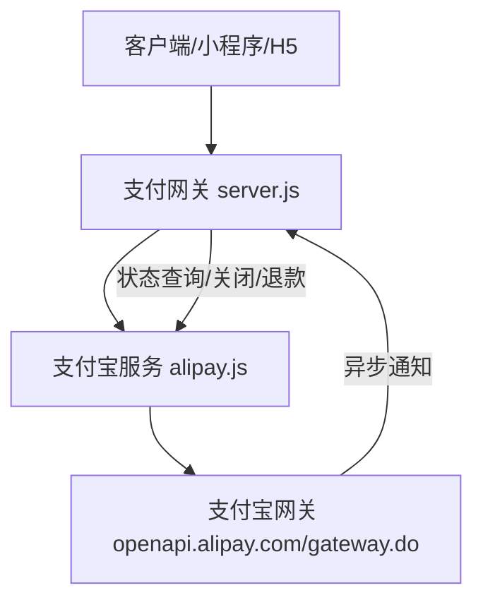
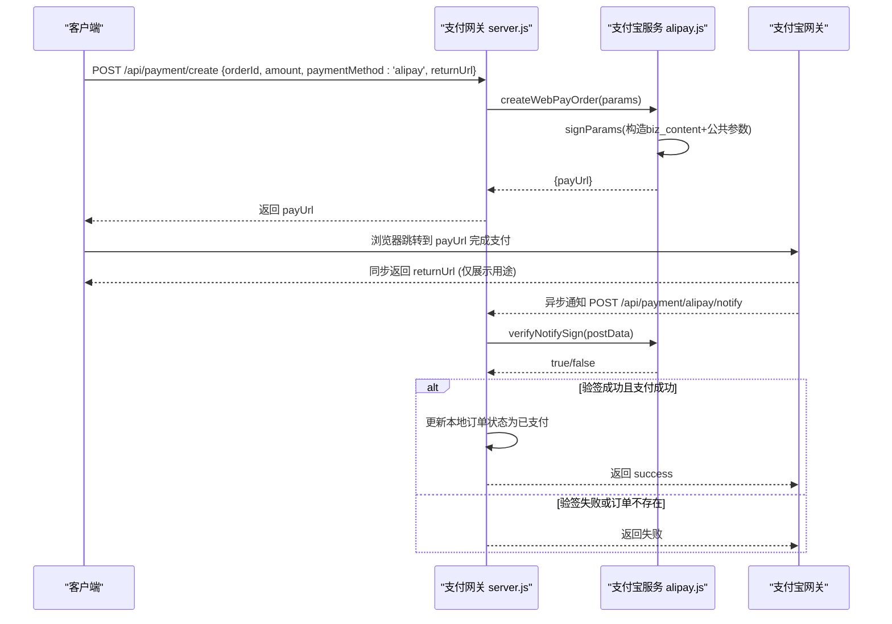
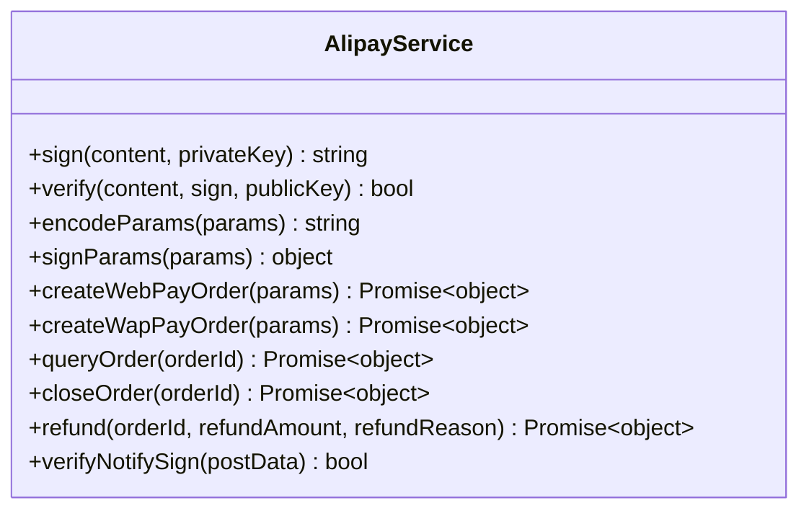
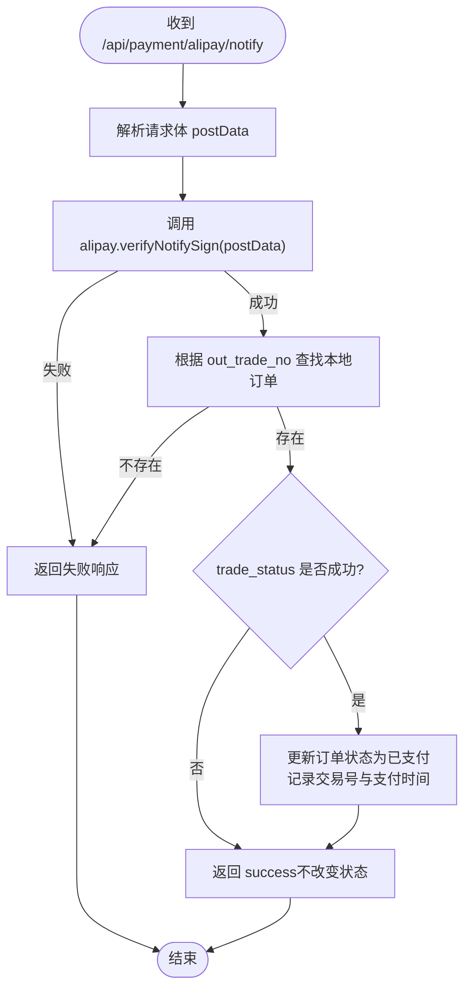
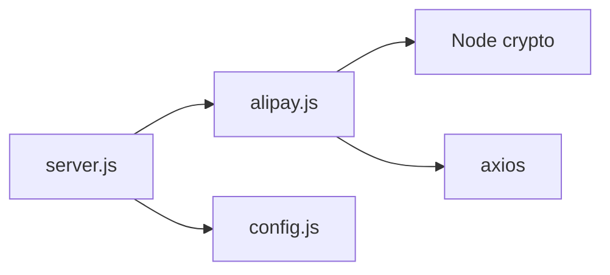

# 支付宝集成

<cite>
**本文引用的文件列表**
- [alipay.js](file://api/payment-server/alipay.js)
- [config.js](file://api/payment-server/config.js)
- [server.js](file://api/payment-server/server.js)
- [test-config.js](file://api/payment-server/test-config.js)
- [payment-api.js](file://api/payment-api.js)
- [PROJECT_COMPLETE.md](file://PROJECT_COMPLETE.md)
- [PAYMENT_SYSTEM.md](file://PAYMENT_SYSTEM.md)
</cite>

## 目录
1. [简介](#简介)
2. [项目结构](#项目结构)
3. [核心组件](#核心组件)
4. [架构总览](#架构总览)
5. [详细组件分析](#详细组件分析)
6. [依赖关系分析](#依赖关系分析)
7. [性能与一致性考虑](#性能与一致性考虑)
8. [故障排查指南](#故障排查指南)
9. [结论](#结论)
10. [附录：配置与环境](#附录配置与环境)

## 简介
本文件面向需要在系统中接入支付宝支付的开发者，提供从环境配置、SDK 集成、API 调用流程到异步通知处理的全链路说明。文档覆盖订单创建（网页/手机网站）、支付确认、异步通知校验与幂等处理、交易查询、退款申请、RSA2 签名验签机制、JSON 数据格式处理与异常策略，并给出沙箱与生产环境的部署要点。

## 项目结构
本项目在支付网关服务中实现了支付宝的完整能力，关键文件如下：
- 支付宝服务实现：[alipay.js](file://api/payment-server/alipay.js)
- 支付网关路由与回调处理：[server.js](file://api/payment-server/server.js)
- 支付系统配置（含支付宝）：[config.js](file://api/payment-server/config.js)
- 测试环境配置示例：[test-config.js](file://api/payment-server/test-config.js)
- 前端预留 API 封装（含支付宝占位）：[payment-api.js](file://api/payment-api.js)
- 部署与常见问题参考：[PAYMENT_SYSTEM.md](file://PAYMENT_SYSTEM.md)、[PROJECT_COMPLETE.md](file://PROJECT_COMPLETE.md)

图表来源
- [server.js:85-94](file://api/payment-server/server.js#L85-L94)
- [alipay.js:68-104](file://api/payment-server/alipay.js#L68-L104)
- [config.js:35-47](file://api/payment-server/config.js#L35-L47)

章节来源
- [server.js:1-120](file://api/payment-server/server.js#L1-L120)
- [alipay.js:1-142](file://api/payment-server/alipay.js#L1-L142)
- [config.js:1-80](file://api/payment-server/config.js#L1-L80)

## 核心组件
- 支付宝服务类：封装 RSA2 签名/验签、参数编码、统一收单接口调用（网页支付、手机网站支付、交易查询、关闭、退款）、回调验签。
- 支付网关路由：统一创建支付入口、查询/关闭订单、处理各渠道回调（微信/支付宝/银联）。
- 配置中心：集中管理支付宝 appId、私钥、公钥、网关地址、回调地址等环境变量。

章节来源
- [alipay.js:1-336](file://api/payment-server/alipay.js#L1-L336)
- [server.js:360-410](file://api/payment-server/server.js#L360-L410)
- [config.js:35-47](file://api/payment-server/config.js#L35-L47)

## 架构总览
下图展示了“创建订单 -> 跳转支付宝 -> 同步返回 -> 异步通知 -> 本地落库”的端到端流程。

图表来源
- [server.js:42-94](file://api/payment-server/server.js#L42-L94)
- [alipay.js:68-104](file://api/payment-server/alipay.js#L68-L104)
- [server.js:366-402](file://api/payment-server/server.js#L366-L402)

## 详细组件分析

### 支付宝服务类（AlipayService）
职责
- 使用 RSA-SHA256 对请求参数进行签名，并对支付宝回调进行验签。
- 生成网页/手机网站支付链接。
- 调用统一收单接口：交易查询、关闭、退款。
- 将业务参数 biz_content 序列化为 JSON，并按要求排序拼接后进行签名。

关键方法
- 签名/验签：sign(content, privateKey)、verify(content, sign, publicKey)
- 参数编码：encodeParams(params)
- 生成签名参数：signParams(params)
- 网页支付：createWebPayOrder(params)
- 手机网站支付：createWapPayOrder(params)
- 交易查询：queryOrder(orderId)
- 关闭订单：closeOrder(orderId)
- 退款：refund(orderId, refundAmount, refundReason)
- 回调验签：verifyNotifySign(postData)

复杂度与注意事项
- 签名/验签基于 Node crypto，时间复杂度与输入长度线性相关；注意私钥/公钥格式与算法匹配（RSA-SHA256）。
- 所有对外请求均通过 axios.post 以 application/x-www-form-urlencoded 发送，需确保 Content-Type 正确。
- 金额字段使用 toFixed(2) 保证两位小数，避免浮点误差。

图表来源
- [alipay.js:1-336](file://api/payment-server/alipay.js#L1-L336)

章节来源
- [alipay.js:1-336](file://api/payment-server/alipay.js#L1-L336)

### 支付网关路由（Express）
职责
- 统一入口：POST /api/payment/create 根据支付方式分发到对应服务。
- 查询/关闭：GET /api/payment/query/:orderId、POST /api/payment/close/:orderId。
- 回调处理：POST /api/payment/alipay/notify，完成签名校验与订单状态更新。
- 同步返回：GET /payment/alipay/return，用于前端重定向至结果页。

关键流程
- 创建支付宝订单：调用 alipay.createWebPayOrder，返回 payUrl。
- 异步通知：先验签，再判断 trade_status 是否为成功态，最后持久化并返回 success。
- 交易查询：按支付方式路由到 alipay.queryOrder，并更新本地缓存订单状态。

图表来源
- [server.js:366-402](file://api/payment-server/server.js#L366-L402)
- [alipay.js:303-307](file://api/payment-server/alipay.js#L303-L307)

章节来源
- [server.js:42-174](file://api/payment-server/server.js#L42-L174)
- [server.js:180-240](file://api/payment-server/server.js#L180-L240)
- [server.js:366-410](file://api/payment-server/server.js#L366-L410)

### 配置与环境变量
支付宝相关配置项
- ALIPAY_APP_ID：应用 ID
- ALIPAY_PRIVATE_KEY：应用私钥（RSA2）
- ALIPAY_PUBLIC_KEY：支付宝公钥（用于验签）
- ALIPAY_GATEWAY：网关地址（默认生产地址）
- ALIPAY_NOTIFY_URL：异步通知回调地址

配置读取位置
- 配置文件：[config.js:35-47](file://api/payment-server/config.js#L35-L47)
- 测试配置：[test-config.js:35-44](file://api/payment-server/test-config.js#L35-L44)

章节来源
- [config.js:35-47](file://api/payment-server/config.js#L35-L47)
- [test-config.js:35-44](file://api/payment-server/test-config.js#L35-L44)

### 前端预留 API 封装
前端侧提供了统一的支付 API 封装，其中包含支付宝的占位实现，便于后续替换为真实后端调用。当前实现为模拟返回，不影响服务端集成逻辑。

章节来源
- [payment-api.js:181-224](file://api/payment-api.js#L181-L224)

## 依赖关系分析
- server.js 依赖 alipay.js 提供的服务方法与 config.js 的配置。
- alipay.js 依赖 Node 内置 crypto 与 axios 发起 HTTP 请求。
- 配置项通过环境变量注入，支持不同环境切换。

图表来源
- [server.js:1-20](file://api/payment-server/server.js#L1-L20)
- [alipay.js:1-10](file://api/payment-server/alipay.js#L1-L10)
- [config.js:1-10](file://api/payment-server/config.js#L1-L10)

章节来源
- [server.js:1-20](file://api/payment-server/server.js#L1-L20)
- [alipay.js:1-10](file://api/payment-server/alipay.js#L1-L10)
- [config.js:1-10](file://api/payment-server/config.js#L1-L10)

## 性能与一致性考虑
- 幂等性：异步通知可能重复到达，需在业务层基于 out_trade_no 做幂等处理（例如写入前检查是否已标记为已支付）。
- 重试与退避：对支付宝网络异常应增加重试与退避策略，避免瞬时抖动导致状态不一致。
- 事务边界：订单状态更新与结算记录写入应在同一事务内完成，保证最终一致性。
- 超时控制：对外部网关请求设置合理超时与熔断，防止雪崩。
- 日志与追踪：记录关键步骤（签名、请求、响应、状态变更），便于问题定位。

[本节为通用建议，无需代码引用]

## 故障排查指南
常见问题与定位思路
- 回调验签失败
  - 检查支付宝公钥是否正确配置
  - 确认 notify_url 公网可达且路径一致
  - 核对参数排序与编码是否与 SDK 一致
- 订单未更新
  - 检查 trade_status 是否为 TRADE_SUCCESS/TRADE_FINISHED
  - 确认本地订单是否存在且未被重复处理
- 支付链接无效
  - 检查 appId、私钥、product_code、total_amount 等必填字段
  - 确认 returnUrl 与 notify_url 配置正确

章节来源
- [server.js:366-402](file://api/payment-server/server.js#L366-L402)
- [alipay.js:303-307](file://api/payment-server/alipay.js#L303-L307)

## 结论
本方案通过独立的支付宝服务类与支付网关路由，实现了完整的支付宝集成能力，涵盖订单创建、同步返回、异步通知、交易查询与退款等关键环节。配合环境变量与测试配置，可快速在沙箱验证并在生产环境平滑上线。建议在正式环境中完善幂等、重试、事务与监控告警，以确保资金安全与数据一致性。

[本节为总结，无需代码引用]

## 附录：配置与环境

### 沙箱与测试环境
- 使用测试配置：[test-config.js:35-44](file://api/payment-server/test-config.js#L35-L44)
- 测试模式开关：server.testMode = true（见测试配置）
- 回调地址：http://localhost:3002/api/payment/alipay/notify

章节来源
- [test-config.js:35-44](file://api/payment-server/test-config.js#L35-L44)

### 生产环境部署要点
- 域名与 HTTPS：必须配置公网域名与有效证书，确保回调可达。
- 环境变量：ALIPAY_APP_ID、ALIPAY_PRIVATE_KEY、ALIPAY_PUBLIC_KEY、ALIPAY_GATEWAY、ALIPAY_NOTIFY_URL。
- 启动方式：建议使用进程管理器（如 PM2）进行守护与自启。
- 回调 URL 配置：在支付宝商户后台配置 https://yourdomain/api/payment/alipay/notify。

章节来源
- [PAYMENT_SYSTEM.md:286-359](file://PAYMENT_SYSTEM.md#L286-L359)
- [PROJECT_COMPLETE.md:189-215](file://PROJECT_COMPLETE.md#L189-L215)
- [config.js:35-47](file://api/payment-server/config.js#L35-L47)

### 关键 API 与调用示例（路径指引）
- 创建支付宝订单（网页）
  - 路由：POST /api/payment/create
  - 内部调用：alipay.createWebPayOrder
  - 参考路径：[server.js:85-94](file://api/payment-server/server.js#L85-L94)、[alipay.js:68-104](file://api/payment-server/alipay.js#L68-L104)
- 支付宝异步通知
  - 路由：POST /api/payment/alipay/notify
  - 验签：alipay.verifyNotifySign
  - 参考路径：[server.js:366-402](file://api/payment-server/server.js#L366-L402)、[alipay.js:303-307](file://api/payment-server/alipay.js#L303-L307)
- 交易查询
  - 路由：GET /api/payment/query/:orderId
  - 内部调用：alipay.queryOrder
  - 参考路径：[server.js:180-240](file://api/payment-server/server.js#L180-L240)、[alipay.js:147-199](file://api/payment-server/alipay.js#L147-L199)
- 关闭订单
  - 路由：POST /api/payment/close/:orderId
  - 内部调用：alipay.closeOrder
  - 参考路径：[server.js:246-304](file://api/payment-server/server.js#L246-L304)、[alipay.js:204-244](file://api/payment-server/alipay.js#L204-L244)
- 退款申请
  - 内部调用：alipay.refund
  - 参考路径：[alipay.js:249-298](file://api/payment-server/alipay.js#L249-L298)