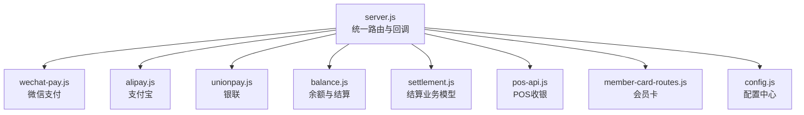
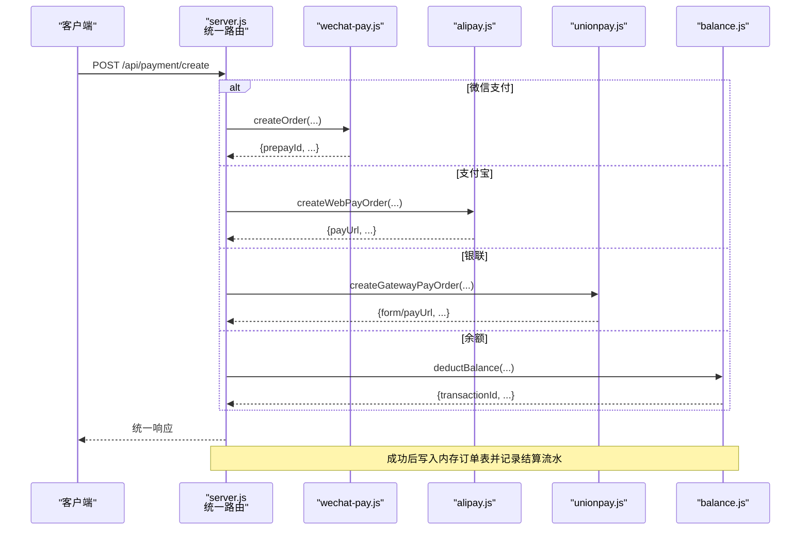
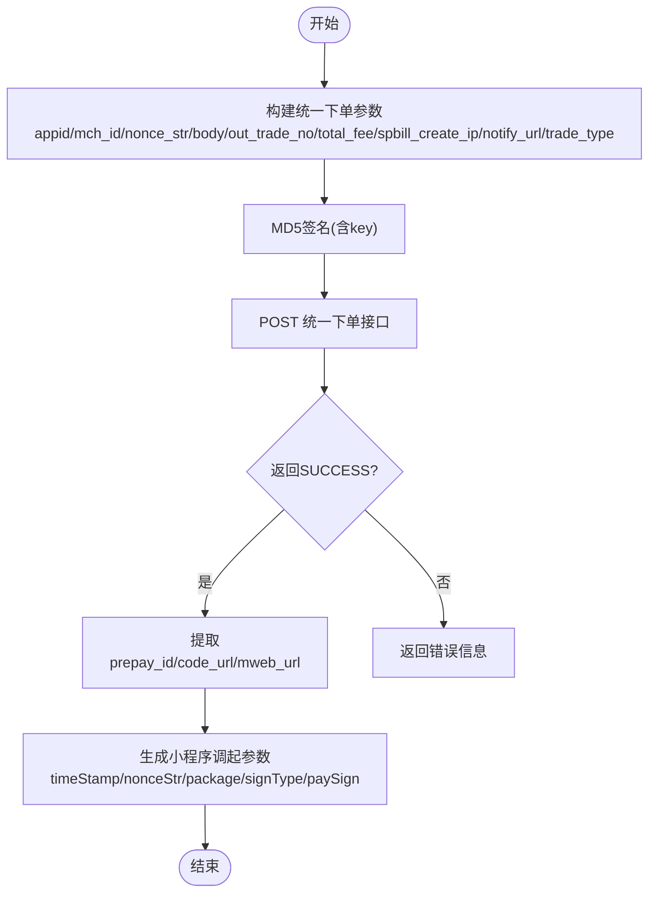
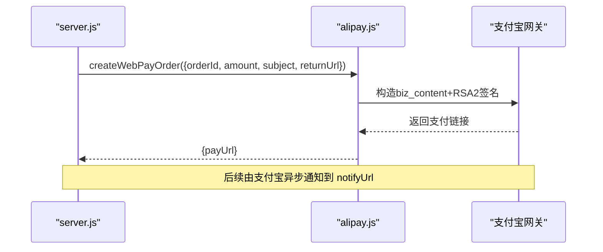
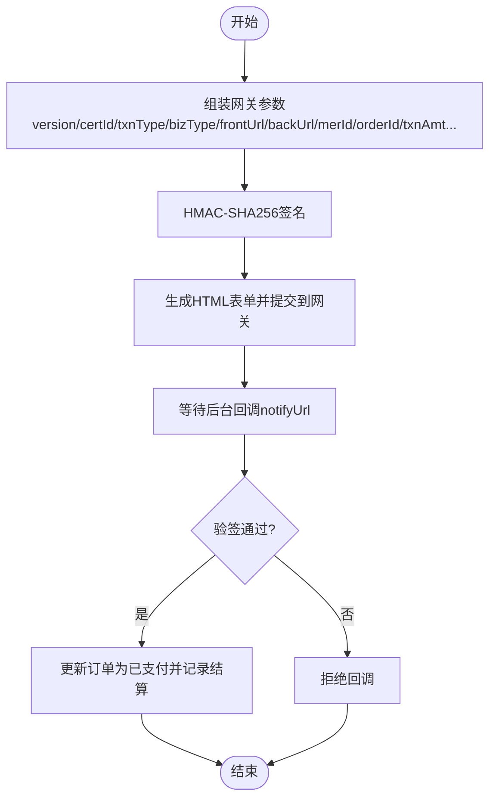
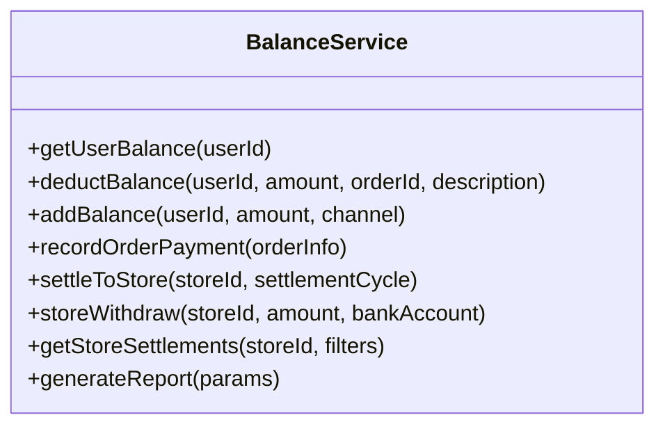
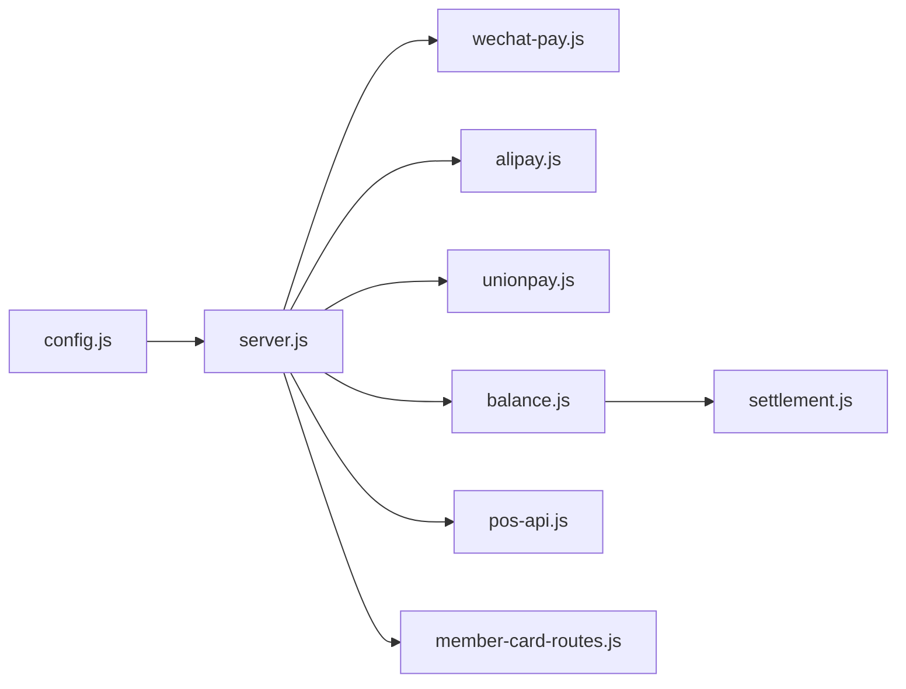

# 支付渠道集成

<cite>
**本文引用的文件**   
- [api/payment-server/README.md](file://api/payment-server/README.md)
- [api/payment-server/config.js](file://api/payment-server/config.js)
- [api/payment-server/server.js](file://api/payment-server/server.js)
- [api/payment-server/wechat-pay.js](file://api/payment-server/wechat-pay.js)
- [api/payment-server/alipay.js](file://api/payment-server/alipay.js)
- [api/payment-server/unionpay.js](file://api/payment-server/unionpay.js)
- [api/payment-server/balance.js](file://api/payment-server/balance.js)
- [api/payment-server/settlement.js](file://api/payment-server/settlement.js)
- [api/payment-server/pos-api.js](file://api/payment-server/pos-api.js)
- [api/payment-server/member-card-routes.js](file://api/payment-server/member-card-routes.js)
- [api/payment-server/test-payment.js](file://api/payment-server/test-payment.js)
</cite>

## 目录
1. [引言](#引言)
2. [项目结构](#项目结构)
3. [核心组件](#核心组件)
4. [架构总览](#架构总览)
5. [详细组件分析](#详细组件分析)
6. [依赖关系分析](#依赖关系分析)
7. [性能与可靠性](#性能与可靠性)
8. [故障排查指南](#故障排查指南)
9. [结论](#结论)
10. [附录：扩展新支付渠道与切换配置](#附录扩展新支付渠道与切换配置)

## 引言
本文件面向“干洗系统”的支付网关，系统性说明微信支付、支付宝、银联支付和余额支付的实现机制。内容覆盖各渠道的配置参数、API调用流程、签名验证方法、回调处理逻辑；并提供统一接口规范、错误处理策略、重试建议、测试方法与调试技巧，以及支付渠道切换与故障转移的实现细节。

## 项目结构
支付网关位于 api/payment-server 目录下，采用 Express 作为 HTTP 服务入口，按支付方式拆分模块，并通过统一路由进行编排。

图表来源
- [api/payment-server/server.js:1-624](file://api/payment-server/server.js#L1-L624)
- [api/payment-server/config.js:1-80](file://api/payment-server/config.js#L1-L80)

章节来源
- [api/payment-server/README.md:1-481](file://api/payment-server/README.md#L1-L481)
- [api/payment-server/server.js:1-624](file://api/payment-server/server.js#L1-L624)
- [api/payment-server/config.js:1-80](file://api/payment-server/config.js#L1-L80)

## 核心组件
- 统一支付入口：提供创建订单、查询状态、关闭订单等统一接口，内部根据 paymentMethod 分发到具体渠道。
- 渠道适配层：微信、支付宝、银联各自封装签名、请求、解析与验签逻辑。
- 余额与结算：用户余额管理、门店账户、待结算与提现、报表统计。
- POS与会员卡：线下收银与会员扣款能力，与统一支付体系联动。

章节来源
- [api/payment-server/server.js:36-304](file://api/payment-server/server.js#L36-L304)
- [api/payment-server/balance.js:1-524](file://api/payment-server/balance.js#L1-L524)
- [api/payment-server/settlement.js:1-389](file://api/payment-server/settlement.js#L1-L389)
- [api/payment-server/pos-api.js:1-556](file://api/payment-server/pos-api.js#L1-L556)
- [api/payment-server/member-card-routes.js:1-281](file://api/payment-server/member-card-routes.js#L1-L281)

## 架构总览
支付网关对外暴露统一 REST API，内部通过策略分发至不同支付渠道；所有成功支付均记录到余额与结算子系统，支持门店结算与提现。

图表来源
- [api/payment-server/server.js:42-174](file://api/payment-server/server.js#L42-L174)
- [api/payment-server/wechat-pay.js:56-127](file://api/payment-server/wechat-pay.js#L56-L127)
- [api/payment-server/alipay.js:68-104](file://api/payment-server/alipay.js#L68-L104)
- [api/payment-server/unionpay.js:78-123](file://api/payment-server/unionpay.js#L78-L123)
- [api/payment-server/balance.js:91-139](file://api/payment-server/balance.js#L91-L139)

## 详细组件分析

### 微信支付（JSAPI/NATIVE/H5/APP）
- 配置要点
  - 小程序与H5分别维护 appId/appSecret/mchId/apiKey/notifyUrl。
  - API基础地址可配置。
- 关键流程
  - 统一下单：组装XML参数，MD5签名，POST 到统一下单接口，返回 prepay_id 或 code_url/mweb_url。
  - 生成小程序调起参数：基于 prepay_id 再次签名后返回给前端。
  - 查询/关闭/退款：对应官方接口封装。
- 签名与验签
  - 签名：字段字典序拼接 + key，MD5大写。
  - 回调验签：去除 sign 后重算比对。
- 回调处理
  - 接收 XML，验签通过后更新本地订单状态，并记录结算流水。

图表来源
- [api/payment-server/wechat-pay.js:56-127](file://api/payment-server/wechat-pay.js#L56-L127)
- [api/payment-server/wechat-pay.js:295-310](file://api/payment-server/wechat-pay.js#L295-L310)
- [api/payment-server/server.js:312-350](file://api/payment-server/server.js#L312-L350)

章节来源
- [api/payment-server/config.js:12-33](file://api/payment-server/config.js#L12-L33)
- [api/payment-server/wechat-pay.js:1-314](file://api/payment-server/wechat-pay.js#L1-L314)
- [api/payment-server/server.js:312-358](file://api/payment-server/server.js#L312-L358)

### 支付宝（网页/手机网站）
- 配置要点
  - appId、RSA2私钥、支付宝公钥、网关地址、回调地址。
- 关键流程
  - 网页支付：构造 biz_content，RSA2签名，拼接URL返回 payUrl。
  - 查询/关闭/退款：对应 alipay.trade.query/close/refund。
- 签名与验签
  - 签名：对排序后的键值串使用 RSA-SHA256 私钥签名。
  - 回调验签：使用支付宝公钥校验 sign。
- 回调处理
  - 验签通过后更新订单状态并记录结算流水。

图表来源
- [api/payment-server/alipay.js:68-104](file://api/payment-server/alipay.js#L68-L104)
- [api/payment-server/alipay.js:303-307](file://api/payment-server/alipay.js#L303-L307)
- [api/payment-server/server.js:366-402](file://api/payment-server/server.js#L366-L402)

章节来源
- [api/payment-server/config.js:35-47](file://api/payment-server/config.js#L35-L47)
- [api/payment-server/alipay.js:1-336](file://api/payment-server/alipay.js#L1-L336)
- [api/payment-server/server.js:366-410](file://api/payment-server/server.js#L366-L410)

### 银联支付（网关/手机网页/银行卡直连）
- 配置要点
  - 商户号、签名证书路径与密码、回调地址、API地址。
- 关键流程
  - 网关支付：组装表单参数，SHA256签名，返回HTML表单自动提交。
  - 手机网页：类似网关但 channelType 不同。
  - 银行卡直连：需传入卡号、CVN2、有效期等敏感信息（生产环境应走安全通道）。
- 签名与验签
  - 签名：字段排序拼接后用 HMAC-SHA256 计算。
  - 回调验签：去除 signature/signMethod 后重算比对。
- 回调处理
  - 验签通过后更新订单状态并记录结算流水。

图表来源
- [api/payment-server/unionpay.js:78-123](file://api/payment-server/unionpay.js#L78-L123)
- [api/payment-server/unionpay.js:467-472](file://api/payment-server/unionpay.js#L467-L472)
- [api/payment-server/server.js:417-451](file://api/payment-server/server.js#L417-L451)

章节来源
- [api/payment-server/config.js:49-62](file://api/payment-server/config.js#L49-L62)
- [api/payment-server/unionpay.js:1-501](file://api/payment-server/unionpay.js#L1-L501)
- [api/payment-server/server.js:417-458](file://api/payment-server/server.js#L417-L458)

### 余额支付与充值
- 功能范围
  - 用户余额查询、扣减、充值、交易记录分页。
  - 门店可用/冻结/待结算余额、结算、提现、报表。
- 业务流程
  - 余额支付：校验余额充足后扣减并记录交易流水。
  - 充值：增加余额并记录流水。
  - 结算：将平台服务费扣除后，剩余金额计入门店待结算；到期转入可用余额。
  - 提现：冻结可用余额，模拟银行处理完成后解冻并记录手续费。

图表来源
- [api/payment-server/balance.js:1-524](file://api/payment-server/balance.js#L1-L524)

章节来源
- [api/payment-server/balance.js:1-524](file://api/payment-server/balance.js#L1-L524)
- [api/payment-server/server.js:466-578](file://api/payment-server/server.js#L466-L578)

### POS收银与会员卡
- POS收银
  - 创建订单、扫码/现金/会员卡支付、查询、打印小票、同步结算中心。
- 会员卡
  - 开卡、查询、消费、充值、密码校验、挂失/解挂、门店可用卡列表。

章节来源
- [api/payment-server/pos-api.js:1-556](file://api/payment-server/pos-api.js#L1-L556)
- [api/payment-server/member-card-routes.js:1-281](file://api/payment-server/member-card-routes.js#L1-L281)

## 依赖关系分析
- server.js 作为入口，集中注册路由与中间件，并按 paymentMethod 分发到 wechat-pay、alipay、unionpay、balance。
- 各渠道模块仅依赖 config.js 中的配置项，保持低耦合。
- balance.js 同时承担用户余额与门店结算数据（内存Map），被 server.js 在回调中调用以记录结算流水。
- settlement.js 提供结算业务模型与方法，当前未直接挂载路由，可作为未来独立服务的参考实现。

图表来源
- [api/payment-server/server.js:1-624](file://api/payment-server/server.js#L1-L624)
- [api/payment-server/config.js:1-80](file://api/payment-server/config.js#L1-L80)
- [api/payment-server/balance.js:1-524](file://api/payment-server/balance.js#L1-L524)
- [api/payment-server/settlement.js:1-389](file://api/payment-server/settlement.js#L1-L389)

章节来源
- [api/payment-server/server.js:1-624](file://api/payment-server/server.js#L1-L624)
- [api/payment-server/config.js:1-80](file://api/payment-server/config.js#L1-L80)

## 性能与可靠性
- 幂等性
  - 回调处理需保证幂等：同一笔订单多次回调不应重复入账。建议在余额与结算记录中加入唯一约束或去重表。
- 重试机制
  - 对外部渠道的查询/关闭/退款建议引入指数退避重试（如 1s/5s/25s），并对网络异常与超时做兜底。
- 并发与锁
  - 余额扣减与结算入账需加分布式锁或数据库事务，避免超扣与重复结算。
- 限流与熔断
  - 对第三方网关调用增加限流与熔断保护，防止雪崩。
- 日志与追踪
  - 全链路记录 traceId，便于定位问题。

[本节为通用指导，不直接分析具体文件]

## 故障排查指南
- 常见错误
  - 余额不足：余额支付前会检查余额，返回可用余额与所需金额。
  - 支付方式未启用：检查 config.js 中 enabled 开关。
  - 订单不存在：统一路由中若内存订单表无记录，会返回错误。
- 回调失败
  - 签名验证失败：核对密钥/公钥/证书与参数顺序。
  - 回调不可达：确保公网可达且端口开放。
- 调试技巧
  - 使用 test-payment.js 执行端到端测试，覆盖健康检查、充值、各渠道下单、查询、结算与提现。
  - 查看服务器启动输出，确认端口与服务状态。

章节来源
- [api/payment-server/server.js:56-174](file://api/payment-server/server.js#L56-L174)
- [api/payment-server/server.js:312-451](file://api/payment-server/server.js#L312-L451)
- [api/payment-server/test-payment.js:1-554](file://api/payment-server/test-payment.js#L1-L554)

## 结论
本支付网关以统一入口聚合多支付渠道，结合余额与结算体系，形成从下单、支付、回调到分账结算的完整闭环。通过模块化设计与清晰配置，便于扩展新的支付渠道与调整渠道优先级。

[本节为总结，不直接分析具体文件]

## 附录：扩展新支付渠道与切换配置

### 统一接口规范
- 创建支付
  - POST /api/payment/create
  - 入参：orderId、amount、subject、paymentMethod、userId/openid/returnUrl/clientIp 等
  - 出参：success、data（包含渠道特定参数，如 payUrl/prepayId/form 等）
- 查询支付
  - GET /api/payment/query/:orderId
- 关闭订单
  - POST /api/payment/close/:orderId

章节来源
- [api/payment-server/server.js:42-304](file://api/payment-server/server.js#L42-L304)

### 新增渠道步骤
1. 新增渠道模块
   - 新建 xxx-pay.js，实现：createOrder、queryOrder、closeOrder、refund、verifyNotifySign 等方法。
   - 在 config.js 中添加对应配置项（enabled、appId、密钥、回调地址等）。
2. 接入统一路由
   - 在 server.js 的 /api/payment/create 分支中增加 case 'xxx'，调用新模块。
   - 在 /api/payment/query/:orderId 与 /api/payment/close/:orderId 分支中增加对应处理。
3. 注册回调
   - 新增 /api/payment/xxx/notify 路由，完成验签与订单状态更新，并调用 balance.recordOrderPayment 记录结算。
4. 单元测试
   - 在 test-payment.js 中补充对应渠道的测试用例。

章节来源
- [api/payment-server/server.js:42-304](file://api/payment-server/server.js#L42-L304)
- [api/payment-server/config.js:1-80](file://api/payment-server/config.js#L1-L80)
- [api/payment-server/test-payment.js:1-554](file://api/payment-server/test-payment.js#L1-L554)

### 渠道切换与故障转移
- 动态开关
  - 通过 config.js 中各渠道 enabled 字段控制是否可用。
- 优先级与降级
  - 可在统一路由中实现“首选渠道 -> 次选渠道”的降级逻辑，当首选失败时自动切换到备用渠道。
- 健康检查
  - 使用 /api/health 获取各服务状态，用于负载均衡与健康探测。

章节来源
- [api/payment-server/config.js:1-80](file://api/payment-server/config.js#L1-L80)
- [api/payment-server/server.js:582-592](file://api/payment-server/server.js#L582-L592)

### 测试方法与调试技巧
- 运行测试脚本
  - node api/payment-server/test-payment.js
- 覆盖场景
  - 健康检查、余额充值、各渠道下单、查询、关闭、结算查询、提现、批量支付。
- 常见问题定位
  - 检查环境变量与证书路径是否正确。
  - 核对回调地址是否公网可达。
  - 查看控制台日志与内存订单表状态。

章节来源
- [api/payment-server/test-payment.js:1-554](file://api/payment-server/test-payment.js#L1-L554)
- [api/payment-server/README.md:292-313](file://api/payment-server/README.md#L292-L313)