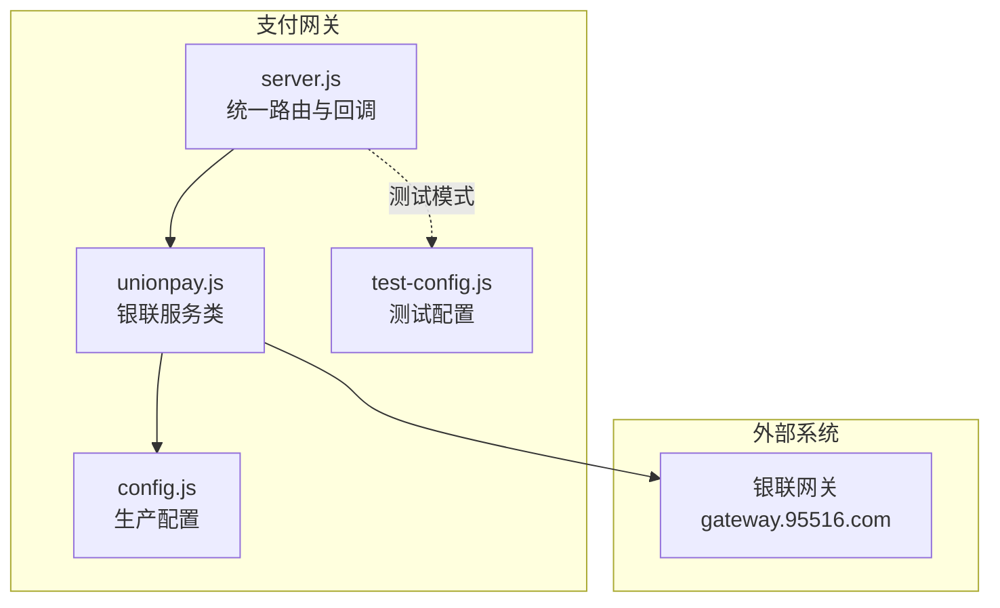
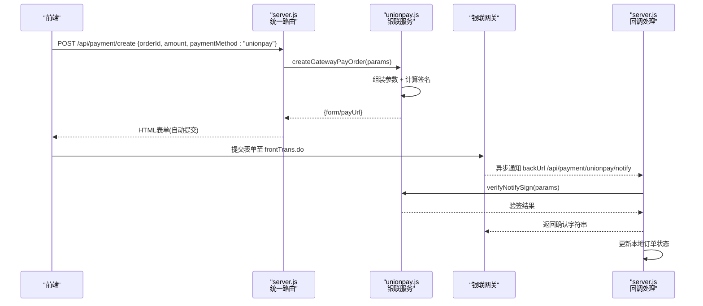
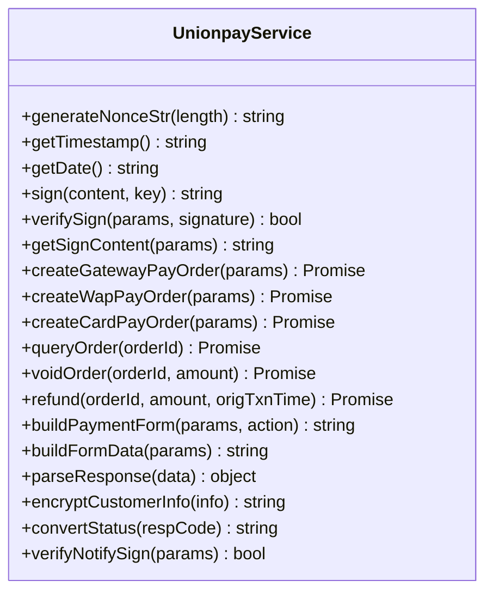
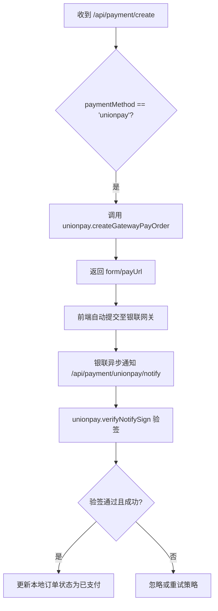
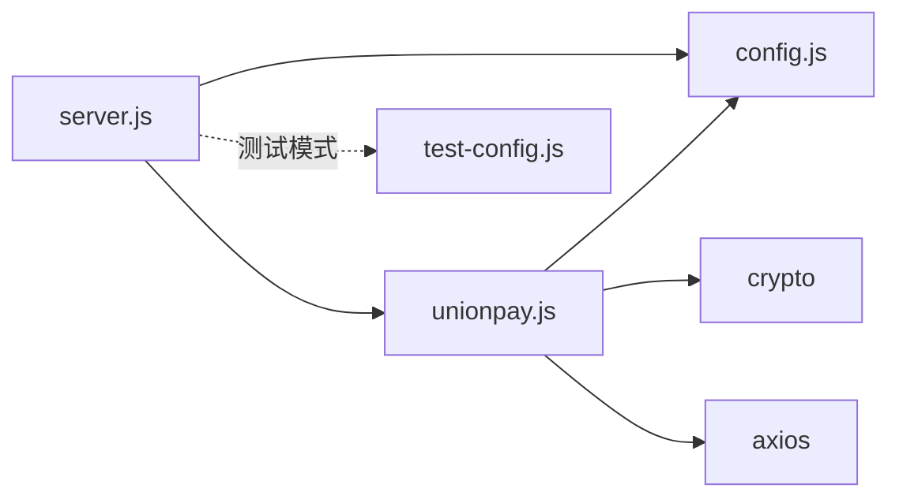

# 银联支付集成

<cite>
**本文引用的文件**   
- [unionpay.js](file://api/payment-server/unionpay.js)
- [config.js](file://api/payment-server/config.js)
- [server.js](file://api/payment-server/server.js)
- [test-config.js](file://api/payment-server/test-config.js)
- [README.md](file://api/payment-server/README.md)
- [QUICK_START.md](file://api/payment-server/QUICK_START.md)
- [TEST_GUIDE.md](file://api/payment-server/TEST_GUIDE.md)
</cite>

## 目录
1. [简介](#简介)
2. [项目结构](#项目结构)
3. [核心组件](#核心组件)
4. [架构总览](#架构总览)
5. [详细组件分析](#详细组件分析)
6. [依赖关系分析](#依赖关系分析)
7. [性能与可靠性](#性能与可靠性)
8. [故障排查指南](#故障排查指南)
9. [结论](#结论)
10. [附录：接口与配置清单](#附录接口与配置清单)

## 简介
本文件面向需要在系统中接入银联支付的开发者，提供从接口调用规范、数据传输格式、订单创建与跳转、结果通知、签名生成与验证，到查询、撤销、退款等高级功能的完整说明。同时覆盖测试环境与生产环境的差异、安全要求与证书管理方案，帮助快速完成对接并稳定上线。

## 项目结构
支付网关服务位于 api/payment-server 目录，其中银联相关实现集中在 unionpay.js，统一路由与回调处理在 server.js，配置项在 config.js，测试环境配置在 test-config.js。

图表来源
- [server.js:1-120](file://api/payment-server/server.js#L1-L120)
- [unionpay.js:10-120](file://api/payment-server/unionpay.js#L10-L120)
- [config.js:49-62](file://api/payment-server/config.js#L49-L62)
- [test-config.js:46-55](file://api/payment-server/test-config.js#L46-L55)

章节来源
- [server.js:1-120](file://api/payment-server/server.js#L1-L120)
- [unionpay.js:10-120](file://api/payment-server/unionpay.js#L10-L120)
- [config.js:49-62](file://api/payment-server/config.js#L49-L62)
- [test-config.js:46-55](file://api/payment-server/test-config.js#L46-L55)

## 核心组件
- 银联服务类（UnionpayService）
  - 负责构建请求参数、签名、表单拼装、响应解析、状态转换、回调验签等。
  - 提供网关支付、手机网页支付、银行卡直连扣款、订单查询、交易撤销、退款等方法。
- 统一路由层（server.js）
  - 暴露统一支付入口 /api/payment/create，按支付方式分发到对应模块。
  - 提供银联回调 /api/payment/unionpay/notify 和前端返回页 /payment/unionpay/return。
- 配置中心（config.js / test-config.js）
  - 集中管理商户号、签名证书密码、回调地址、API 地址等。
  - 测试模式使用模拟值，生产模式通过环境变量注入真实值。

章节来源
- [unionpay.js:10-120](file://api/payment-server/unionpay.js#L10-L120)
- [server.js:96-104](file://api/payment-server/server.js#L96-L104)
- [config.js:49-62](file://api/payment-server/config.js#L49-L62)
- [test-config.js:46-55](file://api/payment-server/test-config.js#L46-L55)

## 架构总览
下图展示一次典型的“PC网页网关支付”流程：前端调用后端统一接口创建订单，后端组装银联请求并返回自动提交的HTML表单，浏览器提交至银联网关，用户完成支付后银联异步通知后端，后端验签并更新订单状态。

图表来源
- [server.js:96-104](file://api/payment-server/server.js#L96-L104)
- [unionpay.js:78-123](file://api/payment-server/unionpay.js#L78-L123)
- [server.js:417-451](file://api/payment-server/server.js#L417-L451)

## 详细组件分析

### 银联服务类（UnionpayService）
- 关键能力
  - 参数构造：版本号、编码、商户号、交易类型/子类、业务类型、渠道类型、金额（分）、币种、时间戳、描述等。
  - 签名方法：当前实现为基于密钥的 HMAC-SHA256 签名；签名内容按字段名排序拼接 key=value&... 形式。
  - 表单构建：支持生成自动提交的HTML表单或键值对表单数据。
  - 响应解析：将 & 分隔的键值对解析为对象。
  - 状态映射：将银联返回码映射为内部状态。
  - 回调验签：移除 signature/signMethod 后重新计算签名进行比对。
- 重要方法
  - createGatewayPayOrder：PC网页网关支付，返回可自动提交的表单或支付URL。
  - createWapPayOrder：手机网页支付，返回参数集合与支付URL。
  - createCardPayOrder：银行卡直连扣款（需卡号、CVN2、有效期等）。
  - queryOrder：订单查询。
  - voidOrder：交易撤销。
  - refund：退款。
  - buildPaymentForm/buildFormData/parseResponse：通用工具方法。
  - sign/getSignContent/verifySign/verifyNotifySign：签名与验签。
  - convertStatus：状态码转换。

图表来源
- [unionpay.js:10-473](file://api/payment-server/unionpay.js#L10-L473)

章节来源
- [unionpay.js:10-473](file://api/payment-server/unionpay.js#L10-L473)

### 统一路由与回调（server.js）
- 统一支付入口
  - POST /api/payment/create：根据 paymentMethod 分发到各支付模块，银联走 unionpay.createGatewayPayOrder。
- 银联回调
  - POST /api/payment/unionpay/notify：接收银联异步通知，调用 unionpay.verifyNotifySign 验签，成功后更新本地订单状态并记录结算。
- 前端返回页
  - GET /payment/unionpay/return：用于前台页面跳转后的成功提示页重定向。

图表来源
- [server.js:96-104](file://api/payment-server/server.js#L96-L104)
- [server.js:417-451](file://api/payment-server/server.js#L417-L451)

章节来源
- [server.js:96-104](file://api/payment-server/server.js#L96-L104)
- [server.js:417-451](file://api/payment-server/server.js#L417-L451)

### 配置与环境差异（config.js / test-config.js）
- 生产配置（config.js）
  - 关键字段：merchantId、signCertPath、signCertPwd、notifyUrl、apiUrl。
  - apiUrl 默认指向 https://gateway.95516.com。
- 测试配置（test-config.js）
  - 开启 testMode，使用测试商户号与测试密码，便于无需真实证书即可运行。
  - notifyUrl 指向本地测试服务器。

章节来源
- [config.js:49-62](file://api/payment-server/config.js#L49-L62)
- [test-config.js:46-55](file://api/payment-server/test-config.js#L46-L55)

## 依赖关系分析
- server.js 依赖 unionpay.js 与 config.js。
- unionpay.js 依赖 crypto、axios 与 config.js。
- 测试环境通过 test-config.js 覆盖部分行为，便于无证书联调。

图表来源
- [server.js:1-20](file://api/payment-server/server.js#L1-L20)
- [unionpay.js:1-15](file://api/payment-server/unionpay.js#L1-L15)
- [config.js:49-62](file://api/payment-server/config.js#L49-L62)
- [test-config.js:1-12](file://api/payment-server/test-config.js#L1-L12)

章节来源
- [server.js:1-20](file://api/payment-server/server.js#L1-L20)
- [unionpay.js:1-15](file://api/payment-server/unionpay.js#L1-L15)
- [config.js:49-62](file://api/payment-server/config.js#L49-L62)
- [test-config.js:1-12](file://api/payment-server/test-config.js#L1-L12)

## 性能与可靠性
- 网络I/O
  - 所有对外请求均为HTTP POST，注意设置合理的超时与重试策略。
- 并发与幂等
  - 回调处理应保证幂等：同一订单多次通知不应重复入账。
- 日志与监控
  - 建议记录关键步骤：创建订单、签名、请求/响应摘要、验签结果、状态变更。
- 资源占用
  - 避免在回调中执行耗时操作，必要时采用消息队列异步处理。

[本节为通用指导，不直接分析具体文件]

## 故障排查指南
- 常见问题定位
  - 签名失败：检查是否按字段名排序拼接、是否包含空值、是否使用正确的密钥。
  - 回调未到达：确认 notifyUrl 公网可达、防火墙放行、HTTPS 证书有效。
  - 状态不一致：以后台异步通知为准，前端返回页仅做展示。
- 快速自检
  - 健康检查：GET /api/health
  - 测试脚本：参考 TEST_GUIDE.md 中的 curl 示例。

章节来源
- [README.md:404-410](file://api/payment-server/README.md#L404-L410)
- [TEST_GUIDE.md:63-82](file://api/payment-server/TEST_GUIDE.md#L63-L82)

## 结论
本项目提供了完整的银联支付接入能力，涵盖订单创建、网关跳转、异步通知、签名验签、查询、撤销与退款等核心链路。通过统一的配置管理与清晰的模块划分，可在测试与生产环境中平滑切换。建议在正式上线前完善签名算法与证书加载逻辑，确保符合银联最新规范与安全要求。

[本节为总结性内容，不直接分析具体文件]

## 附录：接口与配置清单

### 接口清单（与银联相关）
- 统一支付入口
  - POST /api/payment/create
    - 用途：创建支付订单，当 paymentMethod=unionpay 时走银联网关支付。
    - 关键入参：orderId、amount、subject、paymentMethod="unionpay"、returnUrl（可选）。
    - 返回：包含可自动提交的表单或支付URL。
- 银联回调
  - POST /api/payment/unionpay/notify
    - 用途：接收银联异步通知，验签后更新订单状态。
    - 返回：ok 或 FAIL。
- 前端返回页
  - GET /payment/unionpay/return
    - 用途：支付完成后前端展示成功页的重定向。

章节来源
- [server.js:96-104](file://api/payment-server/server.js#L96-L104)
- [server.js:417-451](file://api/payment-server/server.js#L417-L451)
- [server.js:456-458](file://api/payment-server/server.js#L456-L458)

### 银联服务方法清单
- 创建订单
  - createGatewayPayOrder：PC网页网关支付
  - createWapPayOrder：手机网页支付
  - createCardPayOrder：银行卡直连扣款
- 交易管理
  - queryOrder：订单查询
  - voidOrder：交易撤销
  - refund：退款
- 签名与验签
  - sign/getSignContent/verifySign/verifyNotifySign
- 工具方法
  - buildPaymentForm/buildFormData/parseResponse/convertStatus

章节来源
- [unionpay.js:78-473](file://api/payment-server/unionpay.js#L78-L473)

### 配置项清单（银联）
- 生产配置（config.js）
  - merchantId：商户号
  - signCertPath：签名证书路径
  - signCertPwd：签名证书密码
  - notifyUrl：后台回调地址
  - apiUrl：银联网关地址（默认 https://gateway.95516.com）
- 测试配置（test-config.js）
  - testMode：true
  - merchantId：测试商户号
  - signCertPwd：测试密码
  - notifyUrl：本地回调地址
  - apiUrl：测试网关地址

章节来源
- [config.js:49-62](file://api/payment-server/config.js#L49-L62)
- [test-config.js:46-55](file://api/payment-server/test-config.js#L46-L55)

### 数据传输格式与签名要点
- 请求体
  - 表单编码：application/x-www-form-urlencoded
  - 必填字段示例：version、encoding、certId、txnType、txnSubType、bizType、channelType、accessType、merId、orderId、txnTime、txnAmt、currencyCode、reqReserved、frontUrl/backUrl、signature 等。
- 签名
  - 当前实现：HMAC-SHA256，密钥来自 signCertPwd。
  - 签名内容：字段名升序拼接 key=value&...，不包含空值。
  - 验签：回调中移除 signature 与 signMethod 后重新计算并与传入签名比对。
- 金额单位
  - txnAmt 单位为“分”，需在服务端将元转换为分再发送。

章节来源
- [unionpay.js:65-72](file://api/payment-server/unionpay.js#L65-L72)
- [unionpay.js:47-60](file://api/payment-server/unionpay.js#L47-L60)
- [unionpay.js:429-437](file://api/payment-server/unionpay.js#L429-L437)

### 安全要求与证书管理
- HTTPS 要求
  - 生产环境必须启用 HTTPS，确保回调 URL 可通过公网访问。
- 证书与密钥
  - 生产环境需准备签名证书与密码，并通过环境变量注入。
  - 证书文件存放于 certs 目录，按需上传 acp_sign.pfx 与 acp_verify.cer。
- 回调安全
  - 严格验签后再更新订单状态，防止伪造通知。
  - 幂等处理，避免重复入账。

章节来源
- [README.md:282-291](file://api/payment-server/README.md#L282-L291)
- [QUICK_START.md:276-282](file://api/payment-server/QUICK_START.md#L276-L282)
- [config.js:54-57](file://api/payment-server/config.js#L54-L57)