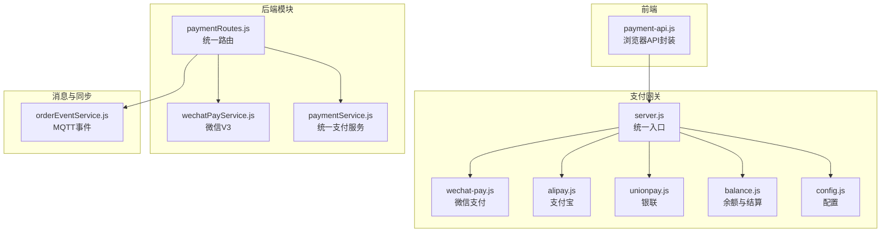
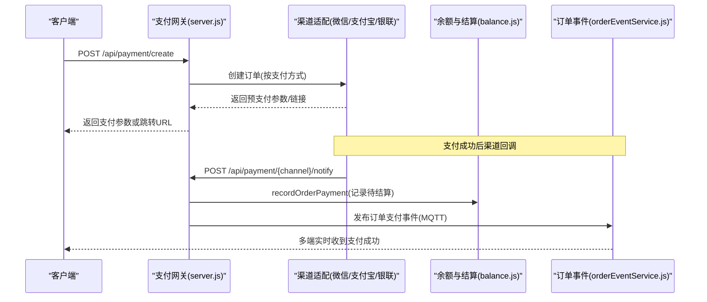
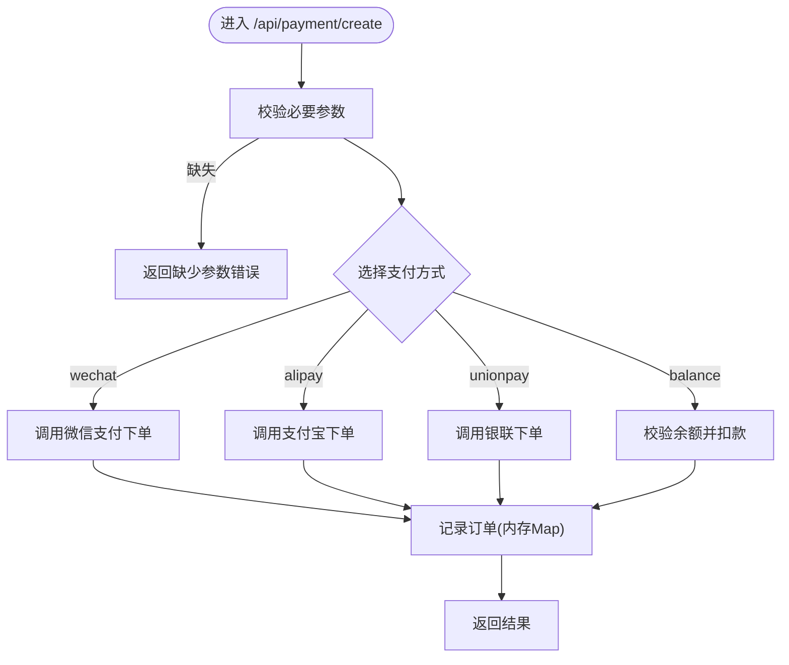
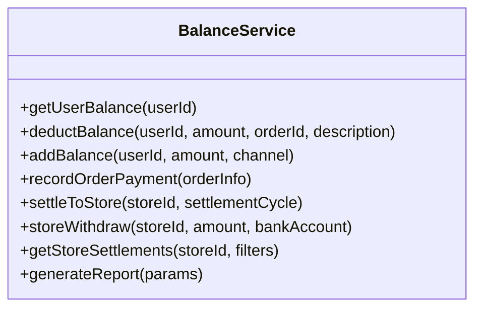
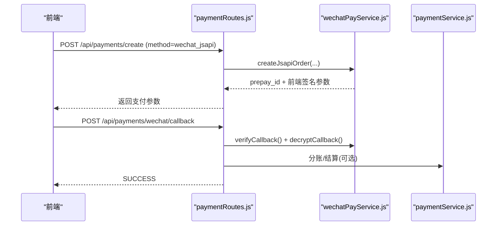
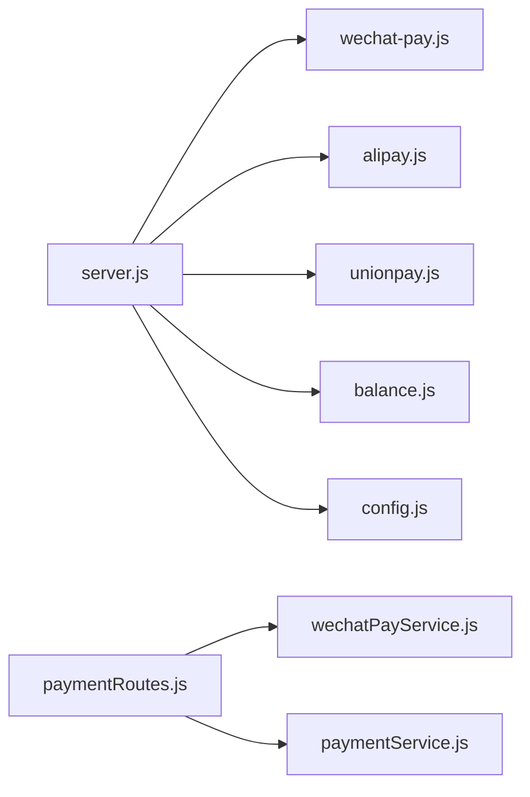

# 支付结算系统

<cite>
**本文引用的文件**   
- [server.js](file://api/payment-server/server.js)
- [config.js](file://api/payment-server/config.js)
- [wechat-pay.js](file://api/payment-server/wechat-pay.js)
- [alipay.js](file://api/payment-server/alipay.js)
- [unionpay.js](file://api/payment-server/unionpay.js)
- [balance.js](file://api/payment-server/balance.js)
- [settlement.js](file://api/payment-server/settlement.js)
- [payment-api.js](file://api/payment-api.js)
- [paymentService.js](file://backend/modules/common/services/paymentService.js)
- [paymentRoutes.js](file://backend/modules/common/routes/paymentRoutes.js)
- [wechatPayService.js](file://backend/modules/common/services/wechatPayService.js)
- [orderEventService.js](file://backend/services/orderEventService.js)
- [test-payment.js](file://api/payment-server/test-payment.js)
- [PAYMENT_SYSTEM.md](file://PAYMENT_SYSTEM.md)
</cite>

## 目录
1. [简介](#简介)
2. [项目结构](#项目结构)
3. [核心组件](#核心组件)
4. [架构总览](#架构总览)
5. [详细组件分析](#详细组件分析)
6. [依赖关系分析](#依赖关系分析)
7. [性能与可靠性](#性能与可靠性)
8. [故障排查指南](#故障排查指南)
9. [结论](#结论)
10. [附录：API接口规范](#附录api接口规范)

## 简介
本系统为干洗店提供统一支付与资金结算能力，支持微信支付、支付宝、银联、余额等多种支付方式；实现订单创建、支付确认、退款处理、分账结算（平台抽成、门店收益分配）、财务对账、安全签名验签、防重放、交易加密、MQTT状态同步、异常补偿与测试调试工具等完整链路。

## 项目结构
支付相关代码主要分布在以下位置：
- 独立支付网关服务：api/payment-server（Express 应用，聚合多支付渠道）
- 后端通用支付路由与服务：backend/modules/common（统一路由、微信V3服务、统一支付服务）
- 前端支付API封装：api/payment-api.js（浏览器端调用封装）
- 事件与实时同步：backend/services/orderEventService.js（基于MQTT发布订单事件）
- 文档与测试：PAYMENT_SYSTEM.md、api/payment-server/test-payment.js

图表来源
- [server.js:1-624](file://api/payment-server/server.js#L1-L624)
- [wechat-pay.js:1-314](file://api/payment-server/wechat-pay.js#L1-L314)
- [alipay.js:1-336](file://api/payment-server/alipay.js#L1-L336)
- [unionpay.js:1-501](file://api/payment-server/unionpay.js#L1-L501)
- [balance.js:1-524](file://api/payment-server/balance.js#L1-L524)
- [config.js:1-80](file://api/payment-server/config.js#L1-L80)
- [paymentRoutes.js:1-215](file://backend/modules/common/routes/paymentRoutes.js#L1-L215)
- [wechatPayService.js:1-396](file://backend/modules/common/services/wechatPayService.js#L1-L396)
- [paymentService.js:1-185](file://backend/modules/common/services/paymentService.js#L1-L185)
- [orderEventService.js:1-168](file://backend/services/orderEventService.js#L1-L168)
- [payment-api.js:1-427](file://api/payment-api.js#L1-L427)

章节来源
- [server.js:1-624](file://api/payment-server/server.js#L1-L624)
- [PAYMENT_SYSTEM.md:1-383](file://PAYMENT_SYSTEM.md#L1-L383)

## 核心组件
- 统一支付网关（server.js）
  - 统一入口 /api/payment/create，按 paymentMethod 分发至各渠道
  - 统一查询 /api/payment/query/:orderId、关闭 /api/payment/close/:orderId
  - 回调处理：微信、支付宝、银联
  - 账户余额与结算接口：/api/balance/*、/api/settlement/*
- 渠道适配层
  - 微信支付（wechat-pay.js）：统一下单、查询、关闭、退款、签名与小程序参数生成
  - 支付宝（alipay.js）：网页/手机网站下单、查询、关闭、退款、RSA2签名与验签
  - 银联（unionpay.js）：网关表单支付、查询、撤销、退款、SHA256签名
  - 余额（balance.js）：用户余额、交易流水、门店待结算、结算入账、提现、报表
- 后端统一路由与服务
  - paymentRoutes.js：认证后创建支付、查询、微信回调、退款
  - wechatPayService.js：微信V3 JSAPI/APP/H5下单、查询、关闭、退款、回调验签与解密
  - paymentService.js：统一支付服务与分账策略（干洗、回收、租赁、押金）
- 实时同步
  - orderEventService.js：通过MQTT发布订单事件（支付成功、取消、状态变更），供多端订阅
- 前端封装
  - payment-api.js：浏览器端统一调用封装（预留真实接口，当前模拟）

章节来源
- [server.js:1-624](file://api/payment-server/server.js#L1-L624)
- [wechat-pay.js:1-314](file://api/payment-server/wechat-pay.js#L1-L314)
- [alipay.js:1-336](file://api/payment-server/alipay.js#L1-L336)
- [unionpay.js:1-501](file://api/payment-server/unionpay.js#L1-L501)
- [balance.js:1-524](file://api/payment-server/balance.js#L1-L524)
- [paymentRoutes.js:1-215](file://backend/modules/common/routes/paymentRoutes.js#L1-L215)
- [wechatPayService.js:1-396](file://backend/modules/common/services/wechatPayService.js#L1-L396)
- [paymentService.js:1-185](file://backend/modules/common/services/paymentService.js#L1-L185)
- [orderEventService.js:1-168](file://backend/services/orderEventService.js#L1-L168)
- [payment-api.js:1-427](file://api/payment-api.js#L1-L427)

## 架构总览
支付网关作为统一入口，屏蔽多渠道差异；回调统一落库并触发结算；结算系统按规则计算平台服务费与门店可结算金额；MQTT用于跨端实时同步订单状态。

图表来源
- [server.js:42-174](file://api/payment-server/server.js#L42-L174)
- [server.js:312-451](file://api/payment-server/server.js#L312-L451)
- [balance.js:244-283](file://api/payment-server/balance.js#L244-L283)
- [orderEventService.js:77-144](file://backend/services/orderEventService.js#L77-L144)

## 详细组件分析

### 统一支付网关（server.js）
- 职责
  - 统一创建/查询/关闭支付订单
  - 统一处理各渠道回调
  - 暴露余额与结算接口
- 关键流程
  - 创建支付：根据 paymentMethod 分发到对应渠道；余额支付直接扣款并记录
  - 查询支付：按渠道查询最终状态并更新本地订单
  - 关闭订单：按渠道发起关闭
  - 回调处理：校验签名→更新订单状态→记录结算→可选通知
- 错误处理
  - 参数校验失败、渠道异常、回调签名失败均有明确返回

图表来源
- [server.js:42-174](file://api/payment-server/server.js#L42-L174)

章节来源
- [server.js:1-624](file://api/payment-server/server.js#L1-L624)

### 微信支付适配（wechat-pay.js）
- 功能
  - 统一下单（JSAPI/NATIVE/MWEB）、查询、关闭、退款
  - MD5签名与小程序调起参数生成
  - 回调签名验证
- 注意
  - 生产环境退款需双向SSL证书；当前示例未启用证书加载

章节来源
- [wechat-pay.js:1-314](file://api/payment-server/wechat-pay.js#L1-L314)

### 支付宝适配（alipay.js）
- 功能
  - 电脑网站/手机网站下单、查询、关闭、退款
  - RSA2签名与验签
- 注意
  - 时间格式化扩展已内置；确保私钥/公钥配置正确

章节来源
- [alipay.js:1-336](file://api/payment-server/alipay.js#L1-L336)

### 银联适配（unionpay.js）
- 功能
  - 网关表单支付、查询、撤销、退款
  - SHA256签名与回调验签
- 注意
  - 银行卡信息加密为Base64占位，生产应使用银联公钥加密

章节来源
- [unionpay.js:1-501](file://api/payment-server/unionpay.js#L1-L501)

### 余额与结算（balance.js）
- 功能
  - 用户余额查询、充值、消费扣减与流水记录
  - 门店待结算、结算入账、冻结与提现、财务报表
- 分账逻辑
  - 订单完成后按平台费率计算平台服务费与门店结算金额，写入待结算
  - 定期结算将待结算转入可用余额
  - 提现时冻结可用余额并异步完成

图表来源
- [balance.js:1-524](file://api/payment-server/balance.js#L1-L524)

章节来源
- [balance.js:1-524](file://api/payment-server/balance.js#L1-L524)

### 后端统一路由与服务（paymentRoutes.js / wechatPayService.js / paymentService.js）
- paymentRoutes.js
  - 认证后创建支付（微信JSAPI/APP/H5、余额）
  - 查询支付状态
  - 微信回调验签与解密，更新订单状态并发送通知
  - 申请退款并更新订单状态
- wechatPayService.js
  - 微信V3 API：JSAPI/APP/H5下单、查询、关闭、退款
  - 回调验签与AES-GCM解密
- paymentService.js
  - 统一支付服务与分账策略（干洗、回收、租赁、押金）

图表来源
- [paymentRoutes.js:13-97](file://backend/modules/common/routes/paymentRoutes.js#L13-L97)
- [paymentRoutes.js:121-171](file://backend/modules/common/routes/paymentRoutes.js#L121-L171)
- [wechatPayService.js:101-164](file://backend/modules/common/services/wechatPayService.js#L101-L164)
- [paymentService.js:96-173](file://backend/modules/common/services/paymentService.js#L96-L173)

章节来源
- [paymentRoutes.js:1-215](file://backend/modules/common/routes/paymentRoutes.js#L1-L215)
- [wechatPayService.js:1-396](file://backend/modules/common/services/wechatPayService.js#L1-L396)
- [paymentService.js:1-185](file://backend/modules/common/services/paymentService.js#L1-L185)

### 订单事件与MQTT同步（orderEventService.js）
- 主题设计
  - dryclean/orders/{storeId}/update：门店级
  - dryclean/orders/all/update：全局
- 事件类型
  - order_created、order_paid、order_cancelled、order_status_changed
- 作用
  - 支付成功后由网关或服务端发布事件，多端（小程序、M端、Admin）订阅实时更新

章节来源
- [orderEventService.js:1-168](file://backend/services/orderEventService.js#L1-L168)

### 前端支付API封装（payment-api.js）
- 提供统一的支付方式列表与创建/查询/退款/余额操作封装
- 当前为模拟实现，便于前端联调；后续替换为真实后端接口

章节来源
- [payment-api.js:1-427](file://api/payment-api.js#L1-L427)

## 依赖关系分析
- server.js 依赖：
  - wechat-pay.js、alipay.js、unionpay.js、balance.js、posApi、memberCardRoutes、config
- balance.js 内部维护用户余额、交易流水、门店结算与提现的内存存储
- paymentRoutes.js 依赖 wechatPayService.js 与 paymentService.js
- orderEventService.js 延迟加载 MQTT 客户端与通知中心

图表来源
- [server.js:1-624](file://api/payment-server/server.js#L1-L624)
- [paymentRoutes.js:1-215](file://backend/modules/common/routes/paymentRoutes.js#L1-L215)

章节来源
- [server.js:1-624](file://api/payment-server/server.js#L1-L624)
- [paymentRoutes.js:1-215](file://backend/modules/common/routes/paymentRoutes.js#L1-L215)

## 性能与可靠性
- 幂等与防重放
  - 各渠道回调均进行签名验证；建议结合 out_trade_no 做去重处理
- 重试与补偿
  - 查询接口可用于对账补偿；建议增加定时任务轮询未决订单
- 并发与一致性
  - 余额扣减与结算入账需保证原子性；生产建议使用数据库事务
- 可扩展性
  - 新增支付方式仅需在统一入口添加分支并实现渠道适配类

[本节为通用指导，不直接分析具体文件]

## 故障排查指南
- 常见错误
  - 签名验证失败：检查密钥、排序与编码
  - 回调未到达：检查公网可达性与回调URL配置
  - 余额不足：检查用户余额与冻结金额
- 定位方法
  - 健康检查：GET /api/health
  - 查看测试数据：GET /api/test/stats（测试服务器）
  - 日志：查看服务端控制台输出与PM2日志

章节来源
- [server.js:582-592](file://api/payment-server/server.js#L582-L592)
- [test-payment.js:99-120](file://api/payment-server/test-payment.js#L99-L120)

## 结论
本支付结算系统以统一网关为核心，屏蔽多渠道差异，提供完整的创建、查询、关闭、退款与结算能力；配合MQTT实现多端实时同步；具备完善的签名验签与基础安全机制。生产部署需完善证书、回调、对账与补偿策略，确保资金流转一致性与可审计性。

[本节为总结，不直接分析具体文件]

## 附录：API接口规范

### 统一支付接口（支付网关）
- 创建支付
  - 路径：POST /api/payment/create
  - 请求体字段：orderId、amount、subject、body、paymentMethod、userId、openid、returnUrl、clientIp
  - 响应：success、data（含各渠道所需参数）
- 查询支付
  - 路径：GET /api/payment/query/:orderId
  - 响应：success、data（含tradeState等）
- 关闭订单
  - 路径：POST /api/payment/close/:orderId
  - 响应：success

章节来源
- [server.js:42-174](file://api/payment-server/server.js#L42-L174)
- [server.js:180-240](file://api/payment-server/server.js#L180-L240)
- [server.js:246-304](file://api/payment-server/server.js#L246-L304)

### 渠道回调接口（支付网关）
- 微信支付回调
  - 路径：POST /api/payment/wechat/notify
  - 说明：XML格式，需验签；成功返回SUCCESS
- 支付宝回调
  - 路径：POST /api/payment/alipay/notify
  - 说明：表单/JSON，需RSA2验签
- 银联回调
  - 路径：POST /api/payment/unionpay/notify
  - 说明：表单，需SHA256验签

章节来源
- [server.js:312-350](file://api/payment-server/server.js#L312-L350)
- [server.js:366-402](file://api/payment-server/server.js#L366-L402)
- [server.js:417-451](file://api/payment-server/server.js#L417-L451)

### 余额与结算接口（支付网关）
- 获取用户余额
  - 路径：GET /api/balance/:userId
- 获取用户交易记录
  - 路径：GET /api/balance/:userId/transactions?page=&limit=
- 余额充值
  - 路径：POST /api/balance/recharge
- 门店账户信息
  - 路径：GET /api/settlement/store/:storeId
- 门店结算记录
  - 路径：GET /api/settlement/store/:storeId/records?status=&startDate=&endDate=
- 发起结算
  - 路径：POST /api/settlement/store/:storeId/settle?settlementCycle=
- 门店提现
  - 路径：POST /api/settlement/store/:storeId/withdraw
  - 请求体：amount、bankAccount
- 财务报表
  - 路径：POST /api/settlement/report
  - 请求体：startDate、endDate、storeId、type

章节来源
- [server.js:466-578](file://api/payment-server/server.js#L466-L578)
- [balance.js:244-520](file://api/payment-server/balance.js#L244-L520)

### 后端统一路由接口（后端模块）
- 创建支付
  - 路径：POST /api/payments/create（需鉴权）
  - method 支持：wechat_jsapi、wechat_app、wechat_h5、balance
- 查询支付
  - 路径：GET /api/payments/query/:orderId（需鉴权）
- 微信回调
  - 路径：POST /api/payments/wechat/callback
- 申请退款
  - 路径：POST /api/payments/refund（需鉴权）

章节来源
- [paymentRoutes.js:13-97](file://backend/modules/common/routes/paymentRoutes.js#L13-L97)
- [paymentRoutes.js:100-118](file://backend/modules/common/routes/paymentRoutes.js#L100-L118)
- [paymentRoutes.js:121-171](file://backend/modules/common/routes/paymentRoutes.js#L121-L171)
- [paymentRoutes.js:174-212](file://backend/modules/common/routes/paymentRoutes.js#L174-L212)

### 前端支付API封装（浏览器端）
- 获取支付方式列表：getPaymentMethods()
- 创建微信支付订单：createWechatPay(params)
- 余额支付：payWithBalance(params)
- 创建支付宝订单：createAlipayOrder(params)
- 创建银联订单：createUnionpayOrder(params)
- 查询支付状态：queryPayStatus(orderId)
- 申请退款：applyRefund(params)
- 获取用户余额：getUserBalance()
- 充值余额：rechargeBalance(params)

章节来源
- [payment-api.js:58-422](file://api/payment-api.js#L58-L422)

### 配置与环境变量（支付网关）
- 服务器端口与主机：server.port、server.host
- 微信支付：miniapp/h5 的 appId、mchId、apiKey、notifyUrl、apiBaseUrl
- 支付宝：appId、privateKey、alipayPublicKey、gateway、notifyUrl
- 银联：merchantId、signCertPath、signCertPwd、notifyUrl、apiUrl
- 平台：serviceFeeRate、settlementCycle、minWithdrawAmount

章节来源
- [config.js:1-80](file://api/payment-server/config.js#L1-L80)

### 测试与调试
- 启动测试服务器与运行测试脚本
  - 参考：api/payment-server/test-payment.js
- 常用测试项
  - 健康检查、查看测试数据、余额充值、各渠道支付、结算查询、提现、批量支付

章节来源
- [test-payment.js:1-554](file://api/payment-server/test-payment.js#L1-L554)
- [PAYMENT_SYSTEM.md:256-275](file://PAYMENT_SYSTEM.md#L256-L275)