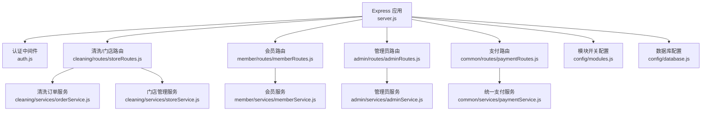
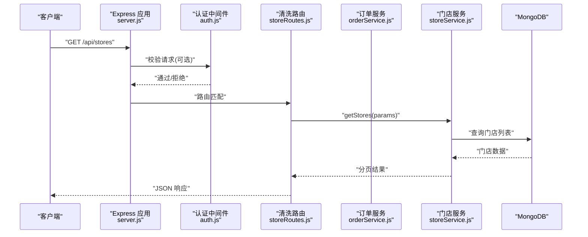
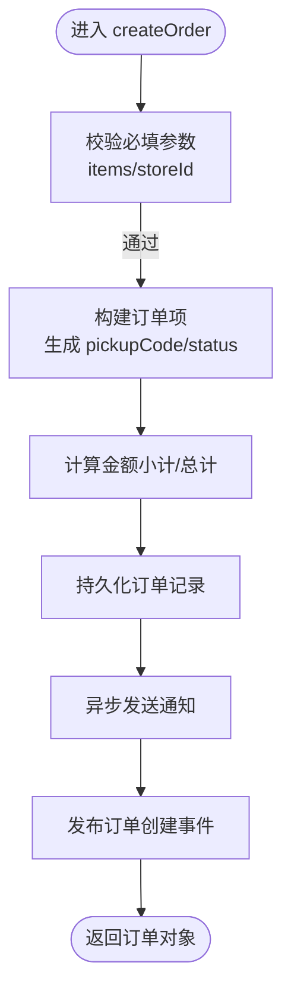
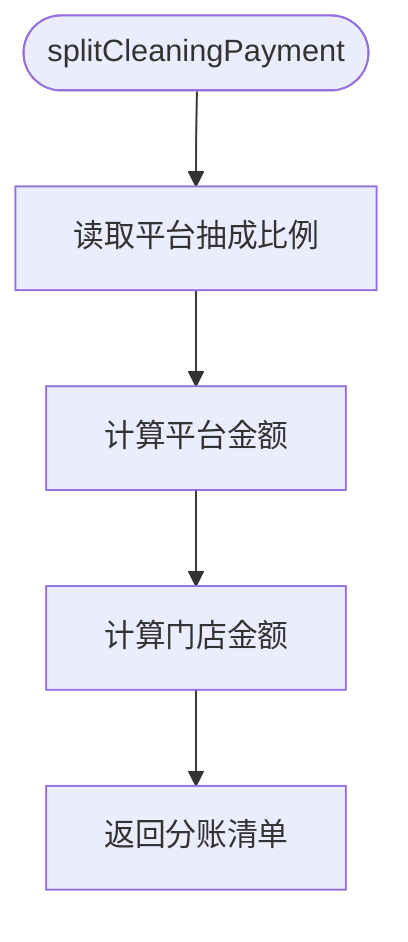
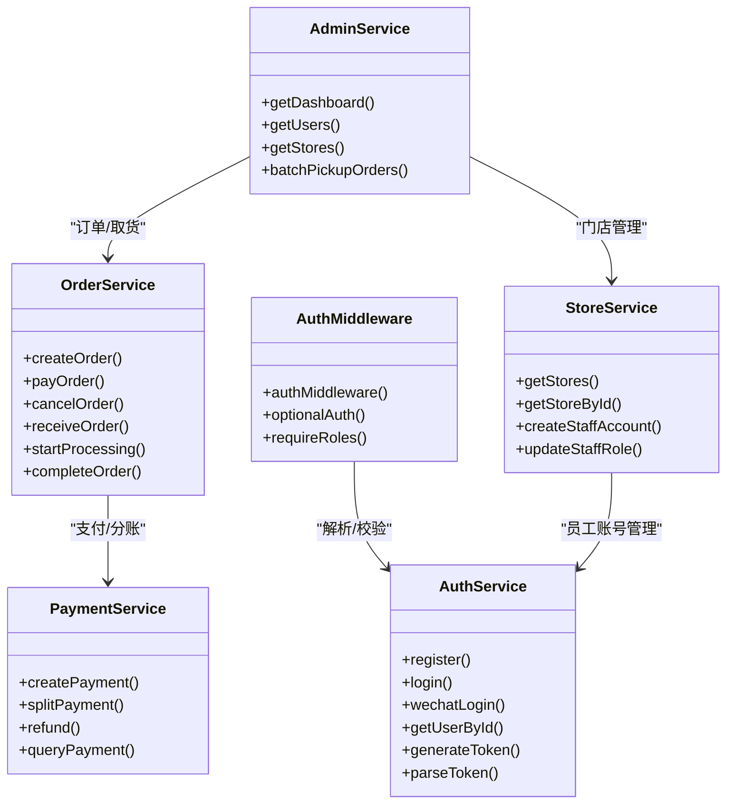

# 核心业务模块

<cite>
**本文引用的文件**   
- [backend/server.js](file://backend/server.js)
- [backend/config/modules.js](file://backend/config/modules.js)
- [backend/config/database.js](file://backend/config/database.js)
- [backend/modules/common/middlewares/auth.js](file://backend/modules/common/middlewares/auth.js)
- [backend/modules/cleaning/routes/storeRoutes.js](file://backend/modules/cleaning/routes/storeRoutes.js)
- [backend/modules/cleaning/services/orderService.js](file://backend/modules/cleaning/services/orderService.js)
- [backend/modules/cleaning/services/storeService.js](file://backend/modules/cleaning/services/storeService.js)
- [backend/modules/member/routes/memberRoutes.js](file://backend/modules/member/routes/memberRoutes.js)
- [backend/modules/member/services/memberService.js](file://backend/modules/member/services/memberService.js)
- [backend/modules/admin/routes/adminRoutes.js](file://backend/modules/admin/routes/adminRoutes.js)
- [backend/modules/admin/services/adminService.js](file://backend/modules/admin/services/adminService.js)
- [backend/modules/common/services/paymentService.js](file://backend/modules/common/services/paymentService.js)
</cite>

## 目录
1. [简介](#简介)
2. [项目结构](#项目结构)
3. [核心组件](#核心组件)
4. [架构总览](#架构总览)
5. [详细组件分析](#详细组件分析)
6. [依赖关系分析](#依赖关系分析)
7. [性能与扩展性](#性能与扩展性)
8. [故障排查指南](#故障排查指南)
9. [结论](#结论)
10. [附录：接口与数据模型速查](#附录接口与数据模型速查)

## 简介
本文件聚焦干洗店管理系统后端的核心业务模块，围绕 cleaning（干洗服务）、member（会员服务）、admin（后台管理）、payment（支付结算）四大模块进行系统化说明。文档从职责边界、接口定义、数据模型、业务流程、模块间协作模式、配置与扩展点等维度展开，并提供可视化架构图与流程图，帮助开发者快速理解并正确集成各模块能力。

## 项目结构
系统采用 Express 模块化路由与服务分层组织，入口 server.js 统一挂载各模块路由，并通过中间件实现认证与权限控制。核心模块位于 backend/modules 下，按功能划分 routes 与 services；公共能力（认证、支付、通知、配送等）集中在 common 子模块中。

图示来源
- [backend/server.js:96-151](file://backend/server.js#L96-L151)
- [backend/config/modules.js:1-203](file://backend/config/modules.js#L1-L203)
- [backend/config/database.js:1-65](file://backend/config/database.js#L1-L65)

章节来源
- [backend/server.js:1-702](file://backend/server.js#L1-L702)
- [backend/config/modules.js:1-203](file://backend/config/modules.js#L1-L203)
- [backend/config/database.js:1-65](file://backend/config/database.js#L1-L65)

## 核心组件
- 认证与授权中间件：提供登录态校验、可选认证、角色校验，支持开发环境 mock token。
- 清洗模块：负责门店查询与管理、订单生命周期管理（创建、支付、入库、处理、完成、取件等）。
- 会员模块：提供会员信息查询（等级、积分、折扣），兼容未登录场景返回模拟数据。
- 管理后台：提供仪表盘、用户/门店/订单管理、模块配置、灯条控制、配送管理等。
- 支付服务：统一封装多支付方式与分账逻辑，支持干洗、回收、租赁等多品类分账策略。

章节来源
- [backend/modules/common/middlewares/auth.js:1-207](file://backend/modules/common/middlewares/auth.js#L1-L207)
- [backend/modules/cleaning/services/orderService.js:1-800](file://backend/modules/cleaning/services/orderService.js#L1-L800)
- [backend/modules/cleaning/services/storeService.js:1-376](file://backend/modules/cleaning/services/storeService.js#L1-L376)
- [backend/modules/member/services/memberService.js:1-134](file://backend/modules/member/services/memberService.js#L1-L134)
- [backend/modules/admin/services/adminService.js:1-800](file://backend/modules/admin/services/adminService.js#L1-L800)
- [backend/modules/common/services/paymentService.js:1-185](file://backend/modules/common/services/paymentService.js#L1-L185)

## 架构总览
系统以 Express 为 HTTP 层，通过中间件进行鉴权与权限控制，路由分发到对应模块的 service 层执行具体业务逻辑。数据持久化使用 MongoDB（Mongoose），同时支持 MySQL 配置。模块开关由 config/modules.js 统一管理，便于灰度与特性开关。

图示来源
- [backend/server.js:96-151](file://backend/server.js#L96-L151)
- [backend/modules/cleaning/routes/storeRoutes.js:1-194](file://backend/modules/cleaning/routes/storeRoutes.js#L1-L194)
- [backend/modules/cleaning/services/storeService.js:1-376](file://backend/modules/cleaning/services/storeService.js#L1-L376)

## 详细组件分析

### 清洗模块（cleaning）
职责边界
- 门店管理：门店列表、详情、服务项、员工账户与角色管理、老板门店列表。
- 订单管理：订单创建、查询、支付、取消、删除（软删）、入库、开始处理、完成清洗、状态流转与事件发布。

关键接口（示例）
- GET /api/stores：获取门店列表（支持分页、城市/区域/关键词、地理位置搜索）
- GET /api/stores/:id：获取门店详情
- GET /api/stores/:id/services：获取门店服务项
- POST /api/stores：创建门店（需 admin/store_owner）
- PUT /api/stores/:id：更新门店信息（需 admin/store_owner）
- GET /api/stores/owner/my：获取我的门店（需 store_owner）
- POST /api/stores/:id/staff/create：创建门店员工账户（需 store_owner/admin）
- GET /api/stores/:id/staff/detail：获取门店员工详细信息（需 store_staff/store_owner/admin）
- DELETE /api/stores/:id/staff/:staffId：移除员工（需 store_owner/admin）
- PUT /api/stores/:id/staff/:staffId/role：更新员工角色（需 store_owner/admin）

数据模型要点
- 门店 Store：编号、名称、地址、地理坐标、营业时间、服务项、状态、图片、评分、订单数、所有者、员工列表、连锁字段、终端结算相关字段。
- 订单 Order：订单号、类型、分类ID、用户、门店、物品明细、金额、配送信息、快递信息、支付信息、清洗进度、状态及历史、软删除标记等。

业务流程（订单创建）

图示来源
- [backend/modules/cleaning/services/orderService.js:177-291](file://backend/modules/cleaning/services/orderService.js#L177-L291)

章节来源
- [backend/modules/cleaning/routes/storeRoutes.js:1-194](file://backend/modules/cleaning/routes/storeRoutes.js#L1-L194)
- [backend/modules/cleaning/services/storeService.js:1-376](file://backend/modules/cleaning/services/storeService.js#L1-L376)
- [backend/modules/cleaning/services/orderService.js:1-800](file://backend/modules/cleaning/services/orderService.js#L1-L800)

### 会员模块（member）
职责边界
- 提供当前用户的会员信息（等级、积分、折扣、到期时间等）。
- 支持可选认证：有 token 返回真实数据，无 token 返回模拟数据兜底。

关键接口（示例）
- GET /api/member/info：获取会员信息（可选认证）

数据模型要点
- 基于 User 模型读取基础信息，结合 creditScore 计算等级与折扣。
- 若数据库不可用或 userId 非合法 ObjectId，返回模拟数据以保证前端体验。

章节来源
- [backend/modules/member/routes/memberRoutes.js:1-48](file://backend/modules/member/routes/memberRoutes.js#L1-L48)
- [backend/modules/member/services/memberService.js:1-134](file://backend/modules/member/services/memberService.js#L1-L134)

### 管理后台（admin）
职责边界
- 仪表盘统计：用户、订单、门店、收入、趋势等聚合指标。
- 用户/门店/订单管理：列表、详情、状态变更、批量导入等。
- 模块与系统设置：模块开关、支付分账比例等（演示模式）。
- 一键取货与智能灯条：批量完成取货、灯条亮灭控制、MQTT 连接检查。
- 配送管理：配送订单列表与创建。

关键接口（示例）
- GET /api/admin/dashboard：仪表盘数据
- GET /api/admin/users：用户列表
- PUT /api/admin/users/:id/status：更新用户状态
- GET /api/admin/stores：门店列表
- POST /api/admin/stores/import：批量导入门店
- GET /api/admin/orders：订单列表
- POST /api/admin/store/:storeId/batch-pickup：一键取货
- POST /api/admin/store/:storeId/light-up/off/all-off：灯条控制
- GET /api/admin/store/:storeId/mqtt-config：MQTT 配置
- GET /api/admin/terminals：在线终端列表

章节来源
- [backend/modules/admin/routes/adminRoutes.js:1-800](file://backend/modules/admin/routes/adminRoutes.js#L1-L800)
- [backend/modules/admin/services/adminService.js:1-800](file://backend/modules/admin/services/adminService.js#L1-L800)

### 支付结算（payment）
职责边界
- 统一支付入口：支持微信、支付宝、银联、余额等多种方式。
- 分账处理：根据订单类型（干洗、回收、租赁、押金）计算平台与门店/品牌/所有者的分账比例。
- 退款与查询：提供退款与支付查询接口（当前为模拟实现）。

关键接口（示例）
- POST /api/payment/create：创建支付订单（统一入口）
- GET /api/payment/query/:orderId：查询支付状态
- POST /api/payment/callback：支付回调
- GET /api/balance/:userId：查询余额
- POST /api/balance/recharge：余额充值

分账流程（干洗订单）

图示来源
- [backend/modules/common/services/paymentService.js:122-133](file://backend/modules/common/services/paymentService.js#L122-L133)

章节来源
- [backend/modules/common/services/paymentService.js:1-185](file://backend/modules/common/services/paymentService.js#L1-L185)
- [backend/server.js:398-523](file://backend/server.js#L398-L523)

## 依赖关系分析
- 路由层依赖中间件：所有受保护路由均经过 authMiddleware 与 requireRoles 校验。
- 服务层依赖配置：支付服务依赖 modules.js 中的 payment 配置；模块开关由 modules.js 控制。
- 服务层依赖数据库：订单、门店、用户等实体通过 Mongoose 操作 MongoDB。
- 跨模块调用：订单服务在关键节点调用通知服务与事件服务，用于实时同步与消息推送。

图示来源
- [backend/modules/common/middlewares/auth.js:1-207](file://backend/modules/common/middlewares/auth.js#L1-L207)
- [backend/modules/cleaning/services/orderService.js:1-800](file://backend/modules/cleaning/services/orderService.js#L1-L800)
- [backend/modules/cleaning/services/storeService.js:1-376](file://backend/modules/cleaning/services/storeService.js#L1-L376)
- [backend/modules/common/services/paymentService.js:1-185](file://backend/modules/common/services/paymentService.js#L1-L185)
- [backend/modules/admin/services/adminService.js:1-800](file://backend/modules/admin/services/adminService.js#L1-L800)

章节来源
- [backend/modules/common/middlewares/auth.js:1-207](file://backend/modules/common/middlewares/auth.js#L1-L207)
- [backend/modules/cleaning/services/orderService.js:1-800](file://backend/modules/cleaning/services/orderService.js#L1-L800)
- [backend/modules/cleaning/services/storeService.js:1-376](file://backend/modules/cleaning/services/storeService.js#L1-L376)
- [backend/modules/common/services/paymentService.js:1-185](file://backend/modules/common/services/paymentService.js#L1-L185)
- [backend/modules/admin/services/adminService.js:1-800](file://backend/modules/admin/services/adminService.js#L1-L800)

## 性能与扩展性
- 查询优化：门店与订单查询广泛使用索引（如 storeNo、status、createdAt、userId、location 2dsphere），分页与 lean 减少序列化开销。
- 并发与超时：会员服务对数据库查询增加超时保护，避免慢查询阻塞。
- 可扩展点：
  - 模块开关：通过 config/modules.js 启用/禁用业务模块与功能特性。
  - 支付方式扩展：PaymentService 的 createPayment 方法可按 method 分支新增支付渠道。
  - 分账策略扩展：splitPayment 按 orderType 分支扩展新业务类型的分账规则。
  - 中间件扩展：auth.js 可继续添加新的角色或环境特定逻辑。

[本节为通用指导，不直接分析具体文件]

## 故障排查指南
- 认证失败
  - 现象：401 未登录或登录过期。
  - 排查：确认 Authorization 头格式为 Bearer <token>；检查开发环境是否使用了 dev-admin-/dev-chain-/mock_token_ 前缀。
  - 参考路径：[backend/modules/common/middlewares/auth.js:10-136](file://backend/modules/common/middlewares/auth.js#L10-L136)

- 权限不足
  - 现象：403 权限不足。
  - 排查：确认用户 roles 包含所需角色（如 admin、store_owner、store_staff）。
  - 参考路径：[backend/modules/common/middlewares/auth.js:188-201](file://backend/modules/common/middlewares/auth.js#L188-L201)

- 订单不存在或无权查看
  - 现象：404 或 403。
  - 排查：确认传入 ID 是 _id 还是 orderNo；检查用户角色与门店归属。
  - 参考路径：[backend/modules/cleaning/services/orderService.js:395-443](file://backend/modules/cleaning/services/orderService.js#L395-L443)

- 支付创建失败
  - 现象：返回错误信息。
  - 排查：检查必要参数 orderId/amount/paymentMethod；确认支付方式已配置或未触发不支持分支。
  - 参考路径：[backend/server.js:411-485](file://backend/server.js#L411-L485)

章节来源
- [backend/modules/common/middlewares/auth.js:1-207](file://backend/modules/common/middlewares/auth.js#L1-L207)
- [backend/modules/cleaning/services/orderService.js:395-443](file://backend/modules/cleaning/services/orderService.js#L395-L443)
- [backend/server.js:411-485](file://backend/server.js#L411-L485)

## 结论
本系统通过清晰的模块划分与中间件机制，实现了清洗、会员、管理与支付四大核心能力的解耦与协作。订单生命周期完善、支付分账灵活、管理后台功能全面，具备良好的扩展性与可维护性。建议在实际生产中完善支付回调与对账、引入缓存与消息队列以提升吞吐与一致性，并持续完善监控与告警体系。

[本节为总结，不直接分析具体文件]

## 附录：接口与数据模型速查

### 清洗模块接口摘要
- 门店
  - GET /api/stores
  - GET /api/stores/:id
  - GET /api/stores/:id/services
  - POST /api/stores
  - PUT /api/stores/:id
  - GET /api/stores/owner/my
  - POST /api/stores/:id/staff/create
  - GET /api/stores/:id/staff/detail
  - DELETE /api/stores/:id/staff/:staffId
  - PUT /api/stores/:id/staff/:staffId/role
- 订单（由 orderService 提供能力，常见入口见 server.js 与 cleaning 路由）
  - 创建、支付、取消、删除、入库、处理、完成等

章节来源
- [backend/modules/cleaning/routes/storeRoutes.js:1-194](file://backend/modules/cleaning/routes/storeRoutes.js#L1-L194)
- [backend/modules/cleaning/services/orderService.js:1-800](file://backend/modules/cleaning/services/orderService.js#L1-L800)

### 会员模块接口摘要
- GET /api/member/info

章节来源
- [backend/modules/member/routes/memberRoutes.js:1-48](file://backend/modules/member/routes/memberRoutes.js#L1-L48)

### 管理后台接口摘要
- 仪表盘：GET /api/admin/dashboard
- 用户：GET /api/admin/users、PUT /api/admin/users/:id/status
- 门店：GET /api/admin/stores、POST /api/admin/stores/import、PUT /api/admin/stores/:id
- 订单：GET /api/admin/orders
- 一键取货：POST /api/admin/store/:storeId/batch-pickup
- 灯条控制：POST /api/admin/store/:storeId/light-up/off/all-off
- MQTT 配置：GET /api/admin/store/:storeId/mqtt-config
- 终端列表：GET /api/admin/terminals

章节来源
- [backend/modules/admin/routes/adminRoutes.js:1-800](file://backend/modules/admin/routes/adminRoutes.js#L1-L800)

### 支付接口摘要
- POST /api/payment/create
- GET /api/payment/query/:orderId
- POST /api/payment/callback
- GET /api/balance/:userId
- POST /api/balance/recharge

章节来源
- [backend/server.js:398-523](file://backend/server.js#L398-L523)
- [backend/modules/common/services/paymentService.js:1-185](file://backend/modules/common/services/paymentService.js#L1-L185)

### 数据模型要点
- Store（门店）
  - 关键字段：storeNo、name、address、location、phone、businessHours、services、status、images、rating、orderCount、ownerId、staffIds、chainId、storeType、terminalSettlementEnabled、settlementRatio
- Order（订单）
  - 关键字段：orderNo、orderType、categoryId、userId、storeId、customerPhone、customerName、items、amounts、delivery、courier、payment、cleaning、status、statusHistory、isDeleted、deletedAt、deletedBy
- User（用户）
  - 关键字段：userNo、phone、password、openid、name、avatar、roles、storeId、status、creditScore、lastLoginAt、registrationSource、sourcePlatform、chainId、createdFrom

章节来源
- [backend/modules/cleaning/services/storeService.js:8-49](file://backend/modules/cleaning/services/storeService.js#L8-L49)
- [backend/modules/cleaning/services/orderService.js:33-151](file://backend/modules/cleaning/services/orderService.js#L33-L151)
- [backend/modules/common/services/authService.js:10-46](file://backend/modules/common/services/authService.js#L10-L46)