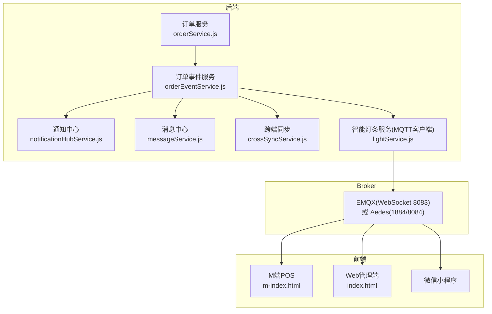
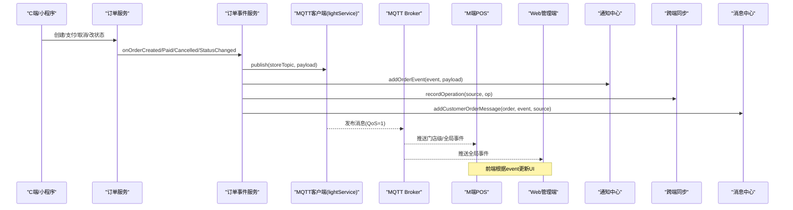
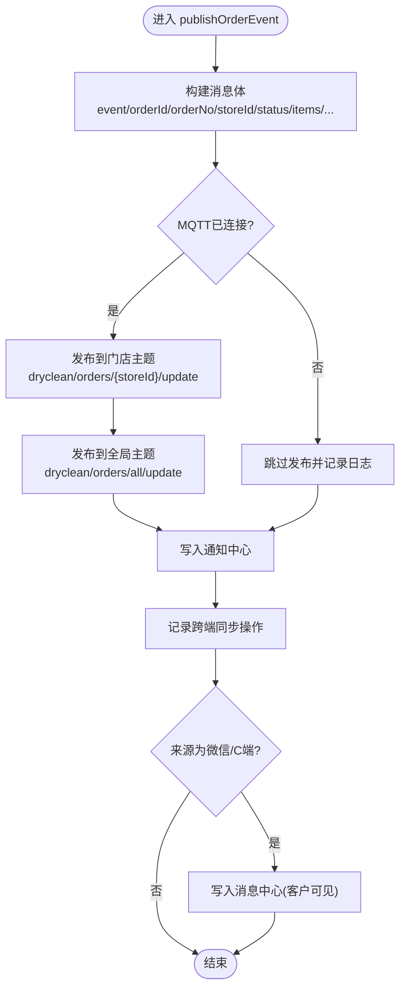
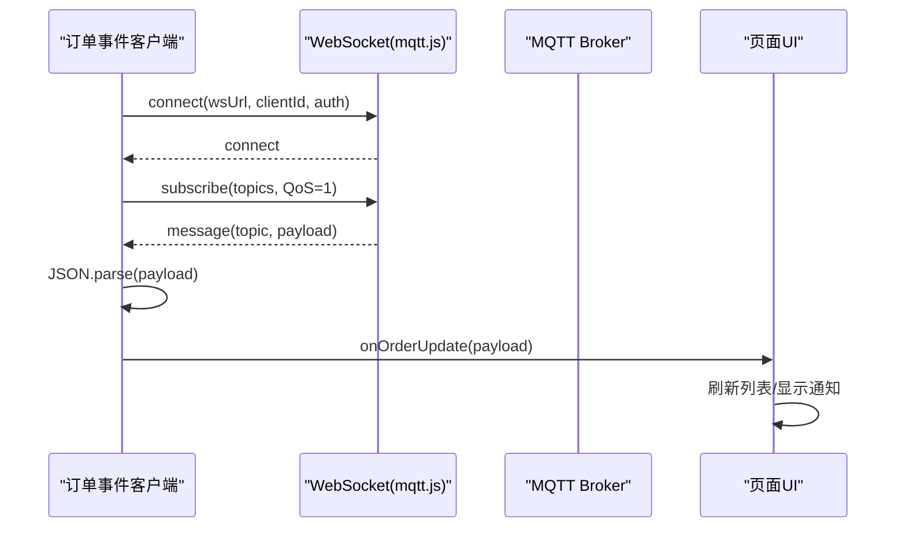
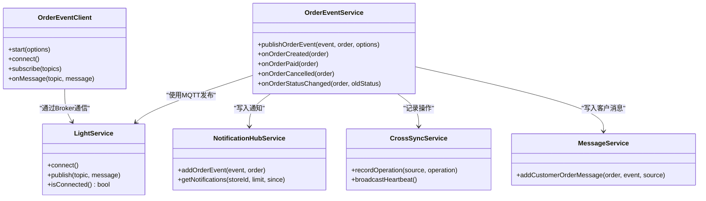

# 订单事件系统

<cite>
**本文引用的文件列表**
- [backend/services/orderEventService.js](file://backend/services/orderEventService.js)
- [js/order-event-client.js](file://js/order-event-client.js)
- [backend/services/lightService.js](file://backend/services/lightService.js)
- [backend/services/crossSyncService.js](file://backend/services/crossSyncService.js)
- [backend/services/messageService.js](file://backend/services/messageService.js)
- [backend/services/notificationHubService.js](file://backend/services/notificationHubService.js)
- [backend/modules/cleaning/services/orderService.js](file://backend/modules/cleaning/services/orderService.js)
- [m-index.html](file://m-index.html)
- [index.html](file://index.html)
- [backend/production-broker.js](file://backend/production-broker.js)
- [backend/start-mqtt.sh](file://backend/start-mqtt.sh)
- [backend/services/MQTT_DEPLOYMENT.md](file://backend/services/MQTT_DEPLOYMENT.md)
</cite>

## 目录
1. [简介](#简介)
2. [项目结构](#项目结构)
3. [核心组件](#核心组件)
4. [架构总览](#架构总览)
5. [详细组件分析](#详细组件分析)
6. [依赖关系分析](#依赖关系分析)
7. [性能与可靠性](#性能与可靠性)
8. [配置与部署指南](#配置与部署指南)
9. [调试与监控](#调试与监控)
10. [故障排查](#故障排查)
11. [结论](#结论)

## 简介
本文件系统化梳理干洗系统的“基于 MQTT 的订单事件驱动架构”，覆盖事件发布、订阅、路由、消费者处理逻辑、持久化与重试策略，以及配置部署与调试监控方法。重点围绕以下事件类型：order_created（订单创建）、order_paid（订单支付）、order_status_changed（状态变更）、order_cancelled（订单取消），并说明各端（M端POS、Web管理端、微信小程序）如何处理这些事件。

## 项目结构
- 后端服务层
  - 订单业务服务：负责订单生命周期与状态流转，并在关键节点触发事件发布
  - 订单事件服务：统一封装事件发布到 MQTT，并联动通知中心、跨端同步、消息中心
  - 智能灯条服务：MQTT 客户端封装，提供连接、发布、订阅能力
  - 通知中心：为 Admin 端提供轮询获取的通知集合
  - 消息中心：面向客户侧的消息记录（如下单、支付等）
  - 跨端同步：记录操作来源、广播在线心跳、避免本地回显
- 前端客户端
  - 订单事件客户端：浏览器端通过 WebSocket 连接 EMQX，订阅门店级与全局主题，支持断线重连与轮询降级
  - M端页面：接收实时事件并刷新订单列表、展示通知
  - Web管理端：订阅全局主题，聚合多门店数据
- 中间件与部署
  - 生产级 Broker（Aedes）或 EMQX（Docker 启动脚本与部署文档）
  - 环境变量与认证授权配置

图表来源
- [backend/services/orderEventService.js:1-168](file://backend/services/orderEventService.js#L1-L168)
- [backend/services/lightService.js:1-234](file://backend/services/lightService.js#L1-L234)
- [backend/services/notificationHubService.js:1-264](file://backend/services/notificationHubService.js#L1-L264)
- [backend/services/messageService.js:1-247](file://backend/services/messageService.js#L1-L247)
- [backend/services/crossSyncService.js:1-336](file://backend/services/crossSyncService.js#L1-L336)
- [js/order-event-client.js:1-270](file://js/order-event-client.js#L1-L270)
- [m-index.html:5466-5486](file://m-index.html#L5466-L5486)
- [index.html:5349-5372](file://index.html#L5349-L5372)

章节来源
- [backend/services/orderEventService.js:1-168](file://backend/services/orderEventService.js#L1-L168)
- [js/order-event-client.js:1-270](file://js/order-event-client.js#L1-L270)
- [backend/services/lightService.js:1-234](file://backend/services/lightService.js#L1-L234)
- [backend/services/crossSyncService.js:1-336](file://backend/services/crossSyncService.js#L1-L336)
- [backend/services/messageService.js:1-247](file://backend/services/messageService.js#L1-L247)
- [backend/services/notificationHubService.js:1-264](file://backend/services/notificationHubService.js#L1-L264)
- [backend/modules/cleaning/services/orderService.js:181-291](file://backend/modules/cleaning/services/orderService.js#L181-L291)
- [m-index.html:5466-5486](file://m-index.html#L5466-L5486)
- [index.html:5349-5372](file://index.html#L5349-L5372)

## 核心组件
- 订单事件服务：集中发布订单事件到 MQTT，同时写入通知中心、跨端同步与消息中心
- 订单事件客户端：浏览器端 MQTT over WebSocket 客户端，支持自动重连与轮询降级
- 智能灯条服务：后端 MQTT 客户端封装，提供连接健康检查与发布能力
- 通知中心：按门店/全局存储通知，供 Admin 端轮询
- 消息中心：面向客户的消息记录（下单、支付、取消等）
- 跨端同步：记录操作来源、广播在线心跳、避免本地回显

章节来源
- [backend/services/orderEventService.js:1-168](file://backend/services/orderEventService.js#L1-L168)
- [js/order-event-client.js:1-270](file://js/order-event-client.js#L1-L270)
- [backend/services/lightService.js:1-234](file://backend/services/lightService.js#L1-L234)
- [backend/services/notificationHubService.js:1-264](file://backend/services/notificationHubService.js#L1-L264)
- [backend/services/messageService.js:1-247](file://backend/services/messageService.js#L1-L247)
- [backend/services/crossSyncService.js:1-336](file://backend/services/crossSyncService.js#L1-L336)

## 架构总览
订单事件采用“发布-订阅”模式：
- 发布者：订单服务在关键业务点调用订单事件服务
- 传输层：MQTT Broker（EMQX 或 Aedes）
- 订阅者：M端POS、Web管理端、微信小程序等前端客户端
- 辅助通道：通知中心（轮询）、消息中心（客户可见）、跨端同步（操作溯源与去重）

图表来源
- [backend/modules/cleaning/services/orderService.js:181-291](file://backend/modules/cleaning/services/orderService.js#L181-L291)
- [backend/services/orderEventService.js:70-144](file://backend/services/orderEventService.js#L70-L144)
- [backend/services/lightService.js:197-205](file://backend/services/lightService.js#L197-L205)
- [backend/services/notificationHubService.js:88-127](file://backend/services/notificationHubService.js#L88-L127)
- [backend/services/crossSyncService.js:143-197](file://backend/services/crossSyncService.js#L143-L197)
- [backend/services/messageService.js:61-103](file://backend/services/messageService.js#L61-L103)
- [js/order-event-client.js:159-188](file://js/order-event-client.js#L159-L188)

## 详细组件分析

### 事件模型与主题设计
- 主题命名规范
  - 门店级：dryclean/orders/{storeId}/update
  - 全局级：dryclean/orders/all/update
  - 跨端同步：dryclean/sync/operation、dryclean/sync/heartbeat
- 消息体字段（示例）
  - event：事件类型
  - orderId / orderNo / storeId / userId
  - status / paymentMethod / totalAmount / items / customerName
  - createdFrom / _source / _oldStatus / updatedAt

章节来源
- [backend/services/orderEventService.js:14-15](file://backend/services/orderEventService.js#L14-L15)
- [backend/services/orderEventService.js:77-95](file://backend/services/orderEventService.js#L77-L95)
- [backend/services/crossSyncService.js:22-25](file://backend/services/crossSyncService.js#L22-L25)

### 事件类型与触发时机
- order_created（订单创建）
  - 触发点：订单服务创建订单后
  - 数据要点：包含订单号、门店、金额、物品清单、来源标识
- order_paid（订单支付）
  - 触发点：订单服务完成支付后
  - 数据要点：支付方式、交易ID、支付时间、总金额
- order_status_changed（状态变更）
  - 触发点：门店收件、开始处理、完成清洗等状态流转
  - 数据要点：新旧状态、更新时间
- order_cancelled（订单取消）
  - 触发点：用户或管理员取消订单
  - 数据要点：取消原因、是否退款

章节来源
- [backend/modules/cleaning/services/orderService.js:181-291](file://backend/modules/cleaning/services/orderService.js#L181-L291)
- [backend/modules/cleaning/services/orderService.js:521-564](file://backend/modules/cleaning/services/orderService.js#L521-L564)
- [backend/modules/cleaning/services/orderService.js:569-616](file://backend/modules/cleaning/services/orderService.js#L569-L616)
- [backend/modules/cleaning/services/orderService.js:667-715](file://backend/modules/cleaning/services/orderService.js#L667-L715)
- [backend/modules/cleaning/services/orderService.js:721-757](file://backend/modules/cleaning/services/orderService.js#L721-L757)
- [backend/modules/cleaning/services/orderService.js:763-800](file://backend/modules/cleaning/services/orderService.js#L763-L800)
- [backend/services/orderEventService.js:146-164](file://backend/services/orderEventService.js#L146-L164)

### 事件发布流程（代码级）

图表来源
- [backend/services/orderEventService.js:77-144](file://backend/services/orderEventService.js#L77-L144)
- [backend/services/notificationHubService.js:88-127](file://backend/services/notificationHubService.js#L88-L127)
- [backend/services/crossSyncService.js:143-197](file://backend/services/crossSyncService.js#L143-L197)
- [backend/services/messageService.js:61-103](file://backend/services/messageService.js#L61-L103)

章节来源
- [backend/services/orderEventService.js:77-144](file://backend/services/orderEventService.js#L77-L144)

### 事件订阅与消费（前端）
- M端POS
  - 订阅门店级与全局主题；收到事件后刷新订单列表，并对新订单/支付成功进行提示
- Web管理端
  - 订阅全局主题；用于聚合所有门店订单动态
- 微信小程序
  - 可通过相同客户端库订阅全局主题，实现订单状态实时更新

图表来源
- [js/order-event-client.js:118-188](file://js/order-event-client.js#L118-L188)
- [m-index.html:5466-5486](file://m-index.html#L5466-L5486)
- [index.html:5349-5372](file://index.html#L5349-L5372)

章节来源
- [js/order-event-client.js:103-188](file://js/order-event-client.js#L103-L188)
- [m-index.html:5466-5486](file://m-index.html#L5466-L5486)
- [index.html:5349-5372](file://index.html#L5349-L5372)

### 通知中心与消息中心
- 通知中心
  - 将订单事件转换为通知条目，支持按门店/全局聚合、过期清理、未读计数
- 消息中心
  - 面向客户侧的消息记录（下单、支付、取消等），支持线程聚合与过期清理

章节来源
- [backend/services/notificationHubService.js:17-82](file://backend/services/notificationHubService.js#L17-L82)
- [backend/services/notificationHubService.js:88-127](file://backend/services/notificationHubService.js#L88-L127)
- [backend/services/messageService.js:15-55](file://backend/services/messageService.js#L15-L55)
- [backend/services/messageService.js:61-103](file://backend/services/messageService.js#L61-L103)

### 跨端同步与服务健康
- 跨端同步
  - 记录操作来源、广播在线心跳、避免本地回显
- 智能灯条服务
  - 后端 MQTT 客户端，提供连接健康检查与定时重连

章节来源
- [backend/services/crossSyncService.js:44-197](file://backend/services/crossSyncService.js#L44-L197)
- [backend/services/lightService.js:203-231](file://backend/services/lightService.js#L203-L231)

## 依赖关系分析
- 订单事件服务依赖
  - lightService（MQTT客户端）
  - notificationHubService（通知中心）
  - crossSyncService（跨端同步）
  - messageService（消息中心）
- 前端依赖
  - mqtt.js（WebSocket 连接）
  - 页面逻辑（m-index.html、index.html）

图表来源
- [backend/services/orderEventService.js:1-168](file://backend/services/orderEventService.js#L1-L168)
- [backend/services/lightService.js:1-234](file://backend/services/lightService.js#L1-L234)
- [backend/services/notificationHubService.js:1-264](file://backend/services/notificationHubService.js#L1-L264)
- [backend/services/crossSyncService.js:1-336](file://backend/services/crossSyncService.js#L1-L336)
- [backend/services/messageService.js:1-247](file://backend/services/messageService.js#L1-L247)
- [js/order-event-client.js:1-270](file://js/order-event-client.js#L1-L270)

章节来源
- [backend/services/orderEventService.js:1-168](file://backend/services/orderEventService.js#L1-L168)
- [js/order-event-client.js:1-270](file://js/order-event-client.js#L1-L270)

## 性能与可靠性
- 可靠性保障
  - MQTT QoS=1：确保至少一次投递
  - 前端指数退避重连：最大重连次数后降级为轮询
  - 后端定时健康检查：lightService.ensureConnected 每30秒尝试恢复连接
- 性能优化建议
  - 合理设置 keepalive 与 reconnectPeriod
  - 前端按需订阅主题，避免全量订阅造成带宽压力
  - 对高频事件做前端防抖与去重（M端已有近期事件去重机制）

章节来源
- [js/order-event-client.js:202-217](file://js/order-event-client.js#L202-L217)
- [js/order-event-client.js:219-248](file://js/order-event-client.js#L219-L248)
- [backend/services/lightService.js:225-231](file://backend/services/lightService.js#L225-L231)
- [m-index.html:5466-5486](file://m-index.html#L5466-L5486)

## 配置与部署指南
- 使用 EMQX（推荐）
  - Docker 一键启动脚本：端口映射 1883/8083/8883/8084/18083
  - 默认控制台账号：admin/public
  - 环境变量：MQTT_BROKER、MQTT_WS_PORT、MQTT_USERNAME、MQTT_PASSWORD
- 使用内置 Aedes Broker（开发/测试）
  - 生产级 Broker 支持用户名密码认证、发布/订阅授权
  - 默认测试用户：admin/admin123、store1/store123
- 主题权限与安全
  - 可在 Broker 层启用 authorizePublish/authorizeSubscribe 限制主题访问
  - 生产环境建议启用 TLS/SSL（8883）与防火墙白名单

章节来源
- [backend/start-mqtt.sh:35-80](file://backend/start-mqtt.sh#L35-L80)
- [backend/services/MQTT_DEPLOYMENT.md:92-146](file://backend/services/MQTT_DEPLOYMENT.md#L92-L146)
- [backend/services/MQTT_DEPLOYMENT.md:238-316](file://backend/services/MQTT_DEPLOYMENT.md#L238-L316)
- [backend/production-broker.js:23-50](file://backend/production-broker.js#L23-L50)
- [backend/production-broker.js:53-111](file://backend/production-broker.js#L53-L111)
- [backend/BROKER_README.md:82-107](file://backend/BROKER_README.md#L82-L107)

## 调试与监控
- 前端调试
  - 打开浏览器控制台查看“[订单事件]”相关日志
  - 观察连接状态指示（实时/离线）与重连次数
- 后端调试
  - 查看 Broker 日志（连接、订阅、发布）
  - 检查通知中心与消息中心的数据增长
- 监控指标
  - 连接数、消息吞吐、订阅主题分布（EMQX 控制台）
  - 前端轮询失败率与重连成功率

章节来源
- [js/order-event-client.js:159-188](file://js/order-event-client.js#L159-L188)
- [backend/production-broker.js:114-131](file://backend/production-broker.js#L114-L131)
- [backend/services/notificationHubService.js:163-200](file://backend/services/notificationHubService.js#L163-L200)
- [backend/services/messageService.js:114-150](file://backend/services/messageService.js#L114-L150)

## 故障排查
- 常见问题
  - 连接被拒绝：检查防火墙/端口开放情况
  - 认证失败：确认用户名密码正确，且 Broker 认证已启用
  - 消息丢失：确认 QoS 设置为 1 或以上
  - 性能问题：增加服务器资源，调整 Broker 配置
- 快速定位
  - 前端：确认订阅主题是否正确、是否触发 onOrderUpdate
  - 后端：确认 MQTT 连接状态、事件是否写入通知中心与消息中心
  - Broker：查看连接与订阅日志，确认主题匹配规则

章节来源
- [backend/services/MQTT_DEPLOYMENT.md:342-350](file://backend/services/MQTT_DEPLOYMENT.md#L342-L350)
- [backend/production-broker.js:53-111](file://backend/production-broker.js#L53-L111)
- [js/order-event-client.js:118-157](file://js/order-event-client.js#L118-L157)

## 结论
本订单事件系统以 MQTT 为核心，结合通知中心、消息中心与跨端同步，实现了高可靠、低延迟的多端实时协同。通过明确的主题命名、QoS 保证与前端降级策略，系统在复杂网络环境下仍能提供稳定的订单状态同步体验。生产部署建议使用 EMQX，并开启认证与 TLS，配合完善的监控与日志体系，确保可观测性与可维护性。