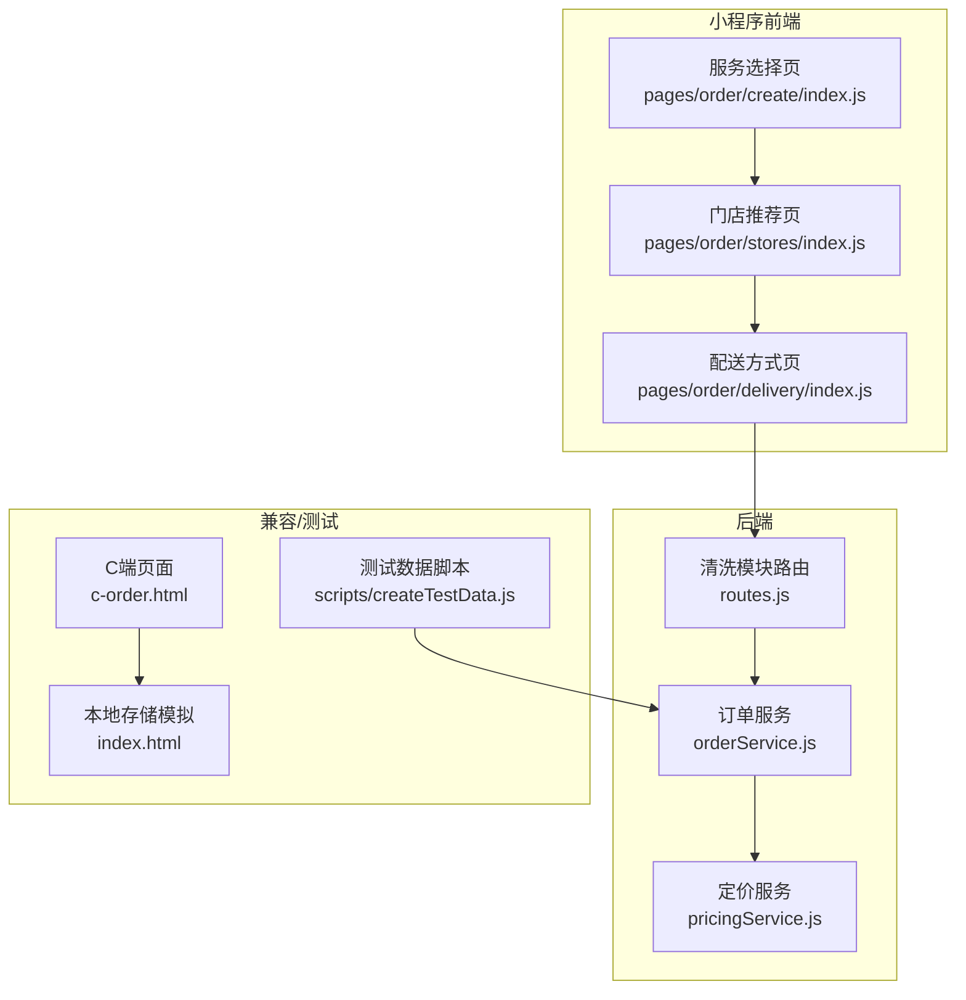
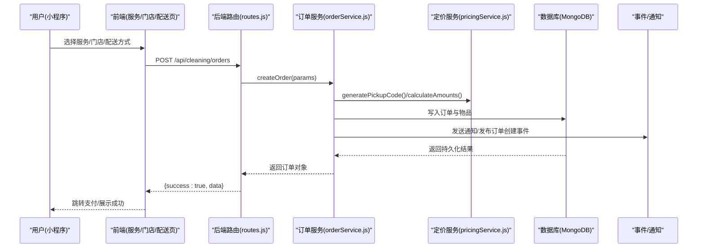
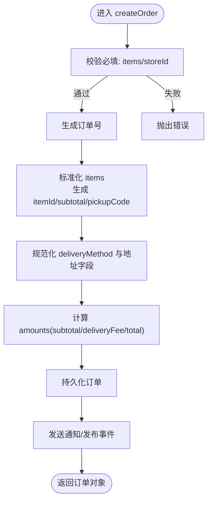
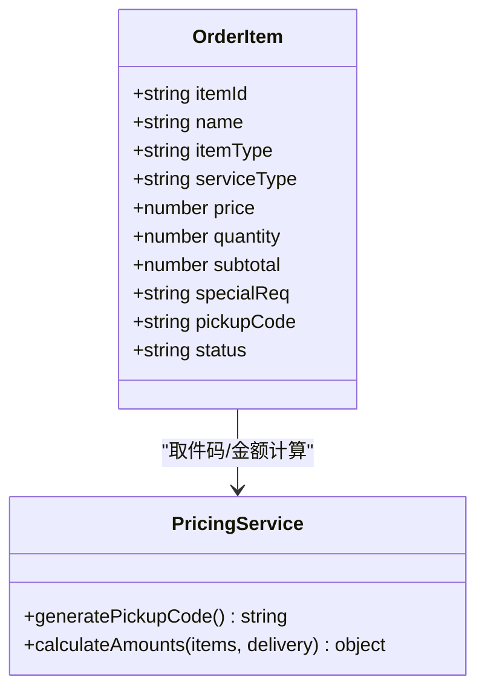
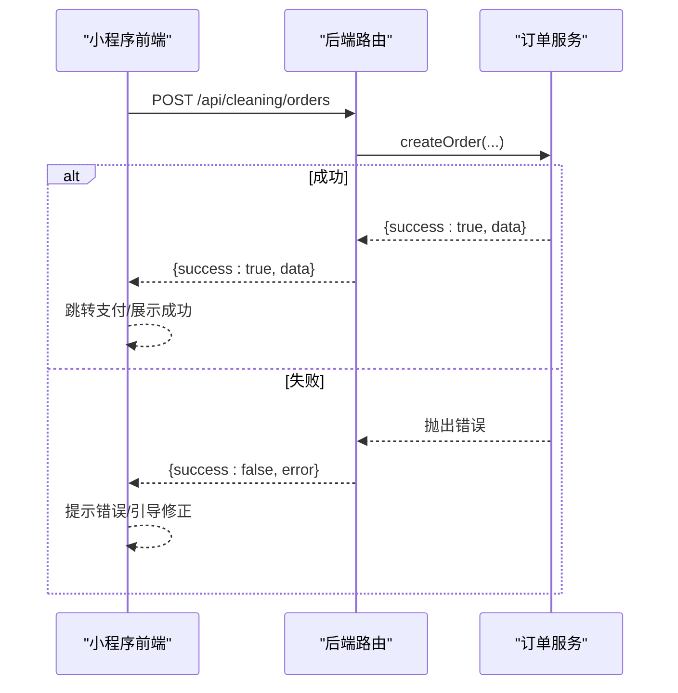
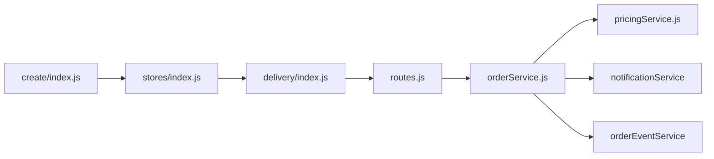

# 订单创建流程

<cite>
**本文引用的文件**
- [backend/modules/cleaning/services/orderService.js](file://backend/modules/cleaning/services/orderService.js)
- [backend/modules/cleaning/routes.js](file://backend/modules/cleaning/routes.js)
- [backend/modules/cleaning/services/pricingService.js](file://backend/modules/cleaning/services/pricingService.js)
- [wechat-mini-app/pages/order/create/index.js](file://wechat-mini-app/pages/order/create/index.js)
- [wechat-mini-app/pages/order/stores/index.js](file://wechat-mini-app/pages/order/stores/index.js)
- [wechat-mini-app/pages/order/delivery/index.js](file://wechat-mini-app/pages/order/delivery/index.js)
- [c-order.html](file://c-order.html)
- [index.html](file://index.html)
- [backend/scripts/createTestData.js](file://backend/scripts/createTestData.js)
</cite>

## 目录
1. [简介](#简介)
2. [项目结构](#项目结构)
3. [核心组件](#核心组件)
4. [架构总览](#架构总览)
5. [详细组件分析](#详细组件分析)
6. [依赖关系分析](#依赖关系分析)
7. [性能考虑](#性能考虑)
8. [故障排查指南](#故障排查指南)
9. [结论](#结论)
10. [附录](#附录)

## 简介
本文件围绕“干洗系统”的订单创建流程，系统性梳理从前端表单选择服务、门店推荐与配送方式确认，到后端参数校验、订单号生成、物品清单处理、价格计算与落库的全过程。重点解析 createOrder 方法的实现细节（参数验证、数据结构构建、默认值设置、关联数据处理），并说明订单号生成规则、物品项（items）处理逻辑（itemId 生成、数量与小计计算、取件码生成）、以及前后端调用示例与错误处理方案。同时提供批量创建订单与测试数据生成的方法，帮助快速联调与回归验证。

## 项目结构
与订单创建相关的前后端关键路径如下：
- 小程序前端：服务选择 → 智慧大脑推荐门店 → 配送方式/服务商选择 → 费用计算 → 提交下单
- 后端路由：统一入口接收请求，转发至服务层
- 服务层：createOrder 完成参数校验、订单号生成、物品处理、金额汇总、持久化与事件通知
- 定价服务：辅助计算小计、配送费、总价等
- 兼容模式：C端页面与本地存储兜底，便于离线或调试

图表来源
- [wechat-mini-app/pages/order/create/index.js:1-250](file://wechat-mini-app/pages/order/create/index.js#L1-L250)
- [wechat-mini-app/pages/order/stores/index.js:1-418](file://wechat-mini-app/pages/order/stores/index.js#L1-L418)
- [wechat-mini-app/pages/order/delivery/index.js:1-402](file://wechat-mini-app/pages/order/delivery/index.js#L1-L402)
- [backend/modules/cleaning/routes.js:1-120](file://backend/modules/cleaning/routes.js#L1-L120)
- [backend/modules/cleaning/services/orderService.js:177-291](file://backend/modules/cleaning/services/orderService.js#L177-L291)
- [backend/modules/cleaning/services/pricingService.js:133-157](file://backend/modules/cleaning/services/pricingService.js#L133-L157)
- [c-order.html:2170-2202](file://c-order.html#L2170-L2202)
- [index.html:7069-7094](file://index.html#L7069-L7094)
- [backend/scripts/createTestData.js:1-338](file://backend/scripts/createTestData.js#L1-L338)

章节来源
- [wechat-mini-app/pages/order/create/index.js:1-250](file://wechat-mini-app/pages/order/create/index.js#L1-L250)
- [wechat-mini-app/pages/order/stores/index.js:1-418](file://wechat-mini-app/pages/order/stores/index.js#L1-L418)
- [wechat-mini-app/pages/order/delivery/index.js:1-402](file://wechat-mini-app/pages/order/delivery/index.js#L1-L402)
- [backend/modules/cleaning/routes.js:1-120](file://backend/modules/cleaning/routes.js#L1-L120)
- [backend/modules/cleaning/services/orderService.js:177-291](file://backend/modules/cleaning/services/orderService.js#L177-L291)
- [backend/modules/cleaning/services/pricingService.js:133-157](file://backend/modules/cleaning/services/pricingService.js#L133-L157)
- [c-order.html:2170-2202](file://c-order.html#L2170-L2202)
- [index.html:7069-7094](file://index.html#L7069-L7094)
- [backend/scripts/createTestData.js:1-338](file://backend/scripts/createTestData.js#L1-L338)

## 核心组件
- 订单服务（OrderService）
  - 负责 createOrder 主流程：参数校验、订单号生成、物品项标准化、金额计算、配送与跑腿信息组装、状态初始化、持久化、通知与事件发布。
- 定价服务（PricingService）
  - 提供取件码生成、金额计算、取回日期计算等工具方法。
- 路由层（cleaning routes）
  - 暴露 /api/cleaning/orders 等接口，统一用户标识，转发到服务层。
- 小程序前端
  - 服务选择、门店推荐、配送方式与服务商选择、费用明细计算、下单前校验与跳转支付。
- 兼容与测试
  - C端页面与本地存储兜底；测试数据脚本用于快速构造门店、用户与订单。

章节来源
- [backend/modules/cleaning/services/orderService.js:177-291](file://backend/modules/cleaning/services/orderService.js#L177-L291)
- [backend/modules/cleaning/services/pricingService.js:133-157](file://backend/modules/cleaning/services/pricingService.js#L133-L157)
- [backend/modules/cleaning/routes.js:20-42](file://backend/modules/cleaning/routes.js#L20-L42)
- [wechat-mini-app/pages/order/create/index.js:1-250](file://wechat-mini-app/pages/order/create/index.js#L1-L250)
- [wechat-mini-app/pages/order/stores/index.js:1-418](file://wechat-mini-app/pages/order/stores/index.js#L1-L418)
- [wechat-mini-app/pages/order/delivery/index.js:1-402](file://wechat-mini-app/pages/order/delivery/index.js#L1-L402)
- [c-order.html:2170-2202](file://c-order.html#L2170-L2202)
- [index.html:7069-7094](file://index.html#L7069-L7094)
- [backend/scripts/createTestData.js:1-338](file://backend/scripts/createTestData.js#L1-L338)

## 架构总览
以下时序图展示一次完整的订单创建链路：前端选择服务与门店、确定配送方式与服务商、提交下单，后端校验、生成订单号与物品项、落库并触发通知与事件。

图表来源
- [backend/modules/cleaning/routes.js:20-42](file://backend/modules/cleaning/routes.js#L20-L42)
- [backend/modules/cleaning/services/orderService.js:177-291](file://backend/modules/cleaning/services/orderService.js#L177-L291)
- [backend/modules/cleaning/services/pricingService.js:133-157](file://backend/modules/cleaning/services/pricingService.js#L133-L157)

## 详细组件分析

### 后端 createOrder 方法详解
- 参数校验
  - 必填校验：items 非空且至少一项；storeId 必须存在。
  - 用户标识统一：优先使用 openid，其次 userId，最后兜底为 guest_时间戳。
- 订单号生成
  - 当前实现以“CL+年月日+4位随机数”为主（见 generateOrderNo）。
  - 若需遵循“ORD+时间戳+随机数”的业务约定，可在 generateOrderNo 中调整格式，并确保唯一性（建议结合数据库唯一索引与重试机制）。
- 物品项（items）处理
  - itemId：基于 UUID 生成，确保唯一。
  - itemType/serviceType：优先使用 item 自身字段，否则回退到 categoryId 或默认值。
  - quantity：未传则默认为 1。
  - subtotal：price × quantity。
  - pickupCode：调用定价服务的取件码生成方法。
  - status：初始化为 pending。
- 配送与跑腿
  - deliveryMethod：将 'pickup' 规范化为 'store_pickup'。
  - selectedProvider/courierTracking：如选择了跑腿服务商，按预设费率映射填充 courier 信息。
- 金额计算
  - amounts：subtotal 可由传入或根据 items 自动汇总；deliveryFee 来自 delivery.fee 或 0；total = subtotal + deliveryFee。
- 默认值与关联数据
  - delivery/address/contactName/contactPhone 均做类型安全转换，避免数组或 undefined 导致入库异常。
  - cleaning.returnDate 默认设置为当前日期+3天。
  - payment.status 初始为 pending。
  - statusHistory 记录创建事件。
  - createdFrom 标记来源为 app。
- 异步副作用
  - 发送订单创建通知（不阻塞响应）。
  - 通过 orderEventService 发布订单创建事件，供 M端/Admin 实时同步。

图表来源
- [backend/modules/cleaning/services/orderService.js:177-291](file://backend/modules/cleaning/services/orderService.js#L177-L291)
- [backend/modules/cleaning/services/pricingService.js:133-157](file://backend/modules/cleaning/services/pricingService.js#L133-L157)

章节来源
- [backend/modules/cleaning/services/orderService.js:177-291](file://backend/modules/cleaning/services/orderService.js#L177-L291)
- [backend/modules/cleaning/services/pricingService.js:133-157](file://backend/modules/cleaning/services/pricingService.js#L133-L157)

### 订单号生成规则与唯一性保障
- 当前实现
  - 使用 CL+YYYYMMDD+4位随机数的格式（generateOrderNo）。
- 业务约定（如需）
  - 若要求“ORD+时间戳+随机数”，可调整为：
    - 前缀 ORD
    - 时间戳部分建议使用毫秒级时间戳或 ISO 字符串片段
    - 随机数部分建议 4~6 位
  - 唯一性保障：
    - 数据库层对 orderNo 建立唯一索引（Schema 已定义 unique: true）。
    - 建议在生成后尝试插入，若冲突则重新生成并重试（有限次数）。
- 可读性与排序
  - 时间戳在前有助于自然排序；固定长度随机数保证同秒内并发下的区分度。

章节来源
- [backend/modules/cleaning/services/orderService.js:1013-1023](file://backend/modules/cleaning/services/orderService.js#L1013-L1023)

### 物品项（items）处理逻辑
- itemId 生成：UUID，确保全局唯一。
- 数量与单价：quantity 默认 1；price 由前端或服务端定价决定。
- 小计金额：subtotal = price × quantity。
- 取件码：P + 6位随机数（generatePickupCode）。
- 状态：初始 pending，后续随订单状态流转更新。
- 兼容性：支持从不同来源（服务/品类）注入 itemType/serviceType。

图表来源
- [backend/modules/cleaning/services/orderService.js:198-210](file://backend/modules/cleaning/services/orderService.js#L198-L210)
- [backend/modules/cleaning/services/pricingService.js:133-157](file://backend/modules/cleaning/services/pricingService.js#L133-L157)

章节来源
- [backend/modules/cleaning/services/orderService.js:198-210](file://backend/modules/cleaning/services/orderService.js#L198-L210)
- [backend/modules/cleaning/services/pricingService.js:133-157](file://backend/modules/cleaning/services/pricingService.js#L133-L157)

### 价格计算逻辑
- 小计：所有 items 的 price × quantity 之和。
- 配送费：当 delivery.type === 'delivery' 时，取 delivery.fee（默认 10）。
- 总价：subtotal + deliveryFee。
- 取回日期：默认当前日期+3天。

章节来源
- [backend/modules/cleaning/services/pricingService.js:133-157](file://backend/modules/cleaning/services/pricingService.js#L133-L157)

### 前端调用示例与错误处理
- 小程序下单流程
  - 服务选择页：加载品类与服务，支持从详情页自动选中服务。
  - 门店推荐页：调用推荐接口获取综合/附近/价优门店列表，选择门店后更新服务价格并跳转配送页。
  - 配送方式页：选择自送到店或跑腿上门取件；若选择跑腿，加载服务商报价（一对一/拼单），填写联系人、电话、取件地址，计算费用明细，保存配送信息并跳转支付。
- 错误处理
  - 前端在 API 失败时进行降级（例如传统门店列表兜底）。
  - 后端在创建订单失败时返回 success:false 与 error 消息，前端应提示用户并阻止继续流程。
- C端兼容
  - c-order.html 在后端不可用时生成本地订单，保持流程可用。
  - index.html 提供本地存储的订单增删改查，便于离线调试。

图表来源
- [backend/modules/cleaning/routes.js:20-42](file://backend/modules/cleaning/routes.js#L20-L42)
- [wechat-mini-app/pages/order/create/index.js:1-250](file://wechat-mini-app/pages/order/create/index.js#L1-L250)
- [wechat-mini-app/pages/order/stores/index.js:1-418](file://wechat-mini-app/pages/order/stores/index.js#L1-L418)
- [wechat-mini-app/pages/order/delivery/index.js:1-402](file://wechat-mini-app/pages/order/delivery/index.js#L1-L402)
- [c-order.html:2170-2202](file://c-order.html#L2170-L2202)
- [index.html:7069-7094](file://index.html#L7069-L7094)

章节来源
- [wechat-mini-app/pages/order/create/index.js:1-250](file://wechat-mini-app/pages/order/create/index.js#L1-L250)
- [wechat-mini-app/pages/order/stores/index.js:1-418](file://wechat-mini-app/pages/order/stores/index.js#L1-L418)
- [wechat-mini-app/pages/order/delivery/index.js:1-402](file://wechat-mini-app/pages/order/delivery/index.js#L1-L402)
- [c-order.html:2170-2202](file://c-order.html#L2170-L2202)
- [index.html:7069-7094](file://index.html#L7069-L7094)

### 批量创建订单与测试数据生成
- 后端测试数据脚本
  - 创建门店、用户与订单，包含多物品与金额字段，便于端到端测试。
- 前端测试数据
  - test-data-setup.html 可批量写入本地订单数据，用于管理后台与C端联调。
- 批量创建建议
  - 在服务层增加批量创建接口（事务包裹），或在脚本中循环调用 createOrder，注意并发与幂等控制。

章节来源
- [backend/scripts/createTestData.js:1-338](file://backend/scripts/createTestData.js#L1-L338)
- [test-data-setup.html:194-223](file://test-data-setup.html#L194-L223)

## 依赖关系分析
- 路由层依赖订单服务与定价服务，负责参数透传与异常包装。
- 订单服务依赖定价服务（取件码、金额计算）、通知服务、订单事件服务。
- 前端依赖小程序全局数据传递上下文（服务、门店、配送方式、费用明细）。
- 兼容层（C端与本地存储）作为降级通道，不影响主流程。

图表来源
- [backend/modules/cleaning/routes.js:1-120](file://backend/modules/cleaning/routes.js#L1-L120)
- [backend/modules/cleaning/services/orderService.js:177-291](file://backend/modules/cleaning/services/orderService.js#L177-L291)
- [backend/modules/cleaning/services/pricingService.js:133-157](file://backend/modules/cleaning/services/pricingService.js#L133-L157)
- [wechat-mini-app/pages/order/create/index.js:1-250](file://wechat-mini-app/pages/order/create/index.js#L1-L250)
- [wechat-mini-app/pages/order/stores/index.js:1-418](file://wechat-mini-app/pages/order/stores/index.js#L1-L418)
- [wechat-mini-app/pages/order/delivery/index.js:1-402](file://wechat-mini-app/pages/order/delivery/index.js#L1-L402)

章节来源
- [backend/modules/cleaning/routes.js:1-120](file://backend/modules/cleaning/routes.js#L1-L120)
- [backend/modules/cleaning/services/orderService.js:177-291](file://backend/modules/cleaning/services/orderService.js#L177-L291)
- [backend/modules/cleaning/services/pricingService.js:133-157](file://backend/modules/cleaning/services/pricingService.js#L133-L157)
- [wechat-mini-app/pages/order/create/index.js:1-250](file://wechat-mini-app/pages/order/create/index.js#L1-L250)
- [wechat-mini-app/pages/order/stores/index.js:1-418](file://wechat-mini-app/pages/order/stores/index.js#L1-L418)
- [wechat-mini-app/pages/order/delivery/index.js:1-402](file://wechat-mini-app/pages/order/delivery/index.js#L1-L402)

## 性能考虑
- 订单号生成应避免高并发冲突，必要时引入重试与唯一索引保护。
- 物品项批量处理时尽量使用单次数据库写入，减少往返。
- 金额计算与取件码生成均为轻量操作，但应在高吞吐场景下避免重复计算。
- 通知与事件发布采用异步，避免阻塞主响应。

## 故障排查指南
- 常见错误
  - 缺少 items 或 storeId：后端直接抛错，前端需提示补全。
  - 配送信息不完整：选择跑腿时需填写联系人、电话、取件地址。
  - 订单不存在：查询或支付时使用 _id 或 orderNo 均可，检查传入格式。
- 定位步骤
  - 查看后端日志中的 [创建订单] 输出，确认入参与异常堆栈。
  - 检查数据库订单是否写入成功，确认 orderNo 唯一性。
  - 前端在 API 失败时启用降级（本地存储），确保用户体验。

章节来源
- [backend/modules/cleaning/routes.js:20-42](file://backend/modules/cleaning/routes.js#L20-L42)
- [backend/modules/cleaning/services/orderService.js:177-291](file://backend/modules/cleaning/services/orderService.js#L177-L291)
- [c-order.html:2170-2202](file://c-order.html#L2170-L2202)
- [index.html:7069-7094](file://index.html#L7069-L7094)

## 结论
本流程实现了从前端服务选择、门店推荐、配送方式与服务商选择，到后端参数校验、订单号生成、物品项标准化、金额计算与落库的完整闭环。createOrder 方法在保证数据一致性的同时，提供了丰富的默认值与兼容性处理，并通过通知与事件机制提升系统联动能力。建议在实际生产中完善订单号生成策略（满足“ORD+时间戳+随机数”的业务约定），并加强并发与幂等控制，以确保高可用与一致性。

## 附录
- 前端调用要点
  - 服务选择页：确保至少选择一项服务，支持从详情页自动选中。
  - 门店推荐页：API 失败时回退到传统门店列表。
  - 配送方式页：选择跑腿时需填写必要信息并选择服务商，计算费用明细后跳转支付。
- 测试数据
  - 使用 createTestData.js 快速生成门店、用户与订单。
  - 使用 test-data-setup.html 批量写入本地订单数据，便于联调。

章节来源
- [wechat-mini-app/pages/order/create/index.js:1-250](file://wechat-mini-app/pages/order/create/index.js#L1-L250)
- [wechat-mini-app/pages/order/stores/index.js:1-418](file://wechat-mini-app/pages/order/stores/index.js#L1-L418)
- [wechat-mini-app/pages/order/delivery/index.js:1-402](file://wechat-mini-app/pages/order/delivery/index.js#L1-L402)
- [backend/scripts/createTestData.js:1-338](file://backend/scripts/createTestData.js#L1-L338)
- [test-data-setup.html:194-223](file://test-data-setup.html#L194-L223)