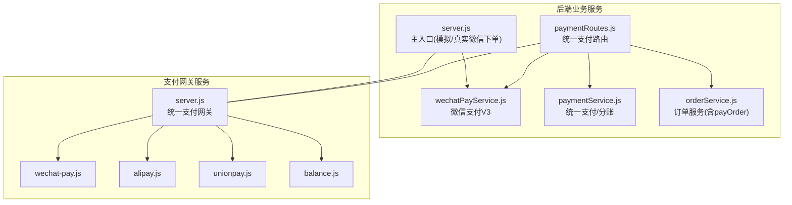
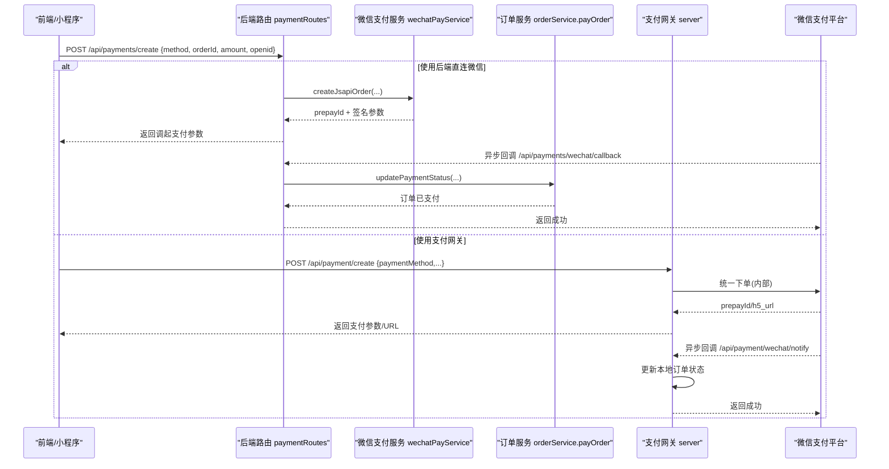
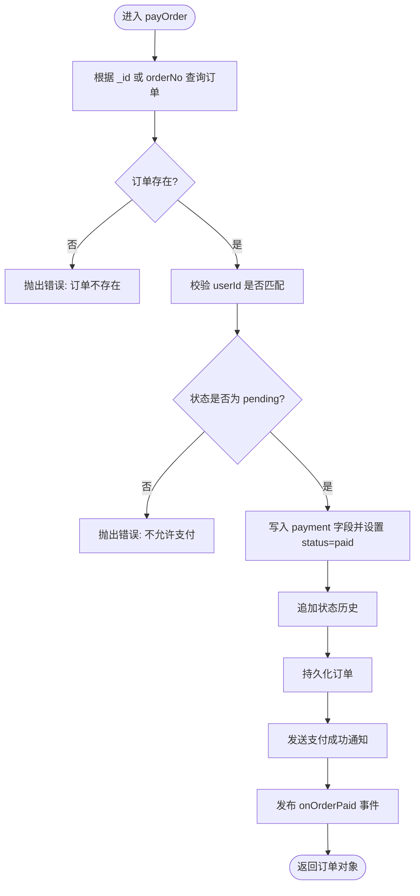
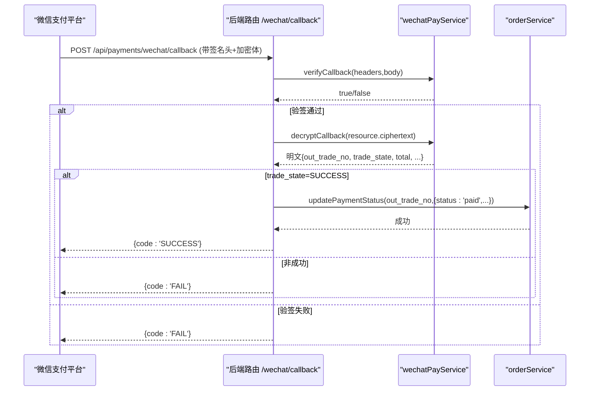
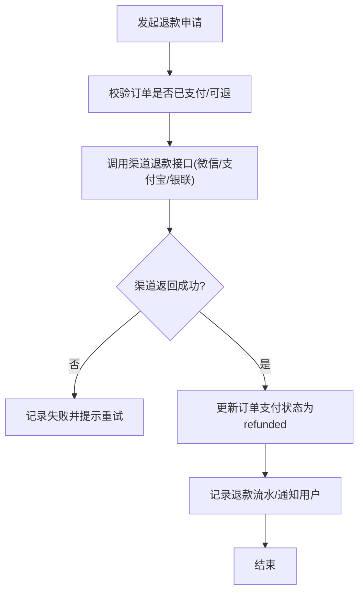
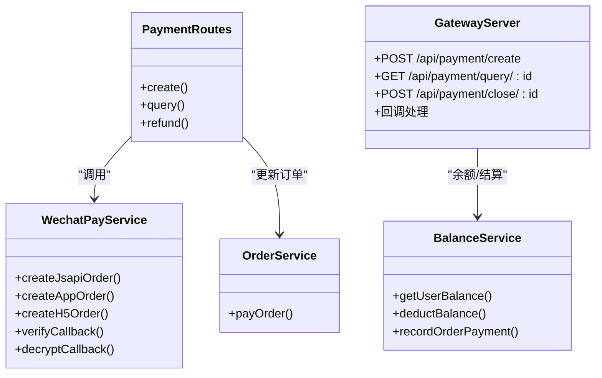

# 订单支付集成

<cite>
**本文引用的文件**   
- [后端统一支付路由](file://backend/modules/common/routes/paymentRoutes.js)
- [微信支付服务（V3）](file://backend/modules/common/services/wechatPayService.js)
- [统一支付服务（多支付方式/分账）](file://backend/modules/common/services/paymentService.js)
- [订单服务（含 payOrder）](file://backend/modules/cleaning/services/orderService.js)
- [主服务入口（模拟支付与微信下单分支）](file://backend/server.js)
- [支付网关服务器（统一创建/查询/关闭/回调）](file://api/payment-server/server.js)
- [支付网关-微信支付实现](file://api/payment-server/wechat-pay.js)
- [支付网关-支付宝实现](file://api/payment-server/alipay.js)
- [支付网关-银联实现](file://api/payment-server/unionpay.js)
- [支付网关-余额与结算服务](file://api/payment-server/balance.js)
</cite>

## 目录
1. [简介](#简介)
2. [项目结构](#项目结构)
3. [核心组件](#核心组件)
4. [架构总览](#架构总览)
5. [详细组件分析](#详细组件分析)
6. [依赖关系分析](#依赖关系分析)
7. [性能与可靠性](#性能与可靠性)
8. [故障排查指南](#故障排查指南)
9. [结论](#结论)
10. [附录：API 接口规范](#附录api-接口规范)

## 简介
本文件面向“订单支付集成”的落地实现，围绕以下目标展开：
- 深入解释 payOrder 方法的实现逻辑，包括支付状态更新、交易记录保存、支付成功后订单状态流转等关键步骤。
- 详细说明支持的支付方式：微信支付、支付宝支付、银联支付、余额支付，以及各方式的特殊处理逻辑。
- 解释支付回调处理机制，如何处理第三方支付平台的异步通知和状态同步。
- 说明支付失败与退款处理流程，包括部分退款、全额退款、退款状态管理。
- 提供支付集成的 API 接口文档，包含支付发起、支付查询、支付回调等接口规范。
- 阐述支付安全考虑，如签名验证、防重放攻击、金额校验等安全措施。
- 展示支付状态与订单状态的联动机制。

## 项目结构
本项目在“后端业务服务”与“支付网关服务”两个层面组织支付能力：
- 后端业务服务：负责业务侧的统一支付路由、订单状态变更、通知与事件发布；对接微信支付 V3 服务。
- 支付网关服务：提供统一的支付创建、查询、关闭、回调聚合接口，并内置余额与门店结算能力。

图表来源
- [后端统一支付路由:1-215](file://backend/modules/common/routes/paymentRoutes.js#L1-L215)
- [微信支付服务（V3）:1-396](file://backend/modules/common/services/wechatPayService.js#L1-L396)
- [统一支付服务（多支付方式/分账）:1-185](file://backend/modules/common/services/paymentService.js#L1-L185)
- [订单服务（含 payOrder）:520-564](file://backend/modules/cleaning/services/orderService.js#L520-L564)
- [主服务入口（模拟支付与微信下单分支）:550-596](file://backend/server.js#L550-L596)
- [支付网关服务器（统一创建/查询/关闭/回调）:1-624](file://api/payment-server/server.js#L1-L624)
- [支付网关-微信支付实现:1-314](file://api/payment-server/wechat-pay.js#L1-L314)
- [支付网关-支付宝实现:1-336](file://api/payment-server/alipay.js#L1-L336)
- [支付网关-银联实现:1-501](file://api/payment-server/unionpay.js#L1-L501)
- [支付网关-余额与结算服务:1-524](file://api/payment-server/balance.js#L1-L524)

章节来源
- [后端统一支付路由:1-215](file://backend/modules/common/routes/paymentRoutes.js#L1-L215)
- [支付网关服务器（统一创建/查询/关闭/回调）:1-624](file://api/payment-server/server.js#L1-L624)

## 核心组件
- 统一支付路由：对外暴露 /api/payments/create、/api/payments/query/:orderId、/api/payments/refund 等接口，按 method 分发到具体支付实现或余额支付。
- 微信支付服务（V3）：封装 JSAPI/App/H5 下单、查询、关闭、退款、回调验签与解密。
- 统一支付服务：抽象 createPayment 方法，支持 wechat/alipay/unionpay/balance 四种方式，并提供分账计算。
- 订单服务：提供 payOrder 方法，完成订单支付状态更新、状态历史追加、通知与事件发布。
- 支付网关服务：聚合多种支付渠道，提供统一创建/查询/关闭/回调入口，并内置余额与结算。

章节来源
- [后端统一支付路由:1-215](file://backend/modules/common/routes/paymentRoutes.js#L1-L215)
- [微信支付服务（V3）:1-396](file://backend/modules/common/services/wechatPayService.js#L1-L396)
- [统一支付服务（多支付方式/分账）:1-185](file://backend/modules/common/services/paymentService.js#L1-L185)
- [订单服务（含 payOrder）:520-564](file://backend/modules/cleaning/services/orderService.js#L520-L564)
- [支付网关服务器（统一创建/查询/关闭/回调）:1-624](file://api/payment-server/server.js#L1-L624)

## 架构总览
下图展示了从前端发起支付到最终订单状态更新的端到端流程，涵盖“后端业务服务”与“支付网关服务”两条路径。

图表来源
- [后端统一支付路由:1-215](file://backend/modules/common/routes/paymentRoutes.js#L1-L215)
- [微信支付服务（V3）:1-396](file://backend/modules/common/services/wechatPayService.js#L1-L396)
- [订单服务（含 payOrder）:520-564](file://backend/modules/cleaning/services/orderService.js#L520-L564)
- [支付网关服务器（统一创建/查询/关闭/回调）:1-624](file://api/payment-server/server.js#L1-L624)

## 详细组件分析

### payOrder 方法与订单状态流转
- 职责边界
  - 校验订单存在性、归属权与当前状态（仅 pending 可支付）。
  - 写入支付信息（status/method/transactionId/paidAt），并将订单状态置为 paid。
  - 追加状态历史，发送用户通知，并发布订单支付事件用于实时同步。
- 关键要点
  - 幂等性：建议调用方保证 orderId 唯一且重复调用不产生副作用（可在上层加锁或去重表）。
  - 事务性：支付落库与事件发布应确保一致性，必要时引入补偿或重试。
  - 审计：状态历史需保留操作人、时间与备注，便于对账与排障。

图表来源
- [订单服务（含 payOrder）:520-564](file://backend/modules/cleaning/services/orderService.js#L520-L564)

章节来源
- [订单服务（含 payOrder）:520-564](file://backend/modules/cleaning/services/orderService.js#L520-L564)

### 支付方式与特殊处理
- 微信支付（JSAPI/App/H5）
  - 通过 wechatPayService 进行统一下单，生成前端调起参数；H5 返回跳转 URL。
  - 回调采用 V3 验签与解密，成功后调用订单服务更新支付状态。
- 支付宝
  - 由支付网关 alipay.js 生成网页支付链接，回调验签后更新本地订单状态。
- 银联
  - 由 unionpay.js 生成表单或直连请求，回调验签后更新本地订单状态。
- 余额支付
  - 由 balance.js 直接扣减用户余额并记录交易流水，无需第三方回调。

章节来源
- [后端统一支付路由:1-215](file://backend/modules/common/routes/paymentRoutes.js#L1-L215)
- [支付网关服务器（统一创建/查询/关闭/回调）:1-624](file://api/payment-server/server.js#L1-L624)
- [支付网关-微信支付实现:1-314](file://api/payment-server/wechat-pay.js#L1-L314)
- [支付网关-支付宝实现:1-336](file://api/payment-server/alipay.js#L1-L336)
- [支付网关-银联实现:1-501](file://api/payment-server/unionpay.js#L1-L501)
- [支付网关-余额与结算服务:1-524](file://api/payment-server/balance.js#L1-L524)

### 支付回调处理机制
- 后端业务服务（微信支付 V3）
  - 验签：基于请求头中的时间戳、随机串与响应体拼接消息，使用 APIKey 计算 HMAC-SHA256 并与签名比对。
  - 解密：使用 APIKey 派生密钥对 resource.ciphertext 进行 AES-GCM 解密，得到业务数据。
  - 状态同步：trade_state=SUCCESS 时，调用订单服务更新支付状态并发送通知。
- 支付网关服务（多渠道）
  - 微信：解析 XML 回调，校验签名后更新内存订单状态并记录结算。
  - 支付宝：RSA2 验签，TRADE_SUCCESS/TRADE_FINISHED 视为成功。
  - 银联：SHA256 验签，respCode=00 视为成功。

图表来源
- [后端统一支付路由:120-171](file://backend/modules/common/routes/paymentRoutes.js#L120-L171)
- [微信支付服务（V3）:337-396](file://backend/modules/common/services/wechatPayService.js#L337-L396)

章节来源
- [后端统一支付路由:120-171](file://backend/modules/common/routes/paymentRoutes.js#L120-L171)
- [微信支付服务（V3）:337-396](file://backend/modules/common/services/wechatPayService.js#L337-L396)
- [支付网关服务器（统一创建/查询/关闭/回调）:306-458](file://api/payment-server/server.js#L306-L458)

### 支付失败与退款处理
- 支付失败
  - 前端轮询查询接口或等待回调；若超时未成功，可主动关闭订单（如 H5/扫码场景）。
- 退款流程
  - 后端路由提供 /api/payments/refund 接口，调用微信支付退款（需要证书）。
  - 成功后更新订单支付状态为 refunded，并记录退款原因与时间。
  - 支持部分退款与全额退款，需遵循渠道限制（如累计退款不超过实付金额）。
- 余额退款
  - 余额支付一般不支持自动原路退回，需在业务层设计逆向流水与对账。

图表来源
- [后端统一支付路由:173-212](file://backend/modules/common/routes/paymentRoutes.js#L173-L212)
- [微信支付服务（V3）:310-334](file://backend/modules/common/services/wechatPayService.js#L310-L334)

章节来源
- [后端统一支付路由:173-212](file://backend/modules/common/routes/paymentRoutes.js#L173-L212)
- [微信支付服务（V3）:310-334](file://backend/modules/common/services/wechatPayService.js#L310-L334)

### 支付状态与订单状态联动
- 支付成功：订单 payment.status=paid，order.status=paid，追加状态历史，触发通知与事件。
- 支付失败：保持 pending，允许重试或关闭订单。
- 退款成功：payment.status=refunded，order.status 依业务规则调整（如 cancelled 或保留 paid 但标记退款）。
- 余额支付：即时成功，无需回调；需确保余额扣减与交易记录原子性。

章节来源
- [订单服务（含 payOrder）:520-564](file://backend/modules/cleaning/services/orderService.js#L520-L564)
- [支付网关服务器（统一创建/查询/关闭/回调）:153-174](file://api/payment-server/server.js#L153-L174)

## 依赖关系分析
- 路由层依赖
  - paymentRoutes 依赖 wechatPayService 与 orderService。
  - server.js 在缺少微信配置或启用模拟支付时，直接调用 orderService.payOrder。
- 网关层依赖
  - gateway server.js 依赖 wechat-pay/alipay/unionpay/balance 四个模块。
  - balance.js 同时承担用户余额与门店结算功能。

图表来源
- [后端统一支付路由:1-215](file://backend/modules/common/routes/paymentRoutes.js#L1-L215)
- [微信支付服务（V3）:1-396](file://backend/modules/common/services/wechatPayService.js#L1-L396)
- [订单服务（含 payOrder）:520-564](file://backend/modules/cleaning/services/orderService.js#L520-L564)
- [支付网关服务器（统一创建/查询/关闭/回调）:1-624](file://api/payment-server/server.js#L1-L624)
- [支付网关-余额与结算服务:1-524](file://api/payment-server/balance.js#L1-L524)

章节来源
- [后端统一支付路由:1-215](file://backend/modules/common/routes/paymentRoutes.js#L1-L215)
- [支付网关服务器（统一创建/查询/关闭/回调）:1-624](file://api/payment-server/server.js#L1-L624)

## 性能与可靠性
- 幂等与去重
  - 所有写操作（创建支付、回调处理、退款）必须基于唯一业务号（orderId/out_trade_no）做幂等控制，避免重复入账。
- 异步与重试
  - 回调处理应快速返回成功，耗时逻辑（通知、事件、报表）异步执行；对失败回调进行指数退避重试。
- 对账与兜底
  - 定时任务拉取渠道订单状态，修正不一致；异常订单进入人工对账队列。
- 资源与限流
  - 对高频查询与回调接口实施限流与熔断，保护下游渠道与数据库。

[本节为通用指导，不直接分析具体文件]

## 故障排查指南
- 常见错误
  - 签名验证失败：检查时间戳、随机串、请求体顺序与密钥配置。
  - 订单不存在：确认 orderId 与渠道 out_trade_no 一致。
  - 余额不足：余额支付前需先查询可用余额。
- 日志定位
  - 关注回调处理日志、渠道返回码与业务状态映射。
  - 核对订单状态历史与支付流水的一致性。
- 恢复策略
  - 对失败的回调进行补发与幂等处理；对未完成的订单启动轮询查询。

章节来源
- [后端统一支付路由:120-212](file://backend/modules/common/routes/paymentRoutes.js#L120-L212)
- [支付网关服务器（统一创建/查询/关闭/回调）:306-458](file://api/payment-server/server.js#L306-L458)

## 结论
本方案在后端业务服务与支付网关服务之间形成清晰分层：前者聚焦业务语义（订单状态、通知、事件），后者聚合多渠道能力与余额结算。payOrder 作为核心落点，确保支付结果可靠地反映到订单状态，并通过事件驱动实现跨端实时同步。配合完善的签名验签、金额校验与对账机制，整体具备生产可用性。

[本节为总结性内容，不直接分析具体文件]

## 附录：API 接口规范

### 后端业务服务（推荐用于小程序/公众号）
- 创建支付
  - 路径：POST /api/payments/create
  - 鉴权：需要登录态
  - 请求体示例字段：orderId, orderType, amount, method, openid
  - 响应：success/data
- 查询支付状态
  - 路径：GET /api/payments/query/:orderId
  - 鉴权：需要登录态
  - 响应：success/data
- 微信支付回调
  - 路径：POST /api/payments/wechat/callback
  - 无鉴权（由微信回调）
  - 请求体：V3 加密体
  - 响应：{code:'SUCCESS'|'FAIL'}
- 申请退款
  - 路径：POST /api/payments/refund
  - 鉴权：需要登录态
  - 请求体：orderId, transactionId, amount, reason
  - 响应：success/data

章节来源
- [后端统一支付路由:1-215](file://backend/modules/common/routes/paymentRoutes.js#L1-L215)

### 支付网关服务（统一聚合）
- 创建支付
  - 路径：POST /api/payment/create
  - 请求体：orderId, amount, subject, paymentMethod, userId, openid, returnUrl, clientIp
  - 响应：success/data
- 查询支付状态
  - 路径：GET /api/payment/query/:orderId
  - 响应：success/data
- 关闭订单
  - 路径：POST /api/payment/close/:orderId
  - 响应：success/data
- 渠道回调
  - 微信：POST /api/payment/wechat/notify
  - 支付宝：POST /api/payment/alipay/notify
  - 银联：POST /api/payment/unionpay/notify
- 余额相关
  - GET /api/balance/:userId
  - GET /api/balance/:userId/transactions
  - POST /api/balance/recharge
- 门店结算
  - GET /api/settlement/store/:storeId
  - GET /api/settlement/store/:storeId/records
  - POST /api/settlement/store/:storeId/settle
  - POST /api/settlement/store/:storeId/withdraw
  - POST /api/settlement/report

章节来源
- [支付网关服务器（统一创建/查询/关闭/回调）:1-624](file://api/payment-server/server.js#L1-L624)

### 安全与合规要点
- 签名与验签
  - 微信 V3：基于请求头 timestamp、nonce、body 计算 HMAC-SHA256；回调体使用 AES-GCM 解密。
  - 支付宝：RSA2 验签。
  - 银联：SHA256 验签。
- 防重放
  - 校验时间戳与随机串，服务端维护最近 N 分钟内的 nonce 集合，拒绝重复请求。
- 金额校验
  - 服务端二次校验金额与币种，禁止信任前端传入金额。
- 权限与最小化
  - 回调接口不鉴权但严格验签；业务接口强制鉴权与 RBAC。
- 敏感信息
  - 私钥、APIKey、证书等通过环境变量注入，不落盘至代码仓库。

章节来源
- [微信支付服务（V3）:337-396](file://backend/modules/common/services/wechatPayService.js#L337-L396)
- [支付网关-支付宝实现:300-307](file://api/payment-server/alipay.js#L300-L307)
- [支付网关-银联实现:465-472](file://api/payment-server/unionpay.js#L465-L472)