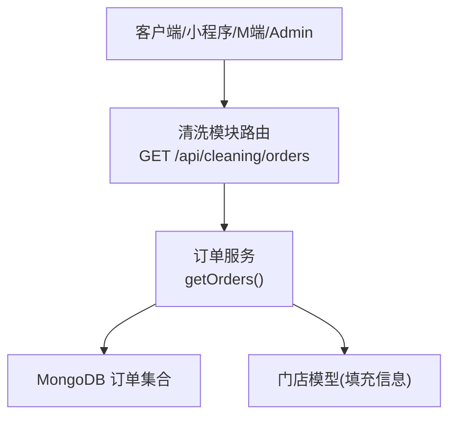
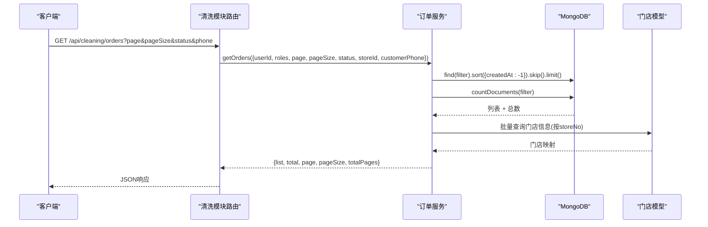
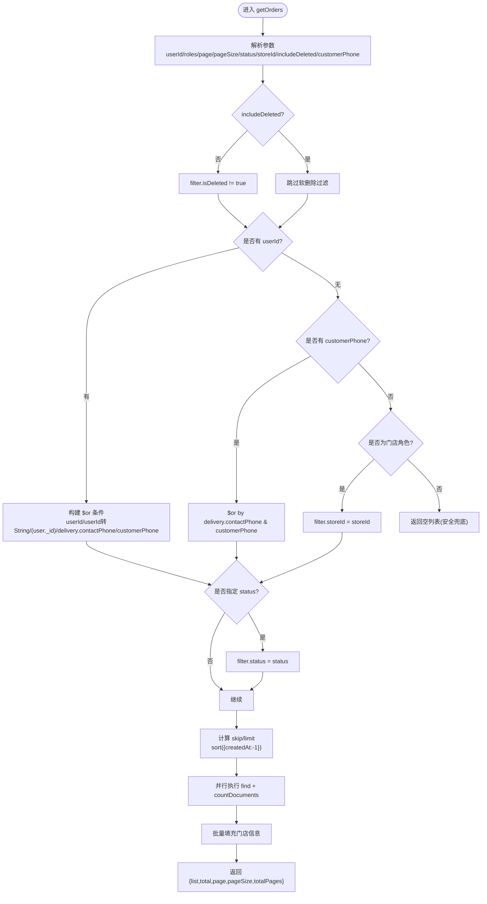
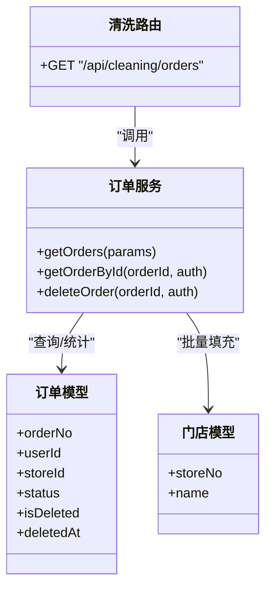

# 订单查询与过滤

<cite>
**本文引用的文件**   
- [orderService.js](file://backend/modules/cleaning/services/orderService.js)
- [routes.js](file://backend/modules/cleaning/routes.js)
- [adminService.js](file://backend/modules/admin/services/adminService.js)
- [chainAdminRoutes.js](file://backend/modules/admin/routes/chainAdminRoutes.js)
- [initDatabase.js](file://backend/scripts/initDatabase.js)
</cite>

## 目录
1. [简介](#简介)
2. [项目结构](#项目结构)
3. [核心组件](#核心组件)
4. [架构总览](#架构总览)
5. [详细组件分析](#详细组件分析)
6. [依赖关系分析](#依赖关系分析)
7. [性能考量](#性能考量)
8. [故障排查指南](#故障排查指南)
9. [结论](#结论)
10. [附录：API调用示例](#附录api调用示例)

## 简介
本文件围绕“订单查询与过滤”能力，系统性梳理 getOrders 方法的实现逻辑与周边机制，包括多条件查询、分页处理、排序规则、权限控制、软删除策略以及性能优化建议。同时提供常见查询场景的 API 调用示例，帮助前端与集成方快速上手。

## 项目结构
与订单查询相关的关键代码位于后端清洗模块的服务与路由层：
- 服务层：订单查询、详情、状态流转等核心业务逻辑集中在 orderService.js
- 路由层：对外暴露 REST 接口，负责参数解析、鉴权上下文注入与响应封装，见 routes.js
- 管理端：管理员与连锁平台侧的订单查询在 adminService.js 与 chainAdminRoutes.js 中实现
- 初始化脚本：包含索引创建参考（MongoDB），用于指导性能优化

图表来源
- [routes.js:49-81](file://backend/modules/cleaning/routes.js#L49-L81)
- [orderService.js:295-389](file://backend/modules/cleaning/services/orderService.js#L295-L389)

章节来源
- [routes.js:49-81](file://backend/modules/cleaning/routes.js#L49-L81)
- [orderService.js:295-389](file://backend/modules/cleaning/services/orderService.js#L295-L389)

## 核心组件
- 订单列表查询入口：GET /api/cleaning/orders
- 核心方法：OrderService.getOrders(params)
- 关键能力：
  - 多条件组合查询（用户标识、手机号跨平台、门店角色、状态）
  - 分页与排序（按创建时间倒序）
  - 权限控制（仅查看本人或本门店订单）
  - 软删除控制（默认隐藏已删除订单）
  - 结果集增强（自动填充门店信息）

章节来源
- [routes.js:49-81](file://backend/modules/cleaning/routes.js#L49-L81)
- [orderService.js:295-389](file://backend/modules/cleaning/services/orderService.js#L295-L389)

## 架构总览
以下时序图展示一次订单列表请求从路由到数据库再到返回结果的完整流程。

图表来源
- [routes.js:49-81](file://backend/modules/cleaning/routes.js#L49-L81)
- [orderService.js:352-389](file://backend/modules/cleaning/services/orderService.js#L352-L389)

## 详细组件分析

### getOrders 方法实现逻辑
- 输入参数
  - userId：用户唯一标识（支持多种来源：JWT、openid、phone）
  - roles：角色（customer、store_staff、store_owner）
  - page/pageSize：分页
  - status：订单状态筛选
  - storeId：门店编号（用于门店角色过滤）
  - includeDeleted：是否包含已删除订单（默认 false）
  - customerPhone：客户手机号（用于跨平台匹配）
- 过滤构建与权限控制
  - 默认排除已删除订单（isDeleted=true），除非 includeDeleted=true
  - 若传入 userId：
    - 使用 $or 兼容 userId 为字符串或对象ID的情况
    - 当 userId 形似 openid（以字母开头）时，额外尝试 user._id 匹配
    - 若同时提供 customerPhone，则在 $or 中追加 delivery.contactPhone 与 customerPhone 匹配，实现同一手机号在不同平台的订单可见性
  - 若未传 userId 但传了 customerPhone：纯手机号查询（跨平台）
  - 若为门店角色（store_staff/store_owner）且未传 userId/phone：按 storeId 过滤
  - 兜底：无用户标识且无门店角色则直接返回空列表
- 附加条件
  - status：精确匹配订单状态
- 分页与排序
  - 按 createdAt 倒序
  - skip=(page-1)*pageSize，limit=pageSize
- 结果增强
  - 根据 list 中的 storeId（实际存储的是 storeNo）批量查询门店信息并回填 store、storeName、storeAddress 等字段
- 返回值
  - list、total、page、pageSize、totalPages

图表来源
- [orderService.js:295-389](file://backend/modules/cleaning/services/orderService.js#L295-L389)

章节来源
- [orderService.js:295-389](file://backend/modules/cleaning/services/orderService.js#L295-L389)

### 支持的查询条件详解
- 用户ID查询
  - 通过 userId 精准定位当前用户的订单；兼容不同标识类型（字符串ID、openid）
- 手机号跨平台查询
  - 通过 customerPhone 或 delivery.contactPhone 进行匹配，使同一手机号在不同平台的订单可被聚合显示
- 门店角色过滤
  - 当角色为 store_staff 或 store_owner 时，按 storeId 限制仅查看本门店订单
- 状态筛选
  - 通过 status 精确过滤（如 pending/paid/received/processing/ready/completed/cancelled 等）
- 时间范围查询
  - 当前 getOrders 未内置时间范围参数；如需时间范围，可在上层路由或服务扩展 filter.createdAt.$gte/$lte
- 软删除控制
  - includeDeleted=false（默认）：不显示已删除订单
  - includeDeleted=true：显示已删除订单（谨慎使用）

章节来源
- [orderService.js:295-389](file://backend/modules/cleaning/services/orderService.js#L295-L389)

### 权限控制机制
- 普通用户（customer）
  - 必须携带 userId 或 customerPhone，否则无法获取任何订单
- 门店员工/店主（store_staff/store_owner）
  - 若无 userId/phone，将按 storeId 限定仅查看本门店订单
- 详情接口额外校验
  - getOrderById 会校验：customer 只能看自己的订单；门店角色只能看本门店订单

章节来源
- [orderService.js:336-344](file://backend/modules/cleaning/services/orderService.js#L336-L344)
- [orderService.js:434-443](file://backend/modules/cleaning/services/orderService.js#L434-L443)

### 分页与排序
- 排序：按 createdAt 倒序（最新在前）
- 分页：skip=(page-1)*pageSize，limit=pageSize
- 计数：countDocuments(filter) 返回总条数，用于计算 totalPages

章节来源
- [orderService.js:350-359](file://backend/modules/cleaning/services/orderService.js#L350-L359)

### 软删除机制对查询的影响
- 数据模型包含 isDeleted、deletedAt、deletedBy 字段
- getOrders 默认添加 isDeleted != true 的过滤，避免返回已删除订单
- 删除操作由 deleteOrder 设置 isDeleted=true 并记录 deletedAt/deletedBy
- 可通过 includeDeleted=true 显式包含已删除订单（例如后台审计）

章节来源
- [orderService.js:148-151](file://backend/modules/cleaning/services/orderService.js#L148-L151)
- [orderService.js:304-307](file://backend/modules/cleaning/services/orderService.js#L304-L307)
- [orderService.js:623-660](file://backend/modules/cleaning/services/orderService.js#L623-L660)

## 依赖关系分析
- 路由层依赖服务层：routes.js 解析请求参数后调用 orderService.getOrders
- 服务层依赖数据模型：Order、Store
- 管理端独立实现：adminService 与 chainAdminRoutes 提供面向管理员/连锁平台的订单查询（含关键词搜索、时间范围等）

图表来源
- [routes.js:49-81](file://backend/modules/cleaning/routes.js#L49-L81)
- [orderService.js:295-389](file://backend/modules/cleaning/services/orderService.js#L295-L389)

章节来源
- [routes.js:49-81](file://backend/modules/cleaning/routes.js#L49-L81)
- [orderService.js:295-389](file://backend/modules/cleaning/services/orderService.js#L295-L389)

## 性能考量
- 索引设计建议（基于现有 Schema 与常用查询）
  - 高频查询字段应建立索引：userId、storeId、status、createdAt、customerPhone、isDeleted
  - 复合索引建议：{userId:1, createdAt:-1}、{storeId:1, status:1, createdAt:-1}、{customerPhone:1}
- 查询条件优化
  - 优先使用等值条件（userId、storeId、status）减少全表扫描
  - 避免在 $or 中使用过多低选择性字段；手机号跨平台查询需确保 customerPhone/delivery.contactPhone 有索引
  - 分页尽量使用合理 pageSize（如 20~50），避免过大导致内存与网络开销
- 结果集限制
  - 使用 lean() 返回纯对象，减少 Mongoose 文档转换开销
  - 批量填充门店信息时使用 $in 一次性加载，避免 N+1 查询
- 管理端查询
  - 管理端常带时间范围与关键词搜索，建议在 createdAt 与文本字段上建立合适索引，必要时考虑全文检索方案

章节来源
- [orderService.js:352-366](file://backend/modules/cleaning/services/orderService.js#L352-L366)
- [initDatabase.js:72-79](file://backend/scripts/initDatabase.js#L72-L79)

## 故障排查指南
- 查不到订单
  - 检查是否缺少 userId/phone 且非门店角色，会被安全兜底返回空列表
  - 确认 includeDeleted 是否为默认 false，导致已删除订单不可见
- 跨平台订单不一致
  - 确认 customerPhone 与 delivery.contactPhone 是否一致且存在索引
  - 检查 userId 格式是否兼容（字符串/对象ID/openid）
- 性能问题
  - 关注 countDocuments 与 find 的执行计划，确认命中索引
  - 避免过大的 pageSize 与深层分页
- 权限错误
  - 详情接口会校验用户与门店归属，请确认 auth.roles 与 userId/storeId 正确传递

章节来源
- [orderService.js:336-344](file://backend/modules/cleaning/services/orderService.js#L336-L344)
- [orderService.js:434-443](file://backend/modules/cleaning/services/orderService.js#L434-L443)

## 结论
getOrders 方法在保障数据安全的前提下，提供了灵活的多条件查询与分页能力，并通过软删除与门店维度隔离实现了良好的权限控制。结合合理的索引设计与查询优化，可在高并发与大数据量场景下保持良好性能。对于需要时间范围与高级搜索的管理端场景，可在现有基础上扩展 filter 条件与索引策略。

## 附录：API调用示例
以下为常见查询场景的请求示例（基于 GET /api/cleaning/orders）。注意：
- 基础查询：仅分页
- 高级筛选：状态、手机号跨平台、门店角色
- 分页加载：page/pageSize
- 软删除控制：includeDeleted

- 基础查询（仅分页）
  - 请求：GET /api/cleaning/orders?page=1&pageSize=20
  - 说明：默认只返回未删除订单，按创建时间倒序

- 按状态筛选
  - 请求：GET /api/cleaning/orders?status=ready&page=1&pageSize=20
  - 说明：仅返回待取件状态的订单

- 手机号跨平台查询
  - 请求：GET /api/cleaning/orders?phone=13800001111&page=1&pageSize=20
  - 说明：通过 customerPhone 与 delivery.contactPhone 匹配，聚合同一手机号下的订单

- 用户维度查询（推荐通过 JWT 或 query.userId）
  - 请求：GET /api/cleaning/orders?userId=USER_ID&page=1&pageSize=20
  - 说明：仅返回该用户的订单

- 门店角色查询（store_staff/store_owner）
  - 请求：GET /api/cleaning/orders?storeId=ST001&page=1&pageSize=20
  - 说明：仅返回该门店的订单（需在认证上下文中具备门店角色）

- 包含已删除订单（谨慎使用）
  - 请求：GET /api/cleaning/orders?includeDeleted=true&page=1&pageSize=20
  - 说明：返回包含已删除的订单，适用于审计或特殊场景

- 组合查询（示例）
  - 请求：GET /api/cleaning/orders?userId=USER_ID&status=pending&page=1&pageSize=20
  - 说明：用户维度的待支付订单

章节来源
- [routes.js:49-81](file://backend/modules/cleaning/routes.js#L49-L81)
- [orderService.js:295-389](file://backend/modules/cleaning/services/orderService.js#L295-L389)