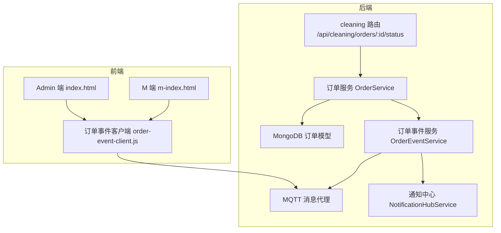
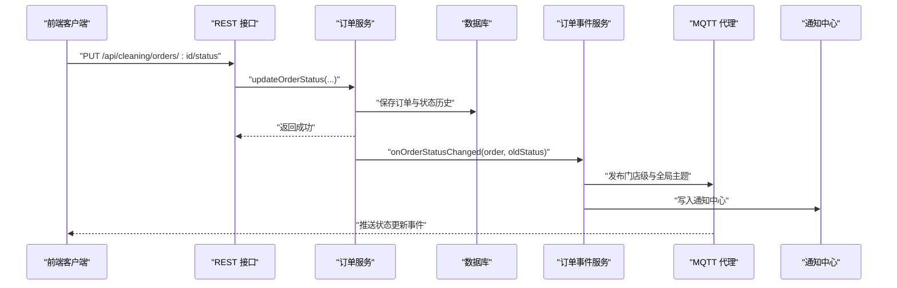
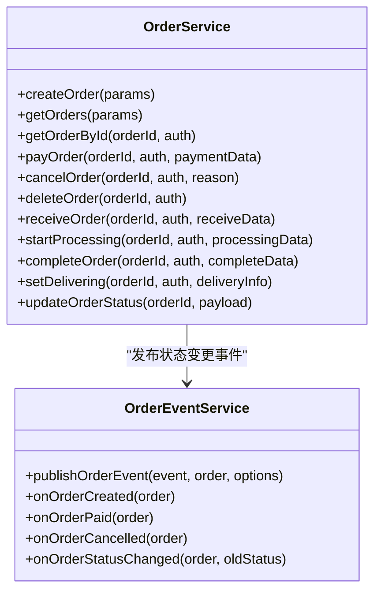
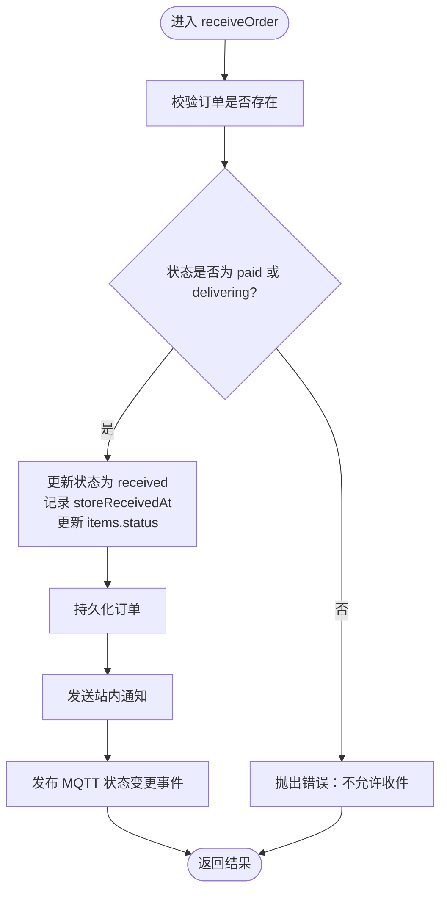
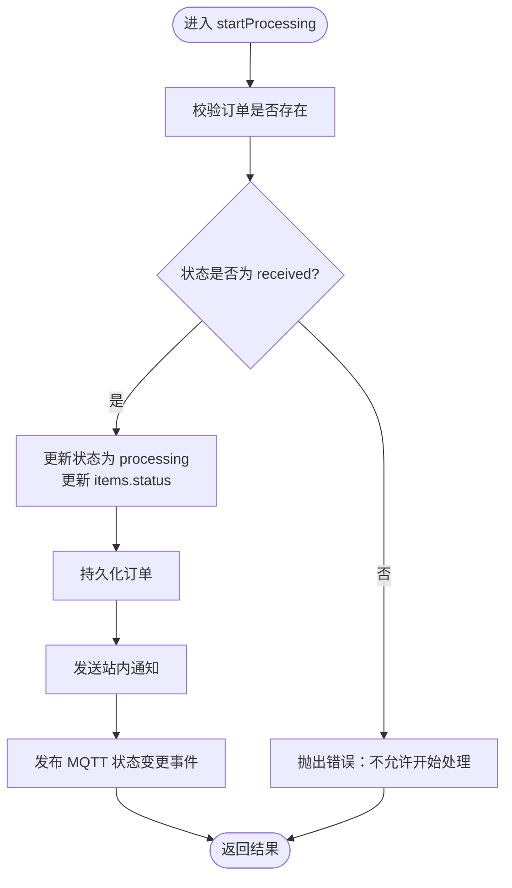
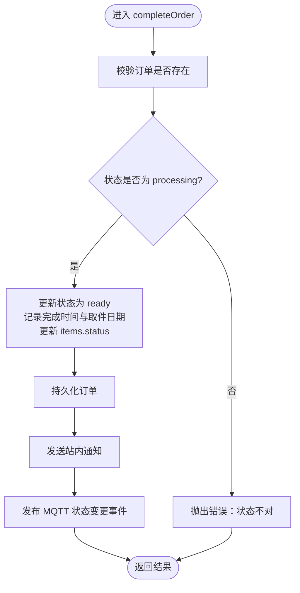
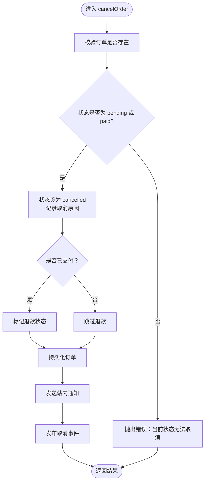
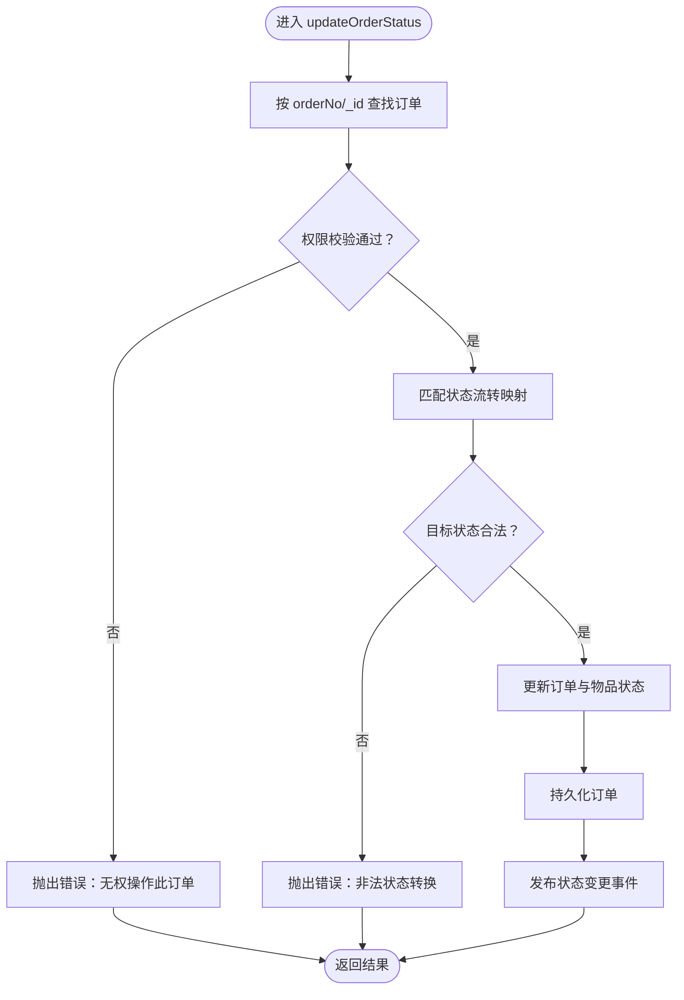
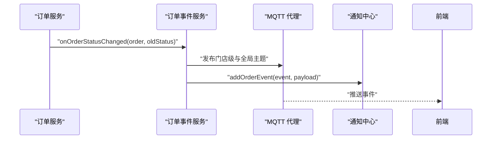
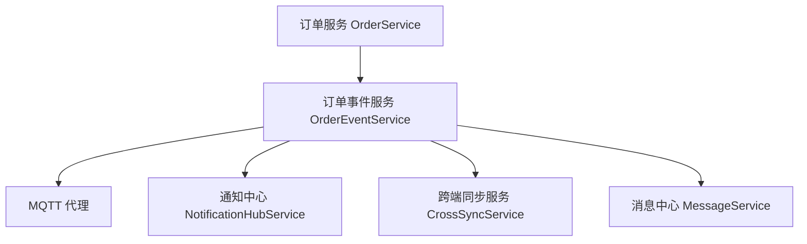

# 订单状态管理

<cite>
**本文引用的文件**
- [orderService.js](file://backend/modules/cleaning/services/orderService.js)
- [orderEventService.js](file://backend/services/orderEventService.js)
- [routes.js](file://backend/modules/cleaning/routes.js)
- [notificationHubService.js](file://backend/services/notificationHubService.js)
- [order-event-client.js](file://js/order-event-client.js)
- [index.html](file://index.html)
- [m-index.html](file://m-index.html)
</cite>

## 目录
1. [简介](#简介)
2. [项目结构](#项目结构)
3. [核心组件](#核心组件)
4. [架构总览](#架构总览)
5. [详细组件分析](#详细组件分析)
6. [依赖关系分析](#依赖关系分析)
7. [性能考虑](#性能考虑)
8. [故障排查指南](#故障排查指南)
9. [结论](#结论)
10. [附录：API 接口文档](#附录api-接口文档)

## 简介
本文件围绕干洗系统的“订单状态管理”进行系统化说明，覆盖以下关键主题：
- 核心状态更新操作：门店收件 receiveOrder、开始处理 startProcessing、完成清洗 completeOrder、取消订单 cancelOrder 等
- 权限控制与前置条件检查：角色校验、状态合法性验证、数据一致性约束
- 状态历史记录：每次变更的操作人、时间、备注记录机制
- 实时通知机制：基于 MQTT 的事件发布/订阅，向 M 端与 Admin 端推送状态更新
- API 接口规范：请求参数、响应格式、错误码定义
- 回滚与异常恢复策略：幂等性、事务边界、失败补偿与降级方案

## 项目结构
订单状态管理涉及后端服务层、事件服务层、路由层以及前端客户端的协同工作。核心文件分布如下：
- 服务层：订单业务逻辑集中在 cleaning 模块的服务中
- 事件服务：统一通过 MQTT 发布订单事件，并同步到通知中心与跨端同步服务
- 路由层：对外暴露 REST 接口，承载状态更新入口
- 前端客户端：M 端与 Admin 端订阅 MQTT 主题，接收实时状态变更

图表来源
- [routes.js:566-570](file://backend/modules/cleaning/routes.js#L566-L570)
- [orderService.js:667-715](file://backend/modules/cleaning/services/orderService.js#L667-L715)
- [orderEventService.js:77-144](file://backend/services/orderEventService.js#L77-L144)
- [notificationHubService.js:1-39](file://backend/services/notificationHubService.js#L1-L39)
- [order-event-client.js:161-209](file://js/order-event-client.js#L161-L209)
- [index.html:5281-5439](file://index.html#L5281-L5439)
- [m-index.html:11931-11960](file://m-index.html#L11931-L11960)

章节来源
- [orderService.js:1-180](file://backend/modules/cleaning/services/orderService.js#L1-L180)
- [orderEventService.js:1-68](file://backend/services/orderEventService.js#L1-L68)
- [routes.js:566-570](file://backend/modules/cleaning/routes.js#L566-L570)

## 核心组件
- 订单服务（OrderService）
  - 负责订单创建、支付、取消、删除、收件、开始处理、完成清洗、配送设置、通用状态更新等
  - 维护 statusHistory 记录每次状态变更的操作人、时间与备注
  - 在关键状态变更后调用订单事件服务发布 MQTT 事件
- 订单事件服务（OrderEventService）
  - 统一封装 MQTT 发布逻辑，支持门店级与全局主题
  - 将事件写入通知中心，并记录跨端操作来源
- 通知中心（NotificationHubService）
  - 为 Admin 端提供轮询获取历史通知的能力
- 前端客户端
  - Admin 端与 M 端通过 MQTT WebSocket 订阅订单更新主题，实现实时刷新

章节来源
- [orderService.js:177-291](file://backend/modules/cleaning/services/orderService.js#L177-L291)
- [orderService.js:569-616](file://backend/modules/cleaning/services/orderService.js#L569-L616)
- [orderService.js:667-715](file://backend/modules/cleaning/services/orderService.js#L667-L715)
- [orderService.js:721-757](file://backend/modules/cleaning/services/orderService.js#L721-L757)
- [orderService.js:763-800](file://backend/modules/cleaning/services/orderService.js#L763-L800)
- [orderService.js:853-930](file://backend/modules/cleaning/services/orderService.js#L853-L930)
- [orderEventService.js:69-168](file://backend/services/orderEventService.js#L69-L168)
- [notificationHubService.js:1-39](file://backend/services/notificationHubService.js#L1-L39)

## 架构总览
订单状态变更的整体流程如下：
- 前端调用 REST 接口触发状态更新
- 服务层执行权限与状态合法性校验，持久化变更并写入状态历史
- 事件服务发布 MQTT 事件至门店级与全局主题
- 前端客户端订阅主题，收到事件后刷新 UI 或展示通知

图表来源
- [routes.js:566-570](file://backend/modules/cleaning/routes.js#L566-L570)
- [orderService.js:853-930](file://backend/modules/cleaning/services/orderService.js#L853-L930)
- [orderEventService.js:77-144](file://backend/services/orderEventService.js#L77-L144)
- [notificationHubService.js:1-39](file://backend/services/notificationHubService.js#L1-L39)

## 详细组件分析

### 订单服务（OrderService）
- 职责
  - 提供订单全生命周期状态更新方法
  - 维护 statusHistory 字段，记录每次状态变更的 actorId、time、note
  - 在状态变更后调用事件服务发布 MQTT 事件
- 关键方法
  - receiveOrder：门店收件，状态从 paid/delivering 变更为 received
  - startProcessing：开始处理，状态从 received 变更为 processing
  - completeOrder：完成清洗，状态从 processing 变更为 ready
  - cancelOrder：取消订单，状态变更为 cancelled（支持退款标记）
  - updateOrderStatus：通用状态更新，内置状态流转映射与权限校验
- 权限与前置条件
  - 门店人员（store_staff/store_owner）可更新订单状态
  - 普通用户仅能操作自己的订单
  - 状态转换受限于预定义的状态流（如 received→processing→ready）
- 状态历史
  - 每次状态变更都会追加一条记录，包含新状态、时间戳、操作人、备注
- 通知与事件
  - 调用 notificationService 发送站内通知
  - 调用 orderEventService.onOrderStatusChanged 发布 MQTT 事件

图表来源
- [orderService.js:177-291](file://backend/modules/cleaning/services/orderService.js#L177-L291)
- [orderService.js:569-616](file://backend/modules/cleaning/services/orderService.js#L569-L616)
- [orderService.js:667-715](file://backend/modules/cleaning/services/orderService.js#L667-L715)
- [orderService.js:721-757](file://backend/modules/cleaning/services/orderService.js#L721-L757)
- [orderService.js:763-800](file://backend/modules/cleaning/services/orderService.js#L763-L800)
- [orderService.js:853-930](file://backend/modules/cleaning/services/orderService.js#L853-L930)
- [orderEventService.js:69-168](file://backend/services/orderEventService.js#L69-L168)

章节来源
- [orderService.js:667-715](file://backend/modules/cleaning/services/orderService.js#L667-L715)
- [orderService.js:721-757](file://backend/modules/cleaning/services/orderService.js#L721-L757)
- [orderService.js:763-800](file://backend/modules/cleaning/services/orderService.js#L763-L800)
- [orderService.js:853-930](file://backend/modules/cleaning/services/orderService.js#L853-L930)

#### 门店收件 receiveOrder
- 前置条件
  - 订单存在且当前状态为 paid 或 delivering
- 权限控制
  - 由门店人员调用（staffId 作为操作人）
- 状态变更
  - 状态从 paid/delivering → received
  - 记录 storeReceivedAt 时间戳
  - 所有物品状态同步为 received
- 通知与事件
  - 发送站内通知
  - 发布 onOrderStatusChanged 事件

图表来源
- [orderService.js:667-715](file://backend/modules/cleaning/services/orderService.js#L667-L715)

章节来源
- [orderService.js:667-715](file://backend/modules/cleaning/services/orderService.js#L667-L715)

#### 开始处理 startProcessing
- 前置条件
  - 订单存在且当前状态为 received
- 权限控制
  - 由门店人员调用（staffId 作为操作人）
- 状态变更
  - 状态从 received → processing
  - 所有物品状态同步为 processing
- 通知与事件
  - 发送站内通知
  - 发布 onOrderStatusChanged 事件

图表来源
- [orderService.js:721-757](file://backend/modules/cleaning/services/orderService.js#L721-L757)

章节来源
- [orderService.js:721-757](file://backend/modules/cleaning/services/orderService.js#L721-L757)

#### 完成清洗 completeOrder
- 前置条件
  - 订单存在且当前状态为 processing
- 权限控制
  - 由门店人员调用（staffId 作为操作人）
- 状态变更
  - 状态从 processing → ready
  - 记录 storeCompletedAt、returnDate、qualityCheckPassed
  - 所有物品状态同步为 ready
- 通知与事件
  - 发送站内通知
  - 发布 onOrderStatusChanged 事件

图表来源
- [orderService.js:763-800](file://backend/modules/cleaning/services/orderService.js#L763-L800)

章节来源
- [orderService.js:763-800](file://backend/modules/cleaning/services/orderService.js#L763-L800)

#### 取消订单 cancelOrder
- 前置条件
  - 订单存在且当前状态为 pending 或 paid
- 权限控制
  - 订单所有者或管理员可取消
- 状态变更
  - 状态变更为 cancelled
  - 记录取消原因
  - 若已支付，标记退款状态
- 通知与事件
  - 发送站内通知
  - 发布 onOrderCancelled 事件

图表来源
- [orderService.js:569-616](file://backend/modules/cleaning/services/orderService.js#L569-L616)

章节来源
- [orderService.js:569-616](file://backend/modules/cleaning/services/orderService.js#L569-L616)

#### 通用状态更新 updateOrderStatus
- 功能
  - 支持多种状态转换（received、cleaning、cleaned、ready、completed 等）
  - 内置状态流转映射，允许更灵活的前端操作流程
- 权限控制
  - 门店人员或订单所有者可更新
- 状态历史
  - 每次更新均追加状态历史条目
- 事件发布
  - 调用 onOrderStatusChanged 发布 MQTT 事件

图表来源
- [orderService.js:853-930](file://backend/modules/cleaning/services/orderService.js#L853-L930)

章节来源
- [orderService.js:853-930](file://backend/modules/cleaning/services/orderService.js#L853-L930)

### 订单事件服务（OrderEventService）
- 职责
  - 统一发布订单事件到 MQTT 主题（门店级与全局）
  - 同步写入通知中心，供 Admin 端轮询
  - 记录跨端操作来源，便于追踪
- 主题设计
  - dryclean/orders/{storeId}/update：门店级
  - dryclean/orders/all/update：全局
- 消息体
  - 包含 event、orderId、orderNo、storeId、status、totalAmount、items、customerName、createdFrom、_source、_oldStatus、updatedAt

图表来源
- [orderEventService.js:77-144](file://backend/services/orderEventService.js#L77-L144)
- [notificationHubService.js:1-39](file://backend/services/notificationHubService.js#L1-L39)

章节来源
- [orderEventService.js:69-168](file://backend/services/orderEventService.js#L69-L168)

### 通知中心（NotificationHubService）
- 职责
  - 收集业务事件（订单创建、支付、状态变更、灯条点亮等）
  - 为 Admin 端提供轮询查询历史通知的接口
- 特性
  - 每个门店最多保留一定数量的通知
  - 定时清理过期通知

章节来源
- [notificationHubService.js:1-39](file://backend/services/notificationHubService.js#L1-L39)

### 前端客户端（Admin/M端）
- Admin 端
  - 通过 MQTT WebSocket 订阅全局主题，接收订单事件并渲染通知
- M 端
  - 订阅门店级主题，实时更新订单列表与详情
- 重连与降级
  - 连接失败时自动重连，达到上限后切换到轮询模式

章节来源
- [index.html:5281-5439](file://index.html#L5281-L5439)
- [m-index.html:11931-11960](file://m-index.html#L11931-L11960)
- [order-event-client.js:161-209](file://js/order-event-client.js#L161-L209)

## 依赖关系分析
- 耦合与内聚
  - 订单服务与事件服务解耦，通过回调函数松耦合
  - 事件服务延迟加载 MQTT、通知中心与跨端同步服务，避免循环依赖
- 外部依赖
  - MongoDB 用于订单持久化
  - MQTT 代理用于实时事件分发
  - 通知中心用于 Admin 端轮询

图表来源
- [orderService.js:853-930](file://backend/modules/cleaning/services/orderService.js#L853-L930)
- [orderEventService.js:22-67](file://backend/services/orderEventService.js#L22-L67)

章节来源
- [orderEventService.js:22-67](file://backend/services/orderEventService.js#L22-L67)

## 性能考虑
- 异步通知与事件发布不阻塞主流程，提升接口响应速度
- MQTT 使用 QoS 1 保证至少一次投递，适合状态同步场景
- 通知中心限制数量与 TTL，避免内存膨胀
- 前端具备重连与轮询降级策略，提高稳定性

## 故障排查指南
- 常见问题
  - MQTT 未连接：事件服务会跳过发布，需检查 EMQX/NanoMQ 启动状态
  - 权限不足：确认调用方角色与订单归属关系
  - 状态非法：检查当前状态与目标状态的流转映射
- 定位手段
  - 查看后端日志中的“订单事件”输出
  - 检查通知中心是否写入事件
  - 前端控制台观察 MQTT 连接与订阅状态

章节来源
- [orderEventService.js:97-110](file://backend/services/orderEventService.js#L97-L110)
- [index.html:5409-5439](file://index.html#L5409-L5439)

## 结论
订单状态管理以订单服务为核心，结合事件服务与 MQTT 实现实时状态同步；通过严格的状态流转与权限校验保障数据一致性与安全性；同时提供通知中心与前端降级策略，确保系统在高可用与用户体验上的平衡。

## 附录：API 接口文档

### 更新订单状态
- 接口
  - PUT /api/cleaning/orders/:id/status
- 请求头
  - Content-Type: application/json
  - Authorization: Bearer <token>（根据鉴权中间件要求）
- 请求体
  - status: string（目标状态，如 received、processing、ready、completed 等）
  - note: string（可选，备注信息）
  - userId: string（可选，操作人标识）
  - roles: array<string>（可选，角色列表，如 store_staff、store_owner）
- 响应体
  - success: boolean
  - data: object（订单对象，包含最新状态与状态历史）
  - error: string（失败时的错误信息）
- 错误码
  - 400：参数错误或状态非法
  - 401：未授权或无权操作
  - 404：订单不存在
  - 500：服务器内部错误

章节来源
- [routes.js:566-570](file://backend/modules/cleaning/routes.js#L566-L570)
- [orderService.js:853-930](file://backend/modules/cleaning/services/orderService.js#L853-L930)

### 其他相关接口（参考）
- 获取订单详情
  - GET /api/cleaning/orders/:id
  - 支持通过 _id 或 orderNo 查询
- 支付订单
  - POST /api/cleaning/orders/:id/pay
- 取消订单
  - POST /api/cleaning/orders/:id/cancel
- 删除订单（软删除）
  - DELETE /api/cleaning/orders/:id

章节来源
- [orderService.js:395-516](file://backend/modules/cleaning/services/orderService.js#L395-L516)
- [orderService.js:521-564](file://backend/modules/cleaning/services/orderService.js#L521-L564)
- [orderService.js:569-616](file://backend/modules/cleaning/services/orderService.js#L569-L616)
- [orderService.js:623-660](file://backend/modules/cleaning/services/orderService.js#L623-L660)