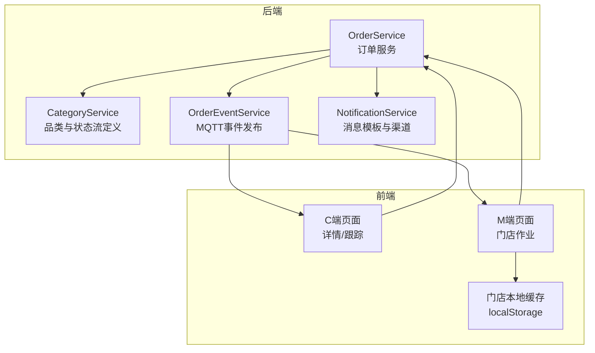
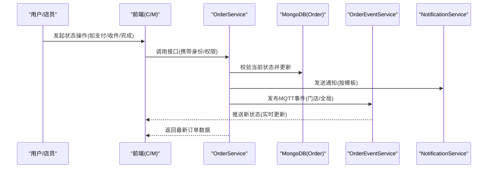
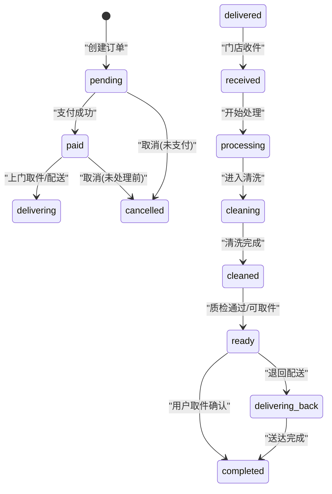
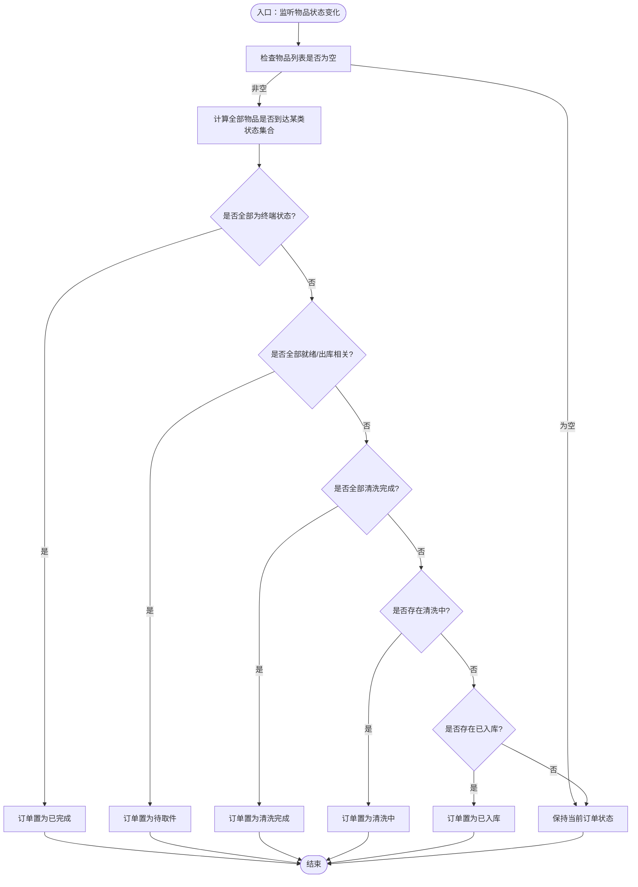
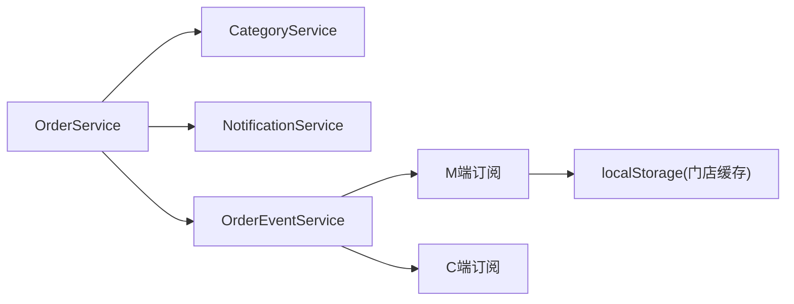

# 订单生命周期管理

<cite>
**本文引用的文件**   
- [orderService.js](file://backend/modules/cleaning/services/orderService.js)
- [categoryService.js](file://backend/modules/common/services/categoryService.js)
- [notificationService.js](file://backend/modules/common/services/notificationService.js)
- [orderEventService.js](file://backend/services/orderEventService.js)
- [index.html](file://index.html)
- [m-index.html](file://m-index.html)
- [c-order-detail.html](file://c-order-detail.html)
</cite>

## 目录
1. [引言](#引言)
2. [项目结构](#项目结构)
3. [核心组件](#核心组件)
4. [架构总览](#架构总览)
5. [详细组件分析](#详细组件分析)
6. [依赖关系分析](#依赖关系分析)
7. [性能与一致性考虑](#性能与一致性考虑)
8. [故障排查指南](#故障排查指南)
9. [结论](#结论)
10. [附录：状态字典与转换规则](#附录状态字典与转换规则)

## 引言
本文件系统化梳理干洗系统“订单生命周期”的状态机设计、流转条件、权限控制、通知机制与历史记录追踪，并给出异常处理与回滚策略建议。目标覆盖从创建到完成的完整流程，包括待支付、已支付、配送中、已入库、处理中、清洗中、清洗完成、待取件、送回中、已完成、已取消等关键状态及其业务含义与触发条件。

## 项目结构
围绕订单生命周期，后端以服务层为核心，结合品类配置、事件发布与通知模板，前端在C端/M端/门店端进行状态展示与操作。

图表来源
- [orderService.js:121-138](file://backend/modules/cleaning/services/orderService.js#L121-L138)
- [categoryService.js:15-45](file://backend/modules/common/services/categoryService.js#L15-L45)
- [orderEventService.js:14-110](file://backend/services/orderEventService.js#L14-L110)
- [notificationService.js:9-72](file://backend/modules/common/services/notificationService.js#L9-L72)

章节来源
- [orderService.js:121-138](file://backend/modules/cleaning/services/orderService.js#L121-L138)
- [categoryService.js:15-45](file://backend/modules/common/services/categoryService.js#L15-L45)
- [orderEventService.js:14-110](file://backend/services/orderEventService.js#L14-L110)
- [notificationService.js:9-72](file://backend/modules/common/services/notificationService.js#L9-L72)

## 核心组件
- 订单服务（OrderService）
  - 负责订单的创建、支付、收件、开始处理、完成清洗、用户取件、通用状态更新、配送状态设置等。
  - 维护订单级 status 与 items[].status，并在每次变更时写入 statusHistory。
- 品类服务（CategoryService）
  - 定义各品类的标准状态流（如干洗、洗鞋、奢侈品护理、宠物洗护、电子维修、租赁等），用于前端渲染与校验参考。
- 订单事件服务（OrderEventService）
  - 将订单关键事件通过 MQTT 推送至门店级与全局主题，同时写入通知中心与跨端同步记录。
- 通知服务（NotificationService）
  - 提供多业务模板与多渠道发送能力（微信、短信、推送、电话），按模板渲染后分发。

章节来源
- [orderService.js:177-291](file://backend/modules/cleaning/services/orderService.js#L177-L291)
- [orderService.js:521-564](file://backend/modules/cleaning/services/orderService.js#L521-L564)
- [orderService.js:667-715](file://backend/modules/cleaning/services/orderService.js#L667-L715)
- [orderService.js:721-757](file://backend/modules/cleaning/services/orderService.js#L721-L757)
- [orderService.js:763-803](file://backend/modules/cleaning/services/orderService.js#L763-L803)
- [orderService.js:809-846](file://backend/modules/cleaning/services/orderService.js#L809-L846)
- [orderService.js:853-930](file://backend/modules/cleaning/services/orderService.js#L853-L930)
- [orderService.js:936-975](file://backend/modules/cleaning/services/orderService.js#L936-L975)
- [categoryService.js:15-45](file://backend/modules/common/services/categoryService.js#L15-L45)
- [orderEventService.js:69-168](file://backend/services/orderEventService.js#L69-L168)
- [notificationService.js:177-281](file://backend/modules/common/services/notificationService.js#L177-L281)

## 架构总览
订单状态由后端统一维护，前端仅做展示与触发；状态变更会持久化到数据库，并通过事件总线实时同步到各端。

图表来源
- [orderService.js:521-564](file://backend/modules/cleaning/services/orderService.js#L521-L564)
- [orderService.js:667-715](file://backend/modules/cleaning/services/orderService.js#L667-L715)
- [orderService.js:721-757](file://backend/modules/cleaning/services/orderService.js#L721-L757)
- [orderService.js:763-803](file://backend/modules/cleaning/services/orderService.js#L763-L803)
- [orderService.js:809-846](file://backend/modules/cleaning/services/orderService.js#L809-L846)
- [orderService.js:853-930](file://backend/modules/cleaning/services/orderService.js#L853-L930)
- [orderEventService.js:77-144](file://backend/services/orderEventService.js#L77-L144)
- [notificationService.js:188-211](file://backend/modules/common/services/notificationService.js#L188-L211)

## 详细组件分析

### 状态机与流转规则
- 订单级状态枚举（示例）
  - pending（待支付）、paid（已支付）、delivering（配送中/取件中）、received（已入库）、processing（处理中）、cleaning（清洗中）、cleaned（清洗完成）、ready（待取件）、delivering_back（送回中）、completed（已完成）、cancelled（已取消）
  - 扩展态：awaiting_pickup_scan（等待扫码取件）、awaiting_store_outbound（等待门店出库）、store_outbound（商家已完成出库）
- 典型流转路径
  - 下单→待支付→已支付→配送中→已入库→处理中→清洗中→清洗完成→待取件→已完成
  - 双向跑腿：已支付→配送中→已入库→处理中→清洗完成→待取件→送回中→已完成
  - 取消：待支付/已支付→已取消
- 物品级状态与订单级联动
  - 当所有物品达到终端状态时，订单自动推进为 completed；当所有物品就绪/清洗完成/清洗中等，订单级状态相应推导。

图表来源
- [orderService.js:121-138](file://backend/modules/cleaning/services/orderService.js#L121-L138)
- [orderService.js:521-564](file://backend/modules/cleaning/services/orderService.js#L521-L564)
- [orderService.js:667-715](file://backend/modules/cleaning/services/orderService.js#L667-L715)
- [orderService.js:721-757](file://backend/modules/cleaning/services/orderService.js#L721-L757)
- [orderService.js:763-803](file://backend/modules/cleaning/services/orderService.js#L763-L803)
- [orderService.js:809-846](file://backend/modules/cleaning/services/orderService.js#L809-L846)
- [orderService.js:936-975](file://backend/modules/cleaning/services/orderService.js#L936-L975)

#### 权限控制与触发条件
- 支付：仅订单所有者可操作，且必须处于待支付。
- 取消：订单所有者或管理员可在未进入处理阶段前取消。
- 收件：门店人员可将 paid/delivering 转为 received。
- 开始处理/完成清洗/取件确认：门店人员或用户本人按角色限制执行。
- 通用状态更新：支持更宽泛的流转映射，但会记录非常规流转日志。

章节来源
- [orderService.js:521-564](file://backend/modules/cleaning/services/orderService.js#L521-L564)
- [orderService.js:569-616](file://backend/modules/cleaning/services/orderService.js#L569-L616)
- [orderService.js:667-715](file://backend/modules/cleaning/services/orderService.js#L667-L715)
- [orderService.js:721-757](file://backend/modules/cleaning/services/orderService.js#L721-L757)
- [orderService.js:763-803](file://backend/modules/cleaning/services/orderService.js#L763-L803)
- [orderService.js:809-846](file://backend/modules/cleaning/services/orderService.js#L809-L846)
- [orderService.js:853-930](file://backend/modules/cleaning/services/orderService.js#L853-L930)

#### 通知机制
- 每个关键状态变更都会调用通知服务，按模板渲染标题与正文，并通过多渠道发送。
- 同时通过事件服务发布 MQTT 事件，供 M 端与 Admin 端实时刷新。

章节来源
- [orderService.js:276-288](file://backend/modules/cleaning/services/orderService.js#L276-L288)
- [orderService.js:550-564](file://backend/modules/cleaning/services/orderService.js#L550-L564)
- [orderService.js:599-616](file://backend/modules/cleaning/services/orderService.js#L599-L616)
- [orderService.js:700-715](file://backend/modules/cleaning/services/orderService.js#L700-L715)
- [orderService.js:743-757](file://backend/modules/cleaning/services/orderService.js#L743-L757)
- [orderService.js:788-803](file://backend/modules/cleaning/services/orderService.js#L788-L803)
- [orderService.js:832-846](file://backend/modules/cleaning/services/orderService.js#L832-L846)
- [notificationService.js:188-211](file://backend/modules/common/services/notificationService.js#L188-L211)
- [orderEventService.js:77-144](file://backend/services/orderEventService.js#L77-L144)

#### 状态历史记录（statusHistory）
- 每次状态变更均追加一条记录，包含：新状态、时间、操作者ID、备注。
- 查询详情时会附加 latestHistory 以便快速展示最近一次变更。

章节来源
- [orderService.js:266-274](file://backend/modules/cleaning/services/orderService.js#L266-L274)
- [orderService.js:541-548](file://backend/modules/cleaning/services/orderService.js#L541-L548)
- [orderService.js:580-588](file://backend/modules/cleaning/services/orderService.js#L580-L588)
- [orderService.js:688-694](file://backend/modules/cleaning/services/orderService.js#L688-L694)
- [orderService.js:730-737](file://backend/modules/cleaning/services/orderService.js#L730-L737)
- [orderService.js:776-782](file://backend/modules/cleaning/services/orderService.js#L776-L782)
- [orderService.js:824-830](file://backend/modules/cleaning/services/orderService.js#L824-L830)
- [orderService.js:898-903](file://backend/modules/cleaning/services/orderService.js#L898-L903)
- [orderService.js:490-502](file://backend/modules/cleaning/services/orderService.js#L490-L502)

#### 前端自动状态推导与保护
- 门店端根据物品状态汇总计算订单级状态，并同步到本地缓存与客户端视图。
- C端具备防抖与状态保护逻辑，防止旧数据导致状态回退。

章节来源
- [index.html:7868-7887](file://index.html#L7868-L7887)
- [index.html:8056-8081](file://index.html#L8056-L8081)
- [m-index.html:7416-7429](file://m-index.html#L7416-L7429)
- [c-order-detail.html:2888-2970](file://c-order-detail.html#L2888-L2970)

### 复杂逻辑流程图（自动状态推导）

图表来源
- [index.html:7868-7887](file://index.html#L7868-L7887)
- [index.html:8056-8081](file://index.html#L8056-L8081)

## 依赖关系分析
- OrderService 依赖 CategoryService 获取品类状态流（用于前端展示与校验参考）。
- OrderService 在关键节点调用 NotificationService 发送通知，并调用 OrderEventService 发布 MQTT 事件。
- 前端（C/M/门店）通过 REST 与 MQTT 双通道接收状态更新，并结合本地缓存进行展示。

图表来源
- [orderService.js:177-291](file://backend/modules/cleaning/services/orderService.js#L177-L291)
- [categoryService.js:250-253](file://backend/modules/common/services/categoryService.js#L250-L253)
- [orderEventService.js:77-144](file://backend/services/orderEventService.js#L77-L144)
- [index.html:8056-8081](file://index.html#L8056-L8081)

章节来源
- [orderService.js:177-291](file://backend/modules/cleaning/services/orderService.js#L177-L291)
- [categoryService.js:250-253](file://backend/modules/common/services/categoryService.js#L250-L253)
- [orderEventService.js:77-144](file://backend/services/orderEventService.js#L77-L144)
- [index.html:8056-8081](file://index.html#L8056-L8081)

## 性能与一致性考虑
- 幂等性：同一状态多次触发应保证结果一致（例如重复支付回调）。
- 并发安全：使用数据库事务或乐观锁避免竞态条件。
- 事件去重：MQTT 事件在前端侧做去重与冷却期控制，避免抖动。
- 状态保护：C端对已完成订单拒绝回退，localStorage 状态不得低于 API 已确认状态。

[本节为通用指导，不直接分析具体文件]

## 故障排查指南
- 常见错误
  - 无权操作：检查用户角色与订单归属。
  - 状态不允许：核对当前状态是否在允许的前驱集合内。
  - 通知失败：检查模板键是否存在、渠道是否可用。
  - 事件未推送：检查 MQTT 连接与主题订阅。
- 定位方法
  - 查看 statusHistory 最后一条记录，确认最近一次变更主体与备注。
  - 检查订单详情中的 latestHistory 字段。
  - 观察 MQTT 控制台输出与前端日志。

章节来源
- [orderService.js:521-564](file://backend/modules/cleaning/services/orderService.js#L521-L564)
- [orderService.js:569-616](file://backend/modules/cleaning/services/orderService.js#L569-L616)
- [orderService.js:667-715](file://backend/modules/cleaning/services/orderService.js#L667-L715)
- [orderService.js:721-757](file://backend/modules/cleaning/services/orderService.js#L721-L757)
- [orderService.js:763-803](file://backend/modules/cleaning/services/orderService.js#L763-L803)
- [orderService.js:809-846](file://backend/modules/cleaning/services/orderService.js#L809-L846)
- [orderService.js:853-930](file://backend/modules/cleaning/services/orderService.js#L853-L930)
- [orderEventService.js:77-144](file://backend/services/orderEventService.js#L77-L144)
- [c-order-detail.html:2888-2970](file://c-order-detail.html#L2888-L2970)

## 结论
本方案以 OrderService 为中心，结合品类状态流、通知模板与 MQTT 事件，构建了稳健的订单生命周期管理。通过严格的权限校验、详尽的历史记录与前端状态保护，确保状态一致性与用户体验。建议在后续迭代中引入更强的幂等与回滚机制，进一步提升系统在异常场景下的鲁棒性。

[本节为总结，不直接分析具体文件]

## 附录：状态字典与转换规则
- 状态字典（示例）
  - pending：待支付
  - paid：已支付
  - delivering：配送中/取件中
  - received：已入库
  - processing：处理中
  - cleaning：清洗中
  - cleaned：清洗完成
  - ready：待取件
  - delivering_back：送回中
  - completed：已完成
  - cancelled：已取消
  - awaiting_pickup_scan：等待扫码取件
  - awaiting_store_outbound：等待门店出库
  - store_outbound：商家已完成出库
- 转换规则要点
  - 支付：pending → paid
  - 收件：paid/delivering → received
  - 开始处理：received → processing
  - 清洗中：processing → cleaning
  - 清洗完成：cleaning → cleaned
  - 待取件：cleaned/processing → ready
  - 取件完成：ready → completed
  - 取消：pending/paid → cancelled
  - 送回：ready → delivering_back → completed

章节来源
- [orderService.js:121-138](file://backend/modules/cleaning/services/orderService.js#L121-L138)
- [orderService.js:521-564](file://backend/modules/cleaning/services/orderService.js#L521-L564)
- [orderService.js:667-715](file://backend/modules/cleaning/services/orderService.js#L667-L715)
- [orderService.js:721-757](file://backend/modules/cleaning/services/orderService.js#L721-L757)
- [orderService.js:763-803](file://backend/modules/cleaning/services/orderService.js#L763-L803)
- [orderService.js:809-846](file://backend/modules/cleaning/services/orderService.js#L809-L846)
- [orderService.js:936-975](file://backend/modules/cleaning/services/orderService.js#L936-L975)
- [categoryService.js:15-45](file://backend/modules/common/services/categoryService.js#L15-L45)