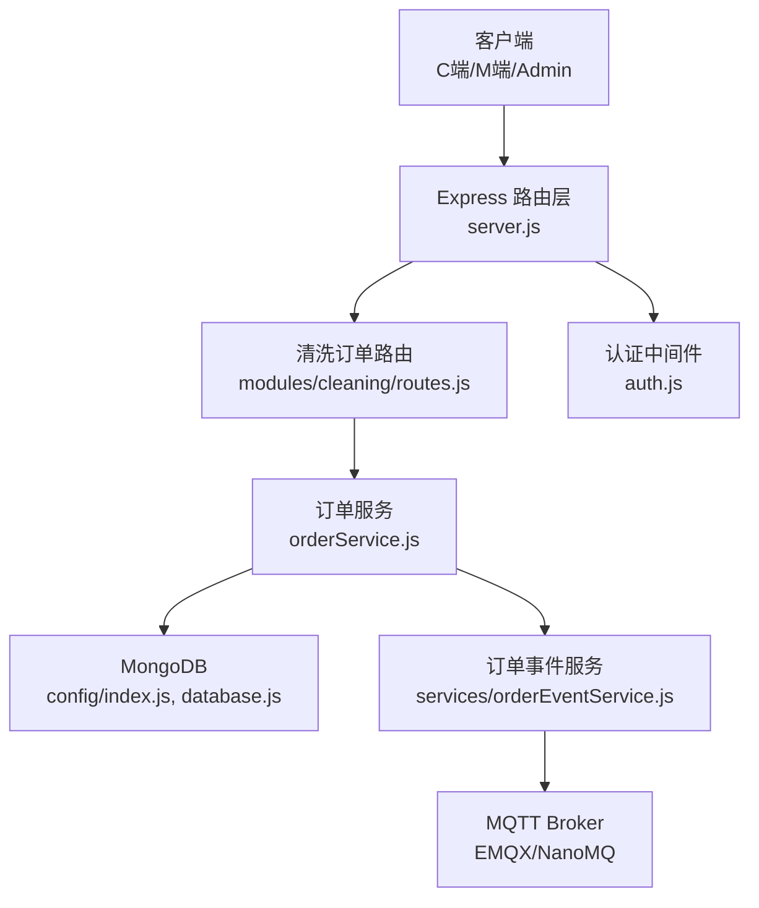
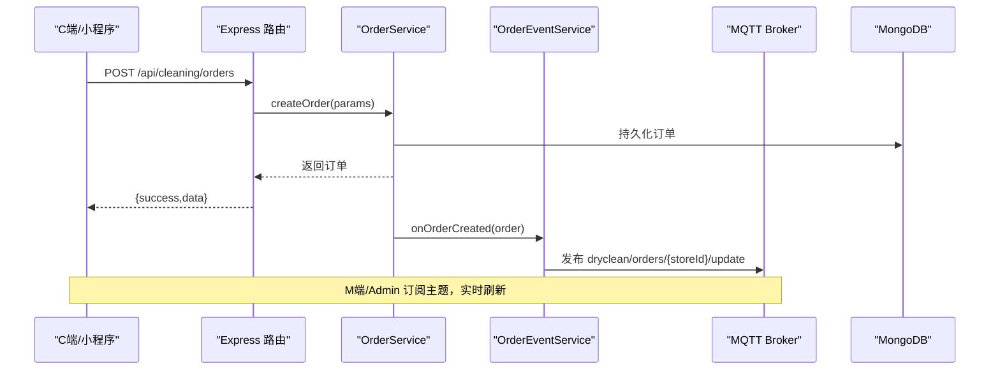
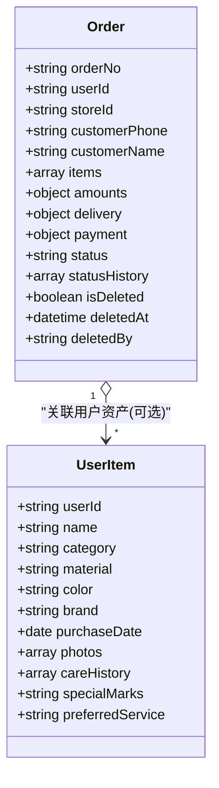
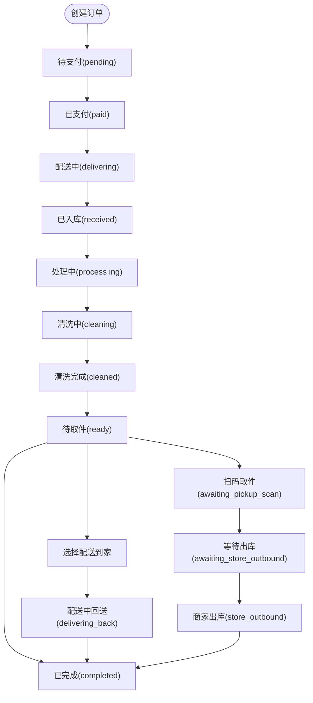
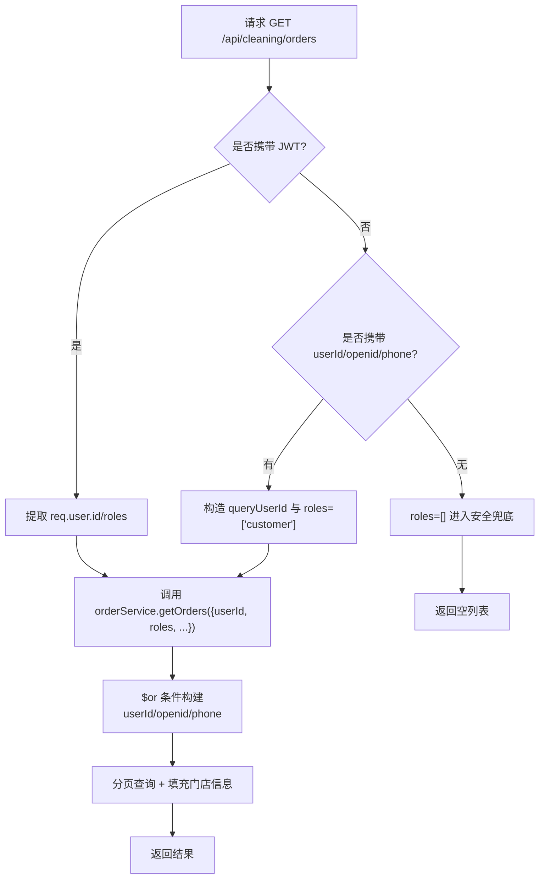
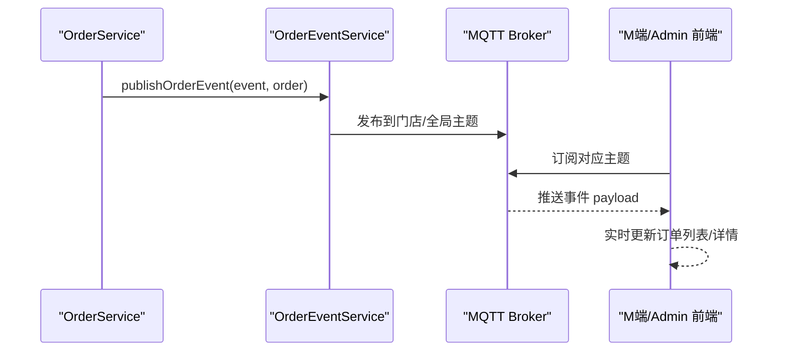
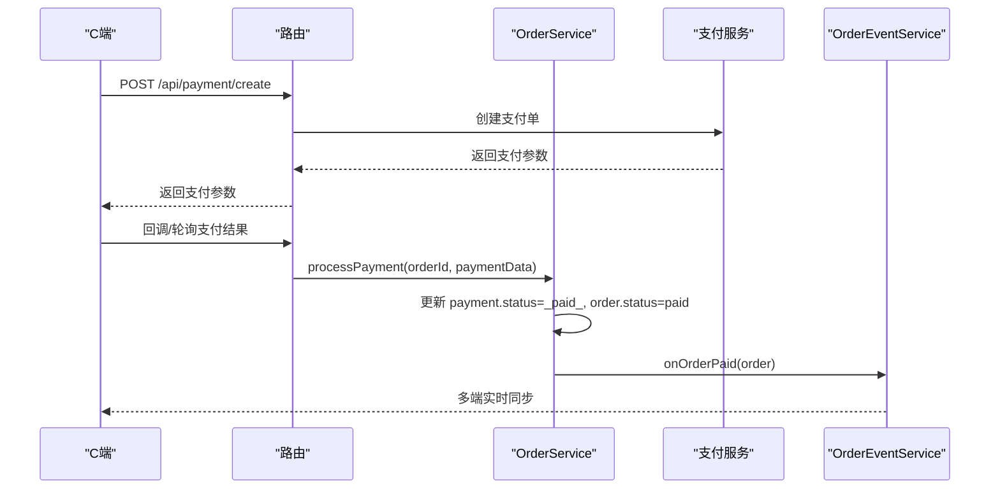
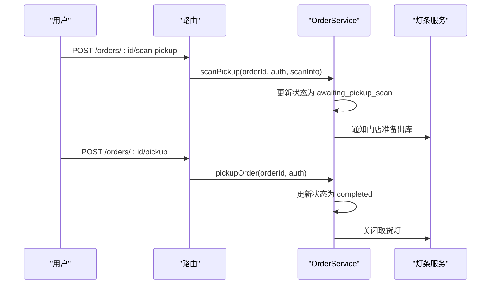
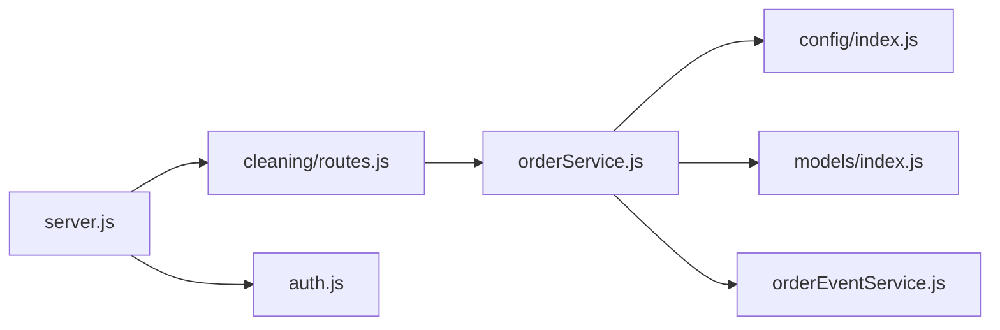

# 订单管理系统

<cite>
**本文引用的文件列表**
- [backend/server.js](file://backend/server.js)
- [backend/modules/cleaning/routes.js](file://backend/modules/cleaning/routes.js)
- [backend/modules/cleaning/services/orderService.js](file://backend/modules/cleaning/services/orderService.js)
- [backend/modules/common/models/index.js](file://backend/modules/common/models/index.js)
- [backend/config/database.js](file://backend/config/database.js)
- [backend/config/index.js](file://backend/config/index.js)
- [backend/services/orderEventService.js](file://backend/services/orderEventService.js)
- [backend/modules/common/middlewares/auth.js](file://backend/modules/common/middlewares/auth.js)
- [api/API_DOCUMENTATION.md](file://api/API_DOCUMENTATION.md)
</cite>

## 目录
1. [简介](#简介)
2. [项目结构](#项目结构)
3. [核心组件](#核心组件)
4. [架构总览](#架构总览)
5. [详细组件分析](#详细组件分析)
6. [依赖关系分析](#依赖关系分析)
7. [性能与扩展性](#性能与扩展性)
8. [故障排查指南](#故障排查指南)
9. [结论](#结论)
10. [附录：API 接口文档](#附录api-接口文档)

## 简介
本系统为干洗店订单管理后端，覆盖从下单、支付、取件/配送、清洗处理到完成的全生命周期。系统采用模块化 Express 路由 + 服务层（OrderService）+ MongoDB 数据模型的设计，支持多端（C端小程序、M端门店、Admin）协同，并通过 MQTT 实现订单状态实时同步。同时提供软删除、状态历史追踪、跨平台查询（用户ID/手机号）等高级能力。

## 项目结构
- 入口与路由挂载：Express 应用统一注册各模块路由，包括清洗订单、支付、配送、会员、管理等。
- 业务模块：cleaning 模块负责订单全链路；common 模块提供认证、权限、通知、消息中心等通用能力。
- 数据层：MongoDB 为主存储，支持 MySQL 配置（当前默认使用 MongoDB）。
- 事件总线：通过 orderEventService 将订单关键事件发布至 MQTT，供 M 端/Admin 实时订阅。

图表来源
- [backend/server.js:96-151](file://backend/server.js#L96-L151)
- [backend/modules/cleaning/routes.js:1-120](file://backend/modules/cleaning/routes.js#L1-L120)
- [backend/modules/cleaning/services/orderService.js:1-120](file://backend/modules/cleaning/services/orderService.js#L1-L120)
- [backend/config/index.js:1-60](file://backend/config/index.js#L1-L60)
- [backend/config/database.js:1-65](file://backend/config/database.js#L1-L65)
- [backend/services/orderEventService.js:1-120](file://backend/services/orderEventService.js#L1-L120)
- [backend/modules/common/middlewares/auth.js:1-120](file://backend/modules/common/middlewares/auth.js#L1-L120)

章节来源
- [backend/server.js:96-151](file://backend/server.js#L96-L151)
- [backend/modules/cleaning/routes.js:1-120](file://backend/modules/cleaning/routes.js#L1-L120)
- [backend/config/index.js:1-60](file://backend/config/index.js#L1-L60)
- [backend/config/database.js:1-65](file://backend/config/database.js#L1-L65)

## 核心组件
- 订单服务（OrderService）：封装订单创建、查询、支付、取消、状态流转、取件/配送、软删除、统计等核心逻辑。
- 订单事件服务（OrderEventService）：将订单关键事件通过 MQTT 广播，并写入通知中心与跨端同步记录。
- 认证中间件（auth.js）：提供可选/强制认证与角色校验，支持开发模式 mock token。
- 数据库连接管理（config/index.js + database.js）：统一初始化 MongoDB/MySQL 连接池，提供事务与便捷查询方法。
- 清洗模块路由（cleaning/routes.js）：暴露订单 CRUD、状态更新、取件方式选择、配送费支付、扫码取件等 HTTP 接口。

章节来源
- [backend/modules/cleaning/services/orderService.js:177-291](file://backend/modules/cleaning/services/orderService.js#L177-L291)
- [backend/services/orderEventService.js:69-168](file://backend/services/orderEventService.js#L69-L168)
- [backend/modules/common/middlewares/auth.js:10-137](file://backend/modules/common/middlewares/auth.js#L10-L137)
- [backend/config/index.js:19-88](file://backend/config/index.js#L19-L88)
- [backend/config/database.js:6-65](file://backend/config/database.js#L6-L65)
- [backend/modules/cleaning/routes.js:20-120](file://backend/modules/cleaning/routes.js#L20-L120)

## 架构总览
系统采用“路由层 → 服务层 → 数据层”的清晰分层，结合事件驱动（MQTT）实现多端实时同步。

图表来源
- [backend/modules/cleaning/routes.js:24-42](file://backend/modules/cleaning/routes.js#L24-L42)
- [backend/modules/cleaning/services/orderService.js:181-291](file://backend/modules/cleaning/services/orderService.js#L181-L291)
- [backend/services/orderEventService.js:146-149](file://backend/services/orderEventService.js#L146-L149)

## 详细组件分析

### 数据模型设计（Order 与 UserItem）
- Order（订单）
  - 关键字段：orderNo、userId、storeId、customerPhone/customerName、items[]、amounts{}、delivery{}、payment{}、status、statusHistory[]、isDeleted/deletedAt/deletedBy 等。
  - 字段含义与规则：
    - items：物品明细，含名称、类型、服务类型、材质、价格、数量、小计、特殊要求、取件码、物品级状态。
    - delivery：配送信息（自提/配送）、联系人、电话、费用、配送员信息等。
    - payment：支付状态、支付方式、交易号、支付时间。
    - status：订单主状态机（见下节）。
    - statusHistory：状态变更历史，包含时间、操作人、备注。
    - isDeleted：软删除标记，默认 false；deletedAt/deletedBy 记录删除时间与操作人。
- UserItem（用户物品档案）
  - 关键字段：userId、name、category、material、color、brand、purchaseDate、photos[]、careHistory[]、specialMarks、preferredService。
  - 用于维护用户资产与护理历史，便于个性化推荐与服务追溯。

图表来源
- [backend/modules/cleaning/services/orderService.js:33-175](file://backend/modules/cleaning/services/orderService.js#L33-L175)

章节来源
- [backend/modules/cleaning/services/orderService.js:33-175](file://backend/modules/cleaning/services/orderService.js#L33-L175)
- [backend/modules/common/models/index.js:231-393](file://backend/modules/common/models/index.js#L231-L393)

### 订单状态机与流转
- 状态集合（部分）：pending、paid、delivering、received、processing、cleaning、cleaned、ready、delivering_back、completed、cancelled、awaiting_pickup_scan、awaiting_store_outbound、store_outbound。
- 典型流转路径：
  - 创建 → pending → paid → delivering（上门取件或送店）→ received（入库）→ processing → cleaning → cleaned → ready → completed（用户取件确认）
  - 若选择配送到家：ready → selecting home_delivery → delivering_back → completed
  - 扫码取件流程：ready → awaiting_pickup_scan → awaiting_store_outbound → store_outbound → completed
- 状态更新策略：
  - updateOrderStatus 允许更灵活的状态转换，非标准流转仅记录日志，不阻断执行。
  - 每次状态变更均追加 statusHistory 记录，包含时间、操作人、备注。

图表来源
- [backend/modules/cleaning/services/orderService.js:121-151](file://backend/modules/cleaning/services/orderService.js#L121-L151)
- [backend/modules/cleaning/services/orderService.js:853-930](file://backend/modules/cleaning/services/orderService.js#L853-L930)

章节来源
- [backend/modules/cleaning/services/orderService.js:121-151](file://backend/modules/cleaning/services/orderService.js#L121-L151)
- [backend/modules/cleaning/services/orderService.js:853-930](file://backend/modules/cleaning/services/orderService.js#L853-L930)

### 订单查询与权限控制
- 查询入口：GET /api/cleaning/orders
- 用户识别优先级：JWT 用户 > 查询参数 userId > openid > phone
- 跨平台查询增强：
  - 当传入 userId 时，使用 $or 匹配多种标识（_id/openid/phone），确保不同平台间同一用户的订单可见。
  - 当仅传入 phone 时，按 delivery.contactPhone 与 customerPhone 进行 $or 匹配，实现纯手机号跨平台查询。
- 权限过滤：
  - customer 只能查看自己的订单。
  - store_staff/store_owner 按 storeId 过滤。
  - 无 userId 且无门店角色时，返回空列表（安全兜底）。

图表来源
- [backend/modules/cleaning/routes.js:49-81](file://backend/modules/cleaning/routes.js#L49-L81)
- [backend/modules/cleaning/services/orderService.js:296-389](file://backend/modules/cleaning/services/orderService.js#L296-L389)

章节来源
- [backend/modules/cleaning/routes.js:49-81](file://backend/modules/cleaning/routes.js#L49-L81)
- [backend/modules/cleaning/services/orderService.js:296-389](file://backend/modules/cleaning/services/orderService.js#L296-L389)

### 订单事件驱动与 MQTT 实时同步
- 事件发布点：
  - 订单创建：onOrderCreated
  - 订单支付成功：onOrderPaid
  - 订单取消：onOrderCancelled
  - 订单状态变更：onOrderStatusChanged
- MQTT 主题：
  - 门店级：dryclean/orders/{storeId}/update（m-index 订阅）
  - 全局级：dryclean/orders/all/update（admin 订阅）
- 附加动作：
  - 写入通知中心（Admin 轮询获取）
  - 记录跨端操作来源（index ↔ m-index）
  - 对 C 端/微信操作写入消息中心（客户可见）

图表来源
- [backend/services/orderEventService.js:77-144](file://backend/services/orderEventService.js#L77-L144)

章节来源
- [backend/services/orderEventService.js:77-144](file://backend/services/orderEventService.js#L77-L144)

### 订单支付与配送流程
- 支付：
  - 统一支付入口：POST /api/payment/create（支持微信/支付宝/银联/余额）
  - 微信小程序统一下单：POST /api/payment/wechat/unified（未配置时走模拟支付）
  - 支付成功后，OrderService 更新 payment 与订单状态为 paid，并发布事件。
- 配送：
  - 选择取件方式：POST /api/cleaning/orders/:id/pickup-method（到店自提/配送到家）
  - 支付配送费：POST /api/cleaning/orders/:id/pay-delivery-fee（跑腿服务商）
  - 选择跑腿服务商：POST /api/cleaning/orders/:id/select-provider
  - 触发配送服务：内部调用 deliveryService.createDelivery，失败则回退模拟 ID 保证流程继续。

图表来源
- [backend/server.js:410-502](file://backend/server.js#L410-L502)
- [backend/modules/cleaning/services/orderService.js:1056-1120](file://backend/modules/cleaning/services/orderService.js#L1056-L1120)
- [backend/services/orderEventService.js:151-154](file://backend/services/orderEventService.js#L151-L154)

章节来源
- [backend/server.js:410-502](file://backend/server.js#L410-L502)
- [backend/modules/cleaning/services/orderService.js:1056-1120](file://backend/modules/cleaning/services/orderService.js#L1056-L1120)

### 取件与配送交互
- 用户取件确认：POST /api/cleaning/orders/:id/pickup（ready → completed）
- 扫码取件：POST /api/cleaning/orders/:id/scan-pickup（ready → awaiting_pickup_scan → awaiting_store_outbound → store_outbound → completed）
- 一键取货（批量）：POST /api/cleaning/orders/batch-pickup（门店端）
- 智能灯条联动：根据取件/出库动作触发门店灯条提示（蓝色=备货出库，绿色=可取件等）

图表来源
- [backend/modules/cleaning/routes.js:260-270](file://backend/modules/cleaning/routes.js#L260-L270)
- [backend/modules/cleaning/services/orderService.js:1443-1504](file://backend/modules/cleaning/services/orderService.js#L1443-L1504)
- [backend/modules/cleaning/services/orderService.js:809-846](file://backend/modules/cleaning/services/orderService.js#L809-L846)

章节来源
- [backend/modules/cleaning/routes.js:260-270](file://backend/modules/cleaning/routes.js#L260-L270)
- [backend/modules/cleaning/services/orderService.js:1443-1504](file://backend/modules/cleaning/services/orderService.js#L1443-L1504)
- [backend/modules/cleaning/services/orderService.js:809-846](file://backend/modules/cleaning/services/orderService.js#L809-L846)

### 软删除与状态历史
- 软删除：POST /api/cleaning/orders/:id/delete
  - 仅终态订单（completed/cancelled/delivered）可删除。
  - 设置 isDeleted=true，并记录 deletedAt/deletedBy。
  - 常规查询默认排除已删除订单（可通过 includeDeleted 显式包含）。
- 状态历史：
  - 所有状态变更均追加 statusHistory 条目，包含时间、操作人、备注。
  - 最新一条记录在详情接口中作为 latestHistory 返回。

章节来源
- [backend/modules/cleaning/routes.js:179-189](file://backend/modules/cleaning/routes.js#L179-L189)
- [backend/modules/cleaning/services/orderService.js:623-660](file://backend/modules/cleaning/services/orderService.js#L623-L660)
- [backend/modules/cleaning/services/orderService.js:896-916](file://backend/modules/cleaning/services/orderService.js#L896-L916)

## 依赖关系分析
- 路由层依赖服务层：cleaning/routes.js 调用 orderService.js 中的方法。
- 服务层依赖数据层：orderService.js 通过 config/index.js 提供的 mongoose 连接访问 MongoDB。
- 事件服务解耦：orderEventService 延迟加载 lightService/notificationHub/crossSync/messageService，避免循环依赖。
- 认证中间件：auth.js 提供 optionalAuth/authMiddleware，支持开发模式 mock token。

图表来源
- [backend/modules/cleaning/routes.js:1-40](file://backend/modules/cleaning/routes.js#L1-L40)
- [backend/modules/cleaning/services/orderService.js:1-20](file://backend/modules/cleaning/services/orderService.js#L1-L20)
- [backend/config/index.js:1-40](file://backend/config/index.js#L1-L40)
- [backend/modules/common/models/index.js:1-40](file://backend/modules/common/models/index.js#L1-L40)
- [backend/services/orderEventService.js:1-40](file://backend/services/orderEventService.js#L1-L40)
- [backend/server.js:96-151](file://backend/server.js#L96-L151)
- [backend/modules/common/middlewares/auth.js:1-40](file://backend/modules/common/middlewares/auth.js#L1-L40)

章节来源
- [backend/modules/cleaning/routes.js:1-40](file://backend/modules/cleaning/routes.js#L1-L40)
- [backend/modules/cleaning/services/orderService.js:1-20](file://backend/modules/cleaning/services/orderService.js#L1-L20)
- [backend/config/index.js:1-40](file://backend/config/index.js#L1-L40)
- [backend/modules/common/models/index.js:1-40](file://backend/modules/common/models/index.js#L1-L40)
- [backend/services/orderEventService.js:1-40](file://backend/services/orderEventService.js#L1-L40)
- [backend/server.js:96-151](file://backend/server.js#L96-L151)
- [backend/modules/common/middlewares/auth.js:1-40](file://backend/modules/common/middlewares/auth.js#L1-L40)

## 性能与扩展性
- 查询优化：getOrders 使用索引字段（userId、status、isDeleted）与分页 skip/limit；同时并行 countDocuments 提升分页体验。
- 状态更新：updateOrderStatus 放宽状态流转限制，减少异常分支，但保留状态历史审计。
- 事件异步：订单事件发布与通知发送均为异步，避免阻塞主流程。
- 可扩展点：
  - 新增业务品类：通过枚举与 JSON 字段隔离扩展（如回收/租赁）。
  - 新增支付方式：在统一支付入口增加分支即可。
  - 新增配送商：在 selectCourierProvider 与 payDeliveryFee 中扩展 providerFees 与触发逻辑。

[本节为通用指导，无需具体文件引用]

## 故障排查指南
- 认证失败：检查 Authorization 头格式与 token 有效性；开发环境可使用 dev-admin-/dev-chain-/mock_token_ 前缀快速调试。
- 订单不存在：确认传入的是 _id 还是 orderNo；接口支持两者自动识别。
- 状态不允许：检查当前订单状态是否符合目标状态的前置条件；必要时使用 updateOrderStatus 以宽松模式更新。
- MQTT 未连接：检查 EMQX/NanoMQ 服务状态与端口；前端会回退轮询模式。
- 支付回调：确认回调地址与签名验证逻辑；未配置时使用模拟支付。

章节来源
- [backend/modules/common/middlewares/auth.js:10-137](file://backend/modules/common/middlewares/auth.js#L10-L137)
- [backend/modules/cleaning/services/orderService.js:395-516](file://backend/modules/cleaning/services/orderService.js#L395-L516)
- [backend/modules/cleaning/services/orderService.js:853-930](file://backend/modules/cleaning/services/orderService.js#L853-L930)
- [backend/services/orderEventService.js:97-110](file://backend/services/orderEventService.js#L97-L110)
- [backend/server.js:498-502](file://backend/server.js#L498-L502)

## 结论
本订单管理系统以清晰的层次结构与事件驱动为核心，实现了从下单到完成的闭环流程，并提供跨平台查询、软删除、状态历史追踪等高级能力。通过 MQTT 实时同步，M 端与 Admin 能即时感知订单变化，提升运营效率与用户体验。

[本节为总结，无需具体文件引用]

## 附录：API 接口文档

### 清洗订单模块（/api/cleaning）
- 创建订单
  - 方法：POST /api/cleaning/orders
  - 请求体：{ userId/openid, storeId, items[], delivery?, amounts?, deliveryMethod?, selectedProvider?, courierTracking?, notes?, categoryId?, categoryType? }
  - 响应：{ success, data: order }
- 获取订单列表
  - 方法：GET /api/cleaning/orders
  - 查询参数：page, pageSize, status, storeId, userId, openid, phone
  - 响应：{ success, data: { list, total, page, pageSize, totalPages } }
- 获取订单详情
  - 方法：GET /api/cleaning/orders/:id
  - 响应：{ success, data: order }
- 取消订单
  - 方法：POST /api/cleaning/orders/:id/cancel
  - 请求体：{ reason? }
  - 响应：{ success, data: order }
- 删除订单（软删除）
  - 方法：POST /api/cleaning/orders/:id/delete
  - 响应：{ success, data: { orderId, orderNo, status, isDeleted } }
- 门店收件
  - 方法：POST /api/cleaning/orders/:id/receive
  - 请求体：{ storeId? }
  - 响应：{ success, data: order }
- 开始处理（清洗中）
  - 方法：POST /api/cleaning/orders/:id/processing
  - 响应：{ success, data: order }
- 完成清洗
  - 方法：POST /api/cleaning/orders/:id/complete
  - 响应：{ success, data: order }
- 设置配送中
  - 方法：POST /api/cleaning/orders/:id/delivering
  - 请求体：{ deliveryInfo? }
  - 响应：{ success, data: order }
- 用户取件确认
  - 方法：POST /api/cleaning/orders/:id/pickup
  - 响应：{ success, data: order }
- 选择取件方式
  - 方法：POST /api/cleaning/orders/:id/pickup-method
  - 请求体：{ method, address?, contactName?, contactPhone? }
  - 响应：{ success, data: order }
- 支付配送费
  - 方法：POST /api/cleaning/orders/:id/pay-delivery-fee
  - 请求体：{ provider, fee, payTime? }
  - 响应：{ success, data: { orderId, status, deliveryStatus, paid } }
- 选择跑腿服务商
  - 方法：POST /api/cleaning/orders/:id/select-provider
  - 请求体：{ provider }
  - 响应：{ success, data: { orderId, deliveryMethod, selectedProvider, deliveryFee } }
- 用户扫码取件
  - 方法：POST /api/cleaning/orders/:id/scan-pickup
  - 请求体：{ pickupMethod?, scanTime? }
  - 响应：{ success, data: { orderId, status, pickupScannedAt } }
- 一键取货（批量）
  - 方法：POST /api/cleaning/orders/batch-pickup
  - 请求体：{ storeId }
  - 响应：{ success, data: { successCount, failedCount, orderIds } }
- 实时状态（轮询）
  - 方法：GET /api/cleaning/orders/:id/status
  - 响应：{ success, data: { orderId, orderNo, status, statusText, statusDescription, pickupMethod, deliveryMethod, deliveryType, selectedProvider, courier, deliveryStatus, items[], latestHistory, updatedAt } }
- 更新订单状态（门店端）
  - 方法：PUT /api/cleaning/orders/:id/status
  - 请求体：{ status, note?, items? }
  - 响应：{ success, data: { orderId, status, updatedAt } }

章节来源
- [backend/modules/cleaning/routes.js:20-650](file://backend/modules/cleaning/routes.js#L20-L650)

### 支付相关（/api/payment）
- 统一支付创建
  - 方法：POST /api/payment/create
  - 请求体：{ orderId, amount, subject?, body?, paymentMethod, userId?, openid?, returnUrl?, clientIp? }
  - 响应：{ success, data }
- 微信支付统一下单（小程序）
  - 方法：POST /api/payment/wechat/unified
  - 请求体：{ orderId, amount, openid, subject? }
  - 响应：{ success, data }
- 支付查询
  - 方法：GET /api/payment/query/:orderId
  - 响应：{ success, data }
- 支付回调
  - 方法：POST /api/payment/callback
  - 响应：{ success }

章节来源
- [backend/server.js:410-502](file://backend/server.js#L410-L502)

### 其他参考
- 聚合跑腿服务与支付 API 说明详见：
  - [api/API_DOCUMENTATION.md](file://api/API_DOCUMENTATION.md)

章节来源
- [api/API_DOCUMENTATION.md:1-273](file://api/API_DOCUMENTATION.md#L1-L273)