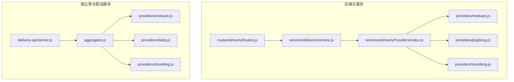
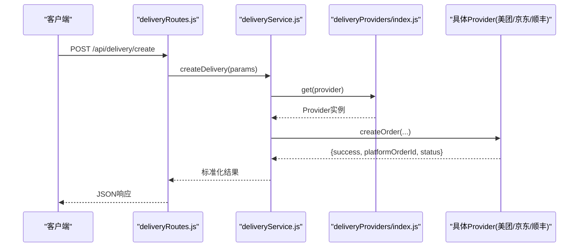
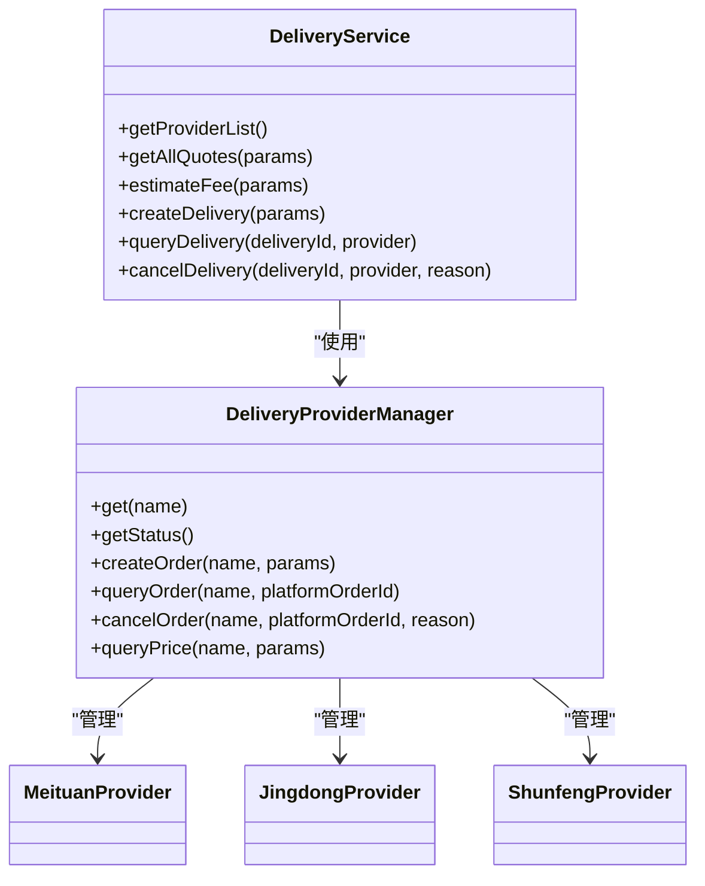

# 配送API接口参考

<cite>
**本文引用的文件**   
- [backend/modules/common/routes/deliveryRoutes.js](file://backend/modules/common/routes/deliveryRoutes.js)
- [backend/modules/common/services/deliveryService.js](file://backend/modules/common/services/deliveryService.js)
- [backend/services/deliveryProviders/index.js](file://backend/services/deliveryProviders/index.js)
- [backend/services/deliveryProviders/meituan.js](file://backend/services/deliveryProviders/meituan.js)
- [backend/services/deliveryProviders/jingdong.js](file://backend/services/deliveryProviders/jingdong.js)
- [backend/services/deliveryProviders/shunfeng.js](file://backend/services/deliveryProviders/shunfeng.js)
- [delivery-api/server.js](file://delivery-api/server.js)
- [delivery-api/aggregator.js](file://delivery-api/aggregator.js)
- [delivery-api/providers/meituan.js](file://delivery-api/providers/meituan.js)
- [delivery-api/providers/dada.js](file://delivery-api/providers/dada.js)
- [delivery-api/providers/shunfeng.js](file://delivery-api/providers/shunfeng.js)
- [api/API_DOCUMENTATION.md](file://api/API_DOCUMENTATION.md)
</cite>

## 目录
1. [简介](#简介)
2. [项目结构](#项目结构)
3. [核心组件](#核心组件)
4. [架构总览](#架构总览)
5. [详细接口说明](#详细接口说明)
6. [依赖关系分析](#依赖关系分析)
7. [性能与可用性](#性能与可用性)
8. [鉴权与安全](#鉴权与安全)
9. [版本管理与兼容性](#版本管理与兼容性)
10. [测试与调试](#测试与调试)
11. [故障排查](#故障排查)
12. [结论](#结论)

## 简介
本参考文档面向开发者，系统化梳理“干洗系统”中的配送相关RESTful API，覆盖下单、状态查询、费用估算、取消配送等核心能力。文档同时给出请求/响应示例、错误码约定、鉴权机制、版本与兼容策略，以及批量与异步处理的使用模式，帮助快速集成与联调。

## 项目结构
本项目包含两套与配送相关的实现：
- 后端主服务（Express + MongoDB）：提供统一的配送路由与服务层，聚合多家第三方跑腿平台（美团、京东秒送/达达、顺丰同城），并支持回调驱动订单状态更新与MQTT推送。
- 独立聚合配送服务（delivery-api）：独立的Express服务，提供多服务商询价、下单、查询、取消的统一入口，便于外部系统或前端直接调用。



**图示来源**
- [backend/modules/common/routes/deliveryRoutes.js:1-323](file://backend/modules/common/routes/deliveryRoutes.js#L1-L323)
- [backend/modules/common/services/deliveryService.js:1-322](file://backend/modules/common/services/deliveryService.js#L1-L322)
- [backend/services/deliveryProviders/index.js:1-87](file://backend/services/deliveryProviders/index.js#L1-L87)
- [backend/services/deliveryProviders/meituan.js:1-257](file://backend/services/deliveryProviders/meituan.js#L1-L257)
- [backend/services/deliveryProviders/jingdong.js:1-278](file://backend/services/deliveryProviders/jingdong.js#L1-L278)
- [backend/services/deliveryProviders/shunfeng.js:1-262](file://backend/services/deliveryProviders/shunfeng.js#L1-L262)
- [delivery-api/server.js:1-377](file://delivery-api/server.js#L1-L377)
- [delivery-api/aggregator.js:1-237](file://delivery-api/aggregator.js#L1-L237)
- [delivery-api/providers/meituan.js:1-231](file://delivery-api/providers/meituan.js#L1-L231)
- [delivery-api/providers/dada.js:1-237](file://delivery-api/providers/dada.js#L1-L237)
- [delivery-api/providers/shunfeng.js:1-256](file://delivery-api/providers/shunfeng.js#L1-L256)

**章节来源**
- [backend/modules/common/routes/deliveryRoutes.js:1-323](file://backend/modules/common/routes/deliveryRoutes.js#L1-L323)
- [delivery-api/server.js:1-377](file://delivery-api/server.js#L1-L377)

## 核心组件
- 统一路由层：对外暴露配送相关REST接口，负责参数校验、鉴权、异常封装与回调处理。
- 业务服务层：封装定价计算、报价排序、距离估算、拼单/一对一计费逻辑，并调度底层Provider。
- Provider管理器：按名称获取具体服务商实例，屏蔽真实/模拟模式差异。
- 各服务商实现：分别对接美团、京东秒送（达达）、顺丰同城，含签名、下单、查询、取消、价格估算及Mock降级。
- 独立聚合服务：对外提供跨平台的统一配送API，内部通过聚合器并行询价与自动优选。

**章节来源**
- [backend/modules/common/services/deliveryService.js:1-322](file://backend/modules/common/services/deliveryService.js#L1-L322)
- [backend/services/deliveryProviders/index.js:1-87](file://backend/services/deliveryProviders/index.js#L1-L87)
- [delivery-api/aggregator.js:1-237](file://delivery-api/aggregator.js#L1-L237)

## 架构总览
后端主服务采用“路由→服务→Provider管理器→具体Provider”的分层设计；独立聚合服务以“HTTP路由→聚合器→各Provider”的方式对外暴露统一接口。两者均支持真实API与Mock模式无缝切换。



**图示来源**
- [backend/modules/common/routes/deliveryRoutes.js:86-133](file://backend/modules/common/routes/deliveryRoutes.js#L86-L133)
- [backend/modules/common/services/deliveryService.js:44-70](file://backend/modules/common/services/deliveryService.js#L44-L70)
- [backend/services/deliveryProviders/index.js:57-62](file://backend/services/deliveryProviders/index.js#L57-L62)
- [backend/services/deliveryProviders/meituan.js:41-93](file://backend/services/deliveryProviders/meituan.js#L41-L93)
- [backend/services/deliveryProviders/jingdong.js:50-98](file://backend/services/deliveryProviders/jingdong.js#L50-L98)
- [backend/services/deliveryProviders/shunfeng.js:45-95](file://backend/services/deliveryProviders/shunfeng.js#L45-L95)

## 详细接口说明

### 一、后端主服务（推荐用于业务系统集成）
基础路径：/api/delivery

#### 1. 获取服务商接入状态
- 方法：GET
- 路径：/api/delivery/provider-status
- 鉴权：无需
- 说明：返回各服务商的启用状态与当前模式（real/mock），以及活跃跟踪任务数。
- 成功响应示例：
```json
{
  "success": true,
  "data": [
    {"code":"meituan","name":"美团跑腿","enabled":true,"mode":"mock"},
    {"code":"jingdong","name":"京东秒送","enabled":true,"mode":"mock"},
    {"code":"shunfeng","name":"顺丰同城","enabled":true,"mode":"mock"}
  ],
  "activeTrackingCount": 0
}
```
- 失败响应示例：无（该接口不抛错）

**章节来源**
- [backend/modules/common/routes/deliveryRoutes.js:12-26](file://backend/modules/common/routes/deliveryRoutes.js#L12-L26)

#### 2. 获取可用服务商列表（含报价配置）
- 方法：GET
- 路径：/api/delivery/providers
- 鉴权：无需
- 说明：返回所有可用服务商及其定价配置、评分、优惠信息等。
- 成功响应示例：
```json
{
  "success": true,
  "data": [
    {
      "id":"meituan",
      "name":"美团跑腿",
      "icon":"🛵",
      "rating":4.9,
      "pricing":{"solo":{"originalFee":12,"discount":3,"actualFee":9},"shared":{"originalFee":8.4,"discount":3.6,"actualFee":4.8}},
      "estimatedTime":"25-40分钟",
      "hasDiscount":true,
      "discountInfo":"新用户首单立减¥3"
    }
  ]
}
```

**章节来源**
- [backend/modules/common/routes/deliveryRoutes.js:28-35](file://backend/modules/common/routes/deliveryRoutes.js#L28-L35)
- [backend/modules/common/services/deliveryService.js:156-168](file://backend/modules/common/services/deliveryService.js#L156-L168)

#### 3. 一键获取所有服务商报价（含一对一/拼单）
- 方法：POST
- 路径：/api/delivery/quotes
- 鉴权：无需
- 请求体字段：
  - pickup: 对象，包含 latitude, longitude, address, contactName, contactPhone, storeId
  - delivery: 同上
  - distance: 可选，数值（km），若未传则按坐标计算
  - serviceTotal: 可选，数值（元），用于满减类优惠判断
  - isNewUser: 可选，布尔，是否新用户
- 成功响应示例：
```json
{
  "success": true,
  "data": [
    {
      "id":"meituan",
      "name":"美团跑腿",
      "distance":3.5,
      "distanceUnit":"km",
      "estimatedMinutes":20,
      "estimatedTime":"20-35分钟",
      "hasDiscount":true,
      "discountInfo":"新用户首单立减¥3",
      "pricing":{
        "solo":{"originalFee":12,"discount":3,"actualFee":9},
        "shared":{"originalFee":8.4,"discount":3.6,"actualFee":4.8}
      }
    }
  ]
}
```
- 失败响应示例：
```json
{
  "success": false,
  "error": "server_error",
  "message": "获取报价列表失败"
}
```

**章节来源**
- [backend/modules/common/routes/deliveryRoutes.js:37-59](file://backend/modules/common/routes/deliveryRoutes.js#L37-L59)
- [backend/modules/common/services/deliveryService.js:172-181](file://backend/modules/common/services/deliveryService.js#L172-L181)

#### 4. 估算配送费用（兼容旧接口，支持deliveryType）
- 方法：POST
- 路径：/api/delivery/estimate
- 鉴权：无需
- 请求体字段：
  - provider: 可选，字符串，如 meituan/jingdong/shunfeng
  - pickup, delivery: 同quotes
  - deliveryType: 可选，字符串，solo/shared
  - serviceTotal, isNewUser: 同quotes
- 成功响应示例：
```json
{
  "success": true,
  "data": {
    "provider":"meituan",
    "distance":3.5,
    "distanceUnit":"km",
    "fee":9,
    "originalFee":12,
    "discount":3,
    "currency":"CNY",
    "estimatedMinutes":20,
    "estimatedTime":"20-35分钟",
    "hasDiscount":true,
    "discountInfo":"新用户首单立减¥3",
    "deliveryType":"solo"
  }
}
```
- 失败响应示例：
```json
{
  "success": false,
  "error": "unknown_provider",
  "message": "不支持的服务商"
}
```

**章节来源**
- [backend/modules/common/routes/deliveryRoutes.js:61-84](file://backend/modules/common/routes/deliveryRoutes.js#L61-L84)
- [backend/modules/common/services/deliveryService.js:261-292](file://backend/modules/common/services/deliveryService.js#L261-L292)

#### 5. 创建配送订单
- 方法：POST
- 路径：/api/delivery/create
- 鉴权：需要（authMiddleware）
- 请求体字段：
  - orderId: 字符串，业务订单号
  - provider: 可选，字符串，默认meituan
  - pickup: 对象，包含 latitude, longitude, address, contactName, contactPhone, storeId
  - delivery: 对象，同上
- 成功响应示例：
```json
{
  "success": true,
  "provider": "meituan",
  "platformOrderId": "MTxxxxx",
  "status": "pending",
  "price": 9,
  "estimateTime": 25
}
```
- 失败响应示例：
```json
{
  "success": false,
  "error": "invalid_params",
  "message": "缺少必要参数"
}
```

**章节来源**
- [backend/modules/common/routes/deliveryRoutes.js:86-133](file://backend/modules/common/routes/deliveryRoutes.js#L86-L133)
- [backend/modules/common/services/deliveryService.js:44-70](file://backend/modules/common/services/deliveryService.js#L44-L70)

#### 6. 查询配送状态
- 方法：GET
- 路径：/api/delivery/status/:deliveryId
- 鉴权：需要（authMiddleware）
- 查询参数：
  - provider: 可选，字符串，默认meituan
- 成功响应示例：
```json
{
  "success": true,
  "provider": "meituan",
  "data": {
    "status": "delivering",
    "driverName": "张师傅",
    "driverPhone": "138****8888",
    "estimatedTime": 15,
    "distance": "3.5km"
  }
}
```
- 失败响应示例：
```json
{
  "success": false,
  "error": "server_error",
  "message": "查询配送状态失败"
}
```

**章节来源**
- [backend/modules/common/routes/deliveryRoutes.js:135-152](file://backend/modules/common/routes/deliveryRoutes.js#L135-L152)
- [backend/modules/common/services/deliveryService.js:74-101](file://backend/modules/common/services/deliveryService.js#L74-L101)

#### 7. 取消配送
- 方法：POST
- 路径：/api/delivery/cancel
- 鉴权：需要（authMiddleware）
- 请求体字段：
  - deliveryId: 字符串，平台订单号
  - provider: 可选，字符串，默认meituan
  - reason: 可选，字符串，取消原因
- 成功响应示例：
```json
{
  "success": true,
  "provider": "meituan",
  "platformOrderId": "MTxxxxx",
  "message": "已取消"
}
```
- 失败响应示例：
```json
{
  "success": false,
  "error": "server_error",
  "message": "取消配送失败"
}
```

**章节来源**
- [backend/modules/common/routes/deliveryRoutes.js:154-170](file://backend/modules/common/routes/deliveryRoutes.js#L154-L170)
- [backend/modules/common/services/deliveryService.js:105-115](file://backend/modules/common/services/deliveryService.js#L105-L115)

#### 8. 配送状态回调（由服务商回推）
- 方法：POST
- 路径：/api/delivery/callback
- 鉴权：无需（建议增加IP白名单/签名校验）
- 请求体字段：
  - deliveryId: 字符串，平台订单号
  - status: 字符串，平台状态码
  - driverInfo: 对象，包含 name, phone
  - location: 对象，包含 lat, lng, distance, eta
  - timestamp: 时间戳
  - description: 可选，描述
- 成功响应示例：
```json
{
  "success": true,
  "mappedStatus": "delivering"
}
```
- 失败响应示例：
```json
{
  "success": false,
  "error": "内部错误信息"
}
```

**章节来源**
- [backend/modules/common/routes/deliveryRoutes.js:172-280](file://backend/modules/common/routes/deliveryRoutes.js#L172-L280)

#### 9. 启动跑腿跟踪模拟（调试用）
- 方法：POST
- 路径：/api/delivery/:orderId/start-tracking
- 鉴权：无需
- 成功响应示例：
```json
{
  "success": true,
  "message": "配送跟踪已启动"
}
```

**章节来源**
- [backend/modules/common/routes/deliveryRoutes.js:282-311](file://backend/modules/common/routes/deliveryRoutes.js#L282-L311)

#### 10. 查询活跃跟踪任务（调试用）
- 方法：GET
- 路径：/api/delivery/tracking/active
- 鉴权：无需
- 成功响应示例：
```json
{
  "success": true,
  "count": 1,
  "data": [
    {"orderId":"xxx","status":"delivering","progress":70}
  ]
}
```

**章节来源**
- [backend/modules/common/routes/deliveryRoutes.js:313-320](file://backend/modules/common/routes/deliveryRoutes.js#L313-L320)

### 二、独立聚合配送服务（delivery-api）
基础路径：/api/delivery

#### 1. 健康检查
- 方法：GET
- 路径：/api/health
- 成功响应示例：
```json
{
  "status": "ok",
  "timestamp": "2025-01-01T00:00:00.000Z",
  "providers": [{"name":"美团跑腿","displayName":"美团跑腿"}]
}
```

**章节来源**
- [delivery-api/server.js:205-212](file://delivery-api/server.js#L205-L212)

#### 2. 获取可用服务商
- 方法：GET
- 路径：/api/delivery/providers
- 成功响应示例：
```json
{
  "success": true,
  "data": [
    {"name":"美团跑腿","displayName":"美团跑腿"},
    {"name":"京东秒送","displayName":"京东秒送"},
    {"name":"顺丰跑腿","displayName":"顺丰跑腿"}
  ]
}
```

**章节来源**
- [delivery-api/server.js:44-50](file://delivery-api/server.js#L44-L50)
- [delivery-api/aggregator.js:42-47](file://delivery-api/aggregator.js#L42-L47)

#### 3. 询价（多服务商并行）
- 方法：GET
- 路径：/api/delivery/query
- 查询参数：
  - pickupAddress: 取件地址
  - dropoffAddress: 送件地址
  - weight: 重量（kg），默认1
  - cityName: 城市名，默认北京
  - distance: 可选，距离（km）
- 成功响应示例：
```json
{
  "success": true,
  "quotes": [
    {"provider":"dada","price":10.5,"estimateTime":40,"distance":"4.0km"},
    {"provider":"meituan","price":12.0,"estimateTime":35,"distance":"3.5km"},
    {"provider":"shunfeng","price":15.0,"estimateTime":30,"distance":"3.8km"}
  ],
  "recommended": {"provider":"dada","price":10.5,"estimateTime":40}
}
```
- 失败响应示例：
```json
{
  "success": false,
  "message": "询价失败",
  "error": "上游超时"
}
```

**章节来源**
- [delivery-api/server.js:56-83](file://delivery-api/server.js#L56-L83)
- [delivery-api/aggregator.js:54-95](file://delivery-api/aggregator.js#L54-L95)

#### 4. 创建配送订单
- 方法：POST
- 路径：/api/delivery/create
- 请求体字段：
  - pickupAddress, dropoffAddress, customerName, customerPhone
  - shopName, shopPhone, goodsDesc, weight, orderId, cityName
  - provider: 可选，指定服务商
- 成功响应示例：
```json
{
  "success": true,
  "provider": "meituan",
  "providerName": "美团跑腿",
  "platformOrderId": "MTxxxxx",
  "status": "pending",
  "price": 12
}
```
- 失败响应示例：
```json
{
  "success": false,
  "message": "创建配送订单失败",
  "error": "参数缺失"
}
```

**章节来源**
- [delivery-api/server.js:89-154](file://delivery-api/server.js#L89-L154)
- [delivery-api/aggregator.js:137-197](file://delivery-api/aggregator.js#L137-L197)

#### 5. 查询订单状态
- 方法：GET
- 路径：/api/delivery/:provider/:orderId
- 成功响应示例：
```json
{
  "success": true,
  "provider": "meituan",
  "orderId": "MTxxxxx",
  "status": "delivering",
  "driver": {"name":"张师傅","phone":"138****8888"}
}
```
- 失败响应示例：
```json
{
  "success": false,
  "message": "查询订单状态失败",
  "error": "未知服务商"
}
```

**章节来源**
- [delivery-api/server.js:160-173](file://delivery-api/server.js#L160-L173)
- [delivery-api/aggregator.js:205-214](file://delivery-api/aggregator.js#L205-L214)

#### 6. 取消订单
- 方法：POST
- 路径：/api/delivery/:provider/:orderId/cancel
- 请求体字段：reason（可选）
- 成功响应示例：
```json
{
  "success": true,
  "provider": "meituan",
  "orderId": "MTxxxxx",
  "status": "cancelled",
  "message": "订单已取消"
}
```
- 失败响应示例：
```json
{
  "success": false,
  "message": "取消配送订单失败",
  "error": "上游拒绝"
}
```

**章节来源**
- [delivery-api/server.js:179-201](file://delivery-api/server.js#L179-L201)
- [delivery-api/aggregator.js:223-232](file://delivery-api/aggregator.js#L223-L232)

#### 7. 兼容接口（历史）
- GET /api/deliveries
- POST /api/deliveries
- PUT /api/deliveries/:id
- POST /api/deliveries/:id/cancel

**章节来源**
- [delivery-api/server.js:214-349](file://delivery-api/server.js#L214-L349)

### 三、C端预留接口（前端使用）
- 查询可用配送服务商：POST /api/delivery/query
- 创建配送订单：POST /api/delivery/{providerId}/create
- 查询配送状态：GET /api/delivery/status/{deliveryOrderId}
- 取消配送订单：POST /api/delivery/cancel

以上为C端预留接口定义，详见：
**章节来源**
- [api/API_DOCUMENTATION.md:123-227](file://api/API_DOCUMENTATION.md#L123-L227)

## 依赖关系分析
- 路由层仅依赖服务层，服务层通过Provider管理器动态选择具体实现。
- 各Provider实现遵循统一接口（createOrder/queryOrder/cancelOrder/queryPrice），并在无密钥时自动降级为Mock。
- 独立聚合服务通过聚合器并行询价与自动优选，降低前端复杂度。



**图示来源**
- [backend/modules/common/services/deliveryService.js:32-322](file://backend/modules/common/services/deliveryService.js#L32-L322)
- [backend/services/deliveryProviders/index.js:20-87](file://backend/services/deliveryProviders/index.js#L20-L87)
- [backend/services/deliveryProviders/meituan.js:15-257](file://backend/services/deliveryProviders/meituan.js#L15-L257)
- [backend/services/deliveryProviders/jingdong.js:17-278](file://backend/services/deliveryProviders/jingdong.js#L17-L278)
- [backend/services/deliveryProviders/shunfeng.js:15-262](file://backend/services/deliveryProviders/shunfeng.js#L15-L262)

**章节来源**
- [backend/modules/common/services/deliveryService.js:1-322](file://backend/modules/common/services/deliveryService.js#L1-L322)
- [backend/services/deliveryProviders/index.js:1-87](file://backend/services/deliveryProviders/index.js#L1-L87)

## 性能与可用性
- 并行询价：独立聚合服务对多服务商并行询价，显著降低整体延迟。
- Mock降级：当第三方API不可用时，Provider自动降级为Mock，保障开发联调与演示可用。
- 状态同步：回调接口将平台状态映射到系统courier状态，并通过MQTT推送至C端，提升实时性。

[本节为通用指导，不涉及具体文件分析]

## 鉴权与安全
- 鉴权方式：后端主服务的创建、查询、取消接口需携带认证令牌（authMiddleware）。
- 安全建议：
  - 回调接口建议增加IP白名单与签名校验。
  - 敏感参数（如商户密钥）应通过环境变量注入，避免硬编码。
  - 对外暴露接口建议使用HTTPS与限流策略。

**章节来源**
- [backend/modules/common/routes/deliveryRoutes.js:86-170](file://backend/modules/common/routes/deliveryRoutes.js#L86-L170)

## 版本管理与兼容性
- 向后兼容：
  - 后端主服务保留估算费用兼容接口（/api/delivery/estimate），支持deliveryType参数。
  - 独立聚合服务保留历史兼容接口（/api/deliveries*），便于旧客户端平滑迁移。
- 版本策略：
  - 新增功能优先在现有路径上扩展字段，避免破坏既有契约。
  - 重大变更通过新路径或版本号前缀发布，并保留旧路径一段时间。

**章节来源**
- [backend/modules/common/routes/deliveryRoutes.js:61-84](file://backend/modules/common/routes/deliveryRoutes.js#L61-L84)
- [delivery-api/server.js:214-349](file://delivery-api/server.js#L214-L349)

## 测试与调试
- 健康检查：GET /api/health（独立聚合服务）
- 服务商状态：GET /api/delivery/provider-status（后端主服务）
- 活跃跟踪任务：GET /api/delivery/tracking/active（后端主服务）
- 启动跟踪模拟：POST /api/delivery/:orderId/start-tracking（后端主服务）
- 常用工具：
  - curl/Postman：构造JSON请求，验证成功/失败分支。
  - 日志观察：关注服务端控制台输出，定位上游API失败与Mock降级情况。

**章节来源**
- [delivery-api/server.js:205-212](file://delivery-api/server.js#L205-L212)
- [backend/modules/common/routes/deliveryRoutes.js:282-320](file://backend/modules/common/routes/deliveryRoutes.js#L282-L320)

## 故障排查
- 常见问题：
  - 参数缺失：创建订单时需确保pickup/delivery必填字段完整。
  - 上游超时：Provider调用失败会降级为Mock，检查网络与密钥配置。
  - 状态不同步：确认回调接口正确接收并映射平台状态。
- 定位步骤：
  - 查看路由层日志与错误响应。
  - 检查Provider管理器返回的模式（real/mock）。
  - 核对回调映射表与数据库订单courier字段一致性。

**章节来源**
- [backend/modules/common/routes/deliveryRoutes.js:86-170](file://backend/modules/common/routes/deliveryRoutes.js#L86-L170)
- [backend/services/deliveryProviders/index.js:40-48](file://backend/services/deliveryProviders/index.js#L40-L48)

## 结论
本参考文档覆盖了配送API的核心能力与实现细节，包括后端主服务与独立聚合服务两套实现。通过分层设计与Provider抽象，系统在可维护性与可扩展性方面具备良好基础。建议在生产环境完善鉴权、限流与监控，并结合回调与MQTT实现端到端的实时配送体验。