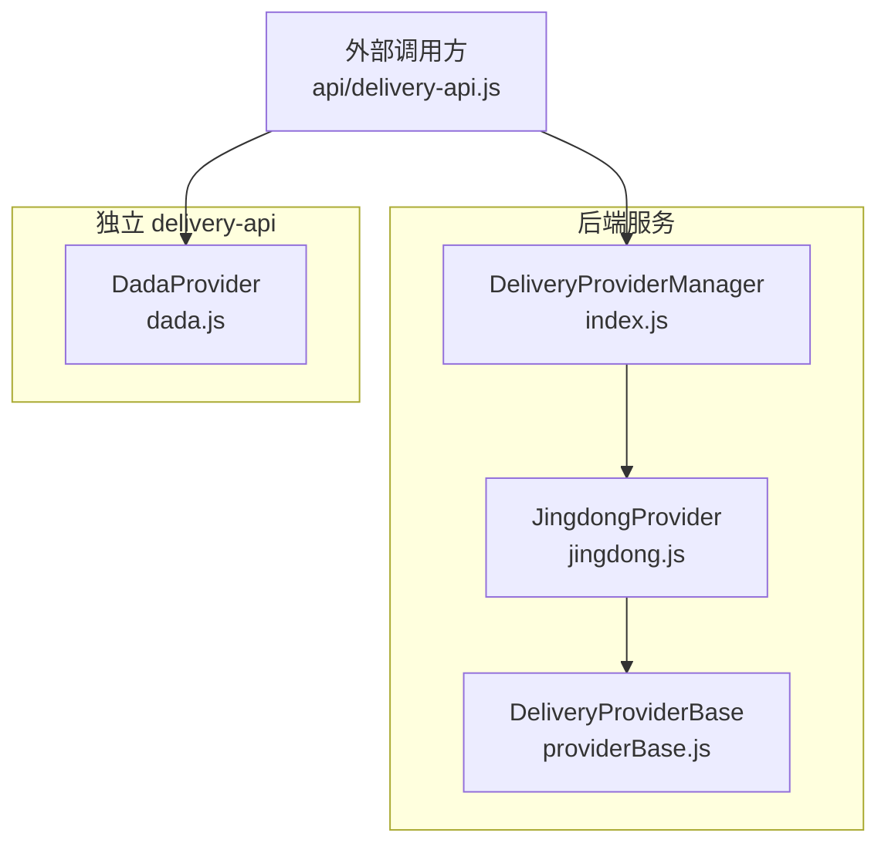
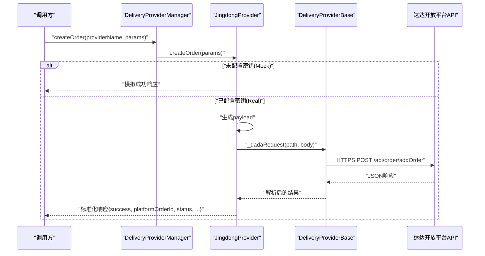
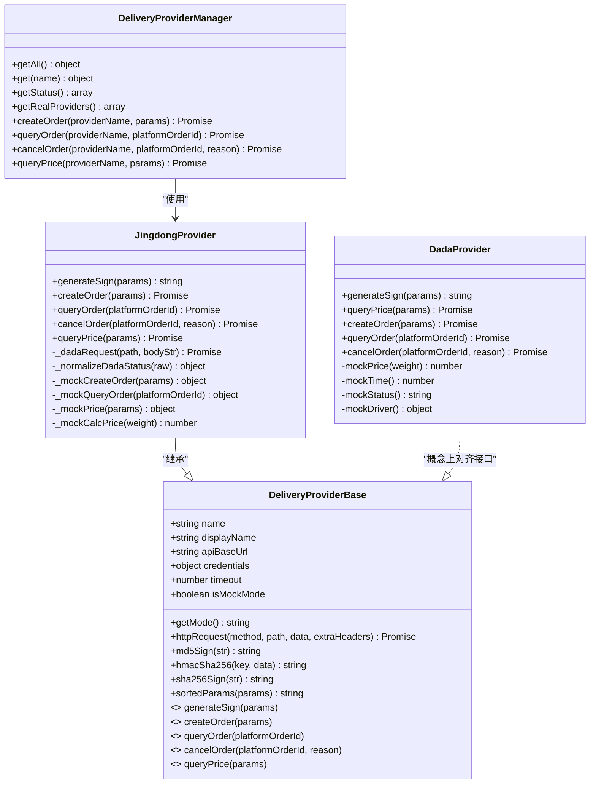
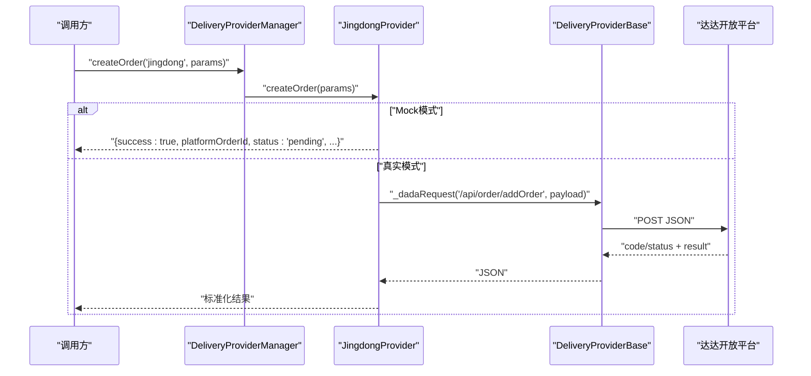
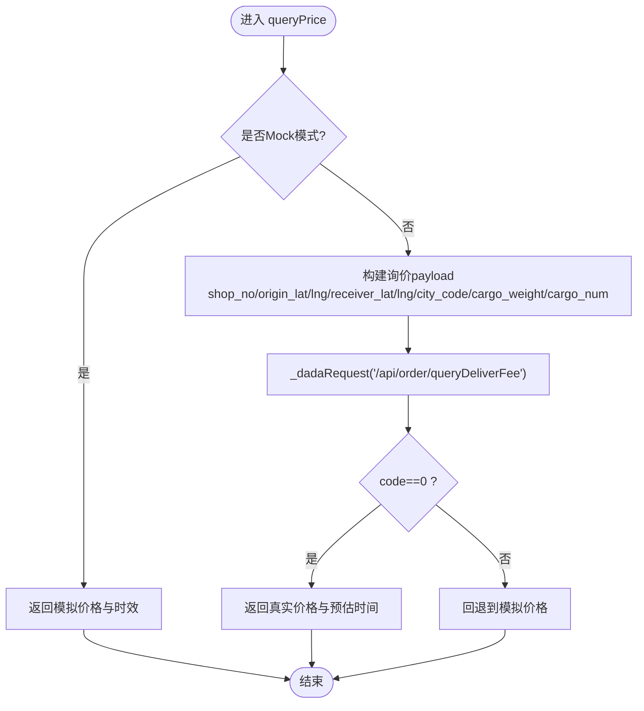
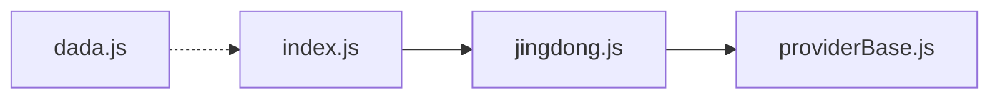

# 京东秒送集成

<cite>
**本文引用的文件列表**
- [backend/services/deliveryProviders/index.js](file://backend/services/deliveryProviders/index.js)
- [backend/services/deliveryProviders/providerBase.js](file://backend/services/deliveryProviders/providerBase.js)
- [backend/services/deliveryProviders/jingdong.js](file://backend/services/deliveryProviders/jingdong.js)
- [delivery-api/providers/dada.js](file://delivery-api/providers/dada.js)
- [api/delivery-api.js](file://api/delivery-api.js)
</cite>

## 目录
1. [简介](#简介)
2. [项目结构](#项目结构)
3. [核心组件](#核心组件)
4. [架构总览](#架构总览)
5. [详细组件分析](#详细组件分析)
6. [依赖关系分析](#依赖关系分析)
7. [性能与可用性](#性能与可用性)
8. [安全与认证](#安全与认证)
9. [API接口规范](#api接口规范)
10. [错误码与故障排查](#错误码与故障排查)
11. [结论](#结论)

## 简介
本文件面向“京东秒送”配送能力的对接与集成，聚焦于系统内对达达开放平台（京东秒送底层运力）的封装实现。文档涵盖：
- 入驻与密钥管理要点（基于代码中环境变量与注释说明）
- 统一配送提供商抽象与京东秒送具体实现
- 订单创建、状态查询、取消、运费计算等关键流程
- 签名机制与安全传输
- 错误处理与排障建议

注意：本项目中“京东秒送”实际通过达达开放平台API进行对接，相关URL、参数结构与签名方式均以代码为准。

## 项目结构
围绕京东秒送的核心代码位于后端服务与独立 delivery-api 两个位置：
- 后端统一入口与基类：提供多服务商管理与通用HTTP/签名能力
- 京东秒送实现：继承基类，封装达达开放平台调用
- delivery-api 中的达达实现：提供另一套示例/兼容实现（含签名与模拟数据）

图表来源
- [backend/services/deliveryProviders/index.js:1-87](file://backend/services/deliveryProviders/index.js#L1-L87)
- [backend/services/deliveryProviders/providerBase.js:1-124](file://backend/services/deliveryProviders/providerBase.js#L1-L124)
- [backend/services/deliveryProviders/jingdong.js:1-278](file://backend/services/deliveryProviders/jingdong.js#L1-L278)
- [delivery-api/providers/dada.js:1-237](file://delivery-api/providers/dada.js#L1-L237)
- [api/delivery-api.js](file://api/delivery-api.js)

章节来源
- [backend/services/deliveryProviders/index.js:1-87](file://backend/services/deliveryProviders/index.js#L1-L87)
- [backend/services/deliveryProviders/providerBase.js:1-124](file://backend/services/deliveryProviders/providerBase.js#L1-L124)
- [backend/services/deliveryProviders/jingdong.js:1-278](file://backend/services/deliveryProviders/jingdong.js#L1-L278)
- [delivery-api/providers/dada.js:1-237](file://delivery-api/providers/dada.js#L1-L237)
- [api/delivery-api.js](file://api/delivery-api.js)

## 核心组件
- DeliveryProviderManager（统一入口）
  - 负责注册、获取各配送服务商实例，并提供 createOrder/queryOrder/cancelOrder/queryPrice 的统一方法
  - 支持按 providerName 路由到对应实现
- DeliveryProviderBase（基类）
  - 提供 HTTPS 请求封装、MD5/HMAC-SHA256/SHA256 签名工具、参数排序拼接
  - 定义抽象接口：generateSign/createOrder/queryOrder/cancelOrder/queryPrice
- JingdongProvider（京东秒送实现）
  - 继承基类，封装达达开放平台API调用
  - 包含真实模式与Mock模式切换逻辑
  - 内部实现 _dadaRequest 专用请求方法与状态映射
- DadaProvider（delivery-api 下的达达实现）
  - 独立的签名与接口封装，用于演示或兼容场景

章节来源
- [backend/services/deliveryProviders/index.js:1-87](file://backend/services/deliveryProviders/index.js#L1-L87)
- [backend/services/deliveryProviders/providerBase.js:1-124](file://backend/services/deliveryProviders/providerBase.js#L1-L124)
- [backend/services/deliveryProviders/jingdong.js:1-278](file://backend/services/deliveryProviders/jingdong.js#L1-L278)
- [delivery-api/providers/dada.js:1-237](file://delivery-api/providers/dada.js#L1-L237)

## 架构总览
下图展示了从外部调用到京东秒送（达达）的完整链路，包括统一入口、提供商选择、签名与HTTP请求、以及返回结果标准化。

图表来源
- [backend/services/deliveryProviders/index.js:57-62](file://backend/services/deliveryProviders/index.js#L57-L62)
- [backend/services/deliveryProviders/jingdong.js:50-98](file://backend/services/deliveryProviders/jingdong.js#L50-L98)
- [backend/services/deliveryProviders/jingdong.js:176-205](file://backend/services/deliveryProviders/jingdong.js#L176-L205)
- [backend/services/deliveryProviders/providerBase.js:35-74](file://backend/services/deliveryProviders/providerBase.js#L35-L74)

## 详细组件分析

### 类关系图（代码级）

图表来源
- [backend/services/deliveryProviders/providerBase.js:10-124](file://backend/services/deliveryProviders/providerBase.js#L10-L124)
- [backend/services/deliveryProviders/index.js:20-84](file://backend/services/deliveryProviders/index.js#L20-L84)
- [backend/services/deliveryProviders/jingdong.js:17-278](file://backend/services/deliveryProviders/jingdong.js#L17-L278)
- [delivery-api/providers/dada.js:7-237](file://delivery-api/providers/dada.js#L7-L237)

章节来源
- [backend/services/deliveryProviders/providerBase.js:10-124](file://backend/services/deliveryProviders/providerBase.js#L10-L124)
- [backend/services/deliveryProviders/index.js:20-84](file://backend/services/deliveryProviders/index.js#L20-L84)
- [backend/services/deliveryProviders/jingdong.js:17-278](file://backend/services/deliveryProviders/jingdong.js#L17-L278)
- [delivery-api/providers/dada.js:7-237](file://delivery-api/providers/dada.js#L7-L237)

### 京东秒送（达达）下单流程时序

图表来源
- [backend/services/deliveryProviders/index.js:57-62](file://backend/services/deliveryProviders/index.js#L57-L62)
- [backend/services/deliveryProviders/jingdong.js:50-98](file://backend/services/deliveryProviders/jingdong.js#L50-L98)
- [backend/services/deliveryProviders/jingdong.js:176-205](file://backend/services/deliveryProviders/jingdong.js#L176-L205)

章节来源
- [backend/services/deliveryProviders/index.js:57-62](file://backend/services/deliveryProviders/index.js#L57-L62)
- [backend/services/deliveryProviders/jingdong.js:50-98](file://backend/services/deliveryProviders/jingdong.js#L50-L98)
- [backend/services/deliveryProviders/jingdong.js:176-205](file://backend/services/deliveryProviders/jingdong.js#L176-L205)

### 运费计算流程（查询价格）

图表来源
- [backend/services/deliveryProviders/jingdong.js:150-174](file://backend/services/deliveryProviders/jingdong.js#L150-L174)
- [backend/services/deliveryProviders/jingdong.js:264-274](file://backend/services/deliveryProviders/jingdong.js#L264-L274)

章节来源
- [backend/services/deliveryProviders/jingdong.js:150-174](file://backend/services/deliveryProviders/jingdong.js#L150-L174)
- [backend/services/deliveryProviders/jingdong.js:264-274](file://backend/services/deliveryProviders/jingdong.js#L264-L274)

## 依赖关系分析
- 模块耦合
  - index.js 聚合多个 Provider 实例，对外暴露统一方法；与 jingdong.js 强耦合
  - jingdong.js 依赖 providerBase.js 的 HTTP 与签名工具
  - delivery-api/providers/dada.js 为独立实现，不依赖后端 ProviderManager
- 外部依赖
  - Node.js https 原生模块发起HTTPS请求
  - crypto 模块用于 MD5/HMAC/SHA256 签名
- 潜在循环依赖
  - 当前未见循环引用；ProviderManager 仅 require Provider 类，Provider 仅 require Base

图表来源
- [backend/services/deliveryProviders/index.js:15-28](file://backend/services/deliveryProviders/index.js#L15-L28)
- [backend/services/deliveryProviders/jingdong.js:15-31](file://backend/services/deliveryProviders/jingdong.js#L15-L31)
- [delivery-api/providers/dada.js:1-13](file://delivery-api/providers/dada.js#L1-L13)

章节来源
- [backend/services/deliveryProviders/index.js:15-28](file://backend/services/deliveryProviders/index.js#L15-L28)
- [backend/services/deliveryProviders/jingdong.js:15-31](file://backend/services/deliveryProviders/jingdong.js#L15-L31)
- [delivery-api/providers/dada.js:1-13](file://delivery-api/providers/dada.js#L1-L13)

## 性能与可用性
- 超时控制
  - 基类与京东实现均设置请求超时（默认约15秒），避免长时间阻塞
- 降级策略
  - 当未配置密钥或网络异常时，自动回退至 Mock 模式，保障开发联调与前端展示可用
- 并发与重试
  - 当前实现未内置重试与熔断；建议在网关或服务层增加幂等与重试策略（如指数退避）
- 资源占用
  - 使用原生 https 流式读取响应体，内存友好；建议在生产环境启用连接池与Keep-Alive

[本节为通用指导，无需源码引用]

## 安全与认证
- 签名算法
  - 达达风格：将参数键名与值按字典序拼接后追加 appSecret，再取 MD5 并转大写
  - 基类提供 md5Sign/hmacSha256/sha256Sign/sortedParams 等工具方法
- 传输安全
  - 所有请求通过 HTTPS 发送，Content-Type 为 application/json
- 密钥管理
  - 通过环境变量注入：DADA_APP_KEY、DADA_APP_SECRET、DADA_SOURCE_ID（以及可选 JD_API_URL）
  - 若为空则判定为 Mock 模式，不会向生产环境发起请求
- 回调与验签
  - 下单时可传入 callbackUrl，用于接收平台异步通知；服务端需校验签名与来源IP白名单（建议）

章节来源
- [backend/services/deliveryProviders/jingdong.js:33-44](file://backend/services/deliveryProviders/jingdong.js#L33-L44)
- [backend/services/deliveryProviders/providerBase.js:76-103](file://backend/services/deliveryProviders/providerBase.js#L76-L103)
- [backend/services/deliveryProviders/jingdong.js:22-29](file://backend/services/deliveryProviders/jingdong.js#L22-L29)

## API接口规范
以下接口以代码中实际调用路径与参数为准。

- 创建配送订单
  - 路径：POST /api/order/addOrder
  - 入参（示例字段，来自实现）：source_id、shop_no、order_id、city_code、cargo_price、is_prepay、receiver_name、receiver_phone、receiver_address、receiver_lat、receiver_lng、callback、cargo_weight、cargo_num、origin_id、is_finish_code_needed
  - 出参：code/status=success 时，result 中包含 order_id、deliver_fee/total_fee、delivery_time、distance 等
  - 备注：若未配置密钥，走 Mock 分支返回模拟数据

- 查询配送状态
  - 路径：POST /api/order/status/query
  - 入参：order_id
  - 出参：code/status=success 时，result 中包含 order_status、transporter_name、transporter_phone、transporter_lat/lng、distance 等；内部会映射为标准状态

- 取消配送
  - 路径：POST /api/order/formalCancel
  - 入参：order_id、cancel_reason_id、cancel_reason
  - 出参：code/status=success 表示取消成功

- 运费计算
  - 路径：POST /api/order/queryDeliverFee
  - 入参：shop_no、origin_lat、origin_lng、receiver_lat、receiver_lng、city_code、cargo_weight、cargo_num
  - 出参：code=0 时，result 中包含 deliver_fee、delivery_time 等

- 签名规则（达达风格）
  - 步骤：过滤空值 → 按键名升序拼接 key+value → 末尾追加 appSecret → MD5 并转大写
  - 适用：上述所有接口均需携带签名（在真实模式下）

章节来源
- [backend/services/deliveryProviders/jingdong.js:50-98](file://backend/services/deliveryProviders/jingdong.js#L50-L98)
- [backend/services/deliveryProviders/jingdong.js:104-122](file://backend/services/deliveryProviders/jingdong.js#L104-L122)
- [backend/services/deliveryProviders/jingdong.js:128-148](file://backend/services/deliveryProviders/jingdong.js#L128-L148)
- [backend/services/deliveryProviders/jingdong.js:150-174](file://backend/services/deliveryProviders/jingdong.js#L150-L174)
- [backend/services/deliveryProviders/jingdong.js:33-44](file://backend/services/deliveryProviders/jingdong.js#L33-L44)

## 错误码与故障排查
- 常见错误类型
  - 网络/超时：HTTPS 请求超时或连接失败
  - 鉴权失败：appKey/appSecret/sourceId 不正确或未配置
  - 业务失败：平台返回 code!=0 或 status!=success
  - 参数缺失：必填字段为空导致平台拒绝
- 定位建议
  - 检查环境变量是否注入正确（DADA_APP_KEY/DADA_APP_SECRET/DADA_SOURCE_ID/JD_API_URL）
  - 确认 Mock 模式开关：若为空则为 mock，不会调用真实API
  - 核对签名顺序与大小写：必须按字典序拼接且最终大写
  - 查看回调地址是否可达，确保平台可推送异步状态
- 快速自检清单
  - 基础连通性：curl/wget 测试目标域名与端口
  - 最小化请求：构造最简 payload 验证签名与字段
  - 日志采集：记录请求URL、Body、Response、耗时与异常堆栈

章节来源
- [backend/services/deliveryProviders/jingdong.js:176-205](file://backend/services/deliveryProviders/jingdong.js#L176-L205)
- [backend/services/deliveryProviders/jingdong.js:92-97](file://backend/services/deliveryProviders/jingdong.js#L92-L97)
- [backend/services/deliveryProviders/jingdong.js:118-121](file://backend/services/deliveryProviders/jingdong.js#L118-L121)
- [backend/services/deliveryProviders/jingdong.js:144-147](file://backend/services/deliveryProviders/jingdong.js#L144-L147)

## 结论
本项目对“京东秒送”的对接采用“统一提供商抽象 + 达达开放平台实现”的方式，具备以下特点：
- 统一入口与多厂商扩展能力强
- 签名与HTTP封装复用度高，便于新增其他物流商
- 天然支持 Mock 模式，利于开发与联调
- 生产接入需完善密钥管理、回调验签、重试与监控告警

[本节为总结性内容，无需源码引用]