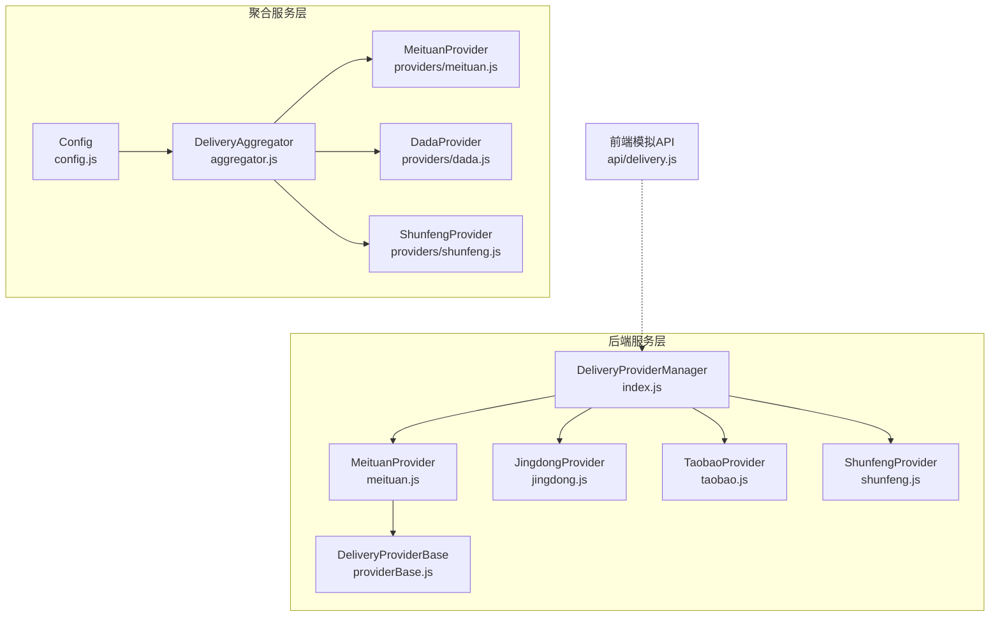
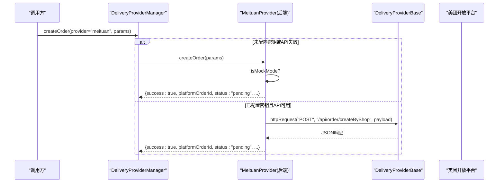
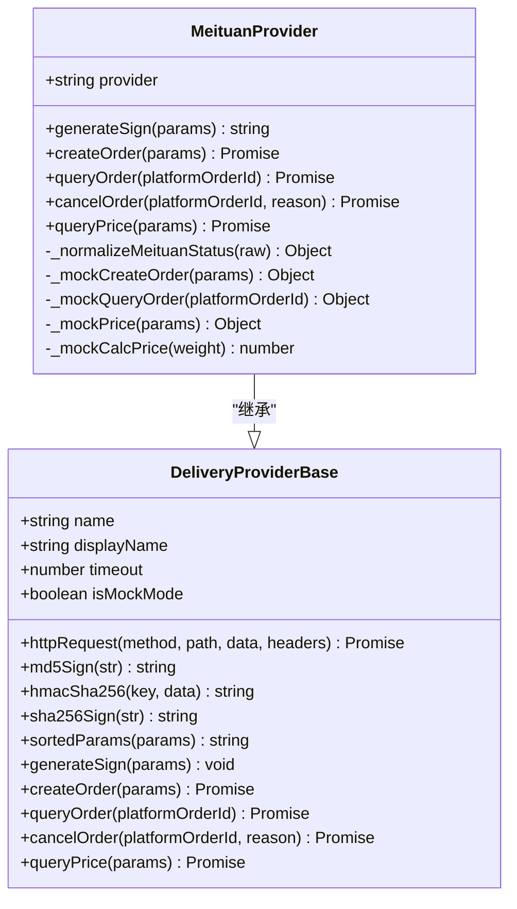
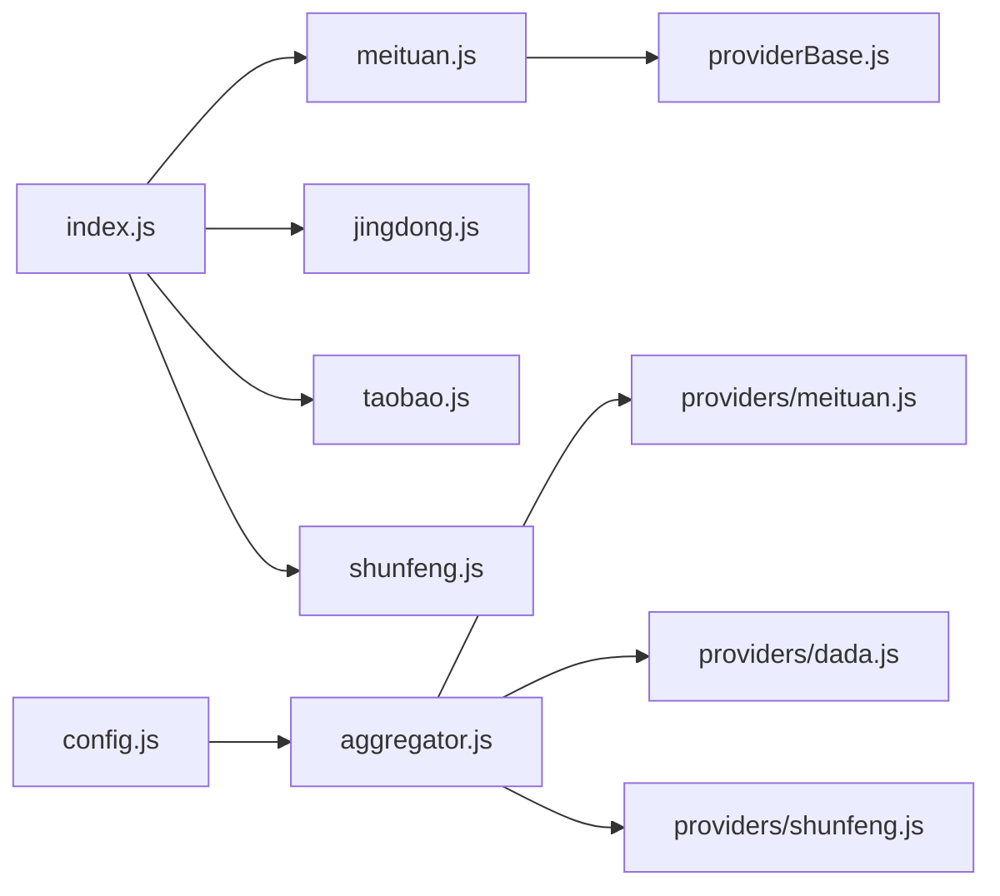

# 美团跑腿集成

<cite>
**本文引用的文件**   
- [backend/services/deliveryProviders/meituan.js](file://backend/services/deliveryProviders/meituan.js)
- [backend/services/deliveryProviders/providerBase.js](file://backend/services/deliveryProviders/providerBase.js)
- [backend/services/deliveryProviders/index.js](file://backend/services/deliveryProviders/index.js)
- [delivery-api/providers/meituan.js](file://delivery-api/providers/meituan.js)
- [delivery-api/aggregator.js](file://delivery-api/aggregator.js)
- [delivery-api/config.js](file://delivery-api/config.js)
- [api/delivery.js](file://api/delivery.js)
</cite>

## 目录
1. [简介](#简介)
2. [项目结构](#项目结构)
3. [核心组件](#核心组件)
4. [架构总览](#架构总览)
5. [详细组件分析](#详细组件分析)
6. [依赖关系分析](#依赖关系分析)
7. [性能与可用性](#性能与可用性)
8. [故障排查指南](#故障排查指南)
9. [结论](#结论)
10. [附录：API规范与示例](#附录api规范与示例)

## 简介
本文件面向“美团跑腿配送提供商”的完整对接实现，覆盖商户注册流程、appId/appSecret配置、签名算法（MD5(appId + timestamp + secret)）的实现细节；并给出所有API接口的调用规范（创建订单、查询状态、取消订单、价格查询），包含请求参数说明、响应格式定义、错误码映射表。同时解释Mock模式的实现机制与降级策略，提供状态码对照表（0=待调度、10=已接单、20=已取件、30=配送中、40=已送达、50=已取消、99=异常）以及司机信息获取方式，并附带实际代码示例路径与常见问题解决方案。

## 项目结构
本项目在两个层面实现了配送能力：
- 后端服务层（backend/services/deliveryProviders）：直接对接各服务商API，统一封装HTTP、签名、Mock/真实模式切换与状态归一化。
- 聚合服务层（delivery-api）：独立微服务形态，提供多服务商聚合询价、下单、查询、取消等能力。

图表来源
- [backend/services/deliveryProviders/index.js:1-87](file://backend/services/deliveryProviders/index.js#L1-L87)
- [backend/services/deliveryProviders/meituan.js:1-257](file://backend/services/deliveryProviders/meituan.js#L1-L257)
- [backend/services/deliveryProviders/providerBase.js:1-124](file://backend/services/deliveryProviders/providerBase.js#L1-L124)
- [delivery-api/aggregator.js:1-237](file://delivery-api/aggregator.js#L1-L237)
- [delivery-api/providers/meituan.js:1-231](file://delivery-api/providers/meituan.js#L1-L231)
- [delivery-api/config.js:1-93](file://delivery-api/config.js#L1-L93)
- [api/delivery.js:1-80](file://api/delivery.js#L1-L80)

章节来源
- [backend/services/deliveryProviders/index.js:1-87](file://backend/services/deliveryProviders/index.js#L1-L87)
- [delivery-api/aggregator.js:1-237](file://delivery-api/aggregator.js#L1-L237)

## 核心组件
- DeliveryProviderManager（后端统一入口）
  - 负责实例化与管理多个配送服务商，对外暴露 createOrder/queryOrder/cancelOrder/queryPrice 等方法，并根据是否配置密钥自动选择 real/mock 模式。
- MeituanProvider（后端美团实现）
  - 实现美团跑腿API的签名、下单、状态查询、取消、询价；内置状态映射与Mock实现；失败时自动降级为Mock。
- DeliveryProviderBase（后端基类）
  - 提供HTTPS请求封装、通用签名方法（MD5/HMAC-SHA256/SHA256）、参数排序拼接、超时控制等。
- DeliveryAggregator（聚合服务层）
  - 并行询价、推荐策略、自动选择最优服务商进行下单；对单个服务商的查询与取消进行转发。
- MeituanProvider（聚合服务层）
  - 独立的签名实现（按key排序拼接后追加secret再MD5），并提供Mock数据用于测试。
- Config（聚合服务层）
  - 统一管理各服务商的测试/生产环境配置，包括 appId、secret、URL 等。
- api/delivery.js（前端模拟API）
  - 提供前端侧的模拟跑腿接口，便于联调与演示。

章节来源
- [backend/services/deliveryProviders/index.js:1-87](file://backend/services/deliveryProviders/index.js#L1-L87)
- [backend/services/deliveryProviders/meituan.js:1-257](file://backend/services/deliveryProviders/meituan.js#L1-L257)
- [backend/services/deliveryProviders/providerBase.js:1-124](file://backend/services/deliveryProviders/providerBase.js#L1-L124)
- [delivery-api/aggregator.js:1-237](file://delivery-api/aggregator.js#L1-L237)
- [delivery-api/providers/meituan.js:1-231](file://delivery-api/providers/meituan.js#L1-L231)
- [delivery-api/config.js:1-93](file://delivery-api/config.js#L1-L93)
- [api/delivery.js:1-80](file://api/delivery.js#L1-L80)

## 架构总览
后端服务层通过 DeliveryProviderManager 统一接入多家服务商；美团实现遵循“无密钥即Mock”的策略，并在真实API失败时自动降级到Mock，保证系统可用性。聚合服务层则提供跨服务商的并行询价与智能推荐下单能力。

图表来源
- [backend/services/deliveryProviders/index.js:57-62](file://backend/services/deliveryProviders/index.js#L57-L62)
- [backend/services/deliveryProviders/meituan.js:41-93](file://backend/services/deliveryProviders/meituan.js#L41-L93)
- [backend/services/deliveryProviders/providerBase.js:35-74](file://backend/services/deliveryProviders/providerBase.js#L35-L74)

## 详细组件分析

### 美团跑腿后端实现（backend/services/deliveryProviders/meituan.js）
- 商户注册与配置
  - 在美团开放平台完成商户注册，获取 appId 与 appSecret。
  - 通过环境变量 MEITUAN_APP_ID / MEITUAN_APP_SECRET 注入应用。
- 签名算法
  - 简单签名：MD5(appId + timestamp + secret)。
  - 具体实现见 generateSign 方法，使用 base 类的 md5Sign 计算。
- 接口实现
  - 创建订单：POST /api/order/createByShop
  - 查询状态：POST /api/order/status/query
  - 取消订单：POST /api/order/delete
  - 价格查询：POST /api/order/deliveryFee
- Mock模式与降级
  - 若未配置密钥，进入 mock 模式返回合理模拟数据。
  - 真实API调用异常时，自动降级为 mock 结果，保障可用性。
- 状态映射
  - 将美团原始状态码映射为内部状态字符串，并提取司机信息。

图表来源
- [backend/services/deliveryProviders/providerBase.js:10-124](file://backend/services/deliveryProviders/providerBase.js#L10-L124)
- [backend/services/deliveryProviders/meituan.js:15-257](file://backend/services/deliveryProviders/meituan.js#L15-L257)

章节来源
- [backend/services/deliveryProviders/meituan.js:30-35](file://backend/services/deliveryProviders/meituan.js#L30-L35)
- [backend/services/deliveryProviders/meituan.js:41-93](file://backend/services/deliveryProviders/meituan.js#L41-L93)
- [backend/services/deliveryProviders/meituan.js:99-123](file://backend/services/deliveryProviders/meituan.js#L99-L123)
- [backend/services/deliveryProviders/meituan.js:129-154](file://backend/services/deliveryProviders/meituan.js#L129-L154)
- [backend/services/deliveryProviders/meituan.js:157-182](file://backend/services/deliveryProviders/meituan.js#L157-L182)
- [backend/services/deliveryProviders/meituan.js:185-209](file://backend/services/deliveryProviders/meituan.js#L185-L209)
- [backend/services/deliveryProviders/meituan.js:212-253](file://backend/services/deliveryProviders/meituan.js#L212-L253)

### 美团跑腿聚合服务实现（delivery-api/providers/meituan.js）
- 签名算法
  - 按key排序拼接 key=value&... 形式，末尾追加 secret，再进行 MD5。
- 接口实现
  - 提供 queryPrice、createOrder、queryOrder、cancelOrder 的占位实现，默认返回模拟数据，便于独立运行测试。
- 适用场景
  - 作为独立微服务部署时，配合 aggregator 进行多服务商聚合。

章节来源
- [delivery-api/providers/meituan.js:20-36](file://delivery-api/providers/meituan.js#L20-L36)
- [delivery-api/providers/meituan.js:43-81](file://delivery-api/providers/meituan.js#L43-L81)
- [delivery-api/providers/meituan.js:88-130](file://delivery-api/providers/meituan.js#L88-L130)
- [delivery-api/providers/meituan.js:137-165](file://delivery-api/providers/meituan.js#L137-L165)
- [delivery-api/providers/meituan.js:173-200](file://delivery-api/providers/meituan.js#L173-L200)

### 聚合调度器（delivery-api/aggregator.js）
- 并行询价
  - 对所有已启用的服务商并发发起询价，收集成功结果并按策略推荐最优。
- 自动下单
  - 支持指定优先服务商，否则基于推荐结果自动选择最优服务商下单。
- 查询与取消
  - 转发至对应服务商实现。

章节来源
- [delivery-api/aggregator.js:54-95](file://delivery-api/aggregator.js#L54-L95)
- [delivery-api/aggregator.js:137-197](file://delivery-api/aggregator.js#L137-L197)
- [delivery-api/aggregator.js:205-232](file://delivery-api/aggregator.js#L205-L232)

### 配置管理（delivery-api/config.js）
- 统一管理各服务商的测试/生产环境配置，包括 appId、secret、URL 等。
- 美团相关键：
  - test.appId/test.secret/test.url
  - production.appId/production.secret/production.url

章节来源
- [delivery-api/config.js:16-29](file://delivery-api/config.js#L16-L29)

### 前端模拟API（api/delivery.js）
- 提供 createOrder/getOrderStatus/cancelOrder 的模拟实现，便于前端联调与演示。

章节来源
- [api/delivery.js:1-80](file://api/delivery.js#L1-L80)

## 依赖关系分析
- 后端服务层
  - index.js 依赖 meituan/jingdong/taobao/shunfeng 四个 Provider。
  - meituan.js 继承自 providerBase.js，复用 HTTP 与签名能力。
- 聚合服务层
  - aggregator.js 依赖 providers/meituan.js 等具体实现，并通过 config.js 读取配置。

图表来源
- [backend/services/deliveryProviders/index.js:15-28](file://backend/services/deliveryProviders/index.js#L15-L28)
- [backend/services/deliveryProviders/meituan.js:13-28](file://backend/services/deliveryProviders/meituan.js#L13-L28)
- [delivery-api/aggregator.js:6-16](file://delivery-api/aggregator.js#L6-L16)
- [delivery-api/config.js:10-29](file://delivery-api/config.js#L10-L29)

章节来源
- [backend/services/deliveryProviders/index.js:1-87](file://backend/services/deliveryProviders/index.js#L1-L87)
- [delivery-api/aggregator.js:1-237](file://delivery-api/aggregator.js#L1-L237)

## 性能与可用性
- 并发询价
  - 聚合层对多家服务商并行询价，显著降低整体延迟。
- 超时与重试
  - 基础层提供超时控制；聚合层可结合配置进行重试与容错。
- 降级策略
  - 后端美团实现在真实API失败时自动降级为Mock，确保业务链路不中断。

[本节为通用指导，无需特定文件引用]

## 故障排查指南
- 常见错误定位
  - 检查环境变量是否配置正确（MEITUAN_APP_ID / MEITUAN_APP_SECRET）。
  - 确认网络连通性与证书有效性（HTTPS）。
  - 核对签名串顺序与内容是否与平台要求一致。
- 日志与调试
  - 关注后端打印的错误日志，尤其是“API调用失败”和“查询状态失败”。
  - 在聚合层查看 errors 列表，定位具体服务商问题。
- 回退与恢复
  - 若持续失败，确认是否已自动降级为Mock；必要时修复密钥或网络后再切回真实模式。

章节来源
- [backend/services/deliveryProviders/meituan.js:86-92](file://backend/services/deliveryProviders/meituan.js#L86-L92)
- [backend/services/deliveryProviders/meituan.js:119-122](file://backend/services/deliveryProviders/meituan.js#L119-L122)
- [delivery-api/aggregator.js:78-84](file://delivery-api/aggregator.js#L78-L84)

## 结论
本项目在后端与聚合服务层均提供了美团跑腿的完整对接能力，具备清晰的签名实现、统一的HTTP封装、完善的Mock与降级策略，以及多服务商聚合与推荐下单能力。通过标准化的状态映射与错误处理，系统具备良好的可扩展性与稳定性。

[本节为总结性内容，无需特定文件引用]

## 附录：API规范与示例

### 商户注册与配置
- 注册流程
  - 在美团开放平台完成商户注册，获取 appId 与 appSecret。
- 环境变量
  - MEITUAN_APP_ID：商户标识
  - MEITUAN_APP_SECRET：商户密钥
  - MEITUAN_API_URL：可选，自定义API地址（默认 https://peisongopen.meituan.com）

章节来源
- [backend/services/deliveryProviders/meituan.js:5-11](file://backend/services/deliveryProviders/meituan.js#L5-L11)
- [backend/services/deliveryProviders/meituan.js:20-26](file://backend/services/deliveryProviders/meituan.js#L20-L26)

### 签名算法
- 后端实现（简单签名）
  - 规则：MD5(appId + timestamp + secret)
  - 参考路径：[backend/services/deliveryProviders/meituan.js:30-35](file://backend/services/deliveryProviders/meituan.js#L30-L35)
- 聚合服务实现（排序拼接签名）
  - 规则：将所有非空参数按key升序拼接为 key=value&...，末尾追加 secret，再MD5
  - 参考路径：[delivery-api/providers/meituan.js:20-36](file://delivery-api/providers/meituan.js#L20-L36)

章节来源
- [backend/services/deliveryProviders/meituan.js:30-35](file://backend/services/deliveryProviders/meituan.js#L30-L35)
- [delivery-api/providers/meituan.js:20-36](file://delivery-api/providers/meituan.js#L20-L36)

### 接口规范

#### 创建订单
- 接口路径：POST /api/order/createByShop
- 请求参数（关键字段）
  - app_id：商户标识
  - timestamp：时间戳（秒）
  - sign：签名
  - shop_no：门店编号
  - delivery_id：平台订单号（由我方生成）
  - order_id：业务订单号
  - order_type：订单类型（如即时单）
  - goods_type：商品类型
  - goods_weight：重量
  - goods_detail：商品详情
  - pickup_*：取件人姓名、电话、地址、经纬度
  - receiver_*：收件人姓名、电话、地址、经纬度
  - callback_url：回调地址（可选）
- 响应格式（关键字段）
  - code/status：0表示成功
  - data.delivery_id：平台订单号
  - data.delivery_fee/total_fee：费用（可选）
  - data.delivery_time：预计时长（可选）
- 错误处理
  - 非0状态码视为失败，记录 message/msg 字段
  - 网络异常时自动降级为Mock

章节来源
- [backend/services/deliveryProviders/meituan.js:41-93](file://backend/services/deliveryProviders/meituan.js#L41-L93)

#### 查询状态
- 接口路径：POST /api/order/status/query
- 请求参数
  - app_id、timestamp、sign、delivery_id
- 响应格式
  - code/status：0表示成功
  - data.status：原始状态码（0/10/20/30/40/50/99）
  - data.courier_name/courier_phone：司机信息（可选）
  - data.distance/estimate_delivery_time：距离与ETA（可选）
- 状态映射（内部）
  - 0→pending（待调度）
  - 10→accepted（已接单）
  - 20→picking_up（已取件）
  - 30→delivering（配送中）
  - 40→delivered（已送达）
  - 50→cancelled（已取消）
  - 99→exception（异常）
- 错误处理
  - 非0状态码视为失败
  - 网络异常时自动降级为Mock

章节来源
- [backend/services/deliveryProviders/meituan.js:99-123](file://backend/services/deliveryProviders/meituan.js#L99-L123)
- [backend/services/deliveryProviders/meituan.js:185-209](file://backend/services/deliveryProviders/meituan.js#L185-L209)

#### 取消订单
- 接口路径：POST /api/order/delete
- 请求参数
  - app_id、timestamp、sign、delivery_id、cancel_reason、cancel_type
- 响应格式
  - code/status：0表示成功
- 错误处理
  - 非0状态码视为失败

章节来源
- [backend/services/deliveryProviders/meituan.js:129-154](file://backend/services/deliveryProviders/meituan.js#L129-L154)

#### 价格查询
- 接口路径：POST /api/order/deliveryFee
- 请求参数
  - app_id、timestamp、sign
  - pickup_lat/lng、receiver_lat/lng、goods_weight
- 响应格式
  - code：0表示成功
  - data.delivery_fee：费用
  - data.delivery_time：预计时长
- 错误处理
  - 非0状态码或异常时降级为Mock

章节来源
- [backend/services/deliveryProviders/meituan.js:157-182](file://backend/services/deliveryProviders/meituan.js#L157-L182)

### 错误码映射表（美团原始状态码）
- 0：待调度
- 10：已接单
- 20：已取件
- 30：配送中
- 40：已送达
- 50：已取消
- 99：异常

章节来源
- [backend/services/deliveryProviders/meituan.js:185-194](file://backend/services/deliveryProviders/meituan.js#L185-L194)

### 司机信息获取方式
- 在状态查询响应中，若存在 courier_name/courier_phone 等字段，即为司机信息。
- 后端实现会将这些字段归一化为 driver.name、driver.phone、driver.location 等结构。

章节来源
- [backend/services/deliveryProviders/meituan.js:201-208](file://backend/services/deliveryProviders/meituan.js#L201-L208)

### Mock模式与降级策略
- 触发条件
  - 未配置密钥（isMockMode=true）
  - 真实API调用异常或超时
- 行为
  - 返回合理的模拟数据（含平台订单号、状态、价格、预估时效等）
  - 保持上层调用一致性，不影响业务流程
- 参考路径
  - 构造与判断：[backend/services/deliveryProviders/meituan.js:43-45](file://backend/services/deliveryProviders/meituan.js#L43-L45)
  - 降级逻辑：[backend/services/deliveryProviders/meituan.js:88-92](file://backend/services/deliveryProviders/meituan.js#L88-L92)
  - Mock实现：[backend/services/deliveryProviders/meituan.js:212-253](file://backend/services/deliveryProviders/meituan.js#L212-L253)

章节来源
- [backend/services/deliveryProviders/meituan.js:43-45](file://backend/services/deliveryProviders/meituan.js#L43-L45)
- [backend/services/deliveryProviders/meituan.js:88-92](file://backend/services/deliveryProviders/meituan.js#L88-L92)
- [backend/services/deliveryProviders/meituan.js:212-253](file://backend/services/deliveryProviders/meituan.js#L212-L253)

### 实际代码示例路径
- 后端美团实现（创建/查询/取消/询价/签名/Mock）
  - [backend/services/deliveryProviders/meituan.js:30-35](file://backend/services/deliveryProviders/meituan.js#L30-L35)
  - [backend/services/deliveryProviders/meituan.js:41-93](file://backend/services/deliveryProviders/meituan.js#L41-L93)
  - [backend/services/deliveryProviders/meituan.js:99-123](file://backend/services/deliveryProviders/meituan.js#L99-L123)
  - [backend/services/deliveryProviders/meituan.js:129-154](file://backend/services/deliveryProviders/meituan.js#L129-L154)
  - [backend/services/deliveryProviders/meituan.js:157-182](file://backend/services/deliveryProviders/meituan.js#L157-L182)
  - [backend/services/deliveryProviders/meituan.js:212-253](file://backend/services/deliveryProviders/meituan.js#L212-L253)
- 聚合服务层美团实现（签名/接口占位）
  - [delivery-api/providers/meituan.js:20-36](file://delivery-api/providers/meituan.js#L20-L36)
  - [delivery-api/providers/meituan.js:43-81](file://delivery-api/providers/meituan.js#L43-L81)
  - [delivery-api/providers/meituan.js:88-130](file://delivery-api/providers/meituan.js#L88-L130)
  - [delivery-api/providers/meituan.js:137-165](file://delivery-api/providers/meituan.js#L137-L165)
  - [delivery-api/providers/meituan.js:173-200](file://delivery-api/providers/meituan.js#L173-L200)
- 聚合调度器（并行询价/推荐/下单）
  - [delivery-api/aggregator.js:54-95](file://delivery-api/aggregator.js#L54-L95)
  - [delivery-api/aggregator.js:137-197](file://delivery-api/aggregator.js#L137-L197)
- 配置与环境变量
  - [delivery-api/config.js:16-29](file://delivery-api/config.js#L16-L29)
- 前端模拟API
  - [api/delivery.js:1-80](file://api/delivery.js#L1-L80)