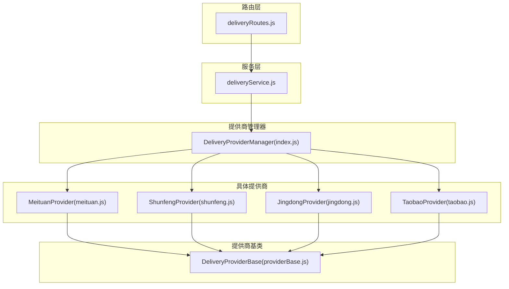
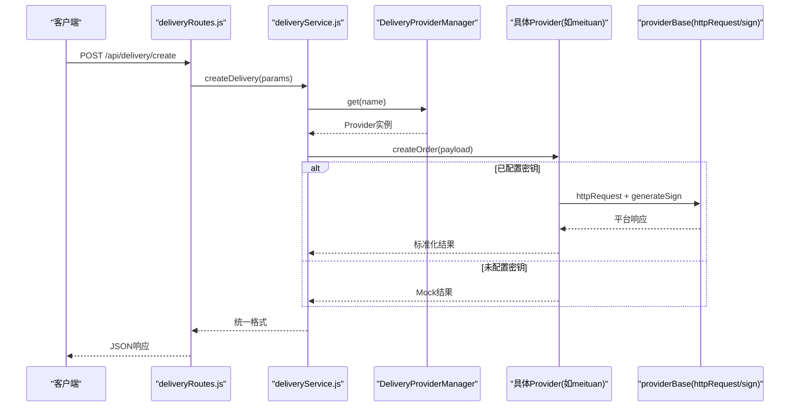
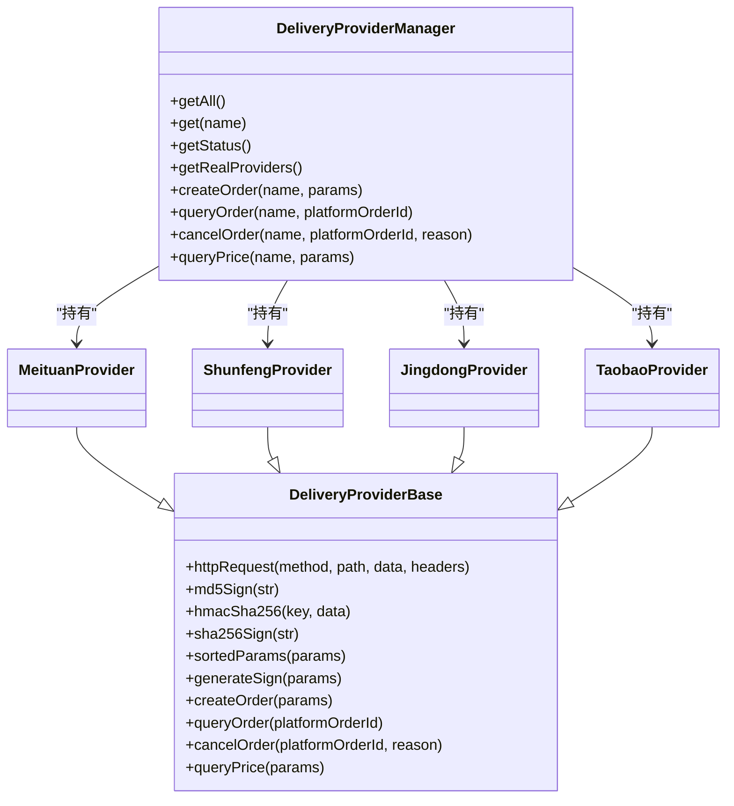

# 配送提供商集成

<cite>
**本文引用的文件列表**
- [backend/services/deliveryProviders/index.js](file://backend/services/deliveryProviders/index.js)
- [backend/services/deliveryProviders/providerBase.js](file://backend/services/deliveryProviders/providerBase.js)
- [backend/services/deliveryProviders/meituan.js](file://backend/services/deliveryProviders/meituan.js)
- [backend/services/deliveryProviders/jingdong.js](file://backend/services/deliveryProviders/jingdong.js)
- [backend/services/deliveryProviders/taobao.js](file://backend/services/deliveryProviders/taobao.js)
- [backend/services/deliveryProviders/shunfeng.js](file://backend/services/deliveryProviders/shunfeng.js)
- [backend/modules/common/services/deliveryService.js](file://backend/modules/common/services/deliveryService.js)
- [backend/modules/common/routes/deliveryRoutes.js](file://backend/modules/common/routes/deliveryRoutes.js)
</cite>

## 目录
1. [简介](#简介)
2. [项目结构](#项目结构)
3. [核心组件](#核心组件)
4. [架构总览](#架构总览)
5. [详细组件分析](#详细组件分析)
6. [依赖关系分析](#依赖关系分析)
7. [性能与可靠性](#性能与可靠性)
8. [故障排查指南](#故障排查指南)
9. [结论](#结论)
10. [附录：接入新提供商开发指南](#附录接入新提供商开发指南)

## 简介
本文件面向“配送提供商集成”的完整技术文档，覆盖美团跑腿、顺丰同城、京东秒送（底层达达）、淘宝闪送（底层蜂鸟）四家平台的接入实现。内容包含：
- 各平台配置参数与认证方式
- API 调用规范与状态码映射
- 生命周期管理（初始化、模式切换、降级策略）
- 费用计算规则与时效预估
- 提供商切换与故障转移方案
- 新增提供商接入的开发指南与最佳实践

## 项目结构
后端采用分层设计：
- 路由层：统一对外暴露配送相关接口（报价、下单、查询、取消、回调等）
- 服务层：聚合定价逻辑、服务商选择、结果标准化
- 提供商抽象层：统一的 HTTP 请求、签名、响应标准化能力
- 具体提供商实现：美团、顺丰、京东（达达）、淘宝（蜂鸟）各自实现

图表来源
- [backend/modules/common/routes/deliveryRoutes.js:1-323](file://backend/modules/common/routes/deliveryRoutes.js#L1-L323)
- [backend/modules/common/services/deliveryService.js:1-322](file://backend/modules/common/services/deliveryService.js#L1-L322)
- [backend/services/deliveryProviders/index.js:1-87](file://backend/services/deliveryProviders/index.js#L1-L87)
- [backend/services/deliveryProviders/providerBase.js:1-124](file://backend/services/deliveryProviders/providerBase.js#L1-L124)
- [backend/services/deliveryProviders/meituan.js:1-257](file://backend/services/deliveryProviders/meituan.js#L1-L257)
- [backend/services/deliveryProviders/shunfeng.js:1-262](file://backend/services/deliveryProviders/shunfeng.js#L1-L262)
- [backend/services/deliveryProviders/jingdong.js:1-278](file://backend/services/deliveryProviders/jingdong.js#L1-L278)
- [backend/services/deliveryProviders/taobao.js:1-263](file://backend/services/deliveryProviders/taobao.js#L1-L263)

章节来源
- [backend/modules/common/routes/deliveryRoutes.js:1-323](file://backend/modules/common/routes/deliveryRoutes.js#L1-L323)
- [backend/modules/common/services/deliveryService.js:1-322](file://backend/modules/common/services/deliveryService.js#L1-L322)
- [backend/services/deliveryProviders/index.js:1-87](file://backend/services/deliveryProviders/index.js#L1-L87)
- [backend/services/deliveryProviders/providerBase.js:1-124](file://backend/services/deliveryProviders/providerBase.js#L1-L124)

## 核心组件
- DeliveryProviderManager：统一入口，负责实例化并分发到具体提供商；提供获取状态、真实可用列表、创建订单、查询、取消、询价等方法。
- DeliveryProviderBase：封装 HTTPS 请求、MD5/HMAC-SHA256/SHA256 签名、参数排序拼接等通用能力；定义抽象方法 createOrder/queryOrder/cancelOrder/queryPrice/generateSign。
- 具体提供商实现：分别实现签名算法、API 路径、参数映射、状态归一化、Mock 回退。
- deliveryService：业务层聚合，负责定价计算、报价排序、服务商名称映射、对外接口标准化。
- deliveryRoutes：HTTP 路由，暴露 provider-status、providers、quotes、estimate、create、status、cancel、callback 等接口。

章节来源
- [backend/services/deliveryProviders/index.js:1-87](file://backend/services/deliveryProviders/index.js#L1-L87)
- [backend/services/deliveryProviders/providerBase.js:1-124](file://backend/services/deliveryProviders/providerBase.js#L1-L124)
- [backend/modules/common/services/deliveryService.js:1-322](file://backend/modules/common/services/deliveryService.js#L1-L322)
- [backend/modules/common/routes/deliveryRoutes.js:1-323](file://backend/modules/common/routes/deliveryRoutes.js#L1-L323)

## 架构总览
整体流程：
- 客户端通过路由层发起请求
- 路由层调用服务层进行参数校验与业务处理
- 服务层根据提供商标识选择对应 Provider
- Provider 在已配置密钥时走真实 API，否则进入 Mock 模式
- 所有返回结果在服务层或 Provider 内部做状态与字段标准化

图表来源
- [backend/modules/common/routes/deliveryRoutes.js:86-133](file://backend/modules/common/routes/deliveryRoutes.js#L86-L133)
- [backend/modules/common/services/deliveryService.js:45-70](file://backend/modules/common/services/deliveryService.js#L45-L70)
- [backend/services/deliveryProviders/index.js:57-62](file://backend/services/deliveryProviders/index.js#L57-L62)
- [backend/services/deliveryProviders/providerBase.js:35-74](file://backend/services/deliveryProviders/providerBase.js#L35-L74)
- [backend/services/deliveryProviders/meituan.js:41-93](file://backend/services/deliveryProviders/meituan.js#L41-L93)

## 详细组件分析

### 统一入口与基类
- DeliveryProviderManager
  - 维护 providers 字典，支持按名称获取
  - getStatus/getRealProviders 用于前端展示与可用性判断
  - 对 createOrder/queryOrder/cancelOrder/queryPrice 做转发
- DeliveryProviderBase
  - httpRequest：统一 HTTPS 请求，超时控制，JSON 解析容错
  - 签名工具：md5Sign/hmacSha256/sha256Sign/sortedParams
  - 抽象接口强制子类实现

章节来源
- [backend/services/deliveryProviders/index.js:20-84](file://backend/services/deliveryProviders/index.js#L20-L84)
- [backend/services/deliveryProviders/providerBase.js:10-124](file://backend/services/deliveryProviders/providerBase.js#L10-L124)

### 美团跑腿（MeituanProvider）
- 认证与环境变量
  - appId/appSecret 来自环境变量
  - 签名：appId + timestamp + secret 的 MD5
- API 路径
  - 创建：POST /api/order/createByShop
  - 查询：POST /api/order/status/query
  - 取消：POST /api/order/delete
  - 询价：POST /api/order/deliveryFee
- 状态映射
  - 数字状态 → 系统标准状态（pending/accepted/picking_up/delivering/delivered/cancelled/exception）
- 降级策略
  - 网络异常或平台错误时自动回退至 Mock 数据

章节来源
- [backend/services/deliveryProviders/meituan.js:15-257](file://backend/services/deliveryProviders/meituan.js#L15-L257)

### 顺丰同城（ShunfengProvider）
- 认证与环境变量
  - partnerId/checkWord 来自环境变量
  - 签名：timestamp + checkWord 的 MD5
- API 路径
  - 创建：POST /api/v1/order/create
  - 查询：POST /api/v1/order/query
  - 取消：POST /api/v1/order/cancel
  - 询价：POST /api/v1/order/preCreate
- 状态映射
  - 数字状态 → 系统标准状态（含 pending/accepted/picking_up/delivering/delivered/cancelled/exception）
- 降级策略
  - 失败时回退至 Mock

章节来源
- [backend/services/deliveryProviders/shunfeng.js:15-262](file://backend/services/deliveryProviders/shunfeng.js#L15-L262)

### 京东秒送（JingdongProvider，底层达达）
- 认证与环境变量
  - appKey/appSecret/sourceId 来自环境变量
  - 签名：参数键排序后拼接，末尾追加 appSecret，取 MD5 大写
- API 路径
  - 创建：POST /api/order/addOrder
  - 查询：POST /api/order/status/query
  - 取消：POST /api/order/formalCancel
  - 询价：POST /api/order/queryDeliverFee
- 状态映射
  - 数字状态 → 系统标准状态（含 pending/accepted/picking_up/delivering/delivered/cancelled/exception）
- 降级策略
  - 失败时回退至 Mock

章节来源
- [backend/services/deliveryProviders/jingdong.js:17-278](file://backend/services/deliveryProviders/jingdong.js#L17-L278)

### 淘宝闪送（TaobaoProvider，底层蜂鸟）
- 认证与环境变量
  - appId/secret/merchantId 来自环境变量
  - 签名：sortedParams(params) + secret 的 MD5
- API 路径
  - 创建：POST /anmp/api/v2/order/create
  - 查询：POST /anmp/api/v2/order/query
  - 取消：POST /anmp/api/v2/order/cancel
  - 询价：POST /anmp/api/v2/order/queryFee
- 状态映射
  - 字符串状态（ORDER_CREATE/ORDER_GRAB/...）→ 系统标准状态
- 降级策略
  - 失败时回退至 Mock

章节来源
- [backend/services/deliveryProviders/taobao.js:22-263](file://backend/services/deliveryProviders/taobao.js#L22-L263)

### 服务层与路由层
- deliveryService
  - 提供定价配置（基础价、每公里单价、最低价、拼单折扣、促销类型）
  - 估算距离（Haversine），计算一对一与拼单价格
  - 统一对外 estimateFee、getAllQuotes、getProviderList、getAvailableProviders
  - 将旧 provider 别名映射到新键名（dada/jd→jingdong，sf→shunfeng，tb→taobao）
- deliveryRoutes
  - GET /provider-status：合并配置与运行模式
  - GET /providers：列出可用服务商及模式
  - POST /quotes：一键获取多家报价
  - POST /estimate：估算费用（兼容旧接口）
  - POST /create：创建配送订单（鉴权）
  - GET /status/:deliveryId：查询配送状态
  - POST /cancel：取消配送
  - POST /callback：接收平台回调，更新订单 courier 字段与事件推送

章节来源
- [backend/modules/common/services/deliveryService.js:122-322](file://backend/modules/common/services/deliveryService.js#L122-L322)
- [backend/modules/common/routes/deliveryRoutes.js:12-323](file://backend/modules/common/routes/deliveryRoutes.js#L12-L323)

## 依赖关系分析
- 路由层依赖服务层
- 服务层依赖提供商管理器
- 提供商管理器持有四个 Provider 实例
- 所有 Provider 继承基类，复用 HTTP 与签名能力

图表来源
- [backend/services/deliveryProviders/index.js:20-84](file://backend/services/deliveryProviders/index.js#L20-L84)
- [backend/services/deliveryProviders/providerBase.js:10-124](file://backend/services/deliveryProviders/providerBase.js#L10-L124)
- [backend/services/deliveryProviders/meituan.js:15-257](file://backend/services/deliveryProviders/meituan.js#L15-L257)
- [backend/services/deliveryProviders/shunfeng.js:15-262](file://backend/services/deliveryProviders/shunfeng.js#L15-L262)
- [backend/services/deliveryProviders/jingdong.js:17-278](file://backend/services/deliveryProviders/jingdong.js#L17-L278)
- [backend/services/deliveryProviders/taobao.js:22-263](file://backend/services/deliveryProviders/taobao.js#L22-L263)

## 性能与可靠性
- 连接与超时
  - 基类统一设置 HTTPS 请求超时，避免长尾阻塞
- 降级与容错
  - 各 Provider 在真实 API 失败时自动回退至 Mock，保障链路可用
- 重试机制
  - 当前代码未内置指数退避重试；建议在服务层或网关层增加可配置的重试策略（幂等性需由上游保证）
- 连接池
  - Node.js https 默认复用 TCP 连接；如需更高并发，可在上层引入 http.Agent 或第三方库进行连接池管理
- 监控与日志
  - 关键节点输出日志（下单成功/失败、查询失败、回调处理等），便于定位问题

[本节为通用建议，不直接分析具体文件]

## 故障排查指南
- 常见问题
  - 未配置密钥导致始终处于 Mock 模式：检查环境变量是否注入
  - 签名失败：确认签名串拼接顺序与大小写要求
  - 平台返回非 JSON：基类会保留 _raw 字段，便于调试
  - 回调未触发：核对回调地址、域名可达性与防火墙策略
- 定位步骤
  - 查看路由层日志与错误码
  - 检查 Provider 的日志输出（下单失败、查询失败、取消失败）
  - 使用 /provider-status 与 /providers 接口确认运行模式与可用列表
  - 使用 /tracking/active 查看跟踪任务状态（调试用）

章节来源
- [backend/modules/common/routes/deliveryRoutes.js:12-323](file://backend/modules/common/routes/deliveryRoutes.js#L12-L323)
- [backend/services/deliveryProviders/providerBase.js:35-74](file://backend/services/deliveryProviders/providerBase.js#L35-L74)

## 结论
本集成以“基类抽象 + 多实现 + 统一入口”的方式，屏蔽了不同配送平台的差异，提供了稳定的下单、查询、取消与询价能力。通过 Mock 模式与降级策略，系统在无密钥环境下仍可联调与演示。后续可在服务层补充重试、熔断、限流与更完善的监控指标，进一步提升稳定性与可观测性。

[本节为总结，不直接分析具体文件]

## 附录：接入新提供商开发指南

### 必须实现的接口与方法
- 继承 DeliveryProviderBase 并实现以下方法：
  - generateSign(params)：按平台规范生成签名
  - createOrder(params)：创建订单，返回统一结构
  - queryOrder(platformOrderId)：查询状态，返回统一结构
  - cancelOrder(platformOrderId, reason)：取消订单
  - queryPrice(params)：询价，返回统一结构
- 在 DeliveryProviderManager 中注册新 Provider 实例

章节来源
- [backend/services/deliveryProviders/providerBase.js:105-121](file://backend/services/deliveryProviders/providerBase.js#L105-L121)
- [backend/services/deliveryProviders/index.js:20-28](file://backend/services/deliveryProviders/index.js#L20-L28)

### 配置参数与环境变量
- 在构造函数中读取环境变量作为 credentials 与 apiBaseUrl
- 示例参考现有 Provider 的环境变量命名风格（如 MEITUAN_APP_ID、SF_PARTNER_ID 等）

章节来源
- [backend/services/deliveryProviders/meituan.js:16-28](file://backend/services/deliveryProviders/meituan.js#L16-L28)
- [backend/services/deliveryProviders/shunfeng.js:16-28](file://backend/services/deliveryProviders/shunfeng.js#L16-L28)
- [backend/services/deliveryProviders/jingdong.js:18-31](file://backend/services/deliveryProviders/jingdong.js#L18-L31)
- [backend/services/deliveryProviders/taobao.js:23-36](file://backend/services/deliveryProviders/taobao.js#L23-L36)

### API 调用规范
- 使用基类的 httpRequest 发送 HTTPS 请求
- 按平台要求组装参数与签名
- 对平台返回进行状态与字段归一化，确保上层一致

章节来源
- [backend/services/deliveryProviders/providerBase.js:35-74](file://backend/services/deliveryProviders/providerBase.js#L35-L74)
- [backend/services/deliveryProviders/meituan.js:41-93](file://backend/services/deliveryProviders/meituan.js#L41-L93)
- [backend/services/deliveryProviders/shunfeng.js:45-95](file://backend/services/deliveryProviders/shunfeng.js#L45-L95)
- [backend/services/deliveryProviders/jingdong.js:50-98](file://backend/services/deliveryProviders/jingdong.js#L50-L98)
- [backend/services/deliveryProviders/taobao.js:48-99](file://backend/services/deliveryProviders/taobao.js#L48-L99)

### 错误码映射与状态对照
- 在各 Provider 内部建立平台状态码到系统标准状态的映射
- 常见系统状态：pending、accepted、picking_up、delivering、delivered、cancelled、exception

章节来源
- [backend/services/deliveryProviders/meituan.js:185-209](file://backend/services/deliveryProviders/meituan.js#L185-L209)
- [backend/services/deliveryProviders/shunfeng.js:187-215](file://backend/services/deliveryProviders/shunfeng.js#L187-L215)
- [backend/services/deliveryProviders/jingdong.js:208-231](file://backend/services/deliveryProviders/jingdong.js#L208-L231)
- [backend/services/deliveryProviders/taobao.js:193-216](file://backend/services/deliveryProviders/taobao.js#L193-L216)

### 费用计算规则与时效预估
- 服务层提供定价配置与计算逻辑，支持一对一与拼单两种模式
- 时效预估基于距离与固定系数计算，返回分钟区间

章节来源
- [backend/modules/common/services/deliveryService.js:122-259](file://backend/modules/common/services/deliveryService.js#L122-L259)

### 提供商切换与故障转移
- 切换：通过路由或服务层传入 provider 参数即可切换到指定平台
- 故障转移：当真实 API 不可用时，Provider 自动降级至 Mock，保证链路可用
- 扩展：可在服务层加入健康检查与权重轮询，实现更智能的故障转移

章节来源
- [backend/modules/common/routes/deliveryRoutes.js:86-133](file://backend/modules/common/routes/deliveryRoutes.js#L86-L133)
- [backend/services/deliveryProviders/meituan.js:88-93](file://backend/services/deliveryProviders/meituan.js#L88-L93)
- [backend/services/deliveryProviders/shunfeng.js:91-95](file://backend/services/deliveryProviders/shunfeng.js#L91-L95)
- [backend/services/deliveryProviders/jingdong.js:94-98](file://backend/services/deliveryProviders/jingdong.js#L94-L98)
- [backend/services/deliveryProviders/taobao.js:95-99](file://backend/services/deliveryProviders/taobao.js#L95-L99)