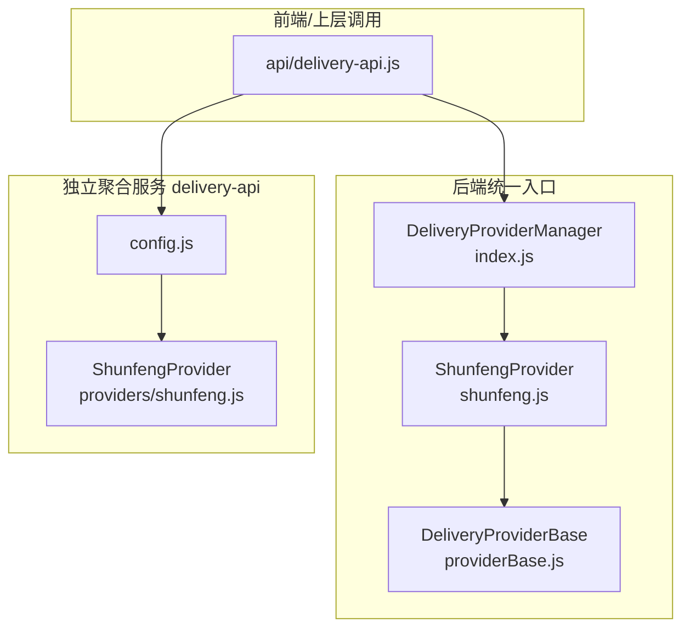
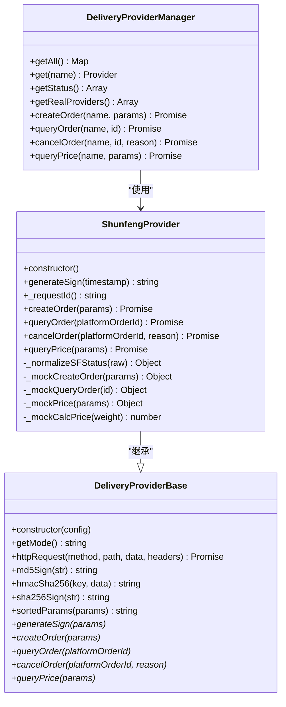
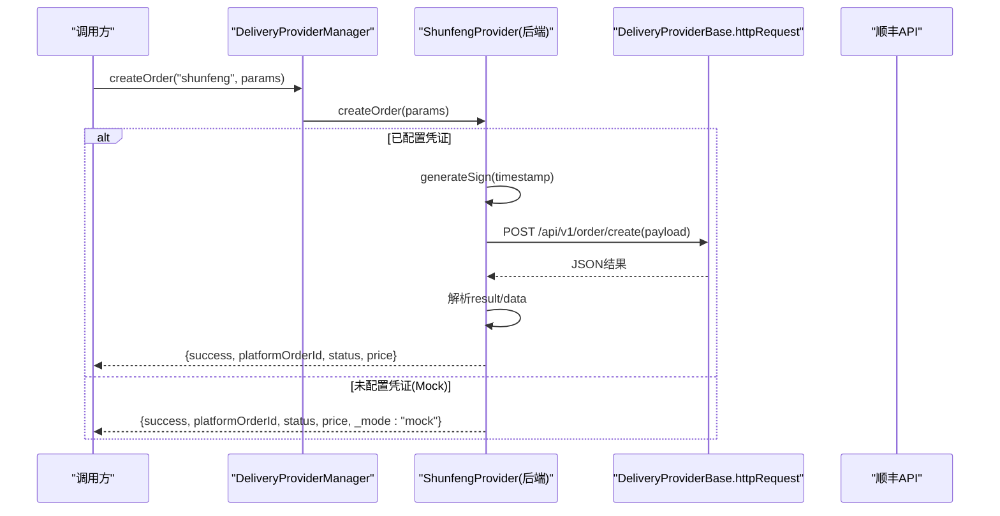
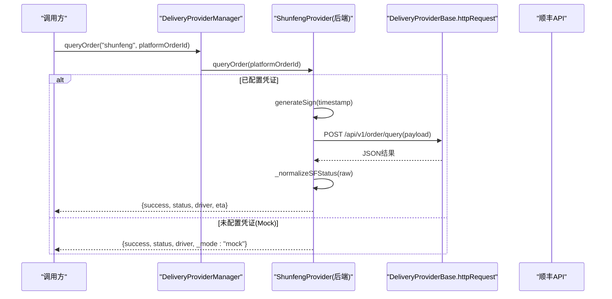
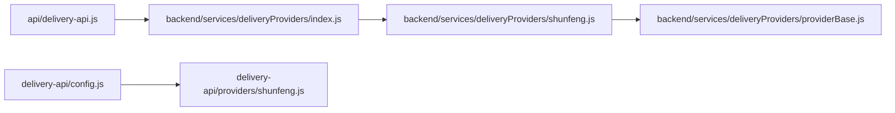
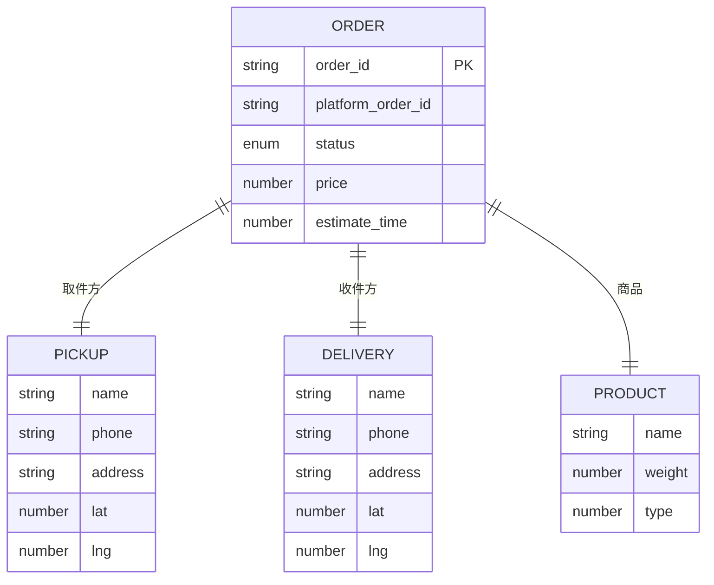

# 顺丰同城集成

<cite>
**本文引用的文件列表**
- [backend/services/deliveryProviders/providerBase.js](file://backend/services/deliveryProviders/providerBase.js)
- [backend/services/deliveryProviders/index.js](file://backend/services/deliveryProviders/index.js)
- [backend/services/deliveryProviders/shunfeng.js](file://backend/services/deliveryProviders/shunfeng.js)
- [delivery-api/config.js](file://delivery-api/config.js)
- [delivery-api/providers/shunfeng.js](file://delivery-api/providers/shunfeng.js)
- [api/delivery-api.js](file://api/delivery-api.js)
</cite>

## 目录
1. [简介](#简介)
2. [项目结构](#项目结构)
3. [核心组件](#核心组件)
4. [架构总览](#架构总览)
5. [详细组件分析](#详细组件分析)
6. [依赖关系分析](#依赖关系分析)
7. [性能与可靠性](#性能与可靠性)
8. [故障排查指南](#故障排查指南)
9. [结论](#结论)
10. [附录：API 规范与数据模型](#附录api-规范与数据模型)

## 简介
本文件面向“顺丰同城”配送提供商的对接与集成，覆盖企业账号注册、密钥配置、身份认证机制；详细说明订单创建、状态查询、取消、费用估算等接口的调用规范与参数要求；提供完整的请求/响应数据模型定义（取件人、收件人、商品、地址等）；解释预约配送、加急服务、保价服务等高级功能的接入思路；并给出错误处理、重试策略、超时配置等技术细节与调试方法。

## 项目结构
本项目在两个位置实现了顺丰同城能力：
- 后端统一入口：backend/services/deliveryProviders/*，通过基类抽象与多服务商实现，对外暴露统一的 createOrder/queryOrder/cancelOrder/queryPrice 接口。
- 独立聚合服务 delivery-api：作为可选微服务存在，包含独立的 shunfeng 实现与全局配置。

图示来源
- [backend/services/deliveryProviders/index.js:1-87](file://backend/services/deliveryProviders/index.js#L1-L87)
- [backend/services/deliveryProviders/shunfeng.js:1-262](file://backend/services/deliveryProviders/shunfeng.js#L1-L262)
- [backend/services/deliveryProviders/providerBase.js:1-124](file://backend/services/deliveryProviders/providerBase.js#L1-L124)
- [delivery-api/config.js:1-93](file://delivery-api/config.js#L1-L93)
- [delivery-api/providers/shunfeng.js:1-256](file://delivery-api/providers/shunfeng.js#L1-L256)
- [api/delivery-api.js:1-283](file://api/delivery-api.js#L1-L283)

章节来源
- [backend/services/deliveryProviders/index.js:1-87](file://backend/services/deliveryProviders/index.js#L1-L87)
- [backend/services/deliveryProviders/providerBase.js:1-124](file://backend/services/deliveryProviders/providerBase.js#L1-L124)
- [delivery-api/config.js:1-93](file://delivery-api/config.js#L1-L93)
- [api/delivery-api.js:1-283](file://api/delivery-api.js#L1-L283)

## 核心组件
- DeliveryProviderBase：封装 HTTPS 请求、签名工具（MD5/HMAC-SHA256/SHA256）、参数排序拼接、超时控制等通用能力，并提供抽象接口供各服务商继承实现。
- ShunfengProvider（后端）：基于 base 类实现顺丰同城的 createOrder/queryOrder/cancelOrder/queryPrice，支持真实 API 与 Mock 模式切换。
- DeliveryProviderManager：统一注册与管理所有配送服务商，屏蔽差异，向上层提供一致的方法。
- delivery-api 侧 ShunfengProvider：独立服务的实现，侧重示例与 mock，便于单独运行或演示。
- delivery-api/config.js：集中管理各服务商测试/生产环境配置，包括顺丰的 appId/appKey/partnerId/checkWord 及 URL。

章节来源
- [backend/services/deliveryProviders/providerBase.js:1-124](file://backend/services/deliveryProviders/providerBase.js#L1-L124)
- [backend/services/deliveryProviders/shunfeng.js:1-262](file://backend/services/deliveryProviders/shunfeng.js#L1-L262)
- [backend/services/deliveryProviders/index.js:1-87](file://backend/services/deliveryProviders/index.js#L1-L87)
- [delivery-api/providers/shunfeng.js:1-256](file://delivery-api/providers/shunfeng.js#L1-L256)
- [delivery-api/config.js:1-93](file://delivery-api/config.js#L1-L93)

## 架构总览
后端采用“基类 + 多实现”的统一配送适配层，上层仅依赖 manager 提供的统一接口。顺丰实现内部根据是否配置有效凭证自动选择真实 API 或 Mock 模式，保证开发联调与上线平滑过渡。

图示来源
- [backend/services/deliveryProviders/providerBase.js:1-124](file://backend/services/deliveryProviders/providerBase.js#L1-L124)
- [backend/services/deliveryProviders/shunfeng.js:1-262](file://backend/services/deliveryProviders/shunfeng.js#L1-L262)
- [backend/services/deliveryProviders/index.js:1-87](file://backend/services/deliveryProviders/index.js#L1-L87)

## 详细组件分析

### 企业账号注册与密钥配置
- 注册与获取凭证
  - 在顺丰开放平台完成商户注册后，获取 partnerId 与 checkWord。
- 环境变量配置
  - SF_PARTNER_ID：商户伙伴标识
  - SF_CHECK_WORD：校验字串
  - SF_API_URL：API 基础地址（默认指向沙箱）
- 运行模式判定
  - 当未配置上述凭证时，进入 mock 模式，返回合理模拟数据，便于本地开发与联调。

章节来源
- [backend/services/deliveryProviders/shunfeng.js:1-28](file://backend/services/deliveryProviders/shunfeng.js#L1-L28)
- [backend/services/deliveryProviders/index.js:1-13](file://backend/services/deliveryProviders/index.js#L1-L13)
- [delivery-api/config.js:63-78](file://delivery-api/config.js#L63-L78)

### 身份认证与签名机制
- 后端实现（推荐用于生产）
  - 签名算法：将时间戳与 checkWord 拼接后进行 MD5 计算得到 sign。
  - 请求头/体中需携带 partner_id、timestamp、sign、request_id 等字段。
- 独立服务实现（示例）
  - 对参数按 key 排序拼接后追加 secret，进行 SHA256 计算得到 sign。
  - 适用于 delivery-api 独立运行场景。

章节来源
- [backend/services/deliveryProviders/shunfeng.js:30-34](file://backend/services/deliveryProviders/shunfeng.js#L30-L34)
- [delivery-api/providers/shunfeng.js:21-35](file://delivery-api/providers/shunfeng.js#L21-L35)

### 核心 API 接口与调用规范

#### 1) 订单创建
- 后端实现
  - 路径：POST /api/v1/order/create
  - 关键入参：partner_id、request_id、timestamp、sign、order_id、shop_*、user_*、product_*、callback_url 等
  - 成功返回：success=true，platformOrderId、deliveryId、status、price、estimateTime 等
- 独立服务实现
  - 构造 app_id/app_key/timestamp/request_id/version 等，附带城市、起止地址、重量、商品描述等
  - 返回 platformOrderId、status、price、message 等

图示来源
- [backend/services/deliveryProviders/index.js:57-62](file://backend/services/deliveryProviders/index.js#L57-L62)
- [backend/services/deliveryProviders/shunfeng.js:45-95](file://backend/services/deliveryProviders/shunfeng.js#L45-L95)
- [backend/services/deliveryProviders/providerBase.js:35-74](file://backend/services/deliveryProviders/providerBase.js#L35-L74)

章节来源
- [backend/services/deliveryProviders/shunfeng.js:45-95](file://backend/services/deliveryProviders/shunfeng.js#L45-L95)
- [delivery-api/providers/shunfeng.js:95-152](file://delivery-api/providers/shunfeng.js#L95-L152)

#### 2) 订单状态查询
- 后端实现
  - 路径：POST /api/v1/order/query
  - 关键入参：partner_id、request_id、timestamp、sign、order_id
  - 返回：标准化后的 status、driver、distance、eta 等
- 独立服务实现
  - 构造 app_id/app_key/timestamp/request_id/order_id 等
  - 返回 providerName、status、driver、message 等

图示来源
- [backend/services/deliveryProviders/index.js:64-69](file://backend/services/deliveryProviders/index.js#L64-L69)
- [backend/services/deliveryProviders/shunfeng.js:101-125](file://backend/services/deliveryProviders/shunfeng.js#L101-L125)
- [backend/services/deliveryProviders/shunfeng.js:186-215](file://backend/services/deliveryProviders/shunfeng.js#L186-L215)

章节来源
- [backend/services/deliveryProviders/shunfeng.js:101-125](file://backend/services/deliveryProviders/shunfeng.js#L101-L125)
- [delivery-api/providers/shunfeng.js:159-188](file://delivery-api/providers/shunfeng.js#L159-L188)

#### 3) 订单取消
- 后端实现
  - 路径：POST /api/v1/order/cancel
  - 关键入参：partner_id、request_id、timestamp、sign、order_id、cancel_reason
  - 返回：success、message
- 独立服务实现
  - 构造 app_id/app_key/timestamp/request_id/order_id/cancel_reason 等
  - 返回 success、status="cancelled"、message

章节来源
- [backend/services/deliveryProviders/shunfeng.js:131-155](file://backend/services/deliveryProviders/shunfeng.js#L131-L155)
- [delivery-api/providers/shunfeng.js:196-225](file://delivery-api/providers/shunfeng.js#L196-L225)

#### 4) 费用估算（询价）
- 后端实现
  - 路径：POST /api/v1/order/preCreate（预下单/估价）
  - 关键入参：shop_lat/lng、user_lat/lng、product_weight、product_type 等
  - 返回：total_price、expect_time
- 独立服务实现
  - 构造 city_name、pickup_address、dropoff_address、weight、product_type 等
  - 返回 price、estimateTime、distance

章节来源
- [backend/services/deliveryProviders/shunfeng.js:157-184](file://backend/services/deliveryProviders/shunfeng.js#L157-L184)
- [delivery-api/providers/shunfeng.js:50-88](file://delivery-api/providers/shunfeng.js#L50-L88)

### 业务逻辑与高级功能
- 预约配送
  - 可在创建订单时传入期望取件/送达时间字段（由上游业务组装），并在回调中同步履约进度。
- 加急服务
  - 通过 product_type 或附加服务字段表达优先级（具体枚举以官方文档为准）。
- 保价服务
  - 在商品描述或附加字段中声明保价金额与说明，结合 callback_url 接收异常与签收事件。
- 回调通知
  - 建议在创建订单时提供 callback_url，以便接收状态变更推送，减少轮询成本。

章节来源
- [backend/services/deliveryProviders/shunfeng.js:45-73](file://backend/services/deliveryProviders/shunfeng.js#L45-L73)

## 依赖关系分析
- 后端统一入口依赖各 Provider 实现，并通过环境变量判断是否启用真实 API。
- 独立服务 delivery-api 拥有自己的配置与实现，适合独立部署与演示。
- 前端/上层模块通过 api/delivery-api.js 提供的统一对象进行交互（当前为预留/模拟实现）。

图示来源
- [api/delivery-api.js:1-283](file://api/delivery-api.js#L1-L283)
- [backend/services/deliveryProviders/index.js:1-87](file://backend/services/deliveryProviders/index.js#L1-L87)
- [backend/services/deliveryProviders/shunfeng.js:1-262](file://backend/services/deliveryProviders/shunfeng.js#L1-L262)
- [backend/services/deliveryProviders/providerBase.js:1-124](file://backend/services/deliveryProviders/providerBase.js#L1-L124)
- [delivery-api/config.js:1-93](file://delivery-api/config.js#L1-L93)
- [delivery-api/providers/shunfeng.js:1-256](file://delivery-api/providers/shunfeng.js#L1-L256)

章节来源
- [backend/services/deliveryProviders/index.js:1-87](file://backend/services/deliveryProviders/index.js#L1-L87)
- [delivery-api/config.js:1-93](file://delivery-api/config.js#L1-L93)
- [api/delivery-api.js:1-283](file://api/delivery-api.js#L1-L283)

## 性能与可靠性
- 超时配置
  - 后端基类默认 HTTP 超时为 15 秒，可通过构造函数 timeout 调整。
  - delivery-api 聚合策略中定义了 aggregator.timeout=10000ms，可作为参考。
- 重试策略
  - delivery-api 聚合策略中定义了 retryTimes=2，可按需扩展至后端 Provider 层。
- 幂等与去重
  - 每次请求生成唯一 request_id，避免重复提交导致重复下单。
- 降级与容错
  - 未配置凭证时自动回退到 Mock 模式，保障联调体验。
  - 网络异常或超时捕获后，可回退到 Mock 或上层重试。

章节来源
- [backend/services/deliveryProviders/providerBase.js:16-26](file://backend/services/deliveryProviders/providerBase.js#L16-L26)
- [delivery-api/config.js:80-85](file://delivery-api/config.js#L80-L85)
- [backend/services/deliveryProviders/shunfeng.js:91-94](file://backend/services/deliveryProviders/shunfeng.js#L91-L94)

## 故障排查指南
- 常见问题定位
  - 签名失败：检查 timestamp 与 checkWord 拼接顺序、编码与大小写。
  - 超时：确认 SF_API_URL 可达性、网络延迟与超时阈值设置。
  - 状态不一致：核对顺丰返回的状态码映射表，确保上层状态机兼容。
- 日志与调试
  - 关注控制台输出中的 “[顺丰]” 前缀日志，快速定位错误信息。
  - 在 Mock 模式下，返回结果会包含 _mode 标记，便于区分数据来源。
- 建议
  - 在生产环境开启回调监听，降低轮询压力。
  - 对关键链路增加埋点与指标采集（成功率、P95/P99 耗时）。

章节来源
- [backend/services/deliveryProviders/shunfeng.js:89-94](file://backend/services/deliveryProviders/shunfeng.js#L89-L94)
- [backend/services/deliveryProviders/shunfeng.js:121-124](file://backend/services/deliveryProviders/shunfeng.js#L121-L124)
- [backend/services/deliveryProviders/shunfeng.js:218-258](file://backend/services/deliveryProviders/shunfeng.js#L218-L258)

## 结论
本项目在后端与独立服务两条路径均实现了顺丰同城的对接能力，具备完善的签名、鉴权、Mock 降级与统一接口封装。通过环境变量控制生产/沙箱切换，配合回调与重试策略，可满足从联调到生产的完整生命周期需求。

## 附录：API 规范与数据模型

### 通用字段
- 请求公共字段
  - partner_id：商户伙伴标识
  - request_id：请求唯一标识（建议雪花/UUID）
  - timestamp：秒级时间戳
  - sign：签名值（MD5 或 SHA256，取决于实现）
- 响应公共字段
  - success：布尔
  - provider：服务商代码
  - platformOrderId：第三方平台订单号
  - status：标准化状态
  - error/message：错误信息或提示

### 订单创建
- 请求关键字段
  - order_id：系统内订单号
  - shop_name/shop_phone/shop_address/shop_lat/shop_lng：取件方信息
  - user_name/user_phone/user_address/user_lat/user_lng：收件方信息
  - product_name/product_weight/product_type：商品信息与服务类型
  - callback_url：回调地址
- 响应关键字段
  - platformOrderId、deliveryId、status、price、estimateTime

章节来源
- [backend/services/deliveryProviders/shunfeng.js:45-95](file://backend/services/deliveryProviders/shunfeng.js#L45-L95)

### 订单状态查询
- 请求关键字段
  - order_id：第三方平台订单号
- 响应关键字段
  - status：标准化状态（pending/accepted/picking_up/delivering/delivered/cancelled/exception）
  - driver：{name, phone, location}
  - distance、eta

章节来源
- [backend/services/deliveryProviders/shunfeng.js:101-125](file://backend/services/deliveryProviders/shunfeng.js#L101-L125)
- [backend/services/deliveryProviders/shunfeng.js:186-215](file://backend/services/deliveryProviders/shunfeng.js#L186-L215)

### 订单取消
- 请求关键字段
  - order_id、cancel_reason
- 响应关键字段
  - success、message

章节来源
- [backend/services/deliveryProviders/shunfeng.js:131-155](file://backend/services/deliveryProviders/shunfeng.js#L131-L155)

### 费用估算
- 请求关键字段
  - shop_lat/lng、user_lat/lng、product_weight、product_type
- 响应关键字段
  - total_price、expect_time

章节来源
- [backend/services/deliveryProviders/shunfeng.js:157-184](file://backend/services/deliveryProviders/shunfeng.js#L157-L184)

### 数据模型 ER 示意（概念）

[此图为概念示意，不直接对应具体源码结构]