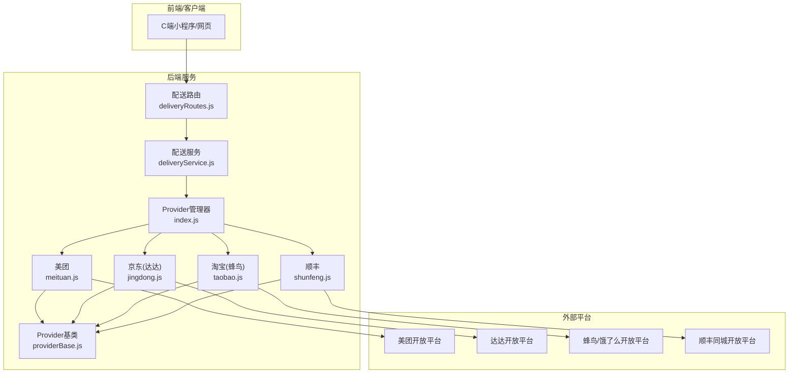
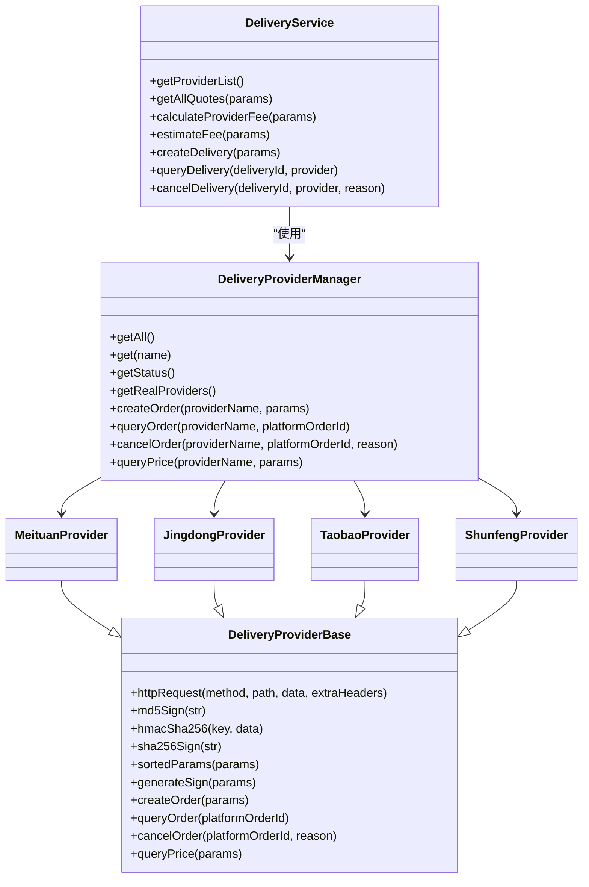
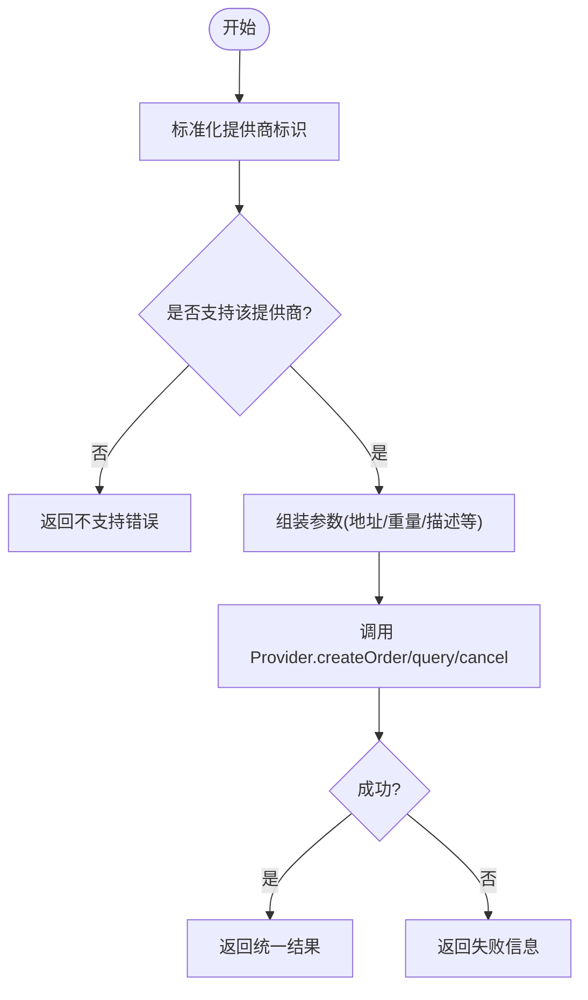
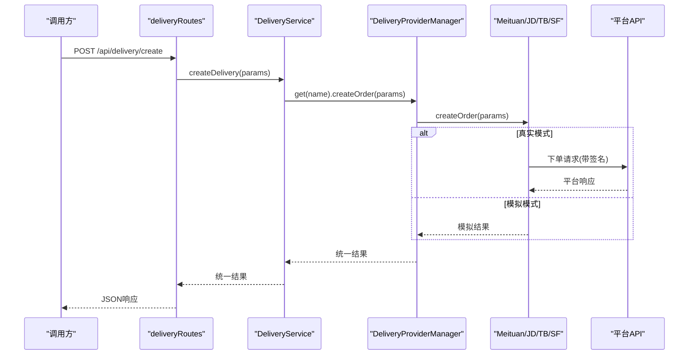
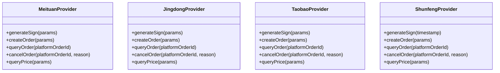
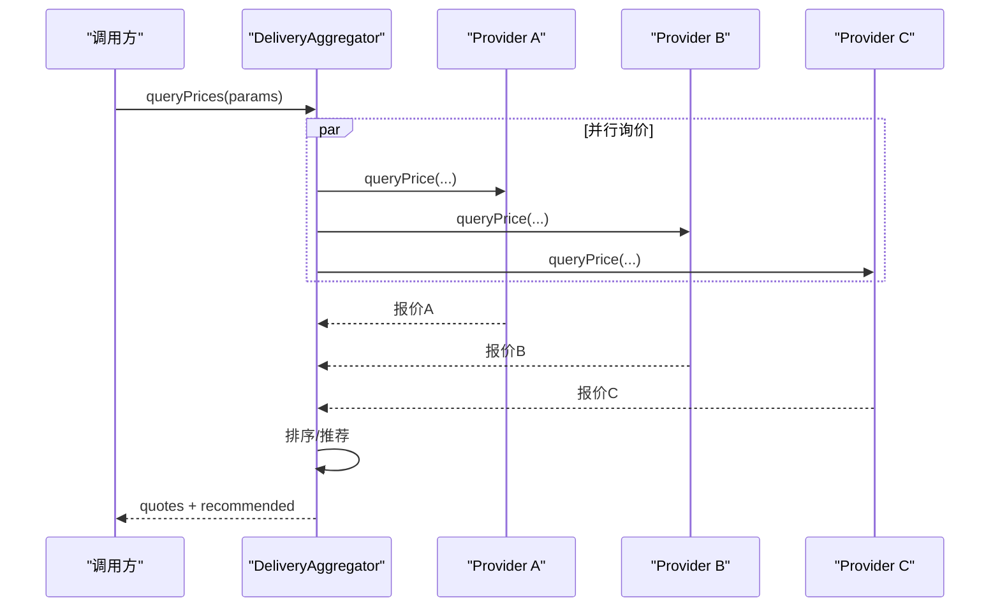
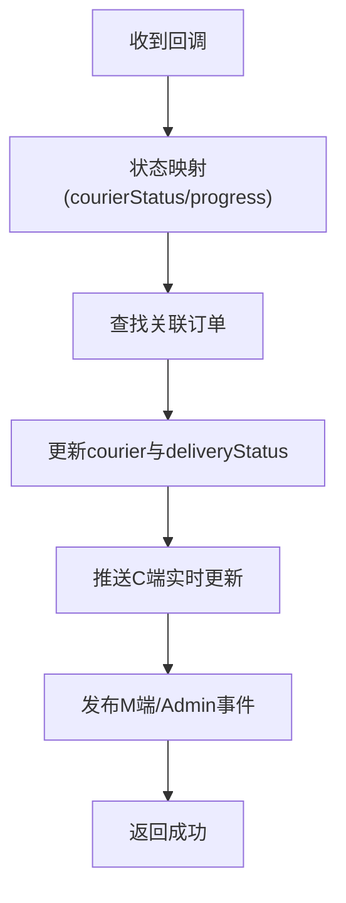
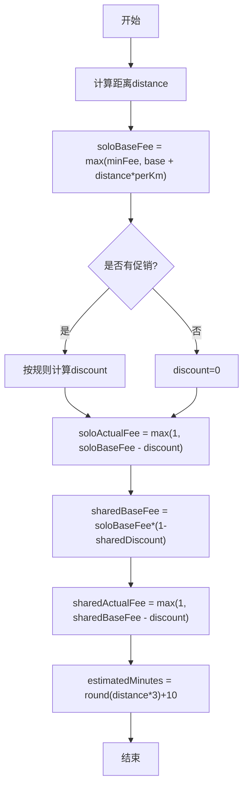
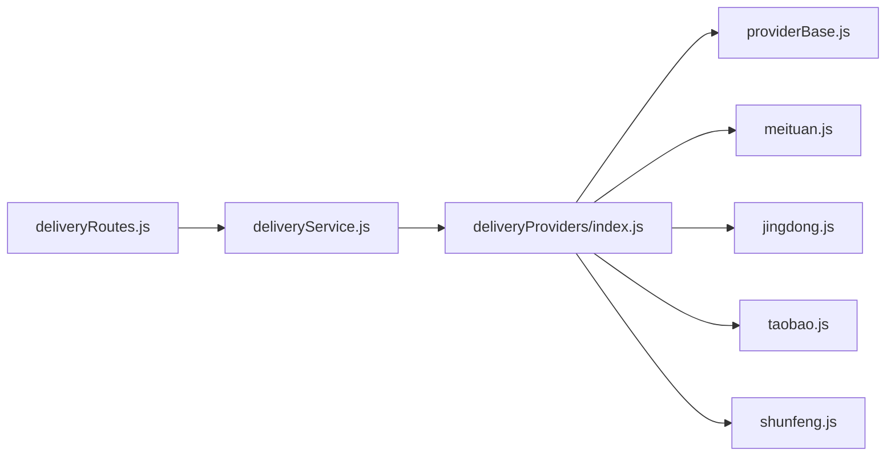

# 配送服务系统

<cite>
**本文引用的文件**   
- [backend/modules/common/services/deliveryService.js](file://backend/modules/common/services/deliveryService.js)
- [backend/modules/common/routes/deliveryRoutes.js](file://backend/modules/common/routes/deliveryRoutes.js)
- [backend/services/deliveryProviders/index.js](file://backend/services/deliveryProviders/index.js)
- [backend/services/deliveryProviders/providerBase.js](file://backend/services/deliveryProviders/providerBase.js)
- [backend/services/deliveryProviders/meituan.js](file://backend/services/deliveryProviders/meituan.js)
- [backend/services/deliveryProviders/jingdong.js](file://backend/services/deliveryProviders/jingdong.js)
- [backend/services/deliveryProviders/taobao.js](file://backend/services/deliveryProviders/taobao.js)
- [backend/services/deliveryProviders/shunfeng.js](file://backend/services/deliveryProviders/shunfeng.js)
- [delivery-api/aggregator.js](file://delivery-api/aggregator.js)
- [api/delivery-api.js](file://api/delivery-api.js)
</cite>

## 目录
1. [简介](#简介)
2. [项目结构](#项目结构)
3. [核心组件](#核心组件)
4. [架构总览](#架构总览)
5. [详细组件分析](#详细组件分析)
6. [依赖关系分析](#依赖关系分析)
7. [性能与扩展性](#性能与扩展性)
8. [故障排查指南](#故障排查指南)
9. [结论](#结论)
10. [附录：API 接口规范](#附录api-接口规范)

## 简介
本系统为干洗店配送服务提供统一接入层，支持美团跑腿、京东秒送（达达）、淘宝闪送（蜂鸟）、顺丰同城等多平台。通过 Provider 抽象层屏蔽各平台差异，对外暴露统一的下单、查询、取消、报价等能力；同时内置费用计算、拼单折扣、状态同步回调与模拟跟踪机制，便于开发与联调。

## 项目结构
围绕“聚合调度 + 提供商抽象 + 业务路由”的三层组织方式：
- 业务路由层：对外暴露 REST API，负责参数校验、鉴权、调用服务层
- 服务层：聚合定价与报价逻辑，协调 ProviderManager 完成真实或模拟对接
- 提供商层：按平台实现签名、下单、查询、取消、估价，并具备 Mock 降级能力
- 独立聚合模块：提供跨服务的聚合调度与推荐策略（可选）

图表来源
- [backend/modules/common/routes/deliveryRoutes.js:1-323](file://backend/modules/common/routes/deliveryRoutes.js#L1-L323)
- [backend/modules/common/services/deliveryService.js:1-322](file://backend/modules/common/services/deliveryService.js#L1-L322)
- [backend/services/deliveryProviders/index.js:1-87](file://backend/services/deliveryProviders/index.js#L1-L87)
- [backend/services/deliveryProviders/providerBase.js:1-124](file://backend/services/deliveryProviders/providerBase.js#L1-L124)
- [backend/services/deliveryProviders/meituan.js:1-257](file://backend/services/deliveryProviders/meituan.js#L1-L257)
- [backend/services/deliveryProviders/jingdong.js:1-278](file://backend/services/deliveryProviders/jingdong.js#L1-L278)
- [backend/services/deliveryProviders/taobao.js:1-263](file://backend/services/deliveryProviders/taobao.js#L1-L263)
- [backend/services/deliveryProviders/shunfeng.js:1-262](file://backend/services/deliveryProviders/shunfeng.js#L1-L262)

章节来源
- [backend/modules/common/routes/deliveryRoutes.js:1-323](file://backend/modules/common/routes/deliveryRoutes.js#L1-L323)
- [backend/modules/common/services/deliveryService.js:1-322](file://backend/modules/common/services/deliveryService.js#L1-L322)
- [backend/services/deliveryProviders/index.js:1-87](file://backend/services/deliveryProviders/index.js#L1-L87)
- [backend/services/deliveryProviders/providerBase.js:1-124](file://backend/services/deliveryProviders/providerBase.js#L1-L124)

## 核心组件
- 配送服务 DeliveryService
  - 职责：统一入口，处理定价/报价、一键获取多平台报价、估算费用、创建/查询/取消配送订单
  - 关键方法：getAllQuotes、calculateProviderFee、estimateFee、createDelivery、queryDelivery、cancelDelivery
- Provider 管理器 DeliveryProviderManager
  - 职责：注册与管理各平台 Provider，统一分发 createOrder/queryOrder/cancelOrder/queryPrice
- Provider 基类 DeliveryProviderBase
  - 职责：封装 HTTPS 请求、签名算法、Mock 模式判断、抽象接口定义
- 平台 Provider 实现
  - 美团、京东（达达）、淘宝（蜂鸟）、顺丰：各自实现签名、下单、查询、取消、估价，并提供 Mock 降级
- 聚合调度器 DeliveryAggregator（独立模块）
  - 职责：并行询价、自动选择最优服务商、创建订单、查询/取消订单

章节来源
- [backend/modules/common/services/deliveryService.js:1-322](file://backend/modules/common/services/deliveryService.js#L1-L322)
- [backend/services/deliveryProviders/index.js:1-87](file://backend/services/deliveryProviders/index.js#L1-L87)
- [backend/services/deliveryProviders/providerBase.js:1-124](file://backend/services/deliveryProviders/providerBase.js#L1-L124)
- [delivery-api/aggregator.js:1-237](file://delivery-api/aggregator.js#L1-L237)

## 架构总览
整体采用“路由 → 服务 → 提供商管理器 → 具体 Provider”的分层架构，结合“真实 API + Mock 降级”的双模运行模式，确保开发测试与生产稳定。

图表来源
- [backend/modules/common/services/deliveryService.js:1-322](file://backend/modules/common/services/deliveryService.js#L1-L322)
- [backend/services/deliveryProviders/index.js:1-87](file://backend/services/deliveryProviders/index.js#L1-L87)
- [backend/services/deliveryProviders/providerBase.js:1-124](file://backend/services/deliveryProviders/providerBase.js#L1-L124)
- [backend/services/deliveryProviders/meituan.js:1-257](file://backend/services/deliveryProviders/meituan.js#L1-L257)
- [backend/services/deliveryProviders/jingdong.js:1-278](file://backend/services/deliveryProviders/jingdong.js#L1-L278)
- [backend/services/deliveryProviders/taobao.js:1-263](file://backend/services/deliveryProviders/taobao.js#L1-L263)
- [backend/services/deliveryProviders/shunfeng.js:1-262](file://backend/services/deliveryProviders/shunfeng.js#L1-L262)

## 详细组件分析

### 配送服务层（DeliveryService）
- 功能要点
  - 标准化提供商标识映射，兼容历史键名
  - 一键获取所有平台报价（含一对一与拼单两种模式）
  - 费用估算：基础运费 + 距离加价 + 促销折扣（新用户立减、百分比折扣、满减、限时优惠）
  - 创建/查询/取消配送订单，统一返回格式
- 复杂度与优化
  - 报价计算为 O(n)，n 为平台数量；可缓存常用路线价格
  - 距离估算使用 Haversine 公式，时间复杂度 O(1)

图表来源
- [backend/modules/common/services/deliveryService.js:45-115](file://backend/modules/common/services/deliveryService.js#L45-L115)

章节来源
- [backend/modules/common/services/deliveryService.js:1-322](file://backend/modules/common/services/deliveryService.js#L1-L322)

### 提供商抽象层（Provider Base + Manager）
- 设计要点
  - 基类提供 HTTP 封装、通用签名工具、超时控制、Mock 模式判定
  - 管理器集中注册各 Provider，提供统一分发接口
  - 每个 Provider 实现 generateSign、createOrder、queryOrder、cancelOrder、queryPrice
- 运行模式
  - real：已配置密钥，走真实平台 API
  - mock：未配置密钥，返回合理模拟数据，便于联调

图表来源
- [backend/modules/common/routes/deliveryRoutes.js:87-133](file://backend/modules/common/routes/deliveryRoutes.js#L87-L133)
- [backend/modules/common/services/deliveryService.js:45-70](file://backend/modules/common/services/deliveryService.js#L45-L70)
- [backend/services/deliveryProviders/index.js:57-62](file://backend/services/deliveryProviders/index.js#L57-L62)
- [backend/services/deliveryProviders/providerBase.js:35-74](file://backend/services/deliveryProviders/providerBase.js#L35-L74)

章节来源
- [backend/services/deliveryProviders/index.js:1-87](file://backend/services/deliveryProviders/index.js#L1-L87)
- [backend/services/deliveryProviders/providerBase.js:1-124](file://backend/services/deliveryProviders/providerBase.js#L1-L124)

### 平台 Provider 实现（美团/京东/淘宝/顺丰）
- 共同点
  - 继承基类，实现签名与标准接口
  - 异常时自动降级到 Mock，保证可用性
  - 返回统一结构：success、platformOrderId、status、price、estimateTime 等
- 差异化
  - 签名算法：MD5/HMAC-SHA256/SHA256 组合
  - 字段命名与状态码映射不同，内部进行标准化

图表来源
- [backend/services/deliveryProviders/meituan.js:1-257](file://backend/services/deliveryProviders/meituan.js#L1-L257)
- [backend/services/deliveryProviders/jingdong.js:1-278](file://backend/services/deliveryProviders/jingdong.js#L1-L278)
- [backend/services/deliveryProviders/taobao.js:1-263](file://backend/services/deliveryProviders/taobao.js#L1-L263)
- [backend/services/deliveryProviders/shunfeng.js:1-262](file://backend/services/deliveryProviders/shunfeng.js#L1-L262)

章节来源
- [backend/services/deliveryProviders/meituan.js:1-257](file://backend/services/deliveryProviders/meituan.js#L1-L257)
- [backend/services/deliveryProviders/jingdong.js:1-278](file://backend/services/deliveryProviders/jingdong.js#L1-L278)
- [backend/services/deliveryProviders/taobao.js:1-263](file://backend/services/deliveryProviders/taobao.js#L1-L263)
- [backend/services/deliveryProviders/shunfeng.js:1-262](file://backend/services/deliveryProviders/shunfeng.js#L1-L262)

### 聚合调度器（DeliveryAggregator）
- 功能要点
  - 并行询价多家服务商，收集成功结果并按价格排序
  - 推荐策略：最低价、最快、综合评分
  - 支持指定优先服务商或自动选择最优
- 适用场景
  - 需要跨平台比价与智能选择的场景

图表来源
- [delivery-api/aggregator.js:54-95](file://delivery-api/aggregator.js#L54-L95)
- [delivery-api/aggregator.js:102-129](file://delivery-api/aggregator.js#L102-L129)

章节来源
- [delivery-api/aggregator.js:1-237](file://delivery-api/aggregator.js#L1-L237)

### 配送状态同步机制
- 回调入口
  - 路由提供 /api/delivery/callback，接收平台回传的状态更新
- 处理流程
  - 将平台状态映射为系统 courierStatus 与进度
  - 更新数据库订单的 courier 字段与 deliveryStatus
  - 通过 MQTT 推送给 C 端实时展示
  - 发布事件通知 M 端/Admin
- 异常与未知状态
  - 未识别状态直接忽略并返回成功，避免阻塞上游

图表来源
- [backend/modules/common/routes/deliveryRoutes.js:174-280](file://backend/modules/common/routes/deliveryRoutes.js#L174-L280)

章节来源
- [backend/modules/common/routes/deliveryRoutes.js:174-280](file://backend/modules/common/routes/deliveryRoutes.js#L174-L280)

### 配送费用计算规则
- 计费要素
  - 基础运费 base、每公里单价 perKm、最低消费 minFee
  - 拼单折扣 sharedDiscount（在基础价上打折）
  - 促销类型：新用户立减、百分比折扣、满减、限时优惠
- 计算步骤
  - 计算一对一原价：max(minFee, base + distance * perKm)
  - 应用促销折扣得到实际价（不低于最小值）
  - 拼单价 = 一对一原价 × (1 - sharedDiscount)，再应用相同促销
  - 预估时长 ≈ distance × 3 + 10 分钟

图表来源
- [backend/modules/common/services/deliveryService.js:186-259](file://backend/modules/common/services/deliveryService.js#L186-L259)
- [backend/modules/common/services/deliveryService.js:294-303](file://backend/modules/common/services/deliveryService.js#L294-L303)

章节来源
- [backend/modules/common/services/deliveryService.js:122-154](file://backend/modules/common/services/deliveryService.js#L122-L154)
- [backend/modules/common/services/deliveryService.js:186-259](file://backend/modules/common/services/deliveryService.js#L186-L259)
- [backend/modules/common/services/deliveryService.js:294-303](file://backend/modules/common/services/deliveryService.js#L294-L303)

## 依赖关系分析
- 耦合与内聚
  - 路由层仅依赖服务层，服务层依赖 Provider 管理器，Provider 间相互独立，内聚良好
- 外部依赖
  - 各 Provider 依赖对应平台开放平台 API
  - 回调路径依赖数据库与 MQTT 消息通道
- 潜在循环依赖
  - 当前分层清晰，未见循环引用

图表来源
- [backend/modules/common/routes/deliveryRoutes.js:1-323](file://backend/modules/common/routes/deliveryRoutes.js#L1-L323)
- [backend/modules/common/services/deliveryService.js:1-322](file://backend/modules/common/services/deliveryService.js#L1-L322)
- [backend/services/deliveryProviders/index.js:1-87](file://backend/services/deliveryProviders/index.js#L1-L87)
- [backend/services/deliveryProviders/providerBase.js:1-124](file://backend/services/deliveryProviders/providerBase.js#L1-L124)

章节来源
- [backend/modules/common/routes/deliveryRoutes.js:1-323](file://backend/modules/common/routes/deliveryRoutes.js#L1-L323)
- [backend/modules/common/services/deliveryService.js:1-322](file://backend/modules/common/services/deliveryService.js#L1-L322)
- [backend/services/deliveryProviders/index.js:1-87](file://backend/services/deliveryProviders/index.js#L1-L87)

## 性能与扩展性
- 并发与容错
  - 聚合询价使用 Promise.allSettled 并行请求，单个失败不影响整体
  - Provider 异常自动降级至 Mock，保障可用性
- 可扩展性
  - 新增平台只需实现 Provider 基类接口并在管理器中注册
  - 定价策略可通过配置化扩展（如时段溢价、高峰附加费）
- 建议优化
  - 对热门路线做价格缓存
  - 引入重试与熔断机制（针对外部 API 不稳定）
  - 异步任务队列处理回调与事件推送

[本节为通用指导，不直接分析具体文件]

## 故障排查指南
- 常见问题
  - 平台密钥未配置：Provider 进入 mock 模式，需检查环境变量
  - 回调未触发：确认回调 URL 可达且平台侧配置正确
  - 状态不一致：核对平台状态码与系统映射表
- 定位手段
  - 查看路由日志与 Provider 日志输出
  - 使用“活跃跟踪任务”接口调试模拟跟踪
  - 通过“提供商状态”接口查看各平台接入模式

章节来源
- [backend/modules/common/routes/deliveryRoutes.js:13-26](file://backend/modules/common/routes/deliveryRoutes.js#L13-L26)
- [backend/modules/common/routes/deliveryRoutes.js:314-320](file://backend/modules/common/routes/deliveryRoutes.js#L314-L320)

## 结论
本系统以 Provider 抽象为核心，实现了多平台配送的统一接入与灵活扩展；配合完善的报价计算、状态同步与 Mock 降级，既满足快速联调又兼顾生产稳定性。后续可在重试熔断、动态定价与更丰富的推荐策略方面持续演进。

[本节为总结性内容，不直接分析具体文件]

## 附录：API 接口规范
以下接口由后端路由暴露，供前端或第三方调用。

- 获取服务商接入状态（含 REAL/MOCK 标识）
  - 方法：GET
  - 路径：/api/delivery/provider-status
  - 说明：返回各平台 code/name/mode/hasCredentials 及活跃跟踪数
  - 参考：[backend/modules/common/routes/deliveryRoutes.js:13-26](file://backend/modules/common/routes/deliveryRoutes.js#L13-L26)

- 获取支持的配送平台（含报价配置）
  - 方法：GET
  - 路径：/api/delivery/providers
  - 说明：返回 providers 列表（含 icon/rating/promo 等）
  - 参考：[backend/modules/common/routes/deliveryRoutes.js:29-35](file://backend/modules/common/routes/deliveryRoutes.js#L29-L35)

- 一键获取所有服务商报价（含一对一与拼单）
  - 方法：POST
  - 路径：/api/delivery/quotes
  - 请求体：{ pickup, delivery, distance?, serviceTotal?, isNewUser? }
  - 返回：{ success, data: [ {...pricing.solo, pricing.shared...} ] }
  - 参考：[backend/modules/common/routes/deliveryRoutes.js:38-59](file://backend/modules/common/routes/deliveryRoutes.js#L38-L59)

- 估算配送费用（兼容旧接口，支持 deliveryType）
  - 方法：POST
  - 路径：/api/delivery/estimate
  - 请求体：{ provider?, pickup, delivery, deliveryType?, serviceTotal?, isNewUser? }
  - 返回：{ success, data: { provider, distance, fee, originalFee, discount, estimatedMinutes, ... } }
  - 参考：[backend/modules/common/routes/deliveryRoutes.js:62-84](file://backend/modules/common/routes/deliveryRoutes.js#L62-L84)

- 创建配送订单
  - 方法：POST
  - 路径：/api/delivery/create
  - 鉴权：需要认证中间件
  - 请求体：{ orderId, provider?, pickup, delivery }
  - 返回：平台下单结果（包含 platformOrderId、status 等）
  - 参考：[backend/modules/common/routes/deliveryRoutes.js:87-133](file://backend/modules/common/routes/deliveryRoutes.js#L87-L133)

- 查询配送状态
  - 方法：GET
  - 路径：/api/delivery/status/:deliveryId
  - 查询参数：provider?
  - 鉴权：需要认证中间件
  - 返回：{ success, data: { status, driverName, driverPhone, estimatedTime, distance, _mode } }
  - 参考：[backend/modules/common/routes/deliveryRoutes.js:136-152](file://backend/modules/common/routes/deliveryRoutes.js#L136-L152)

- 取消配送
  - 方法：POST
  - 路径：/api/delivery/cancel
  - 鉴权：需要认证中间件
  - 请求体：{ deliveryId, provider?, reason? }
  - 返回：取消结果
  - 参考：[backend/modules/common/routes/deliveryRoutes.js:155-170](file://backend/modules/common/routes/deliveryRoutes.js#L155-L170)

- 配送状态回调（由平台调用）
  - 方法：POST
  - 路径：/api/delivery/callback
  - 请求体：{ deliveryId, status, driverInfo?, location?, timestamp?, description? }
  - 行为：映射状态、更新订单、推送 MQTT、发布事件
  - 参考：[backend/modules/common/routes/deliveryRoutes.js:174-280](file://backend/modules/common/routes/deliveryRoutes.js#L174-L280)

- 启动跑腿配送跟踪模拟（调试用）
  - 方法：POST
  - 路径：/api/delivery/:orderId/start-tracking
  - 返回：是否已启动或已在跟踪中的任务信息
  - 参考：[backend/modules/common/routes/deliveryRoutes.js:283-311](file://backend/modules/common/routes/deliveryRoutes.js#L283-L311)

- 查询跑腿跟踪活跃任务列表（调试用）
  - 方法：GET
  - 路径：/api/delivery/tracking/active
  - 返回：count 与 data 列表
  - 参考：[backend/modules/common/routes/deliveryRoutes.js:314-320](file://backend/modules/common/routes/deliveryRoutes.js#L314-L320)

章节来源
- [backend/modules/common/routes/deliveryRoutes.js:1-323](file://backend/modules/common/routes/deliveryRoutes.js#L1-L323)