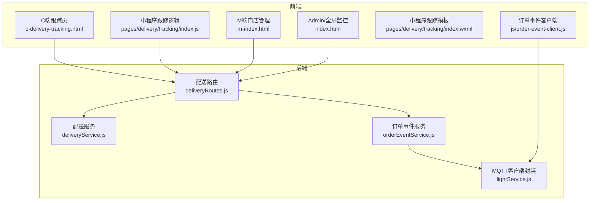
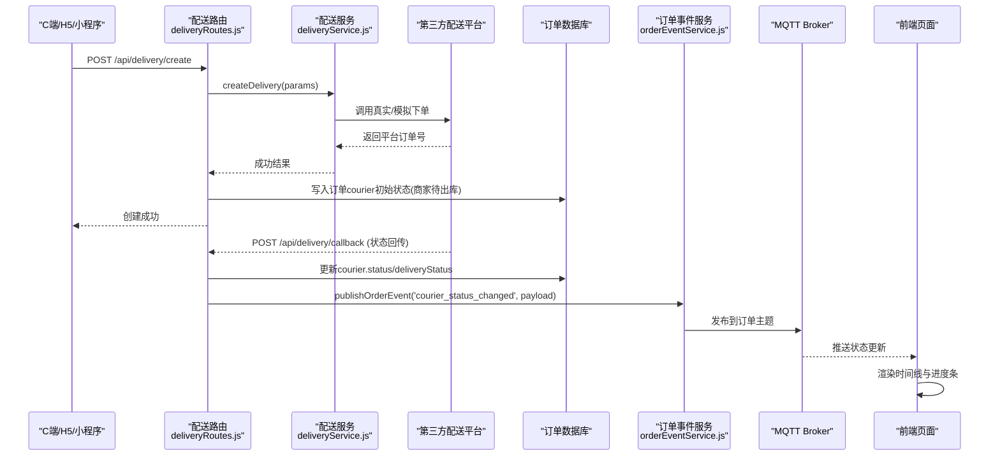
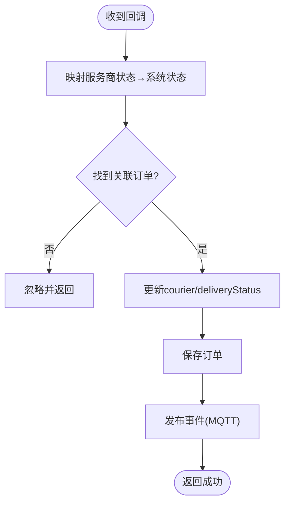
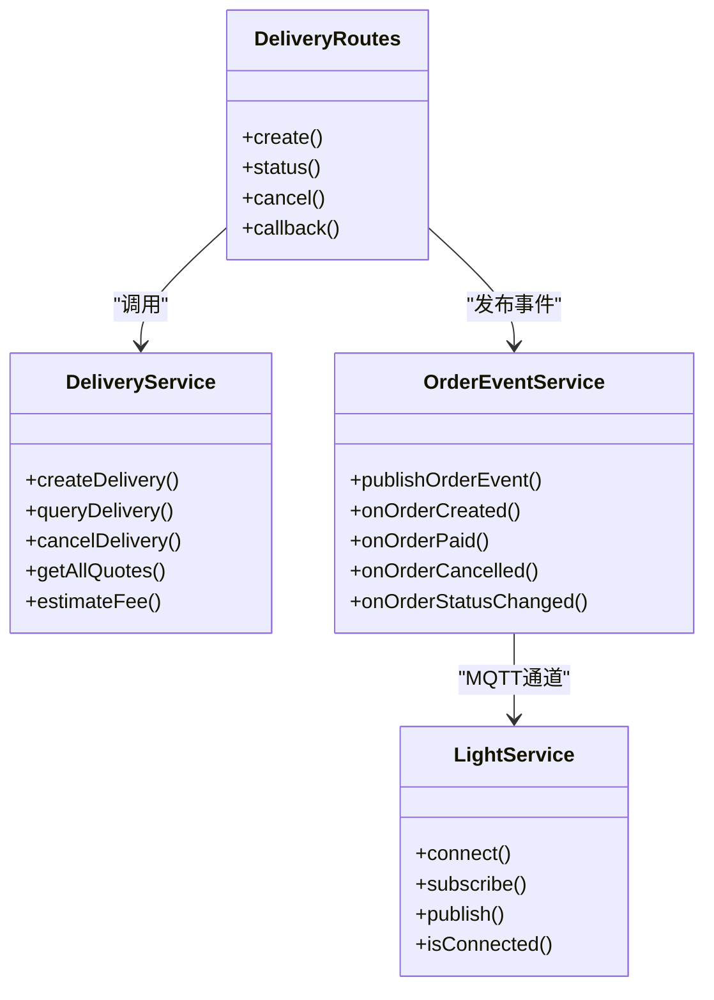
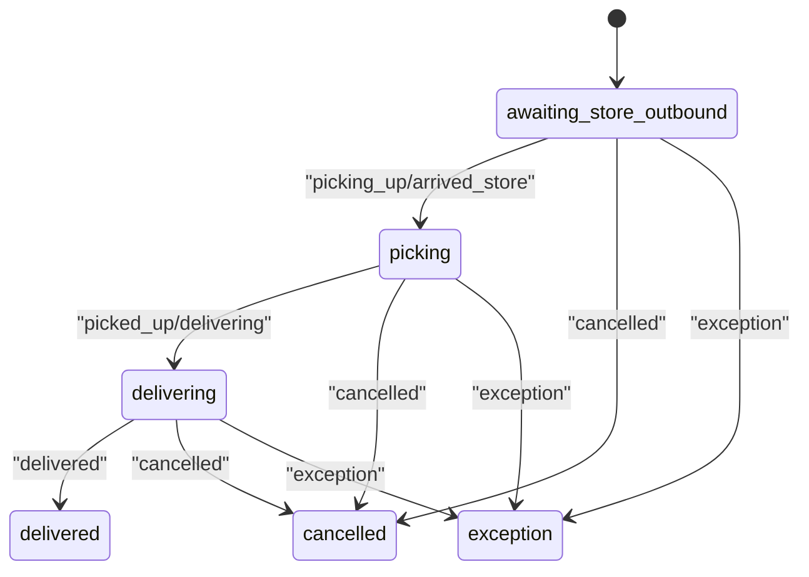

# 配送状态跟踪

<cite>
**本文引用的文件列表**
- [deliveryRoutes.js](file://backend/modules/common/routes/deliveryRoutes.js)
- [deliveryService.js](file://backend/modules/common/services/deliveryService.js)
- [orderEventService.js](file://backend/services/orderEventService.js)
- [lightService.js](file://backend/services/lightService.js)
- [order-event-client.js](file://js/order-event-client.js)
- [c-delivery-tracking.html](file://c-delivery-tracking.html)
- [index.js（小程序配送跟踪）](file://wechat-mini-app/pages/delivery/tracking/index.js)
- [index.wxml（小程序配送跟踪）](file://wechat-mini-app/pages/delivery/tracking/index.wxml)
- [index.html（C端订单详情与跑腿MQTT）](file://index.html)
- [m-index.html（M端门店管理）](file://m-index.html)
</cite>

## 目录
1. [简介](#简介)
2. [项目结构](#项目结构)
3. [核心组件](#核心组件)
4. [架构总览](#架构总览)
5. [详细组件分析](#详细组件分析)
6. [依赖关系分析](#依赖关系分析)
7. [性能考虑](#性能考虑)
8. [故障排查指南](#故障排查指南)
9. [结论](#结论)
10. [附录：状态机与转换规则](#附录状态机与转换规则)

## 简介
本文件围绕“干洗系统”的配送状态跟踪能力，系统化梳理从下单、取件、运输中、到达目的地到完成签收的全生命周期；说明基于 MQTT 的实时推送机制；解释状态查询接口的两种模式（轮询与事件驱动）；给出状态转换图与合法流转路径；并覆盖异常检测与处理方案（长时间无更新、状态不一致等），以及前端展示与实时更新效果。

## 项目结构
与配送状态跟踪相关的后端服务、路由、事件发布/订阅、以及前后端页面如下：
- 后端路由与服务：负责创建配送订单、查询状态、接收服务商回调、触发事件广播
- 事件服务：通过 MQTT 将订单状态变更推送到各端
- 前端页面：C端/H5 和微信小程序均提供配送跟踪视图，支持实时或轮询刷新

图表来源
- [deliveryRoutes.js:1-323](file://backend/modules/common/routes/deliveryRoutes.js#L1-L323)
- [deliveryService.js:1-322](file://backend/modules/common/services/deliveryService.js#L1-L322)
- [orderEventService.js:1-168](file://backend/services/orderEventService.js#L1-L168)
- [lightService.js:1-234](file://backend/services/lightService.js#L1-L234)
- [c-delivery-tracking.html:1-800](file://c-delivery-tracking.html#L1-L800)
- [index.js（小程序配送跟踪）:1-217](file://wechat-mini-app/pages/delivery/tracking/index.js#L1-L217)
- [index.wxml（小程序配送跟踪）:1-119](file://wechat-mini-app/pages/delivery/tracking/index.wxml#L1-L119)
- [index.html（C端订单详情与跑腿MQTT）:5231-5439](file://index.html#L5231-L5439)
- [m-index.html（M端门店管理）:8926-8954](file://m-index.html#L8926-L8954)

章节来源
- [deliveryRoutes.js:1-323](file://backend/modules/common/routes/deliveryRoutes.js#L1-L323)
- [deliveryService.js:1-322](file://backend/modules/common/services/deliveryService.js#L1-L322)
- [orderEventService.js:1-168](file://backend/services/orderEventService.js#L1-L168)
- [lightService.js:1-234](file://backend/services/lightService.js#L1-L234)
- [c-delivery-tracking.html:1-800](file://c-delivery-tracking.html#L1-L800)
- [index.js（小程序配送跟踪）:1-217](file://wechat-mini-app/pages/delivery/tracking/index.js#L1-L217)
- [index.wxml（小程序配送跟踪）:1-119](file://wechat-mini-app/pages/delivery/tracking/index.wxml#L1-L119)
- [index.html（C端订单详情与跑腿MQTT）:5231-5439](file://index.html#L5231-L5439)
- [m-index.html（M端门店管理）:8926-8954](file://m-index.html#L8926-L8954)

## 核心组件
- 配送路由层：对外暴露创建配送订单、查询状态、取消配送、服务商回调、启动跟踪模拟等接口；在回调中将服务商状态映射为系统 courier 状态，并持久化到订单；同时通过事件服务广播状态变更。
- 配送服务层：聚合多家配送平台（美团、京东秒送、顺丰同城、淘宝闪送），统一创建/查询/取消配送，并提供报价计算与距离估算等纯业务逻辑。
- 订单事件服务：将订单状态变更以 MQTT 主题形式发布，供 M 端、Admin 端及 C 端订阅消费。
- MQTT 客户端封装：维护连接、重连、心跳、订阅/发布；为事件服务提供可靠的消息通道。
- 前端跟踪页面：C端/H5 与微信小程序分别实现配送进度可视化、时间线渲染、联系骑手、确认收货等交互；支持事件驱动与轮询双模式。

章节来源
- [deliveryRoutes.js:1-323](file://backend/modules/common/routes/deliveryRoutes.js#L1-L323)
- [deliveryService.js:1-322](file://backend/modules/common/services/deliveryService.js#L1-L322)
- [orderEventService.js:1-168](file://backend/services/orderEventService.js#L1-L168)
- [lightService.js:1-234](file://backend/services/lightService.js#L1-L234)
- [c-delivery-tracking.html:1-800](file://c-delivery-tracking.html#L1-L800)
- [index.js（小程序配送跟踪）:1-217](file://wechat-mini-app/pages/delivery/tracking/index.js#L1-L217)
- [index.wxml（小程序配送跟踪）:1-119](file://wechat-mini-app/pages/delivery/tracking/index.wxml#L1-L119)

## 架构总览
下图展示了从下单到签收的关键数据流与控制流，包括服务商回调驱动的状态同步与 MQTT 实时推送。

图表来源
- [deliveryRoutes.js:86-133](file://backend/modules/common/routes/deliveryRoutes.js#L86-L133)
- [deliveryRoutes.js:172-280](file://backend/modules/common/routes/deliveryRoutes.js#L172-L280)
- [deliveryService.js:45-70](file://backend/modules/common/services/deliveryService.js#L45-L70)
- [orderEventService.js:77-144](file://backend/services/orderEventService.js#L77-L144)
- [lightService.js:197-205](file://backend/services/lightService.js#L197-L205)
- [c-delivery-tracking.html:600-700](file://c-delivery-tracking.html#L600-L700)
- [index.js（小程序配送跟踪）:38-71](file://wechat-mini-app/pages/delivery/tracking/index.js#L38-L71)

## 详细组件分析

### 配送路由与状态回调（核心）
- 创建配送订单：校验参数后调用配送服务下单，成功后启动跟踪模拟（用于测试/演示），并将订单 courier 初始状态设为“商家待出库”。
- 服务商回调：将平台状态映射为系统 courier 状态与进度，更新订单持久化数据，并通过事件服务广播，供前端实时刷新。
- 查询配送状态：根据 deliveryId/provider 查询对应平台状态，标准化响应格式。
- 取消配送：转发至对应平台取消。

图表来源
- [deliveryRoutes.js:172-280](file://backend/modules/common/routes/deliveryRoutes.js#L172-L280)

章节来源
- [deliveryRoutes.js:86-133](file://backend/modules/common/routes/deliveryRoutes.js#L86-L133)
- [deliveryRoutes.js:135-170](file://backend/modules/common/routes/deliveryRoutes.js#L135-L170)
- [deliveryRoutes.js:172-280](file://backend/modules/common/routes/deliveryRoutes.js#L172-L280)

### 配送服务（多平台聚合与定价）
- 统一抽象：对多家配送平台进行统一封装，按 provider 键名分发到具体实现。
- 报价与费用：支持一对一与拼单两种计费模式，结合促销策略计算最终费用。
- 距离估算：使用 Haversine 公式计算两点间距离。

章节来源
- [deliveryService.js:1-322](file://backend/modules/common/services/deliveryService.js#L1-L322)

### 订单事件服务与 MQTT 通道
- 事件发布：在订单状态变更时，构造标准 payload，发布到门店级与全局主题，便于不同角色订阅。
- MQTT 连接：封装连接、订阅、发布、重连与健康检查，确保消息通道稳定。

章节来源
- [orderEventService.js:1-168](file://backend/services/orderEventService.js#L1-L168)
- [lightService.js:1-234](file://backend/services/lightService.js#L1-L234)

### 前端跟踪页面（C端/H5）
- 初始化流程：优先从 localStorage 快速渲染，再拉取权威 API 数据，最后开启实时轮询或事件订阅。
- 阶段映射：将 courier 状态映射为 UI 阶段（待出库/取件中/配送中/已送达），并动态更新时间线与标题。
- 交互能力：联系骑手、确认收货、刷新状态。

章节来源
- [c-delivery-tracking.html:600-700](file://c-delivery-tracking.html#L600-L700)
- [c-delivery-tracking.html:750-800](file://c-delivery-tracking.html#L750-L800)
- [index.html（C端订单详情与跑腿MQTT）:5231-5439](file://index.html#L5231-L5439)

### 小程序配送跟踪
- 加载与构建：请求订单详情，若失败则回退到模拟数据；根据订单状态构建配送信息、司机信息与时间线。
- 交互：联系配送员、联系门店。

章节来源
- [index.js（小程序配送跟踪）:1-217](file://wechat-mini-app/pages/delivery/tracking/index.js#L1-L217)
- [index.wxml（小程序配送跟踪）:1-119](file://wechat-mini-app/pages/delivery/tracking/index.wxml#L1-L119)

### M端门店管理与状态联动
- 根据配送状态同步物品状态，并在配送完成时更新订单主状态，保证前后端一致。

章节来源
- [m-index.html（M端门店管理）:8926-8954](file://m-index.html#L8926-L8954)

## 依赖关系分析
- 路由层依赖配送服务与事件服务；事件服务依赖 MQTT 客户端封装。
- 前端页面依赖路由 API 与 MQTT 客户端（可选），在 MQTT 不可用时自动降级为轮询。

图表来源
- [deliveryRoutes.js:1-323](file://backend/modules/common/routes/deliveryRoutes.js#L1-L323)
- [deliveryService.js:1-322](file://backend/modules/common/services/deliveryService.js#L1-L322)
- [orderEventService.js:1-168](file://backend/services/orderEventService.js#L1-L168)
- [lightService.js:1-234](file://backend/services/lightService.js#L1-L234)

章节来源
- [deliveryRoutes.js:1-323](file://backend/modules/common/routes/deliveryRoutes.js#L1-L323)
- [deliveryService.js:1-322](file://backend/modules/common/services/deliveryService.js#L1-L322)
- [orderEventService.js:1-168](file://backend/services/orderEventService.js#L1-L168)
- [lightService.js:1-234](file://backend/services/lightService.js#L1-L234)

## 性能考虑
- 事件驱动优先：在 MQTT 可用时采用事件推送，减少轮询开销。
- 轮询降级：当 MQTT 不可用或达到最大重连次数时，自动切换为 REST 轮询，保障基本可用性。
- 轻量查询：C端/H5 提供专用状态接口以减少不必要的数据传输。
- 前端缓存：首屏优先本地缓存快速渲染，随后异步拉取权威数据并增量更新。

[本节为通用指导，不直接分析具体文件]

## 故障排查指南
- MQTT 连接问题：检查 broker 地址、端口、鉴权配置；观察连接日志与重连计数；必要时切换到轮询模式。
- 回调未生效：核对服务商回调 URL、签名与参数；确认回调状态映射是否包含该状态；查看订单是否存在且 courier.deliveryId 匹配。
- 状态不一致：对比数据库中的 courier.status 与 deliveryStatus；检查事件是否成功发布与订阅；确认前端是否正确解析并应用状态。
- 长时间无更新：设置超时告警与兜底轮询；记录最近一次更新时间戳，超过阈值触发人工介入或重试。

章节来源
- [order-event-client.js:1-270](file://js/order-event-client.js#L1-L270)
- [lightService.js:1-234](file://backend/services/lightService.js#L1-L234)
- [deliveryRoutes.js:172-280](file://backend/modules/common/routes/deliveryRoutes.js#L172-L280)

## 结论
本系统通过统一的配送路由与多平台聚合服务，结合订单事件服务与 MQTT 实时通道，实现了从下单到签收的端到端状态跟踪。前端在事件驱动与轮询双模式下均可获得稳定的配送进度展示。通过明确的状态映射与异常处理策略，系统在复杂场景下仍能保证数据一致性与用户体验。

[本节为总结性内容，不直接分析具体文件]

## 附录：状态机与转换规则

### 状态定义
- awaiting_store_outbound：商家待出库（服务商尚未派单/骑手未出发）
- picking：取件中（骑手待取件/已到店）
- delivering：配送中（骑手已取件/在途）
- delivered：已送达（用户已收货）
- cancelled：已取消
- exception：异常

### 合法流转路径
- awaiting_store_outbound → picking → delivering → delivered
- 任意中间态 → cancelled（由服务商或系统主动取消）
- 任意中间态 → exception（出现异常）

图表来源
- [deliveryRoutes.js:186-198](file://backend/modules/common/routes/deliveryRoutes.js#L186-L198)

### 状态映射表（服务商→系统）
- order_created/accepted → awaiting_store_outbound
- picking_up/arrived_store → picking
- picked_up/delivering → delivering
- arrived → delivering（即将送达）
- delivered → delivered
- cancelled → cancelled
- exception → exception

章节来源
- [deliveryRoutes.js:186-198](file://backend/modules/common/routes/deliveryRoutes.js#L186-L198)

### 前端渲染与时间线
- C端/H5：根据 courier.status 映射阶段，动态更新标题、副标题、图标与时间线节点；支持手动刷新与确认收货。
- 小程序：根据订单状态构建配送信息、司机信息与时间线，提供联系配送员与联系门店操作。

章节来源
- [c-delivery-tracking.html:600-700](file://c-delivery-tracking.html#L600-L700)
- [c-delivery-tracking.html:750-800](file://c-delivery-tracking.html#L750-L800)
- [index.js（小程序配送跟踪）:74-135](file://wechat-mini-app/pages/delivery/tracking/index.js#L74-L135)
- [index.wxml（小程序配送跟踪）:1-119](file://wechat-mini-app/pages/delivery/tracking/index.wxml#L1-L119)

### 状态查询接口（轮询与事件驱动）
- 轮询模式：前端定时调用专用状态接口获取最新 courier 状态，适用于 MQTT 不可用或作为兜底。
- 事件驱动：通过 MQTT 订阅订单主题，服务端在状态变更时即时推送，前端无需频繁请求。

章节来源
- [order-event-client.js:219-248](file://js/order-event-client.js#L219-L248)
- [c-delivery-tracking.html:912-936](file://c-delivery-tracking.html#L912-L936)
- [deliveryRoutes.js:135-152](file://backend/modules/common/routes/deliveryRoutes.js#L135-L152)