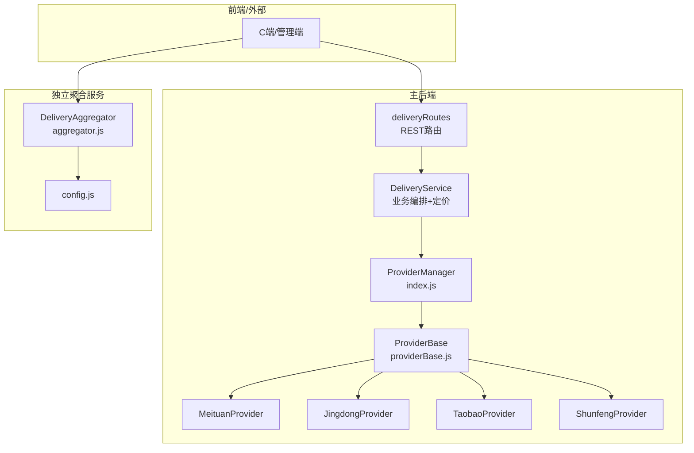
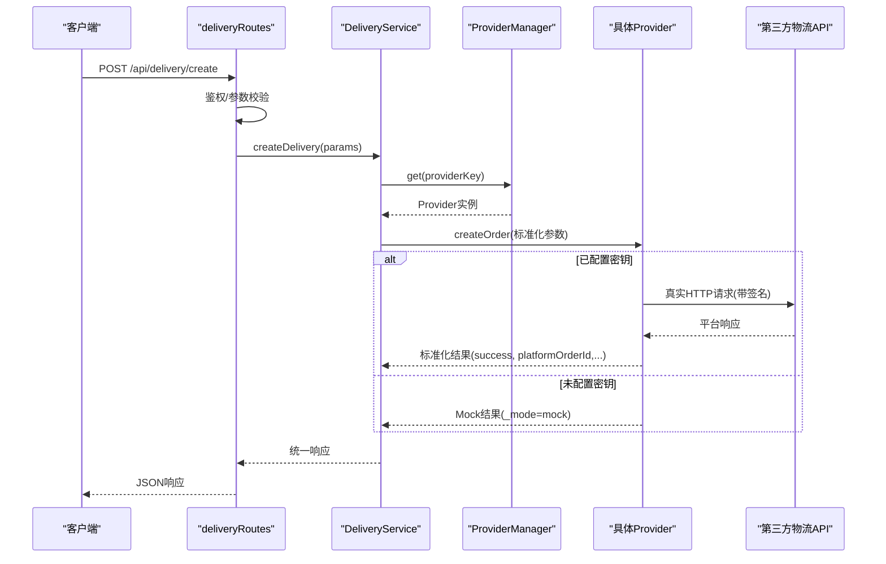
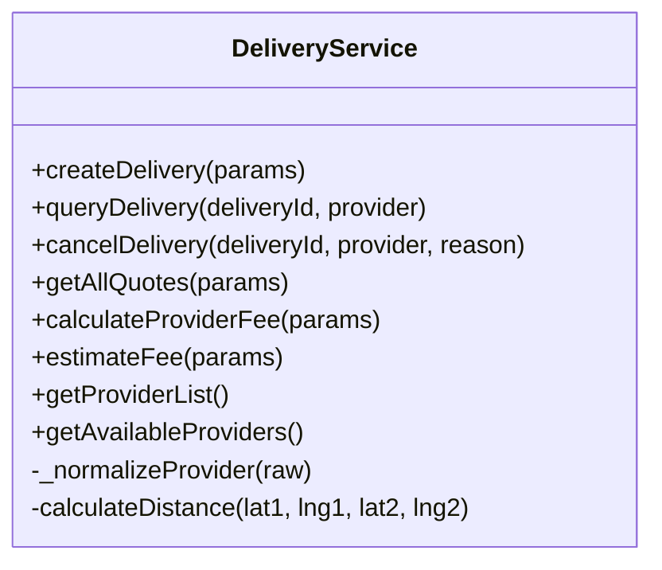
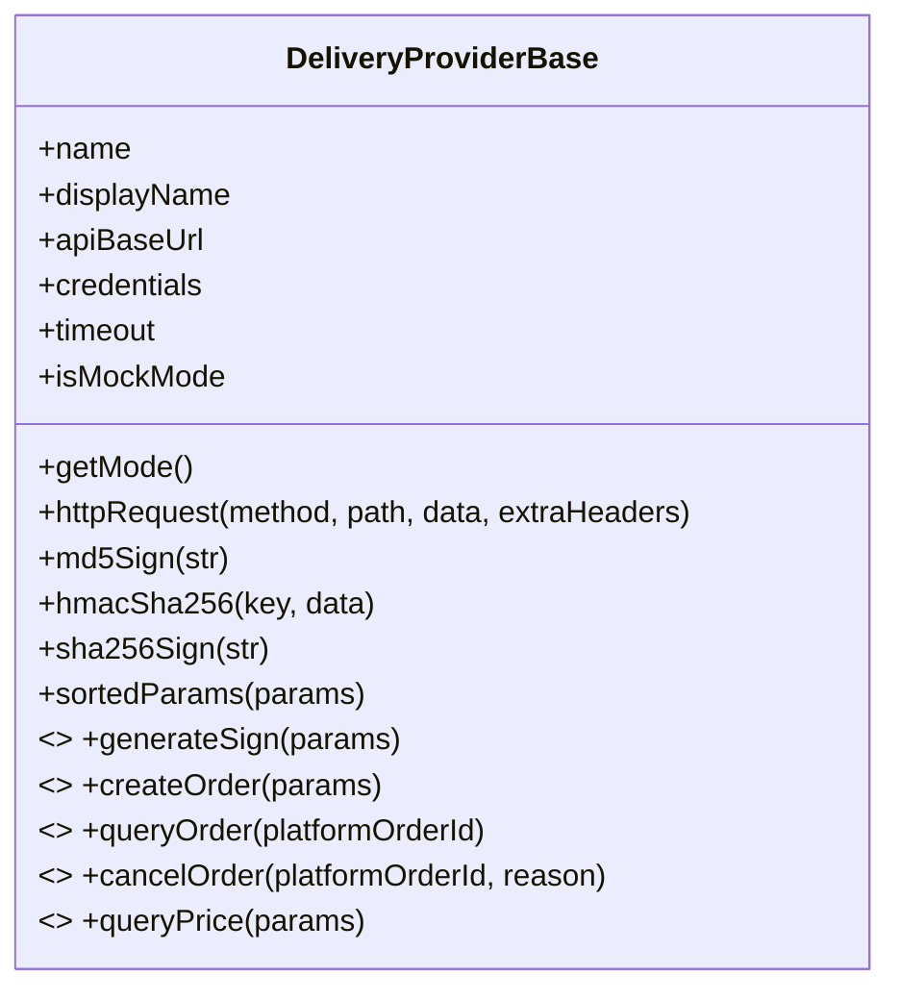
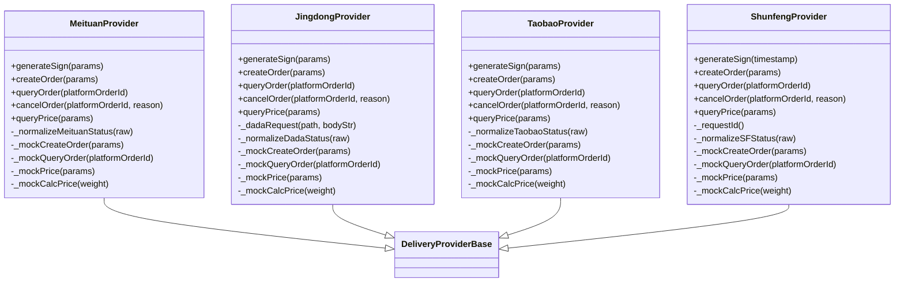
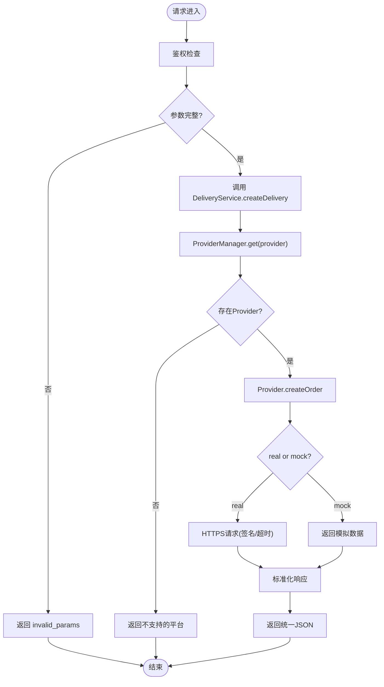
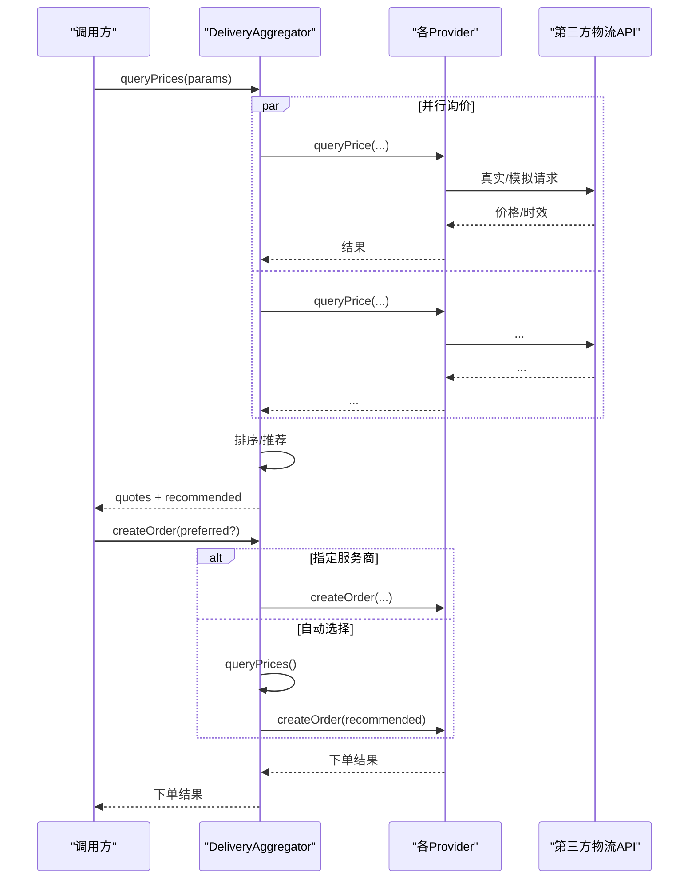
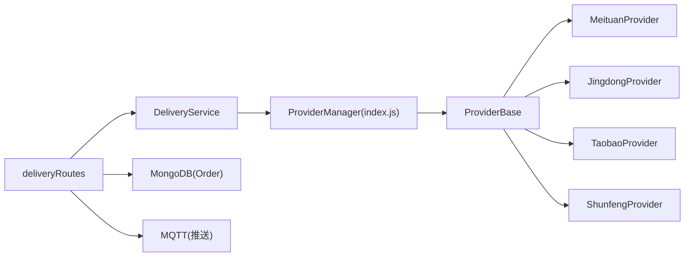

# 配送聚合架构设计

<cite>
**本文引用的文件列表**
- [backend/services/deliveryProviders/providerBase.js](file://backend/services/deliveryProviders/providerBase.js)
- [backend/services/deliveryProviders/meituan.js](file://backend/services/deliveryProviders/meituan.js)
- [backend/services/deliveryProviders/jingdong.js](file://backend/services/deliveryProviders/jingdong.js)
- [backend/services/deliveryProviders/shunfeng.js](file://backend/services/deliveryProviders/shunfeng.js)
- [backend/services/deliveryProviders/taobao.js](file://backend/services/deliveryProviders/taobao.js)
- [backend/services/deliveryProviders/index.js](file://backend/services/deliveryProviders/index.js)
- [backend/modules/common/services/deliveryService.js](file://backend/modules/common/services/deliveryService.js)
- [backend/modules/common/routes/deliveryRoutes.js](file://backend/modules/common/routes/deliveryRoutes.js)
- [delivery-api/aggregator.js](file://delivery-api/aggregator.js)
- [delivery-api/config.js](file://delivery-api/config.js)
- [api/delivery-api.js](file://api/delivery-api.js)
</cite>

## 目录
1. [简介](#简介)
2. [项目结构](#项目结构)
3. [核心组件](#核心组件)
4. [架构总览](#架构总览)
5. [详细组件分析](#详细组件分析)
6. [依赖关系分析](#依赖关系分析)
7. [性能与扩展性](#性能与扩展性)
8. [错误处理与异常恢复](#错误处理与异常恢复)
9. [故障排查指南](#故障排查指南)
10. [结论](#结论)

## 简介
本文件围绕“配送聚合架构”展开，系统性阐述后端配送服务层的设计与实现。重点包括：
- DeliveryService 核心类的设计模式与职责划分
- ProviderBase 抽象基类的统一接口与差异化屏蔽机制
- 配送订单的标准化处理链路（请求接收、参数校验、响应格式化）
- 新平台接入的扩展机制
- 架构图与数据流图，展示组件交互
- 错误处理策略与异常恢复思路

## 项目结构
本项目在两个层面提供配送能力：
- 主后端模块 backend：通过 deliveryService 调用 deliveryProviders 下的具体服务商实现，对外暴露 REST 路由 deliveryRoutes。
- 独立聚合服务 delivery-api：提供独立的聚合调度器 DeliveryAggregator，用于多服务商询价、下单等场景。

图表来源
- [backend/modules/common/routes/deliveryRoutes.js:1-323](file://backend/modules/common/routes/deliveryRoutes.js#L1-L323)
- [backend/modules/common/services/deliveryService.js:1-322](file://backend/modules/common/services/deliveryService.js#L1-L322)
- [backend/services/deliveryProviders/index.js:1-87](file://backend/services/deliveryProviders/index.js#L1-L87)
- [backend/services/deliveryProviders/providerBase.js:1-124](file://backend/services/deliveryProviders/providerBase.js#L1-L124)
- [backend/services/deliveryProviders/meituan.js:1-257](file://backend/services/deliveryProviders/meituan.js#L1-L257)
- [backend/services/deliveryProviders/jingdong.js:1-278](file://backend/services/deliveryProviders/jingdong.js#L1-L278)
- [backend/services/deliveryProviders/shunfeng.js:1-262](file://backend/services/deliveryProviders/shunfeng.js#L1-L262)
- [backend/services/deliveryProviders/taobao.js:1-263](file://backend/services/deliveryProviders/taobao.js#L1-L263)
- [delivery-api/aggregator.js:1-237](file://delivery-api/aggregator.js#L1-L237)
- [delivery-api/config.js:1-93](file://delivery-api/config.js#L1-L93)

章节来源
- [backend/modules/common/routes/deliveryRoutes.js:1-323](file://backend/modules/common/routes/deliveryRoutes.js#L1-L323)
- [backend/modules/common/services/deliveryService.js:1-322](file://backend/modules/common/services/deliveryService.js#L1-L322)
- [backend/services/deliveryProviders/index.js:1-87](file://backend/services/deliveryProviders/index.js#L1-L87)
- [backend/services/deliveryProviders/providerBase.js:1-124](file://backend/services/deliveryProviders/providerBase.js#L1-L124)
- [delivery-api/aggregator.js:1-237](file://delivery-api/aggregator.js#L1-L237)
- [delivery-api/config.js:1-93](file://delivery-api/config.js#L1-L93)

## 核心组件
- DeliveryService：面向业务的编排层，负责参数归一化、定价计算、报价排序、调用底层 Providers，并统一返回格式。
- ProviderBase：抽象基类，封装通用 HTTP 请求、签名算法、超时控制、Mock 模式判断，定义抽象接口 createOrder/queryOrder/cancelOrder/queryPrice。
- 具体 Provider：美团、京东秒送（达达）、淘宝闪送（蜂鸟）、顺丰同城，各自实现签名与平台API对接，并将平台状态映射为内部标准状态。
- ProviderManager（index.js）：集中注册与获取各 Provider 实例，提供 get/getAll/getStatus 等管理能力。
- deliveryRoutes：对外暴露 REST 接口，完成鉴权、参数校验、调用 DeliveryService、回调处理与跟踪模拟启动。
- DeliveryAggregator（独立服务）：聚合调度器，支持并行询价、推荐策略、自动选择最优服务商下单。

章节来源
- [backend/modules/common/services/deliveryService.js:1-322](file://backend/modules/common/services/deliveryService.js#L1-L322)
- [backend/services/deliveryProviders/providerBase.js:1-124](file://backend/services/deliveryProviders/providerBase.js#L1-L124)
- [backend/services/deliveryProviders/index.js:1-87](file://backend/services/deliveryProviders/index.js#L1-L87)
- [backend/modules/common/routes/deliveryRoutes.js:1-323](file://backend/modules/common/routes/deliveryRoutes.js#L1-L323)
- [delivery-api/aggregator.js:1-237](file://delivery-api/aggregator.js#L1-L237)

## 架构总览
整体采用“服务编排 + 提供商抽象 + 统一响应”的分层架构。上层路由仅关注鉴权与入参校验；中间层 DeliveryService 专注业务逻辑与结果标准化；下层 Provider 层屏蔽不同平台的差异，并通过 Mock 模式保障开发测试可用性。

图表来源
- [backend/modules/common/routes/deliveryRoutes.js:86-133](file://backend/modules/common/routes/deliveryRoutes.js#L86-L133)
- [backend/modules/common/services/deliveryService.js:44-70](file://backend/modules/common/services/deliveryService.js#L44-L70)
- [backend/services/deliveryProviders/index.js:57-62](file://backend/services/deliveryProviders/index.js#L57-L62)
- [backend/services/deliveryProviders/providerBase.js:35-74](file://backend/services/deliveryProviders/providerBase.js#L35-L74)
- [backend/services/deliveryProviders/meituan.js:41-93](file://backend/services/deliveryProviders/meituan.js#L41-L93)
- [backend/services/deliveryProviders/jingdong.js:50-98](file://backend/services/deliveryProviders/jingdong.js#L50-L98)
- [backend/services/deliveryProviders/shunfeng.js:45-95](file://backend/services/deliveryProviders/shunfeng.js#L45-L95)
- [backend/services/deliveryProviders/taobao.js:48-99](file://backend/services/deliveryProviders/taobao.js#L48-L99)

## 详细组件分析

### DeliveryService 设计与职责
- 职责边界
  - 参数归一化：将旧键名映射为新 provider 键名（如 dada/jd → jingdong）。
  - 业务编排：创建/查询/取消配送，调用 ProviderManager 获取对应 Provider 实例。
  - 定价与报价：内置四家服务商的定价规则，支持一对一与拼单两种计费模式，并提供一键报价接口。
  - 距离估算：使用 Haversine 公式计算经纬度距离。
- 关键方法
  - createDelivery：根据 provider 调用对应 Provider.createOrder，并记录日志。
  - queryDelivery：调用 Provider.queryOrder，并对返回进行标准化，兼容旧接口。
  - cancelDelivery：调用 Provider.cancelOrder。
  - getAllQuotes/estimateFee：纯本地定价计算，不依赖外部API。
  - getAvailableProviders：结合 ProviderManager 的状态信息，返回可用平台及运行模式。

图表来源
- [backend/modules/common/services/deliveryService.js:32-318](file://backend/modules/common/services/deliveryService.js#L32-L318)

章节来源
- [backend/modules/common/services/deliveryService.js:1-322](file://backend/modules/common/services/deliveryService.js#L1-L322)

### ProviderBase 抽象基类
- 统一能力
  - HTTPS 请求封装：统一设置 Content-Type、超时、错误与超时处理。
  - 签名工具：MD5、HMAC-SHA256、SHA256、按 key 排序拼接。
  - 运行模式：根据是否配置有效凭证自动切换 real/mock。
- 抽象接口
  - generateSign：子类实现签名算法。
  - createOrder/queryOrder/cancelOrder/queryPrice：子类实现平台API对接。
- 设计要点
  - 通过 isMockMode 控制行为，未配置密钥时直接走 Mock 路径，保证可测试性与稳定性。
  - 所有 Provider 均继承此基类，确保统一的网络与签名能力。

图表来源
- [backend/services/deliveryProviders/providerBase.js:10-121](file://backend/services/deliveryProviders/providerBase.js#L10-L121)

章节来源
- [backend/services/deliveryProviders/providerBase.js:1-124](file://backend/services/deliveryProviders/providerBase.js#L1-L124)

### 具体 Provider 实现（美团/京东/淘宝/顺丰）
- 共同点
  - 继承 ProviderBase，实现 generateSign 与各平台签名规则。
  - 实现 createOrder/queryOrder/cancelOrder/queryPrice，并在失败或无密钥时回退到 Mock。
  - 将平台状态码映射为内部标准状态（pending/accepted/picking_up/delivering/delivered/cancelled/exception）。
- 差异化
  - 美团：基于 appId/appSecret 的 MD5 签名，POST 至 peisongopen.meituan.com。
  - 京东秒送（达达）：对参数排序后拼接 secret 取 MD5 大写，POST 至 newopen.imdada.cn。
  - 淘宝闪送（蜂鸟）：参数排序 + secret 的 MD5，POST 至 open-anmp.ele.me。
  - 顺丰同城：timestamp + checkWord 的 MD5，POST 至 open-sandbox.sfsy.com。

图表来源
- [backend/services/deliveryProviders/meituan.js:15-257](file://backend/services/deliveryProviders/meituan.js#L15-L257)
- [backend/services/deliveryProviders/jingdong.js:17-278](file://backend/services/deliveryProviders/jingdong.js#L17-L278)
- [backend/services/deliveryProviders/taobao.js:22-263](file://backend/services/deliveryProviders/taobao.js#L22-L263)
- [backend/services/deliveryProviders/shunfeng.js:15-262](file://backend/services/deliveryProviders/shunfeng.js#L15-L262)
- [backend/services/deliveryProviders/providerBase.js:10-121](file://backend/services/deliveryProviders/providerBase.js#L10-L121)

章节来源
- [backend/services/deliveryProviders/meituan.js:1-257](file://backend/services/deliveryProviders/meituan.js#L1-L257)
- [backend/services/deliveryProviders/jingdong.js:1-278](file://backend/services/deliveryProviders/jingdong.js#L1-L278)
- [backend/services/deliveryProviders/taobao.js:1-263](file://backend/services/deliveryProviders/taobao.js#L1-L263)
- [backend/services/deliveryProviders/shunfeng.js:1-262](file://backend/services/deliveryProviders/shunfeng.js#L1-L262)

### 路由与标准化处理链路
- 路由职责
  - 鉴权：authMiddleware 保护敏感接口。
  - 参数校验：缺失必要字段返回 invalid_params。
  - 调用 DeliveryService：统一入口 createDelivery/queryDelivery/cancelDelivery。
  - 回调处理：接收平台状态推送，更新订单 courier 字段与 deliveryStatus，并通过 MQTT 推送给C端。
- 标准化流程
  - 输入：orderId、provider、pickup、delivery、可选 goodsDesc/weight/callbackUrl。
  - 处理：ProviderManager 解析 provider → 调用 Provider.createOrder → 返回统一 success/data/error 结构。
  - 输出：success、platformOrderId、status、price、estimateTime、_mode 等。

图表来源
- [backend/modules/common/routes/deliveryRoutes.js:86-133](file://backend/modules/common/routes/deliveryRoutes.js#L86-L133)
- [backend/modules/common/services/deliveryService.js:44-70](file://backend/modules/common/services/deliveryService.js#L44-L70)
- [backend/services/deliveryProviders/index.js:57-62](file://backend/services/deliveryProviders/index.js#L57-L62)
- [backend/services/deliveryProviders/providerBase.js:35-74](file://backend/services/deliveryProviders/providerBase.js#L35-L74)

章节来源
- [backend/modules/common/routes/deliveryRoutes.js:1-323](file://backend/modules/common/routes/deliveryRoutes.js#L1-L323)
- [backend/modules/common/services/deliveryService.js:1-322](file://backend/modules/common/services/deliveryService.js#L1-L322)

### 独立聚合服务（DeliveryAggregator）
- 功能
  - 初始化各 Provider（受 config.enabled 控制）。
  - 并行询价：Promise.allSettled 收集成功与错误结果，并按价格排序。
  - 推荐策略：最低价/最快/综合评分。
  - 自动下单：若无指定 preferredProvider，则先询价再选择推荐服务商下单。
- 适用场景
  - 作为独立微服务部署，供其他系统聚合调用。

图表来源
- [delivery-api/aggregator.js:54-197](file://delivery-api/aggregator.js#L54-L197)
- [delivery-api/config.js:10-93](file://delivery-api/config.js#L10-L93)

章节来源
- [delivery-api/aggregator.js:1-237](file://delivery-api/aggregator.js#L1-L237)
- [delivery-api/config.js:1-93](file://delivery-api/config.js#L1-L93)

## 依赖关系分析
- 耦合与内聚
  - DeliveryService 与 ProviderManager 低耦合，通过键名映射与工厂式获取实例，便于扩展。
  - ProviderBase 高内聚，封装通用网络与签名能力，具体 Provider 仅关注平台差异。
- 外部依赖
  - Node.js https/crypto 原生模块。
  - Express 路由与鉴权中间件。
  - MongoDB（回调中读取 Order 模型）。
  - MQTT（回调中发布状态事件）。
- 潜在循环依赖
  - 当前未见循环引用；ProviderManager 仅持有 Provider 实例，Provider 不反向引用 Manager。

图表来源
- [backend/modules/common/routes/deliveryRoutes.js:1-323](file://backend/modules/common/routes/deliveryRoutes.js#L1-L323)
- [backend/modules/common/services/deliveryService.js:1-322](file://backend/modules/common/services/deliveryService.js#L1-L322)
- [backend/services/deliveryProviders/index.js:1-87](file://backend/services/deliveryProviders/index.js#L1-L87)
- [backend/services/deliveryProviders/providerBase.js:1-124](file://backend/services/deliveryProviders/providerBase.js#L1-L124)

章节来源
- [backend/modules/common/routes/deliveryRoutes.js:1-323](file://backend/modules/common/routes/deliveryRoutes.js#L1-L323)
- [backend/modules/common/services/deliveryService.js:1-322](file://backend/modules/common/services/deliveryService.js#L1-L322)
- [backend/services/deliveryProviders/index.js:1-87](file://backend/services/deliveryProviders/index.js#L1-L87)
- [backend/services/deliveryProviders/providerBase.js:1-124](file://backend/services/deliveryProviders/providerBase.js#L1-L124)

## 性能与扩展性
- 性能特性
  - ProviderBase 统一超时控制，避免长尾请求阻塞。
  - DeliveryAggregator 并行询价，降低端到端延迟。
  - 本地定价计算（DeliveryService）无需外部IO，适合高频报价场景。
- 扩展机制
  - 新增平台步骤：
    1) 新建 Provider 文件，继承 ProviderBase，实现 generateSign 与四个抽象方法。
    2) 在 ProviderManager（index.js）中注册新实例。
    3) 在 DeliveryService 的 PROVIDER_MAP 中添加别名映射（如需兼容旧键名）。
    4) 在 deliveryRoutes 中无需改动，即可通过 provider 参数选择新平台。
  - 独立聚合服务也可在 aggregator.js 的 initProviders 中注册新平台。

[本节为通用指导，不涉及具体代码片段]

## 错误处理与异常恢复
- 网络层
  - ProviderBase.httpRequest 统一处理超时与错误，抛出可读错误消息。
- 业务层
  - Provider 在 API 调用失败时回退到 Mock，保证可用性。
  - DeliveryService 对不支持的 provider 返回明确错误信息。
- 路由层
  - 统一捕获异常，返回 success=false 的结构化错误，包含 error 与 message。
- 回调层
  - 对未知状态进行忽略并记录日志，避免中断主流程。
  - 数据库更新失败会记录错误但不影响响应。

章节来源
- [backend/services/deliveryProviders/providerBase.js:35-74](file://backend/services/deliveryProviders/providerBase.js#L35-L74)
- [backend/modules/common/routes/deliveryRoutes.js:86-133](file://backend/modules/common/routes/deliveryRoutes.js#L86-L133)
- [backend/modules/common/routes/deliveryRoutes.js:172-280](file://backend/modules/common/routes/deliveryRoutes.js#L172-L280)
- [backend/modules/common/services/deliveryService.js:44-70](file://backend/modules/common/services/deliveryService.js#L44-L70)

## 故障排查指南
- 常见问题定位
  - 无法下单：检查 provider 名称是否正确、环境变量是否配置、Provider 是否为 real 模式。
  - 状态不一致：核对 Provider 的状态映射表，确认平台状态码与内部状态的对应关系。
  - 回调未生效：确认回调 URL 公网可达、token 正确、订单 courier.deliveryId 匹配。
- 调试建议
  - 使用 /api/delivery/provider-status 查看各 Provider 的 mode 与 hasCredentials。
  - 使用 /api/delivery/tracking/active 查看跟踪任务数量与详情。
  - 开启日志观察 Provider 的 _mock* 与 API 调用分支。

章节来源
- [backend/modules/common/routes/deliveryRoutes.js:12-26](file://backend/modules/common/routes/deliveryRoutes.js#L12-L26)
- [backend/modules/common/routes/deliveryRoutes.js:314-321](file://backend/modules/common/routes/deliveryRoutes.js#L314-L321)

## 结论
该配送聚合架构通过 ProviderBase 抽象与 ProviderManager 注册机制，实现了多平台能力的统一接入与屏蔽；DeliveryService 聚焦业务编排与定价计算；路由层提供清晰的鉴权与校验；回调链路驱动实时状态同步。整体具备良好的可扩展性、容错性与可观测性，能够支撑快速接入新平台与稳定生产运行。