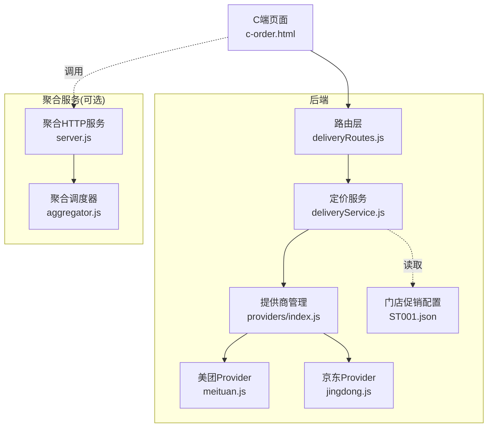
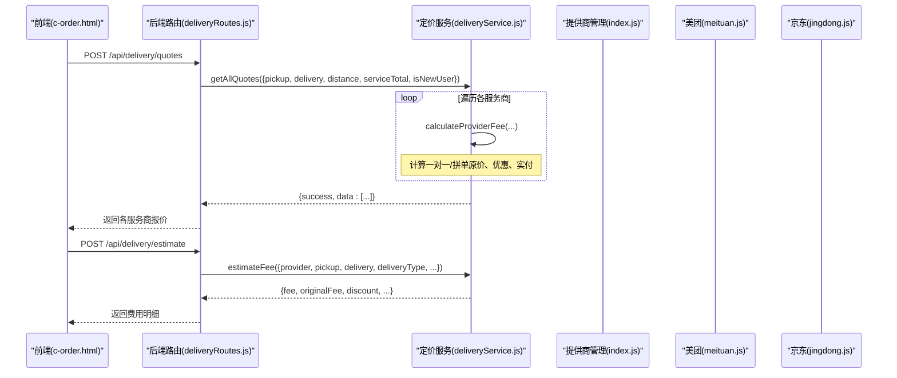
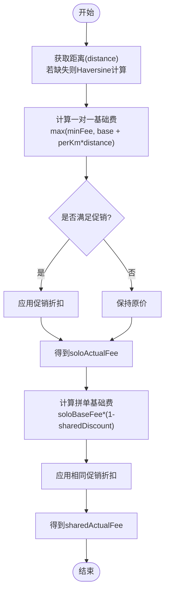
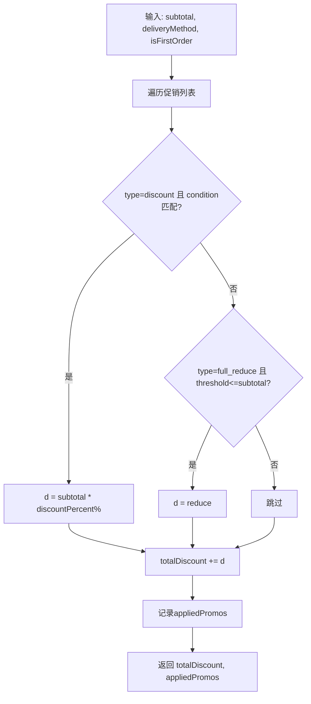
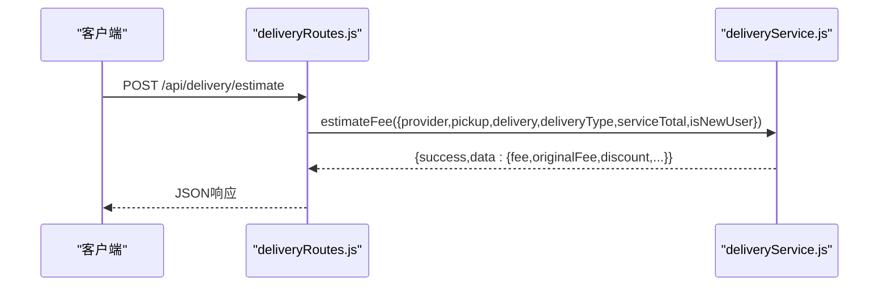
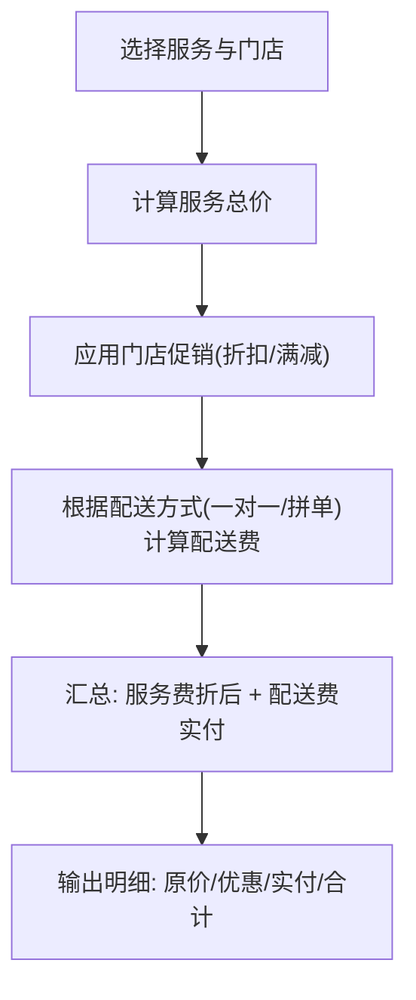
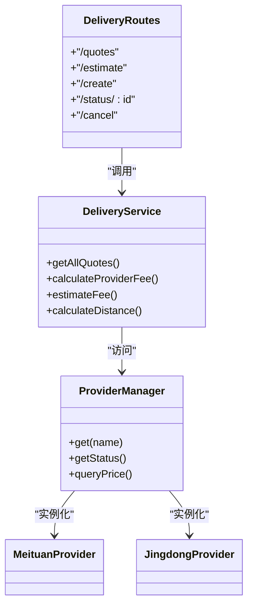

# 配送费用计算

<cite>
**本文引用的文件**   
- [deliveryService.js](file://backend/modules/common/services/deliveryService.js)
- [deliveryRoutes.js](file://backend/modules/common/routes/deliveryRoutes.js)
- [meituan.js](file://backend/services/deliveryProviders/meituan.js)
- [jingdong.js](file://backend/services/deliveryProviders/jingdong.js)
- [index.js](file://backend/services/deliveryProviders/index.js)
- [aggregator.js](file://delivery-api/aggregator.js)
- [server.js](file://delivery-api/server.js)
- [ST001.json](file://backend/data/store-configs/ST001.json)
- [routes.js](file://backend/modules/cleaning/routes.js)
- [c-order.html](file://c-order.html)
</cite>

## 目录
1. [引言](#引言)
2. [项目结构](#项目结构)
3. [核心组件](#核心组件)
4. [架构总览](#架构总览)
5. [详细组件分析](#详细组件分析)
6. [依赖关系分析](#依赖关系分析)
7. [性能与可扩展性](#性能与可扩展性)
8. [故障排查指南](#故障排查指南)
9. [结论](#结论)
10. [附录：API使用示例与费用明细](#附录api使用示例与费用明细)

## 引言
本文件围绕“配送费用计算”主题，系统性梳理系统内计费要素、算法与流程，覆盖基础运费、距离加价、时段溢价（预留）、重量附加费（预留）、一对一与拼单两种配送模式、共享折扣、促销叠加规则、费用估算API、费用明细生成逻辑以及动态调价与异常修正等高级能力。文档同时提供可视化图示与可追溯的源码定位，便于开发与业务人员理解与落地。

## 项目结构
与配送费用计算相关的核心模块分布如下：
- 后端定价与报价服务：DeliveryService（含服务商定价配置、一对一/拼单计费、距离计算）
- 配送路由层：deliveryRoutes（对外暴露报价、估算、下单、状态查询等接口）
- 第三方配送接入：各Provider实现（美团、京东秒送等），支持真实/模拟双模式
- 聚合调度器（独立服务）：DeliveryAggregator（多平台并行询价、推荐策略）
- 门店促销配置：store-configs（满减、折扣、条件匹配）
- 前端费用展示与促销联动：c-order.html（订单页费用计算与明细渲染）

图表来源
- [deliveryRoutes.js:1-120](file://backend/modules/common/routes/deliveryRoutes.js#L1-L120)
- [deliveryService.js:120-259](file://backend/modules/common/services/deliveryService.js#L120-L259)
- [index.js:1-87](file://backend/services/deliveryProviders/index.js#L1-L87)
- [meituan.js:1-120](file://backend/services/deliveryProviders/meituan.js#L1-L120)
- [jingdong.js:1-120](file://backend/services/deliveryProviders/jingdong.js#L1-L120)
- [ST001.json:104-132](file://backend/data/store-configs/ST001.json#L104-L132)
- [aggregator.js:54-95](file://delivery-api/aggregator.js#L54-L95)
- [server.js:52-83](file://delivery-api/server.js#L52-L83)
- [c-order.html:1750-1811](file://c-order.html#L1750-L1811)

章节来源
- [deliveryRoutes.js:1-120](file://backend/modules/common/routes/deliveryRoutes.js#L1-L120)
- [deliveryService.js:120-259](file://backend/modules/common/services/deliveryService.js#L120-L259)
- [index.js:1-87](file://backend/services/deliveryProviders/index.js#L1-L87)
- [meituan.js:1-120](file://backend/services/deliveryProviders/meituan.js#L1-L120)
- [jingdong.js:1-120](file://backend/services/deliveryProviders/jingdong.js#L1-L120)
- [ST001.json:104-132](file://backend/data/store-configs/ST001.json#L104-L132)
- [aggregator.js:54-95](file://delivery-api/aggregator.js#L54-L95)
- [server.js:52-83](file://delivery-api/server.js#L52-L83)
- [c-order.html:1750-1811](file://c-order.html#L1750-L1811)

## 核心组件
- 定价服务 DeliveryService
  - 维护各服务商定价参数（基础运费、每公里单价、最低运费、拼单折扣、促销策略）
  - 计算一对一与拼单两种模式的原价、优惠、实付
  - 提供一键报价与兼容旧接口的费用估算
- 配送路由 deliveryRoutes
  - 对外暴露 /quotes、/estimate、/create、/status/:id、/cancel 等接口
  - 将请求转发至 DeliveryService 或 Provider 层
- 提供商接入 providers/*
  - 统一抽象（创建订单、查询状态、取消、询价），支持真实/模拟双模式
  - 美团、京东秒送等具体实现
- 聚合调度器 aggregator
  - 并行询价多家服务商，按价格/时效/综合评分推荐
- 门店促销配置 store-configs
  - 定义折扣、满减、适用条件（自取、首单等）
- 前端 c-order.html
  - 结合门店促销与服务总价，展示配送费明细（原价→实际价+优惠）

章节来源
- [deliveryService.js:120-259](file://backend/modules/common/services/deliveryService.js#L120-L259)
- [deliveryRoutes.js:28-84](file://backend/modules/common/routes/deliveryRoutes.js#L28-L84)
- [index.js:1-87](file://backend/services/deliveryProviders/index.js#L1-L87)
- [meituan.js:1-120](file://backend/services/deliveryProviders/meituan.js#L1-L120)
- [jingdong.js:1-120](file://backend/services/deliveryProviders/jingdong.js#L1-L120)
- [aggregator.js:54-95](file://delivery-api/aggregator.js#L54-L95)
- [ST001.json:104-132](file://backend/data/store-configs/ST001.json#L104-L132)
- [c-order.html:1750-1811](file://c-order.html#L1750-L1811)

## 架构总览
下图展示了从前端到后端定价、再到第三方配送的完整链路，并标注了关键计费点。

图表来源
- [deliveryRoutes.js:37-84](file://backend/modules/common/routes/deliveryRoutes.js#L37-L84)
- [deliveryService.js:173-259](file://backend/modules/common/services/deliveryService.js#L173-L259)
- [index.js:57-83](file://backend/services/deliveryProviders/index.js#L57-L83)
- [meituan.js:156-182](file://backend/services/deliveryProviders/meituan.js#L156-L182)
- [jingdong.js:150-174](file://backend/services/deliveryProviders/jingdong.js#L150-L174)

## 详细组件分析

### 计费要素与算法
- 基础运费与距离加价
  - 公式：base + perKm × distance，且不低于 minFee
  - 参考路径：[deliveryService.js:120-154](file://backend/modules/common/services/deliveryService.js#L120-L154)、[deliveryService.js:200-202](file://backend/modules/common/services/deliveryService.js#L200-L202)
- 距离计算
  - Haversine 公式，单位 km
  - 参考路径：[deliveryService.js:294-303](file://backend/modules/common/services/deliveryService.js#L294-L303)
- 时段溢价（预留）
  - 当前未启用，可在 provider 配置中扩展 promo.type 或新增字段
- 重量附加费（预留）
  - 前端聚合API预留逻辑：distance>5时按每公里加价；weight>3时按每公斤加价
  - 参考路径：[delivery-api.js:260-278](file://api/delivery-api.js#L260-L278)
- 一对一 vs 拼单
  - 一对一：originalFee = max(minFee, base + perKm×distance)，再应用促销得到 actualFee
  - 拼单：sharedBaseFee = soloBaseFee × (1 - sharedDiscount)，再应用相同促销得到 sharedActualFee
  - 参考路径：[deliveryService.js:200-231](file://backend/modules/common/services/deliveryService.js#L200-L231)
- 共享折扣
  - 各服务商不同：如美团0.35、京东0.40、顺丰0.30、淘宝0.38
  - 参考路径：[deliveryService.js:120-154](file://backend/modules/common/services/deliveryService.js#L120-L154)

图表来源
- [deliveryService.js:191-231](file://backend/modules/common/services/deliveryService.js#L191-L231)
- [deliveryService.js:294-303](file://backend/modules/common/services/deliveryService.js#L294-L303)

章节来源
- [deliveryService.js:120-231](file://backend/modules/common/services/deliveryService.js#L120-L231)
- [deliveryService.js:294-303](file://backend/modules/common/services/deliveryService.js#L294-L303)
- [delivery-api.js:260-278](file://api/delivery-api.js#L260-L278)

### 促销活动的参与规则与叠加算法
- 促销类型
  - 折扣型：discountPercent（百分比折扣）
  - 满减型：threshold + reduce（满额立减）
  - 条件：pickup（仅自取）、first_order（仅首单）、无条件
- 叠加规则
  - 后端门店报价接口对促销进行累加（同类型累计，注意上限控制）
  - 前端在订单页同样调用 StoreConfig.calculatePromotionDiscount 进行一致性计算
- 参考路径
  - 门店促销配置：[ST001.json:104-132](file://backend/data/store-configs/ST001.json#L104-L132)
  - 后端促销计算（门店报价）：[routes.js:752-851](file://backend/modules/cleaning/routes.js#L752-L851)
  - 前端促销计算与费用汇总：[c-order.html:1750-1811](file://c-order.html#L1750-L1811)

图表来源
- [routes.js:752-851](file://backend/modules/cleaning/routes.js#L752-L851)
- [c-order.html:1750-1811](file://c-order.html#L1750-L1811)

章节来源
- [ST001.json:104-132](file://backend/data/store-configs/ST001.json#L104-L132)
- [routes.js:752-851](file://backend/modules/cleaning/routes.js#L752-L851)
- [c-order.html:1750-1811](file://c-order.html#L1750-L1811)

### 费用估算API与使用示例
- 接口清单
  - POST /api/delivery/quotes：一次性获取所有服务商报价（含一对一/拼单）
  - POST /api/delivery/estimate：估算单个服务商费用（兼容旧接口，支持 deliveryType）
- 请求参数要点
  - pickup/delivery：经纬度或地址（用于距离计算）
  - distance：可选，直接传入距离（km）
  - serviceTotal：服务总价（用于满减类促销判断）
  - isNewUser：是否新用户（影响部分服务商促销）
  - deliveryType：'solo' 或 'shared'
- 响应关键字段
  - fee/originalFee/discount：实付/原价/优惠金额
  - estimatedMinutes/estimatedTime：预计时长
  - hasDiscount/discountInfo：是否有优惠及说明
- 参考路径
  - 路由定义与转发：[deliveryRoutes.js:37-84](file://backend/modules/common/routes/deliveryRoutes.js#L37-L84)
  - 定价计算与返回结构：[deliveryService.js:173-292](file://backend/modules/common/services/deliveryService.js#L173-L292)

图表来源
- [deliveryRoutes.js:61-84](file://backend/modules/common/routes/deliveryRoutes.js#L61-L84)
- [deliveryService.js:261-292](file://backend/modules/common/services/deliveryService.js#L261-L292)

章节来源
- [deliveryRoutes.js:37-84](file://backend/modules/common/routes/deliveryRoutes.js#L37-L84)
- [deliveryService.js:173-292](file://backend/modules/common/services/deliveryService.js#L173-L292)

### 费用明细生成与透明可追溯
- 前端展示
  - 服务费原价、折扣、配送费原价/优惠/实付、合计
  - 当存在配送优惠时，显示“原价→实际价+优惠”明细行
- 参考路径
  - 费用计算与明细渲染：[c-order.html:1750-1832](file://c-order.html#L1750-L1832)

图表来源
- [c-order.html:1750-1832](file://c-order.html#L1750-L1832)

章节来源
- [c-order.html:1750-1832](file://c-order.html#L1750-L1832)

### 动态调价与异常情况的费用修正
- 动态调价
  - 通过修改各服务商定价配置（base/perKm/minFee/sharedDiscount/promo）实现
  - 参考路径：[deliveryService.js:120-154](file://backend/modules/common/services/deliveryService.js#L120-L154)
- 异常降级与修正
  - Provider 层在真实API失败时自动降级为 mock 数据，保证可用性
  - 参考路径：
    - 美团降级：[meituan.js:88-92](file://backend/services/deliveryProviders/meituan.js#L88-L92)
    - 京东降级：[jingdong.js:94-97](file://backend/services/deliveryProviders/jingdong.js#L94-L97)
- 外部聚合询价（可选）
  - 聚合服务并行询价并按策略推荐，错误结果被收集不影响整体
  - 参考路径：[aggregator.js:54-95](file://delivery-api/aggregator.js#L54-L95)

章节来源
- [deliveryService.js:120-154](file://backend/modules/common/services/deliveryService.js#L120-L154)
- [meituan.js:88-92](file://backend/services/deliveryProviders/meituan.js#L88-L92)
- [jingdong.js:94-97](file://backend/services/deliveryProviders/jingdong.js#L94-L97)
- [aggregator.js:54-95](file://delivery-api/aggregator.js#L54-L95)

## 依赖关系分析
- 耦合与内聚
  - deliveryRoutes 仅负责协议转换与鉴权，业务集中在 deliveryService
  - deliveryService 与 providers 解耦，通过统一接口访问
- 外部依赖
  - 第三方配送平台API（美团、京东秒送等）
  - 可选聚合服务（delivery-api）
- 循环依赖
  - 未发现循环引用

图表来源
- [deliveryRoutes.js:1-120](file://backend/modules/common/routes/deliveryRoutes.js#L1-L120)
- [deliveryService.js:1-120](file://backend/modules/common/services/deliveryService.js#L1-L120)
- [index.js:1-87](file://backend/services/deliveryProviders/index.js#L1-L87)
- [meituan.js:1-120](file://backend/services/deliveryProviders/meituan.js#L1-L120)
- [jingdong.js:1-120](file://backend/services/deliveryProviders/jingdong.js#L1-L120)

章节来源
- [deliveryRoutes.js:1-120](file://backend/modules/common/routes/deliveryRoutes.js#L1-L120)
- [deliveryService.js:1-120](file://backend/modules/common/services/deliveryService.js#L1-L120)
- [index.js:1-87](file://backend/services/deliveryProviders/index.js#L1-L87)
- [meituan.js:1-120](file://backend/services/deliveryProviders/meituan.js#L1-L120)
- [jingdong.js:1-120](file://backend/services/deliveryProviders/jingdong.js#L1-L120)

## 性能与可扩展性
- 并行询价
  - 聚合服务使用 Promise.allSettled 并发查询多家服务商，提升响应速度
  - 参考路径：[aggregator.js:60-84](file://delivery-api/aggregator.js#L60-L84)
- 可扩展点
  - 新增服务商：在 providers 目录添加实现，并在 index.js 注册
  - 新增促销类型：在 deliveryService 的促销分支与前端促销计算处同步扩展
  - 动态调价：集中维护于 getProviderPricingConfig，无需改动核心逻辑

章节来源
- [aggregator.js:60-84](file://delivery-api/aggregator.js#L60-L84)

## 故障排查指南
- 常见问题
  - 缺少必要参数：/api/delivery/create 会返回 invalid_params
  - 未知服务商：estimateFee 返回 unknown_provider
  - 第三方API超时/失败：Provider 自动降级为 mock，确保可用
- 建议步骤
  - 检查请求参数（pickup/delivery/weight/serviceTotal/isNewUser）
  - 查看 Provider 日志与降级行为
  - 使用 /api/delivery/provider-status 确认接入模式（real/mock）
- 参考路径
  - 路由错误处理：[deliveryRoutes.js:86-170](file://backend/modules/common/routes/deliveryRoutes.js#L86-L170)
  - Provider 降级逻辑：[meituan.js:88-92](file://backend/services/deliveryProviders/meituan.js#L88-L92)、[jingdong.js:94-97](file://backend/services/deliveryProviders/jingdong.js#L94-L97)

章节来源
- [deliveryRoutes.js:86-170](file://backend/modules/common/routes/deliveryRoutes.js#L86-L170)
- [meituan.js:88-92](file://backend/services/deliveryProviders/meituan.js#L88-L92)
- [jingdong.js:94-97](file://backend/services/deliveryProviders/jingdong.js#L94-L97)

## 结论
本系统以 DeliveryService 为核心，实现了清晰、可配置的配送费用计算模型，支持一对一与拼单两种模式，并通过 Provider 抽象对接多家第三方配送平台。促销体系与前端展示保持一致，保障费用透明可追溯。通过动态调价与异常降级机制，系统在灵活性与稳定性之间取得平衡。未来可按需扩展时段溢价、更复杂的促销叠加策略与智能推荐算法。

## 附录：API使用示例与费用明细
- 示例一：获取所有服务商报价（含一对一/拼单）
  - 请求：POST /api/delivery/quotes
  - 参数：{ pickup: {latitude, longitude}, delivery: {latitude, longitude}, distance?: number, serviceTotal?: number, isNewUser?: boolean }
  - 返回：data[] 包含每个服务商的 pricing.solo 与 pricing.shared（originalFee/discount/actualFee）
  - 参考路径：[deliveryRoutes.js:37-59](file://backend/modules/common/routes/deliveryRoutes.js#L37-L59)、[deliveryService.js:173-259](file://backend/modules/common/services/deliveryService.js#L173-L259)
- 示例二：估算单个服务商费用
  - 请求：POST /api/delivery/estimate
  - 参数：{ provider?: string, pickup, delivery, deliveryType?: 'solo'|'shared', serviceTotal?, isNewUser? }
  - 返回：data.fee/originalFee/discount/estimatedMinutes/hasDiscount/discountInfo
  - 参考路径：[deliveryRoutes.js:61-84](file://backend/modules/common/routes/deliveryRoutes.js#L61-L84)、[deliveryService.js:261-292](file://backend/modules/common/services/deliveryService.js#L261-L292)
- 示例三：聚合服务并行询价（可选）
  - 请求：GET /api/delivery/query?pickupAddress=&dropoffAddress=&weight=1&cityName=北京
  - 返回：quotes[] 按价格排序，recommended 推荐项
  - 参考路径：[server.js:52-83](file://delivery-api/server.js#L52-L83)、[aggregator.js:54-95](file://delivery-api/aggregator.js#L54-L95)
- 费用明细展示
  - 前端在订单页汇总服务费与配送费，并展示原价/优惠/实付明细
  - 参考路径：[c-order.html:1750-1832](file://c-order.html#L1750-L1832)

章节来源
- [deliveryRoutes.js:37-84](file://backend/modules/common/routes/deliveryRoutes.js#L37-L84)
- [deliveryService.js:173-292](file://backend/modules/common/services/deliveryService.js#L173-L292)
- [server.js:52-83](file://delivery-api/server.js#L52-L83)
- [aggregator.js:54-95](file://delivery-api/aggregator.js#L54-L95)
- [c-order.html:1750-1832](file://c-order.html#L1750-L1832)