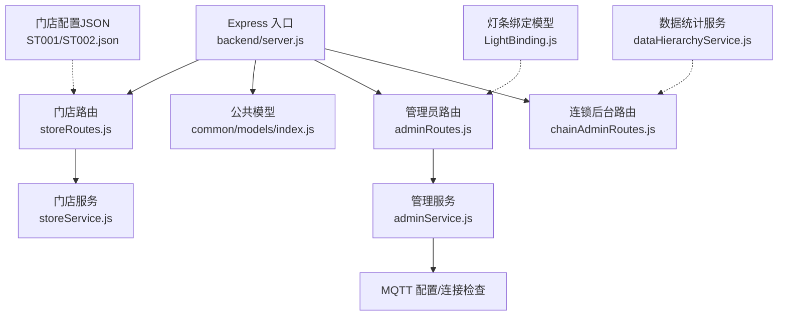
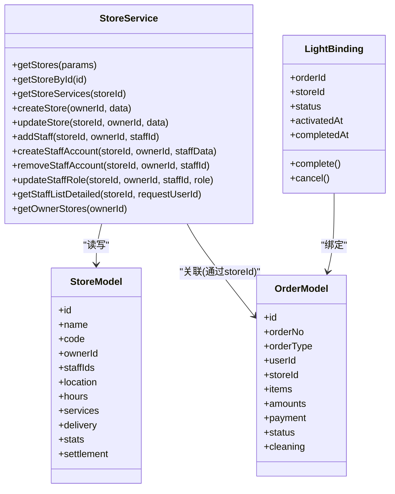
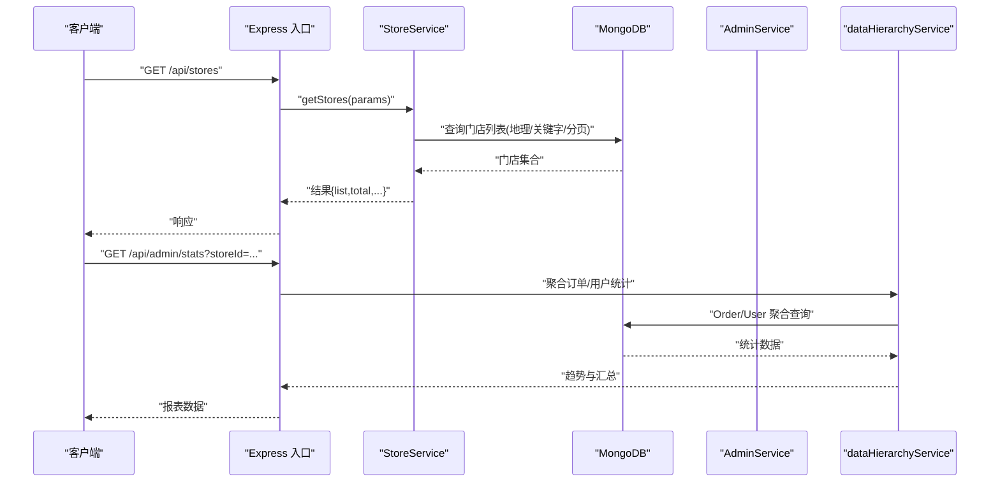
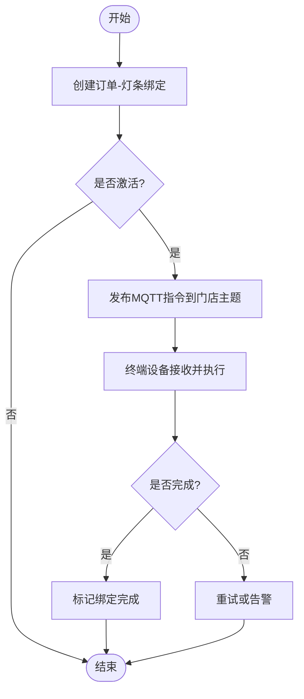
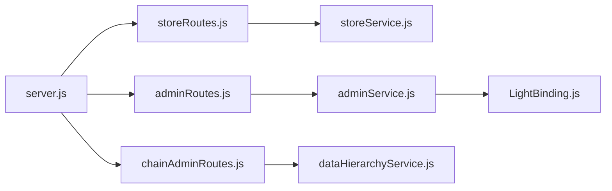

# 门店管理系统

<cite>
**本文引用的文件**
- [backend/server.js](file://backend/server.js)
- [backend/modules/cleaning/routes/storeRoutes.js](file://backend/modules/cleaning/routes/storeRoutes.js)
- [backend/modules/cleaning/services/storeService.js](file://backend/modules/cleaning/services/storeService.js)
- [backend/modules/common/models/index.js](file://backend/modules/common/models/index.js)
- [backend/data/store-configs/ST001.json](file://backend/data/store-configs/ST001.json)
- [backend/data/store-configs/ST002.json](file://backend/data/store-configs/ST002.json)
- [backend/models/LightBinding.js](file://backend/models/LightBinding.js)
- [backend/modules/admin/routes/adminRoutes.js](file://backend/modules/admin/routes/adminRoutes.js)
- [backend/modules/admin/services/adminService.js](file://backend/modules/admin/services/adminService.js)
- [backend/modules/common/services/dataHierarchyService.js](file://backend/modules/common/services/dataHierarchyService.js)
- [backend/modules/admin/routes/chainAdminRoutes.js](file://backend/modules/admin/routes/chainAdminRoutes.js)
- [backend/services/MQTT_DEPLOYMENT.md](file://backend/services/MQTT_DEPLOYMENT.md)
</cite>

## 目录
1. [简介](#简介)
2. [项目结构](#项目结构)
3. [核心组件](#核心组件)
4. [架构总览](#架构总览)
5. [详细组件分析](#详细组件分析)
6. [依赖关系分析](#依赖关系分析)
7. [性能与扩展性](#性能与扩展性)
8. [故障排查指南](#故障排查指南)
9. [结论](#结论)
10. [附录：API 接口规范](#附录api-接口规范)

## 简介
本系统为干洗店“门店管理”子系统，覆盖门店基本信息、营业时间、地理位置、服务配置、员工账号、库存与设备联动（灯条）、订单关联与业绩统计、差异化门店配置等能力。后端采用模块化 Express 架构，数据层支持 MongoDB 多态模型，同时提供 MQTT 实时通信以支撑灯条提示、扫码入库等 IoT 场景。

## 项目结构
- 入口与路由挂载：Express 应用统一注册各模块路由，包括门店、清洗、支付、会员、管理员、连锁后台、同步与消息中心等。
- 门店模块：位于 cleaning 子模块下，包含 storeRoutes 与 storeService，负责门店 CRUD、员工账户管理、默认服务初始化等。
- 公共模型：common/models 定义用户、订单、物品、配送、模板等多态模型及权限枚举。
- 门店配置：data/store-configs 存放按门店的 JSON 配置（类目、服务、促销等），用于前端展示与差异化运营。
- 设备联动：LightBinding 模型记录订单与灯条绑定关系；admin 侧提供 MQTT 配置与连接状态查询；MQTT 部署文档提供 Broker 安装与运行说明。
- 数据统计：admin 与 dataHierarchyService 聚合订单与用户指标，形成报表与趋势。

图表来源
- [backend/server.js:96-151](file://backend/server.js#L96-L151)
- [backend/modules/cleaning/routes/storeRoutes.js:1-194](file://backend/modules/cleaning/routes/storeRoutes.js#L1-L194)
- [backend/modules/cleaning/services/storeService.js:1-376](file://backend/modules/cleaning/services/storeService.js#L1-L376)
- [backend/modules/common/models/index.js:1-795](file://backend/modules/common/models/index.js#L1-L795)
- [backend/modules/admin/routes/adminRoutes.js:681-728](file://backend/modules/admin/routes/adminRoutes.js#L681-L728)
- [backend/modules/admin/services/adminService.js:1233-1283](file://backend/modules/admin/services/adminService.js#L1233-L1283)
- [backend/models/LightBinding.js:63-114](file://backend/models/LightBinding.js#L63-L114)
- [backend/modules/admin/routes/chainAdminRoutes.js:443-491](file://backend/modules/admin/routes/chainAdminRoutes.js#L443-L491)
- [backend/modules/common/services/dataHierarchyService.js:479-566](file://backend/modules/common/services/dataHierarchyService.js#L479-L566)
- [backend/data/store-configs/ST001.json:1-142](file://backend/data/store-configs/ST001.json#L1-L142)
- [backend/data/store-configs/ST002.json:1-135](file://backend/data/store-configs/ST002.json#L1-L135)

章节来源
- [backend/server.js:96-151](file://backend/server.js#L96-L151)

## 核心组件
- 门店服务（StoreService）
  - 提供门店列表、详情、服务清单、创建/更新、老板门店列表、员工账户创建/移除/角色更新、员工列表（含详细信息）等。
  - 内置默认服务集，便于新门店快速启用基础业务。
- 公共模型（common/models）
  - 定义用户、订单、物品、配送单、消息模板等数据结构与权限枚举，支撑多态与可扩展性。
- 门店配置（store-configs）
  - 以 JSON 形式维护门店级类目、服务、促销策略，支持不同门店差异化运营。
- 灯条绑定（LightBinding）
  - 记录订单与灯条设备的绑定关系，支持激活、完成、取消等操作与查询。
- 管理员服务（AdminService）
  - 提供门店 MQTT 配置、终端连接状态检查、终端列表获取等能力。
- 数据统计（dataHierarchyService）
  - 聚合订单与用户指标，生成日/周/月维度收入与订单量趋势。

章节来源
- [backend/modules/cleaning/services/storeService.js:1-376](file://backend/modules/cleaning/services/storeService.js#L1-L376)
- [backend/modules/common/models/index.js:1-795](file://backend/modules/common/models/index.js#L1-L795)
- [backend/data/store-configs/ST001.json:1-142](file://backend/data/store-configs/ST001.json#L1-L142)
- [backend/data/store-configs/ST002.json:1-135](file://backend/data/store-configs/ST002.json#L1-L135)
- [backend/models/LightBinding.js:63-114](file://backend/models/LightBinding.js#L63-L114)
- [backend/modules/admin/services/adminService.js:1233-1283](file://backend/modules/admin/services/adminService.js#L1233-L1283)
- [backend/modules/common/services/dataHierarchyService.js:479-566](file://backend/modules/common/services/dataHierarchyService.js#L479-L566)

## 架构总览
系统采用“入口路由 + 模块服务 + 数据模型 + 外部集成（MQTT/支付/配送）”的分层架构。门店相关能力集中在 cleaning 模块，公共能力在 common 模块，管理与统计在 admin 模块。

图表来源
- [backend/modules/cleaning/services/storeService.js:1-376](file://backend/modules/cleaning/services/storeService.js#L1-L376)
- [backend/modules/common/models/index.js:531-627](file://backend/modules/common/models/index.js#L531-L627)
- [backend/modules/common/models/index.js:228-393](file://backend/modules/common/models/index.js#L228-L393)
- [backend/models/LightBinding.js:63-114](file://backend/models/LightBinding.js#L63-L114)

## 详细组件分析

### 门店数据模型设计
- 门店基本信息
  - 字段：名称、编码、地址、城市/区县、经纬度、电话、图片、描述、评分、订单计数、所属老板ID、员工ID数组、连锁ID、门店类型、结算开关与比例等。
  - 索引：地理位置 2dsphere、状态+城市复合索引，提升地理搜索与筛选效率。
- 营业时间
  - 支持开放/关闭时间、节假日说明，便于前台展示与营业状态判断。
- 地理位置
  - 使用 GeoJSON Point 存储坐标，支持半径范围查询，满足“附近门店”需求。
- 服务配置
  - 服务项包含服务ID、名称、基础价格、启用状态；默认服务由服务层注入，便于快速上线。
- 连锁与结算
  - 支持连锁归属、门店类型（自营/加盟/联营）、终端结算开关与结算比例，为分账与对账预留。

章节来源
- [backend/modules/cleaning/services/storeService.js:8-48](file://backend/modules/cleaning/services/storeService.js#L8-L48)
- [backend/modules/cleaning/services/storeService.js:354-364](file://backend/modules/cleaning/services/storeService.js#L354-L364)
- [backend/modules/common/models/index.js:531-627](file://backend/modules/common/models/index.js#L531-L627)

### 门店服务功能
- 门店信息管理
  - 列表查询：支持分页、城市/区县/关键词过滤、地理半径搜索。
  - 详情与服务：按 ID 获取门店详情与启用服务清单。
  - 创建/更新：管理员或门店老板可创建与更新门店信息。
- 员工账号管理
  - 创建员工账户：校验操作者权限，支持新建用户并绑定门店，或为已存在用户追加角色与门店关联。
  - 移除员工：从门店员工列表解绑，清理用户端门店角色。
  - 角色更新：将员工角色在 store_staff 与 store_owner 间切换。
  - 员工列表：返回完整用户信息（脱敏密码），兼容旧接口仅返回 ID 列表。
- 库存管理
  - 当前仓库未实现独立库存模型，可在现有 Item 模型基础上扩展 SKU、批次、出入库流水等字段，并与订单/门店关联。
- 设备管理
  - 灯条绑定：通过 LightBinding 模型记录订单与灯条的绑定关系，支持激活、完成、取消与按门店/订单查询。
  - MQTT 配置与连接：管理员侧提供门店 MQTT 配置与连接状态检查，便于运维监控。

章节来源
- [backend/modules/cleaning/routes/storeRoutes.js:1-194](file://backend/modules/cleaning/routes/storeRoutes.js#L1-L194)
- [backend/modules/cleaning/services/storeService.js:51-372](file://backend/modules/cleaning/services/storeService.js#L51-L372)
- [backend/models/LightBinding.js:63-114](file://backend/models/LightBinding.js#L63-L114)
- [backend/modules/admin/routes/adminRoutes.js:681-728](file://backend/modules/admin/routes/adminRoutes.js#L681-L728)
- [backend/modules/admin/services/adminService.js:1233-1283](file://backend/modules/admin/services/adminService.js#L1233-L1283)

### 门店配置管理机制
- 门店级 JSON 配置
  - 类目：衣物清洗、鞋子护理、箱包洗护、家纺清洗、特殊护理等。
  - 服务：服务ID、名称、分类、价格、图标、描述、启用状态。
  - 促销：折扣、满减、首单优惠等，支持按条件启用。
  - 其他：更新时间戳、保存时间戳、可选扩展字段（如 boardingConfig）。
- 差异化定制
  - 不同门店可拥有独立的服务定价与促销策略，前端根据 storeId 加载对应配置。
  - 建议在后端增加配置缓存与版本控制，避免频繁磁盘 IO。

章节来源
- [backend/data/store-configs/ST001.json:1-142](file://backend/data/store-configs/ST001.json#L1-L142)
- [backend/data/store-configs/ST002.json:1-135](file://backend/data/store-configs/ST002.json#L1-L135)

### 门店与订单的关联关系
- 关联方式
  - 订单模型包含 storeId 字段，明确订单归属门店。
  - 门店模型包含 orderCount 等统计字段，便于快速展示门店规模。
- 自动分配
  - 当前代码未实现自动分配逻辑，可在下单流程中基于地理位置、门店服务能力、负载情况选择目标门店。
- 业绩统计
  - 通过聚合查询按门店维度统计订单量与收入，支持日/周/月趋势。

图表来源
- [backend/server.js:96-151](file://backend/server.js#L96-L151)
- [backend/modules/cleaning/routes/storeRoutes.js:1-194](file://backend/modules/cleaning/routes/storeRoutes.js#L1-L194)
- [backend/modules/cleaning/services/storeService.js:51-94](file://backend/modules/cleaning/services/storeService.js#L51-L94)
- [backend/modules/admin/routes/chainAdminRoutes.js:443-491](file://backend/modules/admin/routes/chainAdminRoutes.js#L443-L491)
- [backend/modules/common/services/dataHierarchyService.js:479-566](file://backend/modules/common/services/dataHierarchyService.js#L479-L566)

章节来源
- [backend/modules/common/models/index.js:228-393](file://backend/modules/common/models/index.js#L228-L393)
- [backend/modules/admin/routes/chainAdminRoutes.js:443-491](file://backend/modules/admin/routes/chainAdminRoutes.js#L443-L491)
- [backend/modules/common/services/dataHierarchyService.js:479-566](file://backend/modules/common/services/dataHierarchyService.js#L479-L566)

### 门店运营看板
- 订单统计
  - 当日/近一周/近一月订单量、已完成订单数、平均客单价。
- 收入报表
  - 日/周/月收入趋势，按门店聚合，支持导出与对比。
- 客户分析
  - 累计用户、新增用户、活跃用户等指标，结合门店维度进行细分。

章节来源
- [backend/modules/admin/routes/chainAdminRoutes.js:443-491](file://backend/modules/admin/routes/chainAdminRoutes.js#L443-L491)
- [backend/modules/common/services/dataHierarchyService.js:479-566](file://backend/modules/common/services/dataHierarchyService.js#L479-L566)

### 门店设备联动（IoT）
- 灯条绑定
  - 记录订单与灯条的绑定关系，支持激活、完成、取消，并提供按门店/订单查询。
- MQTT 集成
  - 管理员侧提供门店 MQTT 配置与连接状态检查，便于运维监控。
  - 部署文档提供 EMQX 快速部署步骤与验证方法。

图表来源
- [backend/models/LightBinding.js:63-114](file://backend/models/LightBinding.js#L63-L114)
- [backend/modules/admin/routes/adminRoutes.js:681-728](file://backend/modules/admin/routes/adminRoutes.js#L681-L728)
- [backend/services/MQTT_DEPLOYMENT.md:1-90](file://backend/services/MQTT_DEPLOYMENT.md#L1-L90)

章节来源
- [backend/models/LightBinding.js:63-114](file://backend/models/LightBinding.js#L63-L114)
- [backend/modules/admin/routes/adminRoutes.js:681-728](file://backend/modules/admin/routes/adminRoutes.js#L681-L728)
- [backend/services/MQTT_DEPLOYMENT.md:1-90](file://backend/services/MQTT_DEPLOYMENT.md#L1-L90)

## 依赖关系分析
- 入口 server.js 统一挂载各模块路由，形成清晰的路由树。
- storeRoutes 依赖 storeService 执行业务逻辑，storeService 直接访问 MongoDB 模型。
- adminRoutes 与 adminService 提供管理侧能力，包括 MQTT 配置与连接检查。
- chainAdminRoutes 与 dataHierarchyService 提供连锁后台与统计分析。
- LightBinding 作为设备层数据模型，被管理侧与业务侧共同引用。

图表来源
- [backend/server.js:96-151](file://backend/server.js#L96-L151)
- [backend/modules/cleaning/routes/storeRoutes.js:1-194](file://backend/modules/cleaning/routes/storeRoutes.js#L1-L194)
- [backend/modules/cleaning/services/storeService.js:1-376](file://backend/modules/cleaning/services/storeService.js#L1-L376)
- [backend/modules/admin/routes/adminRoutes.js:681-728](file://backend/modules/admin/routes/adminRoutes.js#L681-L728)
- [backend/modules/admin/services/adminService.js:1233-1283](file://backend/modules/admin/services/adminService.js#L1233-L1283)
- [backend/modules/admin/routes/chainAdminRoutes.js:443-491](file://backend/modules/admin/routes/chainAdminRoutes.js#L443-L491)
- [backend/modules/common/services/dataHierarchyService.js:479-566](file://backend/modules/common/services/dataHierarchyService.js#L479-L566)
- [backend/models/LightBinding.js:63-114](file://backend/models/LightBinding.js#L63-L114)

章节来源
- [backend/server.js:96-151](file://backend/server.js#L96-L151)

## 性能与扩展性
- 索引优化
  - 门店地理位置 2dsphere 索引、状态+城市复合索引，提升地理搜索与筛选性能。
- 聚合查询
  - 使用 MongoDB 聚合管道计算收入与订单量趋势，减少应用层计算开销。
- 扩展点
  - 多态模型支持未来回收/租赁业务扩展。
  - 门店配置 JSON 支持差异化运营，建议引入缓存与版本控制。
  - 设备联动可通过 MQTT 主题隔离与限流策略保障稳定性。

[本节为通用指导，不直接分析具体文件]

## 故障排查指南
- 端口冲突
  - 启动时若端口占用，会输出错误日志并退出进程，需先释放端口再重启。
- MQTT 连接异常
  - 检查 Broker 是否运行、端口映射是否正确、认证配置是否匹配。
- 权限错误
  - 员工账户创建/修改需要 store_owner 或 admin 角色，否则返回权限错误。
- 数据不一致
  - 跨端同步与通知中心接口可用于诊断前后端一致性，必要时查看操作历史与心跳状态。

章节来源
- [backend/server.js:655-696](file://backend/server.js#L655-L696)
- [backend/modules/cleaning/services/storeService.js:180-289](file://backend/modules/cleaning/services/storeService.js#L180-L289)
- [backend/modules/admin/routes/adminRoutes.js:681-728](file://backend/modules/admin/routes/adminRoutes.js#L681-L728)

## 结论
门店管理系统围绕“门店—订单—设备—统计”的主线构建，具备完善的门店信息管理、员工账号管理、差异化配置、订单关联与业绩统计、以及灯条设备联动能力。通过模块化架构与多态模型，系统具备良好的扩展性与可维护性，适合在多门店、连锁化场景下持续演进。

[本节为总结性内容，不直接分析具体文件]

## 附录：API 接口规范

### 门店管理
- 获取门店列表
  - 方法：GET
  - 路径：/api/stores
  - 参数：page, pageSize, city, district, keyword, latitude, longitude, radius
  - 响应：{ success, data: { list, total, page, pageSize, totalPages } }
- 获取门店详情
  - 方法：GET
  - 路径：/api/stores/:id
  - 响应：{ success, data: 门店对象 }
- 获取门店服务列表
  - 方法：GET
  - 路径：/api/stores/:id/services
  - 响应：{ success, data: { storeId, storeName, services } }
- 创建门店
  - 方法：POST
  - 路径：/api/stores
  - 鉴权：admin/store_owner
  - 请求体：门店基本信息
  - 响应：{ success, data: 门店对象 }
- 更新门店信息
  - 方法：PUT
  - 路径：/api/stores/:id
  - 鉴权：admin/store_owner
  - 请求体：待更新字段
  - 响应：{ success, data: 门店对象 }
- 获取我的门店列表（老板）
  - 方法：GET
  - 路径：/api/stores/owner/my
  - 鉴权：admin/store_owner
  - 响应：{ success, data: 门店列表 }
- 创建门店员工账户
  - 方法：POST
  - 路径：/api/stores/:id/staff/create
  - 鉴权：admin/store_owner
  - 请求体：{ phone, password, name, role }
  - 响应：{ success, data: { staffId, name, phone, roles } }
- 获取门店员工列表（含详细信息）
  - 方法：GET
  - 路径：/api/stores/:id/staff/detail
  - 鉴权：admin/store_owner/store_staff
  - 响应：{ success, data: { storeId, storeName, storeNo, staff, canManage } }
- 移除门店员工
  - 方法：DELETE
  - 路径：/api/stores/:id/staff/:staffId
  - 鉴权：admin/store_owner
  - 响应：{ success, data: { success } }
- 更新员工角色
  - 方法：PUT
  - 路径：/api/stores/:id/staff/:staffId/role
  - 鉴权：admin/store_owner
  - 请求体：{ role }
  - 响应：{ success, data: { roles } }
- 添加门店员工（旧接口）
  - 方法：POST
  - 路径：/api/stores/:id/staff
  - 鉴权：admin/store_owner
  - 请求体：{ staffId }
  - 响应：{ success, data: 门店对象 }
- 获取门店员工列表（旧接口）
  - 方法：GET
  - 路径：/api/stores/:id/staff
  - 鉴权：admin/store_owner/store_staff
  - 响应：{ success, data: 员工ID列表 }

章节来源
- [backend/modules/cleaning/routes/storeRoutes.js:1-194](file://backend/modules/cleaning/routes/storeRoutes.js#L1-L194)

### 设备联动与管理
- 获取门店 MQTT 连接配置
  - 方法：GET
  - 路径：/api/admin/store/:storeId/mqtt-config
  - 响应：{ success, data: mqttConfig }
- 检查门店灯条连接状态
  - 方法：GET
  - 路径：/api/admin/store/:storeId/light-connection
  - 响应：{ success, data: connectionStatus }
- 获取终端列表（所有在线终端）
  - 方法：GET
  - 路径：/api/admin/terminals
  - 响应：{ success, data: terminals }

章节来源
- [backend/modules/admin/routes/adminRoutes.js:681-728](file://backend/modules/admin/routes/adminRoutes.js#L681-L728)
- [backend/modules/admin/services/adminService.js:1233-1283](file://backend/modules/admin/services/adminService.js#L1233-L1283)

### 运营统计
- 连锁后台门店统计
  - 方法：GET
  - 路径：/api/chain-admin/store/:storeId/stats
  - 响应：{ success, data: { todayOrders, weekOrders, monthOrders, totalUsers, todayNewUsers, ... } }

章节来源
- [backend/modules/admin/routes/chainAdminRoutes.js:443-491](file://backend/modules/admin/routes/chainAdminRoutes.js#L443-L491)

### 部署与初始化配置
- 数据库
  - 支持 MongoDB 与 MySQL，推荐生产环境使用 MySQL，开发环境可使用 MongoDB。
- MQTT Broker
  - 推荐使用 Docker 部署 EMQX，暴露 TCP 1883、WebSocket 8083 等端口，并通过控制台验证。
- 环境变量
  - 参考后端 README 中的 .env.example 示例，配置数据库与端口等必要变量。

章节来源
- [backend/README.md:121-174](file://backend/README.md#L121-L174)
- [backend/services/MQTT_DEPLOYMENT.md:1-90](file://backend/services/MQTT_DEPLOYMENT.md#L1-L90)