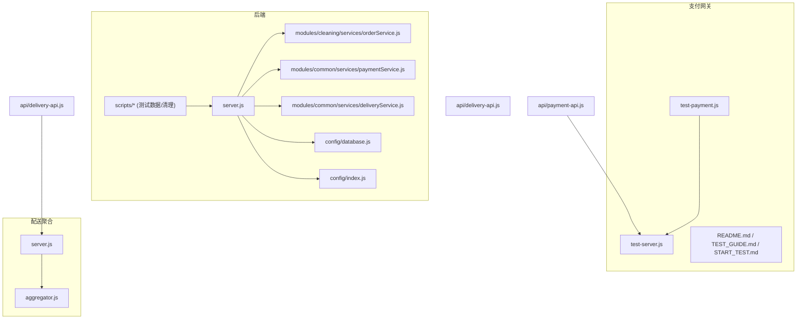
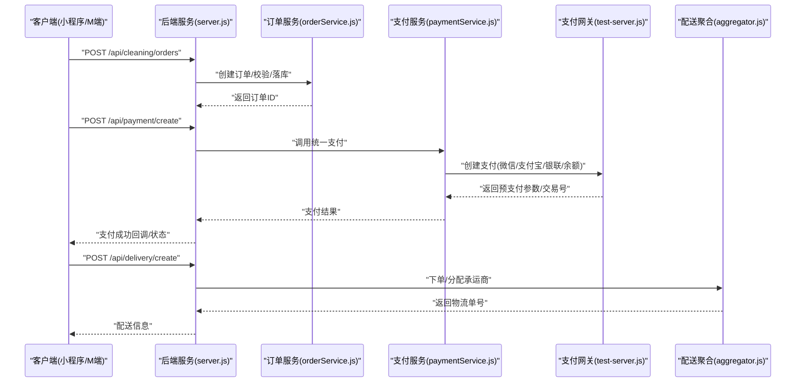
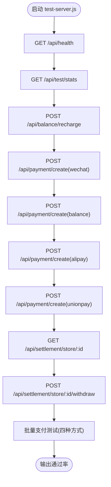
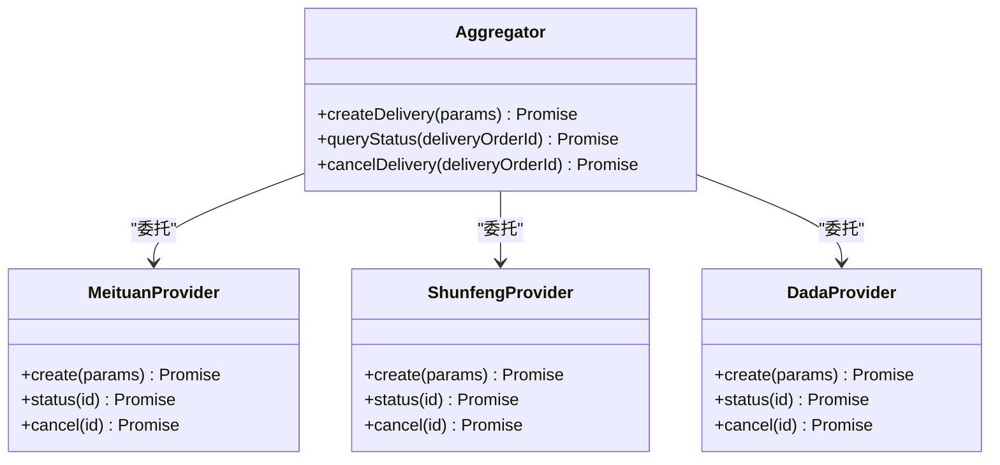
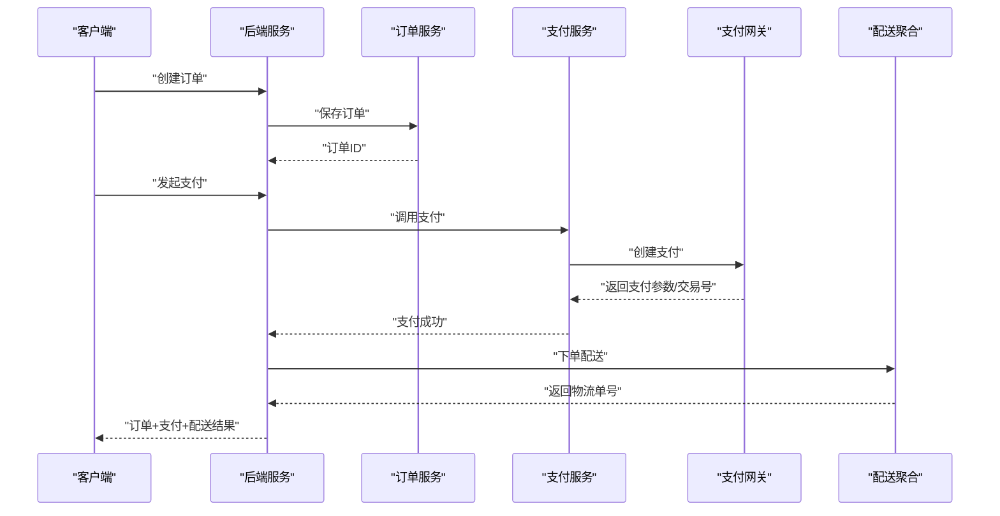
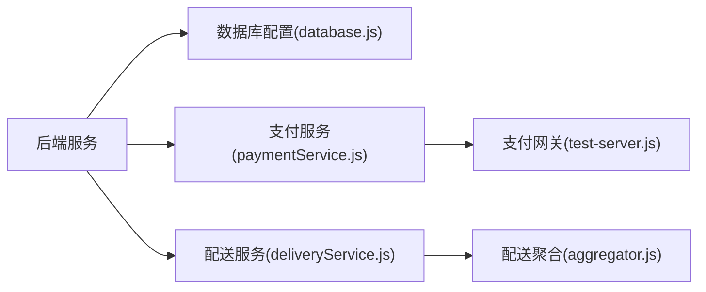

# 测试指南

<cite>
**本文引用的文件**   
- [backend/README.md](file://backend/README.md)
- [api/payment-server/README.md](file://api/payment-server/README.md)
- [api/payment-server/TEST_GUIDE.md](file://api/payment-server/TEST_GUIDE.md)
- [api/payment-server/START_TEST.md](file://api/payment-server/START_TEST.md)
- [api/payment-server/test-payment.js](file://api/payment-server/test-payment.js)
- [api/payment-server/test-server.js](file://api/payment-server/test-server.js)
- [api/delivery-api.js](file://api/delivery-api.js)
- [api/payment-api.js](file://api/payment-api.js)
- [backend/server.js](file://backend/server.js)
- [backend/config/database.js](file://backend/config/database.js)
- [backend/config/index.js](file://backend/config/index.js)
- [backend/modules/cleaning/services/orderService.js](file://backend/modules/cleaning/services/orderService.js)
- [backend/modules/common/services/paymentService.js](file://backend/modules/common/services/paymentService.js)
- [backend/modules/common/services/deliveryService.js](file://backend/modules/common/services/deliveryService.js)
- [backend/scripts/createTestData.js](file://backend/scripts/createTestData.js)
- [backend/scripts/clear-test-data.js](file://backend/scripts/clear-test-data.js)
- [backend/docker-compose.yml](file://backend/docker-compose.yml)
- [backend/package.json](file://backend/package.json)
- [delivery-api/server.js](file://delivery-api/server.js)
- [delivery-api/aggregator.js](file://delivery-api/aggregator.js)
</cite>

## 目录
1. [引言](#引言)
2. [项目结构](#项目结构)
3. [核心组件](#核心组件)
4. [架构总览](#架构总览)
5. [详细组件分析](#详细组件分析)
6. [依赖分析](#依赖分析)
7. [性能考虑](#性能考虑)
8. [故障排查指南](#故障排查指南)
9. [结论](#结论)
10. [附录](#附录)

## 引言
本测试指南面向干洗店管理系统的测试工程师与开发人员，覆盖单元测试、集成测试与端到端测试策略；围绕订单流程、支付处理、配送调度等关键业务场景设计用例；提供自动化脚本使用方法（API、数据库、性能基准）；说明测试环境搭建（数据准备、Mock服务、测试数据库配置）；并给出覆盖率要求、持续集成中的执行、报告生成、质量门禁与回归测试的自动化流程。

## 项目结构
系统包含后端主服务、支付网关、配送聚合API以及前端与小程序页面。测试相关能力主要分布在：
- 后端：模块路由与服务、数据库配置、测试脚本
- 支付网关：模拟测试服务器与自动化测试脚本
- 配送聚合：第三方配送提供商聚合接口
- 根级文档与脚本：快速测试、联调测试指南

图表来源
- [backend/server.js](file://backend/server.js)
- [backend/config/database.js](file://backend/config/database.js)
- [backend/config/index.js](file://backend/config/index.js)
- [backend/modules/cleaning/services/orderService.js](file://backend/modules/cleaning/services/orderService.js)
- [backend/modules/common/services/paymentService.js](file://backend/modules/common/services/paymentService.js)
- [backend/modules/common/services/deliveryService.js](file://backend/modules/common/services/deliveryService.js)
- [api/payment-server/test-server.js](file://api/payment-server/test-server.js)
- [api/payment-server/test-payment.js](file://api/payment-server/test-payment.js)
- [delivery-api/server.js](file://delivery-api/server.js)
- [delivery-api/aggregator.js](file://delivery-api/aggregator.js)
- [api/delivery-api.js](file://api/delivery-api.js)
- [api/payment-api.js](file://api/payment-api.js)

章节来源
- [backend/README.md](file://backend/README.md)
- [api/payment-server/README.md](file://api/payment-server/README.md)

## 核心组件
- 后端服务入口与模块装配：负责加载各业务模块、中间件、路由与数据库连接。
- 清洗订单服务：实现订单创建、状态流转、门店操作等核心流程。
- 统一支付服务：封装支付渠道调用、分账与结算逻辑。
- 配送服务：对接多家配送商，提供下单、查询、取消等能力。
- 支付网关测试服务器：提供无需真实密钥的模拟支付、余额、结算接口。
- 配送聚合服务：聚合多配送商API，对外暴露统一接口。
- 测试脚本：自动化发起API请求，验证支付、余额、结算等能力。

章节来源
- [backend/README.md](file://backend/README.md)
- [backend/modules/cleaning/services/orderService.js](file://backend/modules/cleaning/services/orderService.js)
- [backend/modules/common/services/paymentService.js](file://backend/modules/common/services/paymentService.js)
- [backend/modules/common/services/deliveryService.js](file://backend/modules/common/services/deliveryService.js)
- [api/payment-server/test-server.js](file://api/payment-server/test-server.js)
- [api/payment-server/test-payment.js](file://api/payment-server/test-payment.js)
- [delivery-api/server.js](file://delivery-api/server.js)
- [delivery-api/aggregator.js](file://delivery-api/aggregator.js)

## 架构总览
从测试视角看，系统由“客户端 → 后端服务 → 支付网关/配送聚合 → 外部渠道”组成。测试采用分层策略：
- 单元测试：针对服务层函数与工具方法（如价格计算、权限校验）。
- 集成测试：通过HTTP调用后端与支付网关，验证跨模块交互。
- 端到端测试：串联小程序/M端 → 后端 → 支付网关/配送聚合，验证完整业务流程。

图表来源
- [backend/server.js](file://backend/server.js)
- [backend/modules/cleaning/services/orderService.js](file://backend/modules/cleaning/services/orderService.js)
- [backend/modules/common/services/paymentService.js](file://backend/modules/common/services/paymentService.js)
- [api/payment-server/test-server.js](file://api/payment-server/test-server.js)
- [delivery-api/aggregator.js](file://delivery-api/aggregator.js)

## 详细组件分析

### 支付网关测试组件
- 测试服务器：提供健康检查、支付创建、余额充值、门店结算与提现等接口，使用内存Map模拟用户与门店账户。
- 自动化测试脚本：顺序执行健康检查、查看测试数据、余额充值、微信支付、余额支付、支付宝、银联、门店结算查询、门店提现、批量支付测试，输出通过率。

图表来源
- [api/payment-server/test-server.js](file://api/payment-server/test-server.js)
- [api/payment-server/test-payment.js](file://api/payment-server/test-payment.js)

章节来源
- [api/payment-server/TEST_GUIDE.md](file://api/payment-server/TEST_GUIDE.md)
- [api/payment-server/START_TEST.md](file://api/payment-server/START_TEST.md)
- [api/payment-server/test-payment.js](file://api/payment-server/test-payment.js)
- [api/payment-server/test-server.js](file://api/payment-server/test-server.js)

### 配送聚合组件
- 聚合器：统一封装多家配送商（如美团、顺丰、达达等）的下单、查询、取消接口，屏蔽差异。
- 对外服务：提供统一的配送API，供后端或前端调用。

图表来源
- [delivery-api/aggregator.js](file://delivery-api/aggregator.js)
- [delivery-api/server.js](file://delivery-api/server.js)

章节来源
- [delivery-api/aggregator.js](file://delivery-api/aggregator.js)
- [delivery-api/server.js](file://delivery-api/server.js)

### 订单与支付集成流程
- 订单创建：后端清洗模块创建订单，持久化后返回订单ID。
- 支付处理：统一支付服务根据支付方式选择对应渠道，调用支付网关获取预支付参数或完成扣款。
- 配送调度：订单支付成功后触发配送下单，聚合器选择合适承运商并返回物流单号。

图表来源
- [backend/modules/cleaning/services/orderService.js](file://backend/modules/cleaning/services/orderService.js)
- [backend/modules/common/services/paymentService.js](file://backend/modules/common/services/paymentService.js)
- [api/payment-server/test-server.js](file://api/payment-server/test-server.js)
- [delivery-api/aggregator.js](file://delivery-api/aggregator.js)

章节来源
- [backend/modules/cleaning/services/orderService.js](file://backend/modules/cleaning/services/orderService.js)
- [backend/modules/common/services/paymentService.js](file://backend/modules/common/services/paymentService.js)
- [api/payment-server/test-server.js](file://api/payment-server/test-server.js)
- [delivery-api/aggregator.js](file://delivery-api/aggregator.js)

## 依赖分析
- 后端依赖数据库配置与模块开关，支付与配送为外部依赖（通过服务层抽象）。
- 支付网关测试服务器独立运行，不依赖真实第三方支付密钥。
- 配送聚合依赖具体配送商SDK或HTTP接口。

图表来源
- [backend/config/database.js](file://backend/config/database.js)
- [backend/modules/common/services/paymentService.js](file://backend/modules/common/services/paymentService.js)
- [backend/modules/common/services/deliveryService.js](file://backend/modules/common/services/deliveryService.js)
- [api/payment-server/test-server.js](file://api/payment-server/test-server.js)
- [delivery-api/aggregator.js](file://delivery-api/aggregator.js)

章节来源
- [backend/config/index.js](file://backend/config/index.js)
- [backend/config/database.js](file://backend/config/database.js)

## 性能考虑
- 支付网关测试服务器使用内存存储，适合快速验证与压测基础链路；生产环境需替换为持久化存储与限流。
- 配送聚合应引入缓存与重试退避策略，避免下游抖动影响整体吞吐。
- 建议对关键路径（订单创建、支付创建、配送下单）进行基准测试，关注P95/P99延迟与错误率。

[本节为通用指导，不涉及具体文件分析]

## 故障排查指南
- 支付网关端口占用：确认测试服务器已启动且端口未被占用；必要时更换端口。
- 测试账号不存在：测试服务器启动时自动初始化测试用户与门店账户，若异常可重启服务。
- 余额不足：先执行余额充值接口后再进行余额支付测试。
- 网络连接失败：确保本地网络正常，防火墙未拦截测试端口。

章节来源
- [api/payment-server/TEST_GUIDE.md](file://api/payment-server/TEST_GUIDE.md)
- [api/payment-server/START_TEST.md](file://api/payment-server/START_TEST.md)

## 结论
通过分层测试策略与完善的Mock服务，可在无真实第三方依赖的情况下高效验证订单、支付与配送的核心链路。结合自动化脚本与持续集成，可实现稳定的质量门禁与回归保障。

[本节为总结性内容，不涉及具体文件分析]

## 附录

### 测试策略与框架选择
- 单元测试：针对服务层函数与工具方法，建议使用Node.js内置assert或轻量断言库；聚焦边界条件与异常分支。
- 集成测试：基于HTTP调用后端与支付网关，验证跨模块交互与数据一致性。
- 端到端测试：串联小程序/M端与后端、支付网关、配送聚合，覆盖完整业务闭环。

[本节为通用指导，不涉及具体文件分析]

### 核心功能测试用例设计
- 订单流程：创建订单、修改状态、门店收件、完成清洗、取消订单。
- 支付处理：微信支付、支付宝、银联、余额支付；查询支付状态；退款（如有）。
- 配送调度：下单、查询状态、取消配送；异常场景（超时、不可达承运商）。

章节来源
- [backend/README.md](file://backend/README.md)
- [api/delivery-api.js](file://api/delivery-api.js)
- [api/payment-api.js](file://api/payment-api.js)

### 自动化测试脚本使用方法
- API测试：在支付网关目录下运行自动化脚本，顺序执行健康检查、余额充值、多种支付方式、结算与提现、批量支付。
- 数据库测试：使用后端提供的测试数据创建与清理脚本，确保每次测试前环境一致。
- 性能基准测试：对关键接口进行并发请求，记录响应时间与错误率，评估系统稳定性。

章节来源
- [api/payment-server/test-payment.js](file://api/payment-server/test-payment.js)
- [backend/scripts/createTestData.js](file://backend/scripts/createTestData.js)
- [backend/scripts/clear-test-data.js](file://backend/scripts/clear-test-data.js)

### 测试环境搭建
- 测试数据准备：运行测试数据创建脚本，初始化用户、门店与初始余额。
- Mock服务：启动支付网关测试服务器，无需真实API密钥即可进行支付与结算测试。
- 测试数据库配置：根据后端配置选择MongoDB或MySQL，确保连接可用。

章节来源
- [backend/scripts/createTestData.js](file://backend/scripts/createTestData.js)
- [api/payment-server/test-server.js](file://api/payment-server/test-server.js)
- [backend/config/database.js](file://backend/config/database.js)
- [backend/docker-compose.yml](file://backend/docker-compose.yml)

### 覆盖率要求与持续集成
- 覆盖率目标：建议核心模块行覆盖率≥80%，分支覆盖率≥70%。
- CI流水线：代码提交触发构建→安装依赖→运行单元测试→集成测试→端到端测试→生成覆盖率报告→质量门禁（阈值不达标则失败）。
- 报告与归档：将HTML覆盖率报告与测试结果上传至制品库，便于追溯。

[本节为通用指导，不涉及具体文件分析]

### 回归测试与质量门禁
- 回归范围：覆盖订单、支付、配送的关键路径与历史缺陷点。
- 门禁规则：失败用例数=0、覆盖率达标、关键接口P95延迟低于阈值。
- 发布前演练：在预发环境执行全量回归，确保变更不影响既有功能。

[本节为通用指导，不涉及具体文件分析]