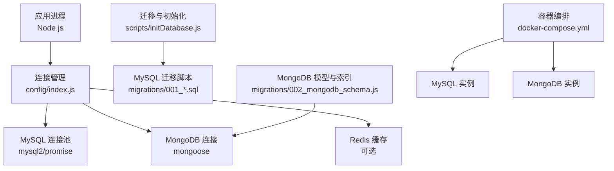
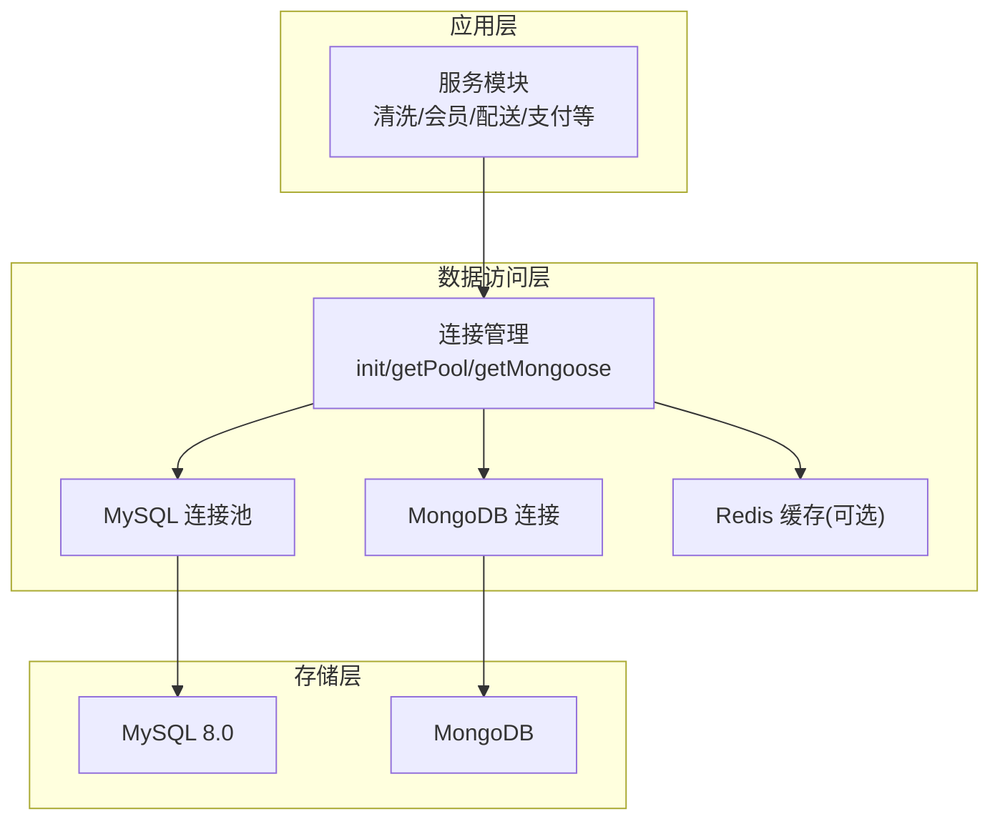
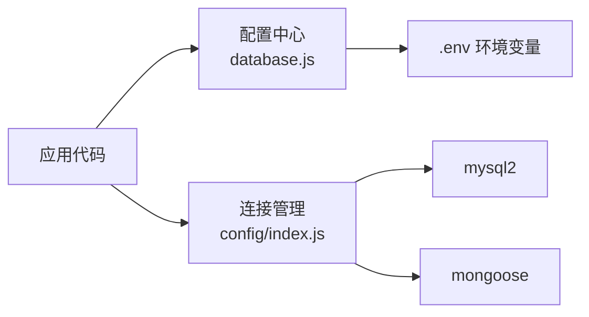

# 性能优化策略

<cite>
**本文引用的文件**
- [backend/config/database.js](file://backend/config/database.js)
- [backend/config/index.js](file://backend/config/index.js)
- [backend/migrations/001_migrate_to_polymorphic.sql](file://backend/migrations/001_migrate_to_polymorphic.sql)
- [backend/migrations/002_mongodb_schema.js](file://backend/migrations/002_mongodb_schema.js)
- [backend/scripts/initDatabase.js](file://backend/scripts/initDatabase.js)
- [backend/docker-compose.yml](file://backend/docker-compose.yml)
- [backend/README.md](file://backend/README.md)
- [.codebuddy/rules/tcb/rules/cloudbase-cli/references/mysql.md](file://.codebuddy/rules/tcb/rules/cloudbase-cli/references/mysql.md)
- [.codebuddy/rules/tcb/rules/no-sql-web-sdk/geolocation.md](file://.codebuddy/rules/tcb/rules/no-sql-web-sdk/geolocation.md)
- [.codebuddy/rules/tcb/rules/no-sql-web-sdk/aggregation.md](file://.codebuddy/rules/tcb/rules/no-sql-web-sdk/aggregation.md)
- [.codebuddy/rules/tcb/rules/no-sql-web-sdk/pagination.md](file://.codebuddy/rules/tcb/rules/no-sql-web-sdk/pagination.md)
</cite>

## 目录
1. [引言](#引言)
2. [项目结构](#项目结构)
3. [核心组件](#核心组件)
4. [架构总览](#架构总览)
5. [详细组件分析](#详细组件分析)
6. [依赖分析](#依赖分析)
7. [性能考虑](#性能考虑)
8. [故障排查指南](#故障排查指南)
9. [结论](#结论)
10. [附录](#附录)

## 引言
本文件面向干洗店管理系统的数据库性能优化，围绕索引设计与优化、查询优化（慢查询分析与执行计划解读）、分库分表策略、缓存优化（多级缓存与穿透防护）、连接池调优、监控指标与基准测试方法，以及面向开发者与DBA的实用指南展开。文档结合仓库中MySQL与MongoDB双栈配置、迁移脚本与模型定义，给出可落地的优化方案与实施建议。

## 项目结构
后端采用“多数据库适配 + 模块化服务”的架构：
- 统一配置层：集中管理MySQL、MongoDB、Redis的连接参数与TTL等
- 连接管理层：单例初始化并暴露获取接口
- 数据模型与迁移：MySQL使用SQL迁移脚本；MongoDB使用Mongoose Schema与索引声明
- 运维与工具：Docker编排、初始化脚本、健康检查与连接测试

图表来源
- [backend/config/index.js:1-114](file://backend/config/index.js#L1-L114)
- [backend/config/database.js:1-64](file://backend/config/database.js#L1-L64)
- [backend/scripts/initDatabase.js:93-147](file://backend/scripts/initDatabase.js#L93-L147)
- [backend/migrations/001_migrate_to_polymorphic.sql:1-310](file://backend/migrations/001_migrate_to_polymorphic.sql#L1-L310)
- [backend/migrations/002_mongodb_schema.js:1-607](file://backend/migrations/002_mongodb_schema.js#L1-L607)
- [backend/docker-compose.yml:1-33](file://backend/docker-compose.yml#L1-L33)

章节来源
- [backend/config/database.js:1-64](file://backend/config/database.js#L1-L64)
- [backend/config/index.js:1-114](file://backend/config/index.js#L1-L114)
- [backend/migrations/001_migrate_to_polymorphic.sql:1-310](file://backend/migrations/001_migrate_to_polymorphic.sql#L1-L310)
- [backend/migrations/002_mongodb_schema.js:1-607](file://backend/migrations/002_mongodb_schema.js#L1-L607)
- [backend/scripts/initDatabase.js:93-147](file://backend/scripts/initDatabase.js#L93-L147)
- [backend/docker-compose.yml:1-33](file://backend/docker-compose.yml#L1-L33)

## 核心组件
- 数据库配置中心：提供MySQL/MongoDB/Redis的统一配置入口，包含连接池大小、超时、时区、SSL开关、TTL等关键参数
- 连接管理器：单例模式初始化连接，暴露获取接口，支持错误与断连事件处理
- MySQL迁移与初始化：通过脚本读取并顺序执行DDL/DML，创建表与基础索引
- MongoDB模型与索引：在Schema层声明字段类型、枚举、唯一性与复合索引，覆盖高频查询路径

章节来源
- [backend/config/database.js:1-64](file://backend/config/database.js#L1-L64)
- [backend/config/index.js:1-114](file://backend/config/index.js#L1-L114)
- [backend/scripts/initDatabase.js:93-147](file://backend/scripts/initDatabase.js#L93-L147)
- [backend/migrations/002_mongodb_schema.js:1-607](file://backend/migrations/002_mongodb_schema.js#L1-L607)

## 架构总览
系统同时支持关系型与文档型数据库，并通过配置切换。生产环境推荐MySQL承载强一致交易数据，MongoDB承载灵活业务文档与聚合分析场景；Redis作为可选缓存层提升热点读性能。

图表来源
- [backend/config/index.js:1-114](file://backend/config/index.js#L1-L114)
- [backend/config/database.js:1-64](file://backend/config/database.js#L1-L64)
- [backend/docker-compose.yml:1-33](file://backend/docker-compose.yml#L1-L33)

## 详细组件分析

### 索引设计与优化策略
- MySQL索引现状与建议
  - 现有索引：订单状态历史、物品状态历史、分账记录、信用记录、门店、配送单等表已为常用外键与时间字段建立索引
  - 建议补充：
    - 订单主表：按用户+时间、门店+时间、订单类型+状态的复合索引，以支撑列表分页与筛选
    - JSON列：对频繁过滤的JSON子字段建立生成列或冗余标量列并加索引（如金额、支付状态）
    - 全文索引：对商品名称、描述、备注等文本字段启用FULLTEXT，配合MATCH...AGAINST进行检索
    - 地理空间索引：若门店/地址含经纬度，使用SPATIAL索引或衍生列+普通索引组合，支撑附近门店/骑手搜索
- MongoDB索引现状与建议
  - 已有索引：用户phone/openId、角色、门店ownerId、位置坐标、物品itemType/ownerId/status、订单userId/storeId/orderType/status、支付状态、配送单provider/status、消息模板type+event、信用userId+createdAt等
  - 建议补充：
    - 复合索引：按业务查询前缀排序，如{orderType:1, status:1}、{userId:1, createdAt:-1}
    - 部分索引：针对活跃订单集合{status: {$in:[...]}}建立部分索引减少索引体积
    - 全文索引：对商品名/描述启用text索引，用于前端搜索
    - 地理空间索引：门店location使用2dsphere索引，支撑geoNear/within查询
    - TTL索引：日志/轨迹类大表使用TTL自动清理

章节来源
- [backend/migrations/001_migrate_to_polymorphic.sql:170-278](file://backend/migrations/001_migrate_to_polymorphic.sql#L170-L278)
- [backend/migrations/002_mongodb_schema.js:136-211](file://backend/migrations/002_mongodb_schema.js#L136-L211)
- [backend/migrations/002_mongodb_schema.js:305-308](file://backend/migrations/002_mongodb_schema.js#L305-L308)
- [backend/migrations/002_mongodb_schema.js:478-483](file://backend/migrations/002_mongodb_schema.js#L478-L483)
- [backend/migrations/002_mongodb_schema.js:551-569](file://backend/migrations/002_mongodb_schema.js#L551-L569)
- [backend/migrations/002_mongodb_schema.js:584-584](file://backend/migrations/002_mongodb_schema.js#L584-L584)

### 查询优化技巧
- 慢查询分析
  - MySQL：使用平台慢查询监控命令，按QueryTime/RowsExamined排序定位低效扫描，结合数据库/用户名维度过滤
  - MongoDB：利用explain()与聚合管道阶段统计，优先在match阶段过滤，避免大分组
- 执行计划解读
  - MySQL：关注type=ALL/Using filesort/Using temporary等信号，尽量走索引范围扫描与覆盖索引
  - MongoDB：关注stage=COLLSCAN/IXSCAN/HASH/SORT，确保match阶段命中索引，必要时reindex
- SQL优化建议
  - 避免SELECT *，只取必要字段
  - 将OR条件改写为UNION ALL或拆分为多次查询
  - 分页使用延迟关联或游标式分页，避免深分页
  - 批量写入使用事务与分批提交，降低锁竞争
  - 对JSON列频繁过滤的场景，增加冗余标量列并建索引

章节来源
- [.codebuddy/rules/tcb/rules/cloudbase-cli/references/mysql.md:183-211](file://.codebuddy/rules/tcb/rules/cloudbase-cli/references/mysql.md#L183-L211)
- [.codebuddy/rules/tcb/rules/no-sql-web-sdk/aggregation.md:260-314](file://.codebuddy/rules/tcb/rules/no-sql-web-sdk/aggregation.md#L260-L314)

### 分库分表策略
- 水平分表（MySQL）
  - 按用户ID哈希或按时间范围分表，订单/物流/日志等大表优先拆分
  - 路由键选择需兼顾写入均匀与查询热点，避免跨分片JOIN
  - 全局序列号/雪花ID保证跨分片唯一性
- 垂直分表（MySQL）
  - 将大字段（JSON/文本）与热字段分离，减少行宽与IO
  - 将低频冷数据下沉到归档表
- 分库（MySQL）
  - 按业务域拆分：订单库、会员库、结算库、运营库，降低单库压力
- 分片（MongoDB）
  - 基于userId或storeId做shard key，结合预分片与均衡器策略
  - 对高基数字段作为shard key，避免热点key

[本节为概念性内容，不直接分析具体文件]

### 缓存优化方案
- 多级缓存架构
  - L1：进程内内存缓存（短TTL、热点小对象）
  - L2：Redis分布式缓存（会话、配置、字典、排行榜）
  - L3：数据库持久化（最终一致性）
- 缓存穿透防护
  - 布隆过滤器拦截不存在的主键查询
  - 空值缓存+短TTL，防止热点缺失持续击穿
  - 请求去重与互斥锁，避免缓存雪崩时的并发重建
- 缓存更新策略
  - Cache-Aside为主，写后失效；必要时采用订阅变更事件异步刷新
- TTL设计
  - 参考配置中的模块配置、用户会话、订单缓存TTL，按业务时效性调整

章节来源
- [backend/config/database.js:50-64](file://backend/config/database.js#L50-L64)

### 连接池调优参数
- MySQL连接池（mysql2/promise）
  - connectionLimit=max：根据CPU核数与并发QPS估算，通常=CPU*2~4
  - waitForConnections=true：队列满时等待而非拒绝
  - queueLimit=0：无限制排队（谨慎使用，避免OOM）
  - timezone='+08:00'：统一时区避免计算偏差
  - SSL按需开启，生产建议使用加密通道
- MongoDB连接池
  - maxPoolSize：控制最大并发连接数，结合应用线程数与DB容量
  - serverSelectionTimeoutMS/socketTimeoutMS：设置合理的超时阈值，避免长尾阻塞
- Redis连接
  - 密码、DB编号、TTL分层配置，避免误用默认库

章节来源
- [backend/config/database.js:11-48](file://backend/config/database.js#L11-L48)
- [backend/config/index.js:58-88](file://backend/config/index.js#L58-L88)

### 监控指标与基准测试
- 监控指标
  - 请求总量、P95/P99延迟、错误率、活跃会话、连接池使用率、慢查询数量、索引命中率、磁盘I/O与CPU占用
- 基准测试方法
  - 压测工具：wrk、artillery、JMeter
  - 指标采集：Prometheus+Grafana，导出数据库与中间件指标
  - 压测场景：下单峰值、订单列表分页、聚合报表、附近门店查询
  - 回归基线：每次发布前后对比关键指标，设定告警阈值

[本节为通用指导，不直接分析具体文件]

### 地理空间与聚合查询优化
- 地理空间
  - 使用2dsphere索引，限定半径与结果上限，先按类别/状态过滤再按距离排序
  - 注意索引体积与查询半径对性能的影响
- 聚合优化
  - match前置、仅投影所需字段、避免超大group、合理limit

章节来源
- [.codebuddy/rules/tcb/rules/no-sql-web-sdk/geolocation.md:372-388](file://.codebuddy/rules/tcb/rules/no-sql-web-sdk/geolocation.md#L372-L388)
- [.codebuddy/rules/tcb/rules/no-sql-web-sdk/aggregation.md:260-314](file://.codebuddy/rules/tcb/rules/no-sql-web-sdk/aggregation.md#L260-L314)

## 依赖分析
- 运行时依赖
  - mysql2：MySQL驱动与连接池
  - mongoose：MongoDB ODM与索引声明
  - dotenv：环境变量加载
  - express：HTTP服务框架
- 外部服务
  - MySQL 8.0、MongoDB、Redis（可选）
- 依赖耦合
  - 连接管理集中化，便于统一监控与限流
  - 迁移与初始化脚本与数据库版本强相关，需纳入CI/CD

图表来源
- [backend/package.json:1-42](file://backend/package.json#L1-L42)
- [backend/config/database.js:1-64](file://backend/config/database.js#L1-L64)
- [backend/config/index.js:1-114](file://backend/config/index.js#L1-L114)

章节来源
- [backend/package.json:1-42](file://backend/package.json#L1-L42)
- [backend/config/database.js:1-64](file://backend/config/database.js#L1-L64)
- [backend/config/index.js:1-114](file://backend/config/index.js#L1-L114)

## 性能考虑
- 索引先行：新增查询前先评估是否缺索引，避免全表扫描
- 读写分离：读多写少场景引入只读副本
- 冷热分层：热数据入缓存，冷数据归档
- 批量化：批量插入/更新，减少网络往返与锁竞争
- 幂等与重试：对外部依赖调用增加重试与退避
- 资源隔离：不同业务域分库分表，避免相互影响

[本节为通用指导，不直接分析具体文件]

## 故障排查指南
- 连接问题
  - 检查环境变量与端口连通性，确认SSL与时区配置
  - 查看连接池耗尽告警，适当增大connectionLimit或优化慢查询
- 慢查询定位
  - 使用慢查询监控命令，按时间范围与阈值筛选，结合RowsExamined定位低效扫描
- 索引失效
  - 检查函数包裹字段、隐式类型转换、LIKE前缀通配导致索引失效
- 缓存异常
  - 核对TTL与Key命名空间，排查穿透与雪崩风险
- 回滚与备份
  - 变更前创建安全备份，必要时快照回滚

章节来源
- [.codebuddy/rules/tcb/rules/cloudbase-cli/references/mysql.md:160-211](file://.codebuddy/rules/tcb/rules/cloudbase-cli/references/mysql.md#L160-L211)

## 结论
通过完善的索引体系、严格的查询规范、合理的分库分表与多级缓存架构，并结合连接池调优与系统化监控，可显著提升干洗店管理系统在高并发与大数据量下的稳定性与性能。建议在上线前完成基准测试与回归验证，持续跟踪关键指标并迭代优化。

[本节为总结性内容，不直接分析具体文件]

## 附录
- 快速开始与环境说明
  - 支持MongoDB与MySQL两种数据库，提供Docker一键启动与初始化脚本
- 分页最佳实践
  - 始终指定orderBy，实时流使用游标分页，缓存页面结果，做好空结果与错误处理

章节来源
- [backend/README.md:61-154](file://backend/README.md#L61-L154)
- [backend/docker-compose.yml:1-33](file://backend/docker-compose.yml#L1-L33)
- [.codebuddy/rules/tcb/rules/no-sql-web-sdk/pagination.md:305-316](file://.codebuddy/rules/tcb/rules/no-sql-web-sdk/pagination.md#L305-L316)