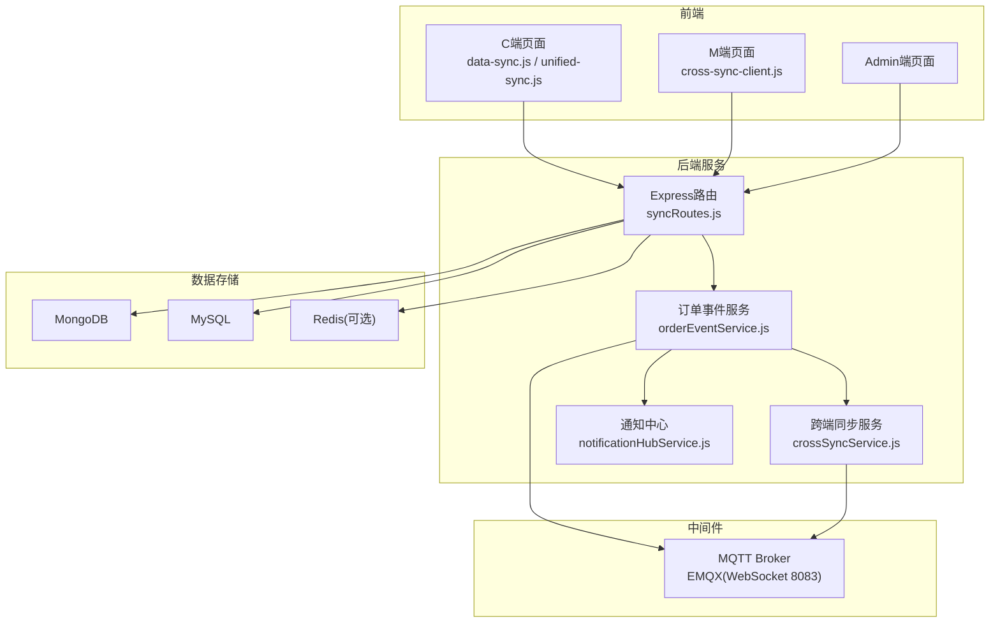
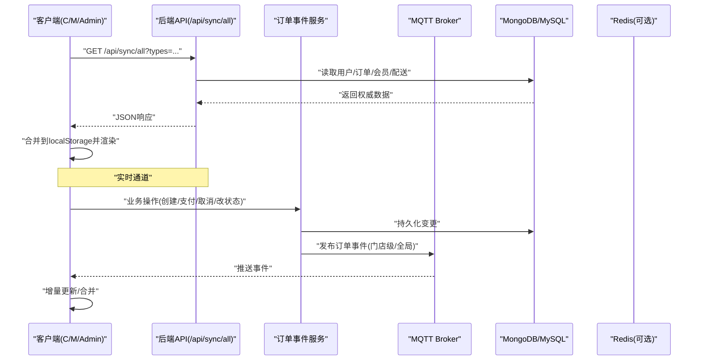
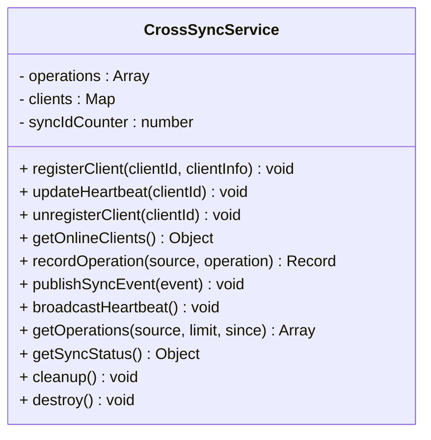
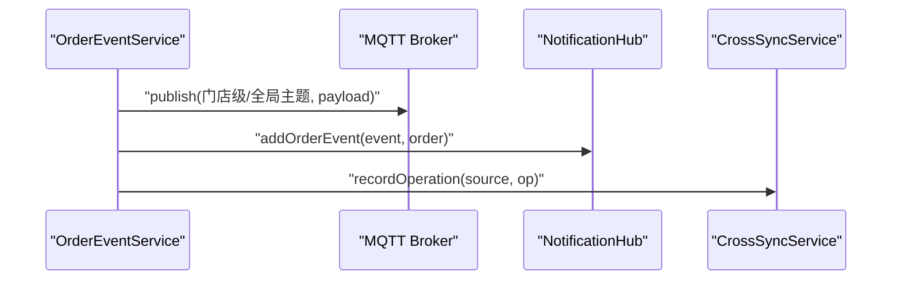
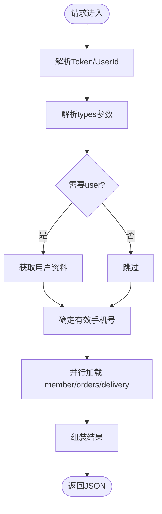
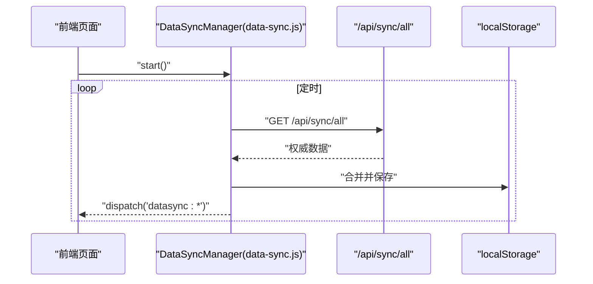
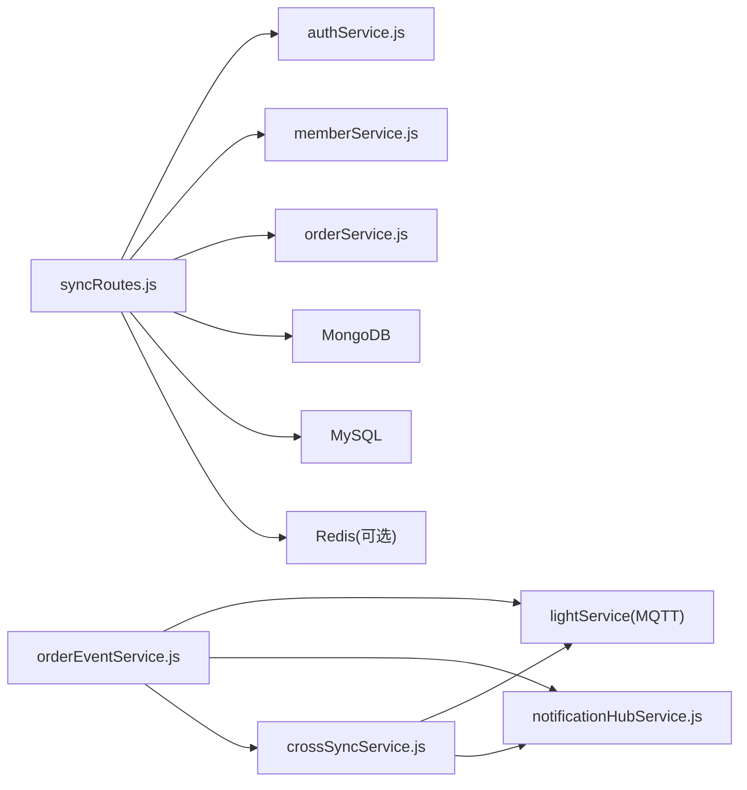

# 数据一致性保证

<cite>
**本文引用的文件**   
- [backend/services/crossSyncService.js](file://backend/services/crossSyncService.js)
- [backend/services/orderEventService.js](file://backend/services/orderEventService.js)
- [backend/modules/common/routes/syncRoutes.js](file://backend/modules/common/routes/syncRoutes.js)
- [js/cross-sync-client.js](file://js/cross-sync-client.js)
- [js/data-sync.js](file://js/data-sync.js)
- [js/unified-sync.js](file://js/unified-sync.js)
- [backend/config/database.js](file://backend/config/database.js)
- [backend/config/index.js](file://backend/config/index.js)
- [backend/scripts/initDatabase.js](file://backend/scripts/initDatabase.js)
- [backend/services/notificationHubService.js](file://backend/services/notificationHubService.js)
- [DATA-SYNC-GUIDE.md](file://DATA-SYNC-GUIDE.md)
</cite>

## 目录
1. [引言](#引言)
2. [项目结构](#项目结构)
3. [核心组件](#核心组件)
4. [架构总览](#架构总览)
5. [详细组件分析](#详细组件分析)
6. [依赖关系分析](#依赖关系分析)
7. [性能与一致性权衡](#性能与一致性权衡)
8. [故障排查指南](#故障排查指南)
9. [结论](#结论)
10. [附录：最佳实践与模式](#附录：最佳实践与模式)

## 引言
本文件面向干洗店管理系统的分布式数据一致性保障，聚焦以下目标：
- 跨数据库（MongoDB/MySQL）的一致性策略与同步机制
- 分布式事务处理方案：最终一致性与冲突解决
- 实时数据同步服务设计与实现：MQTT消息驱动的数据更新
- 数据冲突检测与自动修复：版本号控制与乐观锁思路
- 缓存一致性：Redis缓存与数据库的同步策略
- 一致性监控与告警机制
- 为开发者提供可落地的设计模式与最佳实践

## 项目结构
系统采用“后端服务 + 前端多端（C/M/Admin）+ MQTT Broker”的分层架构。关键路径包括：
- 统一数据拉取接口：/api/sync/all（权威数据源）
- 订单事件发布：通过MQTT广播到门店级与全局主题
- 跨端操作广播：用于Admin与M端之间的操作同步
- 通知中心：集中记录业务事件，供Admin轮询或订阅
- 前端同步客户端：定时拉取、去重、合并本地存储

图表来源
- [backend/modules/common/routes/syncRoutes.js:1-190](file://backend/modules/common/routes/syncRoutes.js#L1-L190)
- [backend/services/orderEventService.js:1-168](file://backend/services/orderEventService.js#L1-L168)
- [backend/services/crossSyncService.js:1-336](file://backend/services/crossSyncService.js#L1-L336)
- [backend/services/notificationHubService.js:1-264](file://backend/services/notificationHubService.js#L1-L264)
- [js/data-sync.js:1-348](file://js/data-sync.js#L1-L348)
- [js/unified-sync.js:1-420](file://js/unified-sync.js#L1-L420)
- [js/cross-sync-client.js:1-399](file://js/cross-sync-client.js#L1-L399)

章节来源
- [backend/modules/common/routes/syncRoutes.js:1-190](file://backend/modules/common/routes/syncRoutes.js#L1-L190)
- [backend/services/orderEventService.js:1-168](file://backend/services/orderEventService.js#L1-L168)
- [backend/services/crossSyncService.js:1-336](file://backend/services/crossSyncService.js#L1-L336)
- [backend/services/notificationHubService.js:1-264](file://backend/services/notificationHubService.js#L1-L264)
- [js/data-sync.js:1-348](file://js/data-sync.js#L1-L348)
- [js/unified-sync.js:1-420](file://js/unified-sync.js#L1-L420)
- [js/cross-sync-client.js:1-399](file://js/cross-sync-client.js#L1-L399)

## 核心组件
- 统一数据同步路由（/api/sync/all）
  - 作为唯一权威数据源，聚合用户资料、会员、订单、配送信息，返回给前端进行合并与展示
- 订单事件服务（OrderEventService）
  - 将订单状态变更事件通过MQTT广播至门店级与全局主题，并写入通知中心与跨端同步记录
- 跨端同步服务（CrossSyncService）
  - 记录跨端操作、维护在线客户端、广播心跳、过滤本地回显，确保Admin与M端操作可见性
- 通知中心（NotificationHubService）
  - 汇聚订单、灯条等事件，支持按门店/全局查询与过期清理
- 前端同步客户端
  - data-sync.js：统一拉取权威数据，合并到localStorage，触发UI更新
  - cross-sync-client.js：连接MQTT，订阅操作与心跳，实现跨端实时联动
  - unified-sync.js：统一多端（C/M/Admin）的同步入口与本地存储键隔离

章节来源
- [backend/modules/common/routes/syncRoutes.js:1-190](file://backend/modules/common/routes/syncRoutes.js#L1-L190)
- [backend/services/orderEventService.js:1-168](file://backend/services/orderEventService.js#L1-L168)
- [backend/services/crossSyncService.js:1-336](file://backend/services/crossSyncService.js#L1-L336)
- [backend/services/notificationHubService.js:1-264](file://backend/services/notificationHubService.js#L1-L264)
- [js/data-sync.js:1-348](file://js/data-sync.js#L1-L348)
- [js/cross-sync-client.js:1-399](file://js/cross-sync-client.js#L1-L399)
- [js/unified-sync.js:1-420](file://js/unified-sync.js#L1-L420)

## 架构总览
下图展示了从写端到读端的完整一致性链路：写端持久化后发布事件，MQTT推送至各端；同时提供REST权威接口供前端周期性拉取与合并。

图表来源
- [backend/modules/common/routes/syncRoutes.js:1-190](file://backend/modules/common/routes/syncRoutes.js#L1-L190)
- [backend/services/orderEventService.js:1-168](file://backend/services/orderEventService.js#L1-L168)
- [js/data-sync.js:1-348](file://js/data-sync.js#L1-L348)

## 详细组件分析

### 组件A：跨端同步服务（CrossSyncService）
职责与特性
- 记录跨端操作（source/type/action/orderId/orderNo/storeId/data），生成自增syncId
- 维护在线客户端Map，定期广播心跳，清理离线与过期记录
- 通过MQTT广播操作事件，并写入通知中心
- 提供操作历史与同步状态摘要

图表来源
- [backend/services/crossSyncService.js:1-336](file://backend/services/crossSyncService.js#L1-L336)

章节来源
- [backend/services/crossSyncService.js:1-336](file://backend/services/crossSyncService.js#L1-L336)

### 组件B：订单事件服务（OrderEventService）
职责与特性
- 将订单事件以结构化payload发布到MQTT（门店级与全局主题）
- 同步写入通知中心，便于Admin端轮询
- 记录跨端操作，关联来源标识（_source）

图表来源
- [backend/services/orderEventService.js:1-168](file://backend/services/orderEventService.js#L1-L168)
- [backend/services/notificationHubService.js:1-264](file://backend/services/notificationHubService.js#L1-L264)
- [backend/services/crossSyncService.js:1-336](file://backend/services/crossSyncService.js#L1-L336)

章节来源
- [backend/services/orderEventService.js:1-168](file://backend/services/orderEventService.js#L1-L168)
- [backend/services/notificationHubService.js:1-264](file://backend/services/notificationHubService.js#L1-L264)
- [backend/services/crossSyncService.js:1-336](file://backend/services/crossSyncService.js#L1-L336)

### 组件C：统一数据同步路由（/api/sync/all）
职责与特性
- 解析认证与用户身份，支持openid与ObjectId
- 并行加载会员、订单、配送信息，返回统一视图
- 使用手机号做跨平台匹配，增强多端一致性体验

图表来源
- [backend/modules/common/routes/syncRoutes.js:1-190](file://backend/modules/common/routes/syncRoutes.js#L1-L190)

章节来源
- [backend/modules/common/routes/syncRoutes.js:1-190](file://backend/modules/common/routes/syncRoutes.js#L1-L190)

### 组件D：前端同步客户端
- data-sync.js
  - 定时调用/api/sync/all，合并用户、会员、订单、配送到localStorage，触发自定义事件更新UI
- cross-sync-client.js
  - 注册/心跳/注销，订阅MQTT操作与心跳主题，过滤本地回显，上报对端操作回调
- unified-sync.js
  - 统一C/M/Admin三端同步入口，按端类型隔离本地存储键，支持手动/可见性变化触发同步

图表来源
- [js/data-sync.js:1-348](file://js/data-sync.js#L1-L348)
- [js/unified-sync.js:1-420](file://js/unified-sync.js#L1-L420)
- [js/cross-sync-client.js:1-399](file://js/cross-sync-client.js#L1-L399)

章节来源
- [js/data-sync.js:1-348](file://js/data-sync.js#L1-L348)
- [js/unified-sync.js:1-420](file://js/unified-sync.js#L1-L420)
- [js/cross-sync-client.js:1-399](file://js/cross-sync-client.js#L1-L399)

## 依赖关系分析
- 后端模块耦合
  - OrderEventService 依赖 lightService(MQTT)、notificationHubService、crossSyncService
  - CrossSyncService 依赖 lightService(MQTT)、notificationHubService
  - syncRoutes 依赖 authService、memberService、orderService、mongoose
- 外部依赖
  - MongoDB/MySQL 连接由 config/index.js 管理，database.js 提供配置
  - Redis 配置在 database.js 中预留（当前未直接集成到同步流程）

图表来源
- [backend/services/orderEventService.js:1-168](file://backend/services/orderEventService.js#L1-L168)
- [backend/services/crossSyncService.js:1-336](file://backend/services/crossSyncService.js#L1-L336)
- [backend/modules/common/routes/syncRoutes.js:1-190](file://backend/modules/common/routes/syncRoutes.js#L1-L190)
- [backend/config/index.js:1-167](file://backend/config/index.js#L1-L167)
- [backend/config/database.js:1-65](file://backend/config/database.js#L1-L65)

章节来源
- [backend/services/orderEventService.js:1-168](file://backend/services/orderEventService.js#L1-L168)
- [backend/services/crossSyncService.js:1-336](file://backend/services/crossSyncService.js#L1-L336)
- [backend/modules/common/routes/syncRoutes.js:1-190](file://backend/modules/common/routes/syncRoutes.js#L1-L190)
- [backend/config/index.js:1-167](file://backend/config/index.js#L1-L167)
- [backend/config/database.js:1-65](file://backend/config/database.js#L1-L65)

## 性能与一致性权衡
- 最终一致性优先
  - 写路径：先落库再发MQTT事件，允许短暂不一致，但具备幂等与去重能力（syncId、clientId过滤）
  - 读路径：/api/sync/all 作为权威源，前端定时拉取并合并，避免强一致带来的高延迟
- 并发与吞吐
  - 并行加载会员/订单/配送，减少RTT
  - MQTT QoS=1，降低丢包风险
- 资源占用
  - 操作记录与通知中心设置上限与TTL，防止内存膨胀
  - 前端定时器间隔可调，平衡实时性与网络开销

[本节为通用指导，不直接分析具体文件]

## 故障排查指南
- 常见问题定位
  - 无法连接MQTT：检查Broker端口与WebSocket地址，确认用户名密码
  - 事件未到达：查看后端日志是否成功发布，前端是否订阅对应主题
  - 数据不同步：核对/api/sync/all返回与localStorage合并逻辑
- 快速验证步骤
  - 启动后端与MQTT，访问/api/sync/all，观察返回字段
  - 打开浏览器控制台，查看跨端同步与订单事件日志
  - 使用诊断工具对比本地与服务器订单数量差异

章节来源
- [DATA-SYNC-GUIDE.md:1-251](file://DATA-SYNC-GUIDE.md#L1-L251)

## 结论
本系统通过“权威接口 + MQTT事件 + 前端合并”的组合，实现了跨端与跨库的最终一致性。跨端操作广播与通知中心增强了可观测性与协同效率。未来可在冲突检测、版本控制与缓存一致性方面进一步增强，以满足更高一致性与可用性要求。

[本节为总结性内容，不直接分析具体文件]

## 附录：最佳实践与模式

### 跨数据库一致性策略（MongoDB与MySQL）
- 读写分离与权威源
  - 以/api/sync/all为权威数据源，聚合多库数据，前端仅消费该视图
- 事件溯源与幂等
  - 所有写操作产生事件，消费者基于事件幂等处理（如syncId、orderId）
- 索引与查询优化
  - 为高频查询字段建立索引，提升聚合与过滤性能

章节来源
- [backend/modules/common/routes/syncRoutes.js:1-190](file://backend/modules/common/routes/syncRoutes.js#L1-L190)
- [backend/scripts/initDatabase.js:49-96](file://backend/scripts/initDatabase.js#L49-L96)

### 分布式事务与最终一致性
- 单库事务
  - MySQL侧提供transaction封装，确保单库内原子性
- 跨库最终一致
  - 写库成功后发布事件，消费者异步应用；失败重试与死信队列可扩展

章节来源
- [backend/config/index.js:137-155](file://backend/config/index.js#L137-L155)

### 冲突检测与自动修复
- 版本号控制（建议）
  - 在订单模型引入version字段，更新时比较版本号，拒绝旧覆盖新
- 乐观锁（建议）
  - 更新条件包含version，失败则提示刷新并重试
- 前端状态守卫
  - 参考现有“状态进阶守卫”，禁止低阶状态覆盖高阶状态

章节来源
- [c-order-detail.html:2946-2970](file://c-order-detail.html#L2946-L2970)

### 缓存一致性（Redis）
- 缓存策略（建议）
  - 读多写少数据（如门店配置、类目）使用Redis缓存，设置合理TTL
  - 写路径：先更新数据库，再删除或更新缓存（Cache-Aside）
- 失效与回源
  - 缓存缺失时回源数据库，回填缓存；异常时降级直连数据库

章节来源
- [backend/config/database.js:50-63](file://backend/config/database.js#L50-L63)

### 实时监控与告警
- 指标采集
  - 收集MQTT连接数、消息吞吐、API成功率、同步延迟
- 告警规则
  - 连接断开、事件积压、API错误率超阈、同步超时
- 可视化
  - 利用MQTT控制台与后端日志，结合前端状态指示器

章节来源
- [backend/services/MQTT_DEPLOYMENT.md:92-396](file://backend/services/MQTT_DEPLOYMENT.md#L92-L396)
- [backend/test-emqx.bat:1-27](file://backend/test-emqx.bat#L1-L27)

### 开发与设计模式清单
- 事件驱动架构（EDA）
  - 写端发布事件，读端订阅处理，解耦且可扩展
- 权威数据源模式
  - 单一接口聚合多源，前端只信任权威视图
- 去重与幂等
  - 使用syncId/clientId/orderId去重，避免重复处理
- 前后台双通道
  - MQTT实时 + REST兜底轮询，提高鲁棒性

[本节为通用指导，不直接分析具体文件]