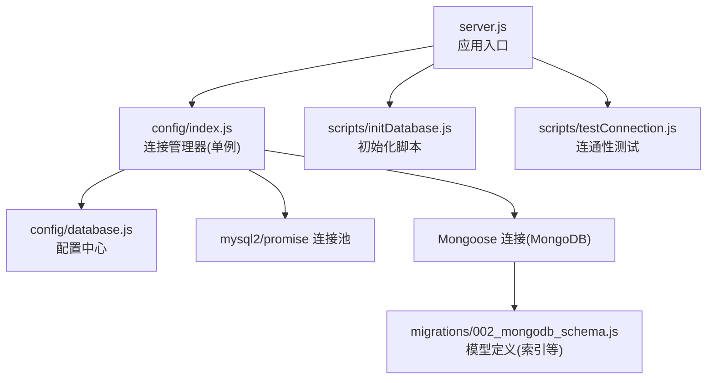
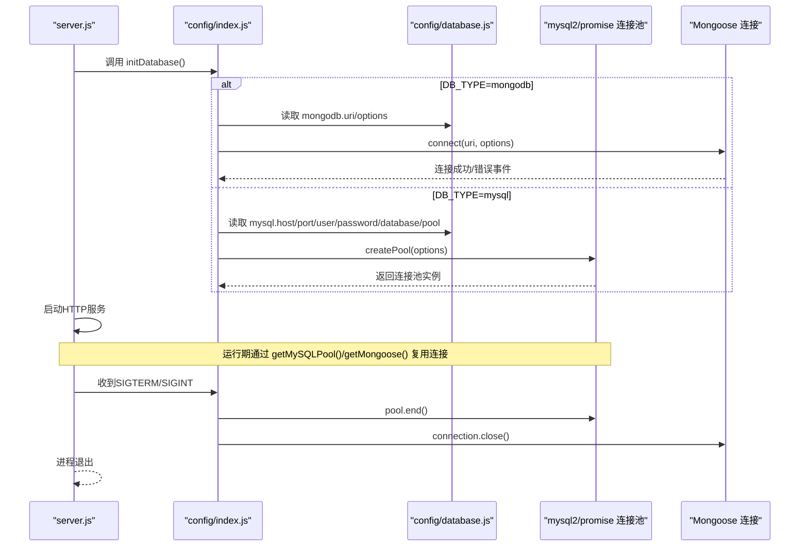
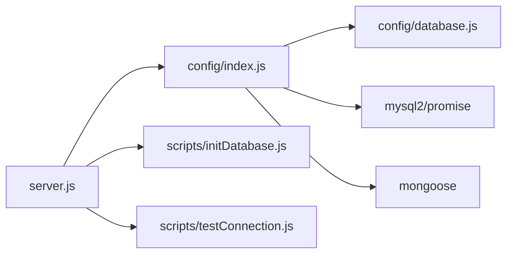

# 数据库连接管理

<cite>
**本文引用的文件**
- [backend/config/database.js](file://backend/config/database.js)
- [backend/config/index.js](file://backend/config/index.js)
- [backend/server.js](file://backend/server.js)
- [backend/scripts/initDatabase.js](file://backend/scripts/initDatabase.js)
- [backend/scripts/testConnection.js](file://backend/scripts/testConnection.js)
- [backend/migrations/002_mongodb_schema.js](file://backend/migrations/002_mongodb_schema.js)
</cite>

## 目录
1. [简介](#简介)
2. [项目结构](#项目结构)
3. [核心组件](#核心组件)
4. [架构总览](#架构总览)
5. [详细组件分析](#详细组件分析)
6. [依赖关系分析](#依赖关系分析)
7. [性能与优化建议](#性能与优化建议)
8. [故障排查指南](#故障排查指南)
9. [结论](#结论)

## 简介
本文件面向运维与后端工程师，系统化说明干洗店管理系统的数据库连接管理方案。内容覆盖：
- MySQL 与 MongoDB 的连接池配置（连接数、超时、健康检查）
- 连接生命周期管理（建立、复用、释放、故障恢复）
- 多数据库连接的协调机制（状态监控、负载均衡、故障转移）
- 连接池优化与环境差异调优
- 异常处理、重试与降级策略
- 监控指标与排障指引

## 项目结构
系统采用单例式数据库连接管理模块，统一在应用启动时初始化，并在优雅关闭时释放资源。MySQL 使用 mysql2/promise 连接池；MongoDB 使用 Mongoose 连接。

图示来源
- [backend/server.js:1-702](file://backend/server.js#L1-L702)
- [backend/config/index.js:1-167](file://backend/config/index.js#L1-L167)
- [backend/config/database.js:1-65](file://backend/config/database.js#L1-L65)
- [backend/scripts/initDatabase.js:1-148](file://backend/scripts/initDatabase.js#L1-L148)
- [backend/scripts/testConnection.js:1-88](file://backend/scripts/testConnection.js#L1-L88)
- [backend/migrations/002_mongodb_schema.js:1-607](file://backend/migrations/002_mongodb_schema.js#L1-L607)

章节来源
- [backend/server.js:1-702](file://backend/server.js#L1-L702)
- [backend/config/index.js:1-167](file://backend/config/index.js#L1-L167)
- [backend/config/database.js:1-65](file://backend/config/database.js#L1-L65)

## 核心组件
- 配置中心：集中维护 MySQL/MongoDB 连接参数、连接池大小、超时与健康检查相关选项。
- 连接管理器：提供 initDatabase/getMySQLPool/getMongoose/closeDatabase 等接口，封装连接生命周期。
- 应用入口：在进程启动时调用初始化，在退出信号时执行优雅关闭。
- 辅助脚本：用于初始化数据结构和连通性验证。

章节来源
- [backend/config/database.js:1-65](file://backend/config/database.js#L1-L65)
- [backend/config/index.js:1-167](file://backend/config/index.js#L1-L167)
- [backend/server.js:1-702](file://backend/server.js#L1-L702)

## 架构总览
下图展示从应用启动到数据库连接建立、请求期复用、以及进程退出的完整流程。

图示来源
- [backend/server.js:615-696](file://backend/server.js#L615-L696)
- [backend/config/index.js:19-88](file://backend/config/index.js#L19-L88)
- [backend/config/database.js:10-48](file://backend/config/database.js#L10-L48)

## 详细组件分析

### 配置中心（database.js）
- 支持通过环境变量切换数据库类型（DB_TYPE）。
- MySQL 连接池关键参数：
  - min/max：最小/最大连接数
  - acquireTimeout：获取连接超时
  - idleTimeout：空闲连接回收间隔
  - ssl/timezone/logging：可选开关与时区设置
- MongoDB 连接关键参数：
  - uri：连接字符串
  - maxPoolSize：驱动级连接池上限
  - serverSelectionTimeoutMS/socketTimeoutMS：选择服务器与套接字超时

章节来源
- [backend/config/database.js:1-65](file://backend/config/database.js#L1-L65)

### 连接管理器（index.js）
- 单例模式：全局仅维护一个 MySQL 连接池和一个 Mongoose 连接对象。
- 初始化逻辑：
  - initDatabase 根据配置选择 MongoDB 或 MySQL 初始化路径。
  - initMongoDB：建立连接并注册 error/disconnected 事件监听。
  - initMySQL：创建连接池并进行一次“握手”测试，成功后返回池实例。
- 访问器：
  - getMySQLPool：未初始化抛错，避免误用。
  - getMongoose：返回全局 mongoose 引用。
- 事务与便捷查询：
  - transaction：基于连接池获取连接，开启/提交/回滚事务，finally 中确保 release。
  - query：从池中取连接执行 SQL。
- 关闭流程：
  - closeDatabase：先结束 MySQL 连接池，再关闭 Mongoose 连接，保证有序释放。

章节来源
- [backend/config/index.js:1-167](file://backend/config/index.js#L1-L167)

### 应用入口（server.js）
- 启动阶段：
  - 加载 .env 环境变量。
  - 调用 initDatabase 完成数据库初始化。
  - 启动 HTTP 服务，打印当前数据库类型与已启用模块信息。
- 优雅关闭：
  - 监听 SIGTERM/SIGINT，先关闭 HTTP 服务，再调用 closeDatabase 释放数据库资源。
- 健壮性：
  - 捕获端口占用等错误，防止进程崩溃。
  - 全局 uncaughtException/unhandledRejection 处理器记录日志并尽量保持服务可用。

章节来源
- [backend/server.js:1-702](file://backend/server.js#L1-L702)

### 初始化与测试脚本
- initDatabase.js：
  - 根据 DB_TYPE 分别初始化 MongoDB 集合/索引或执行 MySQL 迁移脚本。
  - 完成后调用 closeDatabase 释放连接。
- testConnection.js：
  - 初始化连接后，对 MongoDB 执行版本/集合/写入测试，对 MySQL 执行版本/库名/临时表读写测试。
  - 失败输出常见排障提示。

章节来源
- [backend/scripts/initDatabase.js:1-148](file://backend/scripts/initDatabase.js#L1-L148)
- [backend/scripts/testConnection.js:1-88](file://backend/scripts/testConnection.js#L1-L88)

### MongoDB 模型与索引（002_mongodb_schema.js）
- 定义用户、门店、物品、订单、配送单、消息模板、信用记录等模型。
- 为常用查询字段添加索引，提升查询性能。
- 该文件不直接参与连接管理，但影响连接层性能与稳定性（如慢查询导致的连接占用时间增加）。

章节来源
- [backend/migrations/002_mongodb_schema.js:1-607](file://backend/migrations/002_mongodb_schema.js#L1-L607)

## 依赖关系分析
- server.js 依赖 config/index.js 进行数据库初始化与关闭。
- config/index.js 依赖 config/database.js 提供的配置项。
- 运行时通过 mysql2/promise 与 Mongoose 与底层数据库交互。
- 初始化与测试脚本复用同一连接管理器，保证行为一致。

图示来源
- [backend/server.js:1-702](file://backend/server.js#L1-L702)
- [backend/config/index.js:1-167](file://backend/config/index.js#L1-L167)
- [backend/config/database.js:1-65](file://backend/config/database.js#L1-L65)

## 性能与优化建议

### 连接池参数调优
- MySQL（mysql2/promise）
  - connectionLimit：建议按并发量与数据库承载能力评估，通常 10~50 起步，结合 CPU/IO 压测确定上限。
  - waitForConnections：保持为 true，避免无界排队导致 OOM。
  - queueLimit：默认 0 表示无限制，生产环境建议设置为合理阈值，超过则快速失败，保护系统。
  - idleTimeout/acquireTimeout：根据业务 RTT 与峰值 QPS 调整，避免连接饥饿或过早回收。
  - timezone：统一 +08:00，避免跨时区问题。
- MongoDB（Mongoose）
  - maxPoolSize：与 MySQL 类似，需结合文档读写比例与副本集节点数设定。
  - serverSelectionTimeoutMS/socketTimeoutMS：网络不稳定或跨机房部署时需适当增大，避免误判超时。
  - useNewUrlParser/useUnifiedTopology：保持启用以获得更稳定的拓扑感知与连接管理。

### 健康检查与可用性探测
- 启动时进行一次“握手”测试（MySQL 已实现），可参考此模式为 MongoDB 增加轻量 ping 操作，作为就绪探针。
- 对外暴露 /api/health 端点可用于容器编排的存活探针；建议在探针中增加数据库连通性检测（例如执行 SELECT 1 或 db.runCommand({ping:1})）。

### 连接复用与事务
- 所有 MySQL 写操作建议使用 transaction 封装，确保连接在事务内复用，减少上下文切换开销。
- 长事务会占用连接，应控制事务范围与耗时，避免连接池耗尽。

### 多数据库协调与故障转移
- 当前实现为“二选一”模式（DB_TYPE 决定主存储），不支持同时读写双写。
- 若未来需要多活/主备：
  - 可在连接管理器中引入“主/备”连接源，配合健康检查与自动切换。
  - 在路由层按读/写分离，读走只读副本，写走主库。
  - 增加熔断与降级：当主库不可用时，将写请求降级为本地队列或缓存，待恢复后重试。

### 监控指标建议
- 连接池：活跃连接数、等待队列长度、获取连接平均耗时、连接泄漏告警。
- 数据库侧：QPS、延迟分布、锁等待、慢查询数量、复制延迟（MongoDB 为选举/同步延迟）。
- 应用侧：数据库错误率、重试次数、超时次数、事务回滚率。

[本节为通用指导，无需代码来源]

## 故障排查指南

### 常见问题定位
- 无法连接
  - 检查环境变量（DB_TYPE、MYSQL_*、MONGODB_URI）是否正确。
  - 确认数据库服务是否启动且网络可达。
  - 使用 scripts/testConnection.js 进行连通性自检。
- 连接池耗尽
  - 观察是否有长事务或未释放连接（query/transaction 必须正确释放）。
  - 适当提高 connectionLimit/maxPoolSize，并排查慢查询。
- 频繁断开重连（MongoDB）
  - 关注 disconnected 事件日志，检查网络抖动或副本集状态。
  - 调整 socketTimeoutMS/serverSelectionTimeoutMS。

### 诊断步骤
- 启动阶段
  - 查看控制台输出中的连接日志，确认初始化是否成功。
- 运行阶段
  - 通过 /api/health 判断服务存活；可扩展为包含数据库健康检查。
  - 抓取数据库侧慢查询与锁等待信息，关联应用日志定位热点接口。
- 关闭阶段
  - 确认 SIGTERM/SIGINT 触发后，closeDatabase 是否被调用，避免连接残留。

章节来源
- [backend/scripts/testConnection.js:1-88](file://backend/scripts/testConnection.js#L1-L88)
- [backend/server.js:88-90](file://backend/server.js#L88-L90)
- [backend/server.js:667-677](file://backend/server.js#L667-L677)
- [backend/config/index.js:110-126](file://backend/config/index.js#L110-L126)

## 结论
本系统通过统一的连接管理器实现了 MySQL 与 MongoDB 的可插拔接入，具备明确的连接生命周期管理与优雅关闭能力。当前为“二选一”的主存储模式，满足单机或简单部署场景。生产环境建议完善健康检查、连接池监控与限流熔断策略，并为未来的多库协同与高可用预留扩展点。