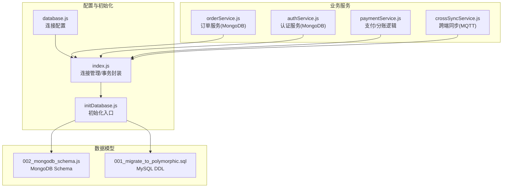
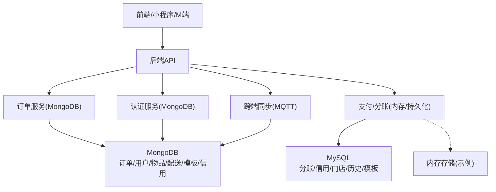
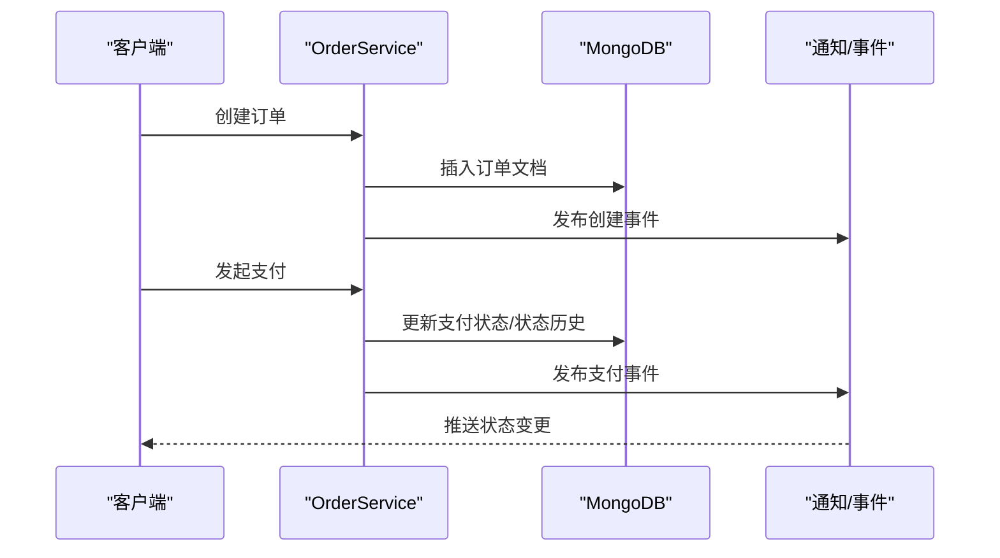
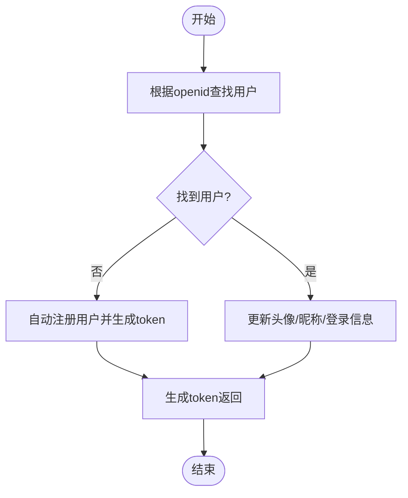
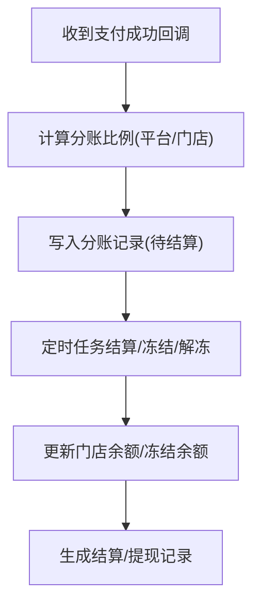
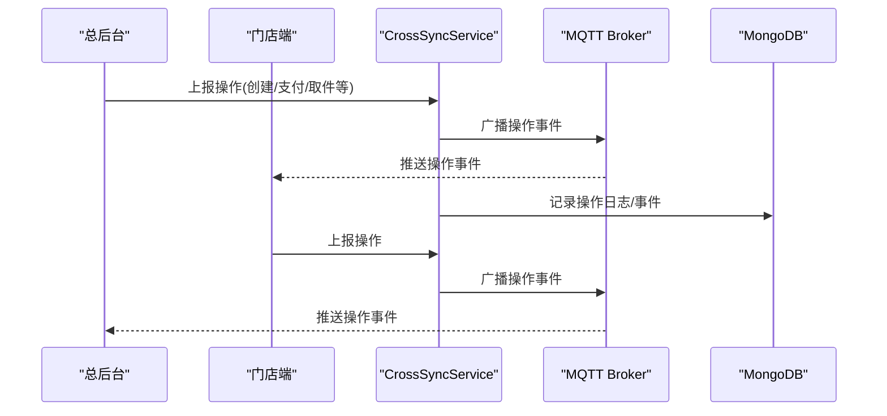
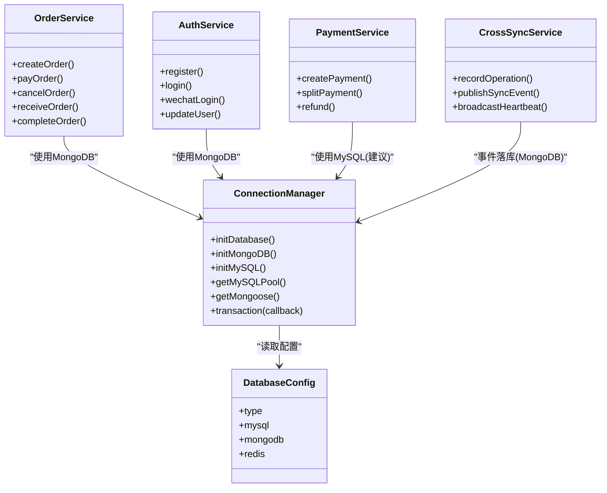

# 数据库选型策略

<cite>
**本文引用的文件列表**
- [backend/config/database.js](file://backend/config/database.js)
- [backend/config/index.js](file://backend/config/index.js)
- [backend/migrations/001_migrate_to_polymorphic.sql](file://backend/migrations/001_migrate_to_polymorphic.sql)
- [backend/migrations/002_mongodb_schema.js](file://backend/migrations/002_mongodb_schema.js)
- [backend/scripts/initDatabase.js](file://backend/scripts/initDatabase.js)
- [backend/modules/cleaning/services/orderService.js](file://backend/modules/cleaning/services/orderService.js)
- [backend/modules/common/services/authService.js](file://backend/modules/common/services/authService.js)
- [backend/modules/common/services/paymentService.js](file://backend/modules/common/services/paymentService.js)
- [backend/services/crossSyncService.js](file://backend/services/crossSyncService.js)
- [api/payment-server/settlement.js](file://api/payment-server/settlement.js)
</cite>

## 目录
1. [引言](#引言)
2. [项目结构](#项目结构)
3. [核心组件](#核心组件)
4. [架构总览](#架构总览)
5. [详细组件分析](#详细组件分析)
6. [依赖关系分析](#依赖关系分析)
7. [性能与扩展性考量](#性能与扩展性考量)
8. [故障排查指南](#故障排查指南)
9. [结论](#结论)
10. [附录：数据划分与最佳实践](#附录数据划分与最佳实践)

## 引言
本文件面向干洗店管理系统的数据库选型，给出“MongoDB + MySQL”双库架构的决策依据、适用场景、数据划分原则、技术对比与最佳实践。系统已具备两套数据模型与连接管理：MongoDB用于订单、用户会话、实时事件等文档型数据；MySQL用于门店配置、分账记录、信用与状态历史等强一致要求的数据。通过该策略，开发者可在业务演进中明确选择合适的数据存储，兼顾性能、一致性、可维护性与成本。

## 项目结构
仓库采用模块化后端组织，数据库相关能力集中在配置层、迁移脚本与服务层：
- 配置层：统一暴露数据库类型切换、连接池与选项
- 迁移层：MySQL DDL与MongoDB Schema定义并存
- 服务层：订单、认证、支付、跨端同步等服务分别对接不同数据库

图表来源
- [backend/config/database.js:1-65](file://backend/config/database.js#L1-L65)
- [backend/config/index.js:1-166](file://backend/config/index.js#L1-L166)
- [backend/migrations/002_mongodb_schema.js:1-607](file://backend/migrations/002_mongodb_schema.js#L1-L607)
- [backend/migrations/001_migrate_to_polymorphic.sql:1-310](file://backend/migrations/001_migrate_to_polymorphic.sql#L1-L310)
- [backend/scripts/initDatabase.js:1-148](file://backend/scripts/initDatabase.js#L1-L148)

章节来源
- [backend/config/database.js:1-65](file://backend/config/database.js#L1-L65)
- [backend/config/index.js:1-166](file://backend/config/index.js#L1-L166)
- [backend/migrations/002_mongodb_schema.js:1-607](file://backend/migrations/002_mongodb_schema.js#L1-L607)
- [backend/migrations/001_migrate_to_polymorphic.sql:1-310](file://backend/migrations/001_migrate_to_polymorphic.sql#L1-L310)
- [backend/scripts/initDatabase.js:1-148](file://backend/scripts/initDatabase.js#L1-L148)

## 核心组件
- 数据库配置与连接管理
  - 支持按环境变量切换 DB_TYPE（mongodb/mysql）
  - 提供 MySQL 连接池与 MongoDB 单例连接
  - 封装 MySQL 事务 API，便于财务类操作
- 数据模型
  - MongoDB：用户、门店、物品、订单、配送单、消息模板、信用记录等集合
  - MySQL：多态字段改造、订单/物品/用户历史表、分账记录、门店、配送单、消息模板等
- 业务服务
  - 订单服务：基于 MongoDB 的创建、查询、支付、取消、收件、处理、完成等流程
  - 认证服务：基于 MongoDB 的用户注册、登录、微信登录、角色与地址管理
  - 支付服务：统一支付接口与分账计算（平台/门店/品牌/用户）
  - 跨端同步：MQTT 驱动的操作广播与在线客户端追踪

章节来源
- [backend/config/index.js:1-166](file://backend/config/index.js#L1-L166)
- [backend/migrations/002_mongodb_schema.js:1-607](file://backend/migrations/002_mongodb_schema.js#L1-L607)
- [backend/migrations/001_migrate_to_polymorphic.sql:1-310](file://backend/migrations/001_migrate_to_polymorphic.sql#L1-L310)
- [backend/modules/cleaning/services/orderService.js:1-800](file://backend/modules/cleaning/services/orderService.js#L1-L800)
- [backend/modules/common/services/authService.js:1-498](file://backend/modules/common/services/authService.js#L1-L498)
- [backend/modules/common/services/paymentService.js:1-185](file://backend/modules/common/services/paymentService.js#L1-L185)
- [backend/services/crossSyncService.js:1-336](file://backend/services/crossSyncService.js#L1-L336)

## 架构总览
双库架构的核心思想是“按数据特性与一致性需求拆分”：
- MongoDB：高吞吐写入、灵活模式、复杂嵌套文档、实时事件流
- MySQL：强一致事务、结构化报表、资金分账、审计与合规

图表来源
- [backend/modules/cleaning/services/orderService.js:1-800](file://backend/modules/cleaning/services/orderService.js#L1-L800)
- [backend/modules/common/services/authService.js:1-498](file://backend/modules/common/services/authService.js#L1-L498)
- [backend/modules/common/services/paymentService.js:1-185](file://backend/modules/common/services/paymentService.js#L1-L185)
- [backend/services/crossSyncService.js:1-336](file://backend/services/crossSyncService.js#L1-L336)
- [backend/migrations/002_mongodb_schema.js:1-607](file://backend/migrations/002_mongodb_schema.js#L1-L607)
- [backend/migrations/001_migrate_to_polymorphic.sql:1-310](file://backend/migrations/001_migrate_to_polymorphic.sql#L1-L310)

## 详细组件分析

### 订单与用户会话（MongoDB）
- 设计要点
  - 订单为文档型聚合根，内嵌物品、金额明细、配送、支付、状态历史等，减少跨集合关联
  - 用户与会话信息以文档形式存储，支持多角色、会员、信用、资产等灵活扩展
  - 索引覆盖高频查询：userId、storeId、orderType/status、createdAt 等
- 关键流程（下单到支付）

图表来源
- [backend/modules/cleaning/services/orderService.js:1-800](file://backend/modules/cleaning/services/orderService.js#L1-L800)
- [backend/migrations/002_mongodb_schema.js:1-607](file://backend/migrations/002_mongodb_schema.js#L1-L607)

章节来源
- [backend/modules/cleaning/services/orderService.js:1-800](file://backend/modules/cleaning/services/orderService.js#L1-L800)
- [backend/migrations/002_mongodb_schema.js:1-607](file://backend/migrations/002_mongodb_schema.js#L1-L607)

### 认证与会话（MongoDB）
- 设计要点
  - 用户文档包含角色、地址、会员、信用等，适合快速迭代与多端身份合并
  - 支持微信 openid 绑定与手机号合并策略，提升跨平台体验
- 典型流程（微信登录）

图表来源
- [backend/modules/common/services/authService.js:1-498](file://backend/modules/common/services/authService.js#L1-L498)

章节来源
- [backend/modules/common/services/authService.js:1-498](file://backend/modules/common/services/authService.js#L1-L498)

### 支付与分账（MySQL 为主，示例使用内存）
- 设计要点
  - 分账记录、信用流水、门店结算等需要强一致与可审计，适合 MySQL
  - 当前示例实现使用内存 Map 存储，生产应落库至 MySQL 并使用事务保证原子性
- 分账流程（干洗）

图表来源
- [backend/modules/common/services/paymentService.js:1-185](file://backend/modules/common/services/paymentService.js#L1-L185)
- [api/payment-server/settlement.js:331-388](file://api/payment-server/settlement.js#L331-L388)
- [backend/migrations/001_migrate_to_polymorphic.sql:185-229](file://backend/migrations/001_migrate_to_polymorphic.sql#L185-L229)

章节来源
- [backend/modules/common/services/paymentService.js:1-185](file://backend/modules/common/services/paymentService.js#L1-L185)
- [api/payment-server/settlement.js:331-388](file://api/payment-server/settlement.js#L331-L388)
- [backend/migrations/001_migrate_to_polymorphic.sql:185-229](file://backend/migrations/001_migrate_to_polymorphic.sql#L185-L229)

### 跨端同步与实时数据（MQTT + MongoDB）
- 设计要点
  - 通过 MQTT 广播操作事件，结合 MongoDB 的事件/日志集合，支撑实时看板与联动
  - 服务端维护在线客户端心跳，避免本地回显，保障多端一致性
- 关键交互

图表来源
- [backend/services/crossSyncService.js:1-336](file://backend/services/crossSyncService.js#L1-L336)

章节来源
- [backend/services/crossSyncService.js:1-336](file://backend/services/crossSyncService.js#L1-L336)

## 依赖关系分析
- 配置层
  - database.js 提供 MySQL/MongoDB 连接参数与 Redis 缓存 TTL
  - index.js 负责连接生命周期管理与事务封装
- 模型层
  - 002_mongodb_schema.js 定义用户、门店、物品、订单、配送单、消息模板、信用等集合
  - 001_migrate_to_polymorphic.sql 定义 MySQL 多态字段、历史表、分账、门店、配送单、消息模板等
- 服务层
  - orderService.js 主要读写 MongoDB
  - authService.js 主要读写 MongoDB
  - paymentService.js 计算分账，示例落库在内存，建议迁移至 MySQL 并配合事务
  - crossSyncService.js 通过 MQTT 广播，事件落库到 MongoDB

图表来源
- [backend/config/database.js:1-65](file://backend/config/database.js#L1-L65)
- [backend/config/index.js:1-166](file://backend/config/index.js#L1-L166)
- [backend/modules/cleaning/services/orderService.js:1-800](file://backend/modules/cleaning/services/orderService.js#L1-L800)
- [backend/modules/common/services/authService.js:1-498](file://backend/modules/common/services/authService.js#L1-L498)
- [backend/modules/common/services/paymentService.js:1-185](file://backend/modules/common/services/paymentService.js#L1-L185)
- [backend/services/crossSyncService.js:1-336](file://backend/services/crossSyncService.js#L1-L336)

章节来源
- [backend/config/database.js:1-65](file://backend/config/database.js#L1-L65)
- [backend/config/index.js:1-166](file://backend/config/index.js#L1-L166)
- [backend/modules/cleaning/services/orderService.js:1-800](file://backend/modules/cleaning/services/orderService.js#L1-L800)
- [backend/modules/common/services/authService.js:1-498](file://backend/modules/common/services/authService.js#L1-L498)
- [backend/modules/common/services/paymentService.js:1-185](file://backend/modules/common/services/paymentService.js#L1-L185)
- [backend/services/crossSyncService.js:1-336](file://backend/services/crossSyncService.js#L1-L336)

## 性能与扩展性考量
- 写入吞吐与模式灵活性
  - MongoDB 适合高频写入与复杂嵌套结构（订单、物品、配送、状态历史），可通过复合索引优化常见查询
  - MySQL 适合结构化报表与强一致交易（分账、信用流水、门店结算）
- 事务与一致性
  - MySQL 提供 ACID 事务，适合资金与分账链路
  - MongoDB 单文档原子写可满足大部分业务场景；跨文档一致性建议通过事件+幂等补偿
- 扩展性
  - MongoDB 水平扩展能力强，适合海量订单与实时事件
  - MySQL 可通过分库分表或读写分离满足增长需求
- 维护成本
  - 双库带来运维复杂度，但能显著降低单一数据库的适配成本
  - 通过统一的连接管理与迁移脚本，降低接入与维护成本

[本节为通用指导，不直接分析具体文件]

## 故障排查指南
- 连接问题
  - 检查环境变量 DB_TYPE、MYSQL_*、MONGODB_URI 是否正确
  - 使用测试脚本验证连通性与版本信息
- 初始化失败
  - 确认 initDatabase.js 是否执行成功，MySQL 迁移脚本是否全部执行
- 权限与索引
  - 确保 MongoDB 集合索引存在（如 userId、storeId、status、createdAt）
  - MySQL 表结构与索引是否符合迁移脚本预期
- 事务异常
  - 使用 transaction 封装包裹分账/结算逻辑，捕获异常并回滚

章节来源
- [backend/scripts/testConnection.js:1-87](file://backend/scripts/testConnection.js#L1-L87)
- [backend/scripts/initDatabase.js:1-148](file://backend/scripts/initDatabase.js#L1-L148)
- [backend/config/index.js:130-155](file://backend/config/index.js#L130-L155)

## 结论
采用“MongoDB + MySQL”的双库架构，能够充分发挥各自优势：MongoDB 承载订单、用户会话与实时事件的高吞吐与灵活模式；MySQL 承担用户信息、门店配置、财务记录等对一致性与审计有严格要求的数据。通过清晰的数据划分与统一的连接管理，系统在性能、扩展性与维护成本之间取得良好平衡。

[本节为总结，不直接分析具体文件]

## 附录：数据划分与最佳实践

### 数据划分原则
- 放入 MongoDB 的数据
  - 订单聚合根（含物品、金额、配送、支付、状态历史）
  - 用户资料与会话（角色、会员、信用、地址）
  - 实时事件与操作日志（跨端同步、MQTT 事件）
  - 配送单与消息模板（结构多变、频繁更新）
- 放入 MySQL 的数据
  - 分账记录、信用流水、结算与提现记录
  - 门店主数据与配置（结构化字段、强一致）
  - 订单/物品/用户的历史审计表（不可变记录）
  - 消息模板（若需严格约束与唯一性）

章节来源
- [backend/migrations/002_mongodb_schema.js:1-607](file://backend/migrations/002_mongodb_schema.js#L1-L607)
- [backend/migrations/001_migrate_to_polymorphic.sql:1-310](file://backend/migrations/001_migrate_to_polymorphic.sql#L1-L310)

### 技术对比表（选型权衡）
- 查询性能
  - MongoDB：文档级读取快，适合热点订单详情与列表分页
  - MySQL：复杂关联与聚合报表更优
- 事务支持
  - MongoDB：单文档原子写，跨文档需应用层补偿
  - MySQL：完整 ACID，适合资金与分账
- 数据一致性
  - MongoDB：最终一致，借助事件与幂等控制
  - MySQL：强一致，适合审计与合规
- 扩展性
  - MongoDB：天然水平扩展，适合海量写入
  - MySQL：分库分表/读写分离成熟方案
- 维护成本
  - 双库增加运维复杂度，但通过统一连接与迁移脚本可降低负担

[本节为通用指导，不直接分析具体文件]

### 开发者最佳实践
- 明确边界
  - 涉及资金、分账、结算、审计的记录一律落 MySQL，并使用事务
  - 订单、用户、实时事件优先落 MongoDB，利用索引优化查询
- 幂等与补偿
  - 对外部回调（支付、配送）实现幂等键与重试机制
  - 跨库一致性通过事件+补偿任务保证
- 索引与查询
  - 为高频查询建立复合索引（如 userId+createdAt、storeId+status）
  - 避免全表扫描与大对象反序列化
- 监控与告警
  - 监控连接池、慢查询、队列堆积与 MQ 延迟
  - 对分账与结算链路设置关键指标与告警阈值

[本节为通用指导，不直接分析具体文件]