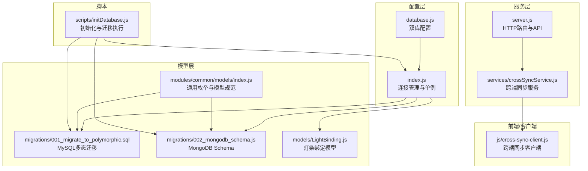
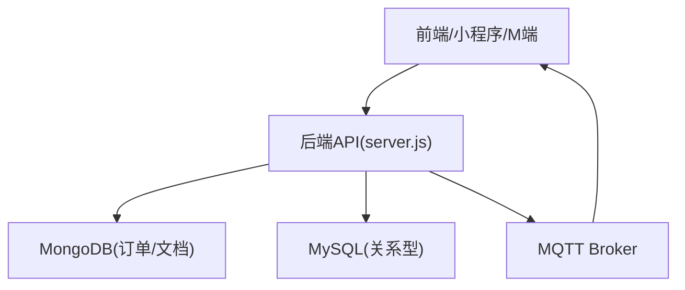
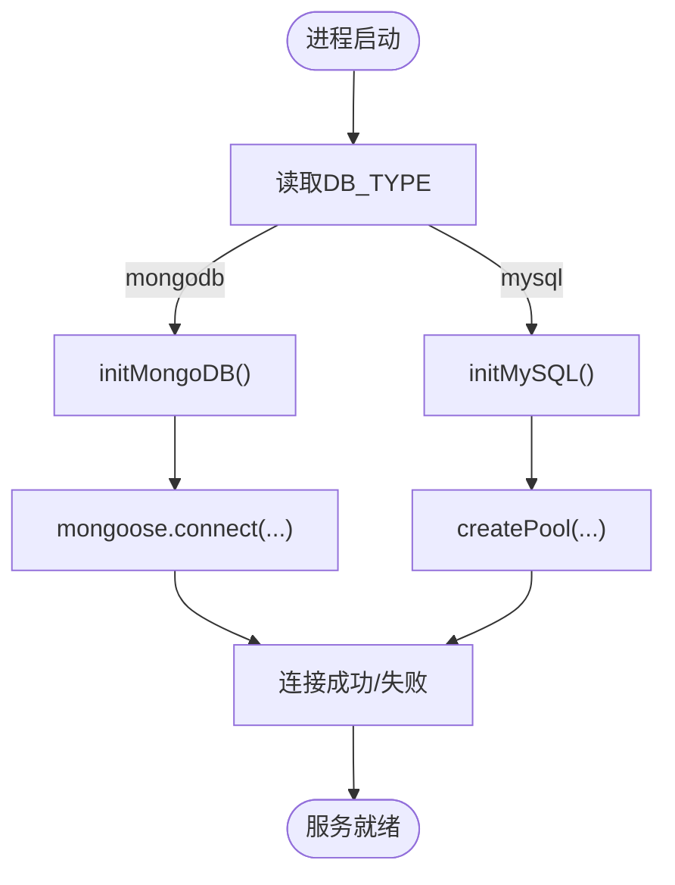
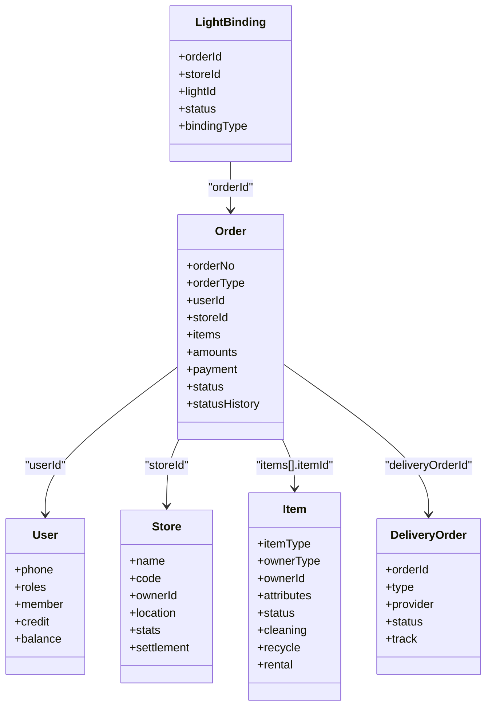
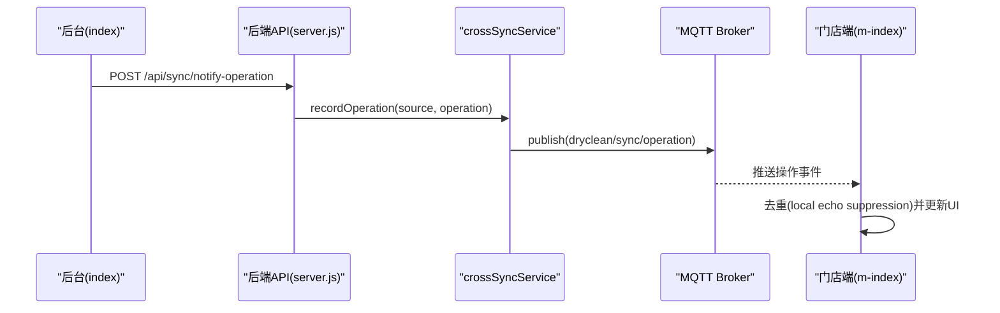
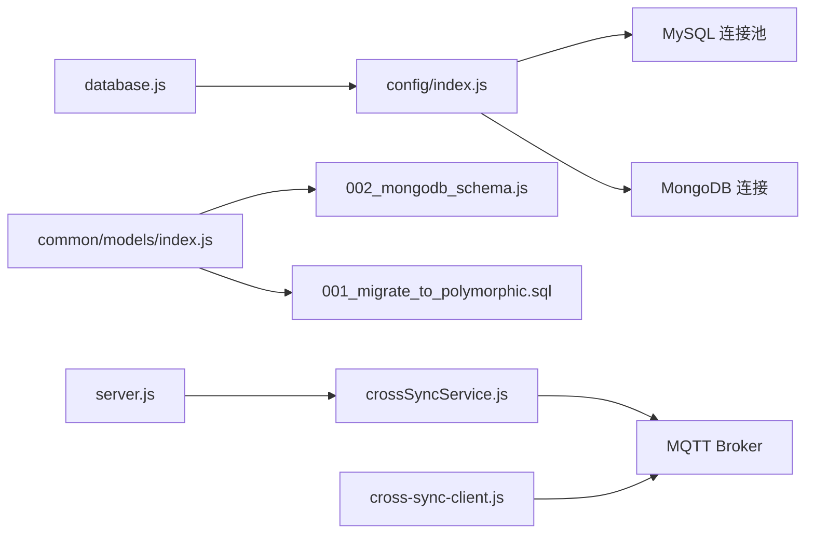

# 数据架构设计

<cite>
**本文引用的文件列表**
- [backend/config/database.js](file://backend/config/database.js)
- [backend/config/index.js](file://backend/config/index.js)
- [backend/migrations/001_migrate_to_polymorphic.sql](file://backend/migrations/001_migrate_to_polymorphic.sql)
- [backend/migrations/002_mongodb_schema.js](file://backend/migrations/002_mongodb_schema.js)
- [backend/models/LightBinding.js](file://backend/models/LightBinding.js)
- [backend/modules/common/models/index.js](file://backend/modules/common/models/index.js)
- [backend/scripts/initDatabase.js](file://backend/scripts/initDatabase.js)
- [backend/services/crossSyncService.js](file://backend/services/crossSyncService.js)
- [backend/server.js](file://backend/server.js)
- [js/cross-sync-client.js](file://js/cross-sync-client.js)
- [DATA-SYNC-GUIDE.md](file://DATA-SYNC-GUIDE.md)
- [DATA-SYNC-TROUBLESHOOTING.md](file://DATA-SYNC-TROUBLESHOOTING.md)
</cite>

## 目录
1. [引言](#引言)
2. [项目结构](#项目结构)
3. [核心组件](#核心组件)
4. [架构总览](#架构总览)
5. [详细组件分析](#详细组件分析)
6. [依赖关系分析](#依赖关系分析)
7. [性能与索引优化](#性能与索引优化)
8. [一致性、事务与同步策略](#一致性事务与同步策略)
9. [迁移与版本管理](#迁移与版本管理)
10. [备份与恢复策略](#备份与恢复策略)
11. [故障排查指南](#故障排查指南)
12. [结论与建议](#结论与建议)

## 引言
本文件面向数据库管理员与开发者，系统化阐述干洗店管理系统的双数据库架构：MongoDB用于订单与文档型数据存储，MySQL用于强一致的关系型数据。文档覆盖连接池与健康检查、模型设计与索引优化、一致性保障（事务、同步、冲突解决）、迁移与回滚、备份与灾难恢复等关键主题，并提供可视化架构图与流程图，帮助快速理解与落地运维。

## 项目结构
后端采用模块化组织，数据库相关配置集中在 config 目录，模型定义位于 migrations 与 models 目录，服务层通过 services 暴露跨端同步能力，脚本提供初始化与测试工具。

图表来源
- [backend/config/database.js:1-65](file://backend/config/database.js#L1-L65)
- [backend/config/index.js:1-166](file://backend/config/index.js#L1-L166)
- [backend/migrations/001_migrate_to_polymorphic.sql:1-310](file://backend/migrations/001_migrate_to_polymorphic.sql#L1-L310)
- [backend/migrations/002_mongodb_schema.js:1-607](file://backend/migrations/002_mongodb_schema.js#L1-L607)
- [backend/models/LightBinding.js:1-124](file://backend/models/LightBinding.js#L1-L124)
- [backend/modules/common/models/index.js:1-795](file://backend/modules/common/models/index.js#L1-L795)
- [backend/services/crossSyncService.js:1-336](file://backend/services/crossSyncService.js#L1-L336)
- [backend/server.js:261-301](file://backend/server.js#L261-L301)
- [js/cross-sync-client.js:1-296](file://js/cross-sync-client.js#L1-L296)
- [backend/scripts/initDatabase.js:1-148](file://backend/scripts/initDatabase.js#L1-L148)

章节来源
- [backend/config/database.js:1-65](file://backend/config/database.js#L1-L65)
- [backend/config/index.js:1-166](file://backend/config/index.js#L1-L166)
- [backend/migrations/001_migrate_to_polymorphic.sql:1-310](file://backend/migrations/001_migrate_to_polymorphic.sql#L1-L310)
- [backend/migrations/002_mongodb_schema.js:1-607](file://backend/migrations/002_mongodb_schema.js#L1-L607)
- [backend/models/LightBinding.js:1-124](file://backend/models/LightBinding.js#L1-L124)
- [backend/modules/common/models/index.js:1-795](file://backend/modules/common/models/index.js#L1-L795)
- [backend/services/crossSyncService.js:1-336](file://backend/services/crossSyncService.js#L1-L336)
- [backend/server.js:261-301](file://backend/server.js#L261-L301)
- [js/cross-sync-client.js:1-296](file://js/cross-sync-client.js#L1-L296)
- [backend/scripts/initDatabase.js:1-148](file://backend/scripts/initDatabase.js#L1-L148)

## 核心组件
- 双数据库配置与连接管理：统一入口根据环境变量选择 MongoDB 或 MySQL，分别维护连接与连接池，提供健康检测与关闭流程。
- 多态数据模型：MySQL 与 MongoDB 均支持“物品/订单”的多态扩展，通过类型字段与 JSON 字段隔离业务特定属性，便于演进。
- 跨端同步服务：基于 MQTT + REST 的轻量级操作广播机制，保证后台与门店端操作可见性一致。
- 初始化与迁移：提供脚本自动执行 SQL 迁移与集合/索引准备。

章节来源
- [backend/config/index.js:1-166](file://backend/config/index.js#L1-L166)
- [backend/migrations/001_migrate_to_polymorphic.sql:1-310](file://backend/migrations/001_migrate_to_polymorphic.sql#L1-L310)
- [backend/migrations/002_mongodb_schema.js:1-607](file://backend/migrations/002_mongodb_schema.js#L1-L607)
- [backend/services/crossSyncService.js:1-336](file://backend/services/crossSyncService.js#L1-L336)
- [backend/scripts/initDatabase.js:1-148](file://backend/scripts/initDatabase.js#L1-L148)

## 架构总览
系统采用“双库+消息总线”的数据架构：
- MongoDB：承载订单、物品、配送单、消息模板、信用等灵活结构数据，适合高并发读写与快速迭代。
- MySQL：承载强一致要求的关系型数据（如分账、状态历史、门店结算等），并通过事务保障一致性。
- MQTT：作为实时通道，支撑跨端操作同步与通知。

图表来源
- [backend/server.js:261-301](file://backend/server.js#L261-L301)
- [backend/services/crossSyncService.js:1-336](file://backend/services/crossSyncService.js#L1-L336)
- [backend/config/index.js:1-166](file://backend/config/index.js#L1-L166)

## 详细组件分析

### 双数据库选型与使用场景
- MongoDB 适用场景
  - 订单、物品、配送单、消息模板、信用记录等具备灵活结构与高频写入的场景。
  - 通过 schema 预定义与索引提升查询性能，同时保留 JSON 字段容纳业务扩展。
- MySQL 适用场景
  - 需要强一致与复杂关联的事务型数据，如分账记录、状态历史、门店结算等。
  - 通过 SQL 迁移脚本实现渐进式演进，保持向后兼容。

章节来源
- [backend/migrations/002_mongodb_schema.js:1-607](file://backend/migrations/002_mongodb_schema.js#L1-L607)
- [backend/migrations/001_migrate_to_polymorphic.sql:1-310](file://backend/migrations/001_migrate_to_polymorphic.sql#L1-L310)

### 连接管理机制（连接池、健康检查、故障转移）
- 连接初始化
  - 根据环境变量选择 MongoDB 或 MySQL；单例模式避免重复创建。
- 连接池配置
  - MySQL 使用连接池，包含最小/最大连接数、超时、时区与 SSL 开关。
  - MongoDB 使用驱动选项控制最大连接数与超时。
- 健康检查
  - 启动时主动获取连接并释放，验证连通性。
  - 监听断开事件，输出告警日志。
- 故障转移建议（当前未实现自动切换）
  - 建议在应用层增加重试与降级逻辑；在部署层引入主从/副本集与读写分离。
  - 对关键路径增加熔断与限流，避免雪崩。

图表来源
- [backend/config/index.js:1-166](file://backend/config/index.js#L1-L166)
- [backend/config/database.js:1-65](file://backend/config/database.js#L1-L65)

章节来源
- [backend/config/index.js:1-166](file://backend/config/index.js#L1-L166)
- [backend/config/database.js:1-65](file://backend/config/database.js#L1-L65)

### 数据模型设计原则与实体关系
- 多态建模
  - 通过 itemType/orderType 区分业务域，ownerType 支持多角色所有权。
  - 业务特定字段以 JSON 对象隔离，避免频繁改表。
- 状态机
  - 统一的 status/statusHistory 记录状态变迁，便于审计与回溯。
- 索引策略
  - 针对常用查询维度建立单列与复合索引，如 userId、storeId、orderType、status、createdAt 等。
- 关系映射
  - MongoDB 使用引用（ref）表达关联；MySQL 使用外键与独立表（如分账、状态历史）。

图表来源
- [backend/migrations/002_mongodb_schema.js:1-607](file://backend/migrations/002_mongodb_schema.js#L1-L607)
- [backend/models/LightBinding.js:1-124](file://backend/models/LightBinding.js#L1-L124)
- [backend/modules/common/models/index.js:1-795](file://backend/modules/common/models/index.js#L1-L795)

章节来源
- [backend/migrations/002_mongodb_schema.js:1-607](file://backend/migrations/002_mongodb_schema.js#L1-L607)
- [backend/models/LightBinding.js:1-124](file://backend/models/LightBinding.js#L1-L124)
- [backend/modules/common/models/index.js:1-795](file://backend/modules/common/models/index.js#L1-L795)

### 跨端同步与一致性保障
- 同步通道
  - 后端通过 crossSyncService 记录操作并发布到 MQTT 主题，前端客户端订阅并去重处理。
- 防本地回显
  - 携带 clientId 与 syncId，客户端过滤自身操作，避免重复渲染。
- 心跳与在线状态
  - 定时广播在线客户端列表，辅助判断两端是否都在线。
- 一致性边界
  - 跨端同步为“最终一致”，不替代数据库事务；关键财务与库存变更应在数据库层使用事务。

图表来源
- [backend/server.js:261-301](file://backend/server.js#L261-L301)
- [backend/services/crossSyncService.js:1-336](file://backend/services/crossSyncService.js#L1-L336)
- [js/cross-sync-client.js:1-296](file://js/cross-sync-client.js#L1-L296)

章节来源
- [backend/server.js:261-301](file://backend/server.js#L261-L301)
- [backend/services/crossSyncService.js:1-336](file://backend/services/crossSyncService.js#L1-L336)
- [js/cross-sync-client.js:1-296](file://js/cross-sync-client.js#L1-L296)

### 事务处理与数据同步
- MySQL 事务
  - 提供 transaction 封装，确保多语句原子性与回滚。
- 跨库一致性
  - 当前未实现跨库分布式事务；建议将强一致数据落库 MySQL，并将变更事件异步投递至消息队列，由消费者更新 MongoDB 视图或缓存，保证最终一致。
- 冲突解决
  - 基于时间戳与版本号进行合并；对于幂等操作，使用唯一键与 upsert 策略。

章节来源
- [backend/config/index.js:137-155](file://backend/config/index.js#L137-L155)

### 数据迁移与版本管理
- 渐进式迁移
  - 通过编号前缀的 SQL 脚本逐步演进，新增 JSON 字段保持向后兼容。
- 初始化脚本
  - initDatabase 自动加载并执行迁移脚本，打印创建结果与警告。
- 回滚策略
  - 建议为每个迁移编写反向脚本；在生产环境先创建安全快照再执行。

章节来源
- [backend/migrations/001_migrate_to_polymorphic.sql:1-310](file://backend/migrations/001_migrate_to_polymorphic.sql#L1-L310)
- [backend/scripts/initDatabase.js:96-148](file://backend/scripts/initDatabase.js#L96-L148)

### 备份与恢复策略
- 推荐工作流
  - 在执行高风险变更前创建安全备份；支持按时间点或指定备份快照恢复。
- 慢查询分析
  - 结合监控工具定位低效查询，按 QueryTime/RowsExamined 排序分析。
- 归档方案
  - 对历史订单与日志进行冷热分层，定期归档至低成本存储。

章节来源
- [DATA-SYNC-GUIDE.md:1-251](file://DATA-SYNC-GUIDE.md#L1-L251)
- [DATA-SYNC-TROUBLESHOOTING.md:72-255](file://DATA-SYNC-TROUBLESHOOTING.md#L72-L255)

## 依赖关系分析
- 配置层依赖
  - database.js 提供统一配置；index.js 负责连接生命周期与便捷方法。
- 模型层依赖
  - common/models 定义枚举与模型规范；migrations 提供具体实现。
- 服务层依赖
  - server.js 暴露 HTTP 接口；crossSyncService 依赖 MQTT 与通知中心。
- 客户端依赖
  - cross-sync-client.js 订阅 MQTT 并处理去重与状态展示。

图表来源
- [backend/config/database.js:1-65](file://backend/config/database.js#L1-L65)
- [backend/config/index.js:1-166](file://backend/config/index.js#L1-L166)
- [backend/modules/common/models/index.js:1-795](file://backend/modules/common/models/index.js#L1-L795)
- [backend/migrations/001_migrate_to_polymorphic.sql:1-310](file://backend/migrations/001_migrate_to_polymorphic.sql#L1-L310)
- [backend/migrations/002_mongodb_schema.js:1-607](file://backend/migrations/002_mongodb_schema.js#L1-L607)
- [backend/server.js:261-301](file://backend/server.js#L261-L301)
- [backend/services/crossSyncService.js:1-336](file://backend/services/crossSyncService.js#L1-L336)
- [js/cross-sync-client.js:1-296](file://js/cross-sync-client.js#L1-L296)

## 性能与索引优化
- MongoDB 索引
  - 用户：phone、openId、roles
  - 门店：ownerId、location 地理索引、status
  - 物品：itemType、ownerId、status 复合索引
  - 订单：userId、storeId、orderType、status、createdAt、payment.status
  - 配送单：provider、status
  - 灯条绑定：storeId+status、activatedAt、orderId+itemIndex+status
- MySQL 索引
  - 订单状态历史、物品状态历史、分账记录、信用记录、门店、配送单、消息模板等均已建必要索引。
- 查询调优
  - 优先使用覆盖索引；避免 SELECT *；分页使用游标或范围扫描；大表按时间分区或归档。

章节来源
- [backend/migrations/002_mongodb_schema.js:1-607](file://backend/migrations/002_mongodb_schema.js#L1-L607)
- [backend/models/LightBinding.js:1-124](file://backend/models/LightBinding.js#L1-L124)
- [backend/migrations/001_migrate_to_polymorphic.sql:1-310](file://backend/migrations/001_migrate_to_polymorphic.sql#L1-L310)

## 一致性、事务与同步策略
- 事务边界
  - 涉及资金与库存的关键路径使用 MySQL 事务；非关键路径可放宽一致性。
- 最终一致
  - 通过 crossSyncService 广播操作，客户端去重消费，达到 UI 层最终一致。
- 冲突解决
  - 使用幂等键（如 orderId+action）与时间戳比较；必要时引入乐观锁版本号。

章节来源
- [backend/config/index.js:137-155](file://backend/config/index.js#L137-L155)
- [backend/services/crossSyncService.js:1-336](file://backend/services/crossSyncService.js#L1-L336)

## 迁移与版本管理
- 迁移规范
  - 使用数字前缀命名，增量添加字段与表，尽量保持向后兼容。
- 执行流程
  - 初始化脚本读取 SQL 并按分号拆分执行，忽略已存在错误。
- 回滚策略
  - 为每个正向迁移编写反向脚本；生产环境先做快照备份，再执行迁移。

章节来源
- [backend/migrations/001_migrate_to_polymorphic.sql:1-310](file://backend/migrations/001_migrate_to_polymorphic.sql#L1-L310)
- [backend/scripts/initDatabase.js:96-148](file://backend/scripts/initDatabase.js#L96-L148)

## 备份与恢复策略
- 备份
  - 支持手动与定时备份；建议在高危操作前创建安全快照。
- 恢复
  - 支持按备份快照或时间点恢复；恢复为集群级别操作，需谨慎评估影响。
- 归档
  - 对历史数据进行冷热分层，降低热库压力。

章节来源
- [DATA-SYNC-GUIDE.md:1-251](file://DATA-SYNC-GUIDE.md#L1-L251)
- [DATA-SYNC-TROUBLESHOOTING.md:72-255](file://DATA-SYNC-TROUBLESHOOTING.md#L72-L255)

## 故障排查指南
- 连接问题
  - 检查环境变量与网络连通；查看连接日志与错误事件。
- 同步异常
  - 确认 MQTT 是否可用；核对客户端心跳与在线状态；检查跨端操作记录。
- 性能问题
  - 使用慢查询分析工具定位瓶颈；检查索引命中与扫描行数。

章节来源
- [backend/config/index.js:1-166](file://backend/config/index.js#L1-L166)
- [backend/services/crossSyncService.js:1-336](file://backend/services/crossSyncService.js#L1-L336)
- [DATA-SYNC-TROUBLESHOOTING.md:72-255](file://DATA-SYNC-TROUBLESHOOTING.md#L72-L255)

## 结论与建议
- 明确数据边界：强一致与事务型数据落库 MySQL，灵活与高吞吐数据落库 MongoDB。
- 完善连接治理：补充健康检查、重试与熔断，提升可用性。
- 强化一致性：关键路径使用事务，跨库变更通过事件驱动达成最终一致。
- 规范化迁移：严格版本化与回滚策略，配合快照与演练。
- 持续优化：基于索引与慢查询分析持续调优，结合归档缓解增长压力。