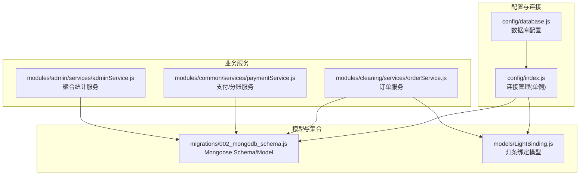
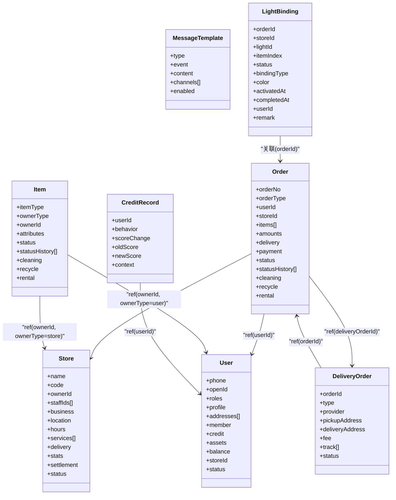
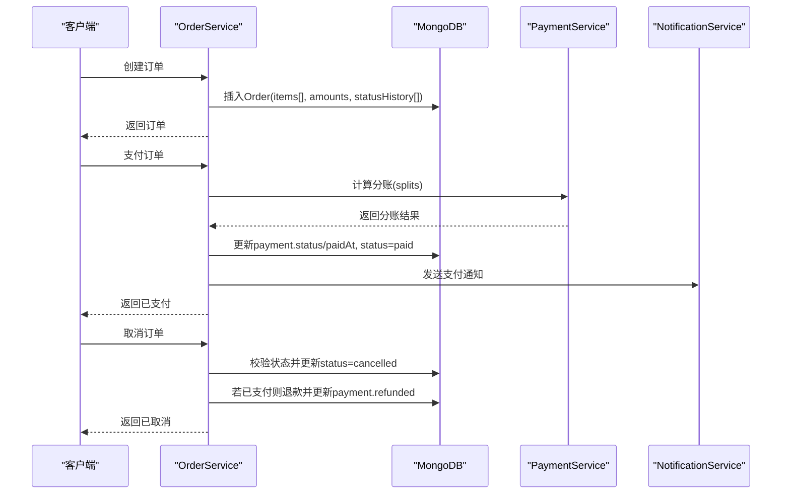
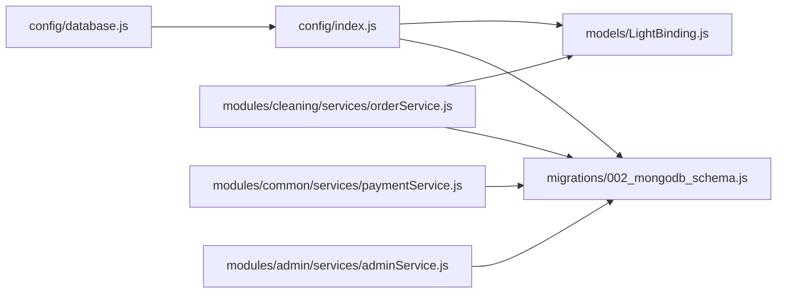
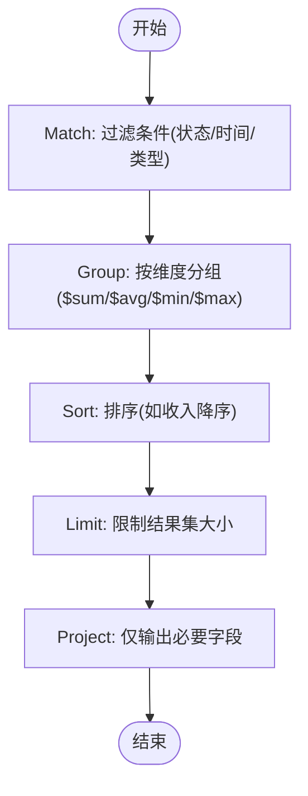

# MongoDB文档模型

<cite>
**本文引用的文件**   
- [backend/migrations/002_mongodb_schema.js](file://backend/migrations/002_mongodb_schema.js)
- [backend/models/LightBinding.js](file://backend/models/LightBinding.js)
- [backend/config/database.js](file://backend/config/database.js)
- [backend/config/index.js](file://backend/config/index.js)
- [backend/scripts/initDatabase.js](file://backend/scripts/initDatabase.js)
- [backend/modules/cleaning/services/orderService.js](file://backend/modules/cleaning/services/orderService.js)
- [backend/modules/common/services/paymentService.js](file://backend/modules/common/services/paymentService.js)
- [backend/modules/admin/services/adminService.js](file://backend/modules/admin/services/adminService.js)
</cite>

## 目录
1. [引言](#引言)
2. [项目结构](#项目结构)
3. [核心组件](#核心组件)
4. [架构总览](#架构总览)
5. [详细组件分析](#详细组件分析)
6. [依赖关系分析](#依赖关系分析)
7. [性能与索引优化](#性能与索引优化)
8. [聚合查询最佳实践](#聚合查询最佳实践)
9. [数据迁移与备份恢复](#数据迁移与备份恢复)
10. [开发规范与调试指南](#开发规范与调试指南)
11. [结论](#结论)

## 引言
本设计文档聚焦于系统中MongoDB的文档模型与使用策略，覆盖以下方面：
- 使用场景与存储策略（用户、门店、物品、订单、配送单、消息模板、信用记录、灯条绑定等）
- 文档结构设计（嵌套文档、数组字段、引用关系、多态模式）
- 版本控制与向后兼容策略
- 索引策略与查询优化方案
- Mongoose模型定义示例与Schema验证规则
- 聚合查询最佳实践与性能技巧
- 数据迁移与备份恢复策略
- 开发者规范与调试指南

## 项目结构
后端采用Node.js + Mongoose访问MongoDB，核心模型集中在迁移脚本中统一维护；业务服务层通过Mongoose Model进行CRUD与聚合操作。数据库连接配置支持MySQL/MongoDB双引擎切换。

图表来源
- [backend/config/database.js:1-65](file://backend/config/database.js#L1-L65)
- [backend/config/index.js:1-166](file://backend/config/index.js#L1-L166)
- [backend/migrations/002_mongodb_schema.js:1-607](file://backend/migrations/002_mongodb_schema.js#L1-L607)
- [backend/models/LightBinding.js:1-124](file://backend/models/LightBinding.js#L1-L124)
- [backend/modules/cleaning/services/orderService.js:1-800](file://backend/modules/cleaning/services/orderService.js#L1-L800)
- [backend/modules/common/services/paymentService.js:1-185](file://backend/modules/common/services/paymentService.js#L1-L185)
- [backend/modules/admin/services/adminService.js:1-2600](file://backend/modules/admin/services/adminService.js#L1-L2600)

章节来源
- [backend/config/database.js:1-65](file://backend/config/database.js#L1-L65)
- [backend/config/index.js:1-166](file://backend/config/index.js#L1-L166)
- [backend/migrations/002_mongodb_schema.js:1-607](file://backend/migrations/002_mongodb_schema.js#L1-L607)
- [backend/models/LightBinding.js:1-124](file://backend/models/LightBinding.js#L1-L124)
- [backend/modules/cleaning/services/orderService.js:1-800](file://backend/modules/cleaning/services/orderService.js#L1-L800)
- [backend/modules/common/services/paymentService.js:1-185](file://backend/modules/common/services/paymentService.js#L1-L185)
- [backend/modules/admin/services/adminService.js:1-2600](file://backend/modules/admin/services/adminService.js#L1-L2600)

## 核心组件
- 用户(User)：基础信息、角色、资料、地址、会员、信用、资产、余额、关联门店、状态等
- 门店(Store)：基本信息、位置、营业时间、服务项、配送设置、统计、结算、状态
- 物品(Item)：多态标识(itemType)、所有者(ownerType/ownerId)、属性、状态机、业务扩展字段
- 订单(Order)：多态标识(orderType)、关联、物品列表、金额明细、收货/配送、支付、状态机、业务扩展
- 配送单(DeliveryOrder)：与订单关联、取送地址、费用、轨迹、状态
- 消息模板(MessageTemplate)：类型、事件、内容、渠道、启用
- 信用记录(CreditRecord)：行为、分数变化、上下文
- 灯条绑定(LightBinding)：订单-灯条绑定记录，用于取件提示

章节来源
- [backend/migrations/002_mongodb_schema.js:55-134](file://backend/migrations/002_mongodb_schema.js#L55-L134)
- [backend/migrations/002_mongodb_schema.js:141-206](file://backend/migrations/002_mongodb_schema.js#L141-L206)
- [backend/migrations/002_mongodb_schema.js:215-307](file://backend/migrations/002_mongodb_schema.js#L215-L307)
- [backend/migrations/002_mongodb_schema.js:312-493](file://backend/migrations/002_mongodb_schema.js#L312-L493)
- [backend/migrations/002_mongodb_schema.js:498-552](file://backend/migrations/002_mongodb_schema.js#L498-L552)
- [backend/migrations/002_mongodb_schema.js:556-569](file://backend/migrations/002_mongodb_schema.js#L556-L569)
- [backend/migrations/002_mongodb_schema.js:574-584](file://backend/migrations/002_mongodb_schema.js#L574-L584)
- [backend/models/LightBinding.js:1-124](file://backend/models/LightBinding.js#L1-L124)

## 架构总览
系统以“配置-连接-模型-服务”分层组织：
- 配置层：database.js提供MongoDB URI与选项；index.js实现单例连接管理与生命周期
- 模型层：002_mongodb_schema.js集中定义所有Mongoose Schema与Model；LightBinding独立维护
- 服务层：orderService负责订单全生命周期；paymentService处理支付与分账；adminService执行聚合统计

图表来源
- [backend/migrations/002_mongodb_schema.js:55-134](file://backend/migrations/002_mongodb_schema.js#L55-L134)
- [backend/migrations/002_mongodb_schema.js:141-206](file://backend/migrations/002_mongodb_schema.js#L141-L206)
- [backend/migrations/002_mongodb_schema.js:215-307](file://backend/migrations/002_mongodb_schema.js#L215-L307)
- [backend/migrations/002_mongodb_schema.js:312-493](file://backend/migrations/002_mongodb_schema.js#L312-L493)
- [backend/migrations/002_mongodb_schema.js:498-552](file://backend/migrations/002_mongodb_schema.js#L498-L552)
- [backend/migrations/002_mongodb_schema.js:556-569](file://backend/migrations/002_mongodb_schema.js#L556-L569)
- [backend/migrations/002_mongodb_schema.js:574-584](file://backend/migrations/002_mongodb_schema.js#L574-L584)
- [backend/models/LightBinding.js:1-124](file://backend/models/LightBinding.js#L1-L124)

## 详细组件分析

### 用户(User)文档
- 关键字段：phone(openId/sparse索引)、roles(枚举数组)、profile、addresses(数组)、member、credit、assets.itemIds(ref Item)、balance、storeId(ref Store)、status
- 索引：phone、openId(sparse)、roles
- 设计要点：
  - 多角色与会员体系内嵌，便于快速读取
  - 信用字段预留，支撑风控与黑名单
  - assets.itemIds采用引用，避免大对象膨胀

章节来源
- [backend/migrations/002_mongodb_schema.js:55-134](file://backend/migrations/002_mongodb_schema.js#L55-L134)

### 门店(Store)文档
- 关键字段：name/code(unique)、ownerId(ref User)、staffIds[]、business、location(经纬度)、hours(按周)、services[]、delivery、stats、settlement、status
- 索引：ownerId、location坐标、status
- 设计要点：
  - location支持地理查询
  - services/delivery/stats/settlement内嵌，减少跨集合Join

章节来源
- [backend/migrations/002_mongodb_schema.js:141-206](file://backend/migrations/002_mongodb_schema.js#L141-L206)

### 物品(Item)文档（多态）
- 关键字段：itemType(enum)、ownerType(enum)、ownerId(ref)、attributes、status、statusHistory[]、cleaning/recycle/rental(按类型扩展)
- 索引：itemType+ownerId、itemType+status
- 设计要点：
  - 多态通过itemType区分不同业务域
  - 业务特定字段按需展开，避免空字段泛滥
  - statusHistory记录流转审计

章节来源
- [backend/migrations/002_mongodb_schema.js:215-307](file://backend/migrations/002_mongodb_schema.js#L215-L307)

### 订单(Order)文档（多态）
- 关键字段：orderNo(unique)、orderType(enum)、userId(ref)、storeId(ref)、items[]、amounts、delivery、payment.status/method/transactionId/splits[]、status、statusHistory[]、courier、selectedProvider、deliveryFeePaid、deliveryMethod、cleaning/recycle/rental
- 索引：userId+createdAt、storeId+createdAt、orderType+status、payment.status
- 设计要点：
  - items为内嵌数组，包含通用与品类特有字段
  - payment.splits记录多方分账明细
  - deliveryMethod/courier支持跑腿配送与到店自提
  - pre-save钩子生成orderNo

章节来源
- [backend/migrations/002_mongodb_schema.js:312-493](file://backend/migrations/002_mongodb_schema.js#L312-L493)

### 配送单(DeliveryOrder)文档
- 关键字段：orderId(ref Order)、type、provider、providerOrderId、取送地址、fee、distance、courier、status、track[]、deliveredAt
- 索引：provider+status
- 设计要点：
  - 与订单解耦，便于追踪第三方配送状态
  - track数组记录轨迹点

章节来源
- [backend/migrations/002_mongodb_schema.js:498-552](file://backend/migrations/002_mongodb_schema.js#L498-L552)

### 消息模板(MessageTemplate)与信用记录(CreditRecord)
- 消息模板：type/event唯一复合索引，content.data使用Mixed灵活承载
- 信用记录：userId+createdAt倒序索引，记录分数变更历史

章节来源
- [backend/migrations/002_mongodb_schema.js:556-569](file://backend/migrations/002_mongodb_schema.js#L556-L569)
- [backend/migrations/002_mongodb_schema.js:574-584](file://backend/migrations/002_mongodb_schema.js#L574-L584)

### 灯条绑定(LightBinding)文档
- 关键字段：orderId、storeId、lightId、itemIndex、status、bindingType、color、activatedAt、completedAt、userId、remark
- 索引：storeId+status、activatedAt倒序、orderId+itemIndex+status复合
- 静态方法：获取门店活跃绑定、按订单/物品查询、批量活跃查询
- 实例方法：complete/cancel

章节来源
- [backend/models/LightBinding.js:1-124](file://backend/models/LightBinding.js#L1-L124)

### 订单服务流程（创建-支付-取消）

图表来源
- [backend/modules/cleaning/services/orderService.js:181-291](file://backend/modules/cleaning/services/orderService.js#L181-L291)
- [backend/modules/cleaning/services/orderService.js:521-564](file://backend/modules/cleaning/services/orderService.js#L521-L564)
- [backend/modules/cleaning/services/orderService.js:569-616](file://backend/modules/cleaning/services/orderService.js#L569-L616)
- [backend/modules/common/services/paymentService.js:96-173](file://backend/modules/common/services/paymentService.js#L96-L173)

## 依赖关系分析
- 连接与配置
  - database.js提供MongoDB URI与连接选项
  - index.js实现initMongoDB/closeDatabase，暴露getMongoose()供模型与服务使用
- 模型与业务
  - orderService在本地也定义了轻量Store/Order Schema用于兼容查询，但主模型来自002_mongodb_schema.js
  - adminService大量使用Order.aggregate进行统计
  - paymentService根据orderType计算分账，写入Order.payment.splits

图表来源
- [backend/config/database.js:1-65](file://backend/config/database.js#L1-L65)
- [backend/config/index.js:1-166](file://backend/config/index.js#L1-L166)
- [backend/migrations/002_mongodb_schema.js:1-607](file://backend/migrations/002_mongodb_schema.js#L1-L607)
- [backend/models/LightBinding.js:1-124](file://backend/models/LightBinding.js#L1-L124)
- [backend/modules/cleaning/services/orderService.js:1-800](file://backend/modules/cleaning/services/orderService.js#L1-L800)
- [backend/modules/common/services/paymentService.js:1-185](file://backend/modules/common/services/paymentService.js#L1-L185)
- [backend/modules/admin/services/adminService.js:1-2600](file://backend/modules/admin/services/adminService.js#L1-L2600)

章节来源
- [backend/config/database.js:1-65](file://backend/config/database.js#L1-L65)
- [backend/config/index.js:1-166](file://backend/config/index.js#L1-L166)
- [backend/migrations/002_mongodb_schema.js:1-607](file://backend/migrations/002_mongodb_schema.js#L1-L607)
- [backend/models/LightBinding.js:1-124](file://backend/models/LightBinding.js#L1-L124)
- [backend/modules/cleaning/services/orderService.js:1-800](file://backend/modules/cleaning/services/orderService.js#L1-L800)
- [backend/modules/common/services/paymentService.js:1-185](file://backend/modules/common/services/paymentService.js#L1-L185)
- [backend/modules/admin/services/adminService.js:1-2600](file://backend/modules/admin/services/adminService.js#L1-L2600)

## 性能与索引优化
- 常用查询路径与索引建议
  - 用户：phone、openId(sparse)、roles
  - 门店：ownerId、location坐标、status
  - 物品：itemType+ownerId、itemType+status
  - 订单：userId+createdAt、storeId+createdAt、orderType+status、payment.status
  - 配送单：provider+status
  - 灯条绑定：storeId+status、activatedAt倒序、orderId+itemIndex+status
- 查询优化要点
  - 优先使用覆盖索引或投影减少回表
  - 时间范围查询结合createdAt倒序索引分页
  - 对频繁过滤字段建立复合索引，注意选择性
  - 避免在Match后做大规模unwind/group，必要时拆分管道阶段
- 初始化与索引
  - initDatabase.js列出集合与索引规划，实际索引由Schema定义自动创建

章节来源
- [backend/migrations/002_mongodb_schema.js:136-136](file://backend/migrations/002_mongodb_schema.js#L136-L136)
- [backend/migrations/002_mongodb_schema.js:208-210](file://backend/migrations/002_mongodb_schema.js#L208-L210)
- [backend/migrations/002_mongodb_schema.js:306-307](file://backend/migrations/002_mongodb_schema.js#L306-L307)
- [backend/migrations/002_mongodb_schema.js:479-482](file://backend/migrations/002_mongodb_schema.js#L479-L482)
- [backend/migrations/002_mongodb_schema.js:551-551](file://backend/migrations/002_mongodb_schema.js#L551-L551)
- [backend/models/LightBinding.js:85-87](file://backend/models/LightBinding.js#L85-L87)
- [backend/scripts/initDatabase.js:62-90](file://backend/scripts/initDatabase.js#L62-L90)

## 聚合查询最佳实践
- 常见模式
  - 按维度分组计数/求和/平均：group + $sum/$avg/$min/$max
  - 时间维度聚合：dateToString按年/月分组
  - 数组展开：unwind后再聚合
- 性能技巧
  - 尽早match过滤，减少后续阶段数据量
  - 确保match字段有索引
  - 限制输出字段(project)，限制结果数量(limit)
  - 避免超大group导致内存溢出
- 实战参考
  - adminService中多处Order.aggregate用于营收、趋势、门店统计等

[此图为概念流程图，不直接映射具体源码]

章节来源
- [backend/modules/admin/services/adminService.js:207-260](file://backend/modules/admin/services/adminService.js#L207-L260)
- [backend/modules/admin/services/adminService.js:380-420](file://backend/modules/admin/services/adminService.js#L380-L420)
- [backend/modules/admin/services/adminService.js:1407-1472](file://backend/modules/admin/services/adminService.js#L1407-L1472)
- [backend/modules/admin/services/adminService.js:1577-1689](file://backend/modules/admin/services/adminService.js#L1577-L1689)
- [backend/modules/admin/services/adminService.js:1755-1913](file://backend/modules/admin/services/adminService.js#L1755-L1913)
- [backend/modules/admin/services/adminService.js:2124-2283](file://backend/modules/admin/services/adminService.js#L2124-L2283)
- [backend/modules/admin/services/adminService.js:2420-2575](file://backend/modules/admin/services/adminService.js#L2420-L2575)

## 数据迁移与备份恢复
- 迁移策略
  - 使用迁移脚本集中定义Schema与索引，保证环境一致性
  - 新增字段时保持向后兼容：默认值、可选字段、预处理器兼容旧数据
- 备份与恢复
  - 生产建议使用mongodump/mongorestore或云厂商快照
  - 定期全量备份+增量日志，保留多份副本
- 兼容性处理
  - 使用pre-save钩子生成orderNo
  - 查询侧兼容多种ID格式(_id/orderNo/openId/phone)
  - 字段缺失时提供默认计算逻辑（如amounts.total）

章节来源
- [backend/migrations/002_mongodb_schema.js:485-493](file://backend/migrations/002_mongodb_schema.js#L485-L493)
- [backend/modules/cleaning/services/orderService.js:395-422](file://backend/modules/cleaning/services/orderService.js#L395-L422)
- [backend/modules/cleaning/services/orderService.js:508-513](file://backend/modules/cleaning/services/orderService.js#L508-L513)
- [backend/scripts/initDatabase.js:40-94](file://backend/scripts/initDatabase.js#L40-L94)

## 开发规范与调试指南
- 模型与Schema
  - 统一在002_mongodb_schema.js维护，避免重复定义
  - 使用enum约束状态/类型，提升可维护性
  - 合理设置索引，避免过度索引影响写性能
- 查询与服务
  - 使用lean()减少对象开销
  - 分页使用skip/limit，配合createdAt倒序
  - 复杂查询拆分为多个简单查询或聚合管道
- 错误处理
  - 连接异常监听(error/disconnected)
  - 业务异常抛出明确错误信息
- 调试工具
  - testConnection.js测试连接与服务器信息
  - initDatabase.js打印集合与索引规划
  - 使用console.log定位关键路径（注意生产环境脱敏）

章节来源
- [backend/config/index.js:30-53](file://backend/config/index.js#L30-L53)
- [backend/scripts/testConnection.js:1-49](file://backend/scripts/testConnection.js#L1-L49)
- [backend/scripts/initDatabase.js:1-96](file://backend/scripts/initDatabase.js#L1-L96)
- [backend/modules/cleaning/services/orderService.js:352-359](file://backend/modules/cleaning/services/orderService.js#L352-L359)

## 结论
本设计通过统一的Mongoose Schema与清晰的索引策略，实现了多品类、多态化的订单与物品模型，兼顾了读写性能与可扩展性。聚合查询与分账逻辑在服务层清晰分离，便于演进与维护。建议在后续迭代中持续完善索引覆盖率、监控慢查询，并结合业务增长调整分片与副本集策略。