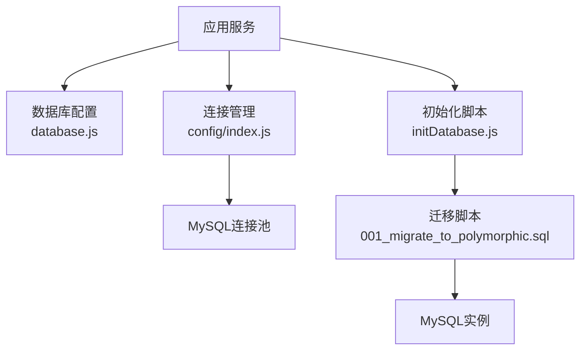
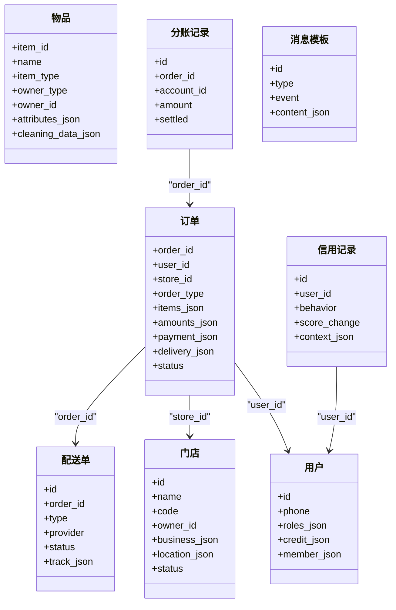
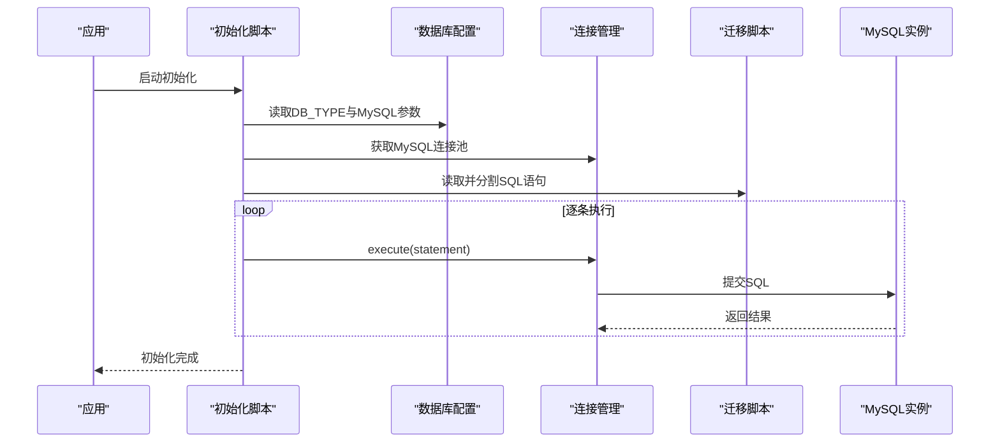
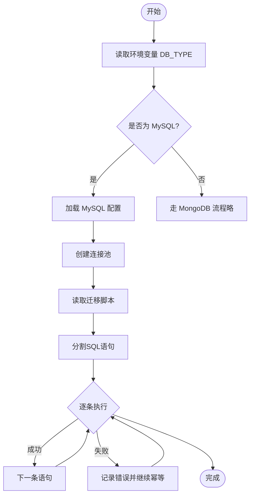

# MySQL关系模型

<cite>
**本文引用的文件**   
- [backend/config/database.js](file://backend/config/database.js)
- [backend/config/index.js](file://backend/config/index.js)
- [backend/migrations/001_migrate_to_polymorphic.sql](file://backend/migrations/001_migrate_to_polymorphic.sql)
- [backend/scripts/initDatabase.js](file://backend/scripts/initDatabase.js)
</cite>

## 目录
1. [引言](#引言)
2. [项目结构](#项目结构)
3. [核心组件](#核心组件)
4. [架构总览](#架构总览)
5. [详细组件分析](#详细组件分析)
6. [依赖分析](#依赖分析)
7. [性能考虑](#性能考虑)
8. [故障排查指南](#故障排查指南)
9. [结论](#结论)
10. [附录](#附录)

## 引言
本文件面向干洗系统后端中的MySQL关系型数据库，聚焦于：
- MySQL在系统中的使用场景与表结构设计原则
- 核心表的字段定义、数据类型选择与约束条件
- 外键关系与表间关联设计（当前采用逻辑外键）
- JSON字段的使用场景与优势
- 索引策略与查询性能优化建议
- SQL建表脚本与初始化数据说明
- 事务处理与并发控制机制
- 数据迁移脚本设计与版本管理策略
- MySQL开发规范与最佳实践

## 项目结构
与MySQL相关的关键位置：
- 配置层：数据库类型、连接池、时区、SSL等
- 迁移脚本：DDL与增量变更、初始数据
- 初始化脚本：按DB_TYPE自动执行对应初始化流程
- 连接管理：单例连接池、事务封装、便捷查询方法

图表来源
- [backend/config/database.js:1-65](file://backend/config/database.js#L1-L65)
- [backend/config/index.js:55-88](file://backend/config/index.js#L55-L88)
- [backend/scripts/initDatabase.js:96-144](file://backend/scripts/initDatabase.js#L96-L144)
- [backend/migrations/001_migrate_to_polymorphic.sql:169-278](file://backend/migrations/001_migrate_to_polymorphic.sql#L169-L278)

章节来源
- [backend/config/database.js:1-65](file://backend/config/database.js#L1-L65)
- [backend/config/index.js:1-167](file://backend/config/index.js#L1-L167)
- [backend/scripts/initDatabase.js:1-148](file://backend/scripts/initDatabase.js#L1-L148)
- [backend/migrations/001_migrate_to_polymorphic.sql:1-310](file://backend/migrations/001_migrate_to_polymorphic.sql#L1-L310)

## 核心组件
- 数据库配置
  - 支持多数据库类型切换，MySQL默认关闭日志输出，生产环境可关闭
  - 连接池大小、超时、时区、SSL开关等参数集中管理
- 连接管理与事务
  - 提供单例连接池、便捷查询与事务封装
  - 统一错误处理与资源释放
- 迁移与初始化
  - 通过SQL脚本完成DDL与初始数据注入
  - 初始化脚本按DB_TYPE自动选择执行路径

章节来源
- [backend/config/database.js:10-34](file://backend/config/database.js#L10-L34)
- [backend/config/index.js:55-155](file://backend/config/index.js#L55-L155)
- [backend/scripts/initDatabase.js:96-144](file://backend/scripts/initDatabase.js#L96-L144)

## 架构总览
MySQL在本系统中的定位：
- 作为主数据存储，承载订单、物品、门店、配送、分账、信用等核心业务实体
- 通过JSON字段承载灵活扩展属性，降低频繁改表成本
- 以迁移脚本驱动版本化演进，保证环境一致性

图表来源
- [backend/migrations/001_migrate_to_polymorphic.sql:169-278](file://backend/migrations/001_migrate_to_polymorphic.sql#L169-L278)

## 详细组件分析

### 表结构与字段设计
- 通用约定
  - 主键：字符串ID（如VARCHAR(64)），便于分布式生成与跨系统对接
  - 时间戳：DATETIME，默认CURRENT_TIMESTAMP；更新时ON UPDATE CURRENT_TIMESTAMP
  - 字符集：utf8mb4，支持表情与多语言
  - 引擎：InnoDB，支持事务与行级锁
- 核心表概览
  - 订单 orders：多态订单（清洗/回收/租赁/押金），包含items_json、amounts_json、payment_json、delivery_json等
  - 物品 items：多态物品（干洗/回收/租赁），包含attributes_json、cleaning_data_json等
  - 用户 users：角色、信用、资产、地址、会员信息均以JSON存储
  - 门店 stores：经营信息、营业时间、服务、配送、统计、结算等以JSON存储
  - 配送单 delivery_orders：取送类型、服务商、轨迹、状态等
  - 分账记录 payment_splits：按账户维度拆分金额与结算状态
  - 信用记录 credit_records：行为评分变化与上下文
  - 消息模板 message_templates：事件驱动的模板内容
  - 状态历史：order_status_history、item_status_history用于审计追踪

章节来源
- [backend/migrations/001_migrate_to_polymorphic.sql:10-79](file://backend/migrations/001_migrate_to_polymorphic.sql#L10-L79)
- [backend/migrations/001_migrate_to_polymorphic.sql:169-278](file://backend/migrations/001_migrate_to_polymorphic.sql#L169-L278)

### 数据类型与约束选择
- 数值与金额
  - 金额使用DECIMAL(10,2)，避免浮点误差
  - 数量、计数使用INT或BIGINT
- 文本与枚举
  - 短文本使用VARCHAR，长文本使用TEXT
  - 有限集合使用ENUM（如订单类型、状态），便于校验与可读性
- JSON字段
  - 使用JSON类型承载复杂/可变结构，减少频繁ALTER TABLE
  - 结合MySQL JSON函数进行查询与更新（建议在需要高频过滤的字段上建立虚拟列+索引）
- 唯一性与非空
  - 关键标识字段设置UNIQUE（如门店编码）
  - 必填字段设置NOT NULL并给出合理默认值

章节来源
- [backend/migrations/001_migrate_to_polymorphic.sql:196-222](file://backend/migrations/001_migrate_to_polymorphic.sql#L196-L222)
- [backend/migrations/001_migrate_to_polymorphic.sql:224-278](file://backend/migrations/001_migrate_to_polymorphic.sql#L224-L278)

### 外键关系与表间关联
- 当前采用“逻辑外键”（应用层维护引用完整性），未使用数据库级FOREIGN KEY
- 主要关联
  - 订单 → 用户、门店、配送单
  - 分账记录 → 订单
  - 信用记录 → 用户
- 优点
  - 提升写入吞吐与水平扩展能力
  - 简化跨库/跨集群迁移与分片策略
- 风险与对策
  - 需应用层保障一致性（事务、幂等、补偿）
  - 定期数据一致性巡检与修复脚本

章节来源
- [backend/migrations/001_migrate_to_polymorphic.sql:169-278](file://backend/migrations/001_migrate_to_polymorphic.sql#L169-L278)

### JSON字段使用场景与优势
- 适用场景
  - 业务扩展快、字段差异大的对象（如订单明细、支付信息、配送轨迹、用户画像）
  - 多品类多态数据的差异化属性（如清洗/回收/租赁专属字段）
- 优势
  - 降低DDL变更频率，缩短发布周期
  - 提高读写灵活性，适配前端多变展示需求
- 注意事项
  - 对JSON内嵌字段的高频过滤应评估是否引入冗余列或虚拟列+索引
  - 注意JSON序列化/反序列化开销与体积控制

章节来源
- [backend/migrations/001_migrate_to_polymorphic.sql:10-79](file://backend/migrations/001_migrate_to_polymorphic.sql#L10-L79)

### 索引策略与查询性能优化
- 现有索引
  - 常用查询列：order_id、user_id、store_id、status、created_at、account_id等
  - 复合索引：按“筛选列+排序列”组合（如 order_id + created_at）
- 建议优化
  - 为高频过滤的JSON字段创建虚拟列并加索引（例如按订单类型、支付状态、配送状态）
  - 覆盖索引：将必要字段放入索引以减少回表
  - 分页与范围查询：确保ORDER BY与WHERE命中索引
  - 慢查询监控：开启慢查询日志，定期分析TOP N
  - 批量操作：合并小事务，减少锁竞争

章节来源
- [backend/migrations/001_migrate_to_polymorphic.sql:170-222](file://backend/migrations/001_migrate_to_polymorphic.sql#L170-L222)
- [backend/migrations/001_migrate_to_polymorphic.sql:240-265](file://backend/migrations/001_migrate_to_polymorphic.sql#L240-L265)

### SQL建表脚本与初始化数据
- 建表与迁移
  - 通过迁移脚本集中管理DDL与初始数据
  - 初始化脚本读取并顺序执行SQL语句，忽略已存在错误
- 初始数据
  - 预置消息模板等基础数据，便于系统运行
- 执行方式
  - 设置环境变量DB_TYPE=mysql后运行初始化脚本
  - 或直接手动执行迁移脚本

章节来源
- [backend/scripts/initDatabase.js:96-144](file://backend/scripts/initDatabase.js#L96-L144)
- [backend/migrations/001_migrate_to_polymorphic.sql:284-294](file://backend/migrations/001_migrate_to_polymorphic.sql#L284-L294)

### 事务处理与并发控制
- 事务封装
  - 提供统一的transaction方法，自动begin/commit/rollback
  - 异常路径确保回滚与连接释放
- 并发控制
  - InnoDB行级锁，热点行竞争可通过业务幂等与重试缓解
  - 高并发写场景建议：
    - 拆分大事务，缩小锁粒度
    - 使用乐观锁（版本号）或队列串行化关键路径
    - 读写分离与缓存降级

章节来源
- [backend/config/index.js:140-155](file://backend/config/index.js#L140-L155)

### 数据迁移脚本设计与版本管理
- 命名规范
  - 前缀序号+描述（如001_migrate_to_polymorphic.sql），保证执行顺序
- 内容组织
  - 先新增字段与表，再迁移旧数据，最后可选清理旧字段
  - 幂等设计：使用IF NOT EXISTS、IF NULL判断，避免重复执行失败
- 版本管理策略
  - 所有DDL变更纳入迁移脚本，禁止手工在生产库直接修改
  - 每次发布前在测试环境验证迁移脚本
  - 保留回滚方案（反向迁移脚本或快照恢复）

章节来源
- [backend/migrations/001_migrate_to_polymorphic.sql:1-310](file://backend/migrations/001_migrate_to_polymorphic.sql#L1-L310)
- [backend/scripts/initDatabase.js:101-141](file://backend/scripts/initDatabase.js#L101-L141)

### 开发者规范与最佳实践
- 命名与风格
  - 表名、字段名使用小写下划线；JSON键名使用驼峰或下划线保持一致
- 字段设计
  - 金额用DECIMAL；时间用DATETIME；枚举优先用ENUM或字典表
  - 避免过度使用JSON导致查询困难，必要时冗余关键列
- 索引与查询
  - 先有查询后有索引；复合索引遵循最左前缀原则
  - 避免SELECT *，按需返回字段
- 事务与幂等
  - 关键路径必须事务包裹；对外接口具备幂等键
- 安全与合规
  - 敏感信息加密存储；最小权限原则访问数据库
- 可观测性
  - 记录关键审计日志（状态历史、变更记录）
  - 接入慢查询与错误告警

[本节为通用指导，不直接分析具体文件]

## 依赖分析
- 配置到连接的依赖链
  - database.js提供MySQL连接参数
  - config/index.js基于参数创建连接池并提供事务封装
  - initDatabase.js根据DB_TYPE选择执行路径，调用迁移脚本
- 迁移脚本到数据库
  - 由初始化脚本读取并逐条执行，构建所需表与索引

图表来源
- [backend/config/database.js:10-34](file://backend/config/database.js#L10-L34)
- [backend/config/index.js:55-88](file://backend/config/index.js#L55-L88)
- [backend/scripts/initDatabase.js:96-144](file://backend/scripts/initDatabase.js#L96-L144)
- [backend/migrations/001_migrate_to_polymorphic.sql:169-278](file://backend/migrations/001_migrate_to_polymorphic.sql#L169-L278)

章节来源
- [backend/config/database.js:1-65](file://backend/config/database.js#L1-L65)
- [backend/config/index.js:1-167](file://backend/config/index.js#L1-L167)
- [backend/scripts/initDatabase.js:1-148](file://backend/scripts/initDatabase.js#L1-L148)
- [backend/migrations/001_migrate_to_polymorphic.sql:1-310](file://backend/migrations/001_migrate_to_polymorphic.sql#L1-L310)

## 性能考虑
- 连接池调优
  - connectionLimit与maxPoolSize匹配峰值QPS与平均延迟
  - 合理设置超时，避免雪崩
- 索引与查询
  - 针对热点查询建立复合索引，避免全表扫描
  - 对JSON字段高频过滤，考虑虚拟列+索引或冗余列
- 事务与锁
  - 缩小事务范围，避免长事务持有锁
  - 热点行冲突采用排队或异步化处理
- I/O与存储
  - 关注磁盘IOPS与缓冲命中率
  - 冷热数据分层归档

[本节为通用指导，不直接分析具体文件]

## 故障排查指南
- 连接问题
  - 检查环境变量与网络连通性
  - 确认账号权限与白名单
- 迁移失败
  - 查看迁移脚本中报错语句
  - 确认幂等性（IF NOT EXISTS/IF NULL）
- 性能问题
  - 开启慢查询日志，定位TOP N
  - 使用EXPLAIN分析执行计划
- 事务异常
  - 检查死锁日志与锁等待
  - 确认事务边界与重试策略

章节来源
- [backend/config/index.js:140-155](file://backend/config/index.js#L140-L155)
- [backend/scripts/initDatabase.js:120-141](file://backend/scripts/initDatabase.js#L120-L141)

## 结论
本项目通过“配置集中化 + 连接池 + 事务封装 + 迁移脚本”的组合，构建了稳定可扩展的MySQL数据层。借助JSON字段与多态设计，系统在保持关系型一致性的同时获得了良好的演进能力。后续可在索引优化、虚拟列、读写分离与可观测性方面持续完善。

[本节为总结性内容，不直接分析具体文件]

## 附录

### 初始化流程图（MySQL）

图表来源
- [backend/scripts/initDatabase.js:96-144](file://backend/scripts/initDatabase.js#L96-L144)
- [backend/config/index.js:55-88](file://backend/config/index.js#L55-L88)