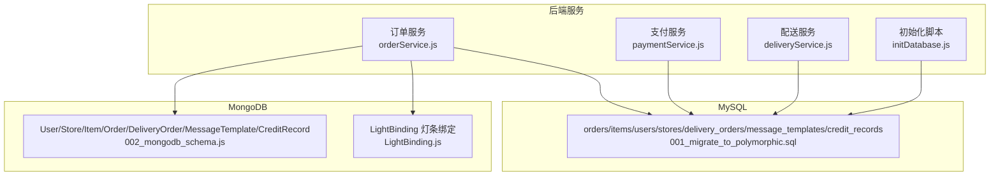
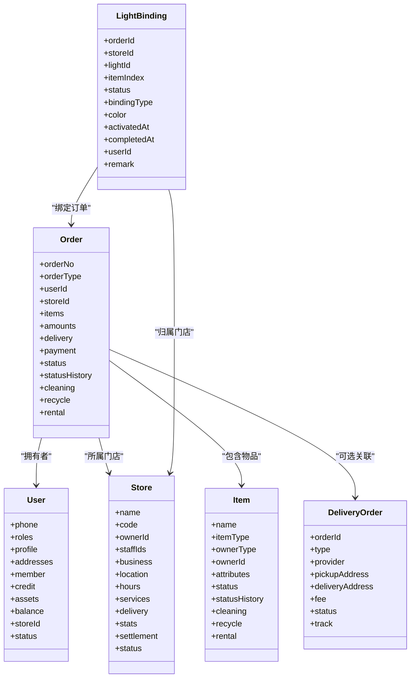
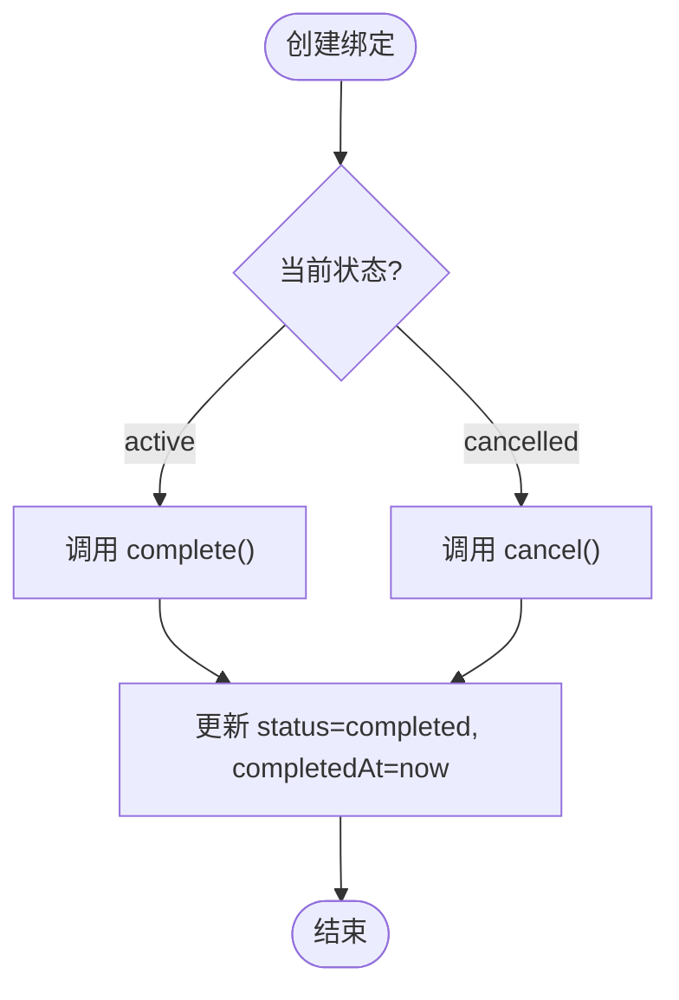
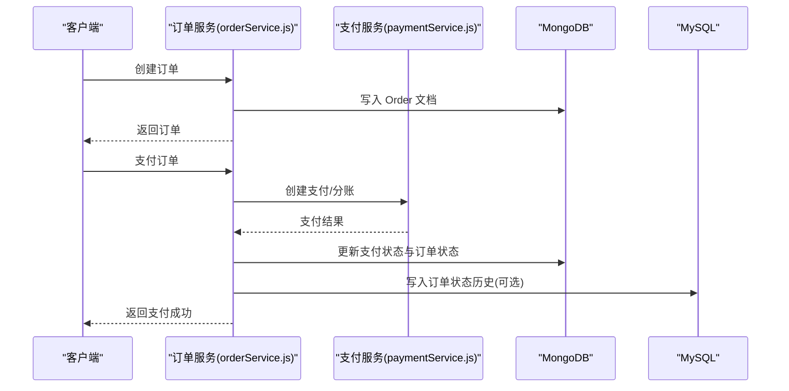
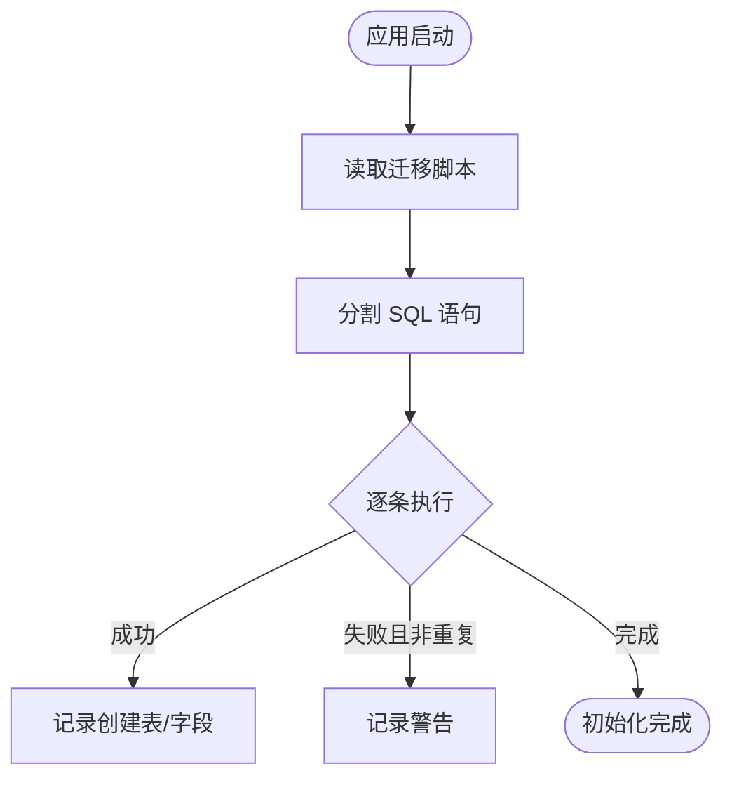

# 数据模型设计

<cite>
**本文引用的文件**   
- [LightBinding.js](file://backend/models/LightBinding.js)
- [001_migrate_to_polymorphic.sql](file://backend/migrations/001_migrate_to_polymorphic.sql)
- [002_mongodb_schema.js](file://backend/migrations/002_mongodb_schema.js)
- [orderService.js](file://backend/modules/cleaning/services/orderService.js)
- [paymentService.js](file://backend/modules/common/services/paymentService.js)
- [deliveryService.js](file://backend/modules/common/services/deliveryService.js)
- [initDatabase.js](file://backend/scripts/initDatabase.js)
</cite>

## 目录
1. [引言](#引言)
2. [项目结构](#项目结构)
3. [核心组件](#核心组件)
4. [架构总览](#架构总览)
5. [详细组件分析](#详细组件分析)
6. [依赖关系分析](#依赖关系分析)
7. [性能与索引策略](#性能与索引策略)
8. [数据验证与业务约束](#数据验证与业务约束)
9. [迁移脚本与版本管理](#迁移脚本与版本管理)
10. [最佳实践与设计规范](#最佳实践与设计规范)
11. [故障排查指南](#故障排查指南)
12. [结论](#结论)

## 引言
本文件面向干洗店管理系统的数据建模，覆盖用户、订单、门店、支付、配送等关键实体，并给出 MongoDB 文档模型与 MySQL 关系模型的对比设计与落地方案。重点说明：
- 多态数据模型（如 LightBinding）的动态关联设计模式
- 嵌套结构与引用关系的取舍
- 索引策略与查询优化
- 数据验证规则与业务约束
- 迁移脚本的设计思路与版本管理策略
- 为开发者提供可执行的数据建模最佳实践

## 项目结构
本项目在数据层采用“双库”策略：
- MongoDB：用于灵活的业务文档（订单、物品、配送单、消息模板、信用记录、灯条绑定等）
- MySQL：用于强一致性的基础表与历史流水（订单状态历史、分账记录、信用流水、门店、配送单等）

图表来源
- [orderService.js:1-150](file://backend/modules/cleaning/services/orderService.js#L1-L150)
- [002_mongodb_schema.js:1-120](file://backend/migrations/002_mongodb_schema.js#L1-L120)
- [LightBinding.js:1-124](file://backend/models/LightBinding.js#L1-L124)
- [001_migrate_to_polymorphic.sql:1-120](file://backend/migrations/001_migrate_to_polymorphic.sql#L1-L120)
- [initDatabase.js:96-147](file://backend/scripts/initDatabase.js#L96-L147)

章节来源
- [orderService.js:1-150](file://backend/modules/cleaning/services/orderService.js#L1-L150)
- [002_mongodb_schema.js:1-120](file://backend/migrations/002_mongodb_schema.js#L1-L120)
- [LightBinding.js:1-124](file://backend/models/LightBinding.js#L1-L124)
- [001_migrate_to_polymorphic.sql:1-120](file://backend/migrations/001_migrate_to_polymorphic.sql#L1-L120)
- [initDatabase.js:96-147](file://backend/scripts/initDatabase.js#L96-L147)

## 核心组件
本节聚焦核心业务实体的数据模型与关系：
- 用户（User）：身份、角色、会员、信用、资产、地址
- 门店（Store）：基本信息、营业时间、服务项、结算信息
- 物品（Item）：多态物品（干洗/回收/租赁等），属性与状态机
- 订单（Order）：多态订单（清洗/回收/租赁/押金），金额明细、配送、支付、状态历史
- 配送（DeliveryOrder）：取送地址、服务商、轨迹、费用
- 支付（Payment）：支付方式、交易号、分账记录
- 灯条绑定（LightBinding）：订单-灯条动态关联，支持按门店/订单/物品维度查询

章节来源
- [002_mongodb_schema.js:56-134](file://backend/migrations/002_mongodb_schema.js#L56-L134)
- [002_mongodb_schema.js:142-206](file://backend/migrations/002_mongodb_schema.js#L142-L206)
- [002_mongodb_schema.js:216-303](file://backend/migrations/002_mongodb_schema.js#L216-L303)
- [002_mongodb_schema.js:313-476](file://backend/migrations/002_mongodb_schema.js#L313-L476)
- [002_mongodb_schema.js:499-549](file://backend/migrations/002_mongodb_schema.js#L499-L549)
- [LightBinding.js:8-82](file://backend/models/LightBinding.js#L8-L82)

## 架构总览
系统采用“文档+关系”的混合数据架构：
- MongoDB 承载高扩展性、易演化的业务文档（订单、物品、配送单、消息模板、信用、灯条绑定）
- MySQL 承载需要强一致性与审计的历史流水、分账、门店主数据等

图表来源
- [002_mongodb_schema.js:56-134](file://backend/migrations/002_mongodb_schema.js#L56-L134)
- [002_mongodb_schema.js:142-206](file://backend/migrations/002_mongodb_schema.js#L142-L206)
- [002_mongodb_schema.js:216-303](file://backend/migrations/002_mongodb_schema.js#L216-L303)
- [002_mongodb_schema.js:313-476](file://backend/migrations/002_mongodb_schema.js#L313-L476)
- [002_mongodb_schema.js:499-549](file://backend/migrations/002_mongodb_schema.js#L499-L549)
- [LightBinding.js:8-82](file://backend/models/LightBinding.js#L8-L82)

## 详细组件分析

### 用户（User）
- 字段要点
  - 身份标识：手机号唯一、openId/unionId 可选
  - 角色：数组枚举，支持 customer/store_staff/store_owner/recycler/appraiser/brand_admin/chain_admin/admin
  - 个人资料：姓名、头像、性别、生日
  - 地址：数组，含省市区、经纬度、标签、默认标记
  - 会员：等级、积分、累计消费、入会时间
  - 信用：履约评分、完成/取消订单数、逾期次数、黑名单标记
  - 资产：持有物品ID列表、总资产估值
  - 余额：可用/冻结
  - 关联门店：storeId（可选）
  - 状态：active/inactive/banned
- 索引策略
  - phone 唯一索引
  - openId 稀疏索引
  - roles 索引（便于权限过滤）
- 复杂度与扩展
  - 通过 JSON 或子文档承载扩展字段，避免频繁改表
  - 信用与会员体系预留扩展点，便于后续风控与营销

章节来源
- [002_mongodb_schema.js:56-134](file://backend/migrations/002_mongodb_schema.js#L56-L134)

### 门店（Store）
- 字段要点
  - 基本信息：名称、编码、负责人、员工列表
  - 经营信息：许可证、联系方式、描述
  - 位置：省市区、详细地址、经纬度
  - 营业时间：按周配置，节假日
  - 服务项：服务ID、名称、价格、启用状态
  - 配送：是否开启、免配门槛、基础费、接入服务商
  - 统计：总订单、月订单、评分、评分人数
  - 结算：余额、冻结余额、待结算
  - 状态：pending/active/suspended/closed
- 索引策略
  - ownerId 索引
  - location 地理索引（经纬度）
  - status 索引
- 复杂度与扩展
  - 服务项与配送配置以数组/对象存储，便于运营快速调整

章节来源
- [002_mongodb_schema.js:142-206](file://backend/migrations/002_mongodb_schema.js#L142-L206)

### 物品（Item，多态）
- 字段要点
  - 通用：名称、描述
  - 多态标识：itemType（dry_cleaning/recycle/rental/...）、ownerType（user/store/brand/recycle_shop）、ownerId
  - 属性：品牌、品类、材质、颜色、尺码、零售价、成本价、重量、新旧程度、图片、标签
  - 状态机：pending/in_progress/ready/delivering/delivered/cancelled，附带状态历史
  - 业务特定：
    - cleaning：服务类型、污渍、特殊要求、预计天数
    - recycle：估价、最终价、重量、分类、可回收、认证信息
    - rental：押金、日/周/月租、最短租期、可用区间、品牌、真伪
- 索引策略
  - itemType + ownerId 复合索引
  - itemType + status 复合索引
- 复杂度与扩展
  - 通过 itemType 分支字段实现多态，避免大量空列
  - 状态历史保证可追溯

章节来源
- [002_mongodb_schema.js:216-303](file://backend/migrations/002_mongodb_schema.js#L216-L303)

### 订单（Order，多态）
- 字段要点
  - 基本：订单号、订单类型（cleaning/recycle/rental/deposit/...）、用户、门店、回收员、配送单ID
  - 物品清单：itemId、名称、类型、数量、单价、小计、业务字段（服务类型、取件码、重量、租金等）
  - 金额明细：小计、折扣、优惠券、配送费、押金、服务费、总计
  - 收货信息：取送方式、服务商、取送地址、预估与实际时间
  - 支付：状态、方式、交易号、支付时间、分账明细
  - 状态机：涵盖清洗/回收/租赁全流程状态，附带状态历史
  - 业务特定：
    - cleaning：回寄日期、入库/完成时间、质检结果
    - recycle：评估人、评估时间、用户确认、回收时间、结算状态
    - rental：起租/到期/实际归还、逾期天数/费用、押金状态、损坏赔偿
  - 其他：创建来源、备注
- 索引策略
  - userId + createdAt 复合索引（用户订单列表）
  - storeId + createdAt 复合索引（门店订单列表）
  - orderType + status 复合索引（按类型与状态筛选）
  - payment.status 索引（支付状态查询）
- 复杂度与扩展
  - 多态订单通过 orderType 分支字段承载不同业务域
  - 金额与支付分离，便于对账与分账

章节来源
- [002_mongodb_schema.js:313-476](file://backend/migrations/002_mongodb_schema.js#L313-L476)

### 配送（DeliveryOrder）
- 字段要点
  - 关联：订单ID、类型（none/pickup/delivery）、服务商、平台订单号
  - 地址：取货/送货联系人、电话、地址、经纬度
  - 费用与距离：费用、距离
  - 骑手信息：姓名、电话、头像、位置、预计到达
  - 状态：pending/assigned/picking/delivering/delivered/cancelled/failed
  - 轨迹：状态、时间、经纬度、描述
  - 送达时间
- 索引策略
  - provider + status 复合索引（按服务商与状态检索）
- 复杂度与扩展
  - 与订单解耦，便于独立追踪与对账

章节来源
- [002_mongodb_schema.js:499-549](file://backend/migrations/002_mongodb_schema.js#L499-L549)

### 支付（Payment）
- 字段要点
  - 统一支付服务封装微信/支付宝/银联/余额
  - 分账：按订单类型计算平台抽佣、门店/用户/品牌分配
  - 退款与查询接口占位
- 复杂度与扩展
  - 分账逻辑随业务演进可扩展新的账户类型与比例

章节来源
- [paymentService.js:96-173](file://backend/modules/common/services/paymentService.js#L96-L173)

### 灯条绑定（LightBinding，多态关联）
- 字段要点
  - 订单ID、门店ID、灯条ID（ALL 表示全部）、物品索引
  - 状态：active/completed/cancelled
  - 绑定类型：pickup/urgent/batch
  - 颜色、激活/完成时间、用户ID、备注
- 索引策略
  - orderId、storeId、status 单独索引
  - storeId + status 复合索引
  - activatedAt 倒序索引
  - orderId + itemIndex + status 复合索引（支持订单+物品查询）
- 实例方法
  - complete/cancel 更新状态与时间
- 静态方法
  - getActiveByStore/getByOrder/getByOrderAndItem/getAllActiveByOrder

图表来源
- [LightBinding.js:89-101](file://backend/models/LightBinding.js#L89-L101)
- [LightBinding.js:104-121](file://backend/models/LightBinding.js#L104-L121)

章节来源
- [LightBinding.js:8-82](file://backend/models/LightBinding.js#L8-L82)
- [LightBinding.js:84-87](file://backend/models/LightBinding.js#L84-L87)
- [LightBinding.js:89-121](file://backend/models/LightBinding.js#L89-L121)

## 依赖关系分析
- 订单服务依赖支付服务与通知服务，并在创建/支付/取消/状态变更时发布事件
- 配送服务聚合多家跑腿服务商，返回标准化报价与下单结果
- 初始化脚本负责读取并执行 MySQL 迁移脚本，确保表结构就绪

图表来源
- [orderService.js:177-291](file://backend/modules/cleaning/services/orderService.js#L177-L291)
- [paymentService.js:24-47](file://backend/modules/common/services/paymentService.js#L24-L47)
- [001_migrate_to_polymorphic.sql:169-180](file://backend/migrations/001_migrate_to_polymorphic.sql#L169-L180)

章节来源
- [orderService.js:177-291](file://backend/modules/cleaning/services/orderService.js#L177-L291)
- [paymentService.js:24-47](file://backend/modules/common/services/paymentService.js#L24-L47)
- [001_migrate_to_polymorphic.sql:169-180](file://backend/migrations/001_migrate_to_polymorphic.sql#L169-L180)

## 性能与索引策略
- MongoDB
  - 高频查询字段建立单列或复合索引：userId、storeId、orderType/status、payment.status、createdAt
  - 地理位置查询使用 GeoJSON 索引（门店 location）
  - 灯条绑定针对门店活跃绑定与订单维度查询建立复合索引
- MySQL
  - 历史流水表（订单/物品状态历史、分账、信用）建立外键关联字段与时间索引
  - 门店与配送单表建立常用筛选字段索引（ownerId、status、provider）

章节来源
- [002_mongodb_schema.js:478-483](file://backend/migrations/002_mongodb_schema.js#L478-L483)
- [002_mongodb_schema.js:208-210](file://backend/migrations/002_mongodb_schema.js#L208-L210)
- [LightBinding.js:84-87](file://backend/models/LightBinding.js#L84-L87)
- [001_migrate_to_polymorphic.sql:170-180](file://backend/migrations/001_migrate_to_polymorphic.sql#L170-L180)
- [001_migrate_to_polymorphic.sql:246-265](file://backend/migrations/001_migrate_to_polymorphic.sql#L246-L265)

## 数据验证与业务约束
- 必填与唯一
  - 用户手机号唯一；订单号唯一；门店编码唯一
- 枚举校验
  - 用户角色、订单类型、物品类型、支付方式、订单状态、配送类型等均有枚举约束
- 数值范围
  - 信用评分范围、金额非负、数量大于等于1
- 业务规则
  - 订单创建需至少一个物品；支付前状态必须为 pending；取消仅允许终态或特定状态
  - 配送费用计算基于距离与服务商定价规则，支持拼单折扣与促销
  - 分账按订单类型计算平台抽佣与各方分配

章节来源
- [002_mongodb_schema.js:56-134](file://backend/migrations/002_mongodb_schema.js#L56-L134)
- [002_mongodb_schema.js:313-476](file://backend/migrations/002_mongodb_schema.js#L313-L476)
- [deliveryService.js:122-154](file://backend/modules/common/services/deliveryService.js#L122-L154)
- [paymentService.js:96-173](file://backend/modules/common/services/paymentService.js#L96-L173)
- [orderService.js:181-291](file://backend/modules/cleaning/services/orderService.js#L181-L291)

## 迁移脚本与版本管理
- 迁移目标
  - 从旧结构渐进式迁移到多态模型，保持向后兼容
  - 新增 JSON 字段承载历史数据与扩展信息
  - 新建必要表（订单/物品状态历史、分账、信用、门店、配送单、消息模板）
- 迁移步骤
  - 新增字段（orders/items/users 等）
  - 数据迁移（将旧 items/amounts/payment/delivery 迁移至 JSON）
  - 创建新表与索引
  - 初始化消息模板
  - 清理旧字段（可选，确认迁移成功后执行）
- 版本管理策略
  - 使用序号化文件名（001_*.sql、002_*.js）标识顺序
  - 启动时自动扫描并执行未执行的迁移脚本
  - 幂等设计（IF NOT EXISTS、忽略已存在错误）

图表来源
- [initDatabase.js:96-147](file://backend/scripts/initDatabase.js#L96-L147)
- [001_migrate_to_polymorphic.sql:1-120](file://backend/migrations/001_migrate_to_polymorphic.sql#L1-L120)

章节来源
- [001_migrate_to_polymorphic.sql:1-120](file://backend/migrations/001_migrate_to_polymorphic.sql#L1-L120)
- [initDatabase.js:96-147](file://backend/scripts/initDatabase.js#L96-L147)

## 最佳实践与设计规范
- 多态建模
  - 使用 type 字段区分多态实体（orderType/itemType），配合分支字段承载业务差异
  - 避免过度泛化，保持每个分支字段的内聚性
- 嵌套与引用
  - 订单内嵌 items 与 amounts，减少跨集合 JOIN 开销
  - 长生命周期实体（用户、门店）使用引用，短生命周期或强关联数据考虑内嵌
- 索引设计
  - 优先为高频查询条件建立索引，复合索引遵循最左前缀原则
  - 地理位置查询使用 GeoJSON 索引
- 数据一致性
  - 关键状态变更写入历史表，保障可审计与可回溯
  - 支付与分账分离，确保对账清晰
- 迁移与版本
  - 所有结构变更通过迁移脚本管理，禁止手工改库
  - 迁移脚本幂等、可回滚、可重放
- 安全与权限
  - 基于角色的访问控制（RBAC）与资源级权限校验
  - 敏感字段加密存储，日志脱敏

[本节为通用指导，不直接分析具体文件]

## 故障排查指南
- 订单查询为空
  - 检查 userId/customerPhone 是否正确传入
  - 确认 isDeleted 过滤逻辑与权限校验
- 支付状态不一致
  - 核对支付回调与本地状态更新的事务边界
  - 查看分账记录与支付流水是否匹配
- 配送费用异常
  - 检查服务商定价配置与距离计算
  - 确认促销规则与拼单折扣生效
- 灯条绑定无效
  - 检查绑定状态与门店活跃绑定索引命中情况
  - 确认 orderId/itemIndex 组合查询条件正确

章节来源
- [orderService.js:296-389](file://backend/modules/cleaning/services/orderService.js#L296-L389)
- [orderService.js:521-564](file://backend/modules/cleaning/services/orderService.js#L521-L564)
- [deliveryService.js:173-259](file://backend/modules/common/services/deliveryService.js#L173-L259)
- [LightBinding.js:104-121](file://backend/models/LightBinding.js#L104-L121)

## 结论
本数据模型设计通过多态文档与关系表的结合，兼顾了灵活性、一致性与可审计性。MongoDB 文档模型支持快速迭代与复杂业务扩展，MySQL 关系模型保障关键流水与结算的强一致。配合完善的索引策略、数据验证与迁移机制，系统可在多品类、多渠道场景下稳定运行。建议持续优化索引与查询路径，完善监控与告警，确保数据质量与性能达标。