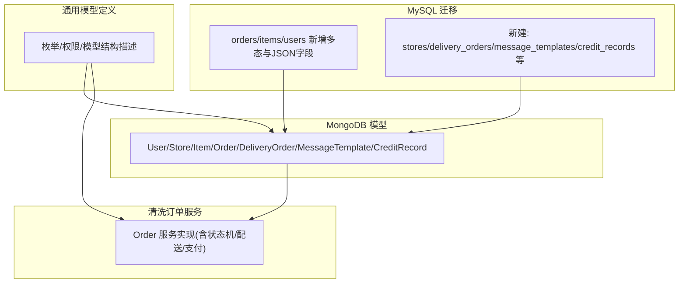
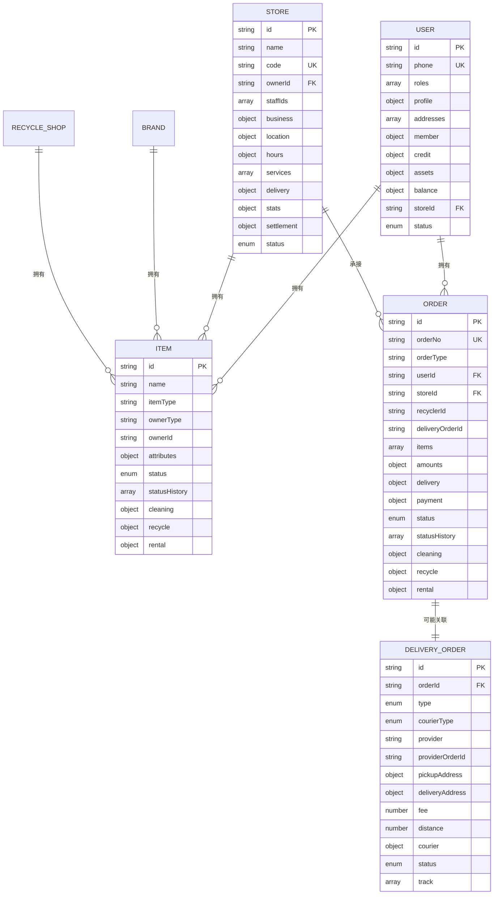
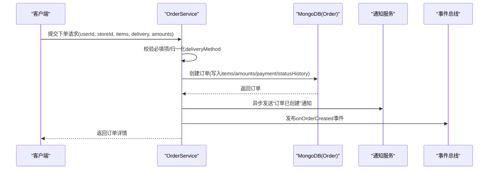
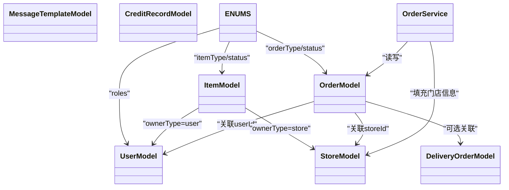

# 核心实体模型

<cite>
**本文引用的文件列表**
- [backend/migrations/001_migrate_to_polymorphic.sql](file://backend/migrations/001_migrate_to_polymorphic.sql)
- [backend/migrations/002_mongodb_schema.js](file://backend/migrations/002_mongodb_schema.js)
- [backend/modules/common/models/index.js](file://backend/modules/common/models/index.js)
- [backend/modules/cleaning/services/orderService.js](file://backend/modules/cleaning/services/orderService.js)
- [backend/modules/cleaning/services/pricingService.js](file://backend/modules/cleaning/services/pricingService.js)
</cite>

## 目录
1. [引言](#引言)
2. [项目结构](#项目结构)
3. [核心组件](#核心组件)
4. [架构总览](#架构总览)
5. [详细组件分析](#详细组件分析)
6. [依赖关系分析](#依赖关系分析)
7. [性能与索引策略](#性能与索引策略)
8. [数据验证与约束](#数据验证与约束)
9. [故障排查指南](#故障排查指南)
10. [结论](#结论)
11. [附录：最佳实践与扩展指南](#附录最佳实践与扩展指南)

## 引言
本文件聚焦干洗店管理系统的核心实体模型，围绕用户（User）、订单（Order）、门店（Store）、物品（Item）四大实体展开，系统阐述字段定义、数据类型、业务含义、多态设计思路（order_type、item_type 等枚举的使用场景）、JSON 动态数据结构模式（items_json、amounts_json、payment_json 等），并提供实体关系图与 ER 图。同时给出数据验证规则、约束条件与索引策略建议，以及面向开发者的建模最佳实践与扩展指南。

## 项目结构
本项目在两套数据库层上定义了核心实体模型：
- MySQL 迁移脚本中为现有表新增多态字段与 JSON 列，并创建若干新表以支撑多品类业务。
- MongoDB Schema 文件中通过 Mongoose 定义了 User、Store、Item、Order、DeliveryOrder、MessageTemplate、CreditRecord 等模型，作为当前后端服务的主要持久化形态。
- 通用模型定义模块集中维护了枚举、权限与模型结构描述，便于跨模块复用。
- 清洗订单服务中实现了基于 MongoDB 的 Order 模型与业务流程逻辑。

图表来源
- [backend/migrations/001_migrate_to_polymorphic.sql:1-310](file://backend/migrations/001_migrate_to_polymorphic.sql#L1-L310)
- [backend/migrations/002_mongodb_schema.js:1-607](file://backend/migrations/002_mongodb_schema.js#L1-L607)
- [backend/modules/common/models/index.js:1-795](file://backend/modules/common/models/index.js#L1-L795)
- [backend/modules/cleaning/services/orderService.js:1-800](file://backend/modules/cleaning/services/orderService.js#L1-L800)

章节来源
- [backend/migrations/001_migrate_to_polymorphic.sql:1-310](file://backend/migrations/001_migrate_to_polymorphic.sql#L1-L310)
- [backend/migrations/002_mongodb_schema.js:1-607](file://backend/migrations/002_mongodb_schema.js#L1-L607)
- [backend/modules/common/models/index.js:1-795](file://backend/modules/common/models/index.js#L1-L795)
- [backend/modules/cleaning/services/orderService.js:1-800](file://backend/modules/cleaning/services/orderService.js#L1-L800)

## 核心组件
本节概述四大核心实体的职责与关键属性，并说明多态与 JSON 字段的设计意图。

- 用户（User）
  - 角色与认证：支持多角色（customer、store_staff、store_owner、recycler、appraiser、brand_admin、admin），用于权限控制与功能可见性。
  - 个人资料与地址：包含姓名、头像、性别、生日及多个收货地址（可标记默认）。
  - 会员与信用：会员等级、积分、累计消费；信用评分、履约记录、黑名单等。
  - 资产与余额：用户持有的物品集合与账户可用/冻结余额。
  - 关联门店：当用户为门店员工或老板时，绑定 storeId。
  - 数据来源与层级：注册来源、平台标识、所属连锁ID，便于跨平台与连锁体系的数据治理。

- 门店（Store）
  - 基本信息：名称、编码、负责人、员工列表。
  - 经营信息：营业执照号、联系电话、简介。
  - 位置与营业时间：省市区、详细地址、经纬度、每日营业时段与节假日说明。
  - 服务配置：服务项目、价格、启用状态。
  - 配送配置：是否开启配送、免配门槛、基础运费、启用的服务商。
  - 运营与结算：订单统计、评分、结算余额与待结算金额。
  - 状态：pending/active/suspended/closed。

- 物品（Item，多态）
  - 多态标识：itemType（dry_cleaning/recycle/rental 等）、ownerType（user/store/brand/recycle_shop）、ownerId。
  - 通用属性：品牌、分类、材质、颜色、尺码、重量、成色、图片、标签等。
  - 状态机：pending/in_progress/ready/delivering/delivered/cancelled 及历史轨迹。
  - 业务特定字段：按 itemType 启用 cleaning/recycle/rental 子对象，避免宽表膨胀。

- 订单（Order，多态）
  - 多态标识：orderType（cleaning/recycle/rental/deposit 等）。
  - 关联：userId、storeId、recyclerId、deliveryOrderId。
  - 物品清单 items：每个 item 包含 itemId、name、itemType、price、quantity、subtotal 及业务特定字段。
  - 金额明细 amounts：subtotal、discount、deliveryFee、deposit、serviceFee、total。
  - 配送 delivery：type、courierType、provider、取/送地址、预计与实际时间。
  - 支付 payment：status、method、transactionId、paidAt、分账 splits。
  - 状态机：涵盖支付、配送、处理、完成、取消、退款等全链路状态。
  - 业务特定字段：cleaning/recycle/rental 子对象，承载各品类特有流程字段。

章节来源
- [backend/modules/common/models/index.js:130-795](file://backend/modules/common/models/index.js#L130-L795)
- [backend/migrations/002_mongodb_schema.js:52-607](file://backend/migrations/002_mongodb_schema.js#L52-L607)

## 架构总览
下图展示了核心实体之间的关系与交互要点，包括多态标识、关联关系与典型业务流程。

图表来源
- [backend/migrations/002_mongodb_schema.js:52-607](file://backend/migrations/002_mongodb_schema.js#L52-L607)
- [backend/modules/common/models/index.js:130-795](file://backend/modules/common/models/index.js#L130-L795)

## 详细组件分析

### 用户（User）模型
- 关键字段
  - 身份与认证：phone（唯一）、openId/unionId、email、password。
  - 角色：roles 数组，限定于预定义枚举，默认 customer。
  - 资料：profile.name/avatar/gender/birthday。
  - 地址：addresses 数组，支持标签与默认标记。
  - 会员：member.level/points/totalSpent/memberSince。
  - 信用：credit.fulfillmentScore/completedOrders/cancelledOrders/lateReturns/complaints/depositBalance/creditLimit/blacklisted 等。
  - 资产：assets.itemIds/totalValue。
  - 余额：balance.available/frozen。
  - 关联：storeId（门店员工/老板）。
  - 元数据：createdAt/updatedAt/lastLoginAt/status。
- 索引与约束
  - phone 唯一索引；openId 稀疏索引；roles 复合索引；location 地理索引（门店侧）。
- 业务含义
  - 统一用户中心，支撑 C 端客户、门店员工/老板、回收员、鉴定师、品牌管理员、系统管理员等多角色协同。

章节来源
- [backend/modules/common/models/index.js:395-529](file://backend/modules/common/models/index.js#L395-L529)
- [backend/migrations/002_mongodb_schema.js:56-136](file://backend/migrations/002_mongodb_schema.js#L56-L136)

### 门店（Store）模型
- 关键字段
  - 基本信息：id/name/code/ownerId/staffIds。
  - 经营信息：business/licenseNo/contactPhone/description。
  - 位置与营业时间：location/province/city/district/address/latitude/longitude；hours.monday~sunday/holidays。
  - 服务配置：services[].id/name/price/enabled。
  - 配送配置：delivery.enabled/freeThreshold/fee/providers。
  - 运营与结算：stats.totalOrders/monthlyOrders/rating/ratingCount；settlement.balance/frozenBalance/pendingSettlement。
  - 状态：status=pending/active/suspended/closed。
- 索引与约束
  - ownerId、location 地理坐标、status 索引。
- 业务含义
  - 门店维度聚合运营指标与结算信息，支撑多门店连锁化管理。

章节来源
- [backend/modules/common/models/index.js:531-627](file://backend/modules/common/models/index.js#L531-L627)
- [backend/migrations/002_mongodb_schema.js:142-210](file://backend/migrations/002_mongodb_schema.js#L142-L210)

### 物品（Item，多态）模型
- 多态标识
  - itemType：dry_cleaning/recycle/rental 等。
  - ownerType：user/store/brand/recycle_shop。
  - ownerId：所有者 ID。
- 通用属性
  - attributes.brand/category/material/color/size/retailPrice/originalCost/weight/condition/images/tags。
- 状态机
  - status：pending/in_progress/ready/delivering/delivered/cancelled；statusHistory 记录变更轨迹。
- 业务特定字段
  - cleaning.serviceType/stains/specialReq/estimatedDays。
  - recycle.estimatedPrice/finalPrice/weight/category/recyclable/certified/certificationNo。
  - rental.deposit/dailyRate/weeklyRate/monthlyRate/minRentalDays/availableFrom/availableTo/brandId/brandName/authenticity。
- 索引与约束
  - itemType+ownerId 复合索引；itemType+status 复合索引。
- 业务含义
  - 通过多态将不同品类的物品统一建模，既保证共性又隔离差异，降低表结构复杂度。

章节来源
- [backend/modules/common/models/index.js:137-226](file://backend/modules/common/models/index.js#L137-L226)
- [backend/migrations/002_mongodb_schema.js:216-307](file://backend/migrations/002_mongodb_schema.js#L216-L307)

### 订单（Order，多态）模型
- 多态标识
  - orderType：cleaning/recycle/rental/deposit 等。
- 关联
  - userId/storeId/recyclerId/deliveryOrderId。
- 物品清单 items
  - 每个 item 包含 itemId/name/itemType/price/quantity/subtotal 及业务特定字段（如 serviceType/specialReq/pickupCode/offeredPrice/finalPrice/weight/dailyRate/rentalDays/deposit）。
- 金额明细 amounts
  - subtotal/discount/couponId/deliveryFee/deposit/serviceFee/total。
- 配送 delivery
  - type/courierType/provider/pickupAddress/deliveryAddress/estimatedTime/actualTime。
- 支付 payment
  - status/method/transactionId/paidAt/splits[]（分账记录）。
- 状态机
  - status：涵盖 pending/paid/delivering/received/processing/cleaning/cleaned/ready/delivering_back/completed/cancelled/refunded 等。
  - statusHistory：记录每次状态变更的时间、操作者、备注。
- 业务特定字段
  - cleaning.returnDate/storeReceivedAt/storeCompletedAt/qualityCheckPassed。
  - recycle.assessorId/assessedAt/userConfirmed/userConfirmedAt/collectedAt/settlementStatus。
  - rental.startDate/dueDate/actualReturnDate/overdueDays/overdueFee/depositStatus/damagePenalty。
- 索引与约束
  - userId+createdAt、storeId+createdAt、orderType+status、payment.status 等索引。
- 业务含义
  - 统一订单入口，通过多态与子对象承载不同品类的差异化流程与数据。

章节来源
- [backend/modules/common/models/index.js:228-393](file://backend/modules/common/models/index.js#L228-L393)
- [backend/migrations/002_mongodb_schema.js:313-483](file://backend/migrations/002_mongodb_schema.js#L313-L483)

### 配送单（DeliveryOrder）模型
- 关键字段
  - orderId/type/courierType/provider/providerOrderId。
  - pickupAddress/deliveryAddress/fee/distance。
  - courier/name/phone/avatar/latitude/longitude/estimatedArrival。
  - status/pending/assigned/picking/delivering/delivered/cancelled/failed。
  - track[] 轨迹记录。
- 索引与约束
  - provider+status 复合索引。
- 业务含义
  - 抽象跑腿配送过程，支持多家服务商接入与实时追踪。

章节来源
- [backend/modules/common/models/index.js:629-704](file://backend/modules/common/models/index.js#L629-L704)
- [backend/migrations/002_mongodb_schema.js:499-551](file://backend/migrations/002_mongodb_schema.js#L499-L551)

### 消息模板（MessageTemplate）与信用记录（CreditRecord）
- 消息模板
  - type/event/content(channels)/enabled，用于多渠道通知模板化。
- 信用记录
  - userId/behavior/scoreChange/oldScore/newScore/context，用于信用评分审计。

章节来源
- [backend/modules/common/models/index.js:706-729](file://backend/modules/common/models/index.js#L706-L729)
- [backend/migrations/002_mongodb_schema.js:557-585](file://backend/migrations/002_mongodb_schema.js#L557-L585)

### 多态数据模型设计思路
- 使用 order_type 与 item_type 区分业务域，配合 owner_type 明确所有权主体，使同一张表/模型承载多品类业务。
- 业务特定字段通过 JSON 或嵌套对象隔离（如 cleaning/recycle/rental），避免主表过度膨胀，提升扩展性与可读性。
- 状态机采用统一 status + statusHistory 的模式，便于审计与可视化展示。

章节来源
- [backend/modules/common/models/index.js:16-128](file://backend/modules/common/models/index.js#L16-L128)
- [backend/migrations/001_migrate_to_polymorphic.sql:10-58](file://backend/migrations/001_migrate_to_polymorphic.sql#L10-L58)

### JSON 字段设计模式
- MySQL 迁移中引入 items_json、amounts_json、payment_json、delivery_json 等 JSON 列，用于兼容旧字段并向多态演进。
- MongoDB 模型中以结构化对象表达相同语义（如 amounts、payment、delivery、cleaning/recycle/rental 子对象），便于查询与校验。
- 设计原则：
  - 将易变且非核心的扩展字段放入 JSON 或子对象，保持主键与常用查询字段稳定。
  - 对需要频繁过滤的字段保留独立列并建立索引。
  - 提供迁移脚本确保新旧数据平滑过渡。

章节来源
- [backend/migrations/001_migrate_to_polymorphic.sql:10-58](file://backend/migrations/001_migrate_to_polymorphic.sql#L10-L58)
- [backend/migrations/002_mongodb_schema.js:313-483](file://backend/migrations/002_mongodb_schema.js#L313-L483)

### 订单创建时序（示例）

图表来源
- [backend/modules/cleaning/services/orderService.js:177-291](file://backend/modules/cleaning/services/orderService.js#L177-L291)

## 依赖关系分析
- 模型与枚举
  - 通用模型定义模块集中维护 ENUMS 与 PERMISSIONS，供各服务引用，确保一致性。
- 服务与模型
  - 清洗订单服务直接依赖 Order 模型，并在创建/更新过程中维护 statusHistory、amounts、payment 等字段。
- 外部集成
  - 配送单与第三方快递/跑腿服务商对接，通过 provider 字段解耦。
  - 支付与分账通过 payment.splits 记录多方分润。

图表来源
- [backend/modules/common/models/index.js:16-128](file://backend/modules/common/models/index.js#L16-L128)
- [backend/modules/cleaning/services/orderService.js:1-151](file://backend/modules/cleaning/services/orderService.js#L1-L151)

章节来源
- [backend/modules/common/models/index.js:1-795](file://backend/modules/common/models/index.js#L1-L795)
- [backend/modules/cleaning/services/orderService.js:1-151](file://backend/modules/cleaning/services/orderService.js#L1-L151)

## 性能与索引策略
- 高频查询字段应建索引
  - 用户：phone、openId、roles。
  - 门店：ownerId、location 地理索引、status。
  - 物品：itemType+ownerId、itemType+status。
  - 订单：userId+createdAt、storeId+createdAt、orderType+status、payment.status。
  - 配送单：provider+status。
- 复合索引与覆盖索引
  - 针对常见筛选组合（如按门店+时间排序、按类型+状态分页）建立复合索引，减少回表。
- 软删除与归档
  - 订单采用 isDeleted 软删除，建议在报表与归档任务中将历史数据迁移至冷存储。
- 大字段与 JSON
  - 将不常查询的扩展字段放入 JSON 或子对象，避免主表过大影响扫描性能。

章节来源
- [backend/migrations/002_mongodb_schema.js:136-210](file://backend/migrations/002_mongodb_schema.js#L136-L210)
- [backend/migrations/002_mongodb_schema.js:305-483](file://backend/migrations/002_mongodb_schema.js#L305-L483)

## 数据验证与约束
- 必填与唯一
  - 用户 phone 唯一；订单 orderNo 唯一；门店 code 唯一。
- 枚举校验
  - 角色、订单类型、物品类型、支付方式、配送方式等均受枚举限制。
- 数值范围
  - 信用评分 0-100；金额字段非负；租赁天数最小值约束。
- 业务校验
  - 订单创建需至少一个物品；支付前状态必须为 pending；取消仅允许特定状态。
- 地址与定位
  - 配送地址包含联系人、电话、经纬度；门店位置支持地理索引。

章节来源
- [backend/modules/common/models/index.js:395-529](file://backend/modules/common/models/index.js#L395-L529)
- [backend/modules/common/models/index.js:531-627](file://backend/modules/common/models/index.js#L531-L627)
- [backend/modules/common/models/index.js:137-226](file://backend/modules/common/models/index.js#L137-L226)
- [backend/modules/common/models/index.js:228-393](file://backend/modules/common/models/index.js#L228-L393)
- [backend/modules/cleaning/services/orderService.js:177-291](file://backend/modules/cleaning/services/orderService.js#L177-L291)

## 故障排查指南
- 订单不存在或无权查看
  - 检查 userId 与 auth.roles 匹配；确认通过 _id 或 orderNo 查询路径正确。
- 支付失败或状态不一致
  - 核对 payment.status 与订单状态同步逻辑；检查 transactionId 与 paidAt 写入。
- 配送异常
  - 检查 delivery.type 与 courier.provider 配置；跟踪 track 轨迹与状态流转。
- 多态字段缺失
  - 若使用 MySQL 迁移后的 JSON 字段，确认 items_json/amounts_json/payment_json 已迁移；MongoDB 侧对应子对象是否存在。

章节来源
- [backend/modules/cleaning/services/orderService.js:395-516](file://backend/modules/cleaning/services/orderService.js#L395-L516)
- [backend/migrations/001_migrate_to_polymorphic.sql:85-115](file://backend/migrations/001_migrate_to_polymorphic.sql#L85-L115)

## 结论
通过多态标识与 JSON/子对象的结构化设计，系统在单一模型内高效承载干洗、回收、租赁等多品类业务，兼顾扩展性与可维护性。结合完善的索引策略与严格的验证约束，保障了查询性能与数据一致性。后续可按业务演进持续扩展枚举与子对象，保持核心模型稳定。

## 附录：最佳实践与扩展指南
- 新增品类
  - 在 ENUMS 中扩展 orderType/itemType，并在 Order/Item 模型中添加对应子对象字段。
  - 如需 MySQL 兼容，补充迁移脚本新增 JSON 列与数据迁移逻辑。
- 字段命名与版本化
  - 保持字段名稳定，新增字段优先使用子对象或 JSON，避免破坏既有接口。
- 权限与角色
  - 使用 PERMISSIONS 集中管控资源访问，避免散落的 if-else 判断。
- 审计与追溯
  - 充分利用 statusHistory 与 creditRecords，构建完整审计链。
- 测试与回归
  - 为新枚举与子对象编写单元测试，覆盖边界条件与非法输入。

章节来源
- [backend/modules/common/models/index.js:16-128](file://backend/modules/common/models/index.js#L16-L128)
- [backend/migrations/001_migrate_to_polymorphic.sql:1-310](file://backend/migrations/001_migrate_to_polymorphic.sql#L1-L310)
- [backend/migrations/002_mongodb_schema.js:1-607](file://backend/migrations/002_mongodb_schema.js#L1-L607)