# 整体架构设计

<cite>
**本文引用的文件**   
- [backend/server.js](file://backend/server.js)
- [backend/config/index.js](file://backend/config/index.js)
- [backend/config/database.js](file://backend/config/database.js)
- [backend/config/modules.js](file://backend/config/modules.js)
- [backend/modules/cleaning/routes.js](file://backend/modules/cleaning/routes.js)
- [backend/modules/common/middlewares/auth.js](file://backend/modules/common/middlewares/auth.js)
- [backend/services/lightService.js](file://backend/services/lightService.js)
- [backend/services/orderEventService.js](file://backend/services/orderEventService.js)
- [backend/services/messageService.js](file://backend/services/messageService.js)
- [api/payment-server/server.js](file://api/payment-server/server.js)
- [delivery-api/server.js](file://delivery-api/server.js)
- [delivery-api/aggregator.js](file://delivery-api/aggregator.js)
- [backend/docker-compose.yml](file://backend/docker-compose.yml)
</cite>

## 目录
1. [引言](#引言)
2. [项目结构](#项目结构)
3. [核心组件](#核心组件)
4. [架构总览](#架构总览)
5. [详细组件分析](#详细组件分析)
6. [依赖关系分析](#依赖关系分析)
7. [性能与可扩展性](#性能与可扩展性)
8. [部署拓扑](#部署拓扑)
9. [故障排查指南](#故障排查指南)
10. [结论](#结论)

## 引言
本文件面向架构师与高级开发者，系统化阐述干洗店管理系统的整体架构设计与技术决策。系统采用分层架构与模块化设计，以 Express 作为 API 网关，统一承载业务路由、中间件体系与请求处理流程；同时集成 MongoDB/MySQL 双数据库支持、MQTT 实时通信、聚合配送与支付网关等外部能力，形成“单体可演进”的渐进式架构，为后续微服务拆分提供清晰边界与扩展点。

## 项目结构
系统由多个独立进程组成：
- 后端主服务（Express）：API 网关、模块路由、认证鉴权、通知中心、跨端同步、订单事件发布、MQTT 客户端等
- 支付网关（独立 Express 应用）：统一支付入口、多渠道回调、结算与余额
- 聚合配送（独立 Express 应用）：多服务商询价、下单、状态查询与取消
- 前端静态资源与小程序：通过后端或反向代理访问

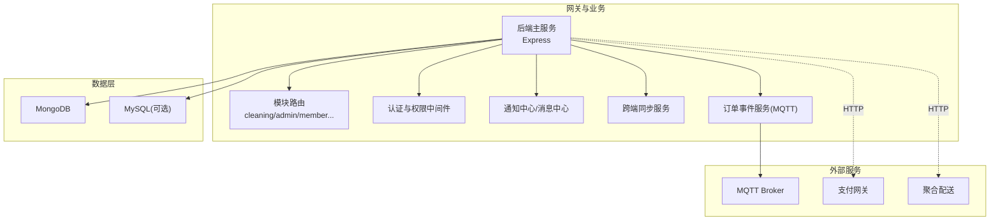

图表来源
- [backend/server.js:1-702](file://backend/server.js#L1-L702)
- [backend/config/index.js:1-167](file://backend/config/index.js#L1-L167)
- [backend/config/database.js:1-65](file://backend/config/database.js#L1-L65)
- [backend/services/orderEventService.js:1-168](file://backend/services/orderEventService.js#L1-L168)
- [api/payment-server/server.js:1-624](file://api/payment-server/server.js#L1-L624)
- [delivery-api/server.js:1-377](file://delivery-api/server.js#L1-L377)

章节来源
- [backend/server.js:1-702](file://backend/server.js#L1-L702)
- [backend/config/index.js:1-167](file://backend/config/index.js#L1-L167)
- [backend/config/database.js:1-65](file://backend/config/database.js#L1-L65)

## 核心组件
- API 网关与路由分发：按领域划分路由挂载，统一错误处理与健康检查
- 认证与授权：Bearer Token + 角色校验，开发模式兼容 mock/dev token
- 模块开关：基于配置动态启用/禁用业务模块
- 双数据库适配：MongoDB 与 MySQL 二选一，连接池与事务封装
- 实时通信：MQTT 客户端用于灯条控制与订单事件广播
- 通知与消息：通知中心（铃铛事件）、消息中心（客户/账户通讯）
- 跨端同步：index ↔ m-index 双向操作记录与心跳
- 支付网关：统一支付入口、多渠道回调、余额与结算
- 聚合配送：多服务商询价、下单、状态查询与取消

章节来源
- [backend/server.js:1-702](file://backend/server.js#L1-L702)
- [backend/modules/common/middlewares/auth.js:1-207](file://backend/modules/common/middlewares/auth.js#L1-L207)
- [backend/config/modules.js:1-203](file://backend/config/modules.js#L1-L203)
- [backend/config/index.js:1-167](file://backend/config/index.js#L1-L167)
- [backend/services/lightService.js:1-234](file://backend/services/lightService.js#L1-L234)
- [backend/services/orderEventService.js:1-168](file://backend/services/orderEventService.js#L1-L168)
- [backend/services/messageService.js:1-247](file://backend/services/messageService.js#L1-L247)
- [api/payment-server/server.js:1-624](file://api/payment-server/server.js#L1-L624)
- [delivery-api/server.js:1-377](file://delivery-api/server.js#L1-L377)

## 架构总览
系统采用“分层+模块化”的渐进式架构：
- 表现层：Web/H5/小程序通过 HTTP 调用后端 API
- 网关层：Express 统一入口，负责路由分发、中间件链、全局错误处理
- 业务层：按领域拆分的模块（清洗、回收、租赁、会员、管理等），通过服务层组织核心逻辑
- 基础设施层：数据库（MongoDB/MySQL）、MQTT Broker、缓存（预留 Redis）
- 外部集成：支付网关、聚合配送、第三方物流

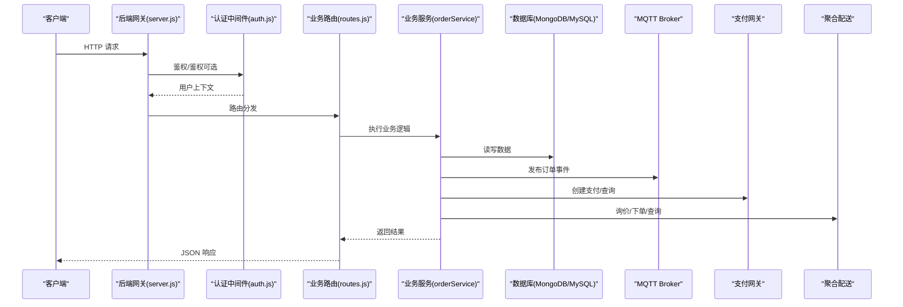

图表来源
- [backend/server.js:1-702](file://backend/server.js#L1-L702)
- [backend/modules/common/middlewares/auth.js:1-207](file://backend/modules/common/middlewares/auth.js#L1-L207)
- [backend/modules/cleaning/routes.js:1-800](file://backend/modules/cleaning/routes.js#L1-L800)
- [backend/services/orderEventService.js:1-168](file://backend/services/orderEventService.js#L1-L168)
- [api/payment-server/server.js:1-624](file://api/payment-server/server.js#L1-L624)
- [delivery-api/server.js:1-377](file://delivery-api/server.js#L1-L377)

## 详细组件分析

### API 网关与路由分发机制
- 启动流程：加载环境变量 → 初始化数据库 → 初始化 MQTT 客户端 → 注册中间件与路由 → 监听端口 → 优雅关闭
- 中间件体系：CORS、BodyParser、静态资源、全局错误处理、健康检查
- 路由挂载：按领域前缀挂载（/api/auth、/api/cleaning、/api/admin、/api/store 等），并暴露系统接口（/api/system/*）
- 模块开关：通过模块配置动态启用/禁用功能，并在启动时打印已启用与待开放模块

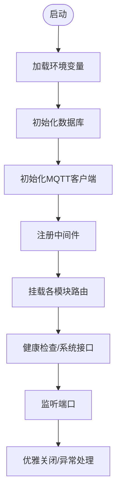

图表来源
- [backend/server.js:1-702](file://backend/server.js#L1-L702)
- [backend/config/index.js:1-167](file://backend/config/index.js#L1-L167)
- [backend/config/modules.js:1-203](file://backend/config/modules.js#L1-L203)

章节来源
- [backend/server.js:1-702](file://backend/server.js#L1-L702)
- [backend/config/modules.js:1-203](file://backend/config/modules.js#L1-L203)

### 认证与授权中间件
- 认证方式：从 Authorization 头解析 Bearer Token，支持开发模式下的 dev-admin、dev-chain、mock_token 快捷登录
- 用户上下文：将用户信息挂载到 req.user，包含角色、门店、信用分等
- 可选认证：部分接口允许匿名访问，但会尽量解析用户上下文
- 角色校验：提供 requireRoles 工厂函数进行细粒度权限控制

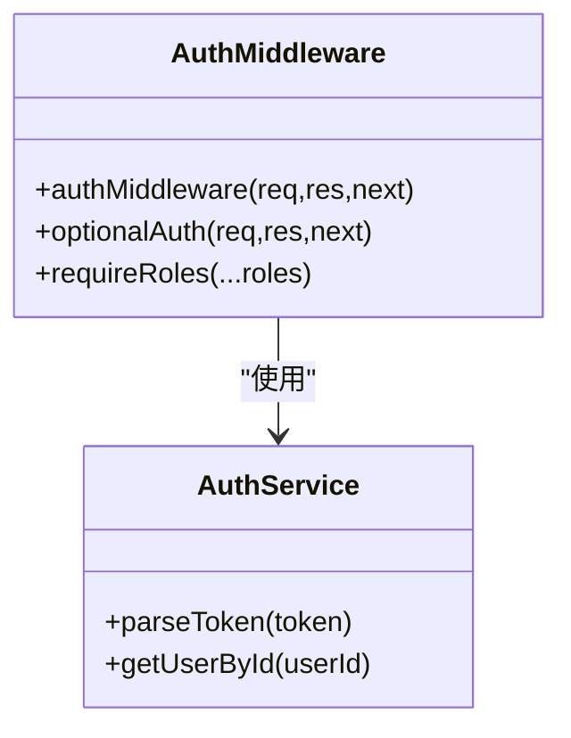

图表来源
- [backend/modules/common/middlewares/auth.js:1-207](file://backend/modules/common/middlewares/auth.js#L1-L207)

章节来源
- [backend/modules/common/middlewares/auth.js:1-207](file://backend/modules/common/middlewares/auth.js#L1-L207)

### 干洗业务模块（清洗）
- 路由范围：订单生命周期（创建、支付、取件、完成、取消）、智能灯条控制、定价与门店配置
- 用户识别：优先 JWT，其次 openid/phone，保证跨平台数据一致性
- 状态流转：支持多种状态与描述映射，便于前端展示
- 灯条联动：通过 MQTT 主题控制终端灯条，实现取货提示

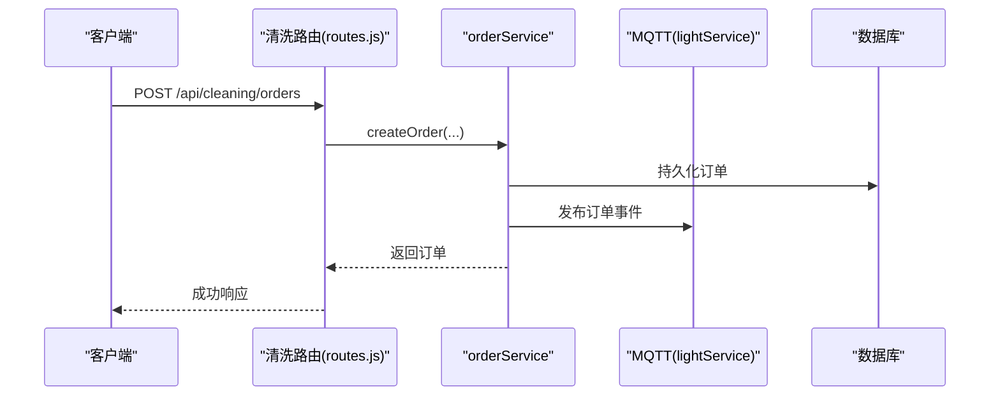

图表来源
- [backend/modules/cleaning/routes.js:1-800](file://backend/modules/cleaning/routes.js#L1-L800)
- [backend/services/orderEventService.js:1-168](file://backend/services/orderEventService.js#L1-L168)
- [backend/services/lightService.js:1-234](file://backend/services/lightService.js#L1-L234)

章节来源
- [backend/modules/cleaning/routes.js:1-800](file://backend/modules/cleaning/routes.js#L1-L800)

### 订单事件与实时同步
- 事件发布：在订单关键节点（创建、支付、取消、状态变更）通过 MQTT 广播
- 主题设计：门店级与全局级主题分离，便于不同端订阅
- 通知中心：将事件写入通知中心供 Admin 轮询
- 跨端同步：记录操作来源与时间戳，支撑 index ↔ m-index 双向同步

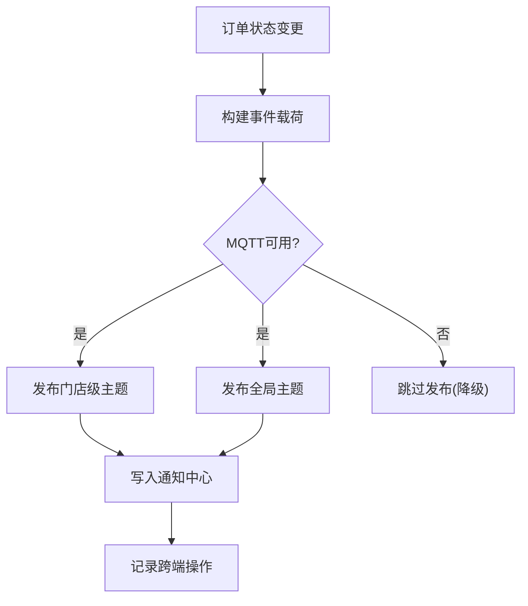

图表来源
- [backend/services/orderEventService.js:1-168](file://backend/services/orderEventService.js#L1-L168)
- [backend/services/lightService.js:1-234](file://backend/services/lightService.js#L1-L234)

章节来源
- [backend/services/orderEventService.js:1-168](file://backend/services/orderEventService.js#L1-L168)

### 通知中心与消息中心
- 通知中心：集中存储系统事件（如订单事件），支持分页与标记已读
- 消息中心：面向客户与账户的消息，支持线程聚合、未读数统计、过期清理
- 与订单事件联动：C端/微信侧操作自动产生客户消息

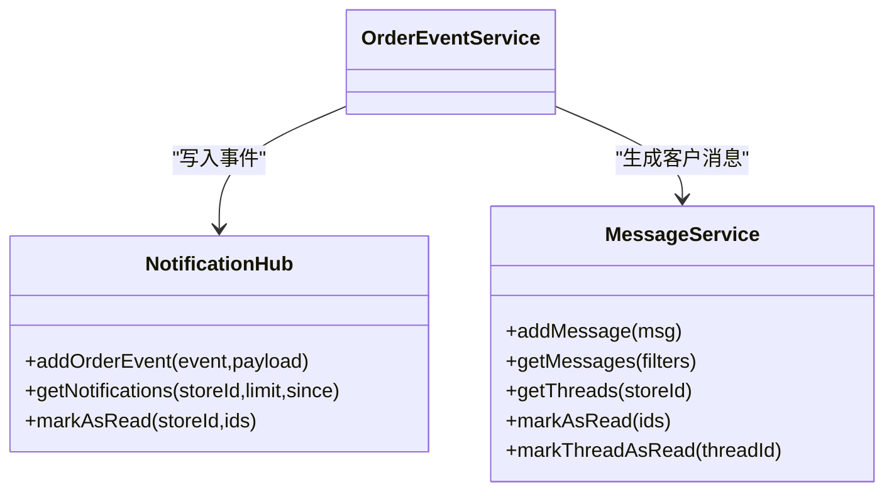

图表来源
- [backend/services/messageService.js:1-247](file://backend/services/messageService.js#L1-L247)
- [backend/services/orderEventService.js:1-168](file://backend/services/orderEventService.js#L1-L168)

章节来源
- [backend/services/messageService.js:1-247](file://backend/services/messageService.js#L1-L247)

### 支付网关（独立服务）
- 统一支付入口：POST /api/payment/create，支持微信、支付宝、银联、余额
- 支付查询与关闭：GET /api/payment/query/:id、POST /api/payment/close/:id
- 回调处理：多渠道签名验证与状态更新
- 余额与结算：用户余额查询/充值、门店结算与提现、报表生成

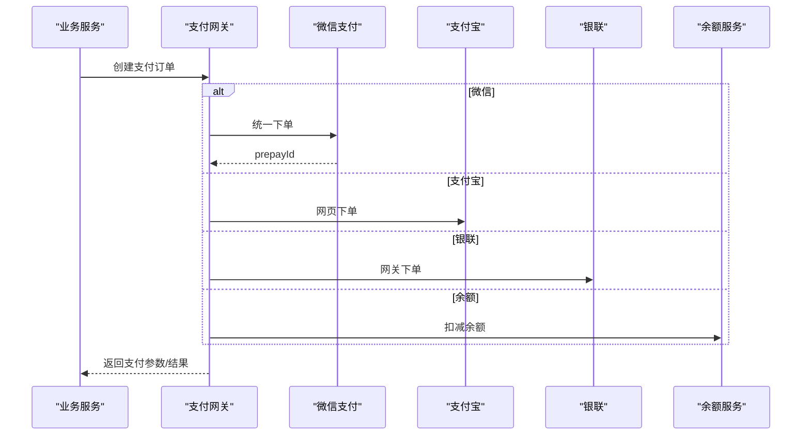

图表来源
- [api/payment-server/server.js:1-624](file://api/payment-server/server.js#L1-L624)

章节来源
- [api/payment-server/server.js:1-624](file://api/payment-server/server.js#L1-L624)

### 聚合配送（独立服务）
- 服务商抽象：美团、达达/京东秒送、顺丰同城
- 询价策略：最低价、最快、综合推荐
- 订单生命周期：创建、查询、取消，统一对外接口

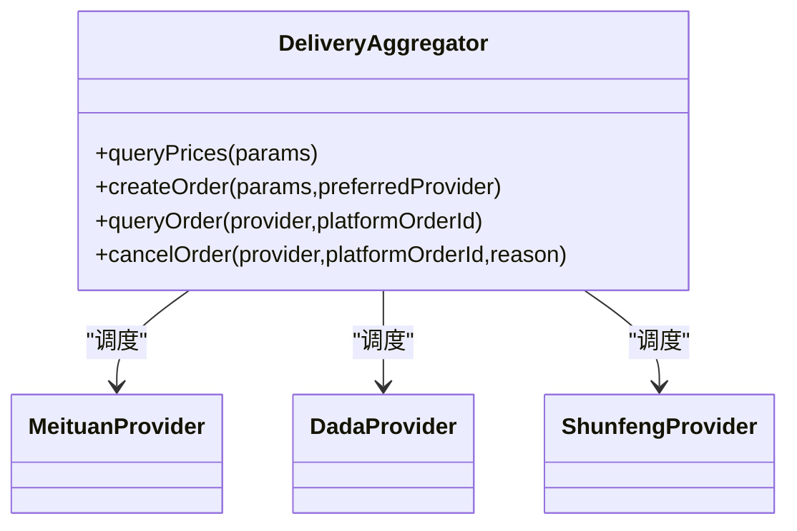

图表来源
- [delivery-api/aggregator.js:1-237](file://delivery-api/aggregator.js#L1-L237)
- [delivery-api/server.js:1-377](file://delivery-api/server.js#L1-L377)

章节来源
- [delivery-api/aggregator.js:1-237](file://delivery-api/aggregator.js#L1-L237)
- [delivery-api/server.js:1-377](file://delivery-api/server.js#L1-L377)

### 数据库适配与配置
- 双库支持：通过配置切换 MongoDB 或 MySQL，提供连接池与事务封装
- 连接管理：单例模式，初始化与关闭统一管控
- 便捷方法：query、transaction 简化常用操作

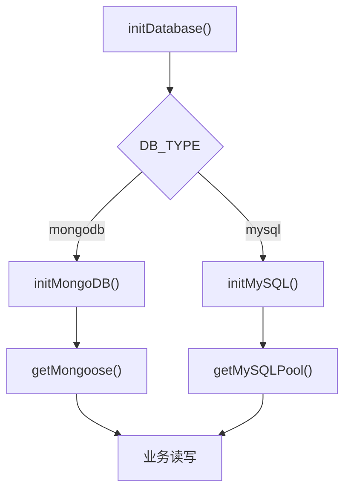

图表来源
- [backend/config/index.js:1-167](file://backend/config/index.js#L1-L167)
- [backend/config/database.js:1-65](file://backend/config/database.js#L1-L65)

章节来源
- [backend/config/index.js:1-167](file://backend/config/index.js#L1-L167)
- [backend/config/database.js:1-65](file://backend/config/database.js#L1-L65)

## 依赖关系分析
- 内部依赖
  - server.js 依赖 config/index.js（数据库）、config/modules.js（模块开关）、各模块路由与服务
  - cleaning/routes.js 依赖 orderService/pricingService 与认证/模块守卫中间件
  - orderEventService 依赖 lightService（MQTT）、notificationHubService、crossSyncService、messageService
- 外部依赖
  - Express、CORS、BodyParser、dotenv
  - MongoDB（mongoose）、MySQL（mysql2）
  - MQTT（mqtt 客户端）
  - 支付网关与聚合配送（HTTP 调用）

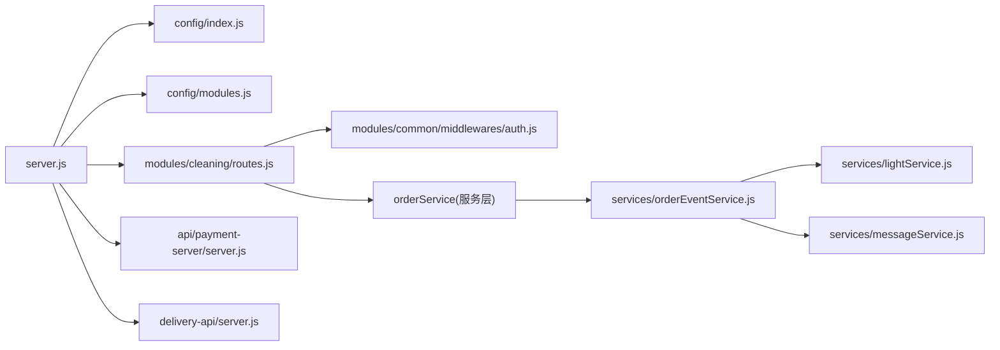

图表来源
- [backend/server.js:1-702](file://backend/server.js#L1-L702)
- [backend/config/index.js:1-167](file://backend/config/index.js#L1-L167)
- [backend/config/modules.js:1-203](file://backend/config/modules.js#L1-L203)
- [backend/modules/cleaning/routes.js:1-800](file://backend/modules/cleaning/routes.js#L1-L800)
- [backend/modules/common/middlewares/auth.js:1-207](file://backend/modules/common/middlewares/auth.js#L1-L207)
- [backend/services/orderEventService.js:1-168](file://backend/services/orderEventService.js#L1-L168)
- [backend/services/lightService.js:1-234](file://backend/services/lightService.js#L1-L234)
- [backend/services/messageService.js:1-247](file://backend/services/messageService.js#L1-L247)
- [api/payment-server/server.js:1-624](file://api/payment-server/server.js#L1-L624)
- [delivery-api/server.js:1-377](file://delivery-api/server.js#L1-L377)

章节来源
- [backend/server.js:1-702](file://backend/server.js#L1-L702)
- [backend/modules/cleaning/routes.js:1-800](file://backend/modules/cleaning/routes.js#L1-L800)
- [backend/services/orderEventService.js:1-168](file://backend/services/orderEventService.js#L1-L168)

## 性能与可扩展性
- 水平扩展
  - 无状态网关：Express 网关可多实例部署，配合负载均衡
  - 会话与状态外置：JWT 无状态认证，用户上下文不存本地
  - 数据库扩展：MongoDB 副本集/分片，MySQL 主从/集群
  - 消息队列：MQTT Broker 集群化部署，支持高并发推送
- 垂直扩展
  - 连接池调优：MySQL pool.max、MongoDB maxPoolSize 根据负载调整
  - 事件发布批量化：批量订单事件合并发布，降低网络开销
- 微服务拆分策略
  - 支付网关：已独立进程，具备独立扩缩容能力
  - 聚合配送：已独立进程，可按流量扩容
  - 订单服务：可从清洗模块中剥离为独立服务，解耦订单生命周期
  - 通知/消息中心：可独立为消息总线服务，支撑更多端接入
- 可靠性与容错
  - 优雅关闭：SIGTERM/SIGINT 处理，确保请求完成后再退出
  - 全局异常捕获：未捕获异常与未处理 Promise 拒绝保护
  - 降级策略：MQTT 不可用时跳过事件发布，不影响核心流程

[本节为通用指导，无需具体文件引用]

## 部署拓扑
- 单实例部署
  - 后端主服务 + 支付网关 + 聚合配送 三个进程运行在同一主机
  - 数据库：MongoDB/MySQL 本地或容器化（docker-compose）
  - MQTT Broker：本地 EMQX/NanoMQ
- 多实例扩展
  - 网关多实例：Nginx/云 LB 分发，共享数据库与 MQTT
  - 支付/配送独立扩缩：按 QPS/CPU 指标弹性伸缩
  - 数据库高可用：MongoDB 副本集、MySQL 主从/集群
  - 容器编排：Docker Compose/Kubernetes 管理多服务生命周期

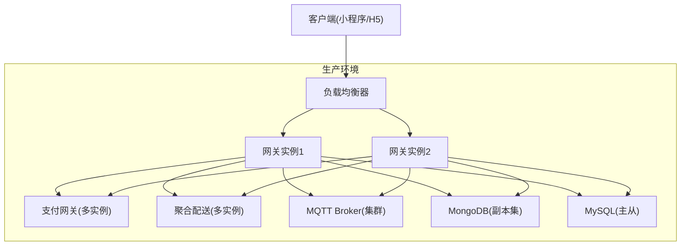

图表来源
- [backend/docker-compose.yml:1-34](file://backend/docker-compose.yml#L1-L34)
- [backend/server.js:1-702](file://backend/server.js#L1-L702)
- [api/payment-server/server.js:1-624](file://api/payment-server/server.js#L1-L624)
- [delivery-api/server.js:1-377](file://delivery-api/server.js#L1-L377)

章节来源
- [backend/docker-compose.yml:1-34](file://backend/docker-compose.yml#L1-L34)

## 故障排查指南
- 启动失败
  - 端口占用：检查 EADDRINUSE 日志，释放端口后重启
  - 数据库连接：确认 DB_TYPE 与连接参数，查看连接池初始化日志
- 认证问题
  - 检查 Authorization 头格式与 Token 有效性
  - 开发模式下确认 dev-admin/dev-chain/mock_token 是否生效
- 实时通信
  - MQTT 连接失败：检查 Broker 地址、端口、用户名密码与防火墙
  - 终端离线：检查心跳超时阈值与终端上报频率
- 支付回调
  - 签名验证失败：核对密钥与回调报文
  - 订单状态不一致：核对本地订单表与第三方支付流水
- 配送下单
  - 服务商不可用：检查配置开关与网络连通性
  - 价格差异：确认距离/重量/城市参数一致

章节来源
- [backend/server.js:1-702](file://backend/server.js#L1-L702)
- [backend/modules/common/middlewares/auth.js:1-207](file://backend/modules/common/middlewares/auth.js#L1-L207)
- [backend/services/lightService.js:1-234](file://backend/services/lightService.js#L1-L234)
- [api/payment-server/server.js:1-624](file://api/payment-server/server.js#L1-L624)
- [delivery-api/server.js:1-377](file://delivery-api/server.js#L1-L377)

## 结论
本架构以 Express 网关为核心，结合模块化与分层设计，实现了干洗业务的端到端闭环，并通过独立进程化的支付与配送服务提升可维护性与可扩展性。双数据库支持与 MQTT 实时通信满足多场景需求，统一的认证与权限模型保障安全可控。未来可在保持现有边界的条件下，逐步将订单、通知/消息等能力拆分为微服务，实现更灵活的弹性伸缩与团队自治。