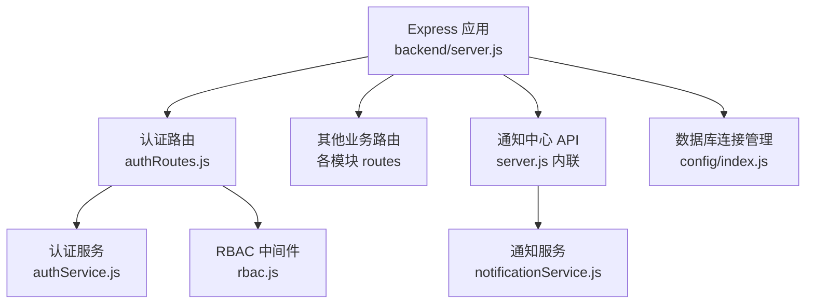
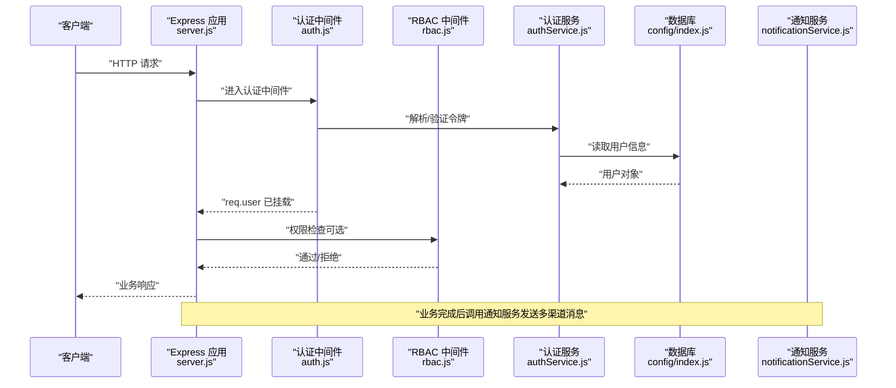
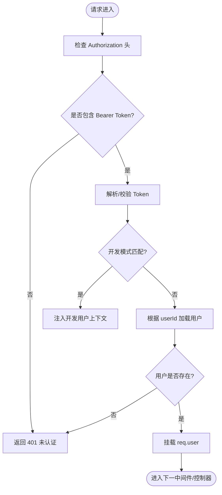
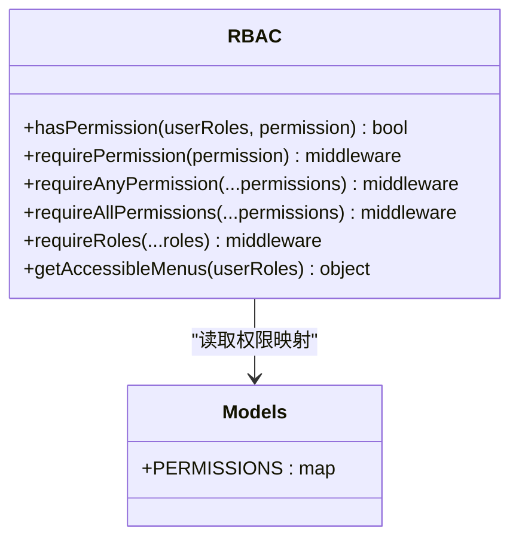
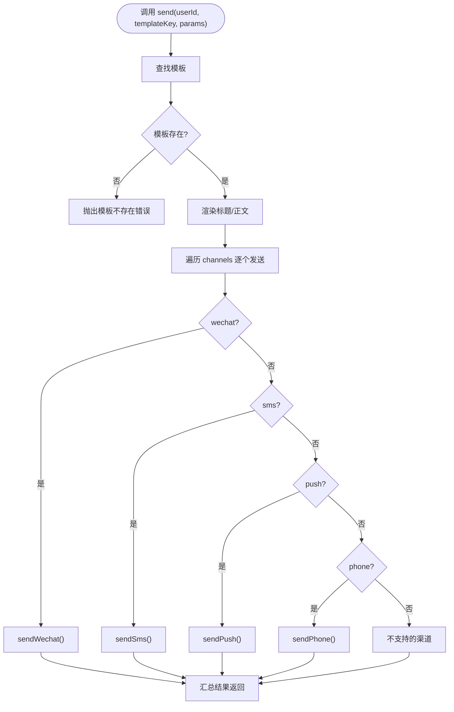
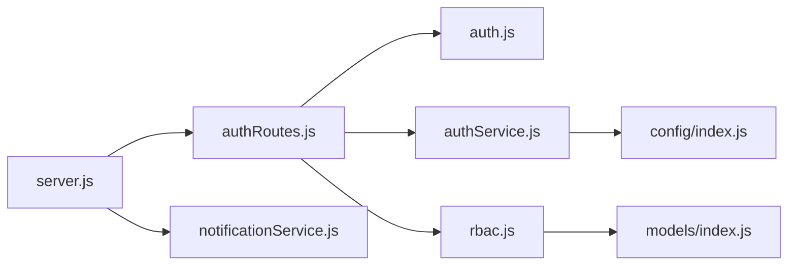

# 公共模块设计

<cite>
**本文引用的文件**   
- [backend/server.js](file://backend/server.js)
- [backend/config/index.js](file://backend/config/index.js)
- [backend/modules/common/middlewares/auth.js](file://backend/modules/common/middlewares/auth.js)
- [backend/modules/common/middlewares/rbac.js](file://backend/modules/common/middlewares/rbac.js)
- [backend/modules/common/services/authService.js](file://backend/modules/common/services/authService.js)
- [backend/modules/common/routes/authRoutes.js](file://backend/modules/common/routes/authRoutes.js)
- [backend/modules/common/models/index.js](file://backend/modules/common/models/index.js)
- [backend/modules/common/services/notificationService.js](file://backend/modules/common/services/notificationService.js)
</cite>

## 目录
1. [引言](#引言)
2. [项目结构](#项目结构)
3. [核心组件](#核心组件)
4. [架构总览](#架构总览)
5. [详细组件分析](#详细组件分析)
6. [依赖关系分析](#依赖关系分析)
7. [性能与可扩展性](#性能与可扩展性)
8. [故障排查指南](#故障排查指南)
9. [结论](#结论)
10. [附录：API规范与集成指南](#附录api规范与集成指南)

## 引言
本文件聚焦干洗店管理系统的“公共模块”设计，围绕横切关注点（认证、授权、错误处理、日志）以及通用服务（通知、权限模型、会话/令牌）进行系统化说明。目标是帮助业务模块正确复用这些能力，形成一致的安全策略、统一的错误响应格式和可观测的日志体系。

## 项目结构
后端采用 Express 模块化组织方式，公共能力集中在 backend/modules/common 下，包含中间件、路由、服务与数据模型定义；应用入口在 backend/server.js 中统一挂载各模块路由并配置全局错误处理。数据库连接由 backend/config/index.js 提供单例式初始化与事务封装。

图表来源
- [backend/server.js:1-152](file://backend/server.js#L1-L152)
- [backend/modules/common/routes/authRoutes.js:1-120](file://backend/modules/common/routes/authRoutes.js#L1-L120)
- [backend/modules/common/services/authService.js:1-120](file://backend/modules/common/services/authService.js#L1-L120)
- [backend/modules/common/middlewares/rbac.js:1-48](file://backend/modules/common/middlewares/rbac.js#L1-L48)
- [backend/modules/common/services/notificationService.js:1-60](file://backend/modules/common/services/notificationService.js#L1-L60)
- [backend/config/index.js:1-60](file://backend/config/index.js#L1-L60)

章节来源
- [backend/server.js:1-152](file://backend/server.js#L1-L152)
- [backend/config/index.js:1-60](file://backend/config/index.js#L1-L60)

## 核心组件
- 认证中间件与可选认证
  - 负责从请求头解析 Bearer Token，支持开发模式下的 mock 身份注入，校验失败返回统一未认证响应。
  - 提供可选认证中间件，允许接口在无登录态时继续执行但携带用户上下文（若存在）。
- RBAC 权限控制
  - 基于角色与权限映射表实现细粒度访问控制，支持“任一/全部”权限组合与菜单可见性计算。
- 认证服务
  - 提供注册、登录、微信登录、员工登录、密码修改、验证码等能力；内部维护用户模型与简化版令牌生成/解析。
- 通知服务
  - 按模板渲染消息内容，按渠道分发（微信、短信、推送、电话），当前为占位实现，便于后续接入第三方服务。
- 统一错误处理
  - 应用层全局异常捕获，输出标准化错误响应体，避免业务细节泄露。
- 数据库连接与事务
  - 单例化连接池/连接，提供便捷查询与事务封装，保障跨操作一致性。

章节来源
- [backend/modules/common/middlewares/auth.js:1-209](file://backend/modules/common/middlewares/auth.js#L1-L209)
- [backend/modules/common/middlewares/rbac.js:1-172](file://backend/modules/common/middlewares/rbac.js#L1-L172)
- [backend/modules/common/services/authService.js:1-498](file://backend/modules/common/services/authService.js#L1-L498)
- [backend/modules/common/services/notificationService.js:1-281](file://backend/modules/common/services/notificationService.js#L1-L281)
- [backend/server.js:598-609](file://backend/server.js#L598-L609)
- [backend/config/index.js:130-155](file://backend/config/index.js#L130-L155)

## 架构总览
下图展示认证授权链路、通知服务与全局错误处理的交互关系。

图表来源
- [backend/server.js:96-152](file://backend/server.js#L96-L152)
- [backend/modules/common/middlewares/auth.js:10-138](file://backend/modules/common/middlewares/auth.js#L10-L138)
- [backend/modules/common/middlewares/rbac.js:34-92](file://backend/modules/common/middlewares/rbac.js#L34-L92)
- [backend/modules/common/services/authService.js:469-498](file://backend/modules/common/services/authService.js#L469-L498)
- [backend/config/index.js:19-88](file://backend/config/index.js#L19-L88)
- [backend/modules/common/services/notificationService.js:177-230](file://backend/modules/common/services/notificationService.js#L177-L230)

## 详细组件分析

### 认证与令牌管理
- 令牌机制
  - 服务端生成 Base64 编码的令牌，包含用户ID与时间戳；中间件解析后加载用户上下文到 req.user。
  - 开发环境支持多种模拟令牌前缀，快速获得管理员/连锁管理员/普通用户身份。
- 会话控制
  - 无状态令牌方案，不依赖服务端会话存储；如需强制失效或黑名单，可在现有解析逻辑基础上扩展校验。
- 微信登录
  - 支持网页端与小程序端两种流程：前者通过 OAuth 回调获取 openid，后者通过 code 换取 session_key 与 openid，随后走统一登录/注册路径。
- 员工登录
  - 支持手机号/工号登录，返回 token、用户信息、门店信息与前端权限/菜单集合，便于 M 端渲染。

图表来源
- [backend/modules/common/middlewares/auth.js:10-138](file://backend/modules/common/middlewares/auth.js#L10-L138)
- [backend/modules/common/services/authService.js:469-498](file://backend/modules/common/services/authService.js#L469-L498)

章节来源
- [backend/modules/common/middlewares/auth.js:1-209](file://backend/modules/common/middlewares/auth.js#L1-L209)
- [backend/modules/common/services/authService.js:1-498](file://backend/modules/common/services/authService.js#L1-L498)
- [backend/modules/common/routes/authRoutes.js:127-259](file://backend/modules/common/routes/authRoutes.js#L127-L259)
- [backend/modules/common/routes/authRoutes.js:444-490](file://backend/modules/common/routes/authRoutes.js#L444-L490)
- [backend/modules/common/routes/authRoutes.js:267-379](file://backend/modules/common/routes/authRoutes.js#L267-L379)

### RBAC 权限模型与菜单控制
- 权限定义
  - 集中定义资源级权限标识与允许的角色集合，admin 拥有所有权限，* 表示所有人。
- 中间件组合
  - requirePermission：单一权限校验
  - requireAnyPermission：多权限满足其一即可
  - requireAllPermissions：多权限需全部满足
  - requireRoles：直接按角色判断
- 菜单可见性
  - 根据用户角色过滤菜单项，结合模块开关与角色白名单，动态返回前端可用导航。

图表来源
- [backend/modules/common/middlewares/rbac.js:1-172](file://backend/modules/common/middlewares/rbac.js#L1-L172)
- [backend/modules/common/models/index.js:735-777](file://backend/modules/common/models/index.js#L735-L777)

章节来源
- [backend/modules/common/middlewares/rbac.js:1-172](file://backend/modules/common/middlewares/rbac.js#L1-L172)
- [backend/modules/common/models/index.js:735-777](file://backend/modules/common/models/index.js#L735-L777)

### 通知服务（多渠道消息推送）
- 模板管理
  - 按业务域（清洗、回收、租赁、系统）组织模板，标题与正文支持变量替换。
- 渠道分发
  - 支持微信订阅消息、短信、App 推送、电话语音等渠道；当前为占位实现，预留扩展点。
- 发送队列
  - 当前同步发送，可按需引入异步队列（如 Redis/RabbitMQ）提升吞吐与可靠性。

图表来源
- [backend/modules/common/services/notificationService.js:177-281](file://backend/modules/common/services/notificationService.js#L177-L281)

章节来源
- [backend/modules/common/services/notificationService.js:1-281](file://backend/modules/common/services/notificationService.js#L1-L281)

### 错误处理框架
- 统一错误响应
  - 应用层全局错误处理器捕获未处理异常，返回标准 JSON 结构，包含 success、error、message 字段。
- 业务异常
  - 业务层抛错由路由层 try/catch 捕获并转换为 4xx/5xx 响应，保持对外一致性。
- 进程级保护
  - 监听 uncaughtException/unhandledRejection，记录日志并优雅退出或保持运行，避免崩溃扩散。

章节来源
- [backend/server.js:598-609](file://backend/server.js#L598-L609)
- [backend/server.js:679-691](file://backend/server.js#L679-L691)
- [backend/modules/common/routes/authRoutes.js:17-43](file://backend/modules/common/routes/authRoutes.js#L17-L43)

### 日志记录系统
- 现状
  - 使用 console.log/console.error 输出关键节点日志，包括启动、数据库连接、支付回调、通知中心等。
- 建议
  - 引入结构化日志库（如 pino/winston），统一日志级别（info/warn/error/debug）、traceId 透传、按模块/接口维度聚合，便于 ELK/Loki 采集与分析。
  - 敏感字段脱敏（密码、token、openid 等），避免泄露。

章节来源
- [backend/server.js:615-696](file://backend/server.js#L615-L696)
- [backend/config/index.js:30-88](file://backend/config/index.js#L30-L88)

## 依赖关系分析
- 模块耦合
  - server.js 作为装配器，依赖各模块路由与服务；认证相关强依赖 authService 与中间件；通知服务独立，易于替换实现。
- 外部依赖
  - 数据库：MongoDB/MySQL 双栈，通过 config/index.js 抽象；微信支付/支付宝/银联等支付通道位于 api/payment-server。
- 潜在循环
  - 当前未见明显循环依赖；注意在 authService 中按需延迟引入模型以避免启动期加载开销。

图表来源
- [backend/server.js:96-152](file://backend/server.js#L96-L152)
- [backend/modules/common/routes/authRoutes.js:1-120](file://backend/modules/common/routes/authRoutes.js#L1-L120)
- [backend/modules/common/middlewares/auth.js:1-60](file://backend/modules/common/middlewares/auth.js#L1-L60)
- [backend/modules/common/services/authService.js:1-60](file://backend/modules/common/services/authService.js#L1-L60)
- [backend/config/index.js:1-60](file://backend/config/index.js#L1-L60)
- [backend/modules/common/services/notificationService.js:1-60](file://backend/modules/common/services/notificationService.js#L1-L60)
- [backend/modules/common/middlewares/rbac.js:1-48](file://backend/modules/common/middlewares/rbac.js#L1-L48)
- [backend/modules/common/models/index.js:735-777](file://backend/modules/common/models/index.js#L735-L777)

章节来源
- [backend/server.js:96-152](file://backend/server.js#L96-L152)
- [backend/modules/common/routes/authRoutes.js:1-120](file://backend/modules/common/routes/authRoutes.js#L1-L120)
- [backend/modules/common/middlewares/auth.js:1-60](file://backend/modules/common/middlewares/auth.js#L1-L60)
- [backend/modules/common/services/authService.js:1-60](file://backend/modules/common/services/authService.js#L1-L60)
- [backend/config/index.js:1-60](file://backend/config/index.js#L1-L60)
- [backend/modules/common/services/notificationService.js:1-60](file://backend/modules/common/services/notificationService.js#L1-L60)
- [backend/modules/common/middlewares/rbac.js:1-48](file://backend/modules/common/middlewares/rbac.js#L1-L48)
- [backend/modules/common/models/index.js:735-777](file://backend/modules/common/models/index.js#L735-L777)

## 性能与可扩展性
- 令牌解析
  - 当前为轻量 Base64 解码+内存用户查询，QPS 较高时可考虑引入缓存（Redis）减少数据库压力。
- 通知发送
  - 当前同步发送，高并发场景建议改为异步队列，增加重试与死信队列，保证最终一致性。
- 数据库连接
  - MySQL 连接池参数可调；MongoDB 连接事件监听已完善，生产建议开启连接池与重连策略。
- 错误与日志
  - 建议引入结构化日志与链路追踪，降低定位成本；对高频接口增加慢查询告警。

[本节为通用指导，无需代码引用]

## 故障排查指南
- 认证失败
  - 检查 Authorization 头是否为 Bearer 格式；确认 Token 未过期；查看中间件返回的错误码与 needLogin 标志。
- 权限不足
  - 核对用户 roles 与所需权限映射；确认 RBAC 中间件是否正确挂载于路由。
- 通知未送达
  - 检查模板 key 是否存在；确认渠道实现是否已接入；查看各渠道返回的 messageId 与错误信息。
- 数据库连接异常
  - 查看 initDatabase 日志；确认 .env 配置；检查连接池耗尽与超时设置。
- 全局异常
  - 关注 server.js 中的全局错误处理器与进程异常监听日志，定位未捕获异常来源。

章节来源
- [backend/modules/common/middlewares/auth.js:10-138](file://backend/modules/common/middlewares/auth.js#L10-L138)
- [backend/modules/common/middlewares/rbac.js:34-92](file://backend/modules/common/middlewares/rbac.js#L34-L92)
- [backend/modules/common/services/notificationService.js:188-230](file://backend/modules/common/services/notificationService.js#L188-L230)
- [backend/config/index.js:30-88](file://backend/config/index.js#L30-L88)
- [backend/server.js:598-609](file://backend/server.js#L598-L609)

## 结论
公共模块以“中间件+服务+模型”的方式将认证、授权、通知与错误处理等横切能力解耦，既保证了业务模块的简洁性，又提供了良好的扩展点。建议在后续迭代中完善日志体系、引入异步通知队列与令牌缓存，进一步提升稳定性与性能。

[本节为总结性内容，无需代码引用]

## 附录：API规范与集成指南

### 认证相关接口
- 发送验证码
  - POST /api/auth/send-code
  - 请求体：{ phone, type? }
  - 响应：{ success, data }
- 验证验证码
  - POST /api/auth/verify-code
  - 请求体：{ phone, code }
  - 响应：{ success, data: { verified } }
- 用户注册
  - POST /api/auth/register
  - 请求体：{ phone, password, code?, name? }
  - 响应：{ success, data: { user, token } }
- 用户登录
  - POST /api/auth/login
  - 请求体：{ phone, password }
  - 响应：{ success, data: { user, token } }
- 微信网页授权
  - GET /api/auth/wechat/authorize
  - 响应：{ success, data: { authorizeUrl, appId, isWebAuthorize } }
- 微信网页授权回调
  - GET /api/auth/wechat/callback
  - 查询参数：code, state
  - 行为：重定向至前端页面并附带 token/openid
- 微信小程序登录
  - POST /api/auth/wxmini-login
  - 请求体：{ code, nickname?, avatarUrl?, gender? }
  - 响应：{ success, data: { user, token, openid, session_key } }
- 员工登录（M 端）
  - POST /api/auth/staff-login
  - 请求体：{ account, password, openid? }
  - 响应：{ success, data: { token, user, store?, permissions, menus, openid } }
- 获取/更新个人信息
  - GET /api/auth/profile
  - PUT /api/auth/profile
  - 需要认证：是（Bearer Token）
- 修改密码
  - POST /api/auth/change-password
  - 需要认证：是
- 忘记密码
  - POST /api/auth/forgot-password
  - 请求体：{ phone, code, password }
- 退出登录
  - POST /api/auth/logout
  - 需要认证：是

章节来源
- [backend/modules/common/routes/authRoutes.js:17-121](file://backend/modules/common/routes/authRoutes.js#L17-L121)
- [backend/modules/common/routes/authRoutes.js:127-259](file://backend/modules/common/routes/authRoutes.js#L127-L259)
- [backend/modules/common/routes/authRoutes.js:267-379](file://backend/modules/common/routes/authRoutes.js#L267-L379)
- [backend/modules/common/routes/authRoutes.js:444-490](file://backend/modules/common/routes/authRoutes.js#L444-L490)
- [backend/modules/common/routes/authRoutes.js:496-583](file://backend/modules/common/routes/authRoutes.js#L496-L583)

### 通知服务使用指南
- 调用方式
  - 在服务层调用 notificationService.send(userId, templateKey, params)
  - templateKey 示例：cleaning.order_completed、recycle.price_assigned、rental.due_today、system.password_changed
- 模板变量
  - 使用 {key} 语法在模板中插入变量，如 {orderNo}、{amount}、{storeName}
- 渠道
  - wechat/sms/push/phone，具体实现可在对应方法中接入第三方 SDK

章节来源
- [backend/modules/common/services/notificationService.js:177-281](file://backend/modules/common/services/notificationService.js#L177-L281)

### 错误响应规范
- 成功响应
  - { success: true, data?: any }
- 失败响应
  - { success: false, error: string, message?: string }
- 常见错误码
  - 401：未认证/登录过期
  - 403：权限不足
  - 400：参数错误
  - 500：服务器内部错误

章节来源
- [backend/server.js:598-609](file://backend/server.js#L598-L609)
- [backend/modules/common/middlewares/auth.js:10-138](file://backend/modules/common/middlewares/auth.js#L10-L138)
- [backend/modules/common/middlewares/rbac.js:34-92](file://backend/modules/common/middlewares/rbac.js#L34-L92)

### 权限与菜单
- 权限标识
  - 参考 models/index.js 中 PERMISSIONS 定义，按资源与动作划分
- 菜单可见性
  - 使用 getAccessibleMenus(userRoles) 计算，结合模块开关与角色白名单

章节来源
- [backend/modules/common/models/index.js:735-777](file://backend/modules/common/models/index.js#L735-L777)
- [backend/modules/common/middlewares/rbac.js:120-162](file://backend/modules/common/middlewares/rbac.js#L120-L162)