# 支付服务模块

<cite>
**本文引用的文件**   
- [api/payment-server/README.md](file://api/payment-server/README.md)
- [api/payment-server/server.js](file://api/payment-server/server.js)
- [api/payment-server/config.js](file://api/payment-server/config.js)
- [api/payment-server/wechat-pay.js](file://api/payment-server/wechat-pay.js)
- [api/payment-server/alipay.js](file://api/payment-server/alipay.js)
- [api/payment-server/unionpay.js](file://api/payment-server/unionpay.js)
- [api/payment-server/balance.js](file://api/payment-server/balance.js)
- [backend/modules/common/services/paymentService.js](file://backend/modules/common/services/paymentService.js)
- [backend/modules/common/services/wechatPayService.js](file://backend/modules/common/services/wechatPayService.js)
- [backend/modules/common/routes/paymentRoutes.js](file://backend/modules/common/routes/paymentRoutes.js)
- [backend/modules/common/middlewares/auth.js](file://backend/modules/common/middlewares/auth.js)
- [api/payment-api.js](file://api/payment-api.js)
</cite>

## 目录
1. [引言](#引言)
2. [项目结构](#项目结构)
3. [核心组件](#核心组件)
4. [架构总览](#架构总览)
5. [详细组件分析](#详细组件分析)
6. [依赖关系分析](#依赖关系分析)
7. [性能与可靠性](#性能与可靠性)
8. [故障排查指南](#故障排查指南)
9. [结论](#结论)
10. [附录：API接口规范](#附录api接口规范)

## 引言
本模块为干洗店管理系统的支付服务，提供统一支付网关、多支付渠道抽象（微信、支付宝、银联、余额）、标准化支付流程与异常处理机制。重点覆盖微信支付集成（JSAPI、扫码、退款、回调验签）、支付状态同步（异步通知、幂等性、对账思路）、安全策略（签名验证、金额校验、防重放、数据加密），并提供支付相关API接口规范、测试指南与生产部署注意事项。

## 项目结构
支付服务由两部分组成：
- 独立支付网关服务（Node/Express）：负责统一入口、路由分发、渠道对接、回调处理、结算与余额管理。
- 后端业务侧支付能力：在业务后端中暴露统一支付路由，调用微信支付V3能力，并集成认证中间件。

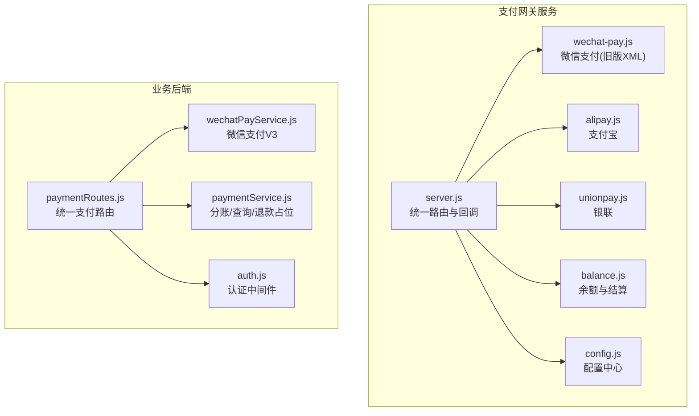

图示来源
- [api/payment-server/server.js:1-624](file://api/payment-server/server.js#L1-L624)
- [api/payment-server/config.js:1-80](file://api/payment-server/config.js#L1-L80)
- [api/payment-server/wechat-pay.js:1-314](file://api/payment-server/wechat-pay.js#L1-L314)
- [api/payment-server/alipay.js:1-336](file://api/payment-server/alipay.js#L1-L336)
- [api/payment-server/unionpay.js:1-501](file://api/payment-server/unionpay.js#L1-L501)
- [api/payment-server/balance.js:1-524](file://api/payment-server/balance.js#L1-L524)
- [backend/modules/common/routes/paymentRoutes.js:1-215](file://backend/modules/common/routes/paymentRoutes.js#L1-L215)
- [backend/modules/common/services/wechatPayService.js:1-396](file://backend/modules/common/services/wechatPayService.js#L1-L396)
- [backend/modules/common/services/paymentService.js:1-185](file://backend/modules/common/services/paymentService.js#L1-L185)
- [backend/modules/common/middlewares/auth.js:1-209](file://backend/modules/common/middlewares/auth.js#L1-L209)

章节来源
- [api/payment-server/README.md:1-481](file://api/payment-server/README.md#L1-L481)

## 核心组件
- 统一支付网关（server.js）
  - 统一创建订单、查询、关闭；按支付方式分发到对应渠道；维护内存订单映射；处理各渠道回调。
- 渠道适配层
  - 微信支付（旧版XML）：统一下单、查询、关闭、退款、回调验签、小程序调起参数生成。
  - 支付宝：网页/手机网站支付、查询、关闭、退款、RSA2签名与验签。
  - 银联：网关支付、查询、撤销、退款、表单构建与签名。
  - 余额：用户余额扣减、充值、交易记录、门店结算与提现。
- 业务后端支付路由（paymentRoutes.js）
  - 基于认证中间件的统一支付入口，支持JSAPI/App/H5及余额支付，调用微信支付V3服务。
- 微信支付V3服务（wechatPayService.js）
  - JSAPI/App/H5下单、查询、关闭、退款、回调签名验证与解密、模板消息通知。
- 统一支付服务（paymentService.js）
  - 面向业务的统一创建支付、分账计算（干洗/回收/租赁）、退款与查询占位实现。

章节来源
- [api/payment-server/server.js:1-624](file://api/payment-server/server.js#L1-L624)
- [api/payment-server/wechat-pay.js:1-314](file://api/payment-server/wechat-pay.js#L1-L314)
- [api/payment-server/alipay.js:1-336](file://api/payment-server/alipay.js#L1-L336)
- [api/payment-server/unionpay.js:1-501](file://api/payment-server/unionpay.js#L1-L501)
- [api/payment-server/balance.js:1-524](file://api/payment-server/balance.js#L1-L524)
- [backend/modules/common/routes/paymentRoutes.js:1-215](file://backend/modules/common/routes/paymentRoutes.js#L1-L215)
- [backend/modules/common/services/wechatPayService.js:1-396](file://backend/modules/common/services/wechatPayService.js#L1-L396)
- [backend/modules/common/services/paymentService.js:1-185](file://backend/modules/common/services/paymentService.js#L1-L185)

## 架构总览
统一支付网关采用“路由分发 + 渠道适配器”的架构，屏蔽多渠道差异，对外暴露统一接口；业务后端通过统一路由接入微信支付V3能力，并与认证、订单、通知等服务协作。

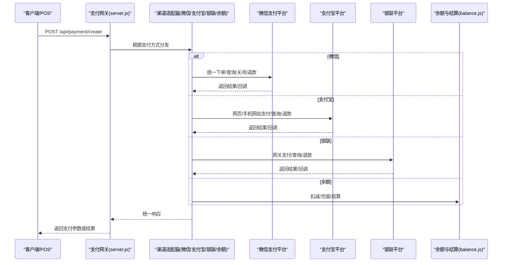

图示来源
- [api/payment-server/server.js:1-624](file://api/payment-server/server.js#L1-L624)
- [api/payment-server/wechat-pay.js:1-314](file://api/payment-server/wechat-pay.js#L1-L314)
- [api/payment-server/alipay.js:1-336](file://api/payment-server/alipay.js#L1-L336)
- [api/payment-server/unionpay.js:1-501](file://api/payment-server/unionpay.js#L1-L501)
- [api/payment-server/balance.js:1-524](file://api/payment-server/balance.js#L1-L524)

## 详细组件分析

### 统一支付网关（server.js）
- 统一入口
  - 创建订单：POST /api/payment/create，按 paymentMethod 分发至微信/支付宝/银联/余额。
  - 查询订单：GET /api/payment/query/:orderId，按渠道查询并更新本地状态。
  - 关闭订单：POST /api/payment/close/:orderId，按渠道关闭。
- 回调处理
  - 微信：POST /api/payment/wechat/notify，验签后更新订单并记录结算。
  - 支付宝：POST /api/payment/alipay/notify，验签后更新订单并记录结算。
  - 银联：POST /api/payment/unionpay/notify，验签后更新订单并记录结算。
- 余额与结算
  - 获取余额、交易记录、充值；门店结算信息、结算记录、发起结算、提现、报表。

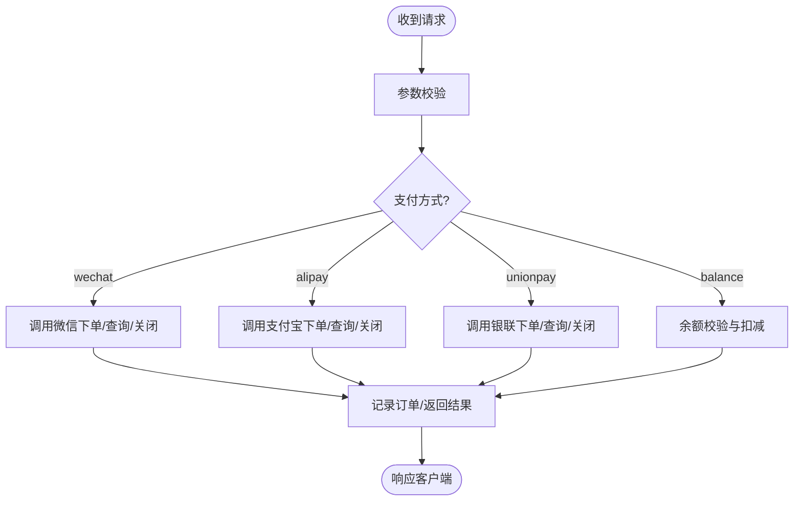

图示来源
- [api/payment-server/server.js:1-624](file://api/payment-server/server.js#L1-L624)

章节来源
- [api/payment-server/server.js:1-624](file://api/payment-server/server.js#L1-L624)

### 微信支付集成（旧版XML）
- 能力
  - 统一下单（JSAPI/NATIVE/MWEB）、查询、关闭、退款。
  - 回调签名验证、小程序调起参数生成。
- 关键点
  - 金额单位：元转分。
  - 签名算法：MD5拼接key。
  - 回调验签：去除sign后排序拼接再计算签名对比。
  - 小程序参数：appId、timeStamp、nonceStr、package、signType、paySign。

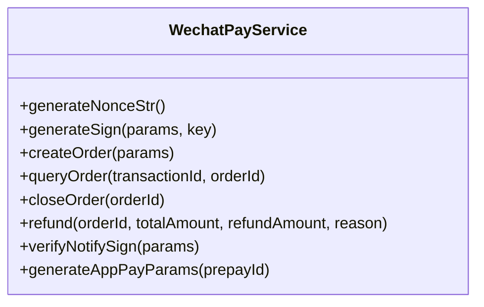

图示来源
- [api/payment-server/wechat-pay.js:1-314](file://api/payment-server/wechat-pay.js#L1-L314)

章节来源
- [api/payment-server/wechat-pay.js:1-314](file://api/payment-server/wechat-pay.js#L1-L314)

### 微信支付V3（业务后端）
- 能力
  - JSAPI/App/H5统一下单、查询、关闭、退款。
  - 回调签名验证与AES-GCM解密。
  - 发送支付成功通知（模板消息）。
- 关键点
  - V3签名：HMAC-SHA256或RSA-SHA256。
  - 回调头：wechatpay-signature、wechatpay-timestamp、wechatpay-nonce。
  - 金额单位：分。

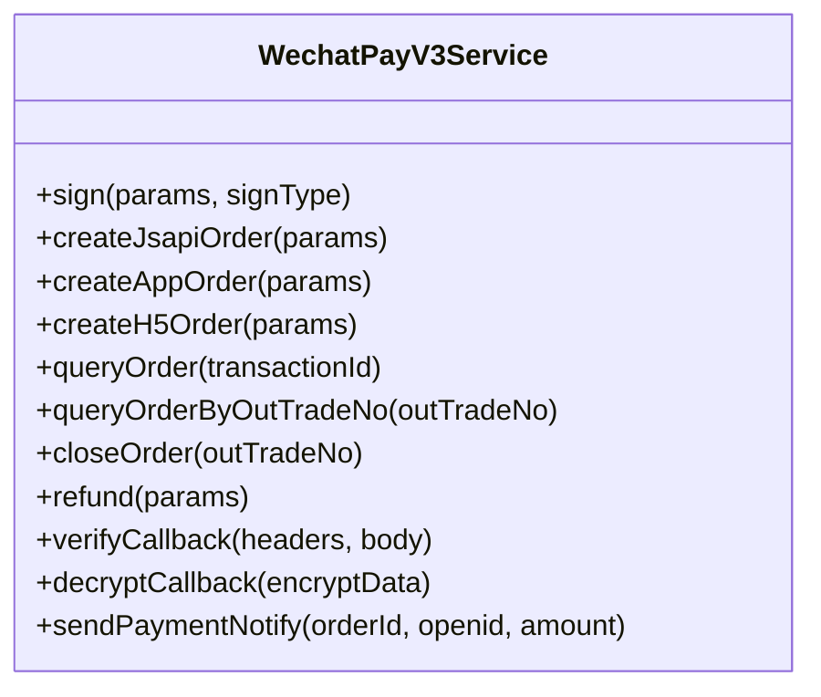

图示来源
- [backend/modules/common/services/wechatPayService.js:1-396](file://backend/modules/common/services/wechatPayService.js#L1-L396)

章节来源
- [backend/modules/common/services/wechatPayService.js:1-396](file://backend/modules/common/services/wechatPayService.js#L1-L396)

### 支付宝集成
- 能力
  - 电脑网站/手机网站支付、查询、关闭、退款。
  - RSA2签名与验签。
- 关键点
  - 签名内容：键值对排序+私钥签名。
  - 回调验签：使用支付宝公钥验签。

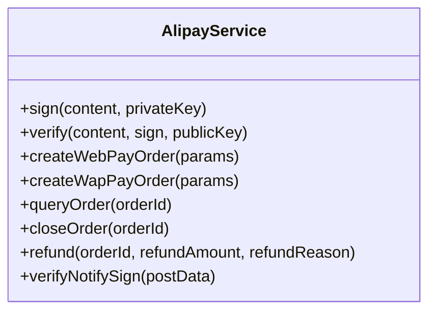

图示来源
- [api/payment-server/alipay.js:1-336](file://api/payment-server/alipay.js#L1-L336)

章节来源
- [api/payment-server/alipay.js:1-336](file://api/payment-server/alipay.js#L1-L336)

### 银联集成
- 能力
  - 网关支付（PC/移动）、查询、撤销、退款。
  - SHA256签名与验签、表单构建。
- 关键点
  - 金额单位：分。
  - 客户敏感信息加密（示例为Base64，实际需按银联要求）。

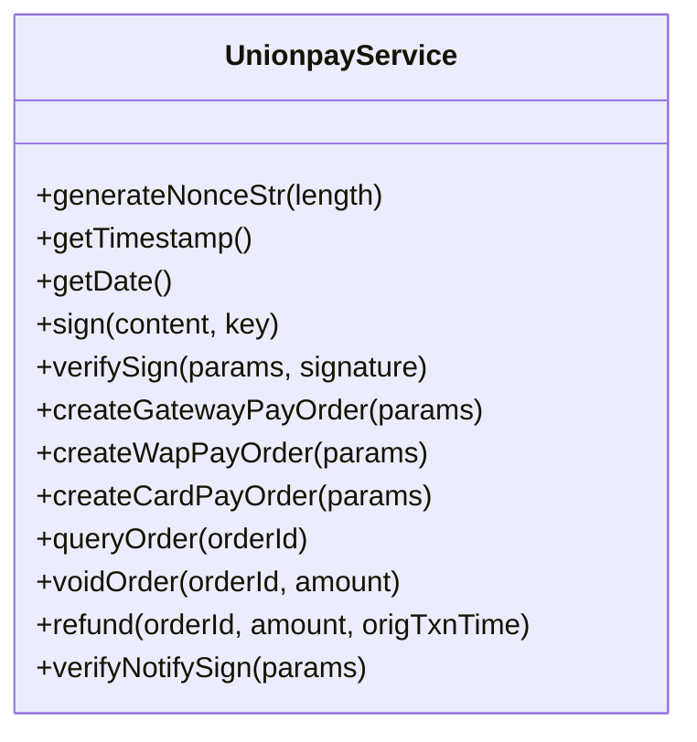

图示来源
- [api/payment-server/unionpay.js:1-501](file://api/payment-server/unionpay.js#L1-L501)

章节来源
- [api/payment-server/unionpay.js:1-501](file://api/payment-server/unionpay.js#L1-L501)

### 余额与结算
- 能力
  - 用户余额查询、扣减、充值、交易记录分页。
  - 门店账户信息、待结算金额、结算周期、提现、财务报表。
- 关键点
  - 订单完成后记录平台服务费与门店应结金额。
  - 提现冻结与手续费模拟。

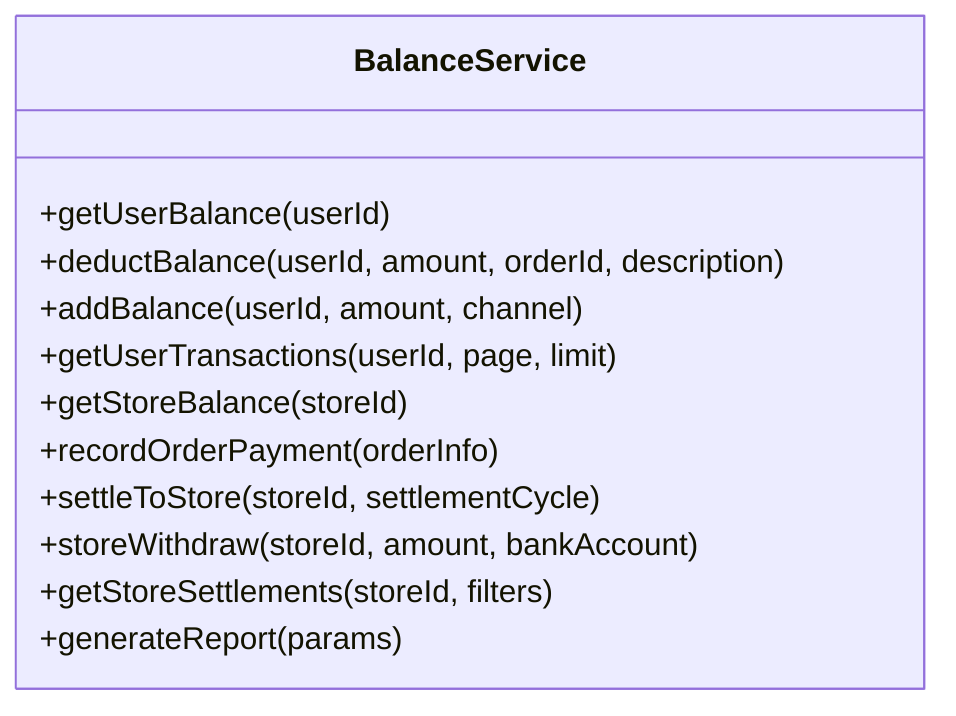

图示来源
- [api/payment-server/balance.js:1-524](file://api/payment-server/balance.js#L1-L524)

章节来源
- [api/payment-server/balance.js:1-524](file://api/payment-server/balance.js#L1-L524)

### 业务后端统一支付路由
- 能力
  - 认证保护下的统一创建支付（JSAPI/App/H5/余额）。
  - 查询支付状态、申请退款。
  - 微信支付V3回调处理（验签、解密、更新订单、通知）。
- 关键点
  - 认证中间件支持开发模式Token与mock_token。
  - 回调路径动态构造，确保公网可达。

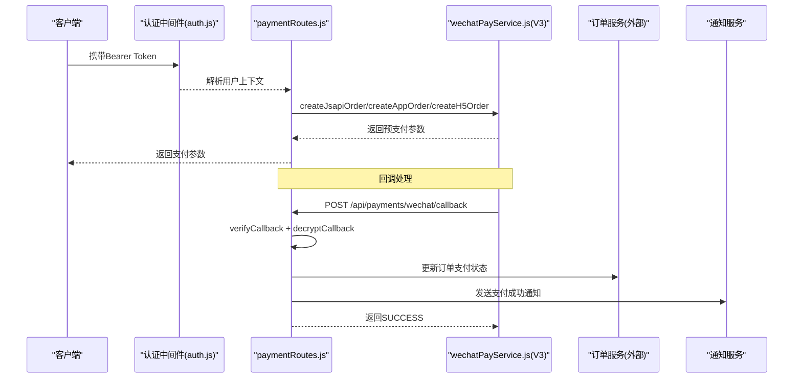

图示来源
- [backend/modules/common/routes/paymentRoutes.js:1-215](file://backend/modules/common/routes/paymentRoutes.js#L1-L215)
- [backend/modules/common/services/wechatPayService.js:1-396](file://backend/modules/common/services/wechatPayService.js#L1-L396)
- [backend/modules/common/middlewares/auth.js:1-209](file://backend/modules/common/middlewares/auth.js#L1-L209)

章节来源
- [backend/modules/common/routes/paymentRoutes.js:1-215](file://backend/modules/common/routes/paymentRoutes.js#L1-L215)
- [backend/modules/common/middlewares/auth.js:1-209](file://backend/modules/common/middlewares/auth.js#L1-L209)

### 统一支付服务（分账与占位）
- 能力
  - 统一创建支付（微信/支付宝/银联/余额）。
  - 分账逻辑：干洗（平台抽佣+门店）、回收（用户货款-平台服务费）、租赁（租金/押金多方分账）。
  - 退款与查询占位实现。
- 关键点
  - 分账比例来源于配置，便于扩展。

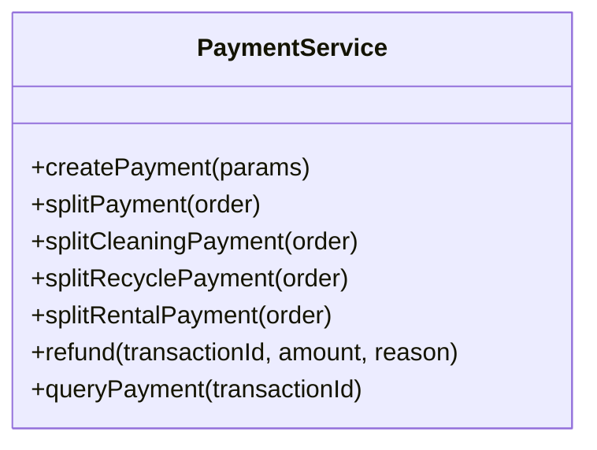

图示来源
- [backend/modules/common/services/paymentService.js:1-185](file://backend/modules/common/services/paymentService.js#L1-L185)

章节来源
- [backend/modules/common/services/paymentService.js:1-185](file://backend/modules/common/services/paymentService.js#L1-L185)

## 依赖关系分析
- server.js 依赖：wechat-pay、alipay、unionpay、balance、pos-api、member-card-routes、config。
- paymentRoutes.js 依赖：wechatPayService、paymentService、认证中间件。
- wechatPayService.js 依赖：crypto、https、fs、path。
- alipay.js、unionpay.js、wechat-pay.js 均依赖 axios/crypto/xml2js（部分）与 config。

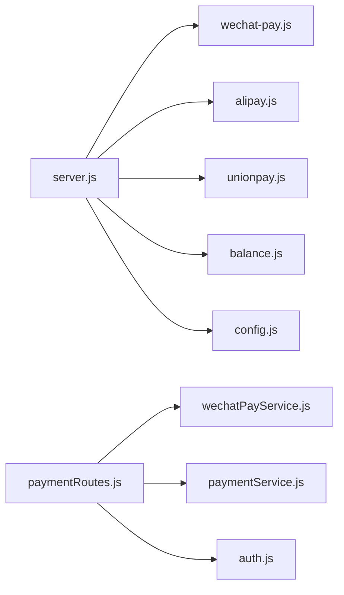

图示来源
- [api/payment-server/server.js:1-624](file://api/payment-server/server.js#L1-L624)
- [backend/modules/common/routes/paymentRoutes.js:1-215](file://backend/modules/common/routes/paymentRoutes.js#L1-L215)

章节来源
- [api/payment-server/server.js:1-624](file://api/payment-server/server.js#L1-L624)
- [backend/modules/common/routes/paymentRoutes.js:1-215](file://backend/modules/common/routes/paymentRoutes.js#L1-L215)

## 性能与可靠性
- 幂等性保证
  - 建议以商户订单号作为幂等键，在回调处理前检查是否已处理过相同订单，避免重复入账。
- 重试与退避
  - 对外部渠道查询/关闭/退款增加指数退避重试，失败落盘补偿任务。
- 并发与锁
  - 对余额扣减、结算操作引入分布式锁或数据库行级锁，防止超扣。
- 超时与熔断
  - 设置合理的HTTP超时与熔断降级，保障主链路可用性。
- 日志与可观测性
  - 全链路打点：下单、回调、查询、退款、结算；关键指标：成功率、耗时、错误码分布。

[本节为通用指导，不直接分析具体文件]

## 故障排查指南
- 常见错误
  - 余额不足：余额支付时返回可用余额与所需金额。
  - 支付方式未启用：检查配置开关与密钥。
  - 订单不存在：确认订单号与状态。
- 回调问题
  - 验签失败：核对签名算法、参数顺序、密钥与证书。
  - 回调不可达：确保公网URL、HTTPS证书、防火墙放行。
- 金额不一致
  - 核对元/分转换、汇率与手续费计算。
- 退款失败
  - 检查原交易号、退款金额不超过原支付金额、证书权限。

章节来源
- [api/payment-server/README.md:354-382](file://api/payment-server/README.md#L354-L382)
- [api/payment-server/server.js:306-451](file://api/payment-server/server.js#L306-L451)

## 结论
本支付模块通过统一网关与多渠道适配器实现了标准化的支付流程，结合业务后端微信支付V3能力，覆盖了JSAPI/App/H5场景，并内置余额与结算体系。在生产环境需完善幂等、补偿、监控与安全加固，确保资金安全与系统稳定。

[本节为总结，不直接分析具体文件]

## 附录：API接口规范

### 统一支付网关（支付服务器）
- 创建支付订单
  - 方法：POST
  - 路径：/api/payment/create
  - 说明：按 paymentMethod 分发至微信/支付宝/银联/余额；返回渠道所需支付参数。
- 查询支付状态
  - 方法：GET
  - 路径：/api/payment/query/:orderId
  - 说明：按渠道查询并更新本地订单状态。
- 关闭订单
  - 方法：POST
  - 路径：/api/payment/close/:orderId
  - 说明：仅允许 pending 状态的订单关闭。
- 余额相关
  - GET /api/balance/:userId
  - GET /api/balance/:userId/transactions
  - POST /api/balance/recharge
- 门店结算
  - GET /api/settlement/store/:storeId
  - GET /api/settlement/store/:storeId/records
  - POST /api/settlement/store/:storeId/settle
  - POST /api/settlement/store/:storeId/withdraw
  - POST /api/settlement/report

章节来源
- [api/payment-server/server.js:42-578](file://api/payment-server/server.js#L42-L578)
- [api/payment-server/README.md:184-242](file://api/payment-server/README.md#L184-L242)

### 业务后端统一支付路由
- 创建支付订单
  - 方法：POST
  - 路径：/api/payments/create
  - 说明：支持 wechat_jsapi、wechat_app、wechat_h5、balance；需要认证。
- 查询支付状态
  - 方法：GET
  - 路径：/api/payments/query/:orderId
  - 说明：基于商户订单号查询。
- 微信支付回调
  - 方法：POST
  - 路径：/api/payments/wechat/callback
  - 说明：验签、解密、更新订单、发送通知。
- 申请退款
  - 方法：POST
  - 路径：/api/payments/refund
  - 说明：调用微信支付V3退款接口。

章节来源
- [backend/modules/common/routes/paymentRoutes.js:13-212](file://backend/modules/common/routes/paymentRoutes.js#L13-L212)

### 前端预留API（支付API对象）
- 支付方式列表与创建支付（模拟）
  - getPaymentMethods、getMethod
  - createWechatPay、createAlipayOrder、createUnionpayOrder
  - payWithBalance、queryPayStatus、applyRefund
  - getUserBalance、rechargeBalance

章节来源
- [api/payment-api.js:1-427](file://api/payment-api.js#L1-L427)

### 支付流程图（业务后端）
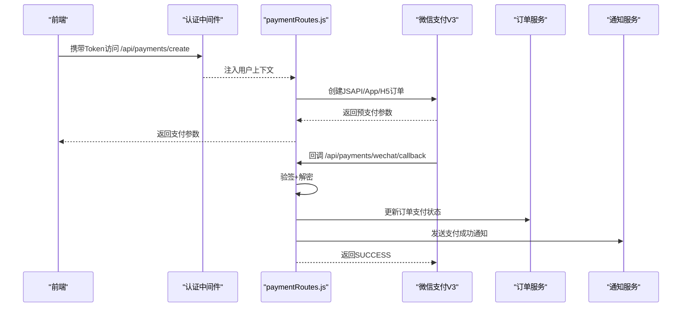

图示来源
- [backend/modules/common/routes/paymentRoutes.js:13-171](file://backend/modules/common/routes/paymentRoutes.js#L13-L171)
- [backend/modules/common/services/wechatPayService.js:339-392](file://backend/modules/common/services/wechatPayService.js#L339-L392)
- [backend/modules/common/middlewares/auth.js:10-137](file://backend/modules/common/middlewares/auth.js#L10-L137)