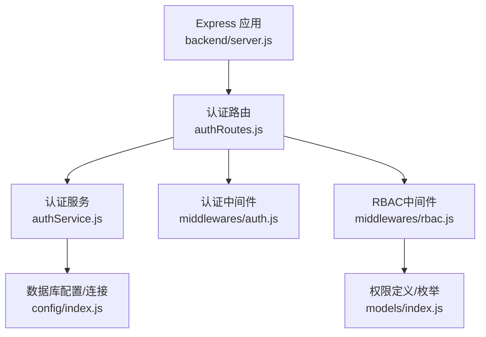
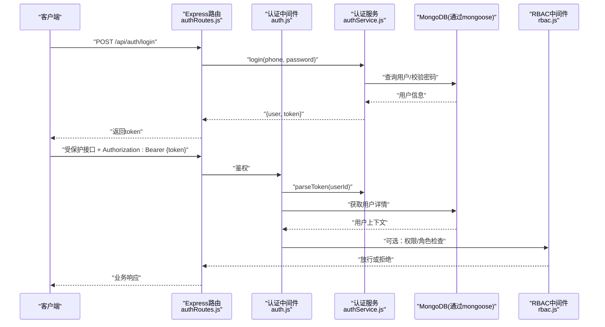
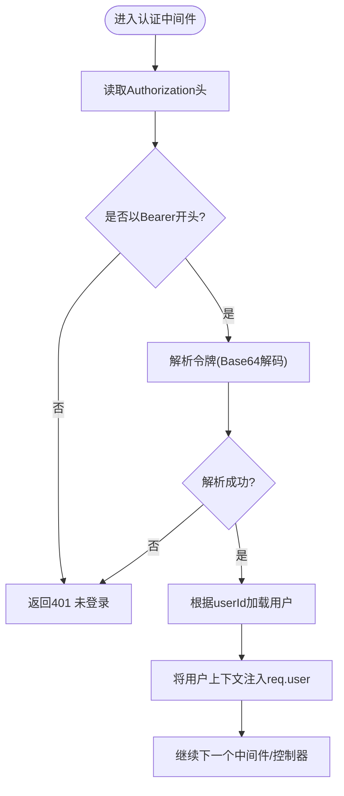
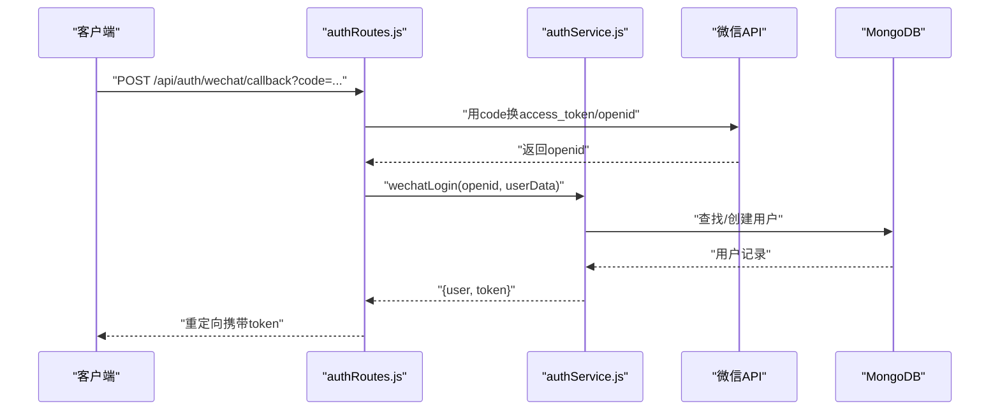
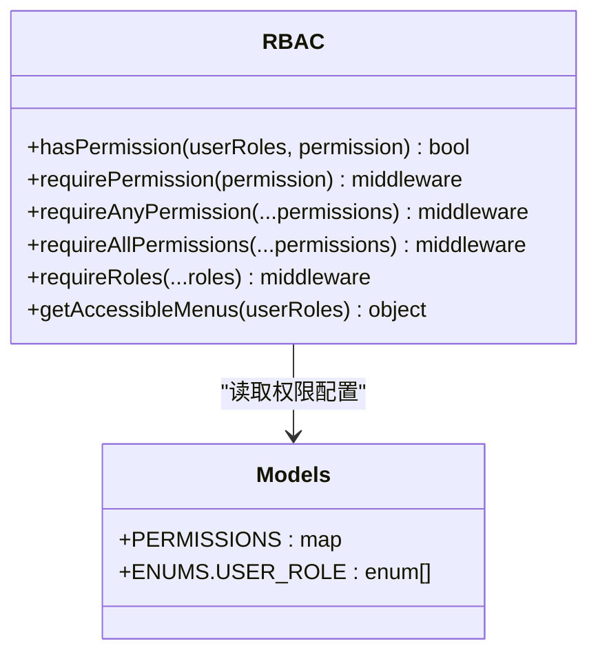
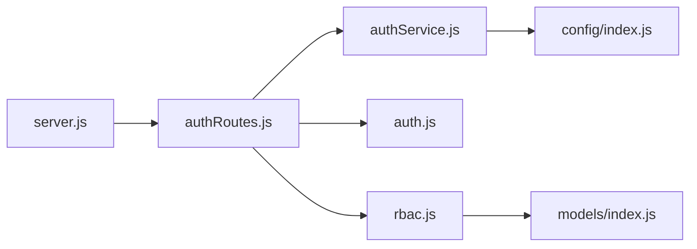

# 认证授权系统

<cite>
**本文引用的文件**   
- [backend/server.js](file://backend/server.js)
- [backend/config/index.js](file://backend/config/index.js)
- [backend/modules/common/routes/authRoutes.js](file://backend/modules/common/routes/authRoutes.js)
- [backend/modules/common/services/authService.js](file://backend/modules/common/services/authService.js)
- [backend/modules/common/middlewares/auth.js](file://backend/modules/common/middlewares/auth.js)
- [backend/modules/common/middlewares/rbac.js](file://backend/modules/common/middlewares/rbac.js)
- [backend/modules/common/models/index.js](file://backend/modules/common/models/index.js)
</cite>

## 目录
1. [简介](#简介)
2. [项目结构](#项目结构)
3. [核心组件](#核心组件)
4. [架构总览](#架构总览)
5. [详细组件分析](#详细组件分析)
6. [依赖关系分析](#依赖关系分析)
7. [性能与安全考量](#性能与安全考量)
8. [故障排查指南](#故障排查指南)
9. [结论](#结论)
10. [附录：认证API接口规范](#附录认证api接口规范)

## 简介
本文件面向干洗店管理系统的“认证与授权”子系统，系统性阐述以下能力：
- JWT令牌管理机制（生成、校验、刷新与过期策略）
- 用户身份验证流程（微信登录集成、手机号+验证码、密码加密存储、会话管理）
- RBAC权限控制模型（角色定义、权限分配、资源访问控制、中间件拦截）
- 开发模式特殊处理（模拟用户、测试令牌、环境隔离）
- 认证API完整接口规范（登录、注册、登出、令牌刷新等）
- 安全最佳实践与常见问题解决方案

## 项目结构
认证授权相关代码集中在后端模块的 common 子系统中，并通过 Express 路由挂载到统一入口。

图表来源
- [backend/server.js:96-128](file://backend/server.js#L96-L128)
- [backend/modules/common/routes/authRoutes.js:1-586](file://backend/modules/common/routes/authRoutes.js#L1-L586)
- [backend/modules/common/services/authService.js:1-498](file://backend/modules/common/services/authService.js#L1-L498)
- [backend/modules/common/middlewares/auth.js:1-209](file://backend/modules/common/middlewares/auth.js#L1-L209)
- [backend/modules/common/middlewares/rbac.js:1-172](file://backend/modules/common/middlewares/rbac.js#L1-L172)
- [backend/config/index.js:1-167](file://backend/config/index.js#L1-L167)
- [backend/modules/common/models/index.js:735-777](file://backend/modules/common/models/index.js#L735-L777)

章节来源
- [backend/server.js:96-128](file://backend/server.js#L96-L128)
- [backend/config/index.js:1-167](file://backend/config/index.js#L1-L167)

## 核心组件
- 认证路由层：提供登录、注册、微信登录、员工登录、资料更新、修改密码、退出等HTTP端点
- 认证服务层：封装用户CRUD、密码哈希、微信登录逻辑、令牌生成/解析、短信验证码（内存缓存）
- 认证中间件：从请求头提取并校验令牌，注入当前用户上下文；支持开发模式模拟用户
- RBAC中间件：基于角色的访问控制，提供按权限/角色拦截的工厂函数
- 数据模型与权限表：用户模型、权限映射、枚举常量

章节来源
- [backend/modules/common/routes/authRoutes.js:1-586](file://backend/modules/common/routes/authRoutes.js#L1-L586)
- [backend/modules/common/services/authService.js:1-498](file://backend/modules/common/services/authService.js#L1-L498)
- [backend/modules/common/middlewares/auth.js:1-209](file://backend/modules/common/middlewares/auth.js#L1-L209)
- [backend/modules/common/middlewares/rbac.js:1-172](file://backend/modules/common/middlewares/rbac.js#L1-L172)
- [backend/modules/common/models/index.js:398-529](file://backend/modules/common/models/index.js#L398-L529)
- [backend/modules/common/models/index.js:735-777](file://backend/modules/common/models/index.js#L735-L777)

## 架构总览
认证授权整体采用“路由-服务-中间件-数据模型”的分层设计，Express作为HTTP入口，认证中间件在业务路由前执行，RBAC中间件按需附加于敏感接口。

图表来源
- [backend/modules/common/routes/authRoutes.js:66-80](file://backend/modules/common/routes/authRoutes.js#L66-L80)
- [backend/modules/common/services/authService.js:101-125](file://backend/modules/common/services/authService.js#L101-L125)
- [backend/modules/common/middlewares/auth.js:10-138](file://backend/modules/common/middlewares/auth.js#L10-L138)
- [backend/modules/common/middlewares/rbac.js:34-48](file://backend/modules/common/middlewares/rbac.js#L34-L48)

## 详细组件分析

### 令牌机制（生成、解析、刷新与过期）
- 令牌格式：当前实现为自定义Base64编码字符串，包含“用户ID:时间戳:随机串”，并非标准JWT。因此不具备内置签名与过期字段，需由服务端解析后结合业务规则判断有效性。
- 生成：认证服务根据用户ID生成令牌，用于登录成功后的会话标识。
- 解析：认证中间件解析令牌，提取用户ID并加载用户上下文。
- 刷新：当前未提供独立的“刷新令牌”接口；如需长会话，可在后续扩展“无感刷新”策略（例如双令牌：短时效Access Token + 长时效Refresh Token）。
- 过期：当前未强制校验时间戳过期；建议引入过期时间并在解析时校验，配合前端在过期前主动刷新。

图表来源
- [backend/modules/common/middlewares/auth.js:10-138](file://backend/modules/common/middlewares/auth.js#L10-L138)
- [backend/modules/common/services/authService.js:470-483](file://backend/modules/common/services/authService.js#L470-L483)

章节来源
- [backend/modules/common/services/authService.js:469-483](file://backend/modules/common/services/authService.js#L469-L483)
- [backend/modules/common/middlewares/auth.js:10-138](file://backend/modules/common/middlewares/auth.js#L10-L138)

### 用户身份验证流程
- 手机号+密码登录：校验用户存在且状态有效，比对密码哈希，成功后生成令牌并返回用户信息。
- 手机号+验证码登录：发送验证码（内存缓存）、校验验证码后完成登录。
- 微信登录（网页/小程序）：
  - 网页端：通过微信公众号网页授权获取code，后端换取openid与用户信息，再调用统一登录逻辑。
  - 小程序端：通过jscode2session换取openid，再调用统一登录逻辑。
- 员工登录：支持账号（手机号/工号）+密码，同时可绑定openid，返回门店信息与权限菜单。
- 密码加密存储：使用bcrypt进行哈希，保存前自动加密。
- 会话管理：当前基于令牌无状态会话；如需会话级黑名单/注销，可扩展令牌黑名单或短期令牌+刷新令牌方案。

图表来源
- [backend/modules/common/routes/authRoutes.js:198-259](file://backend/modules/common/routes/authRoutes.js#L198-L259)
- [backend/modules/common/services/authService.js:130-198](file://backend/modules/common/services/authService.js#L130-L198)

章节来源
- [backend/modules/common/routes/authRoutes.js:127-142](file://backend/modules/common/routes/authRoutes.js#L127-L142)
- [backend/modules/common/routes/authRoutes.js:198-259](file://backend/modules/common/routes/authRoutes.js#L198-L259)
- [backend/modules/common/routes/authRoutes.js:444-490](file://backend/modules/common/routes/authRoutes.js#L444-L490)
- [backend/modules/common/services/authService.js:101-125](file://backend/modules/common/services/authService.js#L101-L125)
- [backend/modules/common/services/authService.js:130-198](file://backend/modules/common/services/authService.js#L130-L198)
- [backend/modules/common/services/authService.js:424-467](file://backend/modules/common/services/authService.js#L424-L467)
- [backend/modules/common/services/authService.js:54-59](file://backend/modules/common/services/authService.js#L54-L59)

### RBAC权限控制模型
- 角色体系：customer、store_staff、store_owner、admin（以及回收/租赁相关角色预留）
- 权限定义：集中维护在权限表中，支持“*”表示所有人，支持多角色组合
- 中间件：
  - requirePermission：按权限标识检查
  - requireAnyPermission：满足任一即可
  - requireAllPermissions：全部满足
  - requireRoles：直接按角色检查
- 菜单可见性：根据用户角色过滤可访问菜单项

图表来源
- [backend/modules/common/middlewares/rbac.js:1-172](file://backend/modules/common/middlewares/rbac.js#L1-L172)
- [backend/modules/common/models/index.js:735-777](file://backend/modules/common/models/index.js#L735-L777)

章节来源
- [backend/modules/common/middlewares/rbac.js:1-172](file://backend/modules/common/middlewares/rbac.js#L1-L172)
- [backend/modules/common/models/index.js:735-777](file://backend/modules/common/models/index.js#L735-L777)

### 开发模式特殊处理
- 开发管理员/连锁管理员令牌：在非生产环境下，支持特定前缀的令牌快速注入用户上下文，便于联调
- 模拟用户令牌：mock_token_ 前缀可直接跳过真实用户查询，注入模拟客户上下文
- 开发商家登录：一键创建/获取测试店长账户并返回令牌
- 注意：上述逻辑仅在非生产环境生效，避免泄露到线上

章节来源
- [backend/modules/common/middlewares/auth.js:24-104](file://backend/modules/common/middlewares/auth.js#L24-L104)
- [backend/modules/common/routes/authRoutes.js:86-121](file://backend/modules/common/routes/authRoutes.js#L86-L121)
- [backend/modules/common/routes/authRoutes.js:385-438](file://backend/modules/common/routes/authRoutes.js#L385-L438)

## 依赖关系分析
- 路由层依赖认证服务与中间件
- 认证服务依赖数据库连接（MongoDB/MySQL），当前用户模型基于MongoDB
- RBAC中间件依赖权限配置与枚举
- 服务器入口负责挂载各模块路由与健康检查

图表来源
- [backend/server.js:96-128](file://backend/server.js#L96-L128)
- [backend/modules/common/routes/authRoutes.js:1-586](file://backend/modules/common/routes/authRoutes.js#L1-L586)
- [backend/modules/common/services/authService.js:1-498](file://backend/modules/common/services/authService.js#L1-L498)
- [backend/modules/common/middlewares/auth.js:1-209](file://backend/modules/common/middlewares/auth.js#L1-L209)
- [backend/modules/common/middlewares/rbac.js:1-172](file://backend/modules/common/middlewares/rbac.js#L1-L172)
- [backend/config/index.js:1-167](file://backend/config/index.js#L1-L167)
- [backend/modules/common/models/index.js:735-777](file://backend/modules/common/models/index.js#L735-L777)

章节来源
- [backend/server.js:96-128](file://backend/server.js#L96-L128)

## 性能与安全考量
- 令牌性能：当前令牌不含签名，解析开销低；但缺乏防篡改能力，建议升级为带签名的JWT或类似机制
- 会话扩展：如需在线用户管理与强制下线，可引入令牌黑名单或短期令牌+刷新令牌
- 密码安全：已使用bcrypt哈希，建议固定盐轮数并定期评估安全性
- 验证码安全：当前使用内存缓存，进程重启会丢失；生产环境应迁移至Redis并增加频率限制与IP限流
- 微信回调安全：确保回调域名白名单与HTTPS，校验state参数防CSRF
- 权限最小化：遵循最小权限原则，仅开放必要接口，结合RBAC严格校验
- 日志脱敏：避免在日志中输出敏感信息（如密码、token、openid）

[本节为通用指导，不直接分析具体文件]

## 故障排查指南
- 401未登录：检查Authorization头是否正确携带Bearer令牌；确认令牌格式与解析逻辑
- 403权限不足：检查用户角色与所需权限匹配情况；确认RBAC中间件是否挂载
- 微信登录失败：核对环境变量中的AppID/Secret；检查回调域名配置与网络连通性
- 验证码错误/过期：确认验证码有效期与次数限制；检查内存缓存是否被清理
- 员工登录失败：确认账号是否存在、密码是否正确、角色是否激活

章节来源
- [backend/modules/common/middlewares/auth.js:10-138](file://backend/modules/common/middlewares/auth.js#L10-L138)
- [backend/modules/common/middlewares/rbac.js:34-48](file://backend/modules/common/middlewares/rbac.js#L34-L48)
- [backend/modules/common/routes/authRoutes.js:444-490](file://backend/modules/common/routes/authRoutes.js#L444-L490)
- [backend/modules/common/services/authService.js:424-467](file://backend/modules/common/services/authService.js#L424-L467)

## 结论
本认证授权系统采用分层架构，具备手机号+密码、验证码、微信登录等多方式认证能力，并提供基于角色的权限控制。当前令牌为自定义格式，尚未实现标准JWT的签名与过期机制，建议在后续迭代中引入标准JWT或等效机制，完善刷新与过期策略，并将验证码缓存迁移至Redis以提升稳定性与并发能力。

[本节为总结，不直接分析具体文件]

## 附录：认证API接口规范

说明
- 基础路径：/api/auth
- 统一响应格式：{ success: boolean, data?: any, error?: string }
- 认证方式：除明确标注外，受保护接口需在请求头携带 Authorization: Bearer {token}

公开接口
- POST /api/auth/send-code
  - 请求体：{ phone, type? }
  - 响应：{ success, data: { message, code? } }
  - 说明：type用于区分用途（如登录/重置），开发环境返回验证码方便测试

- POST /api/auth/verify-code
  - 请求体：{ phone, code }
  - 响应：{ success, data: { verified: true } }

- POST /api/auth/register
  - 请求体：{ phone, password, code?, name? }
  - 响应：{ success, data: { user, token } }

- POST /api/auth/login
  - 请求体：{ phone, password }
  - 响应：{ success, data: { user, token } }

- POST /api/auth/admin-login（开发模式）
  - 请求体：{ roles? }
  - 响应：{ success, data: { token, user }, message }
  - 说明：仅非生产环境可用

- POST /api/auth/wechat
  - 请求体：{ openid, nickname?, headimgurl?, sex? }
  - 响应：{ success, data: { user, token, openid } }

- GET /api/auth/wechat/authorize
  - 响应：{ success, data: { authorizeUrl, appId, isWebAuthorize } }

- GET /api/auth/wechat/callback
  - 查询参数：{ code, state }
  - 行为：重定向到前端页面并附带token与openid

- POST /api/auth/staff-login
  - 请求体：{ account, password, openid? }
  - 响应：{ success, data: { token, user, store?, permissions, menus, openid } }

- POST /api/auth/dev-staff-login（开发模式）
  - 请求体：{ storeId?, openid? }
  - 响应：{ success, data: { token, user, openid }, message }

- POST /api/auth/wxmini-login
  - 请求体：{ code, nickname?, avatarUrl?, gender? }
  - 响应：{ success, data: { user, token, openid, session_key } }

- POST /api/auth/forgot-password
  - 请求体：{ phone, code, password }
  - 响应：{ success, data: { message } }

受保护接口
- GET /api/auth/profile
  - 响应：{ success, data: user }

- PUT /api/auth/profile
  - 请求体：{ name?, avatar?, gender?, birthday?, phone?, address? }
  - 响应：{ success, data: { user, __merged? } }
  - 说明：若发生跨平台账户合并，可能返回新token与合并标记

- POST /api/auth/change-password
  - 请求体：{ oldPassword, newPassword }
  - 响应：{ success, data: { message } }

- POST /api/auth/logout
  - 响应：{ success, data: { message } }

错误码与提示
- 400：参数不完整或校验失败
- 401：未登录或认证失败
- 403：权限不足
- 500：服务器内部错误

章节来源
- [backend/modules/common/routes/authRoutes.js:17-27](file://backend/modules/common/routes/authRoutes.js#L17-L27)
- [backend/modules/common/routes/authRoutes.js:33-43](file://backend/modules/common/routes/authRoutes.js#L33-L43)
- [backend/modules/common/routes/authRoutes.js:49-64](file://backend/modules/common/routes/authRoutes.js#L49-L64)
- [backend/modules/common/routes/authRoutes.js:70-80](file://backend/modules/common/routes/authRoutes.js#L70-L80)
- [backend/modules/common/routes/authRoutes.js:86-121](file://backend/modules/common/routes/authRoutes.js#L86-L121)
- [backend/modules/common/routes/authRoutes.js:127-142](file://backend/modules/common/routes/authRoutes.js#L127-L142)
- [backend/modules/common/routes/authRoutes.js:149-192](file://backend/modules/common/routes/authRoutes.js#L149-L192)
- [backend/modules/common/routes/authRoutes.js:198-259](file://backend/modules/common/routes/authRoutes.js#L198-L259)
- [backend/modules/common/routes/authRoutes.js:267-379](file://backend/modules/common/routes/authRoutes.js#L267-L379)
- [backend/modules/common/routes/authRoutes.js:385-438](file://backend/modules/common/routes/authRoutes.js#L385-L438)
- [backend/modules/common/routes/authRoutes.js:444-490](file://backend/modules/common/routes/authRoutes.js#L444-L490)
- [backend/modules/common/routes/authRoutes.js:496-508](file://backend/modules/common/routes/authRoutes.js#L496-L508)
- [backend/modules/common/routes/authRoutes.js:521-583](file://backend/modules/common/routes/authRoutes.js#L521-L583)