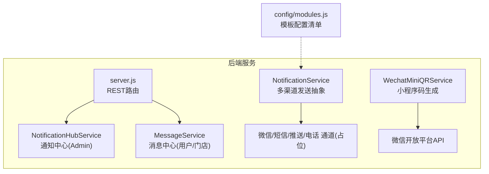
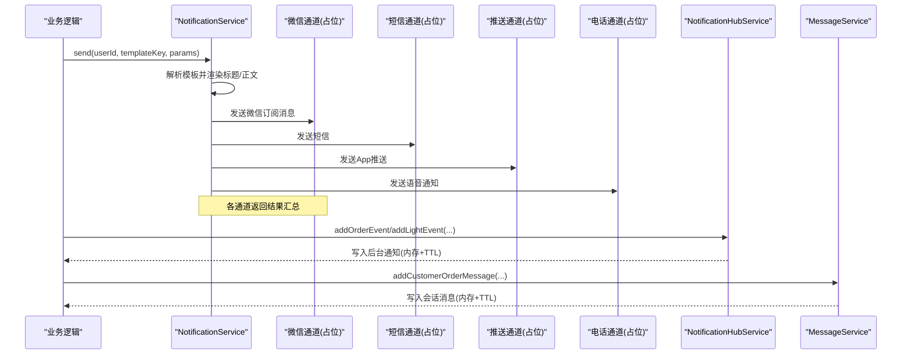
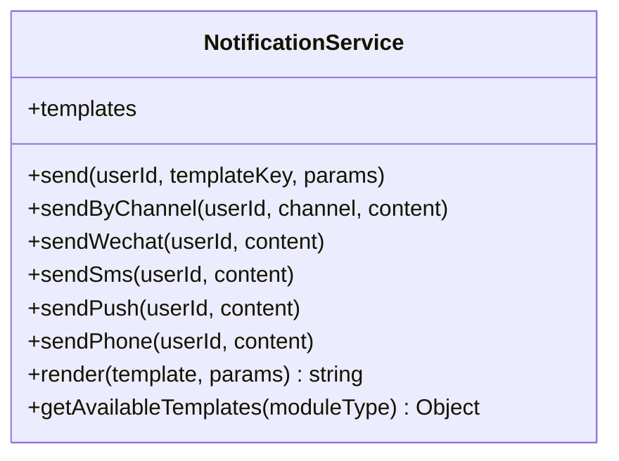
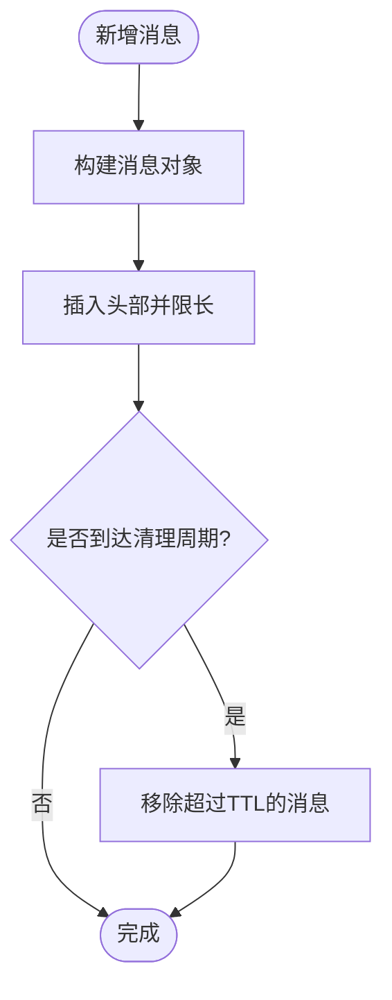
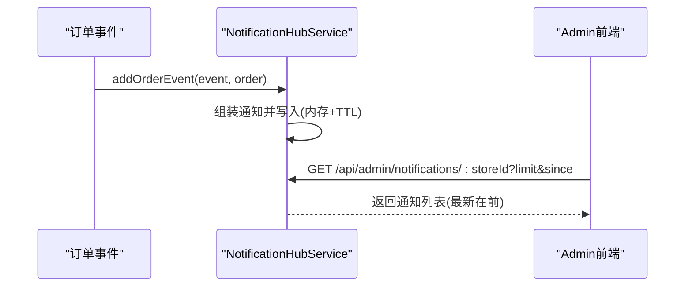
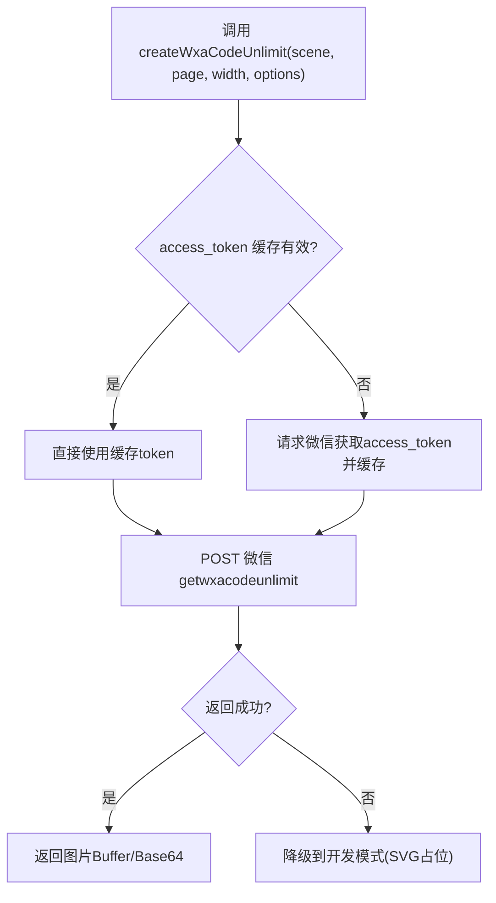
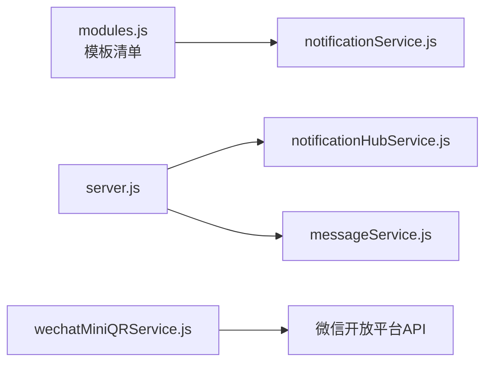

# 通知服务模块

<cite>
**本文引用的文件**   
- [notificationService.js](file://backend/modules/common/services/notificationService.js)
- [messageService.js](file://backend/services/messageService.js)
- [notificationHubService.js](file://backend/services/notificationHubService.js)
- [wechatMiniQRService.js](file://backend/modules/common/services/wechatMiniQRService.js)
- [server.js](file://backend/server.js)
- [modules.js](file://backend/config/modules.js)
</cite>

## 目录
1. [简介](#简介)
2. [项目结构](#项目结构)
3. [核心组件](#核心组件)
4. [架构总览](#架构总览)
5. [详细组件分析](#详细组件分析)
6. [依赖分析](#依赖分析)
7. [性能考虑](#性能考虑)
8. [故障排查指南](#故障排查指南)
9. [结论](#结论)
10. [附录：API接口规范](#附录api接口规范)

## 简介
本模块为干洗店管理系统的“通知服务”，提供统一的多渠道消息推送抽象、模板管理与渲染、站内信与系统事件通知中心，以及小程序码生成能力。当前实现覆盖以下要点：
- 多渠道抽象：微信订阅消息、短信、App推送、电话等通道预留扩展点
- 模板管理：按业务域组织模板，支持变量替换与可用模板查询
- 通知中心：面向后台的管理端通知聚合（订单事件、灯条事件）
- 消息中心：面向用户/门店的会话式消息（客户消息、账户消息、公告）
- 二维码服务：微信小程序码生成（含开发模式降级）

注意：当前部分外部通道（微信、短信、推送、语音）为占位实现，后续可接入真实网关。

## 项目结构
通知相关代码主要分布在后端服务的 services 与 modules/common/services 下，并通过 server.js 暴露 REST API。

图表来源
- [server.js:158-198](file://backend/server.js#L158-L198)
- [notificationHubService.js:1-264](file://backend/services/notificationHubService.js#L1-L264)
- [messageService.js:1-247](file://backend/services/messageService.js#L1-L247)
- [notificationService.js:1-281](file://backend/modules/common/services/notificationService.js#L1-L281)
- [wechatMiniQRService.js:1-269](file://backend/modules/common/services/wechatMiniQRService.js#L1-L269)
- [modules.js:161-202](file://backend/config/modules.js#L161-L202)

章节来源
- [server.js:158-198](file://backend/server.js#L158-L198)
- [notificationHubService.js:1-264](file://backend/services/notificationHubService.js#L1-L264)
- [messageService.js:1-247](file://backend/services/messageService.js#L1-L247)
- [notificationService.js:1-281](file://backend/modules/common/services/notificationService.js#L1-L281)
- [wechatMiniQRService.js:1-269](file://backend/modules/common/services/wechatMiniQRService.js#L1-L269)
- [modules.js:161-202](file://backend/config/modules.js#L161-L202)

## 核心组件
- NotificationService：统一的消息发送入口，负责模板解析、变量替换与多通道分发
- MessageService：会话式消息中心，维护消息列表、线程聚合、已读状态与过期清理
- NotificationHubService：后台通知中心，聚合订单事件与灯条事件，供 Admin 端轮询
- WechatMiniQRService：小程序码生成服务，包含 access_token 缓存、无限制码生成与开发模式降级

章节来源
- [notificationService.js:177-281](file://backend/modules/common/services/notificationService.js#L177-L281)
- [messageService.js:15-247](file://backend/services/messageService.js#L15-L247)
- [notificationHubService.js:17-264](file://backend/services/notificationHubService.js#L17-L264)
- [wechatMiniQRService.js:17-269](file://backend/modules/common/services/wechatMiniQRService.js#L17-L269)

## 架构总览
下图展示从业务侧到各通道的调用路径，以及后台通知/消息中心的职责边界。

图表来源
- [notificationService.js:188-211](file://backend/modules/common/services/notificationService.js#L188-L211)
- [notificationHubService.js:88-155](file://backend/services/notificationHubService.js#L88-L155)
- [messageService.js:61-103](file://backend/services/messageService.js#L61-L103)

## 详细组件分析

### 通知服务（NotificationService）
- 模板定义：按业务域（cleaning/recycle/rental/system）组织，每个事件包含 title/body/channels
- 发送流程：根据 templateKey 定位模板 → 渲染变量 → 遍历 channels 逐个发送 → 汇总结果
- 通道抽象：sendByChannel 分派至具体通道；当前微信/短信/推送/电话均为占位实现
- 模板渲染：使用正则 {key} 进行变量替换，缺失变量保留原样
- 模板查询：getAvailableTemplates 可按模块类型获取可用模板集合

图表来源
- [notificationService.js:177-281](file://backend/modules/common/services/notificationService.js#L177-L281)

章节来源
- [notificationService.js:9-175](file://backend/modules/common/services/notificationService.js#L9-L175)
- [notificationService.js:188-211](file://backend/modules/common/services/notificationService.js#L188-L211)
- [notificationService.js:216-229](file://backend/modules/common/services/notificationService.js#L216-L229)
- [notificationService.js:234-261](file://backend/modules/common/services/notificationService.js#L234-L261)
- [notificationService.js:266-277](file://backend/modules/common/services/notificationService.js#L266-L277)

### 消息中心（MessageService）
- 职责：处理客户消息、账户消息、系统公告；与铃铛通知（系统事件流）独立
- 数据结构：消息对象包含 id/threadId/from/to/type/subject/content/orderNo/storeId/read/createdAt
- 功能：添加消息、按条件过滤、线程聚合、标记已读、定时清理过期消息
- 生命周期：进程内数组存储，最大保留数与 TTL 控制

图表来源
- [messageService.js:29-55](file://backend/services/messageService.js#L29-L55)
- [messageService.js:226-233](file://backend/services/messageService.js#L226-L233)

章节来源
- [messageService.js:1-247](file://backend/services/messageService.js#L1-L247)

### 通知中心（NotificationHubService）
- 职责：统一收集订单事件与灯条事件，供 Admin 端轮询查看历史通知
- 数据模型：通知对象包含 id/storeId/type/title/message/orderId/orderNo/priority/data/read/createdAt
- 功能：按门店或全局聚合、去重、since 时间过滤、未读数统计、标记已读、定时清理
- 集成点：orderEventService 发布 MQTT 事件时同步写入；取件灯条激活/关闭时写入

图表来源
- [notificationHubService.js:88-127](file://backend/services/notificationHubService.js#L88-L127)
- [notificationHubService.js:163-200](file://backend/services/notificationHubService.js#L163-L200)
- [server.js:161-191](file://backend/server.js#L161-L191)

章节来源
- [notificationHubService.js:17-264](file://backend/services/notificationHubService.js#L17-L264)
- [server.js:161-191](file://backend/server.js#L161-L191)

### 小程序码生成服务（WechatMiniQRService）
- 功能：获取 access_token（带缓存）、生成无限制小程序码、场景参数编码、开发模式降级
- 关键流程：
  - 获取 token：若缓存有效则复用，否则请求微信接口并设置过期时间
  - 生成二维码：构造 payload（scene/page/width/line_color/env_version），POST 微信 API
  - 开发模式：非生产环境直接返回 SVG 占位图，便于联调
- 注意事项：scene 最大长度限制，需精简参数；正式失败时自动降级

图表来源
- [wechatMiniQRService.js:27-53](file://backend/modules/common/services/wechatMiniQRService.js#L27-L53)
- [wechatMiniQRService.js:62-119](file://backend/modules/common/services/wechatMiniQRService.js#L62-L119)
- [wechatMiniQRService.js:144-174](file://backend/modules/common/services/wechatMiniQRService.js#L144-L174)
- [wechatMiniQRService.js:211-231](file://backend/modules/common/services/wechatMiniQRService.js#L211-L231)

章节来源
- [wechatMiniQRService.js:1-269](file://backend/modules/common/services/wechatMiniQRService.js#L1-L269)

## 依赖分析
- NotificationService 依赖模板配置（modules.js 中声明了各模块支持的模板键名），但实际模板定义位于自身内部
- NotificationHubService 与 MessageService 相互独立，分别服务于后台通知与用户/门店消息
- server.js 通过 REST 路由暴露通知中心查询接口
- WechatMiniQRService 依赖微信开放平台 API 与 request 库

图表来源
- [modules.js:161-202](file://backend/config/modules.js#L161-L202)
- [server.js:161-191](file://backend/server.js#L161-L191)
- [notificationHubService.js:1-264](file://backend/services/notificationHubService.js#L1-L264)
- [messageService.js:1-247](file://backend/services/messageService.js#L1-L247)
- [wechatMiniQRService.js:1-269](file://backend/modules/common/services/wechatMiniQRService.js#L1-L269)

章节来源
- [modules.js:161-202](file://backend/config/modules.js#L161-L202)
- [server.js:161-191](file://backend/server.js#L161-L191)

## 性能考虑
- 模板渲染：基于正则替换，复杂度 O(n)，n 为模板字符串长度；建议避免在高频路径中使用复杂模板
- 通知/消息中心：内存存储，具备最大数量与 TTL 清理策略，适合单机短时效场景；高并发下需引入持久化与队列
- 小程序码：access_token 本地缓存减少重复请求；微信 API 失败时快速降级，保障可用性
- 通道发送：当前为同步阻塞调用，建议改为异步队列（如 Redis/RabbitMQ）+ 重试与幂等

[本节为通用指导，不直接分析具体文件]

## 故障排查指南
- 模板不存在：当 templateKey 无法匹配到对应模板时会抛出错误，检查模板键命名与模块分类
- 通道不支持：当传入未知 channel 会抛错，确认 channels 列表仅包含 wechat/sms/push/phone
- 微信 token 异常：检查 appId/appSecret 环境变量是否正确；关注返回体中的 errmsg
- 小程序码生成失败：优先查看微信 API 响应码与错误信息；确认 scene 长度不超过限制
- 通知/消息未显示：检查 since 过滤条件与 TTL 是否导致被清理；确认 storeId 过滤范围

章节来源
- [notificationService.js:188-194](file://backend/modules/common/services/notificationService.js#L188-L194)
- [notificationService.js:216-229](file://backend/modules/common/services/notificationService.js#L216-L229)
- [wechatMiniQRService.js:27-53](file://backend/modules/common/services/wechatMiniQRService.js#L27-L53)
- [wechatMiniQRService.js:62-119](file://backend/modules/common/services/wechatMiniQRService.js#L62-L119)
- [notificationHubService.js:163-200](file://backend/services/notificationHubService.js#L163-L200)
- [messageService.js:114-150](file://backend/services/messageService.js#L114-L150)

## 结论
当前通知服务模块提供了清晰的多渠道抽象与模板机制，配合后台通知中心与消息中心，满足干洗店系统在运营与用户体验方面的基础需求。后续建议：
- 补齐微信/短信/推送/电话的真实通道实现
- 引入消息队列与持久化存储，提升可靠性与可扩展性
- 完善模板版本控制与语言支持，增强可维护性与国际化能力

[本节为总结性内容，不直接分析具体文件]

## 附录：API接口规范
- 获取门店通知列表
  - 方法：GET
  - 路径：/api/admin/notifications/:storeId
  - 查询参数：limit（默认20）、since（默认0）
  - 响应：{ success: true, data: { notifications, unreadCount, total } }
- 获取所有门店通知（汇总）
  - 方法：GET
  - 路径：/api/admin/notifications
  - 查询参数：limit（默认30）、since（默认0）
  - 响应：同上
- 标记通知为已读
  - 方法：POST
  - 路径：/api/admin/notifications/:storeId/mark-read
  - 请求体：{ notificationIds: number[] }
  - 响应：{ success: true, data: { marked: number } }

章节来源
- [server.js:161-198](file://backend/server.js#L161-L198)
- [notificationHubService.js:163-230](file://backend/services/notificationHubService.js#L163-L230)