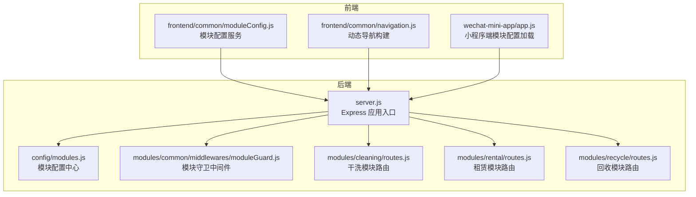
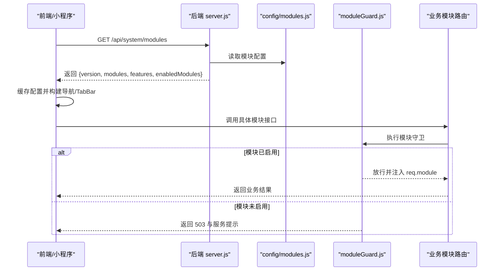
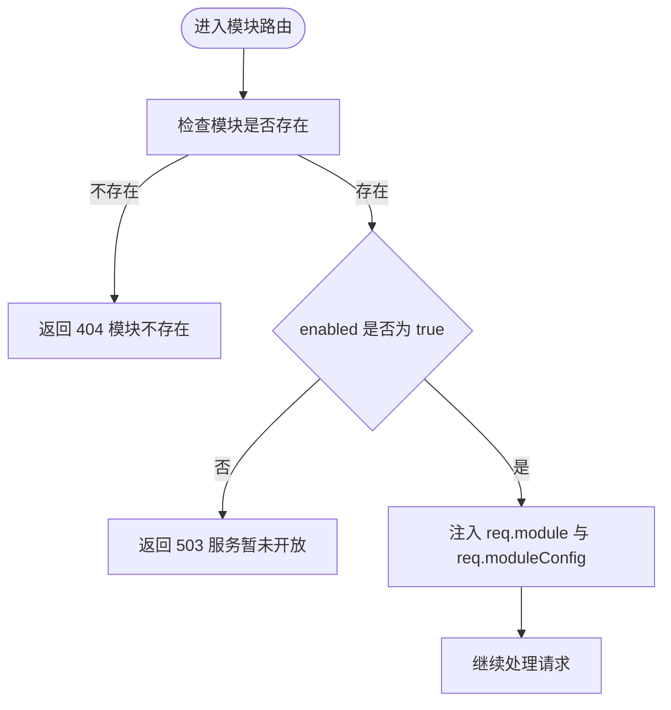
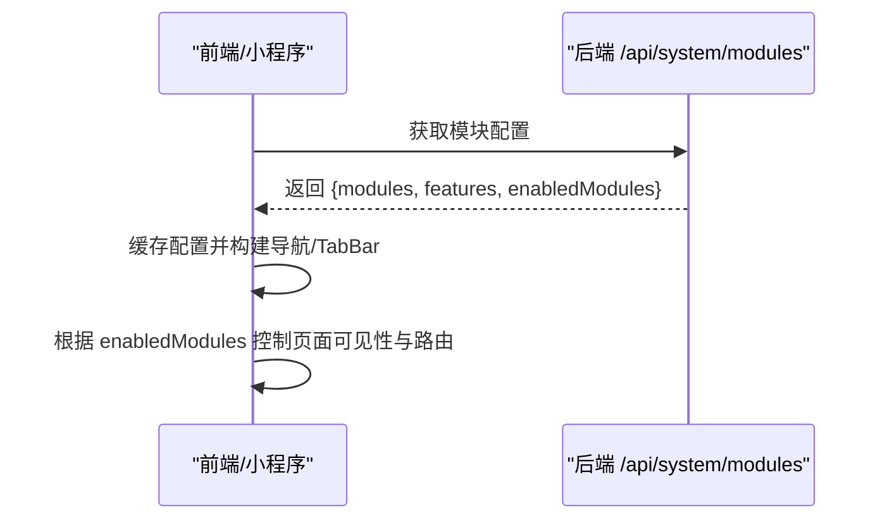
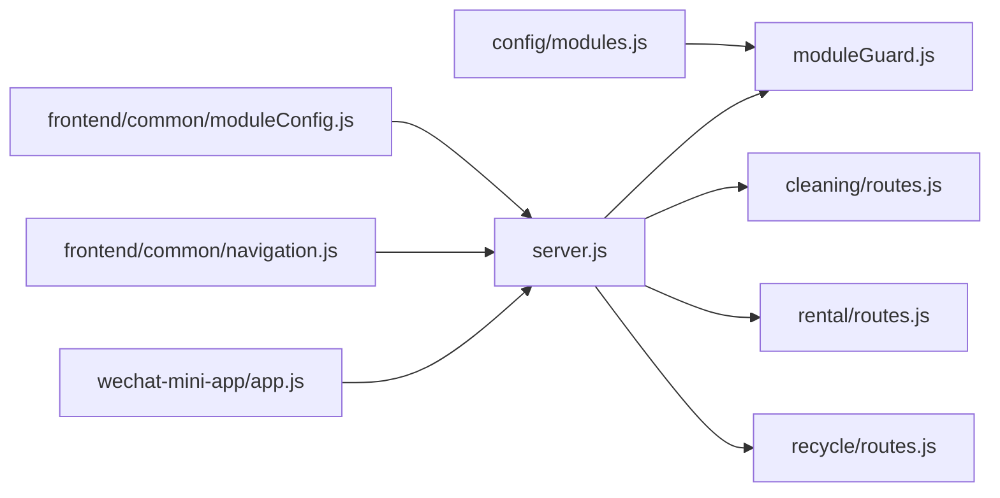

# 动态加载机制

<cite>
**本文引用的文件**   
- [backend/config/modules.js](file://backend/config/modules.js)
- [backend/server.js](file://backend/server.js)
- [backend/modules/common/middlewares/moduleGuard.js](file://backend/modules/common/middlewares/moduleGuard.js)
- [backend/modules/cleaning/routes.js](file://backend/modules/cleaning/routes.js)
- [backend/modules/rental/routes.js](file://backend/modules/rental/routes.js)
- [backend/modules/recycle/routes.js](file://backend/modules/recycle/routes.js)
- [frontend/common/moduleConfig.js](file://frontend/common/moduleConfig.js)
- [frontend/common/navigation.js](file://frontend/common/navigation.js)
- [wechat-mini-app/app.js](file://wechat-mini-app/app.js)
</cite>

## 目录
1. [简介](#简介)
2. [项目结构](#项目结构)
3. [核心组件](#核心组件)
4. [架构总览](#架构总览)
5. [详细组件分析](#详细组件分析)
6. [依赖关系分析](#依赖关系分析)
7. [性能考量](#性能考量)
8. [故障排查指南](#故障排查指南)
9. [结论](#结论)
10. [附录：配置模板与示例](#附录配置模板与示例)

## 简介
本技术文档围绕干洗店管理系统的“模块配置驱动的动态加载机制”展开，重点解释以下方面：
- 模块配置文件 modules.js 的结构设计与运行时解析逻辑
- 模块启用/禁用控制机制（enabled 标志位）与模块守卫中间件的工作原理
- 模块依赖注入系统的设计思路（服务发现、接口注册、依赖解析）
- 模块生命周期管理（初始化、启动、运行、销毁）的处理流程
- 模块热重载支持的技术方案（配置变更监听与模块重新加载）
- 前端侧的模块能力感知与动态导航生成
- 提供可复用的配置模板与扩展指引

## 项目结构
后端采用 Express 应用作为入口，通过统一的系统接口暴露模块状态；各业务模块以路由形式挂载到统一应用中，并通过模块守卫中间件进行启用检查。前端通过系统接口获取模块配置，动态构建菜单与功能可见性。

图表来源
- [backend/server.js:55-82](file://backend/server.js#L55-L82)
- [backend/config/modules.js:11-97](file://backend/config/modules.js#L11-L97)
- [backend/modules/common/middlewares/moduleGuard.js:13-42](file://backend/modules/common/middlewares/moduleGuard.js#L13-L42)
- [backend/modules/cleaning/routes.js:13-14](file://backend/modules/cleaning/routes.js#L13-L14)
- [backend/modules/rental/routes.js:13-14](file://backend/modules/rental/routes.js#L13-L14)
- [backend/modules/recycle/routes.js:10-11](file://backend/modules/recycle/routes.js#L10-L11)
- [frontend/common/moduleConfig.js:17-40](file://frontend/common/moduleConfig.js#L17-L40)
- [frontend/common/navigation.js:16-39](file://frontend/common/navigation.js#L16-L39)
- [wechat-mini-app/app.js:123-138](file://wechat-mini-app/app.js#L123-L138)

章节来源
- [backend/server.js:55-82](file://backend/server.js#L55-L82)
- [backend/config/modules.js:11-97](file://backend/config/modules.js#L11-L97)
- [backend/modules/common/middlewares/moduleGuard.js:13-42](file://backend/modules/common/middlewares/moduleGuard.js#L13-L42)
- [backend/modules/cleaning/routes.js:13-14](file://backend/modules/cleaning/routes.js#L13-L14)
- [backend/modules/rental/routes.js:13-14](file://backend/modules/rental/routes.js#L13-L14)
- [backend/modules/recycle/routes.js:10-11](file://backend/modules/recycle/routes.js#L10-L11)
- [frontend/common/moduleConfig.js:17-40](file://frontend/common/moduleConfig.js#L17-L40)
- [frontend/common/navigation.js:16-39](file://frontend/common/navigation.js#L16-L39)
- [wechat-mini-app/app.js:123-138](file://wechat-mini-app/app.js#L123-L138)

## 核心组件
- 模块配置中心：集中定义模块元数据、功能开关、支付分账策略、通知模板等，为系统提供单一事实源。
- 模块守卫中间件：在请求进入模块路由前校验模块是否启用，未启用则返回友好提示。
- 系统接口：对外暴露模块清单、版本、功能开关等信息，供前端动态渲染。
- 前端模块配置服务：从后端拉取模块配置并缓存，用于动态生成导航与页面可见性。
- 小程序端集成：在应用启动时加载模块配置，更新全局可用模块列表与 TabBar。

章节来源
- [backend/config/modules.js:11-97](file://backend/config/modules.js#L11-L97)
- [backend/modules/common/middlewares/moduleGuard.js:13-42](file://backend/modules/common/middlewares/moduleGuard.js#L13-L42)
- [backend/server.js:55-82](file://backend/server.js#L55-L82)
- [frontend/common/moduleConfig.js:17-40](file://frontend/common/moduleConfig.js#L17-L40)
- [wechat-mini-app/app.js:123-138](file://wechat-mini-app/app.js#L123-L138)

## 架构总览
下图展示了“配置驱动 + 守卫拦截 + 前端动态渲染”的整体流程。

图表来源
- [backend/server.js:55-82](file://backend/server.js#L55-L82)
- [backend/config/modules.js:11-97](file://backend/config/modules.js#L11-L97)
- [backend/modules/common/middlewares/moduleGuard.js:13-42](file://backend/modules/common/middlewares/moduleGuard.js#L13-L42)
- [frontend/common/moduleConfig.js:17-40](file://frontend/common/moduleConfig.js#L17-L40)
- [frontend/common/navigation.js:16-39](file://frontend/common/navigation.js#L16-L39)
- [wechat-mini-app/app.js:123-138](file://wechat-mini-app/app.js#L123-L138)

## 详细组件分析

### 模块配置中心（modules.js）
- 设计要点
  - 模块清单：每个模块包含 enabled、version、name、category、icon、message 等字段，作为运行时决策依据。
  - 功能开关：features 下按领域划分开关（如 delivery、membership、points、coupon、deposit、credit），便于细粒度控制。
  - 支付与通知：payment 与 notifications 提供跨模块共享的策略与消息模板。
- 运行时解析
  - 后端直接 require 该配置对象，作为唯一配置源。
  - 系统接口聚合 version、modules、features 以及基于 enabled 过滤后的 enabledModules 返回给前端。
- 复杂度与可扩展性
  - 新增模块只需在 modules 中添加条目，并在路由中挂载对应 router，即可被系统识别与保护。
  - 新增功能开关在 features 下添加键值对，配合守卫或业务逻辑使用 isFeatureEnabled 判断。

章节来源
- [backend/config/modules.js:11-97](file://backend/config/modules.js#L11-L97)
- [backend/server.js:55-82](file://backend/server.js#L55-L82)

### 模块守卫中间件（moduleGuard.js）
- 职责
  - 校验模块是否存在且已启用。
  - 未启用时返回 503 及友好提示信息（含 message、launchDate）。
  - 启用时将 moduleName 与 module 配置注入到请求上下文，供后续处理使用。
- 关键函数
  - moduleGuard(moduleName)：创建单个模块守卫。
  - moduleGuards(...moduleNames)：批量守卫工厂。
  - getModuleConfig(moduleName)、getEnabledModules()、isFeatureEnabled(featureName)：查询工具。
- 错误处理
  - 模块不存在：404。
  - 模块未启用：503，携带错误码 MODULE_NOT_ENABLED 与发布计划信息。

图表来源
- [backend/modules/common/middlewares/moduleGuard.js:13-42](file://backend/modules/common/middlewares/moduleGuard.js#L13-L42)

章节来源
- [backend/modules/common/middlewares/moduleGuard.js:13-42](file://backend/modules/common/middlewares/moduleGuard.js#L13-L42)

### 模块路由挂载与守卫使用
- 干洗模块（cleaning）
  - 在路由顶层使用 moduleGuard('cleaning')，确保所有清洗相关接口受模块开关控制。
- 租赁模块（rental）
  - 同样在路由顶层使用 moduleGuard('rental')，实现双向跑腿流程的访问控制。
- 回收模块（recycle）
  - 当前处于预留阶段，enabled=false，所有接口均会触发守卫返回“服务暂未开放”。

章节来源
- [backend/modules/cleaning/routes.js:13-14](file://backend/modules/cleaning/routes.js#L13-L14)
- [backend/modules/rental/routes.js:13-14](file://backend/modules/rental/routes.js#L13-L14)
- [backend/modules/recycle/routes.js:10-11](file://backend/modules/recycle/routes.js#L10-L11)

### 前端模块能力感知与动态导航
- 模块配置服务（frontend/common/moduleConfig.js）
  - 从 /api/system/modules 拉取配置，带本地缓存与过期时间，失败时降级到本地默认配置。
- 动态导航（frontend/common/navigation.js）
  - 根据后端返回的 modules 字段构建主导航项，例如 cleaning.enabled 控制“服务”入口可见性。
- 小程序端（wechat-mini-app/app.js）
  - 应用启动时拉取模块配置，计算 enabledModules 列表，并据此更新 TabBar。

图表来源
- [frontend/common/moduleConfig.js:17-40](file://frontend/common/moduleConfig.js#L17-L40)
- [frontend/common/navigation.js:16-39](file://frontend/common/navigation.js#L16-L39)
- [wechat-mini-app/app.js:123-138](file://wechat-mini-app/app.js#L123-L138)

章节来源
- [frontend/common/moduleConfig.js:17-40](file://frontend/common/moduleConfig.js#L17-L40)
- [frontend/common/navigation.js:16-39](file://frontend/common/navigation.js#L16-L39)
- [wechat-mini-app/app.js:123-138](file://wechat-mini-app/app.js#L123-L138)

### 模块依赖注入系统（设计建议）
当前仓库未实现完整的依赖注入容器，但可通过以下模式逐步演进：
- 服务发现
  - 在 config/modules.js 中声明模块依赖的服务名列表，或在模块内部导出 services 命名空间。
- 接口注册
  - 模块启动时向全局 registry 注册其对外服务接口（名称、版本、方法签名）。
- 依赖解析
  - 在模块初始化阶段，根据声明的依赖从 registry 解析并注入实例，形成有向无环图（DAG）装配。
- 生命周期钩子
  - 提供 init/start/stop/destroy 钩子，由统一的生命周期管理器编排执行。

说明：本节为架构建议，不直接映射到现有代码文件。

### 模块生命周期管理（设计建议）
- 初始化（init）
  - 加载模块配置、建立数据库连接、预热缓存、注册路由与事件订阅。
- 启动（start）
  - 启动定时任务、后台消费者、MQTT/WebSocket 客户端等长连接资源。
- 运行（run）
  - 处理请求与异步任务，监控健康指标与告警。
- 销毁（destroy）
  - 优雅关闭连接、停止定时器、释放资源、持久化状态。

说明：本节为架构建议，不直接映射到现有代码文件。

### 模块热重载支持（技术方案）
目标：在不重启进程的前提下，监听配置变更并刷新模块状态。
- 配置变更监听
  - 使用 fs.watch 或 chokidar 监听 backend/config/modules.js 的变更事件。
  - 收到变更后，重新 require 配置对象，并清理旧缓存。
- 模块重新加载
  - 对于仅影响路由层的行为（如 enabled 切换），无需卸载路由，因为守卫每次请求都会读取最新配置。
  - 若涉及服务实例或缓存，需实现模块级 stop/destroy 与 start/init 的重入逻辑。
- 安全与一致性
  - 引入配置校验与回滚机制，避免脏配置导致服务异常。
  - 对正在处理的请求允许完成，新请求走新配置。

说明：本节为实施方案建议，不直接映射到现有代码文件。

## 依赖关系分析
- 耦合与内聚
  - server.js 负责组装路由与系统接口，低内聚地引用各模块路由，符合模块化原则。
  - moduleGuard.js 与 modules.js 强耦合，构成“配置即策略”的核心点。
- 外部依赖
  - Express 路由与中间件体系。
  - 前端通过 HTTP 接口消费后端配置。
- 潜在循环依赖
  - 当前未发现循环依赖；如需引入 DI 容器，应保证模块间单向依赖。

图表来源
- [backend/config/modules.js:11-97](file://backend/config/modules.js#L11-L97)
- [backend/modules/common/middlewares/moduleGuard.js:13-42](file://backend/modules/common/middlewares/moduleGuard.js#L13-L42)
- [backend/server.js:55-82](file://backend/server.js#L55-L82)
- [backend/modules/cleaning/routes.js:13-14](file://backend/modules/cleaning/routes.js#L13-L14)
- [backend/modules/rental/routes.js:13-14](file://backend/modules/rental/routes.js#L13-L14)
- [backend/modules/recycle/routes.js:10-11](file://backend/modules/recycle/routes.js#L10-L11)
- [frontend/common/moduleConfig.js:17-40](file://frontend/common/moduleConfig.js#L17-L40)
- [frontend/common/navigation.js:16-39](file://frontend/common/navigation.js#L16-L39)
- [wechat-mini-app/app.js:123-138](file://wechat-mini-app/app.js#L123-L138)

章节来源
- [backend/config/modules.js:11-97](file://backend/config/modules.js#L11-L97)
- [backend/modules/common/middlewares/moduleGuard.js:13-42](file://backend/modules/common/middlewares/moduleGuard.js#L13-L42)
- [backend/server.js:55-82](file://backend/server.js#L55-L82)
- [backend/modules/cleaning/routes.js:13-14](file://backend/modules/cleaning/routes.js#L13-L14)
- [backend/modules/rental/routes.js:13-14](file://backend/modules/rental/routes.js#L13-L14)
- [backend/modules/recycle/routes.js:10-11](file://backend/modules/recycle/routes.js#L10-L11)
- [frontend/common/moduleConfig.js:17-40](file://frontend/common/moduleConfig.js#L17-L40)
- [frontend/common/navigation.js:16-39](file://frontend/common/navigation.js#L16-L39)
- [wechat-mini-app/app.js:123-138](file://wechat-mini-app/app.js#L123-L138)

## 性能考量
- 配置读取
  - modules.js 为同步 require，启动时一次性加载，运行时只读，开销极低。
- 守卫中间件
  - 每次请求进行简单对象查找与布尔判断，时间复杂度 O(1)，对吞吐影响可忽略。
- 前端缓存
  - 模块配置在前端设置 TTL 缓存，减少频繁网络请求。
- 扩展建议
  - 当模块数量增长后，可将模块清单拆分为多文件并按需合并，避免单文件过大。
  - 对高频查询的 enabledModules 可在内存中维护一份快照，降低重复计算。

[本节为通用指导，不涉及具体文件分析]

## 故障排查指南
- 模块未启用导致 503
  - 现象：调用模块接口返回 503，错误码 MODULE_NOT_ENABLED。
  - 排查：确认 modules.js 中对应模块 enabled 是否为 true；必要时调整 message 与 launchDate。
- 模块不存在导致 404
  - 现象：调用未知模块名返回 404。
  - 排查：检查模块名拼写与路由挂载路径是否正确。
- 前端无法获取模块配置
  - 现象：导航或 TabBar 未按预期显示。
  - 排查：确认 /api/system/modules 可达；检查前端缓存 TTL 与降级逻辑。
- 小程序端未更新模块状态
  - 现象：小程序启动后仍显示旧模块。
  - 排查：确认 app.js 中拉取配置成功并更新了 globalData.enabledModules 与 TabBar。

章节来源
- [backend/modules/common/middlewares/moduleGuard.js:13-42](file://backend/modules/common/middlewares/moduleGuard.js#L13-L42)
- [backend/server.js:55-82](file://backend/server.js#L55-L82)
- [frontend/common/moduleConfig.js:17-40](file://frontend/common/moduleConfig.js#L17-L40)
- [wechat-mini-app/app.js:123-138](file://wechat-mini-app/app.js#L123-L138)

## 结论
本项目通过“配置即策略”的方式实现了模块的动态加载与启停控制：
- modules.js 作为单一配置源，集中管理模块元数据与功能开关。
- moduleGuard 中间件在请求链路中实施访问控制，未启用模块返回明确错误。
- 前端通过 /api/system/modules 动态构建导航与页面可见性，提升用户体验与灵活性。
- 在此基础上，可按建议逐步引入依赖注入与生命周期管理，并实现配置热重载，进一步提升系统的可运维性与可扩展性。

[本节为总结，不涉及具体文件分析]

## 附录：配置模板与示例

### 模块配置模板（modules.js 片段）
- 新增模块字段建议
  - name、nameEn、category、icon、version、enabled、message、launchDate
- 功能开关建议
  - delivery、membership、points、coupon、deposit、credit 等
- 支付与通知
  - payment.receivers、notifications.<module>

章节来源
- [backend/config/modules.js:11-97](file://backend/config/modules.js#L11-L97)

### 模块路由挂载示例
- 在模块路由文件顶部统一使用模块守卫
  - 参考路径：
    - [backend/modules/cleaning/routes.js:13-14](file://backend/modules/cleaning/routes.js#L13-L14)
    - [backend/modules/rental/routes.js:13-14](file://backend/modules/rental/routes.js#L13-L14)
    - [backend/modules/recycle/routes.js:10-11](file://backend/modules/recycle/routes.js#L10-L11)

### 前端动态导航示例
- 模块配置服务
  - 参考路径：
    - [frontend/common/moduleConfig.js:17-40](file://frontend/common/moduleConfig.js#L17-L40)
- 导航构建
  - 参考路径：
    - [frontend/common/navigation.js:16-39](file://frontend/common/navigation.js#L16-L39)
- 小程序端加载
  - 参考路径：
    - [wechat-mini-app/app.js:123-138](file://wechat-mini-app/app.js#L123-L138)