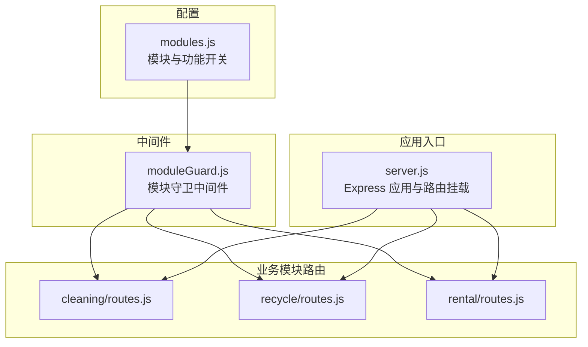
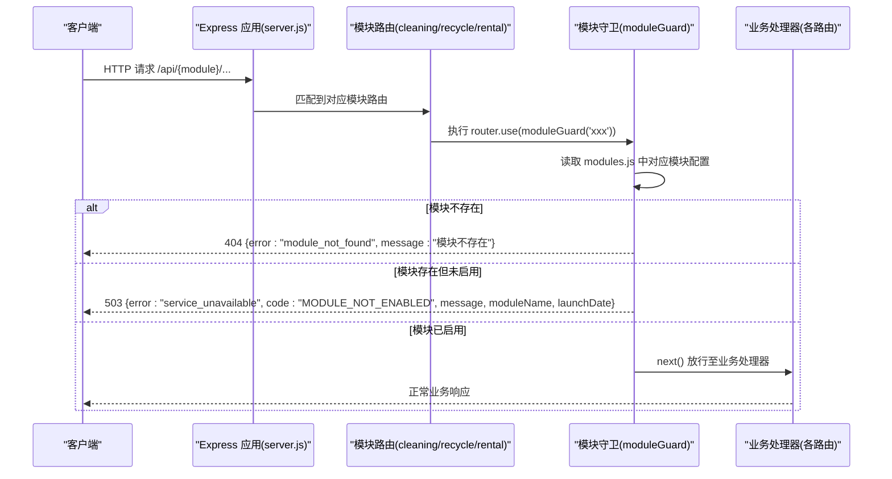
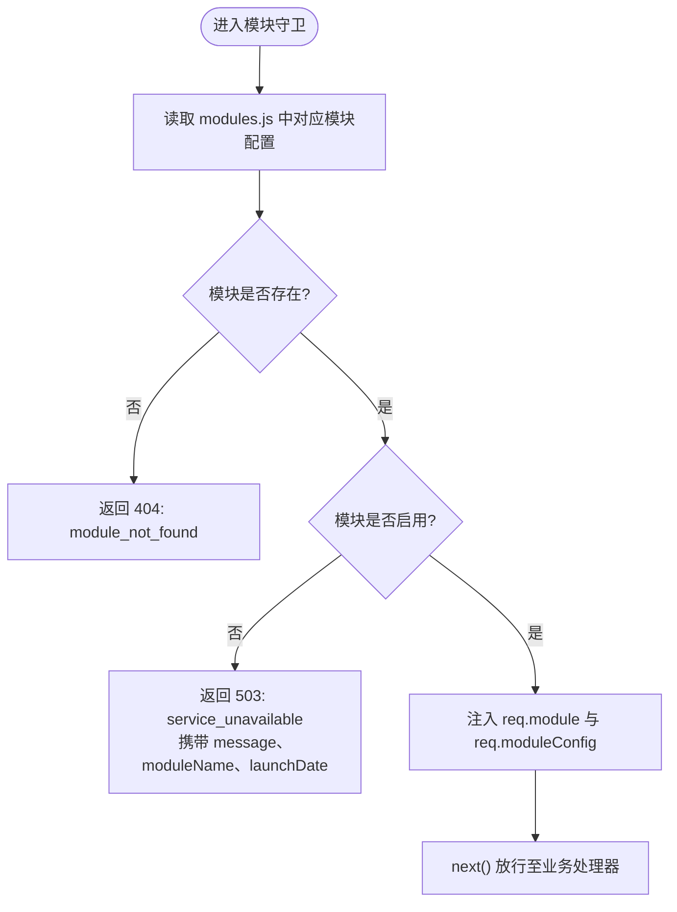
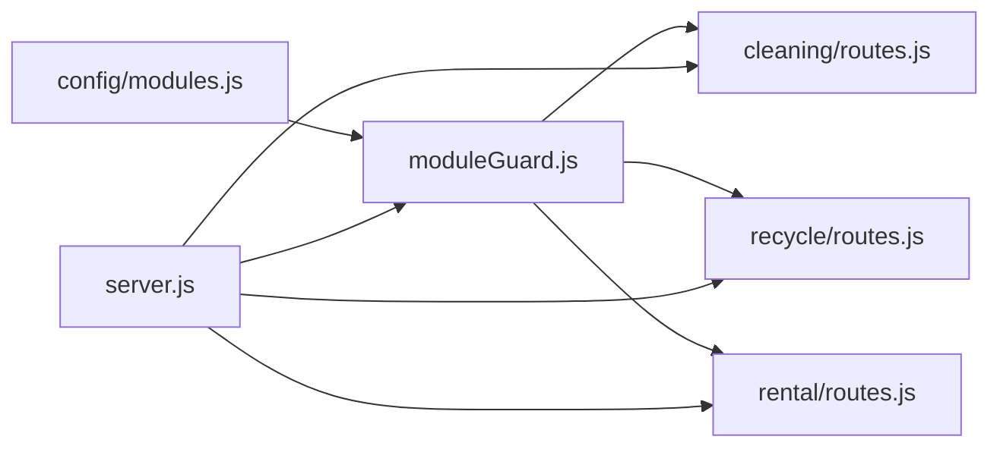

# 模块守卫中间件

<cite>
**本文引用的文件列表**
- [backend/modules/common/middlewares/moduleGuard.js](file://backend/modules/common/middlewares/moduleGuard.js)
- [backend/config/modules.js](file://backend/config/modules.js)
- [backend/server.js](file://backend/server.js)
- [backend/modules/cleaning/routes.js](file://backend/modules/cleaning/routes.js)
- [backend/modules/recycle/routes.js](file://backend/modules/recycle/routes.js)
- [backend/modules/rental/routes.js](file://backend/modules/rental/routes.js)
</cite>

## 目录
1. [简介](#简介)
2. [项目结构](#项目结构)
3. [核心组件](#核心组件)
4. [架构总览](#架构总览)
5. [详细组件分析](#详细组件分析)
6. [依赖关系分析](#依赖关系分析)
7. [性能与扩展性](#性能与扩展性)
8. [故障排查指南](#故障排查指南)
9. [结论](#结论)
10. [附录：错误码与响应规范](#附录错误码与响应规范)

## 简介
本技术文档聚焦干洗店管理系统中的“模块守卫中间件”（moduleGuard），系统性阐述其实现原理、工作流程、注册挂载方式、访问控制机制、错误处理策略以及扩展方法。通过结合源码路径与图示，帮助开发者快速理解并正确使用该中间件，确保按配置动态启用或禁用业务模块，并在前端展示友好提示。

## 项目结构
围绕模块守卫的关键文件组织如下：
- 配置中心：modules.js 集中管理各模块的启用状态、版本、名称、消息等元数据
- 中间件：moduleGuard.js 提供模块开关检查、多模块校验、功能开关查询等能力
- 应用入口：server.js 将各模块路由挂载到 Express 应用，并提供系统接口暴露模块状态
- 业务模块路由：cleaning、recycle、rental 在各自路由文件中通过 moduleGuard 进行模块级拦截

图表来源
- [backend/config/modules.js:1-203](file://backend/config/modules.js#L1-L203)
- [backend/modules/common/middlewares/moduleGuard.js:1-84](file://backend/modules/common/middlewares/moduleGuard.js#L1-L84)
- [backend/server.js:1-152](file://backend/server.js#L1-L152)
- [backend/modules/cleaning/routes.js:1-20](file://backend/modules/cleaning/routes.js#L1-L20)
- [backend/modules/recycle/routes.js:1-15](file://backend/modules/recycle/routes.js#L1-L15)
- [backend/modules/rental/routes.js:1-15](file://backend/modules/rental/routes.js#L1-L15)

章节来源
- [backend/config/modules.js:1-203](file://backend/config/modules.js#L1-L203)
- [backend/modules/common/middlewares/moduleGuard.js:1-84](file://backend/modules/common/middlewares/moduleGuard.js#L1-L84)
- [backend/server.js:1-152](file://backend/server.js#L1-L152)
- [backend/modules/cleaning/routes.js:1-20](file://backend/modules/cleaning/routes.js#L1-L20)
- [backend/modules/recycle/routes.js:1-15](file://backend/modules/recycle/routes.js#L1-L15)
- [backend/modules/rental/routes.js:1-15](file://backend/modules/rental/routes.js#L1-L15)

## 核心组件
- 模块配置中心 modules.js
  - 维护 modules 对象，包含 cleaning、shoe_care、luxury_care、pet_grooming、electronics_repair、rental、rental_leisure、recycle 等模块的 enabled、version、name、message、launchDate 等字段
  - features 对象用于全局功能开关（如 delivery、membership、points、coupon、deposit、credit）
- 模块守卫中间件 moduleGuard.js
  - moduleGuard(moduleName)：返回一个 Express 中间件，根据 moduleName 读取配置，若未找到返回 404；若已定义但 disabled 则返回 503 并附带用户友好的 message、moduleName、launchDate 等信息
  - moduleGuards(...moduleNames)：批量生成多个模块守卫
  - getModuleConfig(moduleName)、getEnabledModules()、isFeatureEnabled(featureName)：辅助工具函数，供系统接口与其他逻辑使用
- 应用入口 server.js
  - 导入 getEnabledModules、getModuleConfig，提供 /api/system/modules 和 /api/system/modules/:name 两个系统接口，便于前端获取模块状态
  - 使用 app.use 将各模块路由挂载到统一前缀下（如 /api/cleaning、/api/recycle、/api/rental）

章节来源
- [backend/config/modules.js:1-203](file://backend/config/modules.js#L1-L203)
- [backend/modules/common/middlewares/moduleGuard.js:1-84](file://backend/modules/common/middlewares/moduleGuard.js#L1-L84)
- [backend/server.js:55-82](file://backend/server.js#L55-L82)

## 架构总览
模块守卫的工作流从请求进入 Express 开始，经过模块路由组内的守卫中间件，再进入具体业务处理器。

图表来源
- [backend/server.js:96-129](file://backend/server.js#L96-L129)
- [backend/modules/cleaning/routes.js:10-15](file://backend/modules/cleaning/routes.js#L10-L15)
- [backend/modules/recycle/routes.js:8-12](file://backend/modules/recycle/routes.js#L8-L12)
- [backend/modules/rental/routes.js:10-15](file://backend/modules/rental/routes.js#L10-L15)
- [backend/modules/common/middlewares/moduleGuard.js:13-42](file://backend/modules/common/middlewares/moduleGuard.js#L13-L42)
- [backend/config/modules.js:16-96](file://backend/config/modules.js#L16-L96)

## 详细组件分析

### 模块守卫中间件（moduleGuard.js）
- 核心职责
  - 读取模块配置，判断是否存在与是否启用
  - 对未启用的模块返回 503 及友好提示，包括 message、moduleName、launchDate
  - 对不存在的模块返回 404
  - 放行时将 req.module 与 req.moduleConfig 注入，供后续处理器使用
- 关键导出
  - moduleGuard(moduleName)：单模块守卫
  - moduleGuards(...moduleNames)：多模块守卫数组
  - getModuleConfig(moduleName)：获取单个模块配置
  - getEnabledModules()：获取所有已启用模块列表
  - isFeatureEnabled(featureName)：检查功能开关
- 复杂度与性能
  - 时间复杂度 O(1)，空间复杂度 O(1)，仅做对象属性查找与条件判断
  - 无 I/O 操作，适合放在路由组最外层作为第一道防线

图表来源
- [backend/modules/common/middlewares/moduleGuard.js:13-42](file://backend/modules/common/middlewares/moduleGuard.js#L13-L42)
- [backend/config/modules.js:16-96](file://backend/config/modules.js#L16-L96)

章节来源
- [backend/modules/common/middlewares/moduleGuard.js:1-84](file://backend/modules/common/middlewares/moduleGuard.js#L1-L84)

### 模块配置（modules.js）
- 数据结构要点
  - modules.cleaning.enabled = true
  - modules.recycle.enabled = false，且带有 message 与 launchDate
  - features.delivery/enabled 等用于全局功能开关
- 作用
  - 为 moduleGuard 提供权威数据源
  - 为系统接口 /api/system/modules 提供版本、模块、功能开关信息

章节来源
- [backend/config/modules.js:1-203](file://backend/config/modules.js#L1-L203)

### 应用入口与路由挂载（server.js）
- 系统接口
  - GET /api/system/modules：返回 VERSION、modules、features、enabledModules
  - GET /api/system/modules/:name：返回指定模块配置
- 模块路由挂载
  - app.use('/api/cleaning', cleaningRouter)
  - app.use('/api/recycle', recycleRouter)
  - app.use('/api/rental', rentalRouter)
- 执行顺序
  - 全局中间件（CORS、body-parser、静态资源）先执行
  - 系统接口优先于业务模块路由
  - 各模块路由内部通过 router.use(moduleGuard('xxx')) 进行模块级拦截

章节来源
- [backend/server.js:55-82](file://backend/server.js#L55-L82)
- [backend/server.js:96-129](file://backend/server.js#L96-L129)

### 业务模块路由集成示例
- 干洗模块（cleaning）
  - 在路由顶部使用 router.use(moduleGuard('cleaning'))，确保所有 /api/cleaning/* 受模块开关保护
- 回收模块（recycle）
  - 同样在路由顶部使用 router.use(moduleGuard('recycle'))，当前 recycle.enabled=false，因此默认返回 503 友好提示
- 租赁模块（rental）
  - 使用 router.use(moduleGuard('rental'))，当 enabled=true 时放行，否则返回 503

章节来源
- [backend/modules/cleaning/routes.js:10-15](file://backend/modules/cleaning/routes.js#L10-L15)
- [backend/modules/recycle/routes.js:8-12](file://backend/modules/recycle/routes.js#L8-L12)
- [backend/modules/rental/routes.js:10-15](file://backend/modules/rental/routes.js#L10-L15)

## 依赖关系分析
- 直接依赖
  - moduleGuard.js 依赖 config/modules.js
  - 各模块路由依赖 moduleGuard.js
  - server.js 依赖 moduleGuard.js 的工具函数以提供系统接口
- 间接依赖
  - 前端可通过 /api/system/modules 获取模块状态，决定是否展示相关入口
- 耦合与内聚
  - 模块开关逻辑集中在 moduleGuard 与 modules.js，低耦合高内聚
  - 路由层只负责声明式挂载守卫，保持清晰职责边界

图表来源
- [backend/config/modules.js:1-203](file://backend/config/modules.js#L1-L203)
- [backend/modules/common/middlewares/moduleGuard.js:1-84](file://backend/modules/common/middlewares/moduleGuard.js#L1-L84)
- [backend/server.js:55-129](file://backend/server.js#L55-L129)
- [backend/modules/cleaning/routes.js:10-15](file://backend/modules/cleaning/routes.js#L10-L15)
- [backend/modules/recycle/routes.js:8-12](file://backend/modules/recycle/routes.js#L8-L12)
- [backend/modules/rental/routes.js:10-15](file://backend/modules/rental/routes.js#L10-L15)

## 性能与扩展性
- 性能特性
  - 模块守卫为纯内存操作，开销极低，适合作为路由组的第一层拦截
- 扩展建议
  - 新增模块：在 modules.js 中添加模块配置，并在对应路由顶部使用 router.use(moduleGuard('newModule'))
  - 组合守卫：使用 moduleGuards('a','b') 在同一路由组内同时检查多个模块
  - 功能开关：在 isFeatureEnabled 基础上扩展更细粒度的功能门控（例如仅在 delivery.enabled 时开放某些接口）
  - 可观测性：可在守卫中增加日志记录（注意脱敏），便于追踪模块启用/禁用情况

[本节为通用指导，无需代码引用]

## 故障排查指南
- 现象：调用 /api/recycle/* 返回 503
  - 原因：modules.recycle.enabled=false
  - 解决：在 modules.js 中将 recycle.enabled 改为 true，或按需调整 message/launchDate
- 现象：调用未知模块返回 404
  - 原因：modules.js 中未定义该模块键名
  - 解决：在 modules.js 中补充模块配置
- 现象：前端无法看到某模块入口
  - 原因：前端可能基于 /api/system/modules 的 enabledModules 决定 UI
  - 解决：确认 modules.js 中对应模块 enabled=true，并重启服务后刷新前端
- 调试技巧
  - 使用 curl 或浏览器访问 /api/system/modules 查看当前模块与功能开关状态
  - 在模块路由处添加临时日志，确认守卫是否被命中
  - 检查 server.js 中路由挂载顺序，确保系统接口优先于业务模块

章节来源
- [backend/config/modules.js:86-96](file://backend/config/modules.js#L86-L96)
- [backend/server.js:55-82](file://backend/server.js#L55-L82)

## 结论
模块守卫中间件通过集中化的模块配置与轻量级的中间件拦截，实现了“按配置动态启用/禁用模块”的能力。配合系统接口，前端可实时感知模块可用性，从而呈现一致的用户体验。该设计具备低耦合、易扩展、高性能的特点，适合在多品类、多版本的干洗系统中持续演进。

[本节为总结性内容，无需代码引用]

## 附录：错误码与响应规范
- 模块不存在
  - 状态码：404
  - 响应体关键字段：success=false、error="module_not_found"、message="模块不存在"
- 模块未启用
  - 状态码：503
  - 响应体关键字段：success=false、error="service_unavailable"、code="MODULE_NOT_ENABLED"、message（来自模块配置的 message 或默认值）、moduleName、launchDate
- 系统接口
  - GET /api/system/modules：返回 version、modules、features、enabledModules
  - GET /api/system/modules/:name：返回指定模块配置

章节来源
- [backend/modules/common/middlewares/moduleGuard.js:17-35](file://backend/modules/common/middlewares/moduleGuard.js#L17-L35)
- [backend/server.js:55-82](file://backend/server.js#L55-L82)