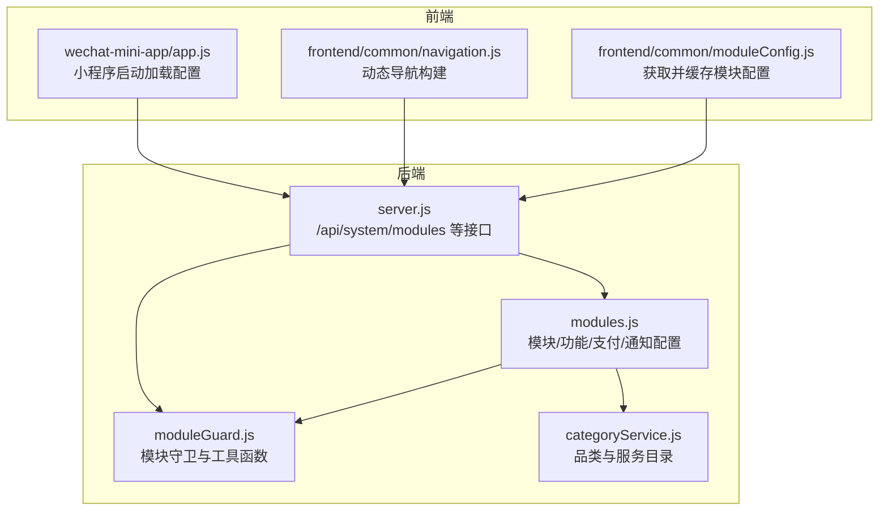
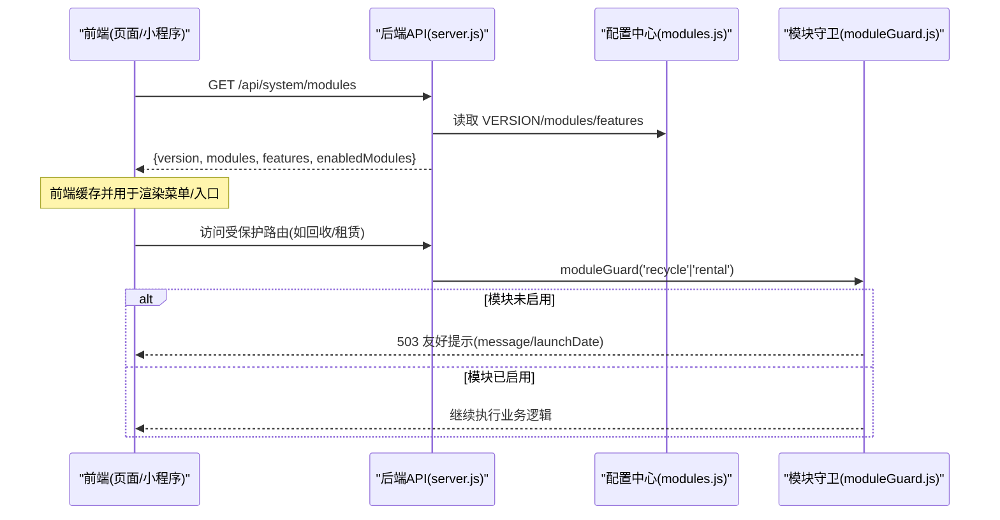
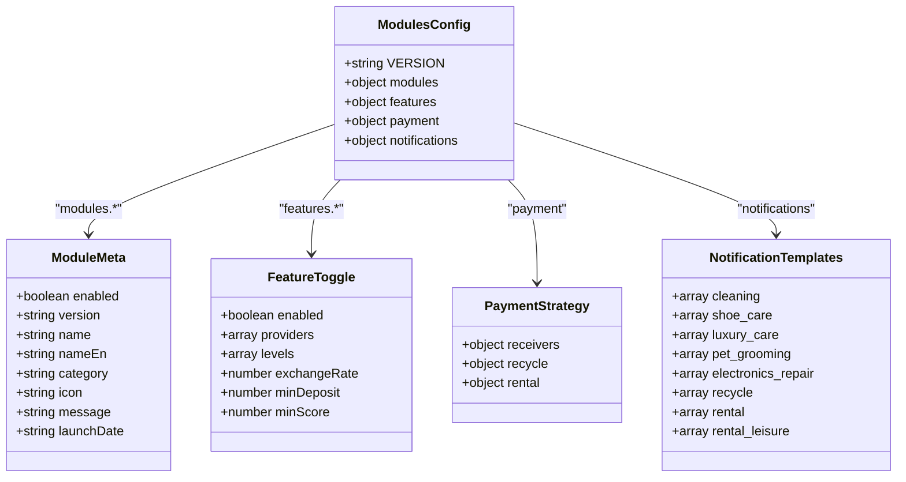
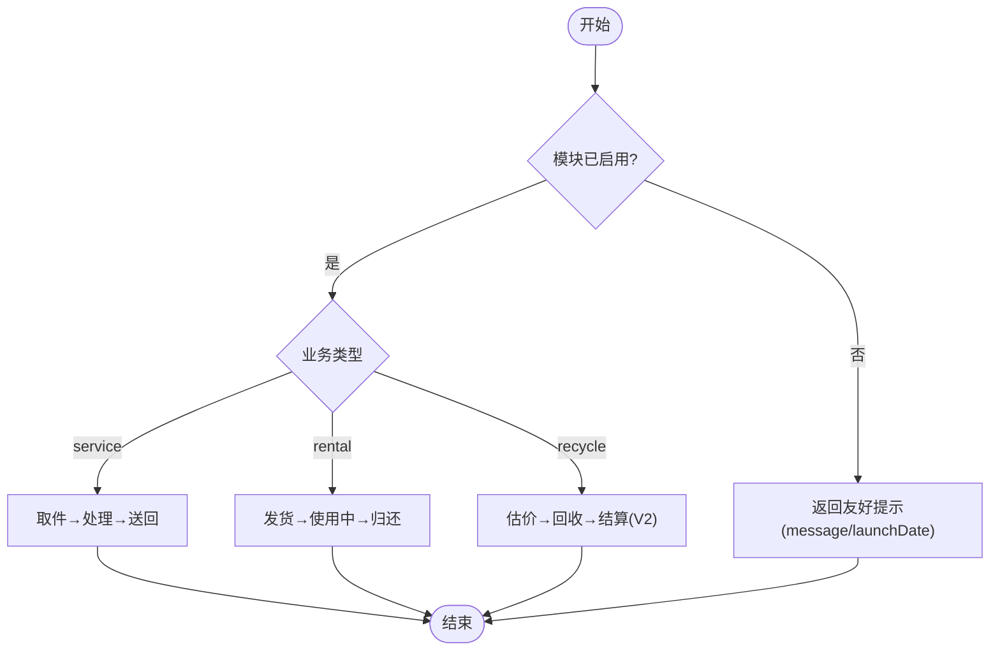
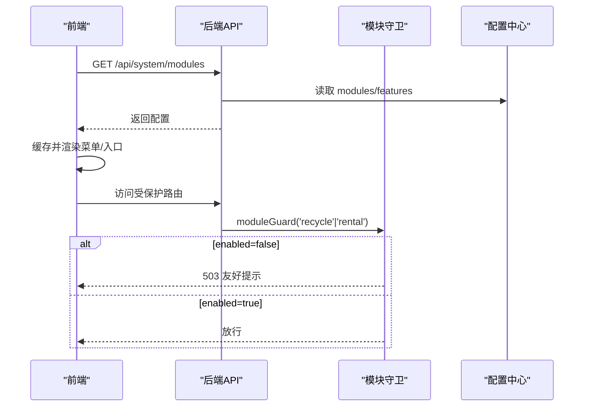
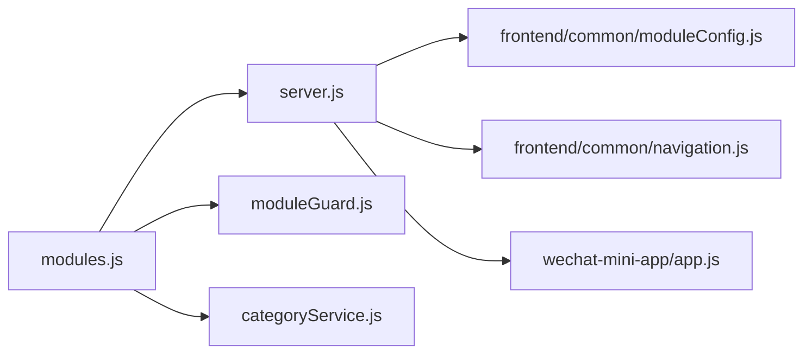

# 模块配置管理

<cite>
**本文引用的文件**   
- [backend/config/modules.js](file://backend/config/modules.js)
- [backend/modules/common/middlewares/moduleGuard.js](file://backend/modules/common/middlewares/moduleGuard.js)
- [backend/server.js](file://backend/server.js)
- [backend/modules/common/services/categoryService.js](file://backend/modules/common/services/categoryService.js)
- [frontend/common/moduleConfig.js](file://frontend/common/moduleConfig.js)
- [frontend/common/navigation.js](file://frontend/common/navigation.js)
- [wechat-mini-app/app.js](file://wechat-mini-app/app.js)
</cite>

## 目录
1. [引言](#引言)
2. [项目结构](#项目结构)
3. [核心组件](#核心组件)
4. [架构总览](#架构总览)
5. [详细组件分析](#详细组件分析)
6. [依赖关系分析](#依赖关系分析)
7. [性能与可用性考虑](#性能与可用性考虑)
8. [故障排查指南](#故障排查指南)
9. [结论](#结论)
10. [附录：扩展指南与最佳实践](#附录扩展指南与最佳实践)

## 引言
本技术文档聚焦干洗店管理系统的“模块配置管理”，围绕后端统一配置文件 modules.js 的结构、设计模式、功能开关机制、支付分账策略、消息模板以及前端动态菜单生成进行系统化说明。文档同时解释多品类业务（服务类 service、租赁类 rental、回收类 recycle）的分类体系与生命周期，并提供配置扩展指南与最佳实践建议，帮助开发者快速理解并安全地扩展系统能力。

## 项目结构
模块配置由后端集中定义，通过统一的系统接口暴露给前端；前端根据返回的模块状态动态渲染导航与入口。关键路径如下：
- 后端配置中心：backend/config/modules.js
- 模块守卫与工具：backend/modules/common/middlewares/moduleGuard.js
- 系统接口：backend/server.js
- 品类与服务目录：backend/modules/common/services/categoryService.js
- 前端模块配置服务：frontend/common/moduleConfig.js
- 前端导航构建：frontend/common/navigation.js
- 小程序启动加载：wechat-mini-app/app.js

图表来源
- [backend/config/modules.js:1-203](file://backend/config/modules.js#L1-L203)
- [backend/modules/common/middlewares/moduleGuard.js:1-84](file://backend/modules/common/middlewares/moduleGuard.js#L1-L84)
- [backend/server.js:55-77](file://backend/server.js#L55-L77)
- [backend/modules/common/services/categoryService.js:1-289](file://backend/modules/common/services/categoryService.js#L1-L289)
- [frontend/common/moduleConfig.js:1-191](file://frontend/common/moduleConfig.js#L1-L191)
- [frontend/common/navigation.js:1-64](file://frontend/common/navigation.js#L1-L64)
- [wechat-mini-app/app.js:123-164](file://wechat-mini-app/app.js#L123-L164)

章节来源
- [backend/config/modules.js:1-203](file://backend/config/modules.js#L1-L203)
- [backend/server.js:55-77](file://backend/server.js#L55-L77)
- [frontend/common/moduleConfig.js:1-191](file://frontend/common/moduleConfig.js#L1-L191)
- [frontend/common/navigation.js:1-64](file://frontend/common/navigation.js#L1-L64)
- [wechat-mini-app/app.js:123-164](file://wechat-mini-app/app.js#L123-L164)

## 核心组件
- 模块配置中心（modules.js）
  - 版本信息：VERSION
  - 模块定义：modules 对象，包含 cleaning、shoe_care、luxury_care、pet_grooming、electronics_repair、rental、rental_leisure、recycle 等
  - 功能开关：features 对象，包含 delivery、membership、points、coupon、deposit、credit
  - 支付配置：payment 对象，包含 receivers、recycle、rental 分账比例
  - 消息模板：notifications 对象，按模块列出事件键集合
- 模块守卫中间件（moduleGuard.js）
  - moduleGuard(moduleName)：未启用模块返回 503 友好提示
  - getEnabledModules()：过滤出已启用模块列表
  - isFeatureEnabled(featureName)：检查功能开关
- 系统接口（server.js）
  - GET /api/system/modules：返回 VERSION、modules、features、enabledModules
- 品类与服务目录（categoryService.js）
  - 定义各品类的服务项、价格、状态流，并按 modules.js 的 enabled 控制可见性
- 前端模块配置服务（frontend/common/moduleConfig.js）
  - 从 /api/system/modules 拉取配置，带本地缓存与降级策略
  - 提供 isModuleEnabled、getModuleMenus、getHomeEntries 等方法
- 前端导航构建（frontend/common/navigation.js）
  - 基于后端模块配置动态构建主导航与子菜单
- 小程序启动加载（wechat-mini-app/app.js）
  - 应用启动时拉取模块配置，计算 enabledModules 并更新 TabBar

章节来源
- [backend/config/modules.js:1-203](file://backend/config/modules.js#L1-L203)
- [backend/modules/common/middlewares/moduleGuard.js:1-84](file://backend/modules/common/middlewares/moduleGuard.js#L1-L84)
- [backend/server.js:55-77](file://backend/server.js#L55-L77)
- [backend/modules/common/services/categoryService.js:1-289](file://backend/modules/common/services/categoryService.js#L1-L289)
- [frontend/common/moduleConfig.js:1-191](file://frontend/common/moduleConfig.js#L1-L191)
- [frontend/common/navigation.js:1-64](file://frontend/common/navigation.js#L1-L64)
- [wechat-mini-app/app.js:123-164](file://wechat-mini-app/app.js#L123-L164)

## 架构总览
模块配置采用“后端集中配置 + 前端动态消费”的模式。后端通过单一配置文件维护所有模块元数据、功能开关、支付分账与消息模板；前端在启动或需要时调用系统接口获取最新配置，并在本地做短时缓存与降级处理，保证用户体验与稳定性。

图表来源
- [backend/server.js:55-77](file://backend/server.js#L55-L77)
- [backend/config/modules.js:1-203](file://backend/config/modules.js#L1-L203)
- [backend/modules/common/middlewares/moduleGuard.js:1-84](file://backend/modules/common/middlewares/moduleGuard.js#L1-L84)

## 详细组件分析

### 模块配置中心（modules.js）结构与字段规范
- 顶层字段
  - VERSION：系统配置版本号，便于前后端对齐
  - modules：模块定义字典，每个模块包含以下元数据字段
    - enabled：布尔值，控制模块是否可用
    - version：模块自身版本号
    - name/nameEn：中/英文名称
    - category：分类标识，service/rental/recycle
    - icon：展示图标（emoji 或图标名）
    - message：当模块禁用时的用户提示文案
    - launchDate：预计上线时间（可选）
  - features：功能开关集合
    - delivery.enabled/providers：配送开关与供应商白名单
    - membership.enabled/levels：会员等级枚举
    - points.enabled/exchangeRate：积分兑换比率
    - coupon.enabled：优惠券开关
    - deposit.enabled/minDeposit：押金开关与最低金额（为租赁准备）
    - credit.enabled/minScore：信用评估开关与最低分数（为租赁准备）
  - payment：支付与分账策略
    - receivers：平台与门店分账比例
    - recycle：回收业务分账比例（用户/平台）
    - rental：租赁业务分账比例（所有者/品牌/平台）
  - notifications：消息模板事件键集合，按模块组织
    - cleaning/shoe_care/luxury_care/pet_grooming/electronics_repair/recycle/rental/rental_leisure 等

图表来源
- [backend/config/modules.js:1-203](file://backend/config/modules.js#L1-L203)

章节来源
- [backend/config/modules.js:1-203](file://backend/config/modules.js#L1-L203)

### 多品类业务分类体系与生命周期
- 分类体系
  - service：服务类（双向跑腿模型：取件→处理→送回），如衣物干洗、鞋类洗护、奢侈品护理、宠物清洗、电子产品维修
  - rental：租赁类（发货→使用中→归还），如服饰租赁、小件商品租赁
  - recycle：回收类（预留，V2），如旧衣回收
- 生命周期与状态流
  - 服务类：pending → paid → delivering → received → processing → ready → completed
  - 租赁类：reserved → paid → shipped → using → due → overdue → returning → returned
  - 回收类：预留状态流，待 V2 实现
- 品类与服务目录
  - categoryService.js 定义了各品类的 services 列表、statusFlow 状态流、颜色与图标等，并通过 modules.js 的 enabled 控制可见性

图表来源
- [backend/modules/common/services/categoryService.js:1-289](file://backend/modules/common/services/categoryService.js#L1-L289)
- [backend/config/modules.js:1-203](file://backend/config/modules.js#L1-L203)

章节来源
- [backend/modules/common/services/categoryService.js:1-289](file://backend/modules/common/services/categoryService.js#L1-L289)
- [backend/config/modules.js:1-203](file://backend/config/modules.js#L1-L203)

### 功能开关机制的实现原理
- 后端守卫
  - moduleGuard(moduleName)：若模块不存在返回 404；若 enabled=false 返回 503 并携带 message 与 launchDate
  - getEnabledModules()：遍历 modules，筛选 enabled=true 的模块
  - isFeatureEnabled(featureName)：读取 features 下对应开关
- 前端消费
  - frontend/common/moduleConfig.js：调用 /api/system/modules 获取配置，缓存 5 分钟，失败则回退到本地默认配置
  - frontend/common/navigation.js：根据 modules.cleaning?.enabled 等字段控制菜单可见性
  - wechat-mini-app/app.js：启动时拉取配置，计算 enabledModules 并更新 TabBar

图表来源
- [backend/server.js:55-77](file://backend/server.js#L55-L77)
- [backend/modules/common/middlewares/moduleGuard.js:1-84](file://backend/modules/common/middlewares/moduleGuard.js#L1-L84)
- [frontend/common/moduleConfig.js:1-191](file://frontend/common/moduleConfig.js#L1-L191)
- [frontend/common/navigation.js:1-64](file://frontend/common/navigation.js#L1-L64)
- [wechat-mini-app/app.js:123-164](file://wechat-mini-app/app.js#L123-L164)

章节来源
- [backend/modules/common/middlewares/moduleGuard.js:1-84](file://backend/modules/common/middlewares/moduleGuard.js#L1-L84)
- [frontend/common/moduleConfig.js:1-191](file://frontend/common/moduleConfig.js#L1-L191)
- [frontend/common/navigation.js:1-64](file://frontend/common/navigation.js#L1-L64)
- [wechat-mini-app/app.js:123-164](file://wechat-mini-app/app.js#L123-L164)

### 支付配置与消息模板
- 支付配置
  - receivers：平台与门店分账比例
  - recycle：回收业务分账比例（用户/平台）
  - rental：租赁业务分账比例（所有者/品牌/平台）
- 消息模板
  - 按模块组织的事件键集合，例如 cleaning、electronics_repair、recycle、rental 等，用于驱动通知服务发送相应消息

章节来源
- [backend/config/modules.js:137-201](file://backend/config/modules.js#L137-L201)

## 依赖关系分析
- 模块配置中心被多处引用：
  - server.js 的系统接口直接读取 modules.js
  - moduleGuard.js 的守卫与工具函数依赖 modules.js
  - categoryService.js 依据 modules.js 的 enabled 控制品类可见性
- 前端依赖后端接口：
  - frontend/common/moduleConfig.js 与 navigation.js 均调用 /api/system/modules
  - wechat-mini-app/app.js 在启动阶段拉取配置并更新 UI

图表来源
- [backend/config/modules.js:1-203](file://backend/config/modules.js#L1-L203)
- [backend/server.js:55-77](file://backend/server.js#L55-L77)
- [backend/modules/common/middlewares/moduleGuard.js:1-84](file://backend/modules/common/middlewares/moduleGuard.js#L1-L84)
- [backend/modules/common/services/categoryService.js:1-289](file://backend/modules/common/services/categoryService.js#L1-L289)
- [frontend/common/moduleConfig.js:1-191](file://frontend/common/moduleConfig.js#L1-L191)
- [frontend/common/navigation.js:1-64](file://frontend/common/navigation.js#L1-L64)
- [wechat-mini-app/app.js:123-164](file://wechat-mini-app/app.js#L123-L164)

章节来源
- [backend/config/modules.js:1-203](file://backend/config/modules.js#L1-L203)
- [backend/server.js:55-77](file://backend/server.js#L55-L77)
- [backend/modules/common/middlewares/moduleGuard.js:1-84](file://backend/modules/common/middlewares/moduleGuard.js#L1-L84)
- [backend/modules/common/services/categoryService.js:1-289](file://backend/modules/common/services/categoryService.js#L1-L289)
- [frontend/common/moduleConfig.js:1-191](file://frontend/common/moduleConfig.js#L1-L191)
- [frontend/common/navigation.js:1-64](file://frontend/common/navigation.js#L1-L64)
- [wechat-mini-app/app.js:123-164](file://wechat-mini-app/app.js#L123-L164)

## 性能与可用性考虑
- 前端缓存
  - moduleConfig.js 对模块配置进行 5 分钟缓存，减少重复请求
  - 导航构建也使用相同 TTL 的缓存策略
- 降级策略
  - 当前端无法获取后端配置时，回退到本地默认配置，确保基本体验
- 超时与容错
  - 会员服务中对数据库查询设置超时保护，避免长时间阻塞
- 建议
  - 合理设置缓存 TTL，平衡实时性与性能
  - 对关键接口增加重试与错误上报
  - 对新增模块的启用/禁用变更，建议配合灰度发布与监控告警

[本节为通用指导，不直接分析具体文件]

## 故障排查指南
- 模块未启用导致 503
  - 现象：访问回收/租赁相关接口返回 503，message 显示“服务暂未开放”
  - 排查：确认 modules.js 中对应模块的 enabled 是否为 true；查看 moduleGuard 返回的错误码与 message
- 前端菜单不显示
  - 现象：首页或服务菜单缺失
  - 排查：检查 /api/system/modules 返回的 modules.cleaning?.enabled 等字段；确认前端缓存是否过期；查看 navigation.js 的 visible 条件
- 小程序 TabBar 异常
  - 现象：TabBar 未按预期显示
  - 排查：确认 app.js 启动时是否正确拉取配置并计算 enabledModules；检查网络请求与超时设置
- 功能开关无效
  - 现象：delivery/coupon 等功能未按预期生效
  - 排查：检查 features 下对应开关的 enabled 字段；确认业务代码是否通过 isFeatureEnabled 判断

章节来源
- [backend/modules/common/middlewares/moduleGuard.js:1-84](file://backend/modules/common/middlewares/moduleGuard.js#L1-L84)
- [frontend/common/moduleConfig.js:1-191](file://frontend/common/moduleConfig.js#L1-L191)
- [frontend/common/navigation.js:1-64](file://frontend/common/navigation.js#L1-L64)
- [wechat-mini-app/app.js:123-164](file://wechat-mini-app/app.js#L123-L164)

## 结论
模块配置管理以 modules.js 为核心，结合 moduleGuard 守卫与系统接口，实现了“集中配置、统一管控、前端动态消费”的架构。通过清晰的模块元数据、功能开关、支付分账与消息模板，系统能够灵活支持多品类业务（service/rental/recycle）的演进与扩展。前端通过缓存与降级策略保障用户体验，整体具备良好的可维护性与可扩展性。

[本节为总结性内容，不直接分析具体文件]

## 附录：扩展指南与最佳实践

### 添加新模块的步骤
- 在 modules.js 中添加模块定义
  - 设置 enabled、version、name/nameEn、category、icon、message、launchDate 等字段
- 在 categoryService.js 中补充品类与服务项
  - 定义 statusFlow、services、颜色与图标等
- 在 notifications 中为该模块添加事件键集合
- 在前端适配
  - frontend/common/moduleConfig.js 的 getModuleMenus/getHomeEntries 中为新模块添加菜单与入口
  - frontend/common/navigation.js 中根据新模块的 enabled 控制导航可见性
  - wechat-mini-app/app.js 中确保能正确解析新模块的 enabled 状态并更新 TabBar
- 测试
  - 验证 /api/system/modules 返回的新模块
  - 验证受保护路由的 503 友好提示与启用后的正常流程

章节来源
- [backend/config/modules.js:1-203](file://backend/config/modules.js#L1-L203)
- [backend/modules/common/services/categoryService.js:1-289](file://backend/modules/common/services/categoryService.js#L1-L289)
- [frontend/common/moduleConfig.js:1-191](file://frontend/common/moduleConfig.js#L1-L191)
- [frontend/common/navigation.js:1-64](file://frontend/common/navigation.js#L1-L64)
- [wechat-mini-app/app.js:123-164](file://wechat-mini-app/app.js#L123-L164)

### 自定义配置项的建议
- 命名规范
  - 模块 key 使用小写下划线，如 electronics_repair
  - 功能开关使用语义化名称，如 delivery、membership、points、coupon、deposit、credit
- 字段完整性
  - 每个模块至少包含 enabled、version、name、category、icon
  - 对于即将上线的模块，建议提供 message 与 launchDate
- 分账策略
  - 明确各参与方比例，确保总和为 1
  - 不同业务线（receivers/recycle/rental）分别配置，避免耦合
- 消息模板
  - 按模块组织事件键，保持与业务状态一致
  - 新增状态时同步更新 notifications 列表

章节来源
- [backend/config/modules.js:1-203](file://backend/config/modules.js#L1-L203)