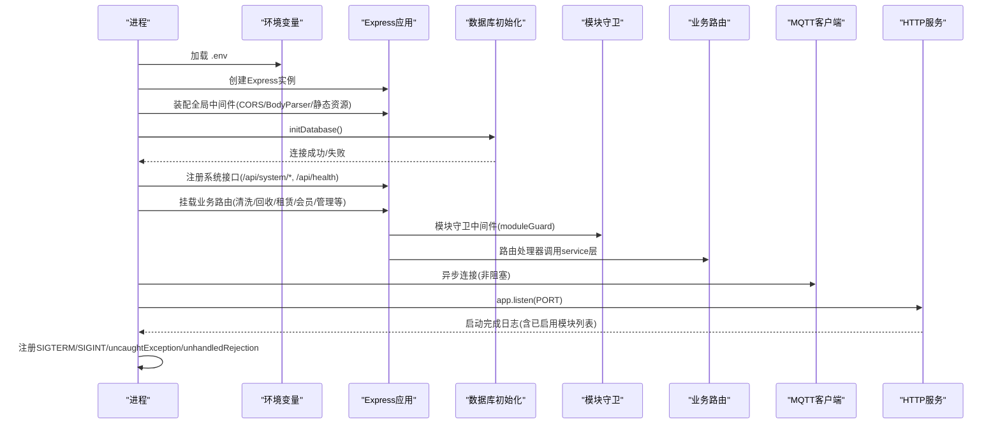
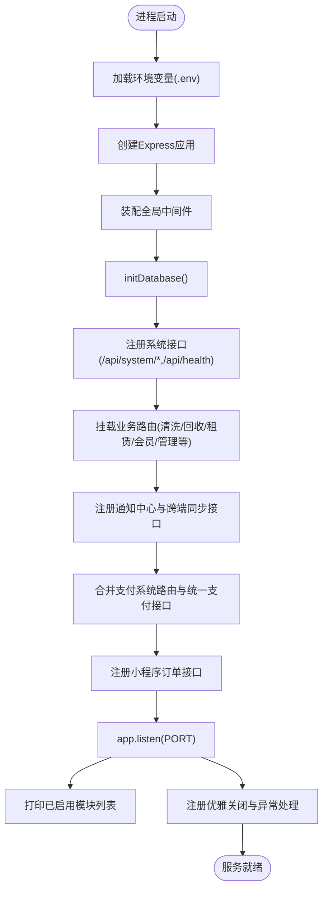
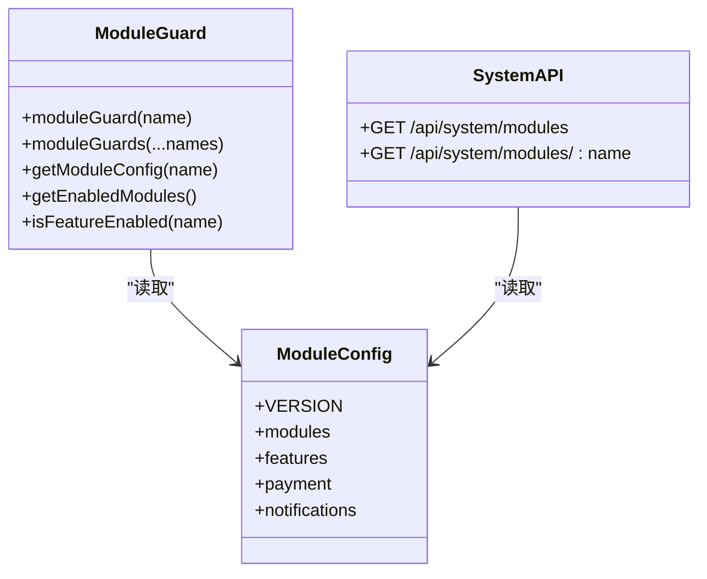
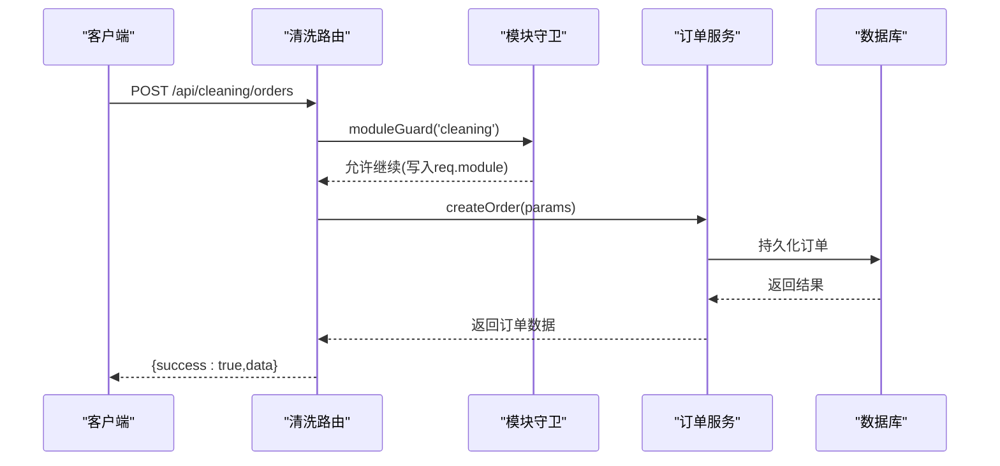
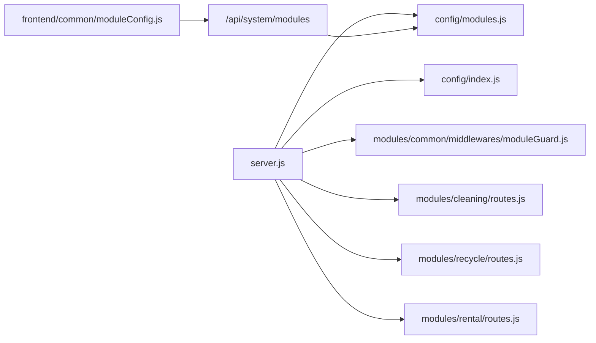

# 运行时加载系统

<cite>
**本文引用的文件**   
- [backend/server.js](file://backend/server.js)
- [backend/config/index.js](file://backend/config/index.js)
- [backend/config/database.js](file://backend/config/database.js)
- [backend/config/modules.js](file://backend/config/modules.js)
- [backend/modules/common/middlewares/moduleGuard.js](file://backend/modules/common/middlewares/moduleGuard.js)
- [backend/modules/cleaning/routes.js](file://backend/modules/cleaning/routes.js)
- [backend/modules/recycle/routes.js](file://backend/modules/recycle/routes.js)
- [backend/modules/rental/routes.js](file://backend/modules/rental/routes.js)
- [frontend/common/moduleConfig.js](file://frontend/common/moduleConfig.js)
</cite>

## 目录
1. [简介](#简介)
2. [项目结构](#项目结构)
3. [核心组件](#核心组件)
4. [架构总览](#架构总览)
5. [详细组件分析](#详细组件分析)
6. [依赖关系分析](#依赖关系分析)
7. [性能与扩展性](#性能与扩展性)
8. [故障排查指南](#故障排查指南)
9. [结论](#结论)
10. [附录：模块开发规范](#附录模块开发规范)

## 简介
本技术文档聚焦干洗店管理系统后端的“运行时加载系统”，围绕服务器启动时的模块加载流程、配置读取、模块初始化、依赖解析与路由注册进行系统化说明。同时，针对动态模块发现机制、模块依赖注入（服务间通信）、错误传播、热重载支持方案以及模块开发规范给出可落地的设计与实践建议，并配套完整的加载流程图与故障排查指南，确保系统在稳定运行的前提下具备良好的可扩展性与可维护性。

## 项目结构
后端采用 Express 作为 HTTP 框架，入口文件负责环境变量加载、数据库连接、中间件装配、各业务模块路由挂载、健康检查与优雅关闭等。模块以“功能域”组织在 backend/modules 下，每个模块包含 routes 与 services 等子目录；公共能力（认证、鉴权、模块守卫等）集中在 common 子模块中。模块开关与特性开关由统一配置文件管理，前端通过系统接口获取模块状态以动态生成菜单。

```mermaid
graph TB
A["后端入口<br/>backend/server.js"] --> B["配置中心<br/>backend/config/index.js"]
A --> C["模块开关配置<br/>backend/config/modules.js"]
A --> D["模块守卫中间件<br/>backend/modules/common/middlewares/moduleGuard.js"]
A --> E["干洗模块路由<br/>backend/modules/cleaning/routes.js"]
A --> F["回收模块路由<br/>backend/modules/recycle/routes.js]
A --> G["租赁模块路由<br/>backend/modules/rental/routes.js"]
H["前端模块配置服务<br/>frontend/common/moduleConfig.js"] --> I["系统接口 /api/system/modules"]
I --> C
```

图表来源
- [backend/server.js:1-120](file://backend/server.js#L1-L120)
- [backend/config/index.js:1-60](file://backend/config/index.js#L1-L60)
- [backend/config/modules.js:1-40](file://backend/config/modules.js#L1-L40)
- [backend/modules/common/middlewares/moduleGuard.js:1-40](file://backend/modules/common/middlewares/moduleGuard.js#L1-L40)
- [backend/modules/cleaning/routes.js:1-20](file://backend/modules/cleaning/routes.js#L1-L20)
- [backend/modules/recycle/routes.js:1-20](file://backend/modules/recycle/routes.js#L1-L20)
- [backend/modules/rental/routes.js:1-20](file://backend/modules/rental/routes.js#L1-L20)
- [frontend/common/moduleConfig.js:1-40](file://frontend/common/moduleConfig.js#L1-L40)

章节来源
- [backend/server.js:1-120](file://backend/server.js#L1-L120)
- [backend/config/index.js:1-60](file://backend/config/index.js#L1-L60)
- [backend/config/modules.js:1-40](file://backend/config/modules.js#L1-L40)
- [backend/modules/common/middlewares/moduleGuard.js:1-40](file://backend/modules/common/middlewares/moduleGuard.js#L1-L40)
- [backend/modules/cleaning/routes.js:1-20](file://backend/modules/cleaning/routes.js#L1-L20)
- [backend/modules/recycle/routes.js:1-20](file://backend/modules/recycle/routes.js#L1-L20)
- [backend/modules/rental/routes.js:1-20](file://backend/modules/rental/routes.js#L1-L20)
- [frontend/common/moduleConfig.js:1-40](file://frontend/common/moduleConfig.js#L1-L40)

## 核心组件
- 服务器入口与生命周期管理：负责环境变量加载、Express 应用构建、中间件装配、路由挂载、健康检查、错误处理、进程信号监听与优雅关闭。
- 配置中心：提供数据库连接初始化与关闭、MySQL/MongoDB 双引擎支持、事务与便捷查询封装。
- 模块开关与特性开关：集中管理模块启用/禁用、版本信息、消息提示、功能开关与支付分账策略等。
- 模块守卫中间件：在请求进入模块路由前校验模块是否启用，未启用返回友好提示，并在 req 上附加模块上下文。
- 业务模块路由与服务：按领域划分，如干洗、回收、租赁等，各自暴露 REST API，并通过 service 层访问数据与外部服务。
- 前端模块配置服务：从后端系统接口拉取模块状态，缓存并用于动态导航与菜单渲染。

章节来源
- [backend/server.js:1-120](file://backend/server.js#L1-L120)
- [backend/config/index.js:1-120](file://backend/config/index.js#L1-L120)
- [backend/config/modules.js:1-120](file://backend/config/modules.js#L1-L120)
- [backend/modules/common/middlewares/moduleGuard.js:1-84](file://backend/modules/common/middlewares/moduleGuard.js#L1-L84)
- [backend/modules/cleaning/routes.js:1-60](file://backend/modules/cleaning/routes.js#L1-L60)
- [backend/modules/recycle/routes.js:1-39](file://backend/modules/recycle/routes.js#L1-L39)
- [backend/modules/rental/routes.js:1-60](file://backend/modules/rental/routes.js#L1-L60)
- [frontend/common/moduleConfig.js:1-60](file://frontend/common/moduleConfig.js#L1-L60)

## 架构总览
下图展示了后端启动时关键步骤的时序：环境变量加载、数据库初始化、模块守卫与路由挂载、健康检查与系统接口、MQTT 灯条服务异步连接、HTTP 服务启动、错误与优雅关闭处理。



图表来源
- [backend/server.js:1-120](file://backend/server.js#L1-L120)
- [backend/server.js:615-702](file://backend/server.js#L615-L702)
- [backend/config/index.js:1-60](file://backend/config/index.js#L1-L60)
- [backend/modules/common/middlewares/moduleGuard.js:1-40](file://backend/modules/common/middlewares/moduleGuard.js#L1-L40)

章节来源
- [backend/server.js:1-120](file://backend/server.js#L1-L120)
- [backend/server.js:615-702](file://backend/server.js#L615-L702)
- [backend/config/index.js:1-60](file://backend/config/index.js#L1-L60)
- [backend/modules/common/middlewares/moduleGuard.js:1-40](file://backend/modules/common/middlewares/moduleGuard.js#L1-L40)

## 详细组件分析

### 服务器启动与模块加载流程
- 环境变量加载：入口文件显式指定 .env 路径，便于多环境部署。
- 中间件装配：CORS、JSON/URL编码解析、静态资源托管、favicon 响应。
- 数据库初始化：根据配置选择 MongoDB 或 MySQL，建立连接池/连接，异常抛出以便上层捕获。
- 系统接口注册：/api/system/modules 与 /api/system/modules/:name 暴露模块清单与单个模块配置；/api/health 提供健康检查。
- 业务路由挂载：清洗、回收、租赁、会员、管理员、连锁后台、门店端公共API、订单-灯条绑定、取件、同步、消息中心等路由依次挂载。
- 通知中心与跨端同步：基于内存服务的通知与同步接口，提供轮询与广播能力。
- 支付系统合并：将原独立支付服务的路由与统一支付接口并入主应用。
- 小程序订单接口：待取件订单、微信支付统一下单（含模拟支付降级）。
- 错误处理与优雅关闭：全局错误中间件、端口占用检测、SIGTERM/SIGINT 处理、未捕获异常与未处理 Promise 拒绝保护。



图表来源
- [backend/server.js:1-120](file://backend/server.js#L1-L120)
- [backend/server.js:615-702](file://backend/server.js#L615-L702)

章节来源
- [backend/server.js:1-120](file://backend/server.js#L1-L120)
- [backend/server.js:615-702](file://backend/server.js#L615-L702)

### 配置读取与模块开关
- 模块开关配置：modules.js 集中定义模块元数据（名称、版本、图标、分类、启用状态、提示信息、上线日期等），并提供 features 功能开关与支付分账策略。
- 模块守卫中间件：moduleGuard 在请求进入模块路由前校验模块是否存在且已启用；未启用返回 503 并附带友好 message 与 launchDate；启用后将模块上下文写入 req.module 与 req.moduleConfig。
- 系统接口：/api/system/modules 返回当前版本、全部模块配置、功能开关与已启用模块列表；/api/system/modules/:name 返回单个模块配置。



图表来源
- [backend/config/modules.js:1-120](file://backend/config/modules.js#L1-L120)
- [backend/modules/common/middlewares/moduleGuard.js:1-84](file://backend/modules/common/middlewares/moduleGuard.js#L1-L84)
- [backend/server.js:55-82](file://backend/server.js#L55-L82)

章节来源
- [backend/config/modules.js:1-120](file://backend/config/modules.js#L1-L120)
- [backend/modules/common/middlewares/moduleGuard.js:1-84](file://backend/modules/common/middlewares/moduleGuard.js#L1-L84)
- [backend/server.js:55-82](file://backend/server.js#L55-L82)

### 动态模块发现与自动注册（现状与建议）
- 现状：当前后端采用“显式 require + app.use 挂载”的方式注册模块路由，未在启动时扫描 modules 目录自动发现模块。
- 建议方案：实现一个“模块发现器”，在启动阶段遍历 backend/modules 下的业务模块目录，读取模块描述文件（例如 module.json）或约定式导出（如 index.js 暴露 metadata 与 register(app)），然后自动挂载路由与中间件。该方案需保证：
  - 模块描述文件包含 name、enabled、version、message、category、icon 等字段，与 modules.js 保持一致。
  - 自动注册过程具备幂等与容错，避免重复挂载与循环依赖。
  - 对未启用的模块仅记录日志，不挂载路由，减少攻击面。
  - 为热重载预留钩子（见下一节）。

[本节为概念性设计，不直接分析具体文件，故无章节来源]

### 模块依赖注入与服务间通信
- 当前模式：路由层通过 require 引入对应 service 层函数，service 层再访问数据库或外部服务。模块间耦合通过显式 require 实现。
- 改进建议：引入轻量级依赖注入容器（如 InversifyJS 或自定义简单 DI），以“服务注册表”形式集中管理服务实例，模块通过名称或接口契约消费服务，降低硬编码依赖，提升可测试性与可替换性。
- 服务间通信：
  - 同步调用：通过 DI 容器获取服务实例，直接调用方法。
  - 异步事件：基于内置事件总线或消息队列（如 MQTT/Redis Pub/Sub）解耦跨模块事件（如订单状态变更触发通知、积分、消息中心）。
  - 错误传播：统一错误类型与错误码，service 层抛出结构化错误，路由层捕获并转换为标准 JSON 响应；全局错误中间件兜底。

[本节为概念性设计，不直接分析具体文件，故无章节来源]

### 模块热重载支持方案
- 目标：在不重启进程的前提下，实现配置变更监听、模块重新加载与服务无缝切换。
- 推荐实现：
  - 配置变更监听：使用 fs.watch 或 chokidar 监听 modules.js 与模块描述文件，变更时触发“热更新”。
  - 模块重新加载：对已加载模块执行卸载与重建（注意清理定时器、事件监听器、数据库连接句柄等），或使用“路由级热插拔”——先卸载旧路由，再挂载新路由。
  - 服务无缝切换：采用蓝绿发布思想，在内存中维护两套路由树，切换时原子替换引用，避免请求中断。
  - 一致性保障：热更新期间对写操作加锁或排队，防止并发导致的状态不一致。
  - 回滚机制：新版本加载失败时自动回滚到上一版本。

[本节为概念性设计，不直接分析具体文件，故无章节来源]

### 关键业务流程示例：干洗订单创建


图表来源
- [backend/modules/cleaning/routes.js:24-42](file://backend/modules/cleaning/routes.js#L24-L42)
- [backend/modules/common/middlewares/moduleGuard.js:13-41](file://backend/modules/common/middlewares/moduleGuard.js#L13-L41)
- [backend/modules/cleaning/services/orderService.js:177-200](file://backend/modules/cleaning/services/orderService.js#L177-L200)

章节来源
- [backend/modules/cleaning/routes.js:24-42](file://backend/modules/cleaning/routes.js#L24-L42)
- [backend/modules/common/middlewares/moduleGuard.js:13-41](file://backend/modules/common/middlewares/moduleGuard.js#L13-L41)
- [backend/modules/cleaning/services/orderService.js:177-200](file://backend/modules/cleaning/services/orderService.js#L177-L200)

## 依赖关系分析
- 入口依赖：server.js 依赖 config/index.js（数据库初始化）、config/modules.js（模块开关）、common/middlewares/moduleGuard.js（模块守卫），以及各业务模块路由。
- 模块内依赖：各模块路由依赖自身 services 与 common 中间件；service 层依赖数据库配置与第三方服务（如支付、通知）。
- 前端依赖：frontend/common/moduleConfig.js 依赖后端 /api/system/modules 接口，用于动态菜单与导航。



图表来源
- [backend/server.js:1-120](file://backend/server.js#L1-L120)
- [backend/config/index.js:1-60](file://backend/config/index.js#L1-L60)
- [backend/config/modules.js:1-40](file://backend/config/modules.js#L1-L40)
- [backend/modules/common/middlewares/moduleGuard.js:1-40](file://backend/modules/common/middlewares/moduleGuard.js#L1-L40)
- [backend/modules/cleaning/routes.js:1-20](file://backend/modules/cleaning/routes.js#L1-L20)
- [backend/modules/recycle/routes.js:1-20](file://backend/modules/recycle/routes.js#L1-L20)
- [backend/modules/rental/routes.js:1-20](file://backend/modules/rental/routes.js#L1-L20)
- [frontend/common/moduleConfig.js:1-40](file://frontend/common/moduleConfig.js#L1-L40)

章节来源
- [backend/server.js:1-120](file://backend/server.js#L1-L120)
- [backend/config/index.js:1-60](file://backend/config/index.js#L1-L60)
- [backend/config/modules.js:1-40](file://backend/config/modules.js#L1-L40)
- [backend/modules/common/middlewares/moduleGuard.js:1-40](file://backend/modules/common/middlewares/moduleGuard.js#L1-L40)
- [backend/modules/cleaning/routes.js:1-20](file://backend/modules/cleaning/routes.js#L1-L20)
- [backend/modules/recycle/routes.js:1-20](file://backend/modules/recycle/routes.js#L1-L20)
- [backend/modules/rental/routes.js:1-20](file://backend/modules/rental/routes.js#L1-L20)
- [frontend/common/moduleConfig.js:1-40](file://frontend/common/moduleConfig.js#L1-L40)

## 性能与扩展性
- 启动性能：数据库连接为串行初始化，建议在多库场景下并行初始化并设置超时与重试；模块路由挂载为同步 require，建议按需懒加载大模块。
- 请求路径：模块守卫前置拦截可减少无效请求进入业务逻辑；对高频只读接口考虑缓存（如 Redis）。
- 扩展性：通过“模块发现+自动注册”与“依赖注入”降低新增模块成本；通过“热重载”缩短迭代周期。
- 可靠性：全局错误中间件与进程异常保护避免崩溃；优雅关闭确保正在处理的请求完成后再退出。

[本节为通用指导，不直接分析具体文件，故无章节来源]

## 故障排查指南
- 端口冲突：启动时若端口被占用，会输出明确错误并退出。可通过系统命令查看占用进程并终止。
- 数据库连接失败：initDatabase 抛出异常，需在 .env 中核对 DB_TYPE、MongoDB URI 或 MySQL 连接参数。
- 模块未启用：访问模块路由返回 503，携带 MODULE_NOT_ENABLED 错误码与 message/launchDate，确认 modules.js 中 enabled 标志。
- 模块不存在：模块守卫返回 404，确认模块名拼写与配置一致。
- 健康检查：/api/health 返回 ok 表示服务可用；/api/system/modules 返回模块清单与已启用列表，用于前端菜单渲染。
- 未处理异常：uncaughtException 与 unhandledRejection 会记录日志，必要时结合 PM2 或进程管理器自动重启。

章节来源
- [backend/server.js:655-702](file://backend/server.js#L655-L702)
- [backend/config/index.js:1-120](file://backend/config/index.js#L1-L120)
- [backend/modules/common/middlewares/moduleGuard.js:13-41](file://backend/modules/common/middlewares/moduleGuard.js#L13-L41)
- [backend/server.js:55-90](file://backend/server.js#L55-L90)

## 结论
本运行时加载系统以“配置驱动+中间件守卫+显式路由挂载”为核心，实现了模块的灵活开关与快速接入。在此基础上，建议逐步引入“模块发现与自动注册”、“依赖注入容器”与“热重载机制”，进一步提升系统的可扩展性、可维护性与交付效率。配合完善的错误处理与监控告警，可在生产环境中保持高可用与稳定性。

[本节为总结性内容，不直接分析具体文件，故无章节来源]

## 附录：模块开发规范
- 标准模块结构
  - 根目录：模块名（如 cleaning/recycle/rental）
  - routes：Express 路由文件，统一使用 moduleGuard 守卫
  - services：业务逻辑实现，尽量纯函数或类，避免副作用
  - middlewares：模块专属中间件（可选）
  - models：数据模型（可选，优先复用 common/models）
- 接口约定
  - 统一响应格式：{ success, data?, error?, message? }
  - 错误码：业务错误使用明确 code，如 MODULE_NOT_ENABLED
  - 权限控制：结合认证与 RBAC 中间件，区分公开/受保护接口
- 配置与开关
  - 在 modules.js 中声明模块元数据与启用状态
  - 新功能通过 features 开关渐进开放
- 测试要求
  - 单元测试：覆盖核心 service 逻辑
  - 集成测试：覆盖路由到 service 的端到端流程
  - 模块守卫测试：验证未启用模块返回 503
- 文档与可观测性
  - 模块 README：说明职责、依赖、配置项与示例
  - 日志：关键路径打点，便于问题定位
  - 指标：QPS、错误率、P95/P99 延迟

[本节为通用规范，不直接分析具体文件，故无章节来源]