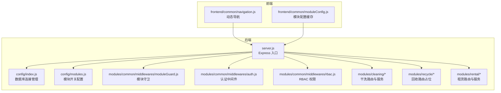
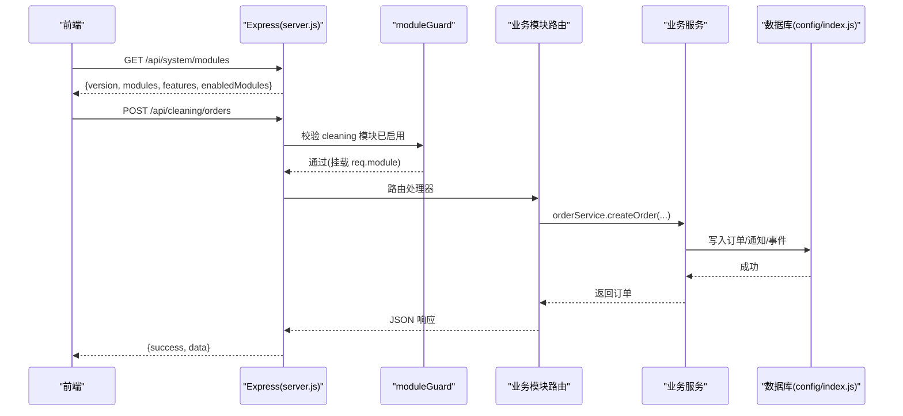
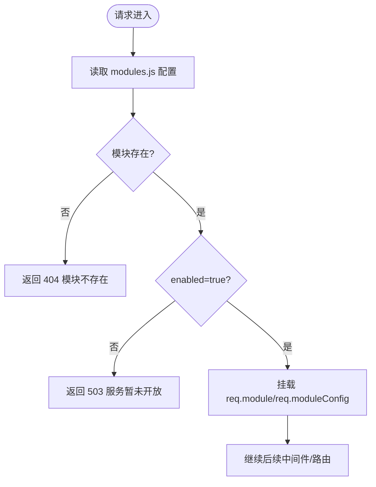
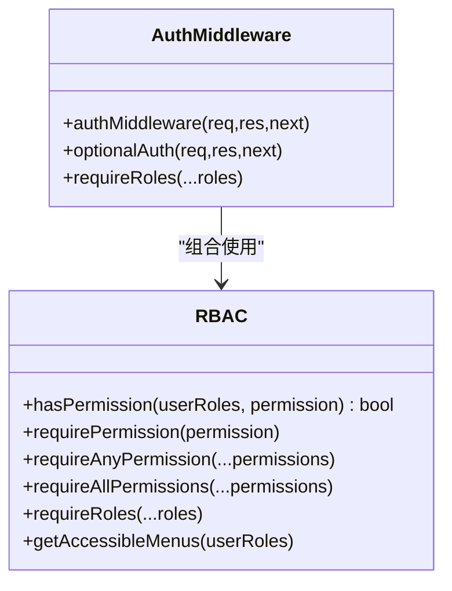
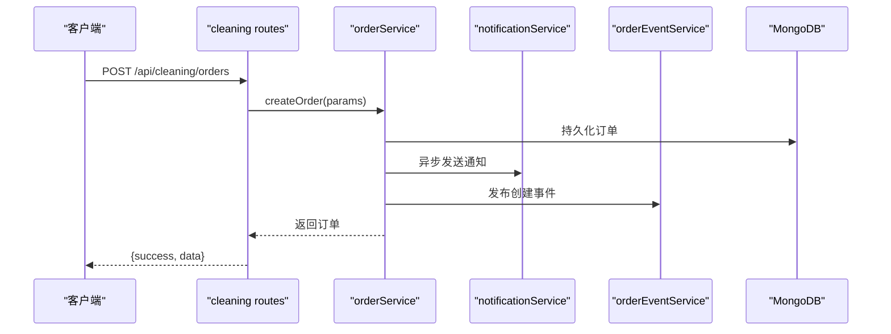
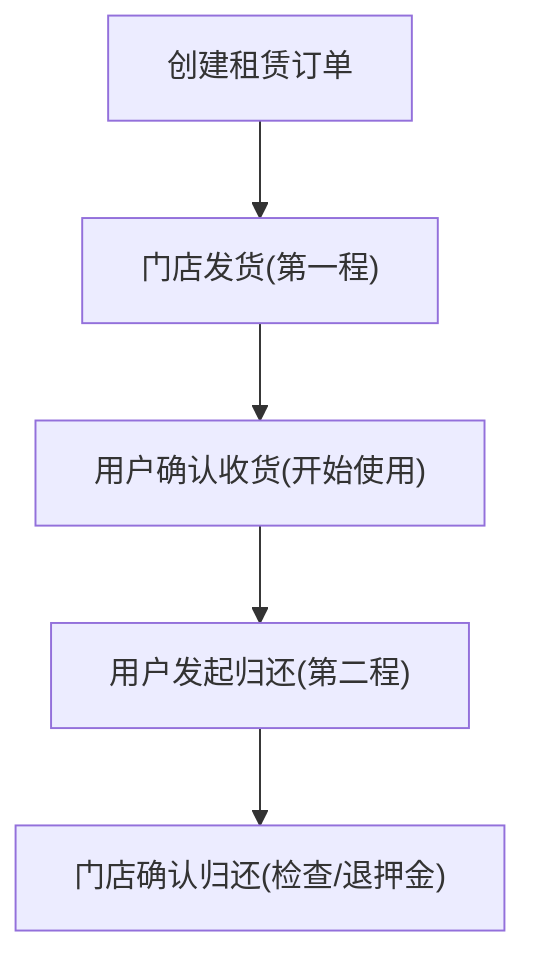
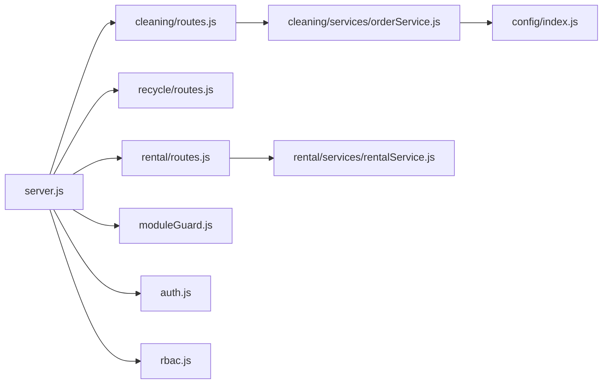

# 模块化架构设计

<cite>
**本文引用的文件**   
- [backend/server.js](file://backend/server.js)
- [backend/config/modules.js](file://backend/config/modules.js)
- [backend/config/index.js](file://backend/config/index.js)
- [backend/modules/common/middlewares/moduleGuard.js](file://backend/modules/common/middlewares/moduleGuard.js)
- [backend/modules/common/middlewares/auth.js](file://backend/modules/common/middlewares/auth.js)
- [backend/modules/common/middlewares/rbac.js](file://backend/modules/common/middlewares/rbac.js)
- [backend/modules/cleaning/routes.js](file://backend/modules/cleaning/routes.js)
- [backend/modules/cleaning/services/orderService.js](file://backend/modules/cleaning/services/orderService.js)
- [backend/modules/recycle/routes.js](file://backend/modules/recycle/routes.js)
- [backend/modules/rental/routes.js](file://backend/modules/rental/routes.js)
- [backend/modules/rental/services/rentalService.js](file://backend/modules/rental/services/rentalService.js)
- [frontend/common/navigation.js](file://frontend/common/navigation.js)
- [frontend/common/moduleConfig.js](file://frontend/common/moduleConfig.js)
</cite>

## 目录
1. [引言](#引言)
2. [项目结构](#项目结构)
3. [核心组件](#核心组件)
4. [架构总览](#架构总览)
5. [详细组件分析](#详细组件分析)
6. [依赖分析](#依赖分析)
7. [性能考虑](#性能考虑)
8. [故障排查指南](#故障排查指南)
9. [结论](#结论)
10. [附录：模块开发规范与最佳实践](#附录模块开发规范与最佳实践)

## 引言
本设计文档面向干洗店管理系统的模块化架构，围绕业务领域划分（cleaning 干洗、recycle 回收、rental 租赁）、动态模块加载机制（配置管理、启用/禁用控制、依赖注入）、模块间通信模式（HTTP API、事件驱动、共享服务访问）、公共横切关注点（认证中间件、权限控制、错误处理、日志记录）以及模块边界与接口规范进行系统化阐述。同时提供新模块创建流程、测试策略与版本管理建议，帮助开发者快速、高质量地扩展系统能力。

## 项目结构
后端采用 Express 应用作为统一入口，按“业务模块 + 公共模块”组织代码；前端通过统一的系统模块状态接口动态渲染导航与功能入口，实现前后端一致的模块开关体验。

图表来源
- [backend/server.js:1-150](file://backend/server.js#L1-L150)
- [backend/config/index.js:1-167](file://backend/config/index.js#L1-L167)
- [backend/config/modules.js:1-203](file://backend/config/modules.js#L1-L203)
- [backend/modules/common/middlewares/moduleGuard.js:1-84](file://backend/modules/common/middlewares/moduleGuard.js#L1-L84)
- [backend/modules/common/middlewares/auth.js:1-207](file://backend/modules/common/middlewares/auth.js#L1-L207)
- [backend/modules/common/middlewares/rbac.js:1-172](file://backend/modules/common/middlewares/rbac.js#L1-L172)
- [backend/modules/cleaning/routes.js:1-120](file://backend/modules/cleaning/routes.js#L1-L120)
- [backend/modules/recycle/routes.js:1-39](file://backend/modules/recycle/routes.js#L1-L39)
- [backend/modules/rental/routes.js:1-156](file://backend/modules/rental/routes.js#L1-L156)
- [frontend/common/navigation.js:1-64](file://frontend/common/navigation.js#L1-L64)
- [frontend/common/moduleConfig.js:1-57](file://frontend/common/moduleConfig.js#L1-L57)

章节来源
- [backend/server.js:1-150](file://backend/server.js#L1-L150)
- [backend/config/index.js:1-167](file://backend/config/index.js#L1-L167)
- [backend/config/modules.js:1-203](file://backend/config/modules.js#L1-L203)
- [backend/modules/common/middlewares/moduleGuard.js:1-84](file://backend/modules/common/middlewares/moduleGuard.js#L1-L84)
- [backend/modules/common/middlewares/auth.js:1-207](file://backend/modules/common/middlewares/auth.js#L1-L207)
- [backend/modules/common/middlewares/rbac.js:1-172](file://backend/modules/common/middlewares/rbac.js#L1-L172)
- [backend/modules/cleaning/routes.js:1-120](file://backend/modules/cleaning/routes.js#L1-L120)
- [backend/modules/recycle/routes.js:1-39](file://backend/modules/recycle/routes.js#L1-L39)
- [backend/modules/rental/routes.js:1-156](file://backend/modules/rental/routes.js#L1-L156)
- [frontend/common/navigation.js:1-64](file://frontend/common/navigation.js#L1-L64)
- [frontend/common/moduleConfig.js:1-57](file://frontend/common/moduleConfig.js#L1-L57)

## 核心组件
- 模块开关与动态加载
  - 模块配置集中定义于 modules.js，包含各模块的 enabled、version、name、category、message 等元信息。
  - moduleGuard 中间件在请求进入时校验模块是否启用，未启用返回 503 并附带友好提示。
  - server.js 暴露 /api/system/modules 和 /api/system/modules/:name 供前端查询当前可用模块与单个模块配置。
- 认证与权限
  - authMiddleware 解析 Bearer Token，支持开发环境 mock token，并将用户上下文挂载到 req.user。
  - optionalAuth 允许可选认证，便于匿名或跨平台兼容场景。
  - rbac 提供基于角色的权限检查中间件与菜单过滤工具。
- 业务模块
  - cleaning：完整实现订单生命周期、定价、门店配置同步、智能灯条联动等。
  - recycle：V2 占位路由，返回“服务暂未开放”。
  - rental：V3 占位路由与服务骨架，支持双向跑腿模型（发货/归还）。
- 数据层
  - config/index.js 统一管理 MongoDB/MySQL 连接池与事务封装，提供 query/transaction 便捷方法。

章节来源
- [backend/config/modules.js:1-203](file://backend/config/modules.js#L1-L203)
- [backend/modules/common/middlewares/moduleGuard.js:1-84](file://backend/modules/common/middlewares/moduleGuard.js#L1-L84)
- [backend/server.js:55-83](file://backend/server.js#L55-L83)
- [backend/modules/common/middlewares/auth.js:1-207](file://backend/modules/common/middlewares/auth.js#L1-L207)
- [backend/modules/common/middlewares/rbac.js:1-172](file://backend/modules/common/middlewares/rbac.js#L1-L172)
- [backend/modules/cleaning/routes.js:1-120](file://backend/modules/cleaning/routes.js#L1-L120)
- [backend/modules/recycle/routes.js:1-39](file://backend/modules/recycle/routes.js#L1-L39)
- [backend/modules/rental/routes.js:1-156](file://backend/modules/rental/routes.js#L1-L156)
- [backend/config/index.js:1-167](file://backend/config/index.js#L1-L167)

## 架构总览
系统以 Express 为网关，统一注册各业务模块路由，并通过模块守卫实现运行时开关。前端通过系统模块接口动态生成导航与功能入口，形成“后端配置驱动 + 前端动态渲染”的闭环。

图表来源
- [backend/server.js:55-83](file://backend/server.js#L55-L83)
- [backend/modules/common/middlewares/moduleGuard.js:1-84](file://backend/modules/common/middlewares/moduleGuard.js#L1-L84)
- [backend/modules/cleaning/routes.js:1-120](file://backend/modules/cleaning/routes.js#L1-L120)
- [backend/modules/cleaning/services/orderService.js:1-120](file://backend/modules/cleaning/services/orderService.js#L1-L120)
- [backend/config/index.js:1-167](file://backend/config/index.js#L1-L167)

## 详细组件分析

### 模块开关与动态加载
- 配置中心
  - modules.js 维护所有模块的元信息与功能开关，包括清洗、鞋类护理、奢侈品护理、宠物清洗、电子产品维修、服饰租赁、小件商品租赁、旧衣回收等。
  - features 字段用于全局特性开关（配送、会员、积分、优惠券、押金、信用评估等）。
- 运行时守卫
  - moduleGuard 中间件在路由级别生效，若模块不存在或未启用，返回 404/503 并携带 message/launchDate 等提示。
  - getEnabledModules/getModuleConfig/isFeatureEnabled 提供查询能力，供系统接口与内部逻辑使用。
- 前端联动
  - frontend/common/navigation.js 与 frontend/common/moduleConfig.js 调用 /api/system/modules 获取模块状态，构建导航菜单与 TabBar，具备本地缓存与降级策略。

图表来源
- [backend/config/modules.js:1-203](file://backend/config/modules.js#L1-L203)
- [backend/modules/common/middlewares/moduleGuard.js:1-84](file://backend/modules/common/middlewares/moduleGuard.js#L1-L84)
- [frontend/common/navigation.js:1-64](file://frontend/common/navigation.js#L1-L64)
- [frontend/common/moduleConfig.js:1-57](file://frontend/common/moduleConfig.js#L1-L57)

章节来源
- [backend/config/modules.js:1-203](file://backend/config/modules.js#L1-L203)
- [backend/modules/common/middlewares/moduleGuard.js:1-84](file://backend/modules/common/middlewares/moduleGuard.js#L1-L84)
- [frontend/common/navigation.js:1-64](file://frontend/common/navigation.js#L1-L64)
- [frontend/common/moduleConfig.js:1-57](file://frontend/common/moduleConfig.js#L1-L57)

### 认证与权限（横切关注点）
- 认证中间件
  - authMiddleware 从 Authorization 头解析 Bearer Token，支持开发环境 dev-admin-/dev-chain-/mock_token_ 前缀的快速调试。
  - optionalAuth 在不强制登录的场景下尝试解析用户上下文，提升兼容性。
- 权限控制
  - rbac 提供 requirePermission/requireAnyPermission/requireAllPermissions/requireRoles 等工厂函数，结合 PERMISSIONS 配置实现细粒度授权。
  - getAccessibleMenus 根据角色过滤可访问菜单，配合前端展示。

图表来源
- [backend/modules/common/middlewares/auth.js:1-207](file://backend/modules/common/middlewares/auth.js#L1-L207)
- [backend/modules/common/middlewares/rbac.js:1-172](file://backend/modules/common/middlewares/rbac.js#L1-L172)

章节来源
- [backend/modules/common/middlewares/auth.js:1-207](file://backend/modules/common/middlewares/auth.js#L1-L207)
- [backend/modules/common/middlewares/rbac.js:1-172](file://backend/modules/common/middlewares/rbac.js#L1-L172)

### 干洗模块（cleaning）
- 路由层
  - 统一受 moduleGuard('cleaning') 保护，确保仅在模块启用时可访问。
  - 覆盖订单创建、列表、详情、取消、删除、收件、开始处理、完成、支付、取件方式选择、智能灯条控制、实时状态轮询等。
- 服务层
  - orderService 负责订单全生命周期管理，包括多标识用户识别（userId/openid/phone）、软删除、状态机流转、通知与事件发布。
  - 与支付服务、通知服务、订单事件服务集成，保证跨端实时同步。

图表来源
- [backend/modules/cleaning/routes.js:1-120](file://backend/modules/cleaning/routes.js#L1-L120)
- [backend/modules/cleaning/services/orderService.js:1-120](file://backend/modules/cleaning/services/orderService.js#L1-L120)

章节来源
- [backend/modules/cleaning/routes.js:1-120](file://backend/modules/cleaning/routes.js#L1-L120)
- [backend/modules/cleaning/services/orderService.js:1-120](file://backend/modules/cleaning/services/orderService.js#L1-L120)

### 回收模块（recycle）
- 当前为 V2 占位实现，所有路由均返回“服务暂未开放”，等待后续业务完善。
- 路由结构清晰，便于后续接入估价、下单、确认、上门回收等能力。

章节来源
- [backend/modules/recycle/routes.js:1-39](file://backend/modules/recycle/routes.js#L1-L39)

### 租赁模块（rental）
- 路由层
  - 受 moduleGuard('rental') 保护，提供物品管理、订单 CRUD、发货/收货、归还流程、押金管理与信用评估等接口。
- 服务层
  - rentalService 实现临时内存存储的订单与物品管理，支持双向跑腿模型（发货第一程、归还第二程），并在关键节点触发灯条通知。

图表来源
- [backend/modules/rental/routes.js:1-156](file://backend/modules/rental/routes.js#L1-L156)
- [backend/modules/rental/services/rentalService.js:1-272](file://backend/modules/rental/services/rentalService.js#L1-272)

章节来源
- [backend/modules/rental/routes.js:1-156](file://backend/modules/rental/routes.js#L1-L156)
- [backend/modules/rental/services/rentalService.js:1-272](file://backend/modules/rental/services/rentalService.js#L1-272)

### 公共模块（common）
- 中间件
  - moduleGuard：模块启用性检查与友好提示。
  - auth：认证与可选认证，支持开发环境快捷令牌。
  - rbac：基于角色的权限控制与菜单过滤。
- 服务与路由
  - 认证、分类、配送、支付、小程序码、同步等通用能力集中在 common 中，供各业务模块复用。

章节来源
- [backend/modules/common/middlewares/moduleGuard.js:1-84](file://backend/modules/common/middlewares/moduleGuard.js#L1-L84)
- [backend/modules/common/middlewares/auth.js:1-207](file://backend/modules/common/middlewares/auth.js#L1-L207)
- [backend/modules/common/middlewares/rbac.js:1-172](file://backend/modules/common/middlewares/rbac.js#L1-L172)

## 依赖分析
- 入口依赖
  - server.js 导入各模块路由与中间件，统一挂载至 /api 命名空间。
  - 通过 getEnabledModules/getModuleConfig 暴露系统模块状态接口。
- 模块内依赖
  - cleaning 模块依赖 orderService、pricingService、storeService 等，并与 payment/notification/orderEvent 等服务交互。
  - rental 模块依赖 rentalService，实现订单与物品管理。
- 外部依赖
  - config/index.js 抽象数据库连接与事务，屏蔽底层差异。

图表来源
- [backend/server.js:1-150](file://backend/server.js#L1-L150)
- [backend/modules/cleaning/routes.js:1-120](file://backend/modules/cleaning/routes.js#L1-L120)
- [backend/modules/recycle/routes.js:1-39](file://backend/modules/recycle/routes.js#L1-L39)
- [backend/modules/rental/routes.js:1-156](file://backend/modules/rental/routes.js#L1-L156)
- [backend/modules/cleaning/services/orderService.js:1-120](file://backend/modules/cleaning/services/orderService.js#L1-L120)
- [backend/modules/rental/services/rentalService.js:1-272](file://backend/modules/rental/services/rentalService.js#L1-272)
- [backend/modules/common/middlewares/moduleGuard.js:1-84](file://backend/modules/common/middlewares/moduleGuard.js#L1-L84)
- [backend/modules/common/middlewares/auth.js:1-207](file://backend/modules/common/middlewares/auth.js#L1-L207)
- [backend/modules/common/middlewares/rbac.js:1-172](file://backend/modules/common/middlewares/rbac.js#L1-L172)
- [backend/config/index.js:1-167](file://backend/config/index.js#L1-L167)

章节来源
- [backend/server.js:1-150](file://backend/server.js#L1-L150)
- [backend/modules/cleaning/routes.js:1-120](file://backend/modules/cleaning/routes.js#L1-L120)
- [backend/modules/recycle/routes.js:1-39](file://backend/modules/recycle/routes.js#L1-L39)
- [backend/modules/rental/routes.js:1-156](file://backend/modules/rental/routes.js#L1-L156)
- [backend/modules/cleaning/services/orderService.js:1-120](file://backend/modules/cleaning/services/orderService.js#L1-L120)
- [backend/modules/rental/services/rentalService.js:1-272](file://backend/modules/rental/services/rentalService.js#L1-272)
- [backend/modules/common/middlewares/moduleGuard.js:1-84](file://backend/modules/common/middlewares/moduleGuard.js#L1-L84)
- [backend/modules/common/middlewares/auth.js:1-207](file://backend/modules/common/middlewares/auth.js#L1-L207)
- [backend/modules/common/middlewares/rbac.js:1-172](file://backend/modules/common/middlewares/rbac.js#L1-L172)
- [backend/config/index.js:1-167](file://backend/config/index.js#L1-L167)

## 性能考虑
- 数据库连接
  - MySQL 使用连接池，MongoDB 使用单例连接，避免重复初始化开销。
- 查询优化
  - 订单列表支持分页、索引字段（userId、storeId、status、isDeleted），减少全表扫描。
- 缓存策略
  - 前端对 /api/system/modules 结果进行短期缓存，降低频繁拉取带来的网络与服务器压力。
- 异步解耦
  - 通知与事件发布采用异步调用，不阻塞主流程响应。

[本节为通用指导，无需具体文件引用]

## 故障排查指南
- 模块不可用
  - 现象：请求返回 503，错误码 MODULE_NOT_ENABLED。
  - 排查：检查 modules.js 对应模块 enabled 字段与 message/launchDate 提示。
- 认证失败
  - 现象：返回 needLogin 或 401。
  - 排查：确认 Authorization 头格式、Token 有效性、开发环境 mock token 前缀。
- 权限不足
  - 现象：返回 forbidden。
  - 排查：核对用户 roles 与所需权限/角色配置。
- 启动异常
  - 现象：端口占用或服务启动失败。
  - 排查：查看 server.js 的错误处理与进程信号处理输出。

章节来源
- [backend/modules/common/middlewares/moduleGuard.js:1-84](file://backend/modules/common/middlewares/moduleGuard.js#L1-L84)
- [backend/modules/common/middlewares/auth.js:1-207](file://backend/modules/common/middlewares/auth.js#L1-L207)
- [backend/modules/common/middlewares/rbac.js:1-172](file://backend/modules/common/middlewares/rbac.js#L1-L172)
- [backend/server.js:600-702](file://backend/server.js#L600-L702)

## 结论
本架构通过集中化的模块配置与运行时守卫，实现了干净清晰的模块边界与松耦合的模块间通信。认证与权限作为横切关注点被抽象为公共中间件，提升了安全性与可维护性。前端基于系统模块状态动态渲染，保证了用户体验的一致性。未来可在现有骨架上逐步完善回收与租赁模块，并结合事件驱动与消息中心增强跨端实时协同能力。

[本节为总结性内容，无需具体文件引用]

## 附录：模块开发规范与最佳实践
- 新模块创建流程
  - 在 backend/config/modules.js 中添加模块元信息与 enabled 开关。
  - 在 backend/modules 下新建模块目录，包含 routes.js 与 services/ 子目录。
  - 在 routes.js 顶部使用 moduleGuard('your_module') 保护所有路由。
  - 在 server.js 中引入并挂载路由到 /api/your-module 命名空间。
  - 如需公共能力，优先复用 common 下的中间件与服务。
- 接口规范
  - 统一返回结构：{ success, data?, error?, message? }。
  - 错误码与 HTTP 状态码一致，如 401/403/404/503/500。
  - 路径遵循 RESTful 风格，资源复数形式，动词使用 POST/PUT/DELETE。
- 依赖注入与共享服务
  - 通过 require 按需引入服务，避免循环依赖；必要时在服务层构造期注入依赖。
  - 公共能力（支付、通知、信用、配送）集中于 common/services，业务模块仅消费接口。
- 事件驱动通信
  - 使用 orderEventService 发布领域事件，其他模块订阅以实现解耦。
  - 通知中心与消息中心提供跨端实时能力，注意幂等与去重。
- 测试策略
  - 单元测试：针对 service 层核心逻辑编写用例，模拟数据库与第三方服务。
  - 集成测试：通过 Express Test 框架对路由进行端到端验证，覆盖模块开关与权限分支。
  - 契约测试：对对外 API 建立契约快照，防止破坏性变更。
- 版本管理
  - 模块级 version 与系统 VERSION 保持一致演进节奏。
  - 重大变更通过迁移脚本与向后兼容策略平滑升级。
- 最佳实践
  - 严格遵循模块边界，禁止跨模块直接访问内部数据结构。
  - 敏感操作增加审计日志与幂等键。
  - 对外部依赖（支付、短信、物流）设置超时与熔断策略。

[本节为通用指导，无需具体文件引用]