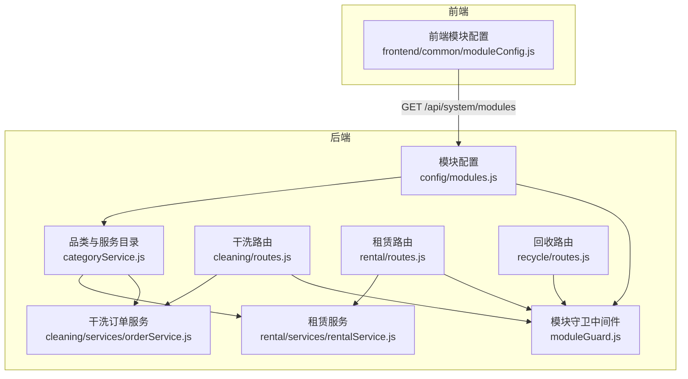
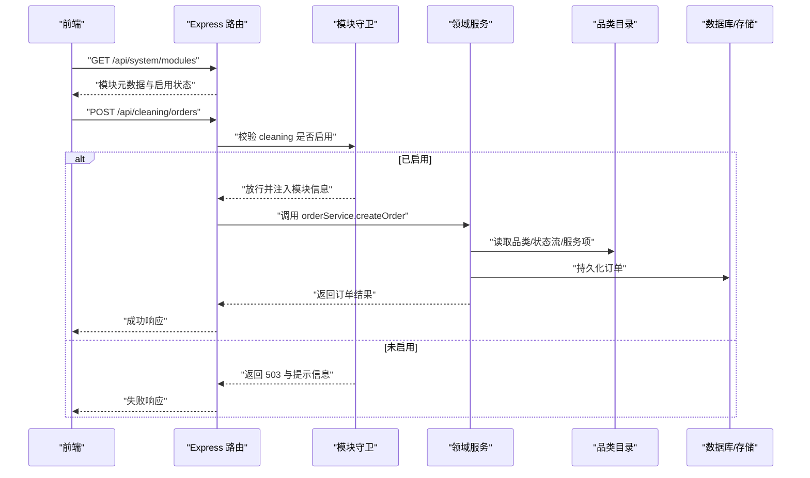
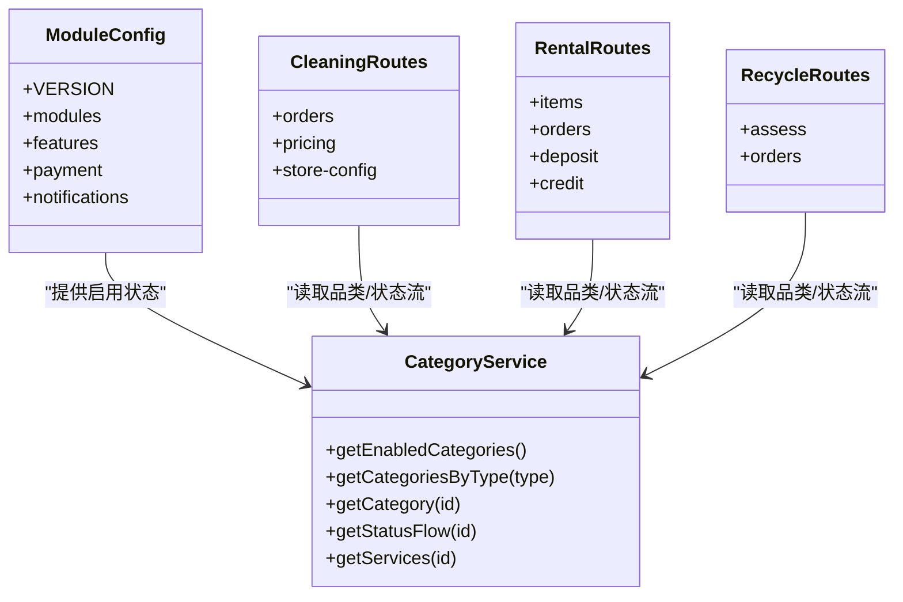
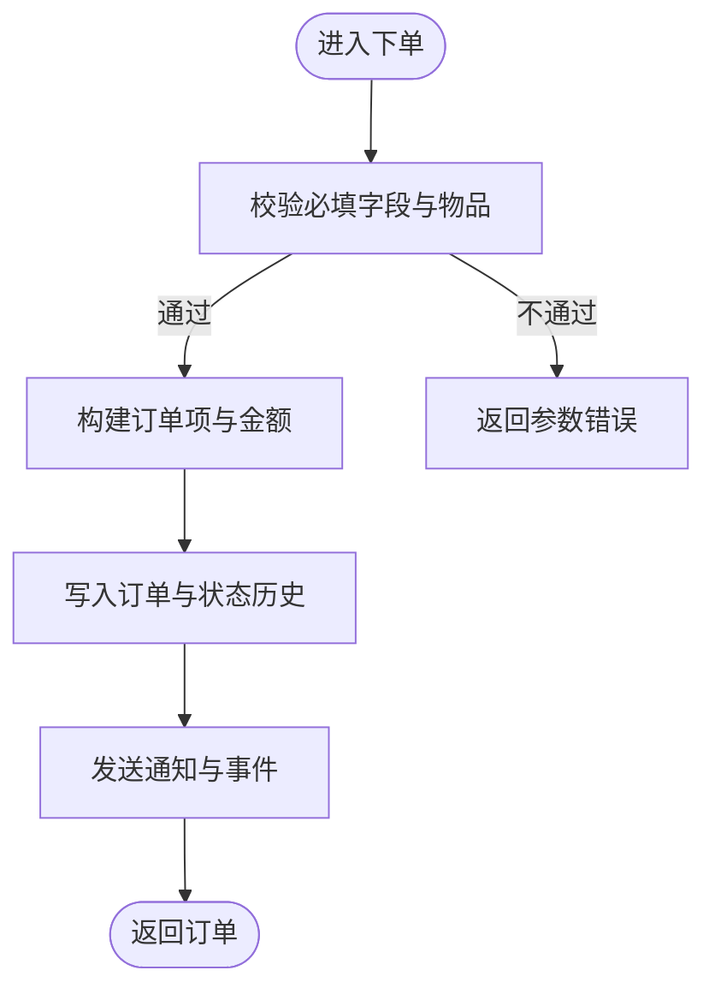
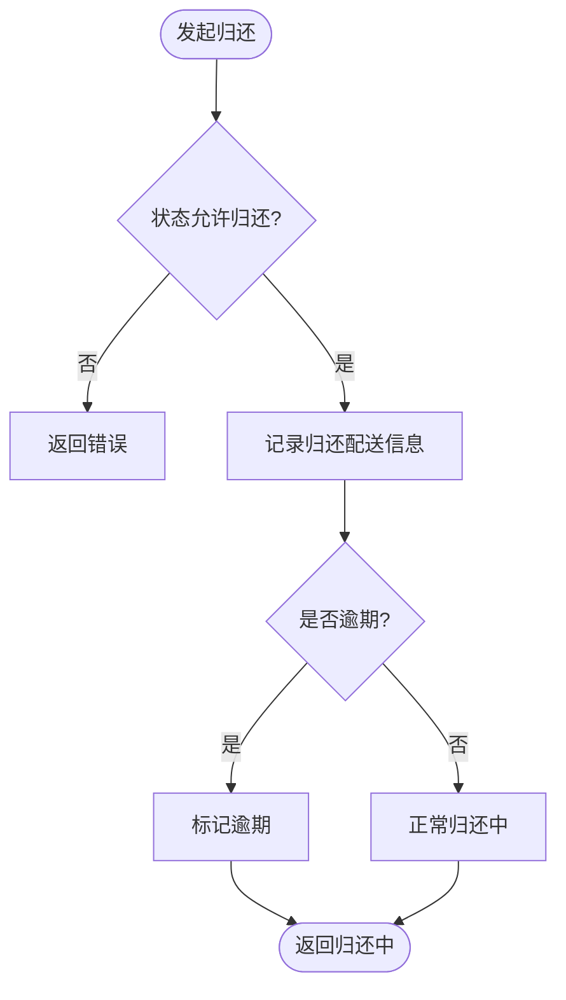
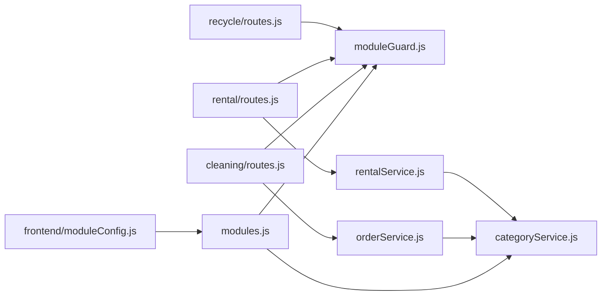

# 模块层次结构

<cite>
**本文引用的文件**   
- [backend/config/modules.js](file://backend/config/modules.js)
- [backend/modules/common/middlewares/moduleGuard.js](file://backend/modules/common/middlewares/moduleGuard.js)
- [backend/modules/cleaning/routes.js](file://backend/modules/cleaning/routes.js)
- [backend/modules/cleaning/services/orderService.js](file://backend/modules/cleaning/services/orderService.js)
- [backend/modules/rental/routes.js](file://backend/modules/rental/routes.js)
- [backend/modules/rental/services/rentalService.js](file://backend/modules/rental/services/rentalService.js)
- [backend/modules/recycle/routes.js](file://backend/modules/recycle/routes.js)
- [backend/modules/common/services/categoryService.js](file://backend/modules/common/services/categoryService.js)
- [frontend/common/moduleConfig.js](file://frontend/common/moduleConfig.js)
</cite>

## 目录
1. [简介](#简介)
2. [项目结构](#项目结构)
3. [核心组件](#核心组件)
4. [架构总览](#架构总览)
5. [详细组件分析](#详细组件分析)
6. [依赖关系分析](#依赖关系分析)
7. [性能与扩展性](#性能与扩展性)
8. [故障排查指南](#故障排查指南)
9. [结论](#结论)
10. [附录：开发者使用指南](#附录开发者使用指南)

## 简介
本文件系统化阐述干洗店管理系统的“基于业务领域的三层模块架构”：核心服务模块（cleaning、shoe_care、luxury_care 等）、租赁服务模块（rental、rental_leisure）和回收服务模块（recycle）。文档覆盖各模块职责边界、版本管理与启用状态控制、模块分类体系（service、rental、recycle）的设计原理，以及模块元数据配置（名称、图标、版本号、功能描述）的管理机制。同时提供模块层次图与数据流向说明，帮助开发者理解模块间依赖与通信模式，并给出不同业务场景下的模块组合策略与使用建议。

## 项目结构
系统采用模块化组织方式，后端以“模块路由 + 中间件守卫 + 领域服务”分层；前端通过统一模块配置动态渲染菜单与入口。关键路径如下：
- 模块开关与元数据：backend/config/modules.js
- 模块守卫中间件：backend/modules/common/middlewares/moduleGuard.js
- 品类与服务目录：backend/modules/common/services/categoryService.js
- 干洗模块：backend/modules/cleaning/routes.js, services/orderService.js
- 租赁模块：backend/modules/rental/routes.js, services/rentalService.js
- 回收模块：backend/modules/recycle/routes.js
- 前端模块配置：frontend/common/moduleConfig.js

图表来源
- [backend/config/modules.js:1-203](file://backend/config/modules.js#L1-L203)
- [backend/modules/common/middlewares/moduleGuard.js:1-84](file://backend/modules/common/middlewares/moduleGuard.js#L1-L84)
- [backend/modules/common/services/categoryService.js:1-289](file://backend/modules/common/services/categoryService.js#L1-L289)
- [backend/modules/cleaning/routes.js:1-800](file://backend/modules/cleaning/routes.js#L1-L800)
- [backend/modules/cleaning/services/orderService.js:1-800](file://backend/modules/cleaning/services/orderService.js#L1-L800)
- [backend/modules/rental/routes.js:1-156](file://backend/modules/rental/routes.js#L1-L156)
- [backend/modules/rental/services/rentalService.js:1-272](file://backend/modules/rental/services/rentalService.js#L1-L272)
- [backend/modules/recycle/routes.js:1-39](file://backend/modules/recycle/routes.js#L1-L39)
- [frontend/common/moduleConfig.js:1-191](file://frontend/common/moduleConfig.js#L1-L191)

章节来源
- [backend/config/modules.js:1-203](file://backend/config/modules.js#L1-L203)
- [backend/modules/common/middlewares/moduleGuard.js:1-84](file://backend/modules/common/middlewares/moduleGuard.js#L1-L84)
- [backend/modules/common/services/categoryService.js:1-289](file://backend/modules/common/services/categoryService.js#L1-L289)
- [backend/modules/cleaning/routes.js:1-800](file://backend/modules/cleaning/routes.js#L1-L800)
- [backend/modules/cleaning/services/orderService.js:1-800](file://backend/modules/cleaning/services/orderService.js#L1-L800)
- [backend/modules/rental/routes.js:1-156](file://backend/modules/rental/routes.js#L1-L156)
- [backend/modules/rental/services/rentalService.js:1-272](file://backend/modules/rental/services/rentalService.js#L1-L272)
- [backend/modules/recycle/routes.js:1-39](file://backend/modules/recycle/routes.js#L1-L39)
- [frontend/common/moduleConfig.js:1-191](file://frontend/common/moduleConfig.js#L1-L191)

## 核心组件
- 模块配置中心（modules.js）
  - 定义全局 VERSION、各模块 enabled/version/name/icon/message/launchDate、功能开关 features、支付分账 payment、通知模板 notifications。
  - 作为所有模块的权威来源，被守卫中间件与品类服务读取。
- 模块守卫中间件（moduleGuard.js）
  - 在路由层拦截未启用模块请求，返回友好提示（含 message/launchDate），并将模块元数据注入 req.module 与 req.moduleConfig。
- 品类与服务目录（categoryService.js）
  - 集中维护 service/rental/recycle 三类品类的元数据、状态流、服务项与价格信息，并按 modules.enabled 过滤可见性。
- 干洗模块（cleaning）
  - 完整实现订单生命周期、定价、门店配置同步、智能灯条联动、配送选择与支付等。
- 租赁模块（rental）
  - 双向跑腿模型：发货（门店→用户）与归还（用户→门店），包含押金与信用评估基础能力。
- 回收模块（recycle）
  - 预留接口，当前返回“即将上线”，等待 V2 实现。
- 前端模块配置（frontend/common/moduleConfig.js）
  - 从后端获取模块状态，缓存并降级到本地默认配置，动态生成菜单与首页入口。

章节来源
- [backend/config/modules.js:1-203](file://backend/config/modules.js#L1-L203)
- [backend/modules/common/middlewares/moduleGuard.js:1-84](file://backend/modules/common/middlewares/moduleGuard.js#L1-L84)
- [backend/modules/common/services/categoryService.js:1-289](file://backend/modules/common/services/categoryService.js#L1-L289)
- [backend/modules/cleaning/routes.js:1-800](file://backend/modules/cleaning/routes.js#L1-L800)
- [backend/modules/cleaning/services/orderService.js:1-800](file://backend/modules/cleaning/services/orderService.js#L1-L800)
- [backend/modules/rental/routes.js:1-156](file://backend/modules/rental/routes.js#L1-L156)
- [backend/modules/rental/services/rentalService.js:1-272](file://backend/modules/rental/services/rentalService.js#L1-L272)
- [backend/modules/recycle/routes.js:1-39](file://backend/modules/recycle/routes.js#L1-L39)
- [frontend/common/moduleConfig.js:1-191](file://frontend/common/moduleConfig.js#L1-L191)

## 架构总览
系统遵循“配置驱动 + 守卫拦截 + 领域服务”的分层设计：
- 配置层：modules.js 提供模块开关、版本、元数据与特性开关。
- 网关层：moduleGuard 对每个模块路由进行启用校验与错误响应。
- 领域层：cleaning/rental/recycle 各自路由与服务实现具体业务。
- 公共层：categoryService 提供跨模块的品类与服务目录，按启用状态过滤。
- 前端层：moduleConfig 拉取后端模块状态，动态渲染导航与入口。

图表来源
- [backend/config/modules.js:1-203](file://backend/config/modules.js#L1-L203)
- [backend/modules/common/middlewares/moduleGuard.js:1-84](file://backend/modules/common/middlewares/moduleGuard.js#L1-L84)
- [backend/modules/cleaning/routes.js:1-800](file://backend/modules/cleaning/routes.js#L1-L800)
- [backend/modules/cleaning/services/orderService.js:1-800](file://backend/modules/cleaning/services/orderService.js#L1-L800)
- [backend/modules/common/services/categoryService.js:1-289](file://backend/modules/common/services/categoryService.js#L1-L289)

## 详细组件分析

### 模块分类体系与设计原理
- 分类维度
  - service：传统服务型（取件→处理→送回），如 cleaning、shoe_care、luxury_care、pet_grooming、electronics_repair。
  - rental：租赁型（发货→使用中→归还），如 rental、rental_leisure。
  - recycle：回收型（估价→上门→结算），如 recycle（V2 预留）。
- 设计要点
  - 通过 category 字段区分业务模式，便于前端展示差异化流程与状态流。
  - 状态流 statusFlow 由品类目录集中定义，保证多端一致的用户体验。
  - 模块启用状态与品类可见性解耦：即使某品类存在，若对应模块 disabled，则不可见且不可用。

图表来源
- [backend/config/modules.js:1-203](file://backend/config/modules.js#L1-L203)
- [backend/modules/common/services/categoryService.js:1-289](file://backend/modules/common/services/categoryService.js#L1-L289)
- [backend/modules/cleaning/routes.js:1-800](file://backend/modules/cleaning/routes.js#L1-L800)
- [backend/modules/rental/routes.js:1-156](file://backend/modules/rental/routes.js#L1-L156)
- [backend/modules/recycle/routes.js:1-39](file://backend/modules/recycle/routes.js#L1-L39)

章节来源
- [backend/config/modules.js:1-203](file://backend/config/modules.js#L1-L203)
- [backend/modules/common/services/categoryService.js:1-289](file://backend/modules/common/services/categoryService.js#L1-L289)

### 干洗模块（cleaning）
- 职责边界
  - 订单全生命周期：创建、支付、收件、处理、完成、取件/配送、取消、删除（软删）。
  - 定价与促销：按门店配置计算折扣与总价。
  - 配送协同：选择跑腿服务商、支付配送费、扫码取件、一键取货、智能灯条联动。
- 关键流程（下单）

图表来源
- [backend/modules/cleaning/routes.js:1-800](file://backend/modules/cleaning/routes.js#L1-L800)
- [backend/modules/cleaning/services/orderService.js:1-800](file://backend/modules/cleaning/services/orderService.js#L1-L800)

章节来源
- [backend/modules/cleaning/routes.js:1-800](file://backend/modules/cleaning/routes.js#L1-L800)
- [backend/modules/cleaning/services/orderService.js:1-800](file://backend/modules/cleaning/services/orderService.js#L1-L800)

### 租赁模块（rental）
- 职责边界
  - 商品浏览与详情、预约下单、押金支付与退还、发货与收货确认、归还流程、逾期处理、信用评估。
- 双向跑腿模型
  - 第一程：门店→用户（发货）
  - 第二程：用户→门店（归还）
- 关键流程（归还）

图表来源
- [backend/modules/rental/routes.js:1-156](file://backend/modules/rental/routes.js#L1-L156)
- [backend/modules/rental/services/rentalService.js:1-272](file://backend/modules/rental/services/rentalService.js#L1-L272)

章节来源
- [backend/modules/rental/routes.js:1-156](file://backend/modules/rental/routes.js#L1-L156)
- [backend/modules/rental/services/rentalService.js:1-272](file://backend/modules/rental/services/rentalService.js#L1-L272)

### 回收模块（recycle）
- 职责边界
  - 当前为占位实现，所有接口返回“即将上线”。
- 未来规划
  - 估价、订单创建、上门回收、结算分账等能力将在 V2 逐步开放。

章节来源
- [backend/modules/recycle/routes.js:1-39](file://backend/modules/recycle/routes.js#L1-L39)

### 模块守卫与启用控制
- 行为
  - 未找到模块：404
  - 模块未启用：503，携带 message 与 launchDate
  - 启用：将模块元数据注入请求上下文，供后续逻辑使用
- 典型用法
  - 在各模块路由顶部挂载 router.use(moduleGuard('xxx'))

章节来源
- [backend/modules/common/middlewares/moduleGuard.js:1-84](file://backend/modules/common/middlewares/moduleGuard.js#L1-L84)
- [backend/modules/cleaning/routes.js:1-800](file://backend/modules/cleaning/routes.js#L1-L800)
- [backend/modules/rental/routes.js:1-156](file://backend/modules/rental/routes.js#L1-L156)
- [backend/modules/recycle/routes.js:1-39](file://backend/modules/recycle/routes.js#L1-L39)

### 前端模块配置与动态渲染
- 能力
  - 从后端 /api/system/modules 拉取模块状态，带缓存与降级策略
  - 根据 enabled 动态生成侧边栏菜单与首页入口
- 关键点
  - 本地默认配置用于网络异常时的降级显示
  - 禁用模块点击时弹出“服务暂未开放”提示

章节来源
- [frontend/common/moduleConfig.js:1-191](file://frontend/common/moduleConfig.js#L1-L191)

## 依赖关系分析
- 模块配置为中心
  - moduleGuard 与 categoryService 均依赖 modules.js 的启用状态与元数据。
- 路由到服务
  - cleaning/rental/recycle 路由分别依赖各自服务实现，并在需要时读取品类目录。
- 前后端交互
  - 前端通过 /api/system/modules 获取模块状态，结合本地缓存渲染界面。

图表来源
- [backend/config/modules.js:1-203](file://backend/config/modules.js#L1-L203)
- [backend/modules/common/middlewares/moduleGuard.js:1-84](file://backend/modules/common/middlewares/moduleGuard.js#L1-L84)
- [backend/modules/common/services/categoryService.js:1-289](file://backend/modules/common/services/categoryService.js#L1-L289)
- [backend/modules/cleaning/routes.js:1-800](file://backend/modules/cleaning/routes.js#L1-L800)
- [backend/modules/cleaning/services/orderService.js:1-800](file://backend/modules/cleaning/services/orderService.js#L1-L800)
- [backend/modules/rental/routes.js:1-156](file://backend/modules/rental/routes.js#L1-L156)
- [backend/modules/rental/services/rentalService.js:1-272](file://backend/modules/rental/services/rentalService.js#L1-L272)
- [backend/modules/recycle/routes.js:1-39](file://backend/modules/recycle/routes.js#L1-L39)
- [frontend/common/moduleConfig.js:1-191](file://frontend/common/moduleConfig.js#L1-L191)

## 性能与扩展性
- 性能
  - 前端模块配置具备 5 分钟缓存，降低频繁请求开销。
  - 干洗订单查询支持分页与索引优化（userId、storeId、status 等）。
- 扩展性
  - 新增品类只需在 categoryService 中注册，并在 modules.js 中启用即可。
  - 新模块可通过新建 routes + services 并在 modules.js 中声明，无需改动现有模块。

[本节为通用指导，不涉及具体文件分析]

## 故障排查指南
- 常见错误
  - 503 服务不可用：模块未启用或尚未发布，检查 modules.js 中 enabled 与 message/launchDate。
  - 404 模块不存在：模块名拼写错误或未在 modules.js 中定义。
  - 前端无菜单：确认 /api/system/modules 返回 success 且目标模块 enabled=true。
- 定位步骤
  - 查看模块守卫返回的错误码与消息。
  - 核对品类目录中对应 id 是否存在且未被过滤。
  - 检查前端缓存是否过期，尝试强制刷新。

章节来源
- [backend/modules/common/middlewares/moduleGuard.js:1-84](file://backend/modules/common/middlewares/moduleGuard.js#L1-L84)
- [frontend/common/moduleConfig.js:1-191](file://frontend/common/moduleConfig.js#L1-L191)

## 结论
本系统通过统一的模块配置与守卫机制，实现了清晰的职责边界与灵活的启用控制；品类与服务目录集中管理，确保多端一致的状态流与展示。干洗模块已完整落地，租赁模块具备双向跑腿与押金/信用基础能力，回收模块预留接口待 V2 开放。该架构具备良好的可扩展性与可维护性，适合在不同业务阶段按需启用与组合。

[本节为总结性内容，不涉及具体文件分析]

## 附录：开发者使用指南

### 模块元数据配置（名称、图标、版本号、功能描述）
- 位置：backend/config/modules.js
- 关键字段
  - enabled：是否启用
  - version：模块版本
  - name/nameEn：中英文名称
  - icon：图标标识
  - message/launchDate：未启用时的提示与上线时间
- 使用方式
  - 修改后重启后端生效；前端通过 /api/system/modules 自动感知变化。

章节来源
- [backend/config/modules.js:1-203](file://backend/config/modules.js#L1-L203)

### 模块启用与禁用
- 后端
  - 在 modules.js 中设置 enabled=false，访问对应路由将返回 503 与提示。
- 前端
  - 根据返回的 enabled 决定是否渲染菜单与入口；禁用项点击会提示“服务暂未开放”。

章节来源
- [backend/modules/common/middlewares/moduleGuard.js:1-84](file://backend/modules/common/middlewares/moduleGuard.js#L1-L84)
- [frontend/common/moduleConfig.js:1-191](file://frontend/common/moduleConfig.js#L1-L191)

### 品类与服务目录
- 新增品类
  - 在 categoryService.js 中增加条目（id、name、icon、category、statusFlow、services）。
  - 在 modules.js 中为该 id 开启 enabled。
- 查询接口
  - getEnabledCategories/getCategoriesByType/getStatusFlow/getServices 等。

章节来源
- [backend/modules/common/services/categoryService.js:1-289](file://backend/modules/common/services/categoryService.js#L1-L289)

### 模块选择与组合策略
- 单店基础版
  - 仅启用 cleaning，快速上线核心干洗业务。
- 综合生活服务中心
  - 启用 cleaning + shoe_care + luxury_care + pet_grooming + electronics_repair，覆盖多品类服务。
- 租赁生态
  - 启用 rental/rental_leisure，配合 deposit/credit 功能，形成“租+还+押金+信用”闭环。
- 绿色循环
  - 在 V2 开放 recycle，打通“估价-上门-结算”，完善可持续业务线。

[本节为概念性指导，不涉及具体文件分析]